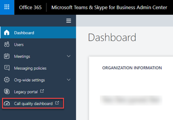
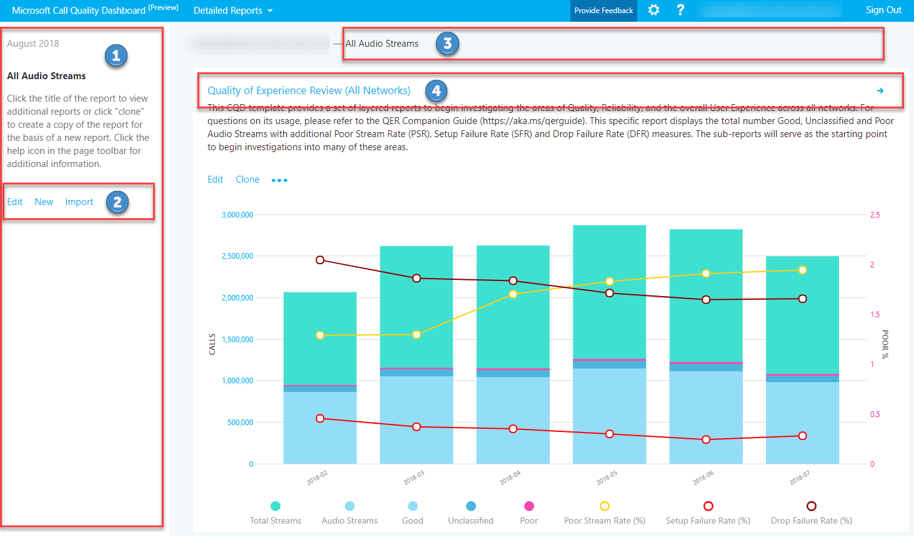
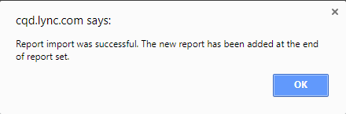
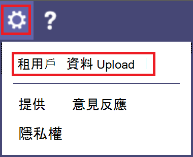
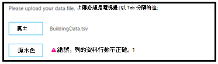
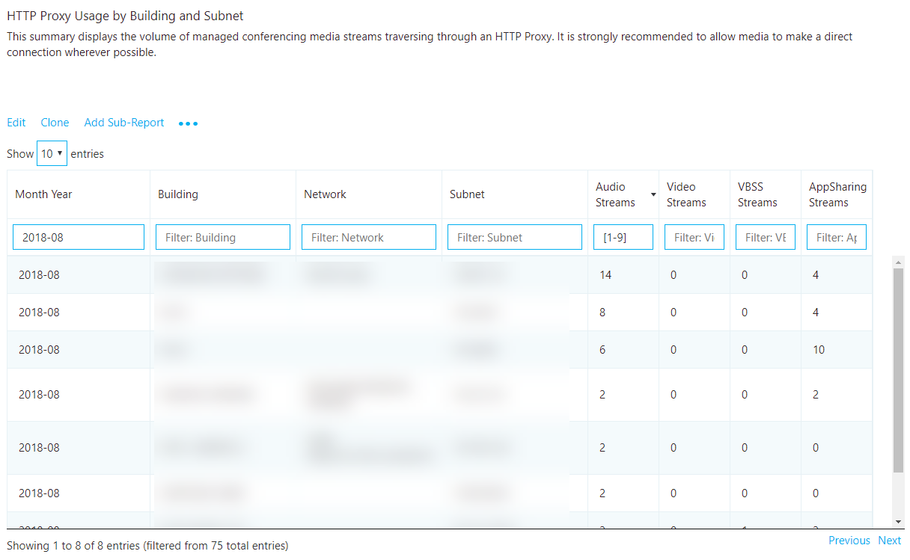
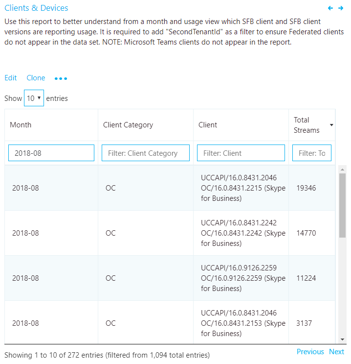
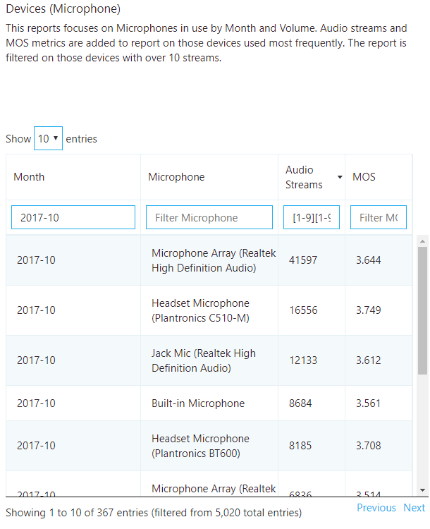

# <a name="quality-of-experience-review-guide"></a><span data-ttu-id="889a5-103">經驗品質回顧指南</span><span class="sxs-lookup"><span data-stu-id="889a5-103">Quality of Experience Review Guide</span></span>

<!-- Note that this link to the Word doc is intentionally NOT the aka.ms/qerquide link -->
<span data-ttu-id="889a5-104">本指南針對 Microsoft 團隊和商務用 Skype Online 的 [磁片磁碟機值] 階段。</span><span class="sxs-lookup"><span data-stu-id="889a5-104">This guide is about the Drive Value phase for Microsoft Teams and Skype for Business Online.</span></span> <span data-ttu-id="889a5-105">您可以下載本指南的[Word 版本](https://github.com/MicrosoftDocs/OfficeDocs-SkypeForBusiness/blob/live/Teams/downloads/quality-of-experience-review-guide.docx?raw=true)。</span><span class="sxs-lookup"><span data-stu-id="889a5-105">You can [download a Word version](https://github.com/MicrosoftDocs/OfficeDocs-SkypeForBusiness/blob/live/Teams/downloads/quality-of-experience-review-guide.docx?raw=true) of this guide.</span></span>

## <a name="introduction"></a><span data-ttu-id="889a5-106">簡介</span><span class="sxs-lookup"><span data-stu-id="889a5-106">Introduction</span></span>

<span data-ttu-id="889a5-107">若要對改善使用者體驗帶來最大的影響，組織必須 operationalize 下圖所示的主要區域。</span><span class="sxs-lookup"><span data-stu-id="889a5-107">To have the greatest impact on improving the user experience, organizations need to operationalize the key areas that are shown in the following figure.</span></span> <span data-ttu-id="889a5-108">其他區域包括識別操作工作、針對品質指標建立目標、ascertaining 度量組織成功的標準，以及視需要將調查區域縮小。</span><span class="sxs-lookup"><span data-stu-id="889a5-108">Additional areas include identifying operational tasks, establishing targets for quality metrics, ascertaining the metrics to use to gauge organizational success, and narrowing areas of investigation as needed.</span></span>


<span data-ttu-id="889a5-109"></span><span class="sxs-lookup"><span data-stu-id="889a5-109"></span></span>

<span data-ttu-id="889a5-110">_圖 1-本指南涵蓋的主要操作區域_</span><span class="sxs-lookup"><span data-stu-id="889a5-110">_Figure 1 - Key operational areas covered throughout this guide_</span></span>

<span data-ttu-id="889a5-111">透過連續評估與修正本指南中所述的區域，您可以減少對使用者體驗品質產生負面影響的可能性。</span><span class="sxs-lookup"><span data-stu-id="889a5-111">By continually assessing and remediating the areas described in this guide, you can reduce their potential to negatively affect the quality of your users’ experience.</span></span> <span data-ttu-id="889a5-112">在部署中遇到的大多數使用者體驗問題，都可以分為下列類別：</span><span class="sxs-lookup"><span data-stu-id="889a5-112">Most user-experience problems encountered in a deployment can be grouped into the following categories:</span></span>

-   <span data-ttu-id="889a5-113">防火牆或 proxy 配置不完整</span><span class="sxs-lookup"><span data-stu-id="889a5-113">Incomplete firewall or proxy configuration</span></span>
-   <span data-ttu-id="889a5-114">低 wi-fi 覆蓋範圍</span><span class="sxs-lookup"><span data-stu-id="889a5-114">Poor Wi-Fi coverage</span></span>
-   <span data-ttu-id="889a5-115">頻寬不足</span><span class="sxs-lookup"><span data-stu-id="889a5-115">Insufficient bandwidth</span></span>
-   <span data-ttu-id="889a5-116">點對點</span><span class="sxs-lookup"><span data-stu-id="889a5-116">VPN</span></span>
-   <span data-ttu-id="889a5-117">用戶端版本與驅動程式不一致或過時</span><span class="sxs-lookup"><span data-stu-id="889a5-117">Inconsistent or outdated client versions and drivers</span></span>
-   <span data-ttu-id="889a5-118">未優化或內建音訊裝置</span><span class="sxs-lookup"><span data-stu-id="889a5-118">Unoptimized or built-in audio devices</span></span>
-   <span data-ttu-id="889a5-119">有問題的子網或網路裝置</span><span class="sxs-lookup"><span data-stu-id="889a5-119">Problematic subnets or network devices</span></span>

<span data-ttu-id="889a5-120">在部署團隊或商務用 Skype Online 前，請先進行適當的規劃與設計，您就可以減少維持高品質體驗所需的工作量。</span><span class="sxs-lookup"><span data-stu-id="889a5-120">Through proper planning and design before deploying Teams or Skype for Business Online, you can reduce the amount of effort that will be required to maintain high-quality experiences.</span></span>

<span data-ttu-id="889a5-121">本指南的重點是使用 [通話品質儀表板] （CQD）線上作為主要工具來報告及調查每一個區域，並在音訊上特別強調最大化採納與影響。</span><span class="sxs-lookup"><span data-stu-id="889a5-121">This guide focuses on using the Call Quality Dashboard (CQD) Online as the primary tool to report and investigate each area, with a special emphasis on audio to maximize adoption and impact.</span></span> <span data-ttu-id="889a5-122">針對改善音訊體驗的網路所做的任何改善，也會直接翻譯成影片與桌面共用的改良功能。</span><span class="sxs-lookup"><span data-stu-id="889a5-122">Any improvements made to the network to improve the audio experience will also directly translate to improvements in video and desktop sharing.</span></span>

<span data-ttu-id="889a5-123">為加速您的評估，提供[兩個策劃 CQD 範本](https://aka.ms/qertemplates)：一個用於管理所有網路，而另一個則只針對受管理（內部）網路篩選。</span><span class="sxs-lookup"><span data-stu-id="889a5-123">To accelerate your assessment, [two curated CQD templates](https://aka.ms/qertemplates) are provided: one is for managing all networks and the other is filtered for managed (internal) networks only.</span></span> <span data-ttu-id="889a5-124">雖然所有網路範本報告都設定為顯示建立和網路資訊，但是當您在收集與上傳資訊時，仍然可以使用它們。</span><span class="sxs-lookup"><span data-stu-id="889a5-124">Although the All Networks template reports are configured to display building and network information, they can still be used while you work toward collecting and uploading building information.</span></span> <span data-ttu-id="889a5-125">將組建資訊上傳到 CQD，可讓服務在與外部子網區分內部的同時，透過新增自訂的建築物、網路和位置資訊來加強報告。</span><span class="sxs-lookup"><span data-stu-id="889a5-125">Uploading building information into CQD enables the service to enhance reporting by adding custom building, network, and location information while differentiating internal from external subnets.</span></span> <span data-ttu-id="889a5-126">如需詳細資訊，請參閱本指南稍後的[建立對應](#building-mapping)。</span><span class="sxs-lookup"><span data-stu-id="889a5-126">For more information, see [Building mapping](#building-mapping) later in this guide.</span></span>

### <a name="intended-audience"></a><span data-ttu-id="889a5-127">目標物件</span><span class="sxs-lookup"><span data-stu-id="889a5-127">Intended audience</span></span>

<span data-ttu-id="889a5-128">本指南專供合作夥伴與客戶干係人使用，其中包含共同作業主管/架構師、顧問、變更管理/採納專家、支援/技術支援人員、網路組長、桌面組長及 IT 系統管理員等角色。</span><span class="sxs-lookup"><span data-stu-id="889a5-128">This guide is intended to be used by partner and customer stakeholders with roles such as Collaboration Lead/Architect, Consultant, Change Management/Adoption Specialist, Support/Help Desk Lead, Network Lead, Desktop Lead, and IT Admin.</span></span>

<span data-ttu-id="889a5-129">本指南也專供指定的品質擁護者使用。</span><span class="sxs-lookup"><span data-stu-id="889a5-129">This guide is also intended to be used by the designated quality champion(s).</span></span> <span data-ttu-id="889a5-130">如需詳細資訊，請參閱[品質擁護者角色](4-envision-plan-my-service-management.md#the-quality-champion-role)。</span><span class="sxs-lookup"><span data-stu-id="889a5-130">For more information, see [the Quality Champion role](4-envision-plan-my-service-management.md#the-quality-champion-role).</span></span>

## <a name="prerequisites"></a><span data-ttu-id="889a5-131">先決條件</span><span class="sxs-lookup"><span data-stu-id="889a5-131">Prerequisites</span></span>

<span data-ttu-id="889a5-132">使用本指南前，請確定您已指派適當的租使用者[角色](https://docs.microsoft.com/office365/admin/add-users/about-admin-roles)，以便存取 CQD。</span><span class="sxs-lookup"><span data-stu-id="889a5-132">Before using this guide, make sure you have the proper tenant [roles](https://docs.microsoft.com/office365/admin/add-users/about-admin-roles) assigned so that you can access CQD.</span></span>

-   <span data-ttu-id="889a5-133">**Office 365 全域系統管理員角色**</span><span class="sxs-lookup"><span data-stu-id="889a5-133">**Office 365 Global Administrator role**</span></span> 

-   <span data-ttu-id="889a5-134">**商務用 Skype 系統管理員角色**</span><span class="sxs-lookup"><span data-stu-id="889a5-134">**Skype for Business Administrator role**</span></span> 

-   <span data-ttu-id="889a5-135">**團隊服務管理員角色**</span><span class="sxs-lookup"><span data-stu-id="889a5-135">**Teams Service Administrator role**</span></span> 

-   <span data-ttu-id="889a5-136">**團隊溝通支援工程師角色**</span><span class="sxs-lookup"><span data-stu-id="889a5-136">**Teams Communications Support Engineer role**</span></span> 

-   <span data-ttu-id="889a5-137">**團隊溝通支援專家角色**</span><span class="sxs-lookup"><span data-stu-id="889a5-137">**Teams Communications Support Specialist role**</span></span> 

<span data-ttu-id="889a5-138">或者，您可以將下列角色指派給 Office 365 使用者帳戶，只允許存取報告功能。</span><span class="sxs-lookup"><span data-stu-id="889a5-138">Alternatively, you can assign the following role to an Office 365 user account to allow access to reporting features only.</span></span>

-   <span data-ttu-id="889a5-139">**報告閱讀程式：** 可以在系統管理中心中查看所有[活動報告](https://support.office.com/article/activity-reports-0d6dfb17-8582-4172-a9a9-aed798150263)、 [Microsoft 365 採用內容套件](https://support.office.com/article/Office-365-Adoption-content-pack-77ff780d-ab19-4553-adea-09cb65ad0f1f)中的任何報告，以及 CQD 報告。</span><span class="sxs-lookup"><span data-stu-id="889a5-139">**Reports Reader:** Can view all the [activity reports](https://support.office.com/article/activity-reports-0d6dfb17-8582-4172-a9a9-aed798150263) In the admin center, any reports from the [Microsoft 365 Adoption content pack](https://support.office.com/article/Office-365-Adoption-content-pack-77ff780d-ab19-4553-adea-09cb65ad0f1f), and CQD reports.</span></span>

## <a name="what-is-quality"></a><span data-ttu-id="889a5-140">什麼是品質？</span><span class="sxs-lookup"><span data-stu-id="889a5-140">What is quality?</span></span>

<span data-ttu-id="889a5-141">當您在小組和商務用 Skype 中討論品質時，請務必定義一個術語來達成共同的認識。</span><span class="sxs-lookup"><span data-stu-id="889a5-141">When discussing quality in Teams and Skype for Business, it’s important to define the term to achieve a common understanding.</span></span> <span data-ttu-id="889a5-142">如這裡所定義的品質，是服務規格與使用者經驗的結合。</span><span class="sxs-lookup"><span data-stu-id="889a5-142">Quality, as defined here, is a combination of service metrics and user experience.</span></span>

<!-- Note: need to update graphic-->
<span data-ttu-id="889a5-143"></span><span class="sxs-lookup"><span data-stu-id="889a5-143"></span></span>

<span data-ttu-id="889a5-144">_圖 2-什麼是品質？_</span><span class="sxs-lookup"><span data-stu-id="889a5-144">_Figure 2 - What is quality?_</span></span>

### <a name="service-metrics"></a><span data-ttu-id="889a5-145">服務度量單位</span><span class="sxs-lookup"><span data-stu-id="889a5-145">Service metrics</span></span>

<span data-ttu-id="889a5-146">服務度量單位是由特定的用戶端測量標準所組成。</span><span class="sxs-lookup"><span data-stu-id="889a5-146">Service metrics consist of specific client-based metrics.</span></span> <span data-ttu-id="889a5-147">在每次通話期間，用戶端會收集通話的遙測資訊，並在每次通話結束後提交報告，以便日後可透過 CQD 或[呼叫分析](https://techcommunity.microsoft.com/t5/Skype-for-Business-Blog/Introducing-Call-Analytics/ba-p/57309)進行存取。</span><span class="sxs-lookup"><span data-stu-id="889a5-147">During each call, the client collects telemetry information about the call and submits a report at the end of each call that can be later accessed through CQD or [Call Analytics](https://techcommunity.microsoft.com/t5/Skype-for-Business-Blog/Introducing-Call-Analytics/ba-p/57309).</span></span> <span data-ttu-id="889a5-148">這些指標包括：</span><span class="sxs-lookup"><span data-stu-id="889a5-148">These metrics include:</span></span>

-   <span data-ttu-id="889a5-149">較差的串流速率</span><span class="sxs-lookup"><span data-stu-id="889a5-149">Poor Stream Rate</span></span>
-   <span data-ttu-id="889a5-150">設定失敗率</span><span class="sxs-lookup"><span data-stu-id="889a5-150">Setup Failure Rate</span></span>
-   <span data-ttu-id="889a5-151">丟單失敗率</span><span class="sxs-lookup"><span data-stu-id="889a5-151">Drop Failure Rate</span></span>


#### <a name="poor-stream-rate"></a><span data-ttu-id="889a5-152">較差的串流速率</span><span class="sxs-lookup"><span data-stu-id="889a5-152">Poor Stream Rate</span></span>

<span data-ttu-id="889a5-153">較差的串流速率（PSR.EXE）代表組織中品質較差的資料流程總百分比。</span><span class="sxs-lookup"><span data-stu-id="889a5-153">The poor stream rate (PSR) represents the organization’s overall percentage of streams that have poor quality.</span></span> <span data-ttu-id="889a5-154">這個指標是要醒目提示貴組織在哪些區域中，您的組織能專注于減少此值並改善使用者體驗等最大的影響，這就是為什麼在查看 PSR.EXE 時， [managed 網路](#managed-vs-unmanaged-networks)是主要的焦點。</span><span class="sxs-lookup"><span data-stu-id="889a5-154">This metric is meant to highlight areas where your organization can concentrate effort to have the strongest impact toward reducing this value and improving the user experience, which is why [managed networks](#managed-vs-unmanaged-networks) are the primary focus when looking at PSR.</span></span> <span data-ttu-id="889a5-155">外部使用者也很重要，但調查會因組織而異。</span><span class="sxs-lookup"><span data-stu-id="889a5-155">External users are important too, but investigation differs on an organizational basis.</span></span> <span data-ttu-id="889a5-156">考慮為外部使用者提供最佳做法，並獨立于整體組織調查外部通話。</span><span class="sxs-lookup"><span data-stu-id="889a5-156">Consider providing best practices for external users, and investigate external calls independently from the overall organization.</span></span>

<span data-ttu-id="889a5-157">CQD 中的實際度量單位依工作負載而有所不同，但為了讓品質體驗進行評審，我們主要將重點放在_音訊不佳的百分比_測量中。</span><span class="sxs-lookup"><span data-stu-id="889a5-157">The actual measurement in CQD varies by workload, but for the purposes of the Quality Experience Review we focus primarily on the _Audio Poor Percentage_ measurement.</span></span> <span data-ttu-id="889a5-158">PSR.EXE 是由下表所述的五個網路度量值所組成。</span><span class="sxs-lookup"><span data-stu-id="889a5-158">PSR is made up of the five network metric averages described in the following table.</span></span> <span data-ttu-id="889a5-159">針對要分類為較差的資料流程，只有一個公制需要超過定義的閾值。</span><span class="sxs-lookup"><span data-stu-id="889a5-159">For a stream to be classified as poor, only one metric needs to exceed the defined threshold.</span></span> <span data-ttu-id="889a5-160">如需有關資料流程分類程式的詳細資訊，請參閱[這篇文章](stream-classification-in-call-quality-dashboard.md)。</span><span class="sxs-lookup"><span data-stu-id="889a5-160">For more information about the stream classification process, see [this article](stream-classification-in-call-quality-dashboard.md).</span></span>

> [!Note]
> <span data-ttu-id="889a5-161">CQD 提供「不佳的原因 ...」</span><span class="sxs-lookup"><span data-stu-id="889a5-161">CQD provides the “Poor Due To…”</span></span> <span data-ttu-id="889a5-162">測量，以更清楚地瞭解哪個條件導致資料流程分類為較差。</span><span class="sxs-lookup"><span data-stu-id="889a5-162">measurements to better understand what condition caused the stream to be classified as poor.</span></span>


<span data-ttu-id="889a5-163">_表格 1-音訊品質不佳的指標_</span><span class="sxs-lookup"><span data-stu-id="889a5-163">_Table 1 - Audio poor quality metrics_</span></span>

| <span data-ttu-id="889a5-164">公制平均值</span><span class="sxs-lookup"><span data-stu-id="889a5-164">Metric average</span></span>     | <span data-ttu-id="889a5-165">說明</span><span class="sxs-lookup"><span data-stu-id="889a5-165">Description</span></span>     | <span data-ttu-id="889a5-166">使用者體驗</span><span class="sxs-lookup"><span data-stu-id="889a5-166">User experience</span></span> |
|-------------|-----------------|-----------------|
| <span data-ttu-id="889a5-167">抖動\>30 毫秒</span><span class="sxs-lookup"><span data-stu-id="889a5-167">Jitter \>30 ms</span></span>        | <span data-ttu-id="889a5-168">這是連續資料包之間延遲的平均變更。</span><span class="sxs-lookup"><span data-stu-id="889a5-168">This is the average change in delay between successive packets.</span></span> <span data-ttu-id="889a5-169">團隊和商務用 Skype 可透過緩衝來適應某些層級的抖動。</span><span class="sxs-lookup"><span data-stu-id="889a5-169">Teams and Skype for Business can adapt to some levels of jitter through buffering.</span></span> <span data-ttu-id="889a5-170">只有抖動超過參與者通知抖動效果的緩衝時才是如此。</span><span class="sxs-lookup"><span data-stu-id="889a5-170">It’s only when the jitter exceeds the buffering that a participant notices the effects of jitter.</span></span>      | <span data-ttu-id="889a5-171">以不同速度傳入的資料包會導致演講者的語音音效機器人。</span><span class="sxs-lookup"><span data-stu-id="889a5-171">The packets arriving at different speeds cause a speaker’s voice to sound robotic.</span></span>   |
| <span data-ttu-id="889a5-172">資料包遺失率\>10% 或0。1</span><span class="sxs-lookup"><span data-stu-id="889a5-172">Packet loss rate \>10% or 0.1</span></span>        | <span data-ttu-id="889a5-173">這通常會定義為遺失的資料包百分比。</span><span class="sxs-lookup"><span data-stu-id="889a5-173">This is often defined as a percentage of packets that are lost.</span></span> <span data-ttu-id="889a5-174">資料包遺失會直接影響音訊品質-從較小、個別的遺失包，這些資料包幾乎不會影響到導致音訊完全剪下的後置脈衝損失。</span><span class="sxs-lookup"><span data-stu-id="889a5-174">Packet loss directly affects audio quality—from small, individual lost packets that have almost no impact to back-to-back burst losses that cause audio to cut out completely.</span></span>     | <span data-ttu-id="889a5-175">丟棄且未送達預期目的地的資料包會引起媒體中的差距，導致不想要的音節與單字，以及不連貫的影片和共用。</span><span class="sxs-lookup"><span data-stu-id="889a5-175">The packets being dropped and not arriving at their intended destination cause gaps in the media, resulting in missed syllables and words, and choppy video and sharing.</span></span> |
| <span data-ttu-id="889a5-176">雙程時間\>500 ms</span><span class="sxs-lookup"><span data-stu-id="889a5-176">Round-trip time \>500 ms</span></span>        | <span data-ttu-id="889a5-177">這是取得從 A 指向點 B 並回到點 A 的 IP 資料包所需的時間。此網路傳播延遲會與兩個點之間的物理距離和光線速度之間的距離相關，並包括網路路徑中各種裝置所佔用的額外額外負荷。</span><span class="sxs-lookup"><span data-stu-id="889a5-177">This is the time it takes to get an IP packet from point A to point B and back to point A. This network propagation delay is tied to the physical distance between the two points and the speed of light, and includes additional overhead taken by the various devices in the network path.</span></span>      | <span data-ttu-id="889a5-178">資料包太長而無法送達目的地會導致 walkie talkie 的效果。</span><span class="sxs-lookup"><span data-stu-id="889a5-178">The packets taking too long to arrive at their destination cause a walkie-talkie effect.</span></span>   |
| <span data-ttu-id="889a5-179">NMOS 下降平均值\>1。0</span><span class="sxs-lookup"><span data-stu-id="889a5-179">NMOS degradation average \>1.0</span></span>         | <span data-ttu-id="889a5-180">資料流程的平均[網路平均觀念成績（NMOS）](https://docs.microsoft.com/previous-versions/office/communications-server/bb894481(v=office.12)#network-mos)下降。</span><span class="sxs-lookup"><span data-stu-id="889a5-180">Average [Network Mean Opinion Score (NMOS)](https://docs.microsoft.com/previous-versions/office/communications-server/bb894481(v=office.12)#network-mos) degradation for the stream.</span></span> <span data-ttu-id="889a5-181">代表網路遺失和抖動對導致 NMOS 下降的音訊品質有多大的影響。</span><span class="sxs-lookup"><span data-stu-id="889a5-181">Represents how much the network loss and jitter has affected the quality of received audio that caused the NMOS to drop by more than one point.</span></span> | <span data-ttu-id="889a5-182">這會結合抖動、資料包遺失，以及較低的程度，增加往返時間。</span><span class="sxs-lookup"><span data-stu-id="889a5-182">This is a combination of jitter, packet loss, and—to a lesser degree—increased round-trip time.</span></span> <span data-ttu-id="889a5-183">使用者可能會遇到這些問題的組合。</span><span class="sxs-lookup"><span data-stu-id="889a5-183">The user might be experiencing a combination of these symptoms.</span></span>   |
| <span data-ttu-id="889a5-184">隱藏樣本\>7% 或0.07 的平均比率</span><span class="sxs-lookup"><span data-stu-id="889a5-184">Average ratio of concealed samples \>7% or 0.07</span></span> | <span data-ttu-id="889a5-185">音訊幀數的平均比率，由資料包遺失修複產生的隱藏範例，到音訊畫面總數目。</span><span class="sxs-lookup"><span data-stu-id="889a5-185">Average ratio of the number of audio frames with concealed samples generated by packet loss healing to the total number of audio frames.</span></span> <span data-ttu-id="889a5-186">隱藏的音訊範例是一種技術，用來平滑通常是由網路資料包所造成的突然轉場。</span><span class="sxs-lookup"><span data-stu-id="889a5-186">A concealed audio sample is a technique used to smooth out the abrupt transition that would usually be caused by dropped network packets.</span></span>      | <span data-ttu-id="889a5-187">[高值] 表示已套用大量的 [損失 concealment]，並產生扭曲或遺失的音訊。</span><span class="sxs-lookup"><span data-stu-id="889a5-187">High values indicate that significant levels of loss concealment were applied and resulted in distorted or lost audio.</span></span>     |

#### <a name="setup-failure-rate"></a><span data-ttu-id="889a5-188">設定失敗率</span><span class="sxs-lookup"><span data-stu-id="889a5-188">Setup Failure Rate</span></span>

<span data-ttu-id="889a5-189">設定失敗率（亦即在 CQD 中的_呼叫設定失敗百分比_測量）是在通話開始時端點之間無法建立媒體路徑的串流數。</span><span class="sxs-lookup"><span data-stu-id="889a5-189">The setup failure rate, otherwise known as the _Total Call Setup Failure Percentage_ measurement in CQD, is the number of streams where the media path couldn’t be established between the endpoints at the start of the call.</span></span>

<span data-ttu-id="889a5-190">這代表無法建立的任何媒體資料流程。</span><span class="sxs-lookup"><span data-stu-id="889a5-190">This represents any media stream that couldn’t be established.</span></span> <span data-ttu-id="889a5-191">根據此處測量的使用者經驗影響的嚴重性，目標是將此值縮小至盡可能接近零。</span><span class="sxs-lookup"><span data-stu-id="889a5-191">Given the severity of the impact on the user experience measured here, the goal is to reduce this value to as close to zero as possible.</span></span> <span data-ttu-id="889a5-192">這個指標的高值在新部署中的防火牆規則不完整的情況下比較常見，但請務必定期觀看。</span><span class="sxs-lookup"><span data-stu-id="889a5-192">A high value for this metric is more common in new deployments with incomplete firewall rules than a mature deployment, but it’s still important to watch on a regular basis.</span></span>

<span data-ttu-id="889a5-193">這個指標是透過取得失敗的資料流程總數除以提交成功呼叫詳細資料記錄（CDR）的總串流數來計算：</span><span class="sxs-lookup"><span data-stu-id="889a5-193">This metric is calculated by taking the total number of streams that failed to set up divided by the total number of streams that submitted a successful call detail record (CDR):</span></span>

-   <span data-ttu-id="889a5-194">**設定失敗率**= 總的通話設定失敗資料流程計數/總 CDR 可用資料流程計數</span><span class="sxs-lookup"><span data-stu-id="889a5-194">**Setup Failure Rate** = Total Call Setup Failed Stream Count / Total CDR Available Stream Count</span></span>

#### <a name="drop-failure-rate"></a><span data-ttu-id="889a5-195">丟單失敗率</span><span class="sxs-lookup"><span data-stu-id="889a5-195">Drop Failure Rate</span></span>

<span data-ttu-id="889a5-196">在 CQD 中，擊落失敗率（亦稱為 [_總呼叫中斷失敗百分比_]）是已成功建立的資料流程在媒體路徑無法正常終止的百分比。</span><span class="sxs-lookup"><span data-stu-id="889a5-196">The drop failure rate, otherwise known as the _Total Call Dropped Failure Percentage_ measurement in CQD, is the percentage of successfully established streams where the media path didn’t terminate normally.</span></span>

<span data-ttu-id="889a5-197">這代表任何意外終止的媒體資料流程。</span><span class="sxs-lookup"><span data-stu-id="889a5-197">This represents any media stream that terminated unexpectedly.</span></span> <span data-ttu-id="889a5-198">雖然這種影響並不像是無法設定的資料流程那樣嚴重，但會對使用者體驗造成負面影響。</span><span class="sxs-lookup"><span data-stu-id="889a5-198">Although the impact of this isn’t as severe as a stream that failed to set up, it will negatively affect the user experience.</span></span> <span data-ttu-id="889a5-199">突然且頻繁的媒體跌落不只會對使用者體驗產生嚴重影響，因此它們會導致使用者需要重新連線，進而導致生產率損失。</span><span class="sxs-lookup"><span data-stu-id="889a5-199">Sudden and frequent media drops not only can have a severe impact on the user experience, they result in the need for users to reconnect, resulting in a loss in productivity.</span></span>

<span data-ttu-id="889a5-200">指標的計算方式為：將丟棄的資料流程總數除以已成功設定的資料流程總計數：</span><span class="sxs-lookup"><span data-stu-id="889a5-200">The metric is calculated by taking the total number of dropped streams divided by the total count of streams that set up successfully:</span></span>

-   <span data-ttu-id="889a5-201">**丟單失敗率**= 總的呼叫中斷串流總數/總呼叫設定成功的資料流程計數</span><span class="sxs-lookup"><span data-stu-id="889a5-201">**Drop Failure Rate** = Total Call Dropped Stream Count / Total Call Setup Succeeded Stream Count</span></span>

### <a name="define-your-target-metrics"></a><span data-ttu-id="889a5-202">定義您的目標度量</span><span class="sxs-lookup"><span data-stu-id="889a5-202">Define your target metrics</span></span>

<span data-ttu-id="889a5-203">本節討論我們用來評估服務體驗狀況的一些核心服務度量單位。</span><span class="sxs-lookup"><span data-stu-id="889a5-203">This section discusses some of the core service metrics that we use to assess how services experience health.</span></span> <span data-ttu-id="889a5-204">若要不斷地評估並推動努力，將這些測量標準放在其定義的目標之下，您將有助於確保您的使用者體驗一致且可靠的通話品質。</span><span class="sxs-lookup"><span data-stu-id="889a5-204">By continually assessing and driving efforts to keep these metrics below their defined targets, you’ll help ensure that your users experience consistent, reliable call quality.</span></span> <span data-ttu-id="889a5-205">若要開始使用，我們提供下列目標。</span><span class="sxs-lookup"><span data-stu-id="889a5-205">To get you started, the following targets are provided.</span></span>

<span data-ttu-id="889a5-206">_資料表 2-核心目標狀況評估指標_</span><span class="sxs-lookup"><span data-stu-id="889a5-206">_Table 2 - Core target health assessment metrics_</span></span>
<table>
<tr>
<th rowspan="2" colspan="2" valign="center"><span data-ttu-id="889a5-207">網路類型</span><span class="sxs-lookup"><span data-stu-id="889a5-207">Network type</span></span></th><th rowspan="1"><span data-ttu-id="889a5-208">品質目標</span><span class="sxs-lookup"><span data-stu-id="889a5-208">Quality targets</span></span></th><th colspan="2"><span data-ttu-id="889a5-209">可靠性目標</span><span class="sxs-lookup"><span data-stu-id="889a5-209">Reliability targets</span></span></th></tr>
<tr><th><span data-ttu-id="889a5-210">音訊低劣的資料流程速度</span><span class="sxs-lookup"><span data-stu-id="889a5-210">Audio Poor Stream Rate</span></span></th><th><span data-ttu-id="889a5-211">設定失敗率</span><span class="sxs-lookup"><span data-stu-id="889a5-211">Setup Failure Rate</span></span></th><th><span data-ttu-id="889a5-212">丟單失敗率</span><span class="sxs-lookup"><span data-stu-id="889a5-212">Drop Failure Rate</span></span></th></tr>
<tr><td rowspan="2"><span data-ttu-id="889a5-213"><strong>\* All</strong></span><span class="sxs-lookup"><span data-stu-id="889a5-213"><strong>All</strong></span></span></td><td><span data-ttu-id="889a5-214">內部</span><span class="sxs-lookup"><span data-stu-id="889a5-214">Internal</span></span></td><td><span data-ttu-id="889a5-215">2.0%</span><span class="sxs-lookup"><span data-stu-id="889a5-215">2.0%</span></span></td><td><span data-ttu-id="889a5-216">0.5%</span><span class="sxs-lookup"><span data-stu-id="889a5-216">0.5%</span></span></td><td><span data-ttu-id="889a5-217">2.0%</span><span class="sxs-lookup"><span data-stu-id="889a5-217">2.0%</span></span></td></tr>
<tr><td><span data-ttu-id="889a5-218">全域</span><span class="sxs-lookup"><span data-stu-id="889a5-218">Overall</span></span></td><td><span data-ttu-id="889a5-219">3.0%</span><span class="sxs-lookup"><span data-stu-id="889a5-219">3.0%</span></span></td><td><span data-ttu-id="889a5-220">1.0%</span><span class="sxs-lookup"><span data-stu-id="889a5-220">1.0%</span></span></td><td><span data-ttu-id="889a5-221">3.0%</span><span class="sxs-lookup"><span data-stu-id="889a5-221">3.0%</span></span></td></tr>
<tr><td rowspan="5"><span data-ttu-id="889a5-222"><strong>會議</strong></span><span class="sxs-lookup"><span data-stu-id="889a5-222"><strong>Conferencing</strong></span></span></td><td><span data-ttu-id="889a5-223">內部</span><span class="sxs-lookup"><span data-stu-id="889a5-223">Internal</span></span></td><td><span data-ttu-id="889a5-224">2.0%</span><span class="sxs-lookup"><span data-stu-id="889a5-224">2.0%</span></span></td><td><span data-ttu-id="889a5-225">0.5%</span><span class="sxs-lookup"><span data-stu-id="889a5-225">0.5%</span></span></td><td><span data-ttu-id="889a5-226">2.0%</span><span class="sxs-lookup"><span data-stu-id="889a5-226">2.0%</span></span></td></tr>
<tr><td><span data-ttu-id="889a5-227">有線內部</span><span class="sxs-lookup"><span data-stu-id="889a5-227">Wired internal</span></span></td><td><span data-ttu-id="889a5-228">1.0%</span><span class="sxs-lookup"><span data-stu-id="889a5-228">1.0%</span></span></td><td><span data-ttu-id="889a5-229">0.5%</span><span class="sxs-lookup"><span data-stu-id="889a5-229">0.5%</span></span></td><td><span data-ttu-id="889a5-230">1.0%</span><span class="sxs-lookup"><span data-stu-id="889a5-230">1.0%</span></span></td></tr>
<tr><td><span data-ttu-id="889a5-231">Wi-fi 5 GHz 內部</span><span class="sxs-lookup"><span data-stu-id="889a5-231">Wi-Fi 5 GHz internal</span></span></td><td><span data-ttu-id="889a5-232">1.0%</span><span class="sxs-lookup"><span data-stu-id="889a5-232">1.0%</span></span></td><td><span data-ttu-id="889a5-233">0.5%</span><span class="sxs-lookup"><span data-stu-id="889a5-233">0.5%</span></span></td><td><span data-ttu-id="889a5-234">1.0%</span><span class="sxs-lookup"><span data-stu-id="889a5-234">1.0%</span></span></td></tr>
<tr><td><span data-ttu-id="889a5-235">Wi-fi 2.4 GHz 內部</span><span class="sxs-lookup"><span data-stu-id="889a5-235">Wi-Fi 2.4 GHz internal</span></span></td><td><span data-ttu-id="889a5-236">2.0%</span><span class="sxs-lookup"><span data-stu-id="889a5-236">2.0%</span></span></td><td><span data-ttu-id="889a5-237">0.5%</span><span class="sxs-lookup"><span data-stu-id="889a5-237">0.5%</span></span></td><td><span data-ttu-id="889a5-238">2.0%</span><span class="sxs-lookup"><span data-stu-id="889a5-238">2.0%</span></span></td></tr>
<tr><td><span data-ttu-id="889a5-239">全域</span><span class="sxs-lookup"><span data-stu-id="889a5-239">Overall</span></span></td><td><span data-ttu-id="889a5-240">2.0%</span><span class="sxs-lookup"><span data-stu-id="889a5-240">2.0%</span></span></td><td><span data-ttu-id="889a5-241">0.5%</span><span class="sxs-lookup"><span data-stu-id="889a5-241">0.5%</span></span></td><td><span data-ttu-id="889a5-242">3.0%</span><span class="sxs-lookup"><span data-stu-id="889a5-242">3.0%</span></span></td></tr>
<tr><td rowspan="4"><span data-ttu-id="889a5-243"><strong>P2P</strong></span><span class="sxs-lookup"><span data-stu-id="889a5-243"><strong>P2P</strong></span></span></td><td><span data-ttu-id="889a5-244">內部</span><span class="sxs-lookup"><span data-stu-id="889a5-244">Internal</span></span></td><td><span data-ttu-id="889a5-245">2.0%</span><span class="sxs-lookup"><span data-stu-id="889a5-245">2.0%</span></span></td><td><span data-ttu-id="889a5-246">0.5%</span><span class="sxs-lookup"><span data-stu-id="889a5-246">0.5%</span></span></td><td><span data-ttu-id="889a5-247">2.0%</span><span class="sxs-lookup"><span data-stu-id="889a5-247">2.0%</span></span></td></tr>
<tr><td><span data-ttu-id="889a5-248">有線/Wi-fi 5 GHz 內部</span><span class="sxs-lookup"><span data-stu-id="889a5-248">Wired/Wi-Fi 5 GHz internal</span></span></td><td><span data-ttu-id="889a5-249">1.0%</span><span class="sxs-lookup"><span data-stu-id="889a5-249">1.0%</span></span></td><td><span data-ttu-id="889a5-250">0.5%</span><span class="sxs-lookup"><span data-stu-id="889a5-250">0.5%</span></span></td><td><span data-ttu-id="889a5-251">1.0%</span><span class="sxs-lookup"><span data-stu-id="889a5-251">1.0%</span></span></td></tr>
<tr><td><span data-ttu-id="889a5-252">有線/Wi-fi 5 GHz 整體</span><span class="sxs-lookup"><span data-stu-id="889a5-252">Wired/Wi-Fi 5 GHz overall</span></span></td><td><span data-ttu-id="889a5-253">2.0%</span><span class="sxs-lookup"><span data-stu-id="889a5-253">2.0%</span></span></td><td><span data-ttu-id="889a5-254">1.0%</span><span class="sxs-lookup"><span data-stu-id="889a5-254">1.0%</span></span></td><td><span data-ttu-id="889a5-255">1.0%</span><span class="sxs-lookup"><span data-stu-id="889a5-255">1.0%</span></span></td></tr>
<tr><td><span data-ttu-id="889a5-256">全域</span><span class="sxs-lookup"><span data-stu-id="889a5-256">Overall</span></span></td><td><span data-ttu-id="889a5-257">2.0%</span><span class="sxs-lookup"><span data-stu-id="889a5-257">2.0%</span></span></td><td><span data-ttu-id="889a5-258">1.0%</span><span class="sxs-lookup"><span data-stu-id="889a5-258">1.0%</span></span></td><td><span data-ttu-id="889a5-259">3.0%</span><span class="sxs-lookup"><span data-stu-id="889a5-259">3.0%</span></span></td></tr>
</table>


<span data-ttu-id="889a5-260">討論與定義貴組織的目標以符合您的業務目標，這一點非常重要。</span><span class="sxs-lookup"><span data-stu-id="889a5-260">It's important to discuss and define your organization’s targets to meet your business objectives.</span></span>

### <a name="user-experience"></a><span data-ttu-id="889a5-261">使用者體驗</span><span class="sxs-lookup"><span data-stu-id="889a5-261">User experience</span></span>

<span data-ttu-id="889a5-262">分析使用者體驗的美工圖案比科學更多，因為這裡收集的度量單位並不一定代表網路或服務發生問題，而是只指示使用者感覺問題。</span><span class="sxs-lookup"><span data-stu-id="889a5-262">Analyzing the user experience is more art than science, because the metrics gathered here don’t always mean that there’s a problem with the network or service but rather, they simply indicate that the user perceives a problem.</span></span> <span data-ttu-id="889a5-263">Microsoft 提供內建的調查機制（稱為「評定我的通話比率（RMC）」），協助估量總體使用者體驗。</span><span class="sxs-lookup"><span data-stu-id="889a5-263">Microsoft offers a built-in survey mechanism—known as Rate My Call (RMC)—to help gauge overall user experience.</span></span> <span data-ttu-id="889a5-264">RMC 將會協助您從使用者的觀點回答下列問題：</span><span class="sxs-lookup"><span data-stu-id="889a5-264">RMC will help you answer the following questions from your users’ perspective:</span></span>

-   <span data-ttu-id="889a5-265">我知道如何使用此方案嗎？</span><span class="sxs-lookup"><span data-stu-id="889a5-265">Do I know how to use the solution?</span></span>
-   <span data-ttu-id="889a5-266">這個方案便於使用且直觀，而且它支援我的日常通訊需求？</span><span class="sxs-lookup"><span data-stu-id="889a5-266">Is the solution easy to use and intuitive, and does it support my day-to-day communication needs?</span></span>
-   <span data-ttu-id="889a5-267">此方案可協助我完成工作嗎？</span><span class="sxs-lookup"><span data-stu-id="889a5-267">Does the solution help me get my job done?</span></span>
-   <span data-ttu-id="889a5-268">這個方案的整體認識是什麼？</span><span class="sxs-lookup"><span data-stu-id="889a5-268">What’s my overall perception of the solution?</span></span>
-   <span data-ttu-id="889a5-269">無論是在何處，都能在任何時間點使用解決方案？</span><span class="sxs-lookup"><span data-stu-id="889a5-269">Can I use the solution at any point in time, regardless of where I am?</span></span>
-   <span data-ttu-id="889a5-270">我可以設定及維護通話嗎？</span><span class="sxs-lookup"><span data-stu-id="889a5-270">Can I set up and maintain a call?</span></span>

#### <a name="rate-my-call"></a><span data-ttu-id="889a5-271">評價我的通話</span><span class="sxs-lookup"><span data-stu-id="889a5-271">Rate My Call</span></span> 

<span data-ttu-id="889a5-272">[評級我的通話] （RMC）會內置在團隊和商務用 Skype 中，而且會自動設定為在每10個通話中有一人或 10% 時顯示給參與者。</span><span class="sxs-lookup"><span data-stu-id="889a5-272">Rate My Call (RMC) is built into Teams and Skype for Business and is automatically configured to be displayed to the participant after one in every 10 calls, or 10 percent.</span></span> <span data-ttu-id="889a5-273">此簡短問卷會要求使用者對通話進行評分，並提供一些內容，以瞭解為何通話品質可能較差。</span><span class="sxs-lookup"><span data-stu-id="889a5-273">This brief survey asks the user to rate the call and provide a little context for why the call quality might have been poor.</span></span> <span data-ttu-id="889a5-274">一或兩個評等不佳，3到4個是良好的，5是極好的。</span><span class="sxs-lookup"><span data-stu-id="889a5-274">A one or two rating is considered poor, three to four is good, and five is excellent.</span></span> <span data-ttu-id="889a5-275">雖然這是延遲指標的一部分，但對於發現服務規格可能遺漏的問題而言，這是一個非常實用的規格。</span><span class="sxs-lookup"><span data-stu-id="889a5-275">Although it’s somewhat of a lagging indicator, this is a useful metric for uncovering issues that service metrics can miss.</span></span>

> [!Note]
> <span data-ttu-id="889a5-276">除非使用者透過提供良好的意見反應來回應 RMC 問卷，否則回應通常會傳回 overwhelmingly 否定。</span><span class="sxs-lookup"><span data-stu-id="889a5-276">Until users are educated to respond to RMC surveys by giving good feedback in addition to bad, responses typically come back as overwhelmingly negative.</span></span> <span data-ttu-id="889a5-277">大多數的使用者只會在通話品質較差時回應。</span><span class="sxs-lookup"><span data-stu-id="889a5-277">Most users only respond when call quality is poor.</span></span> <span data-ttu-id="889a5-278">因此，即使服務度量良好，您的 RMC 報告也可能會在差側扭曲。</span><span class="sxs-lookup"><span data-stu-id="889a5-278">Because of this, your RMC reports might be skewed to the poor side even while service metrics are good.</span></span>

<span data-ttu-id="889a5-279">您可以使用 CQD 來報告 RMC 的使用者回應，並將範例報告包含在 CQD 範本中。</span><span class="sxs-lookup"><span data-stu-id="889a5-279">You can use CQD to report on RMC user responses, and sample reports are included in the CQD template.</span></span> <span data-ttu-id="889a5-280">不過，本指南中不會詳細討論它們。</span><span class="sxs-lookup"><span data-stu-id="889a5-280">However, they aren’t discussed in detail in this guide.</span></span> <span data-ttu-id="889a5-281">如需在商務用 Skype Online 中 RMC 的詳細資訊，以及教育使用者提供實用 RMC 回應的指導方針，請參閱[這篇博客文章](https://blogs.technet.microsoft.com/jenstr/2015/05/05/rate-my-call-in-skype-for-business-2015/)。</span><span class="sxs-lookup"><span data-stu-id="889a5-281">For more information about RMC in Skype for Business Online and guidance for educating users to give useful RMC responses, see [this blog post](https://blogs.technet.microsoft.com/jenstr/2015/05/05/rate-my-call-in-skype-for-business-2015/).</span></span>

#### <a name="client-and-device-readiness"></a><span data-ttu-id="889a5-282">用戶端和裝置準備就緒</span><span class="sxs-lookup"><span data-stu-id="889a5-282">Client and device readiness</span></span>

<span data-ttu-id="889a5-283">您需要實體用戶端和裝置策略，以協助確保您的使用者擁有一致且積極的使用者體驗。</span><span class="sxs-lookup"><span data-stu-id="889a5-283">You need a solid client and device strategy to help ensure that your users have a consistent and positive user experience.</span></span> <span data-ttu-id="889a5-284">幾個主要原則會推動每個準備策略。</span><span class="sxs-lookup"><span data-stu-id="889a5-284">A few key principles drive each readiness strategy.</span></span>

##### <a name="client-readiness"></a><span data-ttu-id="889a5-285">用戶端就緒</span><span class="sxs-lookup"><span data-stu-id="889a5-285">Client readiness</span></span>

<span data-ttu-id="889a5-286">強有力的用戶端準備策略可確保您的使用者能夠在享有最佳體驗的情況下執行最新版的用戶端。</span><span class="sxs-lookup"><span data-stu-id="889a5-286">A strong client readiness strategy ensures that your users are running the most recent version of the client while enjoying the best experience possible.</span></span> <span data-ttu-id="889a5-287">Microsoft 定期為商務用 Skype 用戶端修補程式;確保您的環境中的最新資料保持在最新狀態，對於您的整體成功至關重要。</span><span class="sxs-lookup"><span data-stu-id="889a5-287">Microsoft routinely patches the Skype for Business client; ensuring that you keep it up to date in your environment is vital to your overall success.</span></span> <span data-ttu-id="889a5-288">請務必記住修補網路、影片、USB 和音訊驅動程式，因為它們經常被忽視，且可能會影響使用者的體驗。</span><span class="sxs-lookup"><span data-stu-id="889a5-288">It’s also important to remember to patch network, video, USB, and audio drivers, because they’re often overlooked and can affect the user’s experience.</span></span> <span data-ttu-id="889a5-289">考慮將網路、Wi-fi、影片、USB 和音訊驅動程式新增到您目前的修補程式管理程式。</span><span class="sxs-lookup"><span data-stu-id="889a5-289">Consider adding network, Wi-Fi, video, USB, and audio drivers to your current patch management process.</span></span>

<span data-ttu-id="889a5-290">我們建議您不要讓您的用戶端版本低於六個月。</span><span class="sxs-lookup"><span data-stu-id="889a5-290">We recommend that you not let your client versions fall behind by more than six months.</span></span> <span data-ttu-id="889a5-291">如果您使用的是 Office 隨選即用，就表示您已經隨時掌握服務的最新狀態。</span><span class="sxs-lookup"><span data-stu-id="889a5-291">If you’re using Office Click-to-Run, you’re already being kept up to date by the service.</span></span> <span data-ttu-id="889a5-292">使用隨附的[用戶端版本](#client-versions)（如本指南稍後所述）來協助您處理此程式。</span><span class="sxs-lookup"><span data-stu-id="889a5-292">Use the included [client versions](#client-versions), as described later in this guide, to assist you with this process.</span></span> <span data-ttu-id="889a5-293">您也可以利用 [通話比率] 範例報告，進一步加強用戶端就緒戰略。</span><span class="sxs-lookup"><span data-stu-id="889a5-293">You can also leverage the Rate My Call sample reports to further enhance your client readiness strategy.</span></span>

> [!IMPORTANT]
> <span data-ttu-id="889a5-294">目前，團隊用戶端會透過 Azure 內容傳遞網路自動發佈並更新，並將由服務保持最新狀態。</span><span class="sxs-lookup"><span data-stu-id="889a5-294">Currently, Teams clients are distributed and updated automatically through the Azure Content Delivery Network and will be kept up to date by the service.</span></span> <span data-ttu-id="889a5-295">因此，用戶端就緒性與調查活動不適用於小組。</span><span class="sxs-lookup"><span data-stu-id="889a5-295">Due to this, client readiness and investigative activities aren’t applicable to Teams.</span></span>


##### <a name="device-readiness"></a><span data-ttu-id="889a5-296">裝置就緒</span><span class="sxs-lookup"><span data-stu-id="889a5-296">Device readiness</span></span>

<span data-ttu-id="889a5-297">任何單一策略都不會影響使用者體驗，而不是您的裝置準備方案。</span><span class="sxs-lookup"><span data-stu-id="889a5-297">No one single strategy can affect the user experience more than your device readiness strategy.</span></span> <span data-ttu-id="889a5-298">大多陣列織都很樂意從使用者移除不必要的裝置（例如，手機或其他專用音訊裝置），而這通常是切換至團隊或商務用 Skype 的核心業務調整。</span><span class="sxs-lookup"><span data-stu-id="889a5-298">Most organizations are happy to remove unnecessary devices (for example, desk phones or other dedicated audio devices) from users, and this is often a core business justification for switching to Teams or Skype for Business.</span></span> <span data-ttu-id="889a5-299">不過，這些相同的組織有時候也能提供取代裝置，即使這些裝置成本較低也一樣。</span><span class="sxs-lookup"><span data-stu-id="889a5-299">However, those same organizations sometimes hesitate to provide replacement devices, even if those devices are less expensive.</span></span> <span data-ttu-id="889a5-300">使用內建麥克風和喇叭的新式膝上型電腦和電腦，不會針對商務用語音傳遞 IP （VoIP）進行優化。</span><span class="sxs-lookup"><span data-stu-id="889a5-300">Modern-day laptops and PCs, though equipped with built-in microphone and speaker, aren’t optimized for business-class voice over IP (VoIP).</span></span> <span data-ttu-id="889a5-301">這通常會為所有參與者產生不佳的體驗，尤其是當喇叭在嘈雜環境中時。</span><span class="sxs-lookup"><span data-stu-id="889a5-301">This often creates a poor experience for all participants, especially if the speaker is in a noisy environment.</span></span> <span data-ttu-id="889a5-302">Microsoft 的裝置認證計畫可確保使用者使用任何適用于團隊或商務用 Skype 認證的裝置參與電話撥打電話時，它會產生優於未認證裝置的體驗。</span><span class="sxs-lookup"><span data-stu-id="889a5-302">Microsoft’s device certification program ensures that when a user participates in a phone call by using any device certified for Teams or Skype for Business, it produces an experience that’s superior to a non-certified device.</span></span> 

<span data-ttu-id="889a5-303">我們總建議在透過桌面用戶端參與語音通話時，小組和商務用 Skype 使用者必須使用經認證的耳機或喇叭。</span><span class="sxs-lookup"><span data-stu-id="889a5-303">We always recommend that Teams and Skype for Business users use a certified headset or speaker when participating in a voice call through the desktop client.</span></span> <span data-ttu-id="889a5-304">如需 Microsoft 認證裝置的詳細資訊，請參閱這些有關[認證計畫](/SkypeForBusiness/certification/overview)的文章，並查看[合作夥伴解決方案目錄](https://partnersolutions.skypeforbusiness.com/solutionscatalog/personal-peripherals-pcs)。</span><span class="sxs-lookup"><span data-stu-id="889a5-304">For more information about Microsoft certified devices, review these articles about the [certification program](/SkypeForBusiness/certification/overview) and view the [partner solutions catalog](https://partnersolutions.skypeforbusiness.com/solutionscatalog/personal-peripherals-pcs).</span></span> <span data-ttu-id="889a5-305">使用本指南稍後所述的 [[裝置] 報告](#devices)，協助您管理裝置。</span><span class="sxs-lookup"><span data-stu-id="889a5-305">Use the [Devices report](#devices), described later in this guide, for assistance with managing your devices.</span></span>


### <a name="categories-of-quality"></a><span data-ttu-id="889a5-306">品質類別</span><span class="sxs-lookup"><span data-stu-id="889a5-306">Categories of quality</span></span>

<span data-ttu-id="889a5-307">Operationalizing 高品質且可靠的部署的成功與否，取決於您的組建操作嚴格程度。</span><span class="sxs-lookup"><span data-stu-id="889a5-307">The success of operationalizing a high-quality and reliable deployment depends on your building operational rigor.</span></span> <span data-ttu-id="889a5-308">具體來說，請特別注意下列圖表所示的三種類別。以下是本指南的重點：</span><span class="sxs-lookup"><span data-stu-id="889a5-308">Specifically, pay special attention to the three categories illustrated in the following figure; these are the focus of this guide:</span></span>

-   <span data-ttu-id="889a5-309">**網路：** 焦點在不良資料流程比率（PSR.EXE）量度、TCP 使用量、有線和無線子網上，以及識別 HTTP proxy 與 VPN 使用的音訊品質。</span><span class="sxs-lookup"><span data-stu-id="889a5-309">**Network:** Audio quality focused on the Poor Stream Ratio (PSR) metric, TCP usage, wired and wireless subnets, and identifying the use of HTTP proxies and VPN.</span></span>

-   <span data-ttu-id="889a5-310">**端點：** 音訊裝置和用戶端版本（僅適用于商務用 Skype）。</span><span class="sxs-lookup"><span data-stu-id="889a5-310">**Endpoints:** Audio devices and client versions (Skype for Business only).</span></span>

-   <span data-ttu-id="889a5-311">**服務管理：** 此類別包含兩個區段：</span><span class="sxs-lookup"><span data-stu-id="889a5-311">**Service Management:** This category comprises two sections:</span></span>

    -   <span data-ttu-id="889a5-312">首先，Microsoft 必須負責管理和維護小組及商務用 Skype Online 服務。</span><span class="sxs-lookup"><span data-stu-id="889a5-312">First is Microsoft’s responsibility to manage and maintain the Teams and Skype for Business Online services.</span></span>

    -   <span data-ttu-id="889a5-313">第二個是貴組織必須管理的工作，以確保對服務的可靠存取，例如更新建立資訊，並在新的 Office 365 IP 位址中維護防火牆，以將基礎結構新增至服務。</span><span class="sxs-lookup"><span data-stu-id="889a5-313">Second are tasks your organization must manage to ensure reliable access to the service, such as updating building information and maintaining firewalls for new Office 365 IP addresses as infrastructure is added to the service.</span></span>

<span data-ttu-id="889a5-314"></span><span class="sxs-lookup"><span data-stu-id="889a5-314"></span></span>

<span data-ttu-id="889a5-315">_圖 3-小組和商務用 Skype Online 部署的重要類別_</span><span class="sxs-lookup"><span data-stu-id="889a5-315">_Figure 3 - Critical categories for Teams and Skype for Business Online deployment_</span></span>

<span data-ttu-id="889a5-316">下圖概要列出您必須針對每個類別執行的工作。</span><span class="sxs-lookup"><span data-stu-id="889a5-316">The following graphic outlines the tasks you must execute for each category.</span></span> <span data-ttu-id="889a5-317">我們建議您至少一周執行這些工作。</span><span class="sxs-lookup"><span data-stu-id="889a5-317">We recommend that you run these tasks once a week, at a minimum.</span></span>

<span data-ttu-id="889a5-318">當您第一次執行這些工作時，會比後續反覆運算需要更多的精力，因為其中許多類別都需要您驗證部署設定。</span><span class="sxs-lookup"><span data-stu-id="889a5-318">The first time you perform these tasks will take more effort than subsequent iterations, because many of these categories require that you validate your deployment configurations.</span></span> <span data-ttu-id="889a5-319">在您達到已定義的目標之後，若要完成所需的狀態，請執行這些工作將協助您維護該狀態。</span><span class="sxs-lookup"><span data-stu-id="889a5-319">After you’ve achieved the state you want by meeting the targets you’ve defined, performing these tasks will help you maintain that state.</span></span>

<!--  This is a net new graphic, never was included in the online article. OOPS! -->
<span data-ttu-id="889a5-320"></span><span class="sxs-lookup"><span data-stu-id="889a5-320"></span></span>

#### <a name="service-management-tasks"></a><span data-ttu-id="889a5-321">服務管理工作</span><span class="sxs-lookup"><span data-stu-id="889a5-321">Service management tasks</span></span>

<span data-ttu-id="889a5-322">在雲端-第一個世界，您必須執行特定的服務管理工作，以維持高品質的使用者體驗。</span><span class="sxs-lookup"><span data-stu-id="889a5-322">In a cloud-first world, you must perform certain service management tasks to maintain high-quality user experiences.</span></span> <span data-ttu-id="889a5-323">這些工作的範圍包括確保有足夠的頻寬可達到服務，而不需要飽和網際網路連結，請確認所有受管理的網路區域中的服務品質（QoS）都已就緒，且最後是在[Office 365 IP 範圍的最上層防火牆](https://aka.ms/o365ips)。</span><span class="sxs-lookup"><span data-stu-id="889a5-323">These tasks range from ensuring there is sufficient bandwidth to reach the service without saturating internet links, validating that quality of service (QoS) is in place on all managed network areas, and—lastly—staying on top of [Office 365 IP ranges on firewalls](https://aka.ms/o365ips).</span></span>

#### <a name="network-tasks"></a><span data-ttu-id="889a5-324">網路工作</span><span class="sxs-lookup"><span data-stu-id="889a5-324">Network tasks</span></span>

<span data-ttu-id="889a5-325">網路任務有兩種類別：可靠性和品質。</span><span class="sxs-lookup"><span data-stu-id="889a5-325">There are two categories of network tasks: reliability and quality.</span></span> <span data-ttu-id="889a5-326">可靠性側重于測量使用者成功進行呼叫並保持連線的能力。</span><span class="sxs-lookup"><span data-stu-id="889a5-326">Reliability focuses on measuring the user’s ability to make calls successfully and stay connected.</span></span> <span data-ttu-id="889a5-327">[品質] 主要是在通話期間和結束後，透過使用者用戶端傳送給小組和商務用 Skype Online 的匯總遙測。</span><span class="sxs-lookup"><span data-stu-id="889a5-327">Quality focuses on the aggregated telemetry sent to Teams and Skype for Business Online by the user’s client during the call and after it has ended.</span></span> 

<span data-ttu-id="889a5-328">根據可靠性對使用者體驗的重要影響，在深入瞭解品質前，先開始評估並調查這些指標，是非常重要的。</span><span class="sxs-lookup"><span data-stu-id="889a5-328">Given the critical impact that reliability has on the user experience, it’s important to begin assessing and investigating those metrics before diving into quality.</span></span> 

#### <a name="endpoints-tasks"></a><span data-ttu-id="889a5-329">端點任務</span><span class="sxs-lookup"><span data-stu-id="889a5-329">Endpoints tasks</span></span>

<span data-ttu-id="889a5-330">此類別中的主要工作是要驗證哪些用戶端版本在過去六個月內執行桌上出版商務用 Skype，以確保使用者獲得對商務用 Skype 桌面用戶端所做的持續優化的好處。</span><span class="sxs-lookup"><span data-stu-id="889a5-330">The main task in this category is validating which client versions are running Skype for Business on desktop builds from the last six months, to ensure users are getting the benefit of the continual optimizations made to the Skype for Business desktop client.</span></span> <span data-ttu-id="889a5-331">此外，這簡化了整體用戶端管理工作，並提供一致的使用者體驗。</span><span class="sxs-lookup"><span data-stu-id="889a5-331">Additionally, this simplifies overall client management tasks and provides a consistent user experience.</span></span>

<span data-ttu-id="889a5-332">另一個重要的區域就是監視您部署中流行的裝置，並推動認證裝置的使用，以提供最佳的使用者體驗。</span><span class="sxs-lookup"><span data-stu-id="889a5-332">The other important area is monitoring which devices are prevalent in your deployment and driving the use of certified devices to provide the best user experience.</span></span>


> [!IMPORTANT]
> <span data-ttu-id="889a5-333">目前，團隊用戶端會透過 Azure 內容傳遞網路自動發佈並更新，並將由服務保持最新狀態。</span><span class="sxs-lookup"><span data-stu-id="889a5-333">Currently, Teams clients are distributed and updated automatically through the Azure Content Delivery Network and will be kept up to date by the service.</span></span> <span data-ttu-id="889a5-334">用戶端準備與調查活動不適用於小組。</span><span class="sxs-lookup"><span data-stu-id="889a5-334">Client readiness and investigative activities aren’t applicable to Teams.</span></span>

## <a name="cqd-basics"></a><span data-ttu-id="889a5-335">CQD 基本概念</span><span class="sxs-lookup"><span data-stu-id="889a5-335">CQD basics</span></span>

<span data-ttu-id="889a5-336">本節說明使用 CQD 的基本概念。</span><span class="sxs-lookup"><span data-stu-id="889a5-336">This section describes the fundamentals of working with CQD.</span></span> <span data-ttu-id="889a5-337">本指南是針對下列主題所提供的：</span><span class="sxs-lookup"><span data-stu-id="889a5-337">Guidance is given for the following topics:</span></span>

-   <span data-ttu-id="889a5-338">什麼是 CQD？</span><span class="sxs-lookup"><span data-stu-id="889a5-338">What is CQD?</span></span>
-   <span data-ttu-id="889a5-339">使用 CQD 的預期</span><span class="sxs-lookup"><span data-stu-id="889a5-339">Expectations using CQD</span></span>
-   <span data-ttu-id="889a5-340">尋找您的租使用者識別碼</span><span class="sxs-lookup"><span data-stu-id="889a5-340">Finding your tenant ID</span></span>
-   <span data-ttu-id="889a5-341">在 Microsoft 團隊與商務用 Skype 上報告</span><span class="sxs-lookup"><span data-stu-id="889a5-341">Reporting on Microsoft Teams versus Skype for Business</span></span>
-   <span data-ttu-id="889a5-342">第一和第二個分類</span><span class="sxs-lookup"><span data-stu-id="889a5-342">First versus second classifications</span></span>
-   <span data-ttu-id="889a5-343">維度、量值與篩選</span><span class="sxs-lookup"><span data-stu-id="889a5-343">Dimensions, measures, and filters</span></span>
-   <span data-ttu-id="889a5-344">資料流程與通話</span><span class="sxs-lookup"><span data-stu-id="889a5-344">Streams versus calls</span></span>
-   <span data-ttu-id="889a5-345">良好、較差及未分類通話</span><span class="sxs-lookup"><span data-stu-id="889a5-345">Good, poor, and unclassified calls</span></span>
-   <span data-ttu-id="889a5-346">常見子網</span><span class="sxs-lookup"><span data-stu-id="889a5-346">Common subnets</span></span>

<span data-ttu-id="889a5-347">如需更深入的訓練和資源，請參閱[附錄](#other-resources)。</span><span class="sxs-lookup"><span data-stu-id="889a5-347">For more in-depth training and resources, see the [Appendix](#other-resources).</span></span>

### <a name="what-is-cqd"></a><span data-ttu-id="889a5-348">什麼是 CQD？</span><span class="sxs-lookup"><span data-stu-id="889a5-348">What is CQD?</span></span>

<span data-ttu-id="889a5-349">您可以使用通話品質儀表板（CQD），深入瞭解使用團隊和商務用 Skype 服務所進行的通話品質。</span><span class="sxs-lookup"><span data-stu-id="889a5-349">You use the Call Quality Dashboard (CQD) to gain insight into the quality of calls made by using Teams and Skype for Business services.</span></span> <span data-ttu-id="889a5-350">CQD 的設計目的是協助商務用 Skype 與團隊管理員和網路工程師優化網路，並密切瞭解品質、可靠性和使用者體驗。</span><span class="sxs-lookup"><span data-stu-id="889a5-350">CQD is designed to help Skype for Business and Teams admins and network engineers optimize the network and keep a close eye on quality, reliability, and the user experience.</span></span> <span data-ttu-id="889a5-351">CQD 會在整個組織中查看匯總遙測，在這種情況下，整體模式可能會變得很明顯，讓員工能作出明智的評估並規劃修正活動，以最大限度地</span><span class="sxs-lookup"><span data-stu-id="889a5-351">CQD looks at aggregate telemetry for an entire organization where overall patterns can become apparent, allowing staff to make informed assessments and plan remediation activities to maximize impact.</span></span> <span data-ttu-id="889a5-352">CQD 提供可讓您深入瞭解整體品質、可靠性和使用者體驗的度量報告。</span><span class="sxs-lookup"><span data-stu-id="889a5-352">CQD provides reports of metrics that provide insight into overall quality, reliability, and user experience.</span></span>

> [!Note]
> <span data-ttu-id="889a5-353">CQD 不包含任何個人辨識資訊（PII）。</span><span class="sxs-lookup"><span data-stu-id="889a5-353">CQD doesn’t contain any personally identifiable information (PII).</span></span> <span data-ttu-id="889a5-354">PII 是可自行使用或與其他資訊搭配使用的資訊，用以識別、聯絡或找出單一人員，或識別內容中的個別人。</span><span class="sxs-lookup"><span data-stu-id="889a5-354">PII is information that can be used on its own or with other information to identify, contact, or locate a single person, or to identify an individual in context.</span></span>

<span data-ttu-id="889a5-355">本指南將協助您瞭解 CQD 的核心概念，以協助您在改善使用者對團隊或商務用 Skype Online 的體驗時，取得最大的影響。</span><span class="sxs-lookup"><span data-stu-id="889a5-355">This guide will help in understanding the core concepts of CQD to help maximize the impact you can make in improving your users’ experience with Teams or Skype for Business Online.</span></span> <span data-ttu-id="889a5-356">您可以在[附錄](#other-resources)中找到其他 CQD 資源。</span><span class="sxs-lookup"><span data-stu-id="889a5-356">Additional CQD resources can be found in the [Appendix](#other-resources).</span></span>

### <a name="expectations-using-cqd"></a><span data-ttu-id="889a5-357">使用 CQD 的預期</span><span class="sxs-lookup"><span data-stu-id="889a5-357">Expectations using CQD</span></span>

<span data-ttu-id="889a5-358">CQD 雖然對分析趨勢和子網很有用，但並不一定會針對特定案例提供特定原因。</span><span class="sxs-lookup"><span data-stu-id="889a5-358">CQD, although useful for analyzing trends and subnets, doesn’t always provide a specific cause for a given scenario.</span></span> <span data-ttu-id="889a5-359">請務必瞭解這一點，並在使用 CQD 時設定正確的預期：</span><span class="sxs-lookup"><span data-stu-id="889a5-359">It’s important to understand this and set the correct expectation when using CQD:</span></span>

-   <span data-ttu-id="889a5-360">CQD 不會針對每個案例提供根本原因。</span><span class="sxs-lookup"><span data-stu-id="889a5-360">CQD won’t provide the root cause for every scenario.</span></span>
-   <span data-ttu-id="889a5-361">CQD 不會包含電話系統或音訊會議串流。</span><span class="sxs-lookup"><span data-stu-id="889a5-361">CQD won’t contain Phone System or Audio Conferencing streams.</span></span>
-   <span data-ttu-id="889a5-362">CQD 將會根據趨勢來撥打進一步調查的區域。</span><span class="sxs-lookup"><span data-stu-id="889a5-362">CQD will call out areas for further investigation based on trends.</span></span>
-   <span data-ttu-id="889a5-363">CQD 不包含任何 PII。</span><span class="sxs-lookup"><span data-stu-id="889a5-363">CQD doesn’t contain any PII.</span></span>

### <a name="report-editions"></a><span data-ttu-id="889a5-364">報表版本</span><span class="sxs-lookup"><span data-stu-id="889a5-364">Report editions</span></span>

<span data-ttu-id="889a5-365">在 CQD Online 中有兩個報表版本： [摘要] 和 [詳細]。</span><span class="sxs-lookup"><span data-stu-id="889a5-365">There are two report editions in CQD Online: Summary and Detailed.</span></span> <span data-ttu-id="889a5-366">使用位於畫面頂端藍色列中的下拉式功能表來開啟報表版本。</span><span class="sxs-lookup"><span data-stu-id="889a5-366">Use the drop-down menu located in the blue bar at the top of the screen to open a report edition.</span></span> <span data-ttu-id="889a5-367">所選報告版本的名稱會顯示在畫面頂端。</span><span class="sxs-lookup"><span data-stu-id="889a5-367">The name of the selected report edition is displayed at the top of the screen.</span></span>

-   <span data-ttu-id="889a5-368">摘要報告是靜態報表，且無法進行編輯、下載或匯出。</span><span class="sxs-lookup"><span data-stu-id="889a5-368">Summary reports are static and can’t be edited, downloaded, or exported.</span></span> 
-   <span data-ttu-id="889a5-369">詳細報告可完全自訂，而且可以下載至 CSV 檔案、匯出或克隆。</span><span class="sxs-lookup"><span data-stu-id="889a5-369">Detailed reports are fully customizable and can be downloaded to a CSV file, exported, or cloned.</span></span>

<span data-ttu-id="889a5-370">如需兩個版本之間差異的完整說明，請參閱[這篇文章](turning-on-and-using-call-quality-dashboard.md)。</span><span class="sxs-lookup"><span data-stu-id="889a5-370">For a full description of the difference between the two editions, see [this article](turning-on-and-using-call-quality-dashboard.md).</span></span>

![已選取 [摘要報告] 的下拉式功能表的螢幕擷取畫面](media/qerguide-image-reportcategories.png)

<span data-ttu-id="889a5-372">_圖 4-CQD 報表類別_</span><span class="sxs-lookup"><span data-stu-id="889a5-372">_Figure 4 - CQD report categories_</span></span>

<span data-ttu-id="889a5-373">摘要報告分為四個類別：</span><span class="sxs-lookup"><span data-stu-id="889a5-373">The summary reports are divided into four categories:</span></span>

-   <span data-ttu-id="889a5-374">**摘要報告**將重點分析品質趨勢與每日、每月和表格報告，以協助識別品質較差的子網。</span><span class="sxs-lookup"><span data-stu-id="889a5-374">**Summary Reports** focus on analyzing quality trends with daily, monthly, and table reports to assist with identifying subnets that have poor quality.</span></span> <span data-ttu-id="889a5-375">這是您第一次登入 CQD Online 時的預設登陸頁面。</span><span class="sxs-lookup"><span data-stu-id="889a5-375">This is the default landing page when you first sign in to CQD Online.</span></span>
-   <span data-ttu-id="889a5-376">**位置**改良的報告，側重于根據位置資訊來分析品質趨勢。</span><span class="sxs-lookup"><span data-stu-id="889a5-376">**Location-Enhanced Reports** focus on analyzing quality trends based on location information.</span></span> <span data-ttu-id="889a5-377">若要使用這些報告，您必須已上傳組建檔案。</span><span class="sxs-lookup"><span data-stu-id="889a5-377">To use these reports, you must have uploaded a building file.</span></span>
-   <span data-ttu-id="889a5-378">**可靠性報告**將重點放在分析音訊、影片、影片畫面共用（VBSS）和 app 共用的可靠性趨勢。</span><span class="sxs-lookup"><span data-stu-id="889a5-378">**Reliability Reports** focus on analyzing reliability trends for audio, video, video-based screen sharing (VBSS), and app sharing.</span></span>
-   <span data-ttu-id="889a5-379">**經驗品質報告**是一種「slimmed」的詳細 QER 範本版本，側重在分析音訊品質與可靠性的重要區域上。</span><span class="sxs-lookup"><span data-stu-id="889a5-379">**Quality of Experience Reports** are a “slimmed-down” version of the detailed QER templates, focusing on key areas for analyzing audio quality and reliability.</span></span>

### <a name="report-types"></a><span data-ttu-id="889a5-380">報表類型</span><span class="sxs-lookup"><span data-stu-id="889a5-380">Report types</span></span>

<span data-ttu-id="889a5-381">您可以在 CQD 中選擇兩種報表類型，視您想要查看資料的方式而定。</span><span class="sxs-lookup"><span data-stu-id="889a5-381">You can choose from two types of reports in CQD, depending on how you want to view your data.</span></span> <span data-ttu-id="889a5-382">雖然本指南並未涵蓋在另一種類型的情況下建立一種報表類型的詳細資訊，但 QER CQD 範本提供了可自訂的圖表和表格報表，供您使用：</span><span class="sxs-lookup"><span data-stu-id="889a5-382">Although this guide doesn’t cover the specifics of creating one type of report over another, the QER CQD templates provide a mix of customizable chart and table reports for you to use:</span></span>

-   <span data-ttu-id="889a5-383">[圖表報告] 建立圖形橫條圖，以視覺格式代表資料。</span><span class="sxs-lookup"><span data-stu-id="889a5-383">Chart reports create graphical bar charts to represent data in a visual format.</span></span> <span data-ttu-id="889a5-384">圖表報表最適合用於在指定的時段內視覺化資料。</span><span class="sxs-lookup"><span data-stu-id="889a5-384">Chart reports are best used to visualize data over a given time period.</span></span>
-   <span data-ttu-id="889a5-385">當您在 Microsoft Excel 中將報表匯出為 CSV 檔案以進行操作時，表格報表可用於查看個別的度量和維度。</span><span class="sxs-lookup"><span data-stu-id="889a5-385">Table reports are useful for looking at individual measurements and dimensions when you export the reports to CSV files for manipulation in Microsoft Excel.</span></span>

### <a name="tenant-id"></a><span data-ttu-id="889a5-386">租使用者識別碼</span><span class="sxs-lookup"><span data-stu-id="889a5-386">Tenant ID</span></span>

<span data-ttu-id="889a5-387">某些 CQD 報表需要您包含租使用者識別碼的篩選器。</span><span class="sxs-lookup"><span data-stu-id="889a5-387">Some CQD reports require that you include a filter for your tenant ID.</span></span> <span data-ttu-id="889a5-388">由於 CQD 匯總資料的方式，因此包含同盟參與者遙測。</span><span class="sxs-lookup"><span data-stu-id="889a5-388">Due to the way CQD aggregates data, federated participant telemetry is included.</span></span> <span data-ttu-id="889a5-389">雖然您可以在分析趨勢、用戶端和裝置報告時提供寶貴的價值，不過，您需要將資料篩選成特定租使用者，以排除同盟參與者遙測。</span><span class="sxs-lookup"><span data-stu-id="889a5-389">Although this can prove valuable when analyzing trends, client and device reports require that you filter data to a specific tenant to exclude federated participant telemetry.</span></span> <span data-ttu-id="889a5-390">如果您不知道您的租使用者識別碼，您可以使用下列其中一種方法來尋找它。</span><span class="sxs-lookup"><span data-stu-id="889a5-390">If you don’t know your tenant ID, you can use one of the following methods to find it.</span></span>

> [!Note]
> <span data-ttu-id="889a5-391">這些方法需要下列許可權：</span><span class="sxs-lookup"><span data-stu-id="889a5-391">These methods require the following permissions:</span></span><ul><li><span data-ttu-id="889a5-392">全域系統管理員角色</span><span class="sxs-lookup"><span data-stu-id="889a5-392">Global Administrator Role</span></span></li><li><span data-ttu-id="889a5-393">商務用 Skype 系統管理員角色</span><span class="sxs-lookup"><span data-stu-id="889a5-393">Skype for Business Administrator Role</span></span></li></ul>

#### <a name="azure-portal"></a><span data-ttu-id="889a5-394">Azure 入口網站</span><span class="sxs-lookup"><span data-stu-id="889a5-394">Azure portal</span></span>

1.  <span data-ttu-id="889a5-395">登入 Microsoft Azure 入口網站：<https://portal.azure.com></span><span class="sxs-lookup"><span data-stu-id="889a5-395">Sign in to the Microsoft Azure portal: <https://portal.azure.com></span></span>

2.  <span data-ttu-id="889a5-396">選取 [ **Azure Active Directory**]。</span><span class="sxs-lookup"><span data-stu-id="889a5-396">Select **Azure Active Directory**.</span></span>

3.  <span data-ttu-id="889a5-397">在 [**管理**] 底下，選取 [**屬性**]。</span><span class="sxs-lookup"><span data-stu-id="889a5-397">Under **Manage**, select **Properties**.</span></span> <span data-ttu-id="889a5-398">租使用者識別碼會顯示在 [**目錄識別碼**] 方塊中。</span><span class="sxs-lookup"><span data-stu-id="889a5-398">The tenant ID is shown in the **Directory ID** box.</span></span>

#### <a name="azure-powershell"></a><span data-ttu-id="889a5-399">Azure PowerShell</span><span class="sxs-lookup"><span data-stu-id="889a5-399">Azure PowerShell</span></span>

1. <span data-ttu-id="889a5-400">[安裝 Microsoft Azure PowerShell 服務管理模組](https://docs.microsoft.com/powershell/azure/servicemanagement/install-azure-ps?view=azuresmps-4.0.0)。</span><span class="sxs-lookup"><span data-stu-id="889a5-400">[Install the Microsoft Azure PowerShell Service Management module](https://docs.microsoft.com/powershell/azure/servicemanagement/install-azure-ps?view=azuresmps-4.0.0).</span></span>

2. <span data-ttu-id="889a5-401">出現提示時，請開啟 Azure PowerShell 命令視窗並執行下列腳本，並輸入您的 Office 365 認證：</span><span class="sxs-lookup"><span data-stu-id="889a5-401">Open an Azure PowerShell command window and run the following script, entering your Office 365 credentials when prompted:</span></span> 

   ```
   Login-AzureRmAccount
   ```

3. <span data-ttu-id="889a5-402">租使用者識別碼會列在輸出中。</span><span class="sxs-lookup"><span data-stu-id="889a5-402">The tenant ID is listed in the output.</span></span>

#### <a name="skype-for-business-online-admin-center"></a><span data-ttu-id="889a5-403">商務用 Skype Online 系統管理中心</span><span class="sxs-lookup"><span data-stu-id="889a5-403">Skype for Business Online Admin Center</span></span>

1.  <span data-ttu-id="889a5-404">移至<https://portal.office.com>。</span><span class="sxs-lookup"><span data-stu-id="889a5-404">Go to <https://portal.office.com>.</span></span>

2.  <span data-ttu-id="889a5-405">使用您的租使用者管理員組織帳戶登入。</span><span class="sxs-lookup"><span data-stu-id="889a5-405">Sign in with your tenant administrator organizational account.</span></span>

3.  <span data-ttu-id="889a5-406">選取 [系統**管理中心**] 底下**的 [商務用 Skype** ]。</span><span class="sxs-lookup"><span data-stu-id="889a5-406">Select **Skype for Business** under **Admin Centers**.</span></span>

4.  <span data-ttu-id="889a5-407">租使用者識別碼在歡迎頁面上會列為 [**組織識別碼**]。</span><span class="sxs-lookup"><span data-stu-id="889a5-407">The tenant ID is listed as **Organization ID** on the Welcome page.</span></span>

#### <a name="skype-for-business-online-using-powershell"></a><span data-ttu-id="889a5-408">使用 PowerShell 的商務用 Skype Online</span><span class="sxs-lookup"><span data-stu-id="889a5-408">Skype for Business Online using PowerShell</span></span>

1. <span data-ttu-id="889a5-409">[設定您的 Windows PowerShell 電腦](/SkypeForBusiness/set-up-your-computer-for-windows-powershell/set-up-your-computer-for-windows-powershell)。</span><span class="sxs-lookup"><span data-stu-id="889a5-409">[Set up your computer for Windows PowerShell](/SkypeForBusiness/set-up-your-computer-for-windows-powershell/set-up-your-computer-for-windows-powershell).</span></span>

2. <span data-ttu-id="889a5-410">執行下列命令：</span><span class="sxs-lookup"><span data-stu-id="889a5-410">Run the following command:</span></span>

   ```
   (Get-cstenant).tenantid
   ```

3. <span data-ttu-id="889a5-411">租使用者識別碼會顯示為 GUID。</span><span class="sxs-lookup"><span data-stu-id="889a5-411">The tenant ID is displayed as a GUID.</span></span>

### <a name="teams-vs-skype-for-business"></a><span data-ttu-id="889a5-412">團隊與商務用 Skype</span><span class="sxs-lookup"><span data-stu-id="889a5-412">Teams vs. Skype for Business</span></span>

<span data-ttu-id="889a5-413">CQD 可以同時報告團隊和商務用 Skype 遙測。</span><span class="sxs-lookup"><span data-stu-id="889a5-413">CQD can report on both Teams and Skype for Business telemetry.</span></span> <span data-ttu-id="889a5-414">不過，有時候您可能會想要開發報表來查看團隊遙測與商務用 Skype 分開的情況。</span><span class="sxs-lookup"><span data-stu-id="889a5-414">However, there might be times when you want to develop a report to look at Teams telemetry separate from Skype for Business.</span></span>

#### <a name="summary-reports"></a><span data-ttu-id="889a5-415">摘要報告</span><span class="sxs-lookup"><span data-stu-id="889a5-415">Summary reports</span></span>

<span data-ttu-id="889a5-416">若要修改 [摘要報告] 頁面，只查看 [團隊] 或 [商務用 Skype]，請從畫面頂端選取 [**產品篩選**] 下拉式功能表，然後選取您想要的產品。</span><span class="sxs-lookup"><span data-stu-id="889a5-416">To modify the summary reports page to look at only Teams or Skype for Business, select the **Product Filter** drop-down menu from the top of the screen, and then select the product you want.</span></span>

![顯示 [篩選] 選項之下拉式功能表的螢幕擷取畫面](media/qerguide-image-productfilter.png)

<span data-ttu-id="889a5-418">_圖 5-選取產品篩選器_</span><span class="sxs-lookup"><span data-stu-id="889a5-418">_Figure 5 - Select a Product Filter_</span></span>

#### <a name="detailed-reports"></a><span data-ttu-id="889a5-419">詳細報告</span><span class="sxs-lookup"><span data-stu-id="889a5-419">Detailed reports</span></span>

<span data-ttu-id="889a5-420">若要篩選所有詳細的報表，請在瀏覽器列中，將下列專案附加到 URL 的結尾：</span><span class="sxs-lookup"><span data-stu-id="889a5-420">To filter all detailed reports, in the browser bar, append the following to the end of the URL:</span></span>

```
/filter/[AllStreams].[Is Teams]|[FALSE]
```

<span data-ttu-id="889a5-421">**範例**</span><span class="sxs-lookup"><span data-stu-id="889a5-421">**Example:**</span></span>

```https://cqd.lync.com/cqd/#/1234567/2018-5/filter/[AllStreams].[Is Teams]|[FALSE]```

<span data-ttu-id="889a5-422">如需 URL 篩選的詳細資訊，請參閱本節稍後的[篩選報表](#filtering-reports)。</span><span class="sxs-lookup"><span data-stu-id="889a5-422">For more information about URL filters, see [Filtering reports](#filtering-reports) later in this section.</span></span>

<span data-ttu-id="889a5-423">若要篩選個別的詳細報表，請將``Is Teams``篩選新增至報表，並將其設定為 True 或 False。</span><span class="sxs-lookup"><span data-stu-id="889a5-423">To filter an individual detailed report, add the filter ``Is Teams`` to the report and set it to True or False.</span></span> <span data-ttu-id="889a5-424">如需詳細資訊，請參閱本節稍後的[編輯報表](#editing-reports)。</span><span class="sxs-lookup"><span data-stu-id="889a5-424">For more information, see [Editing reports](#editing-reports) later in this section.</span></span>

![[新增篩選] 頁面的螢幕擷取畫面](media/qerguide-image-addteamsfilter.png)

<span data-ttu-id="889a5-426">_圖 6-新增 Microsoft 團隊篩選至報表_</span><span class="sxs-lookup"><span data-stu-id="889a5-426">_Figure 6 - Adding a Microsoft Teams filter to a report_</span></span>


### <a name="managed-vs-unmanaged-networks"></a><span data-ttu-id="889a5-427">受管理的與非託管的網路</span><span class="sxs-lookup"><span data-stu-id="889a5-427">Managed vs. unmanaged networks</span></span>

<span data-ttu-id="889a5-428">根據預設，CQD 中的所有端點都會分類為外部。</span><span class="sxs-lookup"><span data-stu-id="889a5-428">By default, all endpoints in CQD are classified as external.</span></span> <span data-ttu-id="889a5-429">一旦推出檔案，我們就可以開始查看受管理的端點資料。</span><span class="sxs-lookup"><span data-stu-id="889a5-429">As soon as a building file is introduced, we can begin to look at managed endpoint data.</span></span> <span data-ttu-id="889a5-430">如先前所述，CQD 中的網路定義為：</span><span class="sxs-lookup"><span data-stu-id="889a5-430">As previously discussed, networks in CQD are defined as:</span></span>

-   <span data-ttu-id="889a5-431">_受管理的網路_（通常稱為內部或內部）會受到組織的影響及控制。</span><span class="sxs-lookup"><span data-stu-id="889a5-431">A _managed network_, often referred to as internal or inside, can be influenced and controlled by the organization.</span></span> <span data-ttu-id="889a5-432">這包括內部局域網、遠端 WAN 和 VPN。</span><span class="sxs-lookup"><span data-stu-id="889a5-432">This includes the internal LAN, the remote WAN, and VPN.</span></span>
-   <span data-ttu-id="889a5-433">_未受管理的網路_（通常稱為外部或外部）不會受到組織的影響或控制。</span><span class="sxs-lookup"><span data-stu-id="889a5-433">An _unmanaged network_, often referred to as external or outside, can’t be influenced or controlled by the organization.</span></span> <span data-ttu-id="889a5-434">未受管理的網路範例是賓館或機場網路。</span><span class="sxs-lookup"><span data-stu-id="889a5-434">An example of an unmanaged network is a hotel or airport network.</span></span>

### <a name="dimensions-measures-and-filters"></a><span data-ttu-id="889a5-435">維度、量值與篩選</span><span class="sxs-lookup"><span data-stu-id="889a5-435">Dimensions, measures, and filters</span></span>

<span data-ttu-id="889a5-436">標準格式的 CQD 查詢包含下列三個參數：</span><span class="sxs-lookup"><span data-stu-id="889a5-436">A well-formed CQD query contains all three of the following parameters:</span></span>

-   <span data-ttu-id="889a5-437">**維度：** 我要如何旋轉資料。</span><span class="sxs-lookup"><span data-stu-id="889a5-437">**Dimension:** How I want to pivot on the data.</span></span>

-   <span data-ttu-id="889a5-438">**測度：** 我想要報告的內容。</span><span class="sxs-lookup"><span data-stu-id="889a5-438">**Measure:** What I want to report on.</span></span>

-   <span data-ttu-id="889a5-439">**篩選：** 我要如何減少查詢所傳回的資料集。</span><span class="sxs-lookup"><span data-stu-id="889a5-439">**Filter:** How I want to reduce the dataset the query returns.</span></span>

<span data-ttu-id="889a5-440">另一個要看的是，_維度_是分組函數，一個_量值_是我感興趣的資料，而 [_篩選_] 是我想要將結果縮小到與我的查詢相關的結果。</span><span class="sxs-lookup"><span data-stu-id="889a5-440">Another way to look at this is that a _dimension_ is the grouping function, a _measure_ is the data I’m interested in, and a _filter_ is how I want to narrow down the results to those that are relevant to my query.</span></span>

<span data-ttu-id="889a5-441">標準格式的查詢範例會**顯示「資料流程」 [Measure] （由子網 [Dimension]）來建立 6 [Filter]**。</span><span class="sxs-lookup"><span data-stu-id="889a5-441">An example of a well-formed query is **Show me Poor Streams [Measure] by Subnet [Dimension] for Building 6 [Filter]**.</span></span> <span data-ttu-id="889a5-442">如需詳細資訊，請參閱[CQD 中可用的維度與量值](https://aka.ms/cqd-dm)。</span><span class="sxs-lookup"><span data-stu-id="889a5-442">For more information, see [Dimensions and measures available in CQD](https://aka.ms/cqd-dm).</span></span>

### <a name="first-vs-second"></a><span data-ttu-id="889a5-443">第一個與第二個</span><span class="sxs-lookup"><span data-stu-id="889a5-443">First vs. second</span></span> 

<span data-ttu-id="889a5-444">CQD 中的許多維度與量值會分類為第一或第二個。</span><span class="sxs-lookup"><span data-stu-id="889a5-444">Many of the dimensions and measures in CQD are classified as first or second.</span></span> <span data-ttu-id="889a5-445">CQD 不使用 [來電者/被叫方] 欄位 _，因為呼叫者與被_叫方之間有中間的步驟，所以它們已_重新命名。_</span><span class="sxs-lookup"><span data-stu-id="889a5-445">CQD doesn’t use caller/callee fields—these have been renamed _first_ and _second_ because there are intervening steps between the caller and callee.</span></span> <span data-ttu-id="889a5-446">下列邏輯決定所涉及的端點標示為「第一」：</span><span class="sxs-lookup"><span data-stu-id="889a5-446">The following logic determines which endpoint involved is labeled as first:</span></span>

-   <span data-ttu-id="889a5-447">如果是在資料流程或通話中參與伺服器，則**首先**會是伺服器端點（[會議服務器]、[中繼伺服器] 等）。</span><span class="sxs-lookup"><span data-stu-id="889a5-447">**First** will always be a server endpoint (Conference Server, Mediation Server, and so on) if a server is involved in the stream or call.</span></span>

-   <span data-ttu-id="889a5-448">**第二個**將一直是用戶端端點，除非資料流程位於兩個伺服器端點之間。</span><span class="sxs-lookup"><span data-stu-id="889a5-448">**Second** will always be a client endpoint unless the stream is between two server endpoints.</span></span>

-   <span data-ttu-id="889a5-449">如果兩個端點都是相同類型，則首先根據使用者代理程式類別的內部順序來選擇。</span><span class="sxs-lookup"><span data-stu-id="889a5-449">If both endpoints are the same type, the choice of which is first is based on internal ordering of the user agent category.</span></span> <span data-ttu-id="889a5-450">這可確保順序一致。</span><span class="sxs-lookup"><span data-stu-id="889a5-450">This ensures the ordering is consistent.</span></span>

<span data-ttu-id="889a5-451">如需判斷第一個或第二個端點相同的詳細資訊，請參閱[CQD 中可用的維度與量值](https://aka.ms/cqd-dm)。</span><span class="sxs-lookup"><span data-stu-id="889a5-451">For more information about determining the first or second endpoint when they’re both the same, see [Dimensions and measures available in CQD](https://aka.ms/cqd-dm).</span></span>

### <a name="stream-vs-call"></a><span data-ttu-id="889a5-452">資料流程與撥號</span><span class="sxs-lookup"><span data-stu-id="889a5-452">Stream vs. call</span></span>

<span data-ttu-id="889a5-453">您必須瞭解通話與資料流程間的差異，才能正確選擇您要在 CQD 中看到的維度或量值。</span><span class="sxs-lookup"><span data-stu-id="889a5-453">You need to understand the difference between a call and a stream to properly choose which dimensions or measures you’ll be looking at in CQD.</span></span> <span data-ttu-id="889a5-454">雖然 CQD 的主要焦點是位於資料流程上，但也提供以呼叫為基礎的度量單位。</span><span class="sxs-lookup"><span data-stu-id="889a5-454">Although CQD’s primary focus is on streams, call-based measurements are also available.</span></span>

-   <span data-ttu-id="889a5-455">**串流：**_資料流程_存在於兩個端點之間。</span><span class="sxs-lookup"><span data-stu-id="889a5-455">**Stream:** A _stream_ exists between only two endpoints.</span></span> <span data-ttu-id="889a5-456">每個方向只有一個資料流程，且需要兩個數據流才能進行通訊。</span><span class="sxs-lookup"><span data-stu-id="889a5-456">There is only one stream for each direction, and two streams are required for communication.</span></span> <span data-ttu-id="889a5-457">資料流程對於調查建築物、網路或子網很有用。</span><span class="sxs-lookup"><span data-stu-id="889a5-457">Streams are useful for investigating buildings, networks, or subnets.</span></span> <span data-ttu-id="889a5-458">在某些情況下，會在量化指標的名稱（例如，呼叫設定資料流程或呼叫丟棄的資料流程）中使用 call 和 stream。</span><span class="sxs-lookup"><span data-stu-id="889a5-458">In some cases, both call and stream are used in the measurement’s name (for example, Call Setup Stream or Call Dropped Stream).</span></span> <span data-ttu-id="889a5-459">這些專案仍會分類為串流。</span><span class="sxs-lookup"><span data-stu-id="889a5-459">These are still classified as streams.</span></span>

-   <span data-ttu-id="889a5-460">**通話：**_通話_是來自所有參與者的所有資料流程的群組。</span><span class="sxs-lookup"><span data-stu-id="889a5-460">**Call:** A _call_ is a grouping of all streams from all participants.</span></span> <span data-ttu-id="889a5-461">通話至少包含兩個數據流。</span><span class="sxs-lookup"><span data-stu-id="889a5-461">A call consists of—at minimum—two streams.</span></span> <span data-ttu-id="889a5-462">單一通話至少會有兩個端點，每個端點最少為一個串流。</span><span class="sxs-lookup"><span data-stu-id="889a5-462">A single call will have at least two endpoints, each with a minimum of one stream.</span></span>

<span data-ttu-id="889a5-463">如需有關維度或量值是參照至通話或資料流程的其他指導方針，請參閱[CQD 中可用的維度與量值](https://aka.ms/cqd-dm)</span><span class="sxs-lookup"><span data-stu-id="889a5-463">For additional guidance on whether the dimension or measure is referring to a call or a stream, see [Dimensions and measures available in CQD](https://aka.ms/cqd-dm)</span></span>

### <a name="good-poor-and-unclassified-calls"></a><span data-ttu-id="889a5-464">良好、較差及未分類通話</span><span class="sxs-lookup"><span data-stu-id="889a5-464">Good, poor, and unclassified calls</span></span>

<span data-ttu-id="889a5-465">通話會分類為良好、較差或未分類。</span><span class="sxs-lookup"><span data-stu-id="889a5-465">A call is categorized either as good, poor, or unclassified.</span></span> <span data-ttu-id="889a5-466">讓我們花點時間深入討論每一個專案。</span><span class="sxs-lookup"><span data-stu-id="889a5-466">Let’s take a moment to talk about each one in more detail.</span></span>

-   <span data-ttu-id="889a5-467">**良好或不佳：**[良好或較差的通話] 包含一組完整的服務度量，由服務產生並接收完整的 QoE 報告。</span><span class="sxs-lookup"><span data-stu-id="889a5-467">**Good or poor:** A good or poor call consists of a call that contains a complete set of service metrics, for which a full QoE report was generated and received by the service.</span></span> <span data-ttu-id="889a5-468">[在本指南前面](#poor-stream-rate)所述，判斷資料流程是否正常或較差。</span><span class="sxs-lookup"><span data-stu-id="889a5-468">Determining whether a stream is good or poor is described [earlier in this guide](#poor-stream-rate).</span></span>

-   <span data-ttu-id="889a5-469">未**分類：** 未分類的資料流程不包含完整的一組服務度量單位。</span><span class="sxs-lookup"><span data-stu-id="889a5-469">**Unclassified:** An unclassified stream doesn’t contain a full set of service metrics.</span></span> <span data-ttu-id="889a5-470">這些可能是短通話（通常少於60秒），因為無法計算平均值，也不會產生 QoE 報告。</span><span class="sxs-lookup"><span data-stu-id="889a5-470">These can be short calls—usually less than 60 seconds—where averages couldn’t be computed and a QoE report wasn’t generated.</span></span> <span data-ttu-id="889a5-471">未分類呼叫最常見的原因，就是幾乎沒有資料包利用率。</span><span class="sxs-lookup"><span data-stu-id="889a5-471">The most common reason for calls to be unclassified is that there was little to no packet utilization.</span></span> <span data-ttu-id="889a5-472">例如，參與者在靜音和永不說話時加入會議。</span><span class="sxs-lookup"><span data-stu-id="889a5-472">An example of this would be a participant who joins a meeting on mute and never speaks.</span></span> <span data-ttu-id="889a5-473">參與者正在接收，但無法傳送媒體。</span><span class="sxs-lookup"><span data-stu-id="889a5-473">The participant is receiving, but not transmitting, media.</span></span> <span data-ttu-id="889a5-474">如果沒有傳送媒體，就不會有任何可供 CQD 用來分類端點的輸出媒體資料流程的指標。</span><span class="sxs-lookup"><span data-stu-id="889a5-474">Without media being transmitted, there won’t be any metrics available for CQD to use to classify the endpoint’s outbound media stream.</span></span>

<span data-ttu-id="889a5-475">如需有關資料流程分類程式的詳細資訊，請參閱[這篇文章](stream-classification-in-call-quality-dashboard.md)。</span><span class="sxs-lookup"><span data-stu-id="889a5-475">For more information about the stream classification process, see [this article](stream-classification-in-call-quality-dashboard.md).</span></span>

### <a name="common-subnets"></a><span data-ttu-id="889a5-476">常見子網</span><span class="sxs-lookup"><span data-stu-id="889a5-476">Common subnets</span></span>

<span data-ttu-id="889a5-477">常見子網是賓館、家用網路、熱點及類似區域所使用的專用子網。</span><span class="sxs-lookup"><span data-stu-id="889a5-477">Common subnets are specific private subnets that are used by hotels, home networks, hotspots, and similar areas.</span></span> <span data-ttu-id="889a5-478">這些子網難以進行會審，因為其廣泛使用。</span><span class="sxs-lookup"><span data-stu-id="889a5-478">These subnets are difficult to triage due to their widespread use.</span></span> <span data-ttu-id="889a5-479">如果您的組織使用其中一個常見的子網，我們建議您將該網路移至另一個子網。</span><span class="sxs-lookup"><span data-stu-id="889a5-479">If your organization uses one of these common subnets, we recommend that you move that network to another subnet.</span></span> <span data-ttu-id="889a5-480">這將使 CQD 的報告變得更容易。</span><span class="sxs-lookup"><span data-stu-id="889a5-480">This will make reporting easier in CQD.</span></span> <span data-ttu-id="889a5-481">請注意，[所有網路] 範本中的報告已設定為排除這些子網，以將其排除在品質較差的來源。</span><span class="sxs-lookup"><span data-stu-id="889a5-481">When noted, reports in the All Networks template have been configured to exclude these subnets to eliminate them as a source of poor quality.</span></span> <span data-ttu-id="889a5-482">常見的子網定義如下：其影響會因組織而異。</span><span class="sxs-lookup"><span data-stu-id="889a5-482">Common subnets are defined below; their impact will vary by organization.</span></span>

-   <span data-ttu-id="889a5-483">10.0.0.0/24</span><span class="sxs-lookup"><span data-stu-id="889a5-483">10.0.0.0/24</span></span>
-   <span data-ttu-id="889a5-484">192.168.0.0/24</span><span class="sxs-lookup"><span data-stu-id="889a5-484">192.168.0.0/24</span></span>
-   <span data-ttu-id="889a5-485">192.168.1.0/24</span><span class="sxs-lookup"><span data-stu-id="889a5-485">192.168.1.0/24</span></span>
-   <span data-ttu-id="889a5-486">192.168.2.0/24</span><span class="sxs-lookup"><span data-stu-id="889a5-486">192.168.2.0/24</span></span>
-   <span data-ttu-id="889a5-487">172.20.10.0/24</span><span class="sxs-lookup"><span data-stu-id="889a5-487">172.20.10.0/24</span></span>
-   <span data-ttu-id="889a5-488">192.168.43.0/24</span><span class="sxs-lookup"><span data-stu-id="889a5-488">192.168.43.0/24</span></span>

<span data-ttu-id="889a5-489">調查使用共同子網的受管理網路時，您需要使用第二個反身本機 IP 維度來組成群組子網。</span><span class="sxs-lookup"><span data-stu-id="889a5-489">When investigating a managed network that uses a common subnet, you’ll need to use the Second Reflexive Local IP dimension to group subnets.</span></span> <span data-ttu-id="889a5-490">此維度包含端點的公用 IP 位址。</span><span class="sxs-lookup"><span data-stu-id="889a5-490">This dimension contains the endpoint’s public IP address.</span></span>

## <a name="cqd-online"></a><span data-ttu-id="889a5-491">線上 CQD</span><span class="sxs-lookup"><span data-stu-id="889a5-491">CQD Online</span></span>

<span data-ttu-id="889a5-492">本節說明存取 CQD 的基本概念。</span><span class="sxs-lookup"><span data-stu-id="889a5-492">This section describes the fundamentals of accessing CQD.</span></span> <span data-ttu-id="889a5-493">本指南是針對下列主題所提供的：</span><span class="sxs-lookup"><span data-stu-id="889a5-493">Guidance is given for the following topics:</span></span>

-   <span data-ttu-id="889a5-494">線上存取 CQD</span><span class="sxs-lookup"><span data-stu-id="889a5-494">Accessing CQD online</span></span>
-   <span data-ttu-id="889a5-495">CQD 快速入門</span><span class="sxs-lookup"><span data-stu-id="889a5-495">Getting started with CQD</span></span>
-   <span data-ttu-id="889a5-496">在 CQD 中編輯報表</span><span class="sxs-lookup"><span data-stu-id="889a5-496">Editing reports in CQD</span></span>
-   <span data-ttu-id="889a5-497">篩選 CQD 中的報表</span><span class="sxs-lookup"><span data-stu-id="889a5-497">Filtering reports in CQD</span></span>
-   <span data-ttu-id="889a5-498">在 CQD 中匯入報表</span><span class="sxs-lookup"><span data-stu-id="889a5-498">Importing reports in CQD</span></span>

<span data-ttu-id="889a5-499">如需更深入的訓練和資源，請參閱[附錄](#other-resources)。</span><span class="sxs-lookup"><span data-stu-id="889a5-499">For more in-depth training and resources, see the [Appendix](#other-resources).</span></span>

### <a name="access-cqd-online"></a><span data-ttu-id="889a5-500">線上存取 CQD</span><span class="sxs-lookup"><span data-stu-id="889a5-500">Access CQD Online</span></span>

<span data-ttu-id="889a5-501">您可以透過下列三種方式之一來存取 CQD：</span><span class="sxs-lookup"><span data-stu-id="889a5-501">You can access CQD one of three ways:</span></span>

-   <span data-ttu-id="889a5-502">移至<https://cqd.lync.com>。</span><span class="sxs-lookup"><span data-stu-id="889a5-502">Go to <https://cqd.lync.com>.</span></span>

-   <span data-ttu-id="889a5-503">移至 [ **Microsoft 團隊系統管理中心**]，然後選取要 CQD 的連結，如下圖所示。</span><span class="sxs-lookup"><span data-stu-id="889a5-503">Go to **Microsoft Teams admin center** and select the link to CQD, as shown in the following illustration.</span></span>

<span data-ttu-id="889a5-504">![已選取 [通話品質儀表板] 的螢幕擷取畫面。](media/qerguide-image-mopo.png "在左側流覽窗格中，[通話品質儀表板] 的 [連結] 已選取。")</span><span class="sxs-lookup"><span data-stu-id="889a5-504"></span></span>

<span data-ttu-id="889a5-505">_圖 7-透過 Microsoft 團隊系統管理中心存取 CQD_</span><span class="sxs-lookup"><span data-stu-id="889a5-505">_Figure 7 – Accessing CQD through the Microsoft Teams admin center_</span></span>

-   <span data-ttu-id="889a5-506">移至舊版**商務用 Skype 系統管理中心** > **工具**，然後選取 CQD 的連結，如下圖所示。</span><span class="sxs-lookup"><span data-stu-id="889a5-506">Go to the legacy **Skype for Business admin center** > **tools**, and select the link to CQD, as shown in the following illustration.</span></span>

<span data-ttu-id="889a5-507">![在主要窗格中選取 [CQD] 的螢幕擷取畫面。](media/qerguide-image-legacyui.png "在左側流覽窗格中選取 [工具]，然後在主窗格中選取 [CQD] 連結。")</span><span class="sxs-lookup"><span data-stu-id="889a5-507"></span></span>

<span data-ttu-id="889a5-508">_圖 8-透過商務用 Skype 系統管理中心存取 CQD_</span><span class="sxs-lookup"><span data-stu-id="889a5-508">_Figure 8 - Accessing CQD through the Skype for Business admin center_</span></span>


### <a name="getting-started"></a><span data-ttu-id="889a5-509">快速入門</span><span class="sxs-lookup"><span data-stu-id="889a5-509">Getting started</span></span>

<span data-ttu-id="889a5-510">當您第一次流覽至 CQD 時，您會看到 [摘要報告] 頁面。</span><span class="sxs-lookup"><span data-stu-id="889a5-510">When you first browse to CQD, you’ll see the Summary Reports page.</span></span> <span data-ttu-id="889a5-511">本指南中所述的大部分報告都是自訂的詳細報告。</span><span class="sxs-lookup"><span data-stu-id="889a5-511">Most of the reports described in this guide are custom detailed reports.</span></span> <span data-ttu-id="889a5-512">若要開始使用詳細報表，請選取頁面頂端的 [**摘要報表**]，然後選擇 [**詳細報表**]。</span><span class="sxs-lookup"><span data-stu-id="889a5-512">To get started using the detailed reports, select **Summary Reports** at the top of the page, and then choose **Detailed Reports**.</span></span>


<span data-ttu-id="889a5-514">_圖 9-流覽至詳細報表_</span><span class="sxs-lookup"><span data-stu-id="889a5-514">_Figure 9 - Navigating to Detailed Reports_</span></span>

<span data-ttu-id="889a5-515">CQD 中的 [詳細報告] 頁面看起來會像下列圖例所示。</span><span class="sxs-lookup"><span data-stu-id="889a5-515">The Detailed Reports page in CQD looks like the following illustration.</span></span>



|             |           |
| ------------|-----------|
| <span data-ttu-id="889a5-517"></span><span class="sxs-lookup"><span data-stu-id="889a5-517"></span></span> | <span data-ttu-id="889a5-518">[摘要] 窗格會顯示右側所顯示報表集的內容。</span><span class="sxs-lookup"><span data-stu-id="889a5-518">The summary pane shows context for the report set that appears to the right.</span></span> |
| <span data-ttu-id="889a5-519"></span><span class="sxs-lookup"><span data-stu-id="889a5-519"></span></span> | <span data-ttu-id="889a5-520">您可以在摘要窗格中選取 [**編輯**]，以設定報表等級屬性（包括 y 軸高），並匯入新範本。</span><span class="sxs-lookup"><span data-stu-id="889a5-520">You can select **Edit** in the summary pane to set report–level properties (including y-axis height) and to import new templates.</span></span> |
| <span data-ttu-id="889a5-521"></span><span class="sxs-lookup"><span data-stu-id="889a5-521"></span></span> | <span data-ttu-id="889a5-522">軌跡瀏覽可協助使用者識別其在報表集階層中的目前位置。</span><span class="sxs-lookup"><span data-stu-id="889a5-522">The breadcrumb helps users identify their current location in the report set hierarchy.</span></span> |
| <span data-ttu-id="889a5-523"></span><span class="sxs-lookup"><span data-stu-id="889a5-523"></span></span> | <span data-ttu-id="889a5-524">含有子報表的報表會以藍色連結顯示。</span><span class="sxs-lookup"><span data-stu-id="889a5-524">Reports that have child reports are shown with a blue link.</span></span> <span data-ttu-id="889a5-525">透過選取連結，您可以向下切入至 [子報表]。</span><span class="sxs-lookup"><span data-stu-id="889a5-525">By selecting the link, you can drill down to the child reports.</span></span> |

<span data-ttu-id="889a5-526">_圖 10-詳細報告頁面_</span><span class="sxs-lookup"><span data-stu-id="889a5-526">_Figure 10 - Detailed Reports page_</span></span>

<span data-ttu-id="889a5-527">指向報表中的 [橫條圖] 和 [趨勢線]，以顯示詳細值。</span><span class="sxs-lookup"><span data-stu-id="889a5-527">Point to bar charts and trend lines in the report to display detailed values.</span></span> <span data-ttu-id="889a5-528">具有焦點的報表會顯示 [動作] 功能表： [**編輯**]、[**克隆**]、[**刪除**]、[**下載**] 和 [**匯出] 報表樹**。</span><span class="sxs-lookup"><span data-stu-id="889a5-528">The report that has focus will show the action menu: **Edit**, **Clone**, **Delete**, **Download**, and **Export Report Tree**.</span></span>

### <a name="editing-reports"></a><span data-ttu-id="889a5-529">編輯報表</span><span class="sxs-lookup"><span data-stu-id="889a5-529">Editing reports</span></span>

<span data-ttu-id="889a5-530">當您在報表的 [動作] 功能表上選取 [**編輯**] 時，會開啟 [查詢編輯器]。</span><span class="sxs-lookup"><span data-stu-id="889a5-530">When you select **Edit** on the action menu of a report, you’ll open Query Editor.</span></span> <span data-ttu-id="889a5-531">每個報告都受 CQD 查詢的支援。</span><span class="sxs-lookup"><span data-stu-id="889a5-531">Each report is backed by a query to CQD.</span></span> <span data-ttu-id="889a5-532">報表是其查詢所傳回資料的視覺效果。</span><span class="sxs-lookup"><span data-stu-id="889a5-532">A report is a visualization of the data returned by its query.</span></span> <span data-ttu-id="889a5-533">[查詢編輯器] 是一個 UI，除了報表的顯示選項之外，還能編輯這些查詢，如下圖所示。</span><span class="sxs-lookup"><span data-stu-id="889a5-533">The Query Editor is a UI for editing these queries in addition to the display options for the report, as illustrated in the following figure.</span></span>


|             |           |
| ------------|-----------|
| <span data-ttu-id="889a5-535"></span><span class="sxs-lookup"><span data-stu-id="889a5-535"></span></span> | <span data-ttu-id="889a5-536">您可以從左窗格中選擇 [維度]、[量值] 和 [篩選]。</span><span class="sxs-lookup"><span data-stu-id="889a5-536">You choose dimensions, measures, and filters from the left pane.</span></span> <span data-ttu-id="889a5-537">指向現有的值會顯示 [關閉] 按鈕（**X**），您可以選取該按鈕來移除值。</span><span class="sxs-lookup"><span data-stu-id="889a5-537">Pointing to an existing value displays a close button (**X**) you can select to remove the value.</span></span><ul><li><span data-ttu-id="889a5-538">透過選取尺寸或量值，您可以編輯 [**標題**] 欄位來變更標題。</span><span class="sxs-lookup"><span data-stu-id="889a5-538">By selecting the dimension or measure, you can change the title by editing the **Title** field.</span></span> <span data-ttu-id="889a5-539">您也可以選取上方窗格中的藍色向上或向下箭號來變更順序。</span><span class="sxs-lookup"><span data-stu-id="889a5-539">You can also change the order by selecting the blue Up or Down arrows in the top pane.</span></span></li><li><span data-ttu-id="889a5-540">選取標題**+** 旁邊的 [（）]，就會開啟用於新增維度、量值或篩選的對話方塊。</span><span class="sxs-lookup"><span data-stu-id="889a5-540">Selecting (**+**) next to a heading opens the dialog box for adding a new dimension, measure, or filter.</span></span></li><li><span data-ttu-id="889a5-541">在 [**尋找**] 欄位中，輸入維度、量值或篩選的前幾個字母來篩選清單，以便更輕鬆地搜尋。</span><span class="sxs-lookup"><span data-stu-id="889a5-541">Enter the first few letters of the dimension, measure, or filter in the **Find a** field to filter the list for easier searching.</span></span></li></ul> |
| <span data-ttu-id="889a5-542"></span><span class="sxs-lookup"><span data-stu-id="889a5-542"></span></span> | <span data-ttu-id="889a5-543">上方窗格會顯示圖表自訂的選項。</span><span class="sxs-lookup"><span data-stu-id="889a5-543">The top pane shows options for chart customization.</span></span> |
| <span data-ttu-id="889a5-544"></span><span class="sxs-lookup"><span data-stu-id="889a5-544"></span></span> | <span data-ttu-id="889a5-545">[查詢編輯器] 會顯示報表的預覽。</span><span class="sxs-lookup"><span data-stu-id="889a5-545">The Query Editor shows a preview of the report.</span></span> |
| <span data-ttu-id="889a5-546"></span><span class="sxs-lookup"><span data-stu-id="889a5-546"></span></span> | <span data-ttu-id="889a5-547">使用畫面底部的**編輯**方塊來建立或編輯報表的詳細描述。</span><span class="sxs-lookup"><span data-stu-id="889a5-547">Use the **Edit** box at the bottom of the screen to create or edit a detailed description of the report.</span></span> |

<span data-ttu-id="889a5-548">_圖 11-查詢編輯器_</span><span class="sxs-lookup"><span data-stu-id="889a5-548">_Figure 11 - Query Editor_</span></span>

### <a name="filtering-reports"></a><span data-ttu-id="889a5-549">篩選報表</span><span class="sxs-lookup"><span data-stu-id="889a5-549">Filtering reports</span></span>

<span data-ttu-id="889a5-550">提供的範本包括數個內建查詢和報表篩選。</span><span class="sxs-lookup"><span data-stu-id="889a5-550">The templates provided include several built-in queries and report filters.</span></span> <span data-ttu-id="889a5-551">下列各節說明在整個範本中使用的最常見篩選。</span><span class="sxs-lookup"><span data-stu-id="889a5-551">The following sections describe the most common filters used throughout the templates.</span></span>

#### <a name="url-filter"></a><span data-ttu-id="889a5-552">URL 篩選</span><span class="sxs-lookup"><span data-stu-id="889a5-552">URL filter</span></span>

<span data-ttu-id="889a5-553">您可以使用 URL 篩選來篩選特定維度的每個報表。</span><span class="sxs-lookup"><span data-stu-id="889a5-553">You can use a URL filter to filter every report for a specific dimension.</span></span> <span data-ttu-id="889a5-554">最常見的 URL 篩選是用來篩選報告，以排除同盟參與者遙測，或將焦點放在團隊或商務用 Skype Online 上。</span><span class="sxs-lookup"><span data-stu-id="889a5-554">The most common URL filters are used to filter reports to exclude federated participant telemetry, or focus on Teams or Skype for Business Online.</span></span> <span data-ttu-id="889a5-555">我們建議您在使用篩選時，為它們加上書簽，以方便參考。</span><span class="sxs-lookup"><span data-stu-id="889a5-555">We recommend that when using filters, you bookmark them for easy reference.</span></span> 

<span data-ttu-id="889a5-556">如果您要修正受管理的建築物或網路（其中的同盟端點可能會影響您的報表），則從 CQD 報告排除同盟資料就很有用。</span><span class="sxs-lookup"><span data-stu-id="889a5-556">Excluding federated data from CQD reports is useful when you’re remediating managed buildings or networks where federated endpoints might influence your reports.</span></span>

<span data-ttu-id="889a5-557">若要實現 URL 篩選，請在瀏覽器位址列中，將下列專案附加到 URL 的結尾：</span><span class="sxs-lookup"><span data-stu-id="889a5-557">To implement a URL filter, in the browser address bar, append the following to the end of the URL:</span></span>

```
/filter/[AllStreams].[Second Tenant Id]\|[YOUR TENANT ID HERE]
```

<span data-ttu-id="889a5-558">範例</span><span class="sxs-lookup"><span data-stu-id="889a5-558">Example:</span></span>  

```https://cqd.lync.com/cqd/#/1234567/2018-08/filter/[AllStreams].[Second Tenant Id]|[TENANTID]```

<span data-ttu-id="889a5-559">若要篩選團隊或商務用 Skype 的報表，請將下列專案附加到 URL 的結尾：</span><span class="sxs-lookup"><span data-stu-id="889a5-559">To filter the reports for Teams or Skype for Business, append the following to the end of the URL:</span></span>

```
/filter/[AllStreams].[Is Teams]|[TRUE | FALSE]
```

<span data-ttu-id="889a5-560">範例</span><span class="sxs-lookup"><span data-stu-id="889a5-560">Example:</span></span>

```https://cqd.lync.com/cqd/#/1234567/2018-08/filter/[AllStreams].[Is Teams]|[TRUE]```


> [!NOTE]
> <span data-ttu-id="889a5-561">上述 URL 範例只適用于視覺標記法。</span><span class="sxs-lookup"><span data-stu-id="889a5-561">The URL examples above are for visual representation only.</span></span> <span data-ttu-id="889a5-562">請使用預設的 CQD 連結<https://cqd.lync.com>。</span><span class="sxs-lookup"><span data-stu-id="889a5-562">Please use the default CQD link of <https://cqd.lync.com>.</span></span>


#### <a name="query-filters"></a><span data-ttu-id="889a5-563">查詢篩選</span><span class="sxs-lookup"><span data-stu-id="889a5-563">Query filters</span></span>

<span data-ttu-id="889a5-564">查詢篩選是透過使用 CQD 中的 [查詢編輯器] 來實現。</span><span class="sxs-lookup"><span data-stu-id="889a5-564">Query filters are implemented by using the Query Editor in CQD.</span></span> <span data-ttu-id="889a5-565">這些篩選可用來減少 CQD 傳回的記錄數，從而將報表的整體大小和查詢時間降至最低。</span><span class="sxs-lookup"><span data-stu-id="889a5-565">These filters are used to reduce the number of records returned by CQD, thus minimizing the report’s overall size and query times.</span></span> <span data-ttu-id="889a5-566">這對於篩選掉未受管理的網路特別有用。</span><span class="sxs-lookup"><span data-stu-id="889a5-566">This is especially useful for filtering out unmanaged networks.</span></span> <span data-ttu-id="889a5-567">下表所列的篩選使用正則運算式（RegEx）。</span><span class="sxs-lookup"><span data-stu-id="889a5-567">The filters listed in the following table use regular expressions (RegEx).</span></span>

<span data-ttu-id="889a5-568">_表格 3-查詢篩選_</span><span class="sxs-lookup"><span data-stu-id="889a5-568">_Table 3 - Query filters_</span></span>

| <span data-ttu-id="889a5-569">Filter</span><span class="sxs-lookup"><span data-stu-id="889a5-569">Filter</span></span>         | <span data-ttu-id="889a5-570">說明</span><span class="sxs-lookup"><span data-stu-id="889a5-570">Description</span></span>          | <span data-ttu-id="889a5-571">CQD 查詢篩選範例</span><span class="sxs-lookup"><span data-stu-id="889a5-571">CQD query filter example</span></span>      |
|----------------|----------------------|-------------------------------|
| <span data-ttu-id="889a5-572">沒有空白值</span><span class="sxs-lookup"><span data-stu-id="889a5-572">No blank values</span></span>   | <span data-ttu-id="889a5-573">有些篩選沒有選項可篩選空白值。</span><span class="sxs-lookup"><span data-stu-id="889a5-573">Some filters don’t have the option to filter for blank values.</span></span> <span data-ttu-id="889a5-574">若要手動篩選空白值，請根據您的需求，使用空白運算式，並將篩選設定為 [等於] 或 [不等於]。</span><span class="sxs-lookup"><span data-stu-id="889a5-574">To filter blank values manually, use the blank expression and set the filter to Equals or Not Equals, depending on your needs.</span></span>      | <span data-ttu-id="889a5-575">第二個\< \> \^ \\建築物名稱 s\*\$</span><span class="sxs-lookup"><span data-stu-id="889a5-575">Second Building Name \<\> \^\\s\*\$</span></span>                       |
| <span data-ttu-id="889a5-576">排除常見子網</span><span class="sxs-lookup"><span data-stu-id="889a5-576">Exclude common subnets</span></span> | <span data-ttu-id="889a5-577">若沒有有效的組建檔案，無法從非託管網路個別管理，就會將 [家用網路] 包含在報告中。</span><span class="sxs-lookup"><span data-stu-id="889a5-577">Without a valid building file to separate managed from unmanaged networks, home networks will be included in the reports.</span></span> <span data-ttu-id="889a5-578">這些 home 子網不在其控制範圍內，而且可以從報表中快速排除。</span><span class="sxs-lookup"><span data-stu-id="889a5-578">These home subnets are outside the scope of IT’s control and can be quickly excluded from a report.</span></span> <span data-ttu-id="889a5-579">在本指南中定義的常見子網是10.0.0.0、192.168.1.0 和192.168.0.0。</span><span class="sxs-lookup"><span data-stu-id="889a5-579">Common subnets, as defined in this guide, are 10.0.0.0, 192.168.1.0 and 192.168.0.0.</span></span> | <span data-ttu-id="889a5-580">第二\< \>個子\|網\| 10.0.0.0 192.168.0.0 192.168.1。0</span><span class="sxs-lookup"><span data-stu-id="889a5-580">Second Subnet \<\> 10.0.0.0 \| 192.168.0.0 \| 192.168.1.0</span></span> |
| <span data-ttu-id="889a5-581">僅限內部查看</span><span class="sxs-lookup"><span data-stu-id="889a5-581">View inside only</span></span>  | <span data-ttu-id="889a5-582">用來篩選受管理（內部）或非託管（外部）的報表。</span><span class="sxs-lookup"><span data-stu-id="889a5-582">Used to filter a report for managed (inside) or unmanaged (outside).</span></span> <span data-ttu-id="889a5-583">受管理的 CQD 範本已預先設定了這些篩選器。</span><span class="sxs-lookup"><span data-stu-id="889a5-583">The managed CQD template is already preconfigured with these filters.</span></span>       | <span data-ttu-id="889a5-584">Corp = 內部的秒數</span><span class="sxs-lookup"><span data-stu-id="889a5-584">Second Inside Corp = Inside</span></span>        |

#### <a name="report-filters"></a><span data-ttu-id="889a5-585">報表篩選</span><span class="sxs-lookup"><span data-stu-id="889a5-585">Report filters</span></span>

<span data-ttu-id="889a5-586">您可以透過在 [查詢編輯器] 或直接在報表中新增篩選，來實現報表篩選。</span><span class="sxs-lookup"><span data-stu-id="889a5-586">Report filters are implemented by adding a filter to the rendered report either in the Query Editor or directly to the report.</span></span> <span data-ttu-id="889a5-587">下列報表篩選是在整個範本中使用。</span><span class="sxs-lookup"><span data-stu-id="889a5-587">The following report filters are used throughout the template.</span></span>

<span data-ttu-id="889a5-588">_資料表 4-報表篩選_</span><span class="sxs-lookup"><span data-stu-id="889a5-588">_Table 4 - Report filters_</span></span>

| <span data-ttu-id="889a5-589">Filter</span><span class="sxs-lookup"><span data-stu-id="889a5-589">Filter</span></span>     | <span data-ttu-id="889a5-590">說明</span><span class="sxs-lookup"><span data-stu-id="889a5-590">Description</span></span>                            | <span data-ttu-id="889a5-591">CQD 報表篩選範例</span><span class="sxs-lookup"><span data-stu-id="889a5-591">CQD report filter example</span></span>         |
|------------|----------------------------------------|-----------------------------------|
| <span data-ttu-id="889a5-592">月</span><span class="sxs-lookup"><span data-stu-id="889a5-592">Month</span></span>      | <span data-ttu-id="889a5-593">首先從年份開始，然後從月份開始。</span><span class="sxs-lookup"><span data-stu-id="889a5-593">Start with the year first, then month.</span></span> | <span data-ttu-id="889a5-594">2017-10</span><span class="sxs-lookup"><span data-stu-id="889a5-594">2017-10</span></span>                           |
| <span data-ttu-id="889a5-595">字母</span><span class="sxs-lookup"><span data-stu-id="889a5-595">Alphabetic</span></span> | <span data-ttu-id="889a5-596">篩選任何字母字元。</span><span class="sxs-lookup"><span data-stu-id="889a5-596">Filters for any alphabetic characters.</span></span> | <span data-ttu-id="889a5-597">[a-z]</span><span class="sxs-lookup"><span data-stu-id="889a5-597">[a-z]</span></span>                             |
| <span data-ttu-id="889a5-598">小數</span><span class="sxs-lookup"><span data-stu-id="889a5-598">Numeric</span></span>    | <span data-ttu-id="889a5-599">篩選任何數位字元。</span><span class="sxs-lookup"><span data-stu-id="889a5-599">Filters for any numeric characters.</span></span>    | <span data-ttu-id="889a5-600">[0-9]</span><span class="sxs-lookup"><span data-stu-id="889a5-600">[0-9]</span></span>                             |
| <span data-ttu-id="889a5-601">百分</span><span class="sxs-lookup"><span data-stu-id="889a5-601">Percentage</span></span> | <span data-ttu-id="889a5-602">篩選百分比。</span><span class="sxs-lookup"><span data-stu-id="889a5-602">Filters for a percentage.</span></span>              | <span data-ttu-id="889a5-603">（[3-9]\\。）\|（[3-9]）\|（[1-9] [0-9]）</span><span class="sxs-lookup"><span data-stu-id="889a5-603">([3-9]\\.)\|([3-9])\|([1-9][0-9])</span></span> |

## <a name="import-the-cqd-templates"></a><span data-ttu-id="889a5-604">匯入 CQD 範本</span><span class="sxs-lookup"><span data-stu-id="889a5-604">Import the CQD templates</span></span>

<span data-ttu-id="889a5-605">本指南包含[兩個策劃 CQD 範本](https://aka.ms/qertemplates)。</span><span class="sxs-lookup"><span data-stu-id="889a5-605">This guide includes [two curated CQD templates](https://aka.ms/qertemplates).</span></span> <span data-ttu-id="889a5-606">這些範本可提高 CQD 的使用速度，並提供您快速利用 CQD 功能來影響使用者團隊或商務用 Skype 體驗的機會。</span><span class="sxs-lookup"><span data-stu-id="889a5-606">These templates accelerate your usage of CQD and provide you an opportunity to quickly leverage CQD’s capabilities to make an impact on your users’ Teams or Skype for Business experience.</span></span> <span data-ttu-id="889a5-607">[所有網路] 範本（雖然經過優化，可搭配建立資料檔案使用），但您可以在向 CQD 中進行收集及上傳資訊時使用，如下一節所述。</span><span class="sxs-lookup"><span data-stu-id="889a5-607">The All Networks template, though optimized to work with a building data file, can be used while you work toward collecting and uploading building information into CQD, as described in the next section.</span></span>

<span data-ttu-id="889a5-608">**若要匯入範本（。CQDX）進入 CQD Online**</span><span class="sxs-lookup"><span data-stu-id="889a5-608">**To import the templates (.CQDX) into CQD Online**</span></span>

1. <span data-ttu-id="889a5-609">移至<https://cqd.lync.com>。</span><span class="sxs-lookup"><span data-stu-id="889a5-609">Go to <https://cqd.lync.com>.</span></span>

2. <span data-ttu-id="889a5-610">使用您的 Office 365 系統管理認證進行驗證。</span><span class="sxs-lookup"><span data-stu-id="889a5-610">Authenticate by using your Office 365 Administrative credentials.</span></span>

   > [!NOTE]
   > <span data-ttu-id="889a5-611">您必須具備 Office 365 全域系統管理員、商務用 Skype 系統管理員或報表閱讀者角色，才能存取 CQD。</span><span class="sxs-lookup"><span data-stu-id="889a5-611">You must have the Office 365 Global Administrator, Skype for Business Administrator, or Report Readers role to access CQD.</span></span> 

3. <span data-ttu-id="889a5-612">選取頁面頂端的 [**摘要報表**] 功能表，然後選擇 [**詳細報表**]。</span><span class="sxs-lookup"><span data-stu-id="889a5-612">Select the **Summary Reports** menu at the top of the page, and then choose **Detailed Reports**.</span></span>

4. <span data-ttu-id="889a5-613">在 [摘要] 窗格中，選取 [匯**入**]。</span><span class="sxs-lookup"><span data-stu-id="889a5-613">On the summary pane, select **Import**.</span></span> <span data-ttu-id="889a5-614">移至 CQDX 已儲存的位置，選取 [CQDX] 範本，然後選取 [**開啟**]。</span><span class="sxs-lookup"><span data-stu-id="889a5-614">Go to the CQDX saved location, select the CQDX template, and then select **Open**.</span></span>

5. <span data-ttu-id="889a5-615">在上傳範本之後，會出現一個快顯視窗，顯示「已成功匯入報告」訊息。</span><span class="sxs-lookup"><span data-stu-id="889a5-615">After the template is uploaded, a pop-up window will display the message “Report import was successful.”</span></span> <span data-ttu-id="889a5-616">選取 **[確定]。**</span><span class="sxs-lookup"><span data-stu-id="889a5-616">Select **OK.**</span></span>

   <span data-ttu-id="889a5-617"></span><span class="sxs-lookup"><span data-stu-id="889a5-617"></span></span>

6. <span data-ttu-id="889a5-618">針對第二個 CQD 範本重複步驟4和5。</span><span class="sxs-lookup"><span data-stu-id="889a5-618">Repeat steps 4 and 5 for the second CQD template.</span></span>

> [!NOTE]
> <span data-ttu-id="889a5-619">CQD 範本是針對每位使用者匯入。</span><span class="sxs-lookup"><span data-stu-id="889a5-619">The CQD templates are imported per user.</span></span> <span data-ttu-id="889a5-620">如果其他使用者需要使用報告，他們必須登入範本，並將其匯入其 CQD 實例。</span><span class="sxs-lookup"><span data-stu-id="889a5-620">If additional users need to use the report, they must sign in and import the templates into their CQD instance.</span></span> 


## <a name="building-mapping"></a><span data-ttu-id="889a5-621">建立對應</span><span class="sxs-lookup"><span data-stu-id="889a5-621">Building mapping</span></span>

<span data-ttu-id="889a5-622">在團隊或商務用 Skype Online 部署中，所有用戶端都是外部的。</span><span class="sxs-lookup"><span data-stu-id="889a5-622">In a Teams or Skype for Business Online deployment, all clients are external.</span></span> <span data-ttu-id="889a5-623">也就是說，根據預設，所有用戶端都會在 CQD Online 中報告為外部，不論用戶端是否已連線到內部公司網路。</span><span class="sxs-lookup"><span data-stu-id="889a5-623">That has the implication that by default, all clients are reported as outside in CQD Online, regardless of whether the client was connected on an internal corporate network.</span></span>

<span data-ttu-id="889a5-624">當您使用 CQD 時，您必須知道端點的位置，以及它是否已連線至您可以管理的網路，或是您無法管理的網路（假設您只能改善可管理的網路）。</span><span class="sxs-lookup"><span data-stu-id="889a5-624">When you work with CQD, you need to know the location of an endpoint and whether it was connected to a network you can manage or a network you can’t manage—the assumption being that you can only improve networks you can manage.</span></span> <span data-ttu-id="889a5-625">透過將子網和組建資訊上傳到 CQD Online，您就能讓 CQD 判斷端點是否已連線至內部的公司/受管理網路或外部/非託管網路。</span><span class="sxs-lookup"><span data-stu-id="889a5-625">By uploading subnet and building information to CQD Online, you enable CQD to determine whether the endpoint was connected to an internal corporate/managed network or to an external/unmanaged network.</span></span>

### <a name="building-data-file-structure"></a><span data-ttu-id="889a5-626">建立資料檔案結構</span><span class="sxs-lookup"><span data-stu-id="889a5-626">Building data file structure</span></span>

<span data-ttu-id="889a5-627">您上傳的資料檔格式必須符合下列需求，才能在上傳前通過驗證檢查。</span><span class="sxs-lookup"><span data-stu-id="889a5-627">The format of the data file you upload must meet the following requirements to pass the validation check before uploading.</span></span>

-   <span data-ttu-id="889a5-628">檔案必須是 TSV 檔案，這表示每個資料列都是以 Tab 字元分隔，或是以逗號分隔每個資料行的 CSV 檔案。</span><span class="sxs-lookup"><span data-stu-id="889a5-628">The file must be either a TSV file—which means that for each row, each column is separated by a Tab character—or a CSV file in which each column is separated by a comma.</span></span>

-   <span data-ttu-id="889a5-629">檔案不能大於 50 MB。</span><span class="sxs-lookup"><span data-stu-id="889a5-629">The file can’t be larger than 50 MB.</span></span>

-   <span data-ttu-id="889a5-630">資料檔案的內容*不能包含表格標題*。</span><span class="sxs-lookup"><span data-stu-id="889a5-630">The content of the data file *must not include table headers*.</span></span> <span data-ttu-id="889a5-631">換句話說，資料檔案的第一行必須是實際資料，而不是欄標題（例如 "Network"）。</span><span class="sxs-lookup"><span data-stu-id="889a5-631">In other words, the first line of the data file must be real data, not column headings such as “Network.”</span></span>

-   <span data-ttu-id="889a5-632">針對每個資料行，資料類型只能是 String、Number 或 Bool。</span><span class="sxs-lookup"><span data-stu-id="889a5-632">For each column, the data type can only be String, Number, or Bool.</span></span> <span data-ttu-id="889a5-633">如果資料類型是 Number，則該值必須是一個數值;如果是 Bool，則該值必須是0或1。</span><span class="sxs-lookup"><span data-stu-id="889a5-633">If the data type is Number, the value must be a numeric value; if it’s Bool, the value must be either 0 or 1.</span></span>

-   <span data-ttu-id="889a5-634">針對每個資料行，如果資料類型是 String，則資料可以是空白（但必須以適當的分隔符號分隔，也就是 Tab 字元或逗號）。</span><span class="sxs-lookup"><span data-stu-id="889a5-634">For each column, if the data type is String, the data can be empty (but still must be separated by an appropriate delimiter—that is, a Tab character or comma).</span></span> <span data-ttu-id="889a5-635">這只會將該欄位指派為空白字串值。</span><span class="sxs-lookup"><span data-stu-id="889a5-635">This just assigns that field an empty string value.</span></span>

-   <span data-ttu-id="889a5-636">每個資料列都必須有14個數據行。</span><span class="sxs-lookup"><span data-stu-id="889a5-636">There must be 14 columns for each row.</span></span> <span data-ttu-id="889a5-637">每一欄都必須具有下表所述的資料類型，而且這些欄必須按照資料表中所列的順序。</span><span class="sxs-lookup"><span data-stu-id="889a5-637">Each column must have the data type described in the following table, and the columns must be in the order listed in the table.</span></span>

<span data-ttu-id="889a5-638">_表 5-建立檔結構_</span><span class="sxs-lookup"><span data-stu-id="889a5-638">_Table 5 - Building file structure_</span></span>

| <span data-ttu-id="889a5-639">欄名稱</span><span class="sxs-lookup"><span data-stu-id="889a5-639">Column name</span></span>        | <span data-ttu-id="889a5-640">資料類型</span><span class="sxs-lookup"><span data-stu-id="889a5-640">Data type</span></span> | <span data-ttu-id="889a5-641">範例</span><span class="sxs-lookup"><span data-stu-id="889a5-641">Example</span></span>                   | <span data-ttu-id="889a5-642">級</span><span class="sxs-lookup"><span data-stu-id="889a5-642">Guidance</span></span>    |
|--------------------|-----------|---------------------------|-------------|
| <span data-ttu-id="889a5-643">局域網</span><span class="sxs-lookup"><span data-stu-id="889a5-643">Network</span></span>            | <span data-ttu-id="889a5-644">String</span><span class="sxs-lookup"><span data-stu-id="889a5-644">String</span></span>    | <span data-ttu-id="889a5-645">192.168.1.0</span><span class="sxs-lookup"><span data-stu-id="889a5-645">192.168.1.0</span></span>               | <span data-ttu-id="889a5-646">必要</span><span class="sxs-lookup"><span data-stu-id="889a5-646">Required</span></span>    |
| <span data-ttu-id="889a5-647">NetworkName</span><span class="sxs-lookup"><span data-stu-id="889a5-647">NetworkName</span></span>        | <span data-ttu-id="889a5-648">String</span><span class="sxs-lookup"><span data-stu-id="889a5-648">String</span></span>    | <span data-ttu-id="889a5-649">美國/西雅圖/西雅圖-海-1</span><span class="sxs-lookup"><span data-stu-id="889a5-649">USA/Seattle/SEATTLE-SEA-1</span></span> | <span data-ttu-id="889a5-650">必要\*</span><span class="sxs-lookup"><span data-stu-id="889a5-650">Required\*</span></span>  |
| <span data-ttu-id="889a5-651">NetworkRange</span><span class="sxs-lookup"><span data-stu-id="889a5-651">NetworkRange</span></span>       | <span data-ttu-id="889a5-652">電話</span><span class="sxs-lookup"><span data-stu-id="889a5-652">Number</span></span>    | <span data-ttu-id="889a5-653">26</span><span class="sxs-lookup"><span data-stu-id="889a5-653">26</span></span>                        | <span data-ttu-id="889a5-654">必要</span><span class="sxs-lookup"><span data-stu-id="889a5-654">Required</span></span>    |
| <span data-ttu-id="889a5-655">BuildingName</span><span class="sxs-lookup"><span data-stu-id="889a5-655">BuildingName</span></span>       | <span data-ttu-id="889a5-656">String</span><span class="sxs-lookup"><span data-stu-id="889a5-656">String</span></span>    | <span data-ttu-id="889a5-657">北京-海-1</span><span class="sxs-lookup"><span data-stu-id="889a5-657">SEATTLE-SEA-1</span></span>             | <span data-ttu-id="889a5-658">必要\*</span><span class="sxs-lookup"><span data-stu-id="889a5-658">Required\*</span></span>  |
| <span data-ttu-id="889a5-659">OwnershipType</span><span class="sxs-lookup"><span data-stu-id="889a5-659">OwnershipType</span></span>      | <span data-ttu-id="889a5-660">String</span><span class="sxs-lookup"><span data-stu-id="889a5-660">String</span></span>    | <span data-ttu-id="889a5-661">尚未</span><span class="sxs-lookup"><span data-stu-id="889a5-661">Contoso</span></span>                   | <span data-ttu-id="889a5-662">選用</span><span class="sxs-lookup"><span data-stu-id="889a5-662">Optional</span></span>    |
| <span data-ttu-id="889a5-663">BuildingType</span><span class="sxs-lookup"><span data-stu-id="889a5-663">BuildingType</span></span>       | <span data-ttu-id="889a5-664">String</span><span class="sxs-lookup"><span data-stu-id="889a5-664">String</span></span>    | <span data-ttu-id="889a5-665">終止</span><span class="sxs-lookup"><span data-stu-id="889a5-665">IT Termination</span></span>            | <span data-ttu-id="889a5-666">選用</span><span class="sxs-lookup"><span data-stu-id="889a5-666">Optional</span></span>    |
| <span data-ttu-id="889a5-667">BuildingOfficeType</span><span class="sxs-lookup"><span data-stu-id="889a5-667">BuildingOfficeType</span></span> | <span data-ttu-id="889a5-668">String</span><span class="sxs-lookup"><span data-stu-id="889a5-668">String</span></span>    | <span data-ttu-id="889a5-669">工程學</span><span class="sxs-lookup"><span data-stu-id="889a5-669">Engineering</span></span>               | <span data-ttu-id="889a5-670">選用</span><span class="sxs-lookup"><span data-stu-id="889a5-670">Optional</span></span>    |
| <span data-ttu-id="889a5-671">座</span><span class="sxs-lookup"><span data-stu-id="889a5-671">City</span></span>               | <span data-ttu-id="889a5-672">String</span><span class="sxs-lookup"><span data-stu-id="889a5-672">String</span></span>    | <span data-ttu-id="889a5-673">西雅圖</span><span class="sxs-lookup"><span data-stu-id="889a5-673">Seattle</span></span>                   | <span data-ttu-id="889a5-674">採用</span><span class="sxs-lookup"><span data-stu-id="889a5-674">Recommended</span></span> |
| <span data-ttu-id="889a5-675">郵遞區號</span><span class="sxs-lookup"><span data-stu-id="889a5-675">ZipCode</span></span>            | <span data-ttu-id="889a5-676">String</span><span class="sxs-lookup"><span data-stu-id="889a5-676">String</span></span>    | <span data-ttu-id="889a5-677">98001</span><span class="sxs-lookup"><span data-stu-id="889a5-677">98001</span></span>                     | <span data-ttu-id="889a5-678">採用</span><span class="sxs-lookup"><span data-stu-id="889a5-678">Recommended</span></span> |
| <span data-ttu-id="889a5-679">國家</span><span class="sxs-lookup"><span data-stu-id="889a5-679">Country</span></span>            | <span data-ttu-id="889a5-680">String</span><span class="sxs-lookup"><span data-stu-id="889a5-680">String</span></span>    | <span data-ttu-id="889a5-681">一下</span><span class="sxs-lookup"><span data-stu-id="889a5-681">US</span></span>                        | <span data-ttu-id="889a5-682">採用</span><span class="sxs-lookup"><span data-stu-id="889a5-682">Recommended</span></span> |
| <span data-ttu-id="889a5-683">市</span><span class="sxs-lookup"><span data-stu-id="889a5-683">State</span></span>              | <span data-ttu-id="889a5-684">String</span><span class="sxs-lookup"><span data-stu-id="889a5-684">String</span></span>    | <span data-ttu-id="889a5-685">華盛頓</span><span class="sxs-lookup"><span data-stu-id="889a5-685">WA</span></span>                        | <span data-ttu-id="889a5-686">採用</span><span class="sxs-lookup"><span data-stu-id="889a5-686">Recommended</span></span> |
| <span data-ttu-id="889a5-687">國家</span><span class="sxs-lookup"><span data-stu-id="889a5-687">Region</span></span>             | <span data-ttu-id="889a5-688">String</span><span class="sxs-lookup"><span data-stu-id="889a5-688">String</span></span>    | <span data-ttu-id="889a5-689">MSUS</span><span class="sxs-lookup"><span data-stu-id="889a5-689">MSUS</span></span>                      | <span data-ttu-id="889a5-690">採用</span><span class="sxs-lookup"><span data-stu-id="889a5-690">Recommended</span></span> |
| <span data-ttu-id="889a5-691">InsideCorp</span><span class="sxs-lookup"><span data-stu-id="889a5-691">InsideCorp</span></span>         | <span data-ttu-id="889a5-692">Bool</span><span class="sxs-lookup"><span data-stu-id="889a5-692">Bool</span></span>      | <span data-ttu-id="889a5-693">sr-1</span><span class="sxs-lookup"><span data-stu-id="889a5-693">1</span></span>                         | <span data-ttu-id="889a5-694">必要</span><span class="sxs-lookup"><span data-stu-id="889a5-694">Required</span></span>    |
| <span data-ttu-id="889a5-695">ExpressRoute</span><span class="sxs-lookup"><span data-stu-id="889a5-695">ExpressRoute</span></span>       | <span data-ttu-id="889a5-696">Bool</span><span class="sxs-lookup"><span data-stu-id="889a5-696">Bool</span></span>      | <span data-ttu-id="889a5-697">0</span><span class="sxs-lookup"><span data-stu-id="889a5-697">0</span></span>                         | <span data-ttu-id="889a5-698">必要</span><span class="sxs-lookup"><span data-stu-id="889a5-698">Required</span></span>    |

<span data-ttu-id="889a5-699">\*CQD 不需要時，範本會設定為顯示建築物和網路名稱。</span><span class="sxs-lookup"><span data-stu-id="889a5-699">\*While not required by CQD, the templates are configured to display Building and Network name.</span></span>

#### <a name="supernetting"></a><span data-ttu-id="889a5-700">Supernetting</span><span class="sxs-lookup"><span data-stu-id="889a5-700">Supernetting</span></span>

<span data-ttu-id="889a5-701">您可以使用 supernetting （通常稱為無類別的網域間路由（CIDR））來取代定義每個子網。</span><span class="sxs-lookup"><span data-stu-id="889a5-701">You can use supernetting, commonly called Classless Inter-Domain Routing (CIDR,) in place of defining each subnet.</span></span> <span data-ttu-id="889a5-702">*Supernet*是多個子網的組合，可共用單一路由前置詞。</span><span class="sxs-lookup"><span data-stu-id="889a5-702">A *supernet* is a combination of several subnets that share a single routing prefix.</span></span> <span data-ttu-id="889a5-703">您可以使用 supernetted 位址，而不是為每個子網新增專案。</span><span class="sxs-lookup"><span data-stu-id="889a5-703">Instead of adding an entry for each subnet, you can use the supernetted address.</span></span> <span data-ttu-id="889a5-704">支援 Supernetting，但我們不建議使用它。</span><span class="sxs-lookup"><span data-stu-id="889a5-704">Supernetting is supported, but we don’t recommend using it.</span></span>

<span data-ttu-id="889a5-705">例如，Contoso 的行銷大樓是由下列子網組成：</span><span class="sxs-lookup"><span data-stu-id="889a5-705">For example, Contoso’s marketing building is made up of the subnets below:</span></span>

-   <span data-ttu-id="889a5-706">10.1.0.0/24-第一層</span><span class="sxs-lookup"><span data-stu-id="889a5-706">10.1.0.0/24—first floor</span></span>
-   <span data-ttu-id="889a5-707">10.1.1.0/24-第二層</span><span class="sxs-lookup"><span data-stu-id="889a5-707">10.1.1.0/24—second floor</span></span>
-   <span data-ttu-id="889a5-708">10.1.2.0/24-第三層</span><span class="sxs-lookup"><span data-stu-id="889a5-708">10.1.2.0/24—third floor</span></span>
-   <span data-ttu-id="889a5-709">10.1.3.0/24-第四層</span><span class="sxs-lookup"><span data-stu-id="889a5-709">10.1.3.0/24—fourth floor</span></span>

<span data-ttu-id="889a5-710">您可以使用 supernetted 位址（在此範例中為 10.1.0.0/22），而不是為每個子網上新增專案。</span><span class="sxs-lookup"><span data-stu-id="889a5-710">Instead of adding an entry for each subnet, you can use the supernetted address—in this example, 10.1.0.0/22.</span></span>

-   <span data-ttu-id="889a5-711">Network = 10.1.0。0</span><span class="sxs-lookup"><span data-stu-id="889a5-711">Network = 10.1.0.0</span></span>
-   <span data-ttu-id="889a5-712">網路範圍 = 22</span><span class="sxs-lookup"><span data-stu-id="889a5-712">Network Range = 22</span></span>

<span data-ttu-id="889a5-713">在執行 supernetting 之前，請先考慮以下幾點：</span><span class="sxs-lookup"><span data-stu-id="889a5-713">Here are a few things to consider before you implement supernetting:</span></span>

-   <span data-ttu-id="889a5-714">Supernetting 只能在含有8位到28位元遮罩的子網對應中使用。</span><span class="sxs-lookup"><span data-stu-id="889a5-714">Supernetting can only be used in a subnet mapping with 8-bit to 28-bit mask.</span></span>

-   <span data-ttu-id="889a5-715">Supernetting 佔用較少的時間，但代價是減少資料的豐富程度。</span><span class="sxs-lookup"><span data-stu-id="889a5-715">Supernetting takes less time up front, but it comes at the cost of reducing the richness of your data.</span></span> <span data-ttu-id="889a5-716">假設有一個涉及子網200.1.2.0 的品質問題。</span><span class="sxs-lookup"><span data-stu-id="889a5-716">Let’s say there’s a quality problem involving subnet 200.1.2.0.</span></span> <span data-ttu-id="889a5-717">如果您已執行 supernetting，就不會知道子網的組建位置或網路類型（例如，lab）。</span><span class="sxs-lookup"><span data-stu-id="889a5-717">If you implemented supernetting, you won’t know where in the building the subnet is located or what type of network it is (for example, a lab).</span></span> <span data-ttu-id="889a5-718">如果您已定義所有子網，以取得建築物和上傳的樓層位置資訊，您就可以看到這種差異。</span><span class="sxs-lookup"><span data-stu-id="889a5-718">If you’d defined all the subnets for a building and uploaded floor location information, you’d be able to see that distinction.</span></span>

-   <span data-ttu-id="889a5-719">務必確保 supernetted 位址正確無誤，而且不會捕捉不想要的子網。</span><span class="sxs-lookup"><span data-stu-id="889a5-719">It’s important to ensure that the supernetted address is correct and isn’t catching unwanted subnets.</span></span>

-   <span data-ttu-id="889a5-720">在資料中找到192.168.0.0 是很常見的。</span><span class="sxs-lookup"><span data-stu-id="889a5-720">It’s quite common to find 192.168.0.0 in data.</span></span> <span data-ttu-id="889a5-721">對於許多組織而言，這表示使用者是在家中。</span><span class="sxs-lookup"><span data-stu-id="889a5-721">For many organizations, this indicates that the user is at home.</span></span> <span data-ttu-id="889a5-722">對其他人而言，這是衛星辦公室的 IP 位址配置。</span><span class="sxs-lookup"><span data-stu-id="889a5-722">For others, this is the IP address scheme for a satellite office.</span></span> <span data-ttu-id="889a5-723">如果您的組織有使用這項設定的辦事處，請不要將它納入您的組建檔案中，因為很難使用通用子網來區分家用和內部網路。</span><span class="sxs-lookup"><span data-stu-id="889a5-723">If your organization does have offices that use this configuration, don’t include it in your building file because it’s difficult to distinguish between home and internal networks by using common subnets.</span></span> <span data-ttu-id="889a5-724">請參閱本指南前面的有關[常見子網](#common-subnets)的章節。</span><span class="sxs-lookup"><span data-stu-id="889a5-724">See the section about [common subnets](#common-subnets), earlier in this guide.</span></span>

> [!IMPORTANT]
> <span data-ttu-id="889a5-725">網路範圍可以用來代表 supernet。</span><span class="sxs-lookup"><span data-stu-id="889a5-725">The network range can be used to represent a supernet.</span></span> <span data-ttu-id="889a5-726">所有新的組建資料檔案上傳都將會檢查任何重迭的範圍。</span><span class="sxs-lookup"><span data-stu-id="889a5-726">All new building data file uploads will be checked for any overlapping ranges.</span></span> <span data-ttu-id="889a5-727">如果您先前上傳的是組建檔案，您應該下載目前的檔案並再次上傳，以找出任何重迭並修正問題。</span><span class="sxs-lookup"><span data-stu-id="889a5-727">If you’ve previously uploaded a building file, you should download the current file and upload it again to identify any overlaps and fix the issue.</span></span> <span data-ttu-id="889a5-728">先前上傳的檔案中的任何交疊，可能會導致無法正確地將子網對應至報表中的建築物。</span><span class="sxs-lookup"><span data-stu-id="889a5-728">Any overlap in previously uploaded files might result in the wrong mappings of subnets to buildings in the reports.</span></span>

#### <a name="vpn"></a><span data-ttu-id="889a5-729">點對點</span><span class="sxs-lookup"><span data-stu-id="889a5-729">VPN</span></span>

<span data-ttu-id="889a5-730">用戶端傳送至 Office 365 的體驗品質（QoE）資料（也就是 CQD 資料來源的位置），包括 VPN 標誌。</span><span class="sxs-lookup"><span data-stu-id="889a5-730">The quality of experience (QoE) data that clients send to Office 365—which is where CQD data is sourced from—includes a VPN flag.</span></span> <span data-ttu-id="889a5-731">CQD 將會看到此為第一個 VPN 和第二個 VPN 維度。</span><span class="sxs-lookup"><span data-stu-id="889a5-731">CQD will see this as the First VPN and Second VPN dimensions.</span></span> <span data-ttu-id="889a5-732">不過，此標記會依賴 VPN 廠商的報告來向 Windows 確認 VPN 網路介面卡已註冊為遠端存取配接器。</span><span class="sxs-lookup"><span data-stu-id="889a5-732">However, this flag relies on VPN vendors’ reporting to Windows that the VPN network adapter registered is a Remote Access adapter.</span></span> <span data-ttu-id="889a5-733">並非所有的 VPN 供應商都正確註冊遠端存取配接器。</span><span class="sxs-lookup"><span data-stu-id="889a5-733">Not all VPN vendors properly register Remote Access adapters.</span></span> <span data-ttu-id="889a5-734">因此，您可能無法使用內建的 VPN 查詢篩選。</span><span class="sxs-lookup"><span data-stu-id="889a5-734">Because of this, you might not be able to use the built-in VPN query filters.</span></span> <span data-ttu-id="889a5-735">在建立資訊檔案中，有兩種方法可容納 VPN 子網：</span><span class="sxs-lookup"><span data-stu-id="889a5-735">There are two approaches to accommodating VPN subnets in the building information file:</span></span>

- <span data-ttu-id="889a5-736">在此欄位中使用 VPN 子網的文字「VPN」來定義**網路名稱**。</span><span class="sxs-lookup"><span data-stu-id="889a5-736">Define a **Network Name** by using the text “VPN” in this field for VPN subnets.</span></span>

  

  <span data-ttu-id="889a5-738">_圖 12-使用網路名稱的 VPN_</span><span class="sxs-lookup"><span data-stu-id="889a5-738">_Figure 12 - VPN using network name_</span></span>

- <span data-ttu-id="889a5-739">在此欄位中使用 VPN 子網的文字「VPN」來定義**建築物名稱**。</span><span class="sxs-lookup"><span data-stu-id="889a5-739">Define a **Building Name** by using the text “VPN” in this field for VPN subnets.</span></span>

  

  <span data-ttu-id="889a5-741">_圖 13-使用建築物名稱的 VPN_</span><span class="sxs-lookup"><span data-stu-id="889a5-741">_Figure 13 - VPN using building name_</span></span>

> [!IMPORTANT]
> <span data-ttu-id="889a5-742">某些 VPN 實現不會精確地報告子網資訊。</span><span class="sxs-lookup"><span data-stu-id="889a5-742">Certain VPN implementations don’t accurately report subnet information.</span></span> <span data-ttu-id="889a5-743">如果您在報表中出現這種情況，建議您將 VPN 子網新增至組建檔案，而不是子網的一個專案，就會將 VPN 子網上每個位址的個別專案新增成獨立的32位網路。</span><span class="sxs-lookup"><span data-stu-id="889a5-743">If this occurs in your reporting, we recommend that when you add a VPN subnet to the building file, instead of one entry for the subnet, add separate entries for each address in the VPN subnet as a separate 32-bit network.</span></span> <span data-ttu-id="889a5-744">每個資料列都可以有相同的建築物中繼資料。</span><span class="sxs-lookup"><span data-stu-id="889a5-744">Each row can have the same building metadata.</span></span> <span data-ttu-id="889a5-745">例如，如果 172.16.18.0/24 不是一列，則會有253列，每個位址都有一個列，其中每個位址都是從 172.16.18.1/32 至 172.16.18.254/32 （含）。</span><span class="sxs-lookup"><span data-stu-id="889a5-745">For example, instead of one row for 172.16.18.0/24, you have 253 rows, with one row for each address from 172.16.18.1/32 through 172.16.18.254/32, inclusive.</span></span>


> [!NOTE]
> <span data-ttu-id="889a5-746">已已知 VPN 連線在基礎網際網路連線為無線時，將網路連線 misidentify 為有線。</span><span class="sxs-lookup"><span data-stu-id="889a5-746">VPN connections have been known to misidentify the network connection as wired when the underlying internet connection is wireless.</span></span> <span data-ttu-id="889a5-747">當您以 VPN 連線查看品質時，您無法假設正確識別了連線類型。</span><span class="sxs-lookup"><span data-stu-id="889a5-747">When looking at quality over VPN connections, you can’t assume that the connection type has been accurately identified.</span></span>

### <a name="uploading-building-information"></a><span data-ttu-id="889a5-748">上傳建築物資訊</span><span class="sxs-lookup"><span data-stu-id="889a5-748">Uploading building information</span></span>

<span data-ttu-id="889a5-749">CQD 摘要報告儀表板包含租使用者的**資料上傳**頁面，可透過選取右上角的 [**租使用者資料上傳**連結] 標記來存取（尋找齒輪圖示）。</span><span class="sxs-lookup"><span data-stu-id="889a5-749">The CQD Summary Reports dashboard includes a **Tenant Data Upload** page, accessed by selecting the **Tenant Data Upload** link tag in the upper-right corner (look for the gear icon).</span></span> <span data-ttu-id="889a5-750">此頁面可供系統管理員上傳自己的資訊，例如 IP 位址和地理資訊的對應、對應每個無線存取點及其 MAC 位址等。</span><span class="sxs-lookup"><span data-stu-id="889a5-750">This page is used for admins to upload their own information, such as mapping of IP address and geographical information, mapping each wireless access point and its MAC address, and so on.</span></span>

1. <span data-ttu-id="889a5-751">流覽至以<https://cqd.lync.com>線上前往 CQD。</span><span class="sxs-lookup"><span data-stu-id="889a5-751">Go to CQD Online by browsing to <https://cqd.lync.com>.</span></span>

2. <span data-ttu-id="889a5-752">選取右上角的齒輪圖示，然後從 [**摘要報告**] 頁面選擇 [**租使用者資料上傳**]。</span><span class="sxs-lookup"><span data-stu-id="889a5-752">Select the gear icon in the upper-right corner, and choose **Tenant Data Upload** from the **Summary Reports** page.</span></span>

   

   <span data-ttu-id="889a5-754">_圖 14-租使用者資料上傳功能表_</span><span class="sxs-lookup"><span data-stu-id="889a5-754">_Figure 14 - Tenant Data Upload menu_</span></span>

3. <span data-ttu-id="889a5-755">或者，如果這是您第一次造訪 CQD，系統會要求您上傳 [組建資料]。</span><span class="sxs-lookup"><span data-stu-id="889a5-755">Alternatively, if this is your first time visiting CQD, you’ll be asked to upload building data.</span></span> <span data-ttu-id="889a5-756">您可以選取 **[立即上傳**]，快速流覽至 [**租使用者資料上傳**] 頁面。</span><span class="sxs-lookup"><span data-stu-id="889a5-756">You can select **Upload Now** to quickly navigate to the **Tenant Data Upload** page.</span></span>

   

   <span data-ttu-id="889a5-758">_圖 15-建立資料上傳橫幅_</span><span class="sxs-lookup"><span data-stu-id="889a5-758">_Figure 15 - Building data upload banner_</span></span>

4. <span data-ttu-id="889a5-759">在 [**租使用者資料上傳**] 頁面上，選取 **[流覽]** 來選擇資料檔案。</span><span class="sxs-lookup"><span data-stu-id="889a5-759">On the **Tenant Data Upload** page, select **Browse** to choose a data file.</span></span>

5. <span data-ttu-id="889a5-760">選取資料檔之後，請指定**開始日期**，也可以指定結束日期。</span><span class="sxs-lookup"><span data-stu-id="889a5-760">After selecting a data file, specify **Start date** and, optionally, specify an end date.</span></span>

6. <span data-ttu-id="889a5-761">選取 [**開始日期**] 後，選取 **[上傳**]，將檔案上傳到 CQD。</span><span class="sxs-lookup"><span data-stu-id="889a5-761">After selecting **Start date**, select **Upload** to upload the file to CQD.</span></span> <br><br><span data-ttu-id="889a5-762">檔案上傳之前，會進行驗證。</span><span class="sxs-lookup"><span data-stu-id="889a5-762">Before the file is uploaded, it’s validated.</span></span> <span data-ttu-id="889a5-763">如果驗證失敗，則會顯示一則錯誤訊息，要求您更正檔案。</span><span class="sxs-lookup"><span data-stu-id="889a5-763">If validation fails, an error message is displayed requesting that you correct the file.</span></span> <span data-ttu-id="889a5-764">下圖顯示當資料檔案中的欄數不正確時所發生的錯誤。</span><span class="sxs-lookup"><span data-stu-id="889a5-764">The following figure shows an error occurring when the number of columns in the data file is incorrect.</span></span>

   
 
   <span data-ttu-id="889a5-766">_圖 16-建立資料上傳錯誤_</span><span class="sxs-lookup"><span data-stu-id="889a5-766">_Figure 16 - Building data upload error_</span></span>

7. <span data-ttu-id="889a5-767">如果驗證期間沒有發生任何錯誤，檔案上傳就會成功。</span><span class="sxs-lookup"><span data-stu-id="889a5-767">If no errors occur during validation, the file upload will succeed.</span></span> <span data-ttu-id="889a5-768">接著，您可以在 [我的上**傳**] 資料表中看到上傳的資料檔，該檔案會在該頁面的底部顯示目前租使用者的所有已上傳檔案的完整清單。</span><span class="sxs-lookup"><span data-stu-id="889a5-768">You can then see the uploaded data file in the **My uploads** table, which shows the full list of all uploaded files for the current tenant at the bottom of that page.</span></span>

> [!NOTE]
> <span data-ttu-id="889a5-769">可能需要長達四個小時的時間，才能完成建立檔的處理。</span><span class="sxs-lookup"><span data-stu-id="889a5-769">It can take up to four hours to finish processing the building file.</span></span> <br><br> <span data-ttu-id="889a5-770">如果您已上傳檔案，且需要新增可能已錯過或排除的子網，請修改原始檔案，方法是新增子網、移除目前的檔案，然後重新上傳新編輯的檔案。</span><span class="sxs-lookup"><span data-stu-id="889a5-770">If you’ve already uploaded a building file and need to add subnets that might have been missed or excluded, modify the original file by adding the new subnets, remove the current file, and re-upload the newly edited file.</span></span> <span data-ttu-id="889a5-771">在 CQD 中，只能有一個作用中的組建資料檔案。</span><span class="sxs-lookup"><span data-stu-id="889a5-771">There can be only one active building data file in CQD.</span></span> 


### <a name="updating-a-building-file"></a><span data-ttu-id="889a5-772">更新組建檔案</span><span class="sxs-lookup"><span data-stu-id="889a5-772">Updating a building file</span></span>

<span data-ttu-id="889a5-773">在收集建立和子網資訊時，系統管理員會經常在一段時間內，在多個反覆運算中上傳檔案，並在新的子網變為可用時，新增其建築物資訊。</span><span class="sxs-lookup"><span data-stu-id="889a5-773">While gathering building and subnet information, administrators will often upload the building file in multiple iterations over time, adding new subnets and their building information as it becomes available.</span></span> <span data-ttu-id="889a5-774">發生這種情況時，您必須重新上傳您的組建檔案。</span><span class="sxs-lookup"><span data-stu-id="889a5-774">When this occurs, you’ll need to re-upload your building file.</span></span> <span data-ttu-id="889a5-775">此程式就像上一節所述的初始上傳一樣，還有一些例外狀況，如下一節所述。</span><span class="sxs-lookup"><span data-stu-id="889a5-775">This process is like the initial upload as described in the previous section, with a few exceptions as noted in the following section.</span></span>

> [!Important]
> <span data-ttu-id="889a5-776">一次只能有一個建立檔。</span><span class="sxs-lookup"><span data-stu-id="889a5-776">Only one building file can be active at a time.</span></span> <span data-ttu-id="889a5-777">多個建築物檔案不是累加的。</span><span class="sxs-lookup"><span data-stu-id="889a5-777">Multiple building files aren’t cumulative.</span></span>

#### <a name="adding-net-new-subnets"></a><span data-ttu-id="889a5-778">新增全新子網</span><span class="sxs-lookup"><span data-stu-id="889a5-778">Adding net new subnets</span></span>

<span data-ttu-id="889a5-779">在某些情況下，您需要將全新的子網新增至 CQD，而不是原本是您的網路拓朴的一部分。</span><span class="sxs-lookup"><span data-stu-id="889a5-779">There are times when you’ll need to add net new subnets to CQD that weren’t originally part of your network topology.</span></span> <span data-ttu-id="889a5-780">若要新增 net 新建子網，請在 CQD 租使用者資料上傳入口網站中執行下列動作：</span><span class="sxs-lookup"><span data-stu-id="889a5-780">To add net new subnets, do the following in the CQD Tenant Data Upload portal:</span></span>

1.  <span data-ttu-id="889a5-781">編輯原始的組建檔案，並提供至少在取得網路新子網前一天的結束日期。</span><span class="sxs-lookup"><span data-stu-id="889a5-781">Edit the original building file and provide an end date that occurs at least one day before the net new subnets were acquired.</span></span>
2.  <span data-ttu-id="889a5-782">如果您還沒有最新的複本，請下載原始檔案。</span><span class="sxs-lookup"><span data-stu-id="889a5-782">Download the original file, if you don’t already have an up-to-date copy.</span></span>
3.  <span data-ttu-id="889a5-783">將全新的子網附加至原始的組建檔案。</span><span class="sxs-lookup"><span data-stu-id="889a5-783">Append the net new subnets to the original building file.</span></span>
4.  <span data-ttu-id="889a5-784">按照上述相同程式上傳新修改的組建檔案，並在前一個建築物檔案結束後，將 [開始日期] 設定為一天。</span><span class="sxs-lookup"><span data-stu-id="889a5-784">Upload the newly modified building file following the same process as above, and set the start date for one day after the previous building file ends.</span></span>

#### <a name="updating-the-current-building-file"></a><span data-ttu-id="889a5-785">更新目前的組建檔案</span><span class="sxs-lookup"><span data-stu-id="889a5-785">Updating the current building file</span></span>

<span data-ttu-id="889a5-786">如果已上傳檔案，但是您需要新增遺失的子網，請在 CQD 租使用者資料上傳入口網站中執行下列動作：</span><span class="sxs-lookup"><span data-stu-id="889a5-786">If a building file is already uploaded but you need to add missing subnets, do the following in the CQD Tenant Data Upload portal:</span></span>

1.  <span data-ttu-id="889a5-787">如果您還沒有最新的複本，請下載原始檔案。</span><span class="sxs-lookup"><span data-stu-id="889a5-787">Download the original file, if you don’t already have an up-to-date copy.</span></span>
2.  <span data-ttu-id="889a5-788">在 CQD 中移除目前的檔案。</span><span class="sxs-lookup"><span data-stu-id="889a5-788">Remove the current file in CQD.</span></span>
3.  <span data-ttu-id="889a5-789">將新的子網附加至原始檔案。</span><span class="sxs-lookup"><span data-stu-id="889a5-789">Append the new subnets to the original file.</span></span>
4.  <span data-ttu-id="889a5-790">上傳組建檔案。</span><span class="sxs-lookup"><span data-stu-id="889a5-790">Upload the building file.</span></span> <span data-ttu-id="889a5-791">請務必先將開始日期設為至少八個月，以便 CQD 會處理歷史資料。</span><span class="sxs-lookup"><span data-stu-id="889a5-791">Be sure to set the start date to at least eight months prior so that CQD will process historical data.</span></span>

### <a name="missing-subnets"></a><span data-ttu-id="889a5-792">遺失子網</span><span class="sxs-lookup"><span data-stu-id="889a5-792">Missing subnets</span></span>

<span data-ttu-id="889a5-793">在您上傳受管理的網路的建築物資訊之後，每個受管理的網路都應該有一個建築物關聯。</span><span class="sxs-lookup"><span data-stu-id="889a5-793">After you upload building information for managed networks, every managed network should have a building association.</span></span> <span data-ttu-id="889a5-794">不過，這不一定是案例;通常會錯過幾個子網。</span><span class="sxs-lookup"><span data-stu-id="889a5-794">However, this won’t always be the case; typically, a few subnets are missed.</span></span> <span data-ttu-id="889a5-795">本節涵蓋如何驗證遺失的網路。</span><span class="sxs-lookup"><span data-stu-id="889a5-795">This section covers how to validate those missing networks.</span></span>

<span data-ttu-id="889a5-796">流覽至 CQD Online 中的 [**詳細報告**] 頁面，然後流覽至 CQD 範本中包含的**遺失子網報告**。</span><span class="sxs-lookup"><span data-stu-id="889a5-796">Browse to the **Detailed Reports** page in CQD Online and navigate to the **Missing Subnet Report** included in the CQD templates.</span></span> <span data-ttu-id="889a5-797">這會顯示有10個以上的音訊資料流程的所有子網，且未在建築物資料檔中定義，且標示為外部。</span><span class="sxs-lookup"><span data-stu-id="889a5-797">This presents all the subnets with 10 or more audio streams that aren’t defined in the building data file and are being marked as outside.</span></span> <span data-ttu-id="889a5-798">確定此清單中沒有受管理的網路。</span><span class="sxs-lookup"><span data-stu-id="889a5-798">Ensure that there are no managed networks in this list.</span></span> <span data-ttu-id="889a5-799">如果子網遺失，請更新原始的組建資料檔，然後將它重新上傳至 CQD。</span><span class="sxs-lookup"><span data-stu-id="889a5-799">If subnets are missing, update the original building data file and re-upload it to CQD.</span></span>

> [!IMPORTANT]
> <span data-ttu-id="889a5-800">您必須將您的租使用者識別碼，作為**第二個租使用者識別碼**的查詢篩選器新增至此報告，以篩選報表，以便只查看貴組織的租使用者資料。</span><span class="sxs-lookup"><span data-stu-id="889a5-800">You’ll need to add your tenant ID as a query filter for **Second Tenant ID** to this report to filter the report to view only your organization’s tenant data.</span></span> <span data-ttu-id="889a5-801">否則，報表就會顯示聯盟子網。</span><span class="sxs-lookup"><span data-stu-id="889a5-801">Otherwise, the report will show federated subnets.</span></span>

> [!NOTE] 
> <span data-ttu-id="889a5-802">請務必將 [月年度] 報表篩選調整為 [本月]。</span><span class="sxs-lookup"><span data-stu-id="889a5-802">Be sure to adjust the Month Year report filter to the current month.</span></span> <span data-ttu-id="889a5-803">選取 [**編輯**]，然後調整 [**月**] 報表篩選，以儲存新的預設月份。</span><span class="sxs-lookup"><span data-stu-id="889a5-803">Select **Edit**, and adjust the **Month Year** report filter to save the new default month.</span></span>


<span data-ttu-id="889a5-805">_圖 17-缺少建立報告_</span><span class="sxs-lookup"><span data-stu-id="889a5-805">_Figure 17 - Missing Building Report_</span></span>

### <a name="building-mapping-tools"></a><span data-ttu-id="889a5-806">建立地圖工具</span><span class="sxs-lookup"><span data-stu-id="889a5-806">Building mapping tools</span></span>

<span data-ttu-id="889a5-807">讓我們來看，在您的組織中有對應的子網，可能相當困難。</span><span class="sxs-lookup"><span data-stu-id="889a5-807">Let’s face it, mapping out subnets in your organization can be difficult.</span></span> <span data-ttu-id="889a5-808">大型全域網路非常複雜，不同的小組管理各自的區域，而且網路拓朴可能沒有單一來源來源。</span><span class="sxs-lookup"><span data-stu-id="889a5-808">Large global networks are very complex, with different teams managing their respective regions, and there might be no single source of truth for the network topology.</span></span> <span data-ttu-id="889a5-809">有兩個工具可用來協助開始建立對應練習，如下列各節所述。</span><span class="sxs-lookup"><span data-stu-id="889a5-809">There are two tools available to assist with starting the building mapping exercise, described in the following sections.</span></span>

#### <a name="cqd-tools"></a><span data-ttu-id="889a5-810">CQD 工具</span><span class="sxs-lookup"><span data-stu-id="889a5-810">CQD tools</span></span>

<span data-ttu-id="889a5-811">這些工具都是以 PowerShell 為基礎，而且可以利用 Active Directory （AD）網站和服務與 Microsoft DHCP 服務，協助預先填入您的組建檔案。</span><span class="sxs-lookup"><span data-stu-id="889a5-811">These tools are based on PowerShell and can leverage Active Directory (AD) Sites and Services and Microsoft DHCP services to help pre-populate your building file.</span></span>  <span data-ttu-id="889a5-812">這些工具將協助您執行下列任務：</span><span class="sxs-lookup"><span data-stu-id="889a5-812">These tools will help with the following tasks:</span></span>

1.  <span data-ttu-id="889a5-813">查詢廣告網站和服務，並根據所含的資訊建立組建檔案。</span><span class="sxs-lookup"><span data-stu-id="889a5-813">Query AD Sites and Services, and create a building file based on the information contained within.</span></span>
2.  <span data-ttu-id="889a5-814">查詢 Microsoft DHCP 伺服器或伺服器以抽取子網資訊並自動建立組建檔案。</span><span class="sxs-lookup"><span data-stu-id="889a5-814">Query a Microsoft DHCP server or servers to pull subnet information and automatically create a building file.</span></span>
3.  <span data-ttu-id="889a5-815">驗證現有的建築物檔案、檢查重複專案和重疊。</span><span class="sxs-lookup"><span data-stu-id="889a5-815">Validate an existing building file, checking for duplicates and overlaps.</span></span>
4.  <span data-ttu-id="889a5-816">在 CQD 中尋找未對應的子網。</span><span class="sxs-lookup"><span data-stu-id="889a5-816">Find unmapped subnets in CQD.</span></span>

<span data-ttu-id="889a5-817">如需此工具的詳細資訊，請參閱[此博客文章](https://aka.ms/cqdtools)。</span><span class="sxs-lookup"><span data-stu-id="889a5-817">For more information about this tool, see [this blog post](https://aka.ms/cqdtools).</span></span>

#### <a name="network-planner"></a><span data-ttu-id="889a5-818">網路 Planner</span><span class="sxs-lookup"><span data-stu-id="889a5-818">Network Planner</span></span>

<span data-ttu-id="889a5-819">網路 Planner 只需幾個簡單的步驟，就能判斷及組織您雲端語音部署的網路需求。</span><span class="sxs-lookup"><span data-stu-id="889a5-819">The Network Planner determines and organizes your network requirements for your Cloud Voice deployment in just a few simple steps.</span></span> <span data-ttu-id="889a5-820">透過提供貴組織的網路詳細資料和雲端語音使用，您可以大致計算雲端語音部署的網路需求、管理及匯出這些詳細資料以進行報告，以及查看區域以進行進一步調查以及後續步驟。</span><span class="sxs-lookup"><span data-stu-id="889a5-820">By providing your organization's networking details and Cloud Voice usage, you can get an approximate calculation of the network requirements for your Cloud Voice deployment, manage and export these details for reporting, and view areas for further investigation and next steps.</span></span>

<span data-ttu-id="889a5-821">雖然網路 Planner 不會完全自動進行組建對應程式，但在網路資訊輸入網路資訊之後，就可以將它匯出至組建檔案，準備好進行上傳。</span><span class="sxs-lookup"><span data-stu-id="889a5-821">Although the Network Planner doesn’t automate the building mapping process entirely, after network information is entered into the Network Planner it can then be exported to a building file ready for upload.</span></span>

## <a name="diagnostic-alerts"></a><span data-ttu-id="889a5-822">診斷警示</span><span class="sxs-lookup"><span data-stu-id="889a5-822">Diagnostic alerts</span></span>

<span data-ttu-id="889a5-823">Microsoft 前瞻性地監視 CQD 遙測，以建立對使用者體驗產生負面影響之已知問題的診斷警示。</span><span class="sxs-lookup"><span data-stu-id="889a5-823">Microsoft proactively monitors CQD telemetry to create diagnostic alerts for known issues that negatively affect the user experience.</span></span> <span data-ttu-id="889a5-824">然後，這些提醒會透過訊息中心自動傳送給服務管理員。</span><span class="sxs-lookup"><span data-stu-id="889a5-824">These alerts are then automatically delivered to the service administrator via the message center.</span></span> <span data-ttu-id="889a5-825">下表概述在訊息中心顯示的診斷警示，以及其他資訊的連結。</span><span class="sxs-lookup"><span data-stu-id="889a5-825">The following table outlines the diagnostic alerts that are shown in the message center, along with links to more information.</span></span>

<span data-ttu-id="889a5-826">_資料表 6-診斷警示_</span><span class="sxs-lookup"><span data-stu-id="889a5-826">_Table 6 - Diagnostic alerts_</span></span>

| <span data-ttu-id="889a5-827">視窗</span><span class="sxs-lookup"><span data-stu-id="889a5-827">Alert</span></span>                                                                | <span data-ttu-id="889a5-828">其他資訊</span><span class="sxs-lookup"><span data-stu-id="889a5-828">More information</span></span>             |
|----------------------------------------------------------------------|------------------------------|
| <span data-ttu-id="889a5-829">使用中的已知不完善的用戶端版本</span><span class="sxs-lookup"><span data-stu-id="889a5-829">Known poorly performing client versions are in use</span></span>                   | [<span data-ttu-id="889a5-830">用戶端版本</span><span class="sxs-lookup"><span data-stu-id="889a5-830">Client versions</span></span>](#client-versions)              |
| <span data-ttu-id="889a5-831">音訊驅動程式導致呼叫下降</span><span class="sxs-lookup"><span data-stu-id="889a5-831">Audio drivers are causing call drops</span></span>                                 | [<span data-ttu-id="889a5-832">台</span><span class="sxs-lookup"><span data-stu-id="889a5-832">Devices</span></span>](#devices)                      |
| <span data-ttu-id="889a5-833">防火牆中的限制會導致呼叫設定失敗</span><span class="sxs-lookup"><span data-stu-id="889a5-833">Restrictions in the firewall are causing call setup failures</span></span>         | [<span data-ttu-id="889a5-834">設定失敗調查</span><span class="sxs-lookup"><span data-stu-id="889a5-834">Setup failure investigations</span></span>](#setup-failure-investigations) |
| <span data-ttu-id="889a5-835">深層資料包檢查導致呼叫設定失敗</span><span class="sxs-lookup"><span data-stu-id="889a5-835">Deep packet inspection is causing call setup failures</span></span>                | [<span data-ttu-id="889a5-836">設定失敗調查</span><span class="sxs-lookup"><span data-stu-id="889a5-836">Setup failure investigations</span></span>](#setup-failure-investigations) |
| <span data-ttu-id="889a5-837">Wi-fi 網路上的會議室裝置會造成不佳的通話品質</span><span class="sxs-lookup"><span data-stu-id="889a5-837">Meeting room devices on Wi-Fi networks are causing poor call quality</span></span> | [<span data-ttu-id="889a5-838">品質調查</span><span class="sxs-lookup"><span data-stu-id="889a5-838">Quality investigations</span></span>](#quality-investigations)       |
| <span data-ttu-id="889a5-839">UDP 流量受到限制，導致通話品質不佳</span><span class="sxs-lookup"><span data-stu-id="889a5-839">UDP traffic is being limited, which causes poor call quality</span></span>         | [<span data-ttu-id="889a5-840">TCP-OUT</span><span class="sxs-lookup"><span data-stu-id="889a5-840">TCP</span></span>](#tcp)                          |
| <span data-ttu-id="889a5-841">VPN 使用量會影響通話品質</span><span class="sxs-lookup"><span data-stu-id="889a5-841">VPN usage is affecting call quality</span></span>                                  | [<span data-ttu-id="889a5-842">品質調查</span><span class="sxs-lookup"><span data-stu-id="889a5-842">Quality investigations</span></span>](#quality-investigations)       |


### <a name="message-center"></a><span data-ttu-id="889a5-843">訊息中心</span><span class="sxs-lookup"><span data-stu-id="889a5-843">Message center</span></span>

<span data-ttu-id="889a5-844">訊息中心會提醒您新的更新、功能或問題。</span><span class="sxs-lookup"><span data-stu-id="889a5-844">The message center alerts you about new updates, features, or issues.</span></span> <span data-ttu-id="889a5-845">[訊息中心] 可在 Microsoft 365 系統管理中心內提供給管理員服務。</span><span class="sxs-lookup"><span data-stu-id="889a5-845">The message center is available within the Microsoft 365 admin center to service administrators.</span></span> <span data-ttu-id="889a5-846">每個文章都提供更新、功能或問題對使用者的影響，以及提供更詳細資訊的連結。</span><span class="sxs-lookup"><span data-stu-id="889a5-846">Each post provides a high-level overview of how the update, feature, or issue affects your users, and gives links to more detailed information.</span></span>

<span data-ttu-id="889a5-847">若要開啟 [訊息中心]，請在 Microsoft 365 系統管理中心移至 [**健康** > **訊息中心**]，或選取 [常用]**儀表板上的 [** 訊息中心] 卡片。</span><span class="sxs-lookup"><span data-stu-id="889a5-847">To open the message center, in the Microsoft 365 admin center, go to **Health** > **Message center**, or select the message center card on the **Home** dashboard.</span></span> <span data-ttu-id="889a5-848">儀表板會顯示最後三封已張貼的訊息，並連結至完整的 [訊息中心] 頁面。</span><span class="sxs-lookup"><span data-stu-id="889a5-848">The dashboard displays the last three messages that were posted and links to the full message center page.</span></span>
 

![[訊息中心] 螢幕擷取畫面顯示最後一次張貼的三封郵件](media/qerguide-image-messagecentercard.png)

<span data-ttu-id="889a5-850">_圖 18-訊息中心卡片_</span><span class="sxs-lookup"><span data-stu-id="889a5-850">_Figure 18 - Message center card_</span></span>

<span data-ttu-id="889a5-851">您也可以在行動裝置上使用[Office 365 系統管理應用程式](https://go.microsoft.com/fwlink/p/?linkid=627216)來查看訊息中心，這是使用推播通知的絕佳方式。</span><span class="sxs-lookup"><span data-stu-id="889a5-851">You can also use the [Office 365 Admin app](https://go.microsoft.com/fwlink/p/?linkid=627216) on your mobile device to view the message center, which is a great way to stay current with push notifications.</span></span> <span data-ttu-id="889a5-852">如需詳細資訊，請參閱[這篇文章](https://support.office.com/article/Message-center-in-Office-365-38FB3333-BFCC-4340-A37B-DEDA509C2093)。</span><span class="sxs-lookup"><span data-stu-id="889a5-852">For more information, see [this article](https://support.office.com/article/Message-center-in-Office-365-38FB3333-BFCC-4340-A37B-DEDA509C2093).</span></span>

## <a name="reliability-investigations"></a><span data-ttu-id="889a5-853">可靠性調查</span><span class="sxs-lookup"><span data-stu-id="889a5-853">Reliability investigations</span></span>

<span data-ttu-id="889a5-854">改善品質的第一個步驟是評估整個組織的可靠性狀態。</span><span class="sxs-lookup"><span data-stu-id="889a5-854">The first step to improving quality is to assess the state of reliability across the organization.</span></span> <span data-ttu-id="889a5-855">因為可靠性對於積極的使用者體驗至關重要，所以我們從測量可靠性的兩個元件開始：</span><span class="sxs-lookup"><span data-stu-id="889a5-855">Because reliability is vital to a positive user experience, we start with the two components that measure reliability:</span></span>

1.  <span data-ttu-id="889a5-856">**安裝失敗：** 無法建立通話。</span><span class="sxs-lookup"><span data-stu-id="889a5-856">**Setup failures:** The call couldn’t be established.</span></span>

2.  <span data-ttu-id="889a5-857">**Drop 失敗：** 通話已建立且意外終止。</span><span class="sxs-lookup"><span data-stu-id="889a5-857">**Drop failures:** The call was established and unexpectedly terminated.</span></span>

<span data-ttu-id="889a5-858">在本節中，我們將說明同時調查兩個區域的方法。</span><span class="sxs-lookup"><span data-stu-id="889a5-858">Throughout this section, we’ll cover methods to investigate both areas.</span></span>

> [!NOTE]
> <span data-ttu-id="889a5-859">本指南並未涵蓋範本中包含的所有報表。</span><span class="sxs-lookup"><span data-stu-id="889a5-859">Not all reports included in the templates are covered in this guide.</span></span>  <span data-ttu-id="889a5-860">不過，以下所述的調查方法仍適用。</span><span class="sxs-lookup"><span data-stu-id="889a5-860">However, the methods of investigation explained below still apply.</span></span> <span data-ttu-id="889a5-861">如需詳細資訊，請參閱個別報表的描述。</span><span class="sxs-lookup"><span data-stu-id="889a5-861">Please refer to the individual report description for more information.</span></span>


### <a name="setup-failures"></a><span data-ttu-id="889a5-862">設定失敗</span><span class="sxs-lookup"><span data-stu-id="889a5-862">Setup failures</span></span>

<span data-ttu-id="889a5-863">首先，請優先處理此區域中的修正設定失敗問題，因為這些失敗會對使用者體驗產生嚴重的負面影響。</span><span class="sxs-lookup"><span data-stu-id="889a5-863">Prioritize remediating setup failures in this area first, because these failures have a significant negative impact on the user experience.</span></span>

<span data-ttu-id="889a5-864">您可以評估組織的整體設定失敗百分比，然後根據組建或網路最高的百分比來排定調查區域的優先順序。</span><span class="sxs-lookup"><span data-stu-id="889a5-864">Begin your investigation by assessing the percentage of overall setup failures for the organization, and then prioritize areas of investigation based on the highest percentage by building or network.</span></span> 

#### <a name="setup-failure-trend-analysis"></a><span data-ttu-id="889a5-865">設定失敗趨勢分析</span><span class="sxs-lookup"><span data-stu-id="889a5-865">Setup failure trend analysis</span></span>

<span data-ttu-id="889a5-866">此報告顯示串流的總總量、資料流程設定失敗，以及資料流程設定失敗率。</span><span class="sxs-lookup"><span data-stu-id="889a5-866">This report displays the total amount of streams, stream setup failures, and the stream setup failure rate.</span></span> <span data-ttu-id="889a5-867">指向任何一個資料行，以顯示其個別的值，如下圖所示。</span><span class="sxs-lookup"><span data-stu-id="889a5-867">Point to any one of the columns to display its individual values, as shown in the following figure.</span></span> 


<span data-ttu-id="889a5-869">_圖 19-音訊可靠性-資料流程設定失敗_</span><span class="sxs-lookup"><span data-stu-id="889a5-869">_Figure 19 - Audio Reliability - Stream Setup Failures_</span></span>

##### <a name="analysis"></a><span data-ttu-id="889a5-870">分析</span><span class="sxs-lookup"><span data-stu-id="889a5-870">Analysis</span></span>

<span data-ttu-id="889a5-871">您可以使用此報告來回答下列問題，並決定您的下一個動作課程：</span><span class="sxs-lookup"><span data-stu-id="889a5-871">By using this report, you can answer the following questions and determine your next course of action:</span></span>

-   <span data-ttu-id="889a5-872">目前月份的電話設定失敗總百分比是什麼？</span><span class="sxs-lookup"><span data-stu-id="889a5-872">What is the total call setup failure percentage for the current month?</span></span>

-   <span data-ttu-id="889a5-873">[通話設定失敗] 的總百分比是低於或高於定義的目標度量嗎？</span><span class="sxs-lookup"><span data-stu-id="889a5-873">Is the total call setup failure percentage below or above the defined target metric?</span></span>

-   <span data-ttu-id="889a5-874">失敗趨勢是否較差或比上個月更佳？</span><span class="sxs-lookup"><span data-stu-id="889a5-874">Is the failure trend worse or better than the previous month?</span></span>

-   <span data-ttu-id="889a5-875">失敗趨勢是增加、穩定或遞減嗎？</span><span class="sxs-lookup"><span data-stu-id="889a5-875">Is the failure trend increasing, steady, or decreasing?</span></span>

<span data-ttu-id="889a5-876">不論先前的回答如何，請使用隨附子報表來進一步調查，以尋找任何可能需要修正的個別建築物或子網。</span><span class="sxs-lookup"><span data-stu-id="889a5-876">Irrespective of the previous answers, take the time to investigate further by using the companion sub-reports to look for any individual buildings or subnets that might need remediation.</span></span> <span data-ttu-id="889a5-877">雖然整體失敗率可能低於目標度量，但一或多個建築物或網路的失敗率可能高於目標指標，且需要調查。</span><span class="sxs-lookup"><span data-stu-id="889a5-877">Although the overall failure rate might be below the target metric, the failure rates for one or more buildings or networks might be above the target metric and need investigation.</span></span>

#### <a name="setup-failure-investigations"></a><span data-ttu-id="889a5-878">設定失敗調查</span><span class="sxs-lookup"><span data-stu-id="889a5-878">Setup failure investigations</span></span> 

<span data-ttu-id="889a5-879">這個摘要報告是用來探索及隔離任何可能需要修正的建築物或網路。</span><span class="sxs-lookup"><span data-stu-id="889a5-879">This summary report is used to discover and isolate any buildings or networks that might need remediation.</span></span>

> [!NOTE]
> <span data-ttu-id="889a5-880">請務必將 [月年度] 報表篩選調整為 [本月]。</span><span class="sxs-lookup"><span data-stu-id="889a5-880">Be sure to adjust the Month Year report filter to the current month.</span></span> <span data-ttu-id="889a5-881">選取 [**編輯**]，然後調整 [**月**] 報表篩選，以儲存新的預設月份。</span><span class="sxs-lookup"><span data-stu-id="889a5-881">Select **Edit**, and adjust the **Month Year** report filter to save the new default month.</span></span>


<span data-ttu-id="889a5-883">_圖 20-依子網的音訊設定失敗_</span><span class="sxs-lookup"><span data-stu-id="889a5-883">_Figure 20 - Audio Setup Failures by Subnet_</span></span>

##### <a name="diagnostic-alert"></a><span data-ttu-id="889a5-884">診斷提醒</span><span class="sxs-lookup"><span data-stu-id="889a5-884">Diagnostic alert</span></span>

<span data-ttu-id="889a5-885">如果您收到「防火牆中的 [限制通話設定失敗] 或「深入資料包檢查是導致呼叫設定失敗」的問題，請先將修正作業集中在那些已識別的子網上。</span><span class="sxs-lookup"><span data-stu-id="889a5-885">If you received a diagnostic alert “Restrictions in the firewall are causing call setup failures” or “Deep packet inspection is causing call setup failures,” focus your remediation efforts on those identified subnets first.</span></span> <span data-ttu-id="889a5-886">警報發現子網對通話可靠性有負面影響。</span><span class="sxs-lookup"><span data-stu-id="889a5-886">The alert has identified subnets that are negatively affecting call reliability.</span></span> <span data-ttu-id="889a5-887">您可以使用 [可靠性] 區段中的 [設定失敗] 報告來協助修正。</span><span class="sxs-lookup"><span data-stu-id="889a5-887">You can use the Setup Failures reports found in the Reliability section to assist with the remediation.</span></span>

##### <a name="remediation"></a><span data-ttu-id="889a5-888">修正</span><span class="sxs-lookup"><span data-stu-id="889a5-888">Remediation</span></span> 

<span data-ttu-id="889a5-889">將您的第一次修正工作重點放在具有最大大量故障的建築物或子網上。</span><span class="sxs-lookup"><span data-stu-id="889a5-889">Focus your first remediation efforts on buildings or subnets that have the largest volume of failures.</span></span> <span data-ttu-id="889a5-890">這將會最大化對使用者體驗的影響，並有助於快速減少組織電話設定失敗的速度。</span><span class="sxs-lookup"><span data-stu-id="889a5-890">This will maximize impact on the user experience and help to quickly reduce the rate of organizational call setup failures.</span></span> <span data-ttu-id="889a5-891">下表列出由 CQD 報告的設定失敗的兩個原因。</span><span class="sxs-lookup"><span data-stu-id="889a5-891">The following table lists the two reasons for setup failures as reported by CQD.</span></span>

<span data-ttu-id="889a5-892">_表 7-通話設定失敗的原因_</span><span class="sxs-lookup"><span data-stu-id="889a5-892">_Table 7 – Reasons for Call Setup Failures_</span></span>

| <span data-ttu-id="889a5-893">通話設定失敗的原因</span><span class="sxs-lookup"><span data-stu-id="889a5-893">Call Setup Failures reason</span></span>       | <span data-ttu-id="889a5-894">常見的原因</span><span class="sxs-lookup"><span data-stu-id="889a5-894">Typical cause</span></span>                    |
|----------------------------------|----------------------------------|
| <span data-ttu-id="889a5-895">遺失固件深層資料包檢查例外規則</span><span class="sxs-lookup"><span data-stu-id="889a5-895">Missing FW Deep Packet Inspection Exemption Rule</span></span> | <span data-ttu-id="889a5-896">表示由於深入的資料包檢查規則而使媒體路徑無法建立，所以沿著路徑的網路裝置無法進行建立。</span><span class="sxs-lookup"><span data-stu-id="889a5-896">Indicates that network equipment along the path prevented the media path from being established due to deep packet inspection rules.</span></span> <span data-ttu-id="889a5-897">這可能是因為防火牆規則沒有正確設定。</span><span class="sxs-lookup"><span data-stu-id="889a5-897">This is likely due to firewall rules not being correctly configured.</span></span> <span data-ttu-id="889a5-898">在這種情況下，TCP 握手成功，但 SSL 握手沒有。</span><span class="sxs-lookup"><span data-stu-id="889a5-898">In this scenario, the TCP handshake succeeded but the SSL handshake didn’t.</span></span>      |
| <span data-ttu-id="889a5-899">遺失的 FW IP 封鎖例外規則</span><span class="sxs-lookup"><span data-stu-id="889a5-899">Missing FW IP Block Exception Rule</span></span>      | <span data-ttu-id="889a5-900">表示路徑中的網路裝置無法建立媒體路徑給 Office 365 網路。</span><span class="sxs-lookup"><span data-stu-id="889a5-900">Indicates that network equipment along the path prevented the media path from being established to the Office 365 network.</span></span> <span data-ttu-id="889a5-901">這可能是因為無法正確設定 proxy 或防火牆規則，以允許存取用於團隊和商務用 Skype 流量的 IP 位址和埠。</span><span class="sxs-lookup"><span data-stu-id="889a5-901">This might be due to proxy or firewall rules not being correctly configured to allow access to IP addresses and ports used for Teams and Skype for Business traffic.</span></span> |

<span data-ttu-id="889a5-902">在您開始修正時，您可以將精力集中在特定的建築物或子網上。</span><span class="sxs-lookup"><span data-stu-id="889a5-902">Now as you begin your remediation, you can focus your efforts on a particular building or subnet.</span></span> <span data-ttu-id="889a5-903">如上表所示，這些問題是由防火牆或 proxy 設定所導致。</span><span class="sxs-lookup"><span data-stu-id="889a5-903">As the preceding table shows, these issues are due to firewall or proxy configurations.</span></span> <span data-ttu-id="889a5-904">請參閱下表中的選項，以取得修正動作。</span><span class="sxs-lookup"><span data-stu-id="889a5-904">Review the options in the following table for remediation actions.</span></span>

<span data-ttu-id="889a5-905">_表格 8-通話設定失敗修正的後續步驟_</span><span class="sxs-lookup"><span data-stu-id="889a5-905">_Table 8 - Next Steps for Call Setup Failure Remediation_</span></span>


|      <span data-ttu-id="889a5-906">修正</span><span class="sxs-lookup"><span data-stu-id="889a5-906">Remediation</span></span>      |                                                                                                                                                                                                                                                                                                                                                                   <span data-ttu-id="889a5-907">級</span><span class="sxs-lookup"><span data-stu-id="889a5-907">Guidance</span></span>                                                                                                                                                                                                                                                                                                                                                                   |
|-----------------------|----------------------------------------------------------------------------------------------------------------------------------------------------------------------------------------------------------------------------------------------------------------------------------------------------------------------------------------------------------------------------------------------------------------------------------------------------------------------------------------------------------------------------------------------------------------------------------------------------------------------------------------------------------------------------------------------------------------------------------------------|
| <span data-ttu-id="889a5-908">設定防火牆</span><span class="sxs-lookup"><span data-stu-id="889a5-908">Configure firewall(s)</span></span> | <span data-ttu-id="889a5-909">與您的網路小組合作，並對照[Office 365 IP 位址清單](https://aka.ms/o365ips)驗證您的防火牆設定。</span><span class="sxs-lookup"><span data-stu-id="889a5-909">Work with your network team and verify your firewall(s) configuration against [the Office 365 IP address list](https://aka.ms/o365ips).</span></span><br><br><span data-ttu-id="889a5-910">確認[媒體子網](https://support.office.com/article/Office-365-URLs-and-IP-address-ranges-8548a211-3fe7-47cb-abb1-355ea5aa88a2#bkmk_teams)和埠都包含在防火牆規則中。</span><span class="sxs-lookup"><span data-stu-id="889a5-910">Verify that the [media subnets](https://support.office.com/article/Office-365-URLs-and-IP-address-ranges-8548a211-3fe7-47cb-abb1-355ea5aa88a2#bkmk_teams) and ports are included in the firewall rules.</span></span> <br><br><span data-ttu-id="889a5-911">確認在防火牆中開啟了必要的埠（如下所示）。</span><span class="sxs-lookup"><span data-stu-id="889a5-911">Verify that the necessary ports (listed below) are opened in the firewall.</span></span> <span data-ttu-id="889a5-912">UDP 應該有優先權，因為 TCP 被視為音訊、影片和影片畫面共用的容錯回復通訊協定，而其使用會影響通話品質。</span><span class="sxs-lookup"><span data-stu-id="889a5-912">UDP should be given priority because TCP is considered a failback protocol for audio, video, and video-based screen sharing, and its use will affect the quality of the call.</span></span> <span data-ttu-id="889a5-913">舊版 RDP 應用程式共用只使用 TCP。</span><span class="sxs-lookup"><span data-stu-id="889a5-913">Legacy RDP application sharing uses TCP only.</span></span><br><ul><li><span data-ttu-id="889a5-914">**TCP：** 埠443</span><span class="sxs-lookup"><span data-stu-id="889a5-914">**TCP:** port 443</span></span></li><li><span data-ttu-id="889a5-915">**UDP：** 埠3478–3481</span><span class="sxs-lookup"><span data-stu-id="889a5-915">**UDP:** ports 3478–3481</span></span></li><ul> |
|        <span data-ttu-id="889a5-916">是否</span><span class="sxs-lookup"><span data-stu-id="889a5-916">Verify</span></span>         |                                                                                                                                                                                                                                                                 <span data-ttu-id="889a5-917">使用 [ [Microsoft Network 評](https://www.microsoft.com/download/details.aspx?id=53885)量] 工具，透過連線檢查函數驗證受影響的建築物或子網上的連線性。</span><span class="sxs-lookup"><span data-stu-id="889a5-917">Use the [Microsoft Network Assessment Tool](https://www.microsoft.com/download/details.aspx?id=53885) to verify connectivity from the affected building or subnet by using the connectivity check function.</span></span>                                                                                                                                                                                                                                                                  |

### <a name="drop-failures"></a><span data-ttu-id="889a5-918">Drop 失敗</span><span class="sxs-lookup"><span data-stu-id="889a5-918">Drop failures</span></span>

<span data-ttu-id="889a5-919">與 setup 失敗代碼不同的是，CDQ 沒有 drop 失敗程式碼來指出為什麼會發生 drop 失敗，這會讓您難以隔離特定的根本原因。</span><span class="sxs-lookup"><span data-stu-id="889a5-919">Unlike setup failure codes, CDQ has no drop failure code to indicate why drop failures occur, which makes it difficult to isolate a specific root cause.</span></span> <span data-ttu-id="889a5-920">若要更完善的會審放下失敗，請使用推理的方法。</span><span class="sxs-lookup"><span data-stu-id="889a5-920">To better triage drop failures, use an inferred approach.</span></span> <span data-ttu-id="889a5-921">透過修正媒體的任何感興趣區域、修補用戶端和驅動程式，以及推動小組和商務用 Skype 的認證裝置使用量，您可能會想要拒絕丟單失敗。</span><span class="sxs-lookup"><span data-stu-id="889a5-921">By remediating any areas of interest for media, patching clients and drivers, and driving usage of certified devices for Teams and Skype for Business, you can expect drop failures to decline.</span></span>

#### <a name="drop-failure-trend-analysis"></a><span data-ttu-id="889a5-922">丟單失敗趨勢分析</span><span class="sxs-lookup"><span data-stu-id="889a5-922">Drop failure trend analysis</span></span>

<span data-ttu-id="889a5-923">此報告顯示音訊流量總量、總丟單失敗次數及擊落失敗率。</span><span class="sxs-lookup"><span data-stu-id="889a5-923">This report displays the total amount of audio streams, total drop failures, and the drop failure rate.</span></span> <span data-ttu-id="889a5-924">指向任何一欄以顯示其值，如下圖所示。</span><span class="sxs-lookup"><span data-stu-id="889a5-924">Point to any one of the columns to display its values, as shown in the following figure.</span></span> 


<span data-ttu-id="889a5-926">_圖 21-丟棄的串流速率_</span><span class="sxs-lookup"><span data-stu-id="889a5-926">_Figure 21 - Dropped stream rate_</span></span>

##### <a name="analysis"></a><span data-ttu-id="889a5-927">分析</span><span class="sxs-lookup"><span data-stu-id="889a5-927">Analysis</span></span>

<span data-ttu-id="889a5-928">透過使用這種類型的報表，您可以回答下列問題：</span><span class="sxs-lookup"><span data-stu-id="889a5-928">By using this type of report, you can answer the following questions:</span></span>

-   <span data-ttu-id="889a5-929">目前的擊落失敗率為何？</span><span class="sxs-lookup"><span data-stu-id="889a5-929">What is the current drop failure rate?</span></span>
-   <span data-ttu-id="889a5-930">Drop 失敗率是否低於定義的目標度量？</span><span class="sxs-lookup"><span data-stu-id="889a5-930">Is the drop failure rate below the defined target metric?</span></span>
-   <span data-ttu-id="889a5-931">失敗趨勢是否較差或比上個月更佳？</span><span class="sxs-lookup"><span data-stu-id="889a5-931">Is the failure trend worse or better than the previous month?</span></span>
-   <span data-ttu-id="889a5-932">失敗趨勢是增加、穩定或遞減嗎？</span><span class="sxs-lookup"><span data-stu-id="889a5-932">Is the failure trend increasing, steady, or decreasing?</span></span>

<span data-ttu-id="889a5-933">無論上述問題的答案如何，請花時間調查子報表，以尋找任何可能需要修正的建築物或網路。</span><span class="sxs-lookup"><span data-stu-id="889a5-933">Irrespective of the answers to the questions above, take the time to investigate using the sub-reports to look for any buildings or networks that might need remediation.</span></span> <span data-ttu-id="889a5-934">雖然整體 drop 失敗率可能低於目標度量，但一或多個建築物或網路的擊落失敗率可能高於目標指標，且需要調查。</span><span class="sxs-lookup"><span data-stu-id="889a5-934">Although the overall drop failure rate might be below the target metric, the drop failure rate for one or more buildings or networks might be above the target metric and need investigation.</span></span>

#### <a name="drop-failure-investigations"></a><span data-ttu-id="889a5-935">擊落失敗調查</span><span class="sxs-lookup"><span data-stu-id="889a5-935">Drop failure investigations</span></span>

<span data-ttu-id="889a5-936">在此報告的失敗指示此通話被意外丟棄，並產生消極的使用者體驗。</span><span class="sxs-lookup"><span data-stu-id="889a5-936">Failures reported here indicate that the call was dropped unexpectedly and resulted in a negative user experience.</span></span> <span data-ttu-id="889a5-937">與趨勢報告不同，這些報告提供其他深入瞭解需要進一步調查之子網的深入見解。</span><span class="sxs-lookup"><span data-stu-id="889a5-937">Unlike the trending reports, these reports provide additional insights into specific subnets that need further investigation.</span></span>

> [!NOTE]
> <span data-ttu-id="889a5-938">請務必將 [月份年份] 篩選調整為 [當月]。</span><span class="sxs-lookup"><span data-stu-id="889a5-938">Be sure to adjust the Month Year filter to the current month.</span></span> <span data-ttu-id="889a5-939">選取 [**編輯**]，然後調整**月份年份**以儲存新的預設月份。</span><span class="sxs-lookup"><span data-stu-id="889a5-939">Select **Edit**, and adjust **Month Year** to save the new default month.</span></span>


<span data-ttu-id="889a5-941">_圖 22-依子網丟棄失敗_</span><span class="sxs-lookup"><span data-stu-id="889a5-941">_Figure 22 – Drop failures by subnet_</span></span>

##### <a name="remediation"></a><span data-ttu-id="889a5-942">修正</span><span class="sxs-lookup"><span data-stu-id="889a5-942">Remediation</span></span>

<span data-ttu-id="889a5-943">使用隨附的表格報告，您可以隔離網路中超過您所定義之目標度量的問題區域。</span><span class="sxs-lookup"><span data-stu-id="889a5-943">Using the included table reports, you can isolate problem areas in the network where the drop rate is above the target metric you’ve defined.</span></span> <span data-ttu-id="889a5-944">將您的第一次修正工作重點放在具有最高總串流數的建築物或子網上，以產生最大的影響。</span><span class="sxs-lookup"><span data-stu-id="889a5-944">Focus your first remediation efforts on buildings or subnets that have the highest total stream count, to make the biggest impact.</span></span>

<span data-ttu-id="889a5-945">呼叫下降的常見原因：</span><span class="sxs-lookup"><span data-stu-id="889a5-945">Common causes of call drops:</span></span>

-   <span data-ttu-id="889a5-946">預配的網路或網際網路出口</span><span class="sxs-lookup"><span data-stu-id="889a5-946">Under-provisioned network or internet egress</span></span>
-   <span data-ttu-id="889a5-947">受限制的網路上沒有設定 QoS</span><span class="sxs-lookup"><span data-stu-id="889a5-947">No QoS configured on constrained networks</span></span>
-   <span data-ttu-id="889a5-948">舊版用戶端版本</span><span class="sxs-lookup"><span data-stu-id="889a5-948">Older client versions</span></span>
-   <span data-ttu-id="889a5-949">使用者行為</span><span class="sxs-lookup"><span data-stu-id="889a5-949">User behavior</span></span>

<span data-ttu-id="889a5-950">在您發現問題區域之後，您可以使用[呼叫分析](https://techcommunity.microsoft.com/t5/Skype-for-Business-Blog/Introducing-Call-Analytics/ba-p/57309)程式進一步查看該組建中的特定問題的使用者。</span><span class="sxs-lookup"><span data-stu-id="889a5-950">After you discover your problem areas, you can use [Call Analytics](https://techcommunity.microsoft.com/t5/Skype-for-Business-Blog/Introducing-Call-Analytics/ba-p/57309) to further review users in that building for specific issues.</span></span> <span data-ttu-id="889a5-951">[通話分析] 包含 PII 資料，對於進一步隔離失敗的可能原因，可能會很有用。</span><span class="sxs-lookup"><span data-stu-id="889a5-951">Call Analytics contains PII data and can be useful for further isolating potential reasons for the drop failures.</span></span>

<span data-ttu-id="889a5-952">無論您下一個步驟為何，我們都是一種很好的做法，通知技術台已發現特定建築物或子網的問題。</span><span class="sxs-lookup"><span data-stu-id="889a5-952">Regardless of your next step, it’s a good practice to notify the helpdesk that an issue has been discovered with specific buildings or subnets.</span></span> <span data-ttu-id="889a5-953">如此一來，他們就能快速回應來電，並更有效率地會審使用者。</span><span class="sxs-lookup"><span data-stu-id="889a5-953">This way, they can quickly respond to incoming calls and triage users more efficiently.</span></span> <span data-ttu-id="889a5-954">然後，您可以將已標記的使用者報告回到工程小組，進一步進行調查。</span><span class="sxs-lookup"><span data-stu-id="889a5-954">Flagged users can then be reported back to the engineering team for further investigation.</span></span>

<span data-ttu-id="889a5-955">下表列出一些常見的管理與修正失敗的方法。</span><span class="sxs-lookup"><span data-stu-id="889a5-955">The following table lists some common methods to manage and remediate drop failures.</span></span>

<span data-ttu-id="889a5-956">_資料表 9-通話刪除修正程式的後續步驟_</span><span class="sxs-lookup"><span data-stu-id="889a5-956">_Table 9 - Next steps for call drop remediation_</span></span>

| <span data-ttu-id="889a5-957">修正</span><span class="sxs-lookup"><span data-stu-id="889a5-957">Remediation</span></span>                              | <span data-ttu-id="889a5-958">級</span><span class="sxs-lookup"><span data-stu-id="889a5-958">Guidance</span></span>                      |
|------------------------------------------|-------------------------------|
| <span data-ttu-id="889a5-959">**Network/網際網路**</span><span class="sxs-lookup"><span data-stu-id="889a5-959">**Network/internet**</span></span>                         | <span data-ttu-id="889a5-960">**擁塞**：與您的網路小組合作，以監視特定建築物/子網上的頻寬，以確認是否有使用過度的問題。</span><span class="sxs-lookup"><span data-stu-id="889a5-960">**Congestion**: Work with your network team to monitor bandwidth at specific buildings/subnets to confirm that there are issues with overutilization.</span></span> <span data-ttu-id="889a5-961">如果您確認有網路擁塞，請考慮增加建立或應用程式 QoS 的頻寬。</span><span class="sxs-lookup"><span data-stu-id="889a5-961">If you do confirm that there is network congestion, consider increasing bandwidth to that building or applying QoS.</span></span> <span data-ttu-id="889a5-962">使用隨附[品質較差的資料流程摘要報告](#quality-investigations)來查看問題子網，以取得抖動、延遲和資料包遺失的問題，因為這些通常會位於刪除的資料流程前面。</span><span class="sxs-lookup"><span data-stu-id="889a5-962">Use the included [Quality Poor Stream summary reports](#quality-investigations) to review the problem subnets for issues with jitter, latency, and packet loss, because these will often precede a dropped stream.</span></span><br><br><span data-ttu-id="889a5-963">**QoS**：如果增加頻寬是不切實際或成本不高，請考慮實施 QoS。</span><span class="sxs-lookup"><span data-stu-id="889a5-963">**QoS**: If increasing bandwidth is impractical or cost-prohibitive, consider implementing QoS.</span></span> <span data-ttu-id="889a5-964">這個工具非常適合用來管理擁塞的通訊，並能保證受管理的網路上的媒體資料包在非媒體流量上方的優先順序。</span><span class="sxs-lookup"><span data-stu-id="889a5-964">This tool is very effective at managing congested traffic and can guarantee that media packets on the managed network are prioritized above non-media traffic.</span></span> <span data-ttu-id="889a5-965">或者，如果沒有明確的證據證明存在頻寬問題，請考慮下列解決方案：</span><span class="sxs-lookup"><span data-stu-id="889a5-965">Alternatively, if there’s no clear evidence that bandwidth is the culprit, consider these solutions:</span></span><ul><li>[<span data-ttu-id="889a5-966">Microsoft 團隊 QoS 指導方針</span><span class="sxs-lookup"><span data-stu-id="889a5-966">Microsoft Teams QoS guidance</span></span>](qos-in-teams.md)</li></ul><br><span data-ttu-id="889a5-967">**執行網路準備情況評估**：網路評量提供預期頻寬使用量的詳細資料，以及如何處理頻寬和網路變更，以及團隊與商務用 Skype 的建議網路使用做法。</span><span class="sxs-lookup"><span data-stu-id="889a5-967">**Perform a network readiness assessment**: A network assessment provides details about expected bandwidth usage, how to cope with bandwidth and network changes, and recommended networking practices for Teams and Skype for Business.</span></span> <span data-ttu-id="889a5-968">使用上一個資料表做為您的來源，您有一份代表最佳候選評估的建築物或子網清單。</span><span class="sxs-lookup"><span data-stu-id="889a5-968">Using the preceding table as your source, you have a list of buildings or subnets that are excellent candidates for an assessment.</span></span><ul><li>[<span data-ttu-id="889a5-969">Microsoft 團隊網路準備情況評估</span><span class="sxs-lookup"><span data-stu-id="889a5-969">Microsoft Teams Network Readiness Assessment</span></span>](3-envision-evaluate-my-environment.md#test-the-network)</li></ul><br><span data-ttu-id="889a5-970">**Microsoft 網路評估工具：** 您可以使用這個工具進行網路效能的簡單測試，以判斷網路對於團隊或商務用 Skype Online 通話的效果。</span><span class="sxs-lookup"><span data-stu-id="889a5-970">**Microsoft Network Assessment Tool:** Use this tool for a simple test of network performance to determine how well the network would perform for a Teams or Skype for Business Online call.</span></span> <span data-ttu-id="889a5-971">此工具可協助您評估子網的效能，並對照 Microsoft 效能[需求](https://aka.ms/performancerequirements)驗證網路是否已就緒。</span><span class="sxs-lookup"><span data-stu-id="889a5-971">The tool helps you assess the performance of a subnet and validate the readiness of the network against Microsoft performance [requirements](https://aka.ms/performancerequirements).</span></span><ul><li>[<span data-ttu-id="889a5-972">下載網路評量工具</span><span class="sxs-lookup"><span data-stu-id="889a5-972">Download the Network Assessment Tool</span></span>](https://www.microsoft.com/download/details.aspx?id=53885)</li></ul> |
| <span data-ttu-id="889a5-973">**用戶端（僅適用于商務用 Skype Online）**</span><span class="sxs-lookup"><span data-stu-id="889a5-973">**Clients (Skype for Business Online only)**</span></span> | <span data-ttu-id="889a5-974">某些舊版的用戶端有已知的媒體可靠性問題。</span><span class="sxs-lookup"><span data-stu-id="889a5-974">Some older clients have known, documented issues with media reliability.</span></span> <span data-ttu-id="889a5-975">查看來自多個受影響使用者的呼叫分析報告，或在 CQD 中建立自訂用戶端版本表格報告</span><span class="sxs-lookup"><span data-stu-id="889a5-975">Review the Call Analytics reports from multiple affected users, or create a custom Client Version table report in CQD filtered to specific buildings or subnets with Total Call Dropped Failure % measure.</span></span> <span data-ttu-id="889a5-976">這項資訊將協助您瞭解該特定建築物與特定用戶端版本中的呼叫中斷之間是否存在關聯性。</span><span class="sxs-lookup"><span data-stu-id="889a5-976">This information will help you understand whether a relationship exists between call drops in that specific building and a specific version of the client.</span></span>     |
| <span data-ttu-id="889a5-977">**台**</span><span class="sxs-lookup"><span data-stu-id="889a5-977">**Devices**</span></span>                                  | <span data-ttu-id="889a5-978">我們建議有任何呼叫中斷的使用者，或一般的呼叫，而且使用整合裝置，都應該提供[經過認證的耳機或免持聽筒](https://partnersolutions.skypeforbusiness.com/solutionscatalog/personal-peripherals-pcs)，將這項功能排除在品質與可靠性上的潛在來源上。</span><span class="sxs-lookup"><span data-stu-id="889a5-978">We recommend that any users who are experiencing call drops—or poor calls in general—and are using integrated devices should be provisioned a [certified headset or speakerphone](https://partnersolutions.skypeforbusiness.com/solutionscatalog/personal-peripherals-pcs)  to eliminate this as a potential source of poor quality and reliability.</span></span> |
| <span data-ttu-id="889a5-979">**使用者行為**</span><span class="sxs-lookup"><span data-stu-id="889a5-979">**User behavior**</span></span>                            | <span data-ttu-id="889a5-980">如果您認為網路、裝置或用戶端都不是問題，請考慮開發使用者採用戰略，教育使用者如何最好地加入和結束會議。</span><span class="sxs-lookup"><span data-stu-id="889a5-980">If you determine that neither network, devices, or clients are the issue, consider developing a user adoption strategy to educate users how to best join and exit meetings.</span></span> <span data-ttu-id="889a5-981">更聰明的團隊和商務用 Skype 使用者將能為會議中的所有參與者提供較佳的使用者體驗。</span><span class="sxs-lookup"><span data-stu-id="889a5-981">A smarter Teams and Skype for Business user will produce a better user experience for all participants in the meeting.</span></span> <span data-ttu-id="889a5-982">如果使用者將其膝上型電腦設為睡眠（關閉蓋子）而不離開會議，則會將其分類為意外的呼叫下沉。</span><span class="sxs-lookup"><span data-stu-id="889a5-982">A user who puts their laptop to sleep (by closing the lid) without exiting the meeting will be classified as an unexpected call drop.</span></span>   |

## <a name="quality-investigations"></a><span data-ttu-id="889a5-983">品質調查</span><span class="sxs-lookup"><span data-stu-id="889a5-983">Quality investigations</span></span>

<span data-ttu-id="889a5-984">在組織中，評估音訊品質狀態的下一個步驟是調查不良的串流速率（PSR.EXE）、TCP 和 proxy 使用方式。</span><span class="sxs-lookup"><span data-stu-id="889a5-984">The next step to assess the state of audio quality across the organization is to investigate Poor Stream Rate (PSR), TCP, and proxy usage.</span></span> <span data-ttu-id="889a5-985">請務必記住，CQD 資料並不會提供特定的根本原因，而是提供可能的問題區域，以與適當的小組開始合作，以取得修正活動。</span><span class="sxs-lookup"><span data-stu-id="889a5-985">It’s important to remember that CQD data doesn’t provide you a specific root cause, but instead provides you with likely problem areas to begin a collaborative conversation with the appropriate teams for remediation activities.</span></span> 

> [!NOTE]
> <span data-ttu-id="889a5-986">本指南並未涵蓋範本中包含的所有報表。不過，以下所述的調查方法仍適用于這些報表。</span><span class="sxs-lookup"><span data-stu-id="889a5-986">Not all reports included in the templates are covered in this guide; however, the methods of investigation explained below will still apply for those reports.</span></span> <span data-ttu-id="889a5-987">如需詳細資訊，請參閱個別報表的描述。</span><span class="sxs-lookup"><span data-stu-id="889a5-987">Refer to the individual report description for more information.</span></span> 

### <a name="quality"></a><span data-ttu-id="889a5-988">品質</span><span class="sxs-lookup"><span data-stu-id="889a5-988">Quality</span></span>

<span data-ttu-id="889a5-989">PSR.EXE 百分比可用來指出組織是否為指定焦點區域的會議定義指標目標。</span><span class="sxs-lookup"><span data-stu-id="889a5-989">The PSR percentages are used to indicate whether the organization is meeting defined metric targets for a given focus area.</span></span> <span data-ttu-id="889a5-990">請務必注意，即使高層百分比位於定義的目標中，個別的子網或建築物可能不符合已定義的目標，因此需要進一步調查。</span><span class="sxs-lookup"><span data-stu-id="889a5-990">It’s important to note that even if the high-level percentages are within the defined target, individual subnets or buildings might not meet the defined targets and, therefore, need further investigation.</span></span> <span data-ttu-id="889a5-991">例如，如果整個音訊 PSR.EXE 百分比是4月的 2% （符合樣本目標），個別的建築物和子網可能仍會有較差的體驗，這取決於這 2% 的整體分佈情況。</span><span class="sxs-lookup"><span data-stu-id="889a5-991">For example, if the overall audio PSR percentage is 2 percent in April, which meets the sample target, individual buildings and subnets might still be having poor experiences, depending on the overall distribution of that 2 percent.</span></span> 

<span data-ttu-id="889a5-992">若要評估不良資料流程的百分比，請使用品質報告。</span><span class="sxs-lookup"><span data-stu-id="889a5-992">To assess the percentage of poor streams, use the quality reports.</span></span> <span data-ttu-id="889a5-993">提供各種品質報告來審查整個、會議、二方、PSTN 通話、VPN 和會議室的規格。</span><span class="sxs-lookup"><span data-stu-id="889a5-993">Various quality reports are provided to review metrics for overall, conferencing, two-party, PSTN calling, VPN, and meeting rooms.</span></span> <span data-ttu-id="889a5-994">提供每月、每週及每日報告以協助此處理程式。</span><span class="sxs-lookup"><span data-stu-id="889a5-994">Monthly, weekly, and daily reports are provided to assist in this process.</span></span> <span data-ttu-id="889a5-995">每週和每日報告都受限於受管理的網路範本，以提高其效能並減少雜色。</span><span class="sxs-lookup"><span data-stu-id="889a5-995">Weekly and daily reports are limited to the Managed Networks template to increase their effectiveness and reduce noise.</span></span> 

#### <a name="quality-trend-analysis"></a><span data-ttu-id="889a5-996">品質趨勢分析</span><span class="sxs-lookup"><span data-stu-id="889a5-996">Quality trend analysis</span></span>

<span data-ttu-id="889a5-997">[趨勢報告] 會隨著時間顯示品質資訊，並用於協助識別並瞭解每個興趣領域內的品質趨勢。</span><span class="sxs-lookup"><span data-stu-id="889a5-997">Trending reports display quality information over time and are used to help identify and understand quality trends within each area of interest.</span></span> <span data-ttu-id="889a5-998">如上所述，範本中有一些報告樹，可用於調查品質;會議、二方、PSTN 通話、VPN 和會議室。</span><span class="sxs-lookup"><span data-stu-id="889a5-998">As noted above, there are report trees included in the templates for investigating quality; conferencing, two-party, PSTN calling, VPN, and meeting rooms.</span></span> <span data-ttu-id="889a5-999">針對分析品質而言，調查程式是一樣的。</span><span class="sxs-lookup"><span data-stu-id="889a5-999">For the purposes of analyzing quality, the investigative process is the same.</span></span> <span data-ttu-id="889a5-1000">不過，我們建議您先開始使用會議，因為會議品質的任何改善也會對所有其他區域產生積極的影響。</span><span class="sxs-lookup"><span data-stu-id="889a5-1000">However, we recommend that you start with conferencing first, because any improvements in conference quality will also positively affect all other areas.</span></span> 

> [!Note]
> <span data-ttu-id="889a5-1001">調查兩方、PSTN 通話和會議室與調查會議類似。</span><span class="sxs-lookup"><span data-stu-id="889a5-1001">Investigating two-party, PSTN calling, and meeting rooms are similar to investigating conferencing.</span></span> <span data-ttu-id="889a5-1002">焦點是 isloate 具有最差品質的建築物或子網，並找出品質不佳的原因。</span><span class="sxs-lookup"><span data-stu-id="889a5-1002">The focus is to isloate buildings or subnets that have the worst quality and identify the reason for the poor quality.</span></span>

> [!Important]
> <span data-ttu-id="889a5-1003">VPN 式報告是使用第二個 VPN 維度來篩選。</span><span class="sxs-lookup"><span data-stu-id="889a5-1003">VPN-based reports are filtered by using the Second VPN dimension.</span></span> <span data-ttu-id="889a5-1004">這個維度要求 VPN 網路介面卡正確地註冊為遠端存取配接器。</span><span class="sxs-lookup"><span data-stu-id="889a5-1004">This dimension requires that the VPN network adapter be properly registered as a Remote Access Adapter.</span></span> <span data-ttu-id="889a5-1005">VPN 廠商無法可靠地使用這個標誌，而且您的里程會根據貴組織部署的 VPN 供應商而有所不同。</span><span class="sxs-lookup"><span data-stu-id="889a5-1005">VPN vendors don’t reliably use this flag, and your mileage will vary depending on the VPN vendor deployed at your organization.</span></span> <span data-ttu-id="889a5-1006">如需使用建築物或網路名稱來修改 VPN 報告，請依照[本指南前面](#vpn)所述的指導方針進行。</span><span class="sxs-lookup"><span data-stu-id="889a5-1006">Follow the guidance outlined [earlier in this guide](#vpn) for modifying the VPN reports if needed by using the building or network name.</span></span>


<span data-ttu-id="889a5-1008">_圖 23-音訊品質-會議_</span><span class="sxs-lookup"><span data-stu-id="889a5-1008">_Figure 23 – Audio Quality - Conferencing_</span></span>

##### <a name="investigation"></a><span data-ttu-id="889a5-1009">研究</span><span class="sxs-lookup"><span data-stu-id="889a5-1009">Investigation</span></span>

<span data-ttu-id="889a5-1010">您可以使用這些報表，回答下列問題：</span><span class="sxs-lookup"><span data-stu-id="889a5-1010">By using these reports, you can answer the following questions:</span></span>

-   <span data-ttu-id="889a5-1011">目前的月份總 PSR.EXE 是什麼？</span><span class="sxs-lookup"><span data-stu-id="889a5-1011">What is the total PSR for the current month?</span></span>
-   <span data-ttu-id="889a5-1012">PSR.EXE 是否在定義的目標度量以下？</span><span class="sxs-lookup"><span data-stu-id="889a5-1012">Is the PSR below the defined target metric?</span></span>
-   <span data-ttu-id="889a5-1013">PSR.EXE 比上個月更糟或變得更好嗎？</span><span class="sxs-lookup"><span data-stu-id="889a5-1013">Is PSR worse or better than the previous month?</span></span>
-   <span data-ttu-id="889a5-1014">PSR.EXE 趨勢是增加、穩定或遞減嗎？</span><span class="sxs-lookup"><span data-stu-id="889a5-1014">Is the PSR trend increasing, steady, or decreasing?</span></span>

<span data-ttu-id="889a5-1015">無論上述問題的答案如何，您都可以使用子報表來尋找任何可能需要調查的建築物或子網，以取得調查的時間。</span><span class="sxs-lookup"><span data-stu-id="889a5-1015">Irrespective of the answers to the questions above, take the time to investigate by using the sub-reports to look for any buildings or subnets that might need investigation.</span></span> <span data-ttu-id="889a5-1016">雖然整體 PSR.EXE 可能低於目標度量，但一或多個建築物或網路的 PSR.EXE，通常是指標及需求修正。</span><span class="sxs-lookup"><span data-stu-id="889a5-1016">Although the overall PSR might be below the target metric, often the PSR for one or more buildings or networks is above the metric and needs remediation.</span></span>

#### <a name="quality-investigations"></a><span data-ttu-id="889a5-1017">品質調查</span><span class="sxs-lookup"><span data-stu-id="889a5-1017">Quality investigations</span></span>

<span data-ttu-id="889a5-1018">[品質摘要] 報告可讓您深入瞭解如何將串流分類為較差，並有助於隔離受管理網路中的問題區域。</span><span class="sxs-lookup"><span data-stu-id="889a5-1018">The quality summary reports give you deeper insight into what contributed to the streams’ being classified as poor and helps to isolate problem areas in the managed network.</span></span>

<span data-ttu-id="889a5-1019">雖然所使用的尺寸可能會稍有不同，但每個報告都會包含總數據流、PSR.EXE 和品質不佳等的量值。</span><span class="sxs-lookup"><span data-stu-id="889a5-1019">Although the dimensions used might differ slightly between report, each report will include measures for total streams, total poor streams, PSR, and poor quality due to.</span></span> <span data-ttu-id="889a5-1020">已針對每一個感興趣的領域建立報告：會議、二方、PSTN 通話、VPN 和會議室。</span><span class="sxs-lookup"><span data-stu-id="889a5-1020">Reports have been created for each area of interest: conferencing, two-party, PSTN calling, VPN, and meeting rooms.</span></span> <span data-ttu-id="889a5-1021">受管理的網路範本包含其他報告，可利用透過組建檔案上傳的位置資訊。</span><span class="sxs-lookup"><span data-stu-id="889a5-1021">The Managed Network template includes additional reports to take advantage of the location information uploaded via the building file.</span></span>

> [!NOTE]
> <span data-ttu-id="889a5-1022">請務必將 [月份年份] 篩選調整為 [當月]。</span><span class="sxs-lookup"><span data-stu-id="889a5-1022">Be sure to adjust the Month Year filter to the current month.</span></span> <span data-ttu-id="889a5-1023">選取 [**編輯**]，然後調整**月份年份**以儲存新的預設月份。</span><span class="sxs-lookup"><span data-stu-id="889a5-1023">Select **Edit**, and adjust **Month Year** to save the new default month.</span></span>

> [!Note]
> <span data-ttu-id="889a5-1024">常見的子網難以進行會審，因為其廣泛使用。</span><span class="sxs-lookup"><span data-stu-id="889a5-1024">Common subnets are difficult to triage due to their widespread use.</span></span> <span data-ttu-id="889a5-1025">顯示用戶端公用 IP （第二個自反局域 IP）的個別報告已新增至 [所有網路] 範本，以協助使用常見網路的修正辦公室。</span><span class="sxs-lookup"><span data-stu-id="889a5-1025">A separate report that displays the client’s public IP (Second Reflexive Local IP) has been added to the All Networks template to assist with remediating offices that use common networks.</span></span>


<span data-ttu-id="889a5-1027">_圖 24-透過建立和子網會議摘要來降低音訊資料流程摘要_</span><span class="sxs-lookup"><span data-stu-id="889a5-1027">_Figure 24 – Poor Audio Stream Summary by Building and Subnet - Conferencing_</span></span>

##### <a name="diagnostic-alert"></a><span data-ttu-id="889a5-1028">診斷提醒</span><span class="sxs-lookup"><span data-stu-id="889a5-1028">Diagnostic alert</span></span>

<span data-ttu-id="889a5-1029">如果您收到的 [Wi-fi 網路上的會議室裝置] 出現診斷警示，導致通話品質不佳，請在您的修正工作中加入並設定這些裝置的優先順序。</span><span class="sxs-lookup"><span data-stu-id="889a5-1029">If you received a diagnostic alert “Meeting room devices on Wi-Fi networks are causing poor call quality,” include and prioritize those devices in your remediation efforts.</span></span> <span data-ttu-id="889a5-1030">此警示已在 Wi-fi 上發現一個積極應對通話品質不佳的會議室。</span><span class="sxs-lookup"><span data-stu-id="889a5-1030">The alert has identified meeting rooms on Wi-Fi that are actively contributing to poor call quality.</span></span>

<span data-ttu-id="889a5-1031">如果您收到「VPN 使用量影響通話品質」的診斷通知，請調查分割隧道解決方案，以繞過 VPN 裝置，並允許媒體直接連線至服務。</span><span class="sxs-lookup"><span data-stu-id="889a5-1031">If you receive a diagnostic alert “VPN usage is affecting call quality,” investigate a split-tunneling solution to bypass the VPN appliance and allow media to directly connect to the service.</span></span> <span data-ttu-id="889a5-1032">通知已發現 VPN 對通話品質有負面影響。</span><span class="sxs-lookup"><span data-stu-id="889a5-1032">The alert has identified that VPN is negatively affecting call quality.</span></span>

##### <a name="remediation"></a><span data-ttu-id="889a5-1033">修正</span><span class="sxs-lookup"><span data-stu-id="889a5-1033">Remediation</span></span>

<span data-ttu-id="889a5-1034">將修正工作集中在具有最大大量資料流程的建築物或子網上，因為這可讓您獲得最大的影響，並有助於快速改善使用者體驗。</span><span class="sxs-lookup"><span data-stu-id="889a5-1034">Focus your remediation efforts on buildings or subnets that have the largest volume of streams, because this will maximize impact and help to improve the user experience quickly.</span></span> <span data-ttu-id="889a5-1035">使用抖動、資料包遺失及往返時間（RTT）測量來瞭解品質不佳的問題（可能會有一個以上的問題）：</span><span class="sxs-lookup"><span data-stu-id="889a5-1035">Use the jitter, packet loss, and round-trip time (RTT) measurements to understand what’s contributing to the poor quality (it’s possible for there to be more than one problem):</span></span>

-   <span data-ttu-id="889a5-1036">**抖動**：媒體資料包的使用速度可能不同，從而導致喇叭音效機器人。</span><span class="sxs-lookup"><span data-stu-id="889a5-1036">**Jitter**: Media packets are arriving at different speeds, which causes a speaker to sound robotic.</span></span>
-   <span data-ttu-id="889a5-1037">**資料包遺失**：媒體資料包遭到刪除，這會造成遺失文字或音節的效果。</span><span class="sxs-lookup"><span data-stu-id="889a5-1037">**Packet loss**: Media packets are being dropped, which creates the effect of missing words or syllables.</span></span>
-   <span data-ttu-id="889a5-1038">**RTT**：媒體資料包需要花很長的時間才能取得目的地，這會建立 walkie talkie 的效果。</span><span class="sxs-lookup"><span data-stu-id="889a5-1038">**RTT**: Media packets are taking a long time to get to their destination, which creates a walkie-talkie effect.</span></span>

<span data-ttu-id="889a5-1039">若要協助您調查品質問題，您可以利用[呼叫分析](https://techcommunity.microsoft.com/t5/Skype-for-Business-Blog/Introducing-Call-Analytics/ba-p/57309)。</span><span class="sxs-lookup"><span data-stu-id="889a5-1039">To assist your investigation into quality issues, you can leverage [Call Analytics](https://techcommunity.microsoft.com/t5/Skype-for-Business-Blog/Introducing-Call-Analytics/ba-p/57309).</span></span> <span data-ttu-id="889a5-1040">使用通話分析，您可以查看特定的會議或使用者的詳細通話報告。</span><span class="sxs-lookup"><span data-stu-id="889a5-1040">With Call Analytics, you can look at a specific conference or users’ detailed call report.</span></span> <span data-ttu-id="889a5-1041">此報告將包含 PII 資料，在您尋找失敗的原因時很有用。</span><span class="sxs-lookup"><span data-stu-id="889a5-1041">This report will contain PII data and is useful when you’re looking for the cause of a failure.</span></span> <span data-ttu-id="889a5-1042">在您知道哪個組建受到影響之後，請直接追蹤該組建中的使用者。</span><span class="sxs-lookup"><span data-stu-id="889a5-1042">After you know which building is affected, it should be straightforward to track down users in that building.</span></span> 

<span data-ttu-id="889a5-1043">別忘了讓技術支援人員知道這些網路出現品質問題，所以他們可以快速進行會審並回應來電。</span><span class="sxs-lookup"><span data-stu-id="889a5-1043">Don’t forget to let the helpdesk know that these networks are experiencing quality issues, so they can quickly triage and respond to incoming calls.</span></span>

<span data-ttu-id="889a5-1044">_表格 10-高 PSR.EXE 常見的參與者_</span><span class="sxs-lookup"><span data-stu-id="889a5-1044">_Table 10 - Common contributors to high PSR_</span></span>

| <span data-ttu-id="889a5-1045">修正</span><span class="sxs-lookup"><span data-stu-id="889a5-1045">Remediation</span></span>                              | <span data-ttu-id="889a5-1046">級</span><span class="sxs-lookup"><span data-stu-id="889a5-1046">Guidance</span></span>                         |
|------------------------------------------|----------------------------------|
| <span data-ttu-id="889a5-1047">**聯網**</span><span class="sxs-lookup"><span data-stu-id="889a5-1047">**Networks**</span></span>                                 | <span data-ttu-id="889a5-1048">**擁塞**：過度使用或未預配的網路可能會導致媒體質量發生問題。</span><span class="sxs-lookup"><span data-stu-id="889a5-1048">**Congestion**: An overused or under-provisioned network can cause issues with media quality.</span></span> <span data-ttu-id="889a5-1049">與網路小組合作，判斷來自使用者的網路連線至網際網路出口點是否有足夠的頻寬支援媒體。</span><span class="sxs-lookup"><span data-stu-id="889a5-1049">Work with the network team to determine whether the network connections from the user to the internet egress point has enough bandwidth to support media.</span></span> <br><br><span data-ttu-id="889a5-1050">**執行網路準備情況評估**：網路評量提供預期頻寬使用量的詳細資料，以及如何處理頻寬和網路變更，以及團隊與商務用 Skype 的建議網路使用做法。</span><span class="sxs-lookup"><span data-stu-id="889a5-1050">**Perform a network readiness assessment**: A network assessment provides details about expected bandwidth usage, how to cope with bandwidth and network changes, and recommended networking practices for Teams and Skype for Business.</span></span> <span data-ttu-id="889a5-1051">使用上一個資料表做為您的來源，您有一份代表最佳候選評估的建築物或子網清單。</span><span class="sxs-lookup"><span data-stu-id="889a5-1051">Using the preceding table as your source, you have a list of buildings or subnets that are excellent candidates for an assessment.</span></span><ul><li>[<span data-ttu-id="889a5-1052">Microsoft 團隊網路準備情況評估</span><span class="sxs-lookup"><span data-stu-id="889a5-1052">Microsoft Teams Network Readiness Assessment</span></span>](3-envision-evaluate-my-environment.md#test-the-network)</li></ul><br><span data-ttu-id="889a5-1053">**Microsoft 網路評估工具：** 您可以使用這個工具進行網路效能的簡單測試，以判斷網路對於團隊或商務用 Skype Online 通話的效果。</span><span class="sxs-lookup"><span data-stu-id="889a5-1053">**Microsoft Network Assessment Tool:** Use this tool for a simple test of network performance to determine how well the network would perform for a Teams or Skype for Business Online call.</span></span> <span data-ttu-id="889a5-1054">此工具可協助您評估子網的效能，並對照 Microsoft 效能[需求](https://aka.ms/performancerequirements)驗證網路是否已就緒。</span><span class="sxs-lookup"><span data-stu-id="889a5-1054">The tool helps you assess the performance of a subnet and validate the readiness of the network against Microsoft performance [requirements](https://aka.ms/performancerequirements).</span></span><ul><li>[<span data-ttu-id="889a5-1055">下載網路評量工具</span><span class="sxs-lookup"><span data-stu-id="889a5-1055">Download the Network Assessment Tool</span></span>](https://www.microsoft.com/download/details.aspx?id=53885)</li></ul><br> |
| <span data-ttu-id="889a5-1056">**服務品質（QoS）**</span><span class="sxs-lookup"><span data-stu-id="889a5-1056">**Quality of Service (QoS)**</span></span>  | <span data-ttu-id="889a5-1057">QoS 是一種行之有效的工具，可協助您在擁擠的網路上劃分資料包優先順序，以確保它們的目的地和時間都保持不變。</span><span class="sxs-lookup"><span data-stu-id="889a5-1057">QoS is a proven tool to help prioritize packets on a congested network to ensure they arrive at their destination intact and on time.</span></span> <span data-ttu-id="889a5-1058">考慮在整個組織中實現 QoS，以最大限度地提高頻寬限制的使用者體驗品質。</span><span class="sxs-lookup"><span data-stu-id="889a5-1058">Consider implementing QoS across your organization to maximize the quality of the user experience where bandwidth is constrained.</span></span> <span data-ttu-id="889a5-1059">QoS 將協助解決與大量資料包遺失相關的問題，以及減少抖動與往返時間等問題。</span><span class="sxs-lookup"><span data-stu-id="889a5-1059">QoS will help solve issues typically associated with high levels of packet loss, and—to a lesser degree—jitter and round-trip times.</span></span><ul><li>[<span data-ttu-id="889a5-1060">Microsoft 團隊 QoS 指導方針</span><span class="sxs-lookup"><span data-stu-id="889a5-1060">Microsoft Teams QoS guidance</span></span>](qos-in-teams.md)</li></ul> |
| <span data-ttu-id="889a5-1061">**Wi-fi**</span><span class="sxs-lookup"><span data-stu-id="889a5-1061">**Wi-Fi**</span></span>               | <span data-ttu-id="889a5-1062">Wi-fi 可能會對通話品質產生很大的影響。</span><span class="sxs-lookup"><span data-stu-id="889a5-1062">Wi-Fi can have a significant impact on call quality.</span></span> <span data-ttu-id="889a5-1063">Wi-fi 部署通常不會考慮 VoIP 服務的網路需求，而且通常是品質較差的來源。</span><span class="sxs-lookup"><span data-stu-id="889a5-1063">Wi-Fi deployments don’t typically take into consideration the network requirements for VoIP services and are often a source of poor quality.</span></span> <span data-ttu-id="889a5-1064">如需優化 Wi-fi 基礎結構的詳細資訊，請參閱[這篇有關 wi-fi 規劃的文章](/skypeforbusiness/certification/plan-wifi)。</span><span class="sxs-lookup"><span data-stu-id="889a5-1064">For more information about optimizing your Wi-Fi infrastructure, see [this article about Wi-Fi planning](/skypeforbusiness/certification/plan-wifi).</span></span><br><br><span data-ttu-id="889a5-1065">**無線驅動程式**：確認無線驅動程式是最新的。</span><span class="sxs-lookup"><span data-stu-id="889a5-1065">**Wireless driver**: Ensure that wireless drivers are up to date.</span></span> <span data-ttu-id="889a5-1066">這將有助於降低與過時的驅動程式相關的任何較差的使用者經驗。</span><span class="sxs-lookup"><span data-stu-id="889a5-1066">This will help mitigate any poor user experience related to an outdated driver.</span></span> <span data-ttu-id="889a5-1067">許多組織在其修補程式週期中不會包含無線驅動程式，而且這些驅動程式在幾年後可能會有修補程式。</span><span class="sxs-lookup"><span data-stu-id="889a5-1067">Many organizations don’t include wireless drivers in their patch cycles, and these drivers can go unpatched for years.</span></span> <span data-ttu-id="889a5-1068">許多無線問題都是透過確保無線驅動程式是最新的方式來解決。</span><span class="sxs-lookup"><span data-stu-id="889a5-1068">Many wireless issues are solved by ensuring the wireless drivers are up to date.</span></span><br><br><span data-ttu-id="889a5-1069">**WMM**：無線多媒體擴充（WMM）又稱為 wi-fi 多媒體，提供無線網路的基本 QoS 功能。</span><span class="sxs-lookup"><span data-stu-id="889a5-1069">**WMM**: Wireless Multimedia Extensions (WMM), also known as Wi-Fi Multimedia, provides basic QoS features to wireless networks.</span></span> <span data-ttu-id="889a5-1070">現代無線網路必須支援許多裝置。</span><span class="sxs-lookup"><span data-stu-id="889a5-1070">Modern wireless networks must support many devices.</span></span> <span data-ttu-id="889a5-1071">這些裝置會爭用頻寬，而且可能會造成 VoIP 服務的品質問題，其中的速度與延遲是至關重要的。</span><span class="sxs-lookup"><span data-stu-id="889a5-1071">These devices compete for bandwidth and can lead to quality issues for VoIP services, where speed and latency are vital.</span></span> <span data-ttu-id="889a5-1072">請諮詢您的無線轉銷商以取得詳細資訊，並考慮在無線網路上實施 WMM，以排定商務用 Skype 與團隊媒體的優先順序。</span><span class="sxs-lookup"><span data-stu-id="889a5-1072">Consult your wireless vendor for specifics and consider implementing WMM on your wireless network to prioritize Skype for Business and Teams media.</span></span><br><br><span data-ttu-id="889a5-1073">**存取點密度**：存取點可能太遠，或不在理想的位置。</span><span class="sxs-lookup"><span data-stu-id="889a5-1073">**Access point density**: Access points might be too far apart or not in an ideal location.</span></span> <span data-ttu-id="889a5-1074">若要將潛在干擾降至最低，請在會議室中放置額外的存取點，並在不受牆壁或其他物件（也就是弱類型的位置）中放入較弱的位置。</span><span class="sxs-lookup"><span data-stu-id="889a5-1074">To minimize potential interference, place extra access points in conference rooms and in locations that aren’t obstructed by walls or other objects where the Wi-Fi signal is weak.</span></span><br><br><span data-ttu-id="889a5-1075">**2.4 ghz 與 5 ghz**： 5 ghz 可提供較低的背景干擾與較高的速度，以及在使用 Wi-fi 部署 VoIP 時應優先的優先順序。</span><span class="sxs-lookup"><span data-stu-id="889a5-1075">**2.4 GHz versus 5 GHz**: 5 GHz provides less background interference and higher speeds, and should be prioritized when deploying VoIP over Wi-Fi.</span></span> <span data-ttu-id="889a5-1076">不過，5 GHz 與 2.4 GHz 不一樣，也不會輕易滲透牆。</span><span class="sxs-lookup"><span data-stu-id="889a5-1076">However, 5 GHz isn’t as strong as 2.4 GHz and doesn’t penetrate walls as easily.</span></span> <span data-ttu-id="889a5-1077">請檢查您的組建版面配置，判斷您可以信賴哪個頻率來取得最佳連接。</span><span class="sxs-lookup"><span data-stu-id="889a5-1077">Review your building layout to determine which frequency you can rely on for the best connection.</span></span> |
|<span data-ttu-id="889a5-1078">**網路裝置**</span><span class="sxs-lookup"><span data-stu-id="889a5-1078">**Network device**</span></span> | <span data-ttu-id="889a5-1079">較大型的組織可能會有成百上千個裝置分佈在網路上。</span><span class="sxs-lookup"><span data-stu-id="889a5-1079">Larger organizations might have hundreds of devices spread out across the network.</span></span> <span data-ttu-id="889a5-1080">與您的網路小組共同作業，以確保使用者的網路裝置和網際網路都能維持在最新狀態。</span><span class="sxs-lookup"><span data-stu-id="889a5-1080">Work with your network team to ensure that the network devices from the user to the internet are maintained and up to date.</span></span> |
| <span data-ttu-id="889a5-1081">**點對點**</span><span class="sxs-lookup"><span data-stu-id="889a5-1081">**VPN**</span></span>  | <span data-ttu-id="889a5-1082">VPN 裝置並未傳統設計來處理即時媒體工作負載。</span><span class="sxs-lookup"><span data-stu-id="889a5-1082">VPN appliances aren’t traditionally designed to handle real-time media workloads.</span></span> <span data-ttu-id="889a5-1083">某些 VPN 設定會禁止使用 UDP （這是媒體的首選通訊協定），而且只依賴 TCP。</span><span class="sxs-lookup"><span data-stu-id="889a5-1083">Some VPN configurations prohibit the use of UDP (which is the preferred protocol for media) and rely on TCP only.</span></span> <span data-ttu-id="889a5-1084">考慮實現 VPN 分割隧道解決方案，以協助將 VPN 減少為品質較差的來源。</span><span class="sxs-lookup"><span data-stu-id="889a5-1084">Consider implementing a VPN split-tunnel solution to help reduce VPN as a source of poor quality.</span></span> |
| <span data-ttu-id="889a5-1085">**台**</span><span class="sxs-lookup"><span data-stu-id="889a5-1085">**Clients**</span></span> <br><span data-ttu-id="889a5-1086">（僅適用于商務用 Skype Online）</span><span class="sxs-lookup"><span data-stu-id="889a5-1086">(Skype for Business Online only)</span></span> | <span data-ttu-id="889a5-1087">確保定期更新所有用戶端。</span><span class="sxs-lookup"><span data-stu-id="889a5-1087">Ensure all clients are being regularly updated.</span></span> |
| <span data-ttu-id="889a5-1088">**台**</span><span class="sxs-lookup"><span data-stu-id="889a5-1088">**Devices**</span></span> | <span data-ttu-id="889a5-1089">使用優化的[裝置](https://partnersolutions.skypeforbusiness.com/solutionscatalog)有助於大大改善使用者體驗。</span><span class="sxs-lookup"><span data-stu-id="889a5-1089">The use of [optimized devices](https://partnersolutions.skypeforbusiness.com/solutionscatalog) can help to significantly improve the user experience.</span></span> <span data-ttu-id="889a5-1090">隨著所有專案的需求，優化的裝置會設計成最大化團隊和商務用 Skype 的使用者體驗，並產生優質的品質。</span><span class="sxs-lookup"><span data-stu-id="889a5-1090">With all things being equal, optimized devices are designed to maximize the user experience with Teams and Skype for Business, and produce superior quality.</span></span> |
| <span data-ttu-id="889a5-1091">**驅動程式**</span><span class="sxs-lookup"><span data-stu-id="889a5-1091">**Drivers**</span></span> | <span data-ttu-id="889a5-1092">修補網路（乙太網與 Wi-fi）、音訊、影片和 USB 驅動程式都應該是整個修補程式管理原則的一部分。</span><span class="sxs-lookup"><span data-stu-id="889a5-1092">Patching network (Ethernet and Wi-Fi), audio, video, and USB drivers should be part of your overall patch management strategy.</span></span> <span data-ttu-id="889a5-1093">更新驅動程式可解決許多品質問題。</span><span class="sxs-lookup"><span data-stu-id="889a5-1093">Many quality issues are solved by updating drivers.</span></span> |
| <span data-ttu-id="889a5-1094">**Wi-fi 上的會議室**</span><span class="sxs-lookup"><span data-stu-id="889a5-1094">**Meeting rooms on Wi-Fi**</span></span> | <span data-ttu-id="889a5-1095">我們強烈建議您使用至少 1 Gbps 乙太網連線，將會議室裝置連線至網路。</span><span class="sxs-lookup"><span data-stu-id="889a5-1095">We highly recommend that meeting room devices be connected to the network by using at least a 1-Gbps Ethernet connection.</span></span> <span data-ttu-id="889a5-1096">會議室裝置通常包含多個音訊與影片流量，以及會議內容（例如螢幕共用），並具有比其他團隊或商務用 Skype 端點更高的網路需求。</span><span class="sxs-lookup"><span data-stu-id="889a5-1096">Meeting room devices typically include multiple audio and video streams, along with meeting content such as screen sharing, and have higher network requirements than other Teams or Skype for Business endpoints.</span></span> <span data-ttu-id="889a5-1097">依定義，會議室只會在安裝期間提供福利的固定裝置。</span><span class="sxs-lookup"><span data-stu-id="889a5-1097">Meeting rooms are, by definition, stationary devices where Wi-Fi affords a benefit only during installation.</span></span><br><br><span data-ttu-id="889a5-1098">會議室需要進行額外的注意與注意，以確保使用這些裝置的體驗達到或超過預期。</span><span class="sxs-lookup"><span data-stu-id="889a5-1098">Meeting rooms need to be treated with extra care and attention to ensure that the experience using these devices is meeting or exceeding expectations.</span></span> <span data-ttu-id="889a5-1099">會議室的品質問題通常會快速上報，因為它們通常是由資深的人員使用。</span><span class="sxs-lookup"><span data-stu-id="889a5-1099">Quality issues with meeting rooms are usually going to be escalated quickly, because they’re often used by senior-level staff.</span></span><br><br><span data-ttu-id="889a5-1100">所有專案都是同等的（除了便利性之外），Wi-fi 效能通常小於有線連線。</span><span class="sxs-lookup"><span data-stu-id="889a5-1100">With all things being equal (apart from convenience), Wi-Fi performance is often less than a wired connection.</span></span> <span data-ttu-id="889a5-1101">隨著「攜帶您自己的裝置」原則以及膝上型電腦的急劇增加，您通常會使用 Wi-fi 存取點。</span><span class="sxs-lookup"><span data-stu-id="889a5-1101">With the rise of “bring your own device” policies and the proliferation of laptops, Wi-Fi access points are often over-utilized.</span></span> <span data-ttu-id="889a5-1102">即時媒體可能不會在 Wi-fi 網路上劃分優先順序，這可能會在高峰使用時間導致品質問題。</span><span class="sxs-lookup"><span data-stu-id="889a5-1102">Real-time media might not be prioritized on Wi-Fi networks, which can lead to quality issues during peak use times.</span></span> <span data-ttu-id="889a5-1103">這種繁重的使用方式可能會與會議中有十二人的會議相符，每個人都有自己的膝上型電腦和智慧型手機，而且都與會議室裝置連線到相同的 Wi-fi 存取點。</span><span class="sxs-lookup"><span data-stu-id="889a5-1103">This heavy usage can coincide with a meeting where there might be a dozen people in attendance, each with their own laptop and smartphone, all connected to the same Wi-Fi access point as the meeting room device.</span></span><br><br><span data-ttu-id="889a5-1104">Wi-fi 只能看作是針對行動安裝的暫時解決方案，或在已正確設定 Wi-fi 以支援商務級即時媒體的情況下使用。</span><span class="sxs-lookup"><span data-stu-id="889a5-1104">Wi-Fi should only be considered as a temporary solution, for a mobile installation, or when Wi-Fi has been properly provisioned to support business-class, real-time–based media.</span></span> |


### <a name="tcp"></a><span data-ttu-id="889a5-1105">TCP-OUT</span><span class="sxs-lookup"><span data-stu-id="889a5-1105">TCP</span></span>

<span data-ttu-id="889a5-1106">TCP 被視為 [回切傳輸]，而不是您想要用於即時媒體的主要傳輸。</span><span class="sxs-lookup"><span data-stu-id="889a5-1106">TCP is considered a failback transport and not the primary transport you want for real-time media.</span></span> <span data-ttu-id="889a5-1107">因為 TCP 的全狀態性質，所以它是回切傳輸的原因。</span><span class="sxs-lookup"><span data-stu-id="889a5-1107">The reason it’s a failback transport is due to the stateful nature of TCP.</span></span> <span data-ttu-id="889a5-1108">例如，如果通話是在潛在的網路上進行，而媒體資料包則是在延遲後的數秒前（這是不再有用的資料包），這會使頻寬更糟，這可能會導致錯誤的情況。</span><span class="sxs-lookup"><span data-stu-id="889a5-1108">For example, if a call is made on a latent network and media packets are delayed, then packets from a few seconds ago—which are no longer useful—compete for bandwidth to get to the receiver, which can make a bad situation worse.</span></span> <span data-ttu-id="889a5-1109">這會讓音訊 healer 縫合及伸展音訊，從而產生可聽見的專案，通常是以抖動的形式出現。</span><span class="sxs-lookup"><span data-stu-id="889a5-1109">This makes the audio healer stitch and stretch audio, resulting in audible artifacts, often in the form of jitter.</span></span>

<span data-ttu-id="889a5-1110">此區段中的報表不會對良好與不良的資料流程產生任何差異。</span><span class="sxs-lookup"><span data-stu-id="889a5-1110">The reports in this section don’t make a distinction between good and poor streams.</span></span> <span data-ttu-id="889a5-1111">考慮到 UDP 是可取的，報告會尋找使用 TCP 進行音訊、影片及影片的螢幕共用（VBSS）。</span><span class="sxs-lookup"><span data-stu-id="889a5-1111">Given that UDP is preferred, the reports look for the use of TCP for audio, video, and video-based screen sharing (VBSS).</span></span> <span data-ttu-id="889a5-1112">提供的串流速率較差是為了協助比較 UDP 品質與 TCP 品質，讓您能專注于最大限度的效果。</span><span class="sxs-lookup"><span data-stu-id="889a5-1112">Poor stream rates are provided to help compare UDP quality versus TCP quality so that you can focus your efforts where the impact is the greatest.</span></span> <span data-ttu-id="889a5-1113">TCP 使用量主要是由不完整的防火牆規則所造成。</span><span class="sxs-lookup"><span data-stu-id="889a5-1113">TCP usage is primarily caused by incomplete firewall rules.</span></span> <span data-ttu-id="889a5-1114">如需小組和商務用 Skype Online 防火牆規則的詳細資訊，請參閱[Office 365 url 與 IP 位址範圍](https://aka.ms/o365ips)。</span><span class="sxs-lookup"><span data-stu-id="889a5-1114">For more information about firewall rules for Teams and Skype for Business Online, see [Office 365 URLs and IP address ranges](https://aka.ms/o365ips).</span></span>

> [!Important]
> <span data-ttu-id="889a5-1115">強烈建議您先上傳[有效的生成](#building-mapping)檔案，讓您可以在查看 TCP 使用方式時，快速區分外部資料流。</span><span class="sxs-lookup"><span data-stu-id="889a5-1115">Having a [valid building file](#building-mapping) uploaded is highly recommended so you can quickly distinguish inside from outside streams when looking at TCP usage.</span></span>

> [!Note]
> <span data-ttu-id="889a5-1116">[音訊]、[影片] 和 [VBSS]，將所有偏好的 UDP 做為主要傳輸。</span><span class="sxs-lookup"><span data-stu-id="889a5-1116">Audio, video, and VBSS all prefer UDP as their primary transport.</span></span> <span data-ttu-id="889a5-1117">舊版 RDP 應用程式共用工作負載只使用 TCP。</span><span class="sxs-lookup"><span data-stu-id="889a5-1117">The legacy RDP Application Sharing workload only uses TCP.</span></span>

#### <a name="tcp-usage"></a><span data-ttu-id="889a5-1118">TCP 使用量</span><span class="sxs-lookup"><span data-stu-id="889a5-1118">TCP usage</span></span>

<span data-ttu-id="889a5-1119">TCP 報告表示過去七個月內的整體 TCP 使用量。</span><span class="sxs-lookup"><span data-stu-id="889a5-1119">TCP reports indicates the overall TCP usage over the last seven months.</span></span> <span data-ttu-id="889a5-1120">本節中的所有進一步報告將重點向下縮小特定建築物，以及 TCP 最常使用的子網。</span><span class="sxs-lookup"><span data-stu-id="889a5-1120">All further reports in this section will focus on narrowing down specific buildings and subnets where TCP is most commonly used.</span></span> <span data-ttu-id="889a5-1121">每個會議和兩方的資料流程都有不同的報表。</span><span class="sxs-lookup"><span data-stu-id="889a5-1121">Separate reports are available for both conferencing and two-party streams.</span></span>

<span data-ttu-id="889a5-1122">
_圖25（含 tcp 使用的音訊串流）_ 之音訊資料流程的百分比</span><span class="sxs-lookup"><span data-stu-id="889a5-1122">
_Figure 25 – Audio Streams with TCP Usage_</span></span>


##### <a name="investigation"></a><span data-ttu-id="889a5-1123">研究</span><span class="sxs-lookup"><span data-stu-id="889a5-1123">Investigation</span></span>

<span data-ttu-id="889a5-1124">您可以使用此報告回答下列問題：</span><span class="sxs-lookup"><span data-stu-id="889a5-1124">By using this report, you can answer the following questions:</span></span>

-   <span data-ttu-id="889a5-1125">目前月份的 TCP 資料流程總容量為何？</span><span class="sxs-lookup"><span data-stu-id="889a5-1125">What is the total volume of TCP streams for the current month?</span></span>
-   <span data-ttu-id="889a5-1126">它是否比前個月更糟或變得更好？</span><span class="sxs-lookup"><span data-stu-id="889a5-1126">Is it worse or better than the previous month?</span></span>
-   <span data-ttu-id="889a5-1127">TCP 使用量趨勢是增加、穩定或遞減嗎？</span><span class="sxs-lookup"><span data-stu-id="889a5-1127">Is the TCP usage trend increasing, steady, or decreasing?</span></span>
-   <span data-ttu-id="889a5-1128">TCP PSR.EXE 與我的整體 PSR.EXE 是否相同？</span><span class="sxs-lookup"><span data-stu-id="889a5-1128">Is the TCP PSR the same as my overall PSR?</span></span>

<span data-ttu-id="889a5-1129">如果您發現 TCP 使用量趨勢增加或高於正常的每月使用時間，請使用子報表來尋找任何可能需要修正的建築物或網路，以進行調查。</span><span class="sxs-lookup"><span data-stu-id="889a5-1129">If you notice that the TCP usage trend is increasing or above normal monthly usage, take the time to investigate by using the sub-reports to look for any buildings or networks that might need remediation.</span></span> <span data-ttu-id="889a5-1130">理想的情況是，您想要在受管理的網路上盡可能少進行 TCP 式音訊會話。</span><span class="sxs-lookup"><span data-stu-id="889a5-1130">Ideally, you want as few TCP-based audio sessions as possible on the managed network.</span></span>

#### <a name="tcp-vs-udp"></a><span data-ttu-id="889a5-1131">TCP 與 UDP</span><span class="sxs-lookup"><span data-stu-id="889a5-1131">TCP vs. UDP</span></span>

<span data-ttu-id="889a5-1132">此報告會識別最新月份的 TCP 和 UDP 使用方式報告（VBSS），以及音訊、影片和影片畫面共用（）的數量。</span><span class="sxs-lookup"><span data-stu-id="889a5-1132">This report identifies the volume of TCP versus UDP usage reporting on the latest month for audio, video, and video-based screen sharing (VBSS).</span></span> 


<span data-ttu-id="889a5-1134">_圖 26-TCP 與 UDP 會議_</span><span class="sxs-lookup"><span data-stu-id="889a5-1134">_Figure 26 – TCP vs. UDP - Conferencing_</span></span>

##### <a name="analysis"></a><span data-ttu-id="889a5-1135">分析</span><span class="sxs-lookup"><span data-stu-id="889a5-1135">Analysis</span></span>

<span data-ttu-id="889a5-1136">雖然您想要盡可能地降低 TCP 使用量，但您可能會在其他健康的部署中看到一些 TCP 使用量。</span><span class="sxs-lookup"><span data-stu-id="889a5-1136">Although you want TCP usage to be as low as possible, you might see a bit of TCP usage in an otherwise healthy deployment.</span></span> <span data-ttu-id="889a5-1137">TCP 本身不會對不佳的呼叫造成影響，因此會提供串流速度，以協助找出 TCP 使用量是否是品質不佳的參與者。</span><span class="sxs-lookup"><span data-stu-id="889a5-1137">TCP by itself won’t contribute to a poor call, so stream rates are provided to help identify whether TCP usage is a contributor to poor quality.</span></span> 

#### <a name="tcp-investigations"></a><span data-ttu-id="889a5-1138">TCP 調查</span><span class="sxs-lookup"><span data-stu-id="889a5-1138">TCP investigations</span></span>

<span data-ttu-id="889a5-1139">在提供的 CQD 範本中，您可以使用 [Managed 網路] 或 [所有網路] 範本來建立和子網報告，流覽至 TCP 資料流程。</span><span class="sxs-lookup"><span data-stu-id="889a5-1139">In the provided CQD templates, navigate to the TCP Streams by Building and Subnet reports by using either the Managed Networks or All Networks template.</span></span> <span data-ttu-id="889a5-1140">出於調查 TCP 使用的目的，程式是一樣的，因此我們將重點放在會議上的討論。</span><span class="sxs-lookup"><span data-stu-id="889a5-1140">For the purpose of investigating TCP usage, the process is the same, so we’ll focus the discussion here on conferencing.</span></span>

> [!IMPORTANT]
> <span data-ttu-id="889a5-1141">建議您先上傳有效的[建築物](#building-mapping)檔案，讓您可以在查看 TCP 使用方式時，快速區分外部的資料流程。</span><span class="sxs-lookup"><span data-stu-id="889a5-1141">Having a valid [building file](#building-mapping) uploaded is recommended so you can quickly distinguish inside from outside streams when looking at TCP usage.</span></span> 

> [!NOTE]
> <span data-ttu-id="889a5-1142">請務必將 [月份年份] 篩選調整為 [當月]。</span><span class="sxs-lookup"><span data-stu-id="889a5-1142">Be sure to adjust the Month Year filter to the current month.</span></span> <span data-ttu-id="889a5-1143">選取 [**編輯**]，然後調整**月份年份**以儲存新的預設月份。</span><span class="sxs-lookup"><span data-stu-id="889a5-1143">Select **Edit**, and adjust **Month Year** to save the new default month.</span></span>                                  |


<span data-ttu-id="889a5-1145">_圖 27-透過建立和子網會議的 TCP 資料流程_</span><span class="sxs-lookup"><span data-stu-id="889a5-1145">_Figure 27 – TCP Streams by Building and Subnet - Conferencing_</span></span>

##### <a name="diagnostic-alert"></a><span data-ttu-id="889a5-1146">診斷提醒</span><span class="sxs-lookup"><span data-stu-id="889a5-1146">Diagnostic alert</span></span>

<span data-ttu-id="889a5-1147">如果您收到「UDP 流量受到限制，從而導致通話品質不佳」的診斷通知，請先將 TCP 修正工作首先焦點放在這些子網上。</span><span class="sxs-lookup"><span data-stu-id="889a5-1147">If you received a diagnostic alert “UDP traffic is being limited, which causes poor call quality,” focus your TCP remediation efforts on those subnets first.</span></span> <span data-ttu-id="889a5-1148">此警報已識別出使用 TCP 對通話品質產生負面影響的子網。</span><span class="sxs-lookup"><span data-stu-id="889a5-1148">The alert has identified subnets where the use of TCP is negatively affecting call quality.</span></span>

##### <a name="remediation"></a><span data-ttu-id="889a5-1149">修正</span><span class="sxs-lookup"><span data-stu-id="889a5-1149">Remediation</span></span>

<span data-ttu-id="889a5-1150">這個報告會識別對 TCP 使用量而言所造成的特定建築物與子網。</span><span class="sxs-lookup"><span data-stu-id="889a5-1150">This report identifies specific buildings and subnets that are contributing to the volume of TCP usage.</span></span> <span data-ttu-id="889a5-1151">此外還包含額外的報告，以識別通話中所使用的 Microsoft 中繼 IP，以協助隔離遺失的防火牆規則。</span><span class="sxs-lookup"><span data-stu-id="889a5-1151">An additional report is also included to identify the Microsoft Relay IP that was used in the call to help isolate missing firewall rules.</span></span> <span data-ttu-id="889a5-1152">將您的修正工作重點放在那些具有最高 TCP 資料流程的建築物上，以獲得最佳效果。</span><span class="sxs-lookup"><span data-stu-id="889a5-1152">Focus your remediation efforts on those buildings that have the highest volume of TCP streams to maximize impact.</span></span>

<span data-ttu-id="889a5-1153">TCP 使用的最常見原因是防火牆或 proxy 中缺少例外規則。</span><span class="sxs-lookup"><span data-stu-id="889a5-1153">The most common cause of TCP usage is missing exception rules in firewalls or proxies.</span></span> <span data-ttu-id="889a5-1154">我們將在下一節中討論 proxy，所以現在將焦點放在防火牆上。</span><span class="sxs-lookup"><span data-stu-id="889a5-1154">We’ll be talking about proxies in the next section, so for now focus your efforts on the firewalls.</span></span> <span data-ttu-id="889a5-1155">使用所提供的建築物或子網，您可以判斷需要更新哪些防火牆。</span><span class="sxs-lookup"><span data-stu-id="889a5-1155">By using the building or subnet provided, you can determine which firewall needs to be updated.</span></span>


<span data-ttu-id="889a5-1156">_資料表11：透過建立和子網來進行 TCP 資料流程修正指南_</span><span class="sxs-lookup"><span data-stu-id="889a5-1156">_Table 11 - Remediation guidance for TCP streams by building and subnet_</span></span>

| <span data-ttu-id="889a5-1157">修正</span><span class="sxs-lookup"><span data-stu-id="889a5-1157">Remediation</span></span>        | <span data-ttu-id="889a5-1158">級</span><span class="sxs-lookup"><span data-stu-id="889a5-1158">Guidance</span></span>     |
|--------------------|--------------------------------------|
| <span data-ttu-id="889a5-1159">設定防火牆</span><span class="sxs-lookup"><span data-stu-id="889a5-1159">Configure firewall</span></span> | <span data-ttu-id="889a5-1160">確認已從您的防火牆中排除[Office 365 IP 埠和位址](https://aka.ms/o365ips)。</span><span class="sxs-lookup"><span data-stu-id="889a5-1160">Verify that [Office 365 IP ports and addresses](https://aka.ms/o365ips) are excluded from your firewall.</span></span> <span data-ttu-id="889a5-1161">針對媒體相關的 TCP 問題，請將您的初始工作重點放在下列各項：</span><span class="sxs-lookup"><span data-stu-id="889a5-1161">For media-related TCP issues, focus your initial efforts on the following:</span></span><ul><li><span data-ttu-id="889a5-1162">確認用戶端媒體子網 13.107.64.0/18 和 52.112.0.0/14 都在您的防火牆規則中。</span><span class="sxs-lookup"><span data-stu-id="889a5-1162">Verify that the client media subnets 13.107.64.0/18 and 52.112.0.0/14 are in your firewall rules.</span></span></li><li><span data-ttu-id="889a5-1163">UDP 埠3478–3481是必要的媒體埠，必須開啟，否則用戶端會傳回 TCP 埠443的故障。</span><span class="sxs-lookup"><span data-stu-id="889a5-1163">UDP ports 3478–3481 are the required media ports and must be opened, otherwise the client will fail back to TCP port 443.</span></span></li></ul> |
| <span data-ttu-id="889a5-1164">是否</span><span class="sxs-lookup"><span data-stu-id="889a5-1164">Verify</span></span>             | <span data-ttu-id="889a5-1165">使用[Microsoft Network 評量工具](https://www.microsoft.com/download/details.aspx?id=53885)，查看與受影響的建築物或子網上的特定 OFFICE 365 IP 位址與埠的連線問題。</span><span class="sxs-lookup"><span data-stu-id="889a5-1165">Use the [Microsoft Network Assessment Tool](https://www.microsoft.com/download/details.aspx?id=53885) to check for issues with connectivity to specific Office 365 IP addresses and ports from the affected building or subnet.</span></span>    |

### <a name="http-proxy"></a><span data-ttu-id="889a5-1166">HTTP proxy</span><span class="sxs-lookup"><span data-stu-id="889a5-1166">HTTP proxy</span></span>

<span data-ttu-id="889a5-1167">出於許多原因，HTTP proxy 不是建立媒體會話的首選路徑。</span><span class="sxs-lookup"><span data-stu-id="889a5-1167">HTTP proxies aren’t the preferred path for establishing media sessions, for a multitude of reasons.</span></span> <span data-ttu-id="889a5-1168">許多包含可防止服務連線完成並帶來中斷的深資料包檢查功能。</span><span class="sxs-lookup"><span data-stu-id="889a5-1168">Many contain deep packet inspection features that can prevent connections to the service from being completed and introduce disruptions.</span></span> <span data-ttu-id="889a5-1169">此外，幾乎所有的 proxy 都會強制 TCP，而不是允許使用 UDP，這是針對最佳音訊品質所建議的。</span><span class="sxs-lookup"><span data-stu-id="889a5-1169">Additionally, almost all proxies force TCP as opposed to allowing UDP, which is recommended for optimal audio quality.</span></span>

<span data-ttu-id="889a5-1170">我們總是建議您將用戶端設定為直接連線至團隊和商務用 Skype 服務。</span><span class="sxs-lookup"><span data-stu-id="889a5-1170">We always recommend that you configure the client to directly connect to Teams and Skype for Business services.</span></span> <span data-ttu-id="889a5-1171">這對於媒體通信量而言尤為重要。</span><span class="sxs-lookup"><span data-stu-id="889a5-1171">This is especially important for media-based traffic.</span></span>


> [!IMPORTANT]
> <span data-ttu-id="889a5-1172">上傳有效的[組建](#building-mapping)檔案可讓您輕鬆地在分析 proxy 使用方式時，在外部音訊資料流程中正確區分。</span><span class="sxs-lookup"><span data-stu-id="889a5-1172">Having a valid [building file](#building-mapping) uploaded makes it easy to properly distinguish inside from outside audio streams when analyzing proxy usage.</span></span> 


#### <a name="http-proxy-usage"></a><span data-ttu-id="889a5-1173">HTTP proxy 使用量</span><span class="sxs-lookup"><span data-stu-id="889a5-1173">HTTP proxy usage</span></span>

<span data-ttu-id="889a5-1174">範本這個區段中的 HTTP proxy 串流報告，與 TCP 報告非常類似。</span><span class="sxs-lookup"><span data-stu-id="889a5-1174">The HTTP proxy stream report in this section of the template is much like the TCP reports.</span></span> <span data-ttu-id="889a5-1175">它不會查看通話是否較差或良好，但通話是否是經由 HTTP 連線。</span><span class="sxs-lookup"><span data-stu-id="889a5-1175">It doesn’t look at whether calls are poor or good, but whether the call is connected over HTTP.</span></span>


<span data-ttu-id="889a5-1177">_圖 28-含 HTTP Proxy 使用的音訊串流_</span><span class="sxs-lookup"><span data-stu-id="889a5-1177">_Figure 28 – Audio Streams with HTTP Proxy Usage_</span></span>

##### <a name="analysis"></a><span data-ttu-id="889a5-1178">分析</span><span class="sxs-lookup"><span data-stu-id="889a5-1178">Analysis</span></span>

<span data-ttu-id="889a5-1179">您想要查看盡可能少的 HTTP 媒體資料流程。</span><span class="sxs-lookup"><span data-stu-id="889a5-1179">You want to see as little HTTP media streams as possible.</span></span> <span data-ttu-id="889a5-1180">如果您有資料流程遍歷您的 proxy，請諮詢您的網路小組，以確保適當的排除措施正確無誤，讓用戶端直接路由至小組或商務用 Skype Online 媒體子網。</span><span class="sxs-lookup"><span data-stu-id="889a5-1180">If you have streams traversing your proxy, consult your networking team to ensure that the proper exclusions are in place so that clients are directly routing to Teams or Skype for Business Online media subnets.</span></span>

<span data-ttu-id="889a5-1181">如果您的組織只有一個網際網路 proxy，請確認正確的[Office 365 url 與 IP 位址範圍排除](https://aka.ms/o365ips)。</span><span class="sxs-lookup"><span data-stu-id="889a5-1181">If you have only one internet proxy in your organization, verify the proper [Office 365 URLs and IP address range exclusions](https://aka.ms/o365ips).</span></span> <span data-ttu-id="889a5-1182">如果您的組織中設定了多個網際網路 proxy，請使用 HTTP 子報表來隔離受影響的建築物或子網。</span><span class="sxs-lookup"><span data-stu-id="889a5-1182">If more than one internet proxy is configured in your organization, use the HTTP sub-report to isolate which building or subnet is affected.</span></span>

<span data-ttu-id="889a5-1183">對於無法繞過 proxy 的組織而言，請務必將商務用 Skype 用戶端設定為在 proxy 之後正確登入，如商務用 Skype 中所述，[使用 proxy 伺服器來登入，而不是直接嘗試](https://support.microsoft.com/help/3207112/skype-for-business-should-use-proxy-server-to-sign-in-instead-of-tryin)連線。</span><span class="sxs-lookup"><span data-stu-id="889a5-1183">For organizations that can’t bypass the proxy, ensure that the Skype for Business client is configured to sign in properly when it’s located behind a proxy, as outlined in the article [Skype for Business should use proxy server to sign in instead of trying direct connection](https://support.microsoft.com/help/3207112/skype-for-business-should-use-proxy-server-to-sign-in-instead-of-tryin).</span></span> 


#### <a name="http-proxy-investigations"></a><span data-ttu-id="889a5-1184">HTTP proxy 調查</span><span class="sxs-lookup"><span data-stu-id="889a5-1184">HTTP proxy investigations</span></span>

<span data-ttu-id="889a5-1185">此報告會識別出對 HTTP 使用量有影響的特定建築物與子網。</span><span class="sxs-lookup"><span data-stu-id="889a5-1185">This report identifies specific buildings and subnets that are contributing to HTTP usage.</span></span>

> [!IMPORTANT]
> <span data-ttu-id="889a5-1186">上傳有效的[組建](#building-mapping)檔案可讓您輕鬆地在分析 proxy 使用方式時，在外部音訊資料流程中正確區分。</span><span class="sxs-lookup"><span data-stu-id="889a5-1186">Having a valid [building file](#building-mapping) uploaded makes it easy to properly distinguish inside from outside audio streams when analyzing proxy usage.</span></span>

> [!NOTE]
> <span data-ttu-id="889a5-1187">請務必將 [月份年份] 篩選調整為 [當月]。</span><span class="sxs-lookup"><span data-stu-id="889a5-1187">Be sure to adjust the Month Year filter to the current month.</span></span> <span data-ttu-id="889a5-1188">選取 [**編輯**]，然後調整**月份年份**以儲存新的預設月份。</span><span class="sxs-lookup"><span data-stu-id="889a5-1188">Select **Edit**, and adjust **Month Year** to save the new default month.</span></span>



<span data-ttu-id="889a5-1190">_圖 29-透過建立和子網來使用 HTTP Proxy_</span><span class="sxs-lookup"><span data-stu-id="889a5-1190">_Figure 29 – HTTP Proxy Usage by Building and Subnet_</span></span>

##### <a name="remediation"></a><span data-ttu-id="889a5-1191">修正</span><span class="sxs-lookup"><span data-stu-id="889a5-1191">Remediation</span></span>

<span data-ttu-id="889a5-1192">我們[建議](proxy-servers-for-skype-for-business-online.md)您永遠都不要針對商務用 Skype 和小組（尤其是媒體流量）略過這些代理。</span><span class="sxs-lookup"><span data-stu-id="889a5-1192">We [recommend](proxy-servers-for-skype-for-business-online.md) that you always bypass proxies for Skype for Business and Teams, especially media traffic.</span></span> <span data-ttu-id="889a5-1193">Proxy 不會讓商務用 Skype 更加安全，因為其流量已經過加密。</span><span class="sxs-lookup"><span data-stu-id="889a5-1193">Proxies don't make Skype for Business more secure, because its traffic is already encrypted.</span></span> <span data-ttu-id="889a5-1194">效能相關問題可透過延遲與資料包遺失來引進環境。</span><span class="sxs-lookup"><span data-stu-id="889a5-1194">Performance-related problems can be introduced to the environment through latency and packet loss.</span></span> <span data-ttu-id="889a5-1195">這類問題將會在即時資料流至關重要的情況下，使用音訊、影片和螢幕共用來產生負面體驗。</span><span class="sxs-lookup"><span data-stu-id="889a5-1195">Issues such as these will result in a negative experience with audio, video and screen sharing, where real-time streams are essential.</span></span>

<span data-ttu-id="889a5-1196">HTTP 使用的最常見原因是 proxy 中缺少例外規則。</span><span class="sxs-lookup"><span data-stu-id="889a5-1196">The most common cause of HTTP usage is missing exception rules in proxies.</span></span> <span data-ttu-id="889a5-1197">使用所提供的建築物或子網，您可以快速判斷需要為媒體旁路設定哪些 proxy。</span><span class="sxs-lookup"><span data-stu-id="889a5-1197">By using the building or subnet provided, you can quickly determine which proxy needs to be configured for media bypass.</span></span>

<span data-ttu-id="889a5-1198">確認您的 proxy 中有必要的[Office 365 fqdn](https://aka.ms/o365ips)是列入白名單。</span><span class="sxs-lookup"><span data-stu-id="889a5-1198">Verify that the required [Office 365 FQDNs](https://aka.ms/o365ips) are whitelisted in your proxy.</span></span>

<span data-ttu-id="889a5-1199">如需有關在商務用 Skype Online 和小組中使用 proxy 的詳細資訊，[請參閱本文](proxy-servers-for-skype-for-business-online.md)。</span><span class="sxs-lookup"><span data-stu-id="889a5-1199">For more information about using proxies with Skype for Business Online and Teams, see [this article](proxy-servers-for-skype-for-business-online.md).</span></span>

## <a name="endpoint-investigations"></a><span data-ttu-id="889a5-1200">端點調查</span><span class="sxs-lookup"><span data-stu-id="889a5-1200">Endpoint investigations</span></span>

<span data-ttu-id="889a5-1201">本節重點針對用戶端版本的報告工作，以及使用已認證的裝置。</span><span class="sxs-lookup"><span data-stu-id="889a5-1201">This section is focused on the tasks for reporting on client versions and the use of certified devices.</span></span> <span data-ttu-id="889a5-1202">您可以在用戶端版本、用戶端類型、擷取裝置與驅動程式（麥克風）、影片捕獲裝置以及 Wi-fi 供應商和驅動程式版本的大綱用法中使用報告。</span><span class="sxs-lookup"><span data-stu-id="889a5-1202">Reports are available to outline usage for client versions, client type, capture devices and drivers (microphone), video capture devices, and Wi-Fi vendor and driver versions.</span></span>

> [!NOTE]
> <span data-ttu-id="889a5-1203">本指南並未涵蓋範本中包含的所有報表。不過，以下所述的調查方法仍適用。</span><span class="sxs-lookup"><span data-stu-id="889a5-1203">Not all reports included in the templates are covered in this guide; however, the methods of investigation explained below still apply.</span></span> <span data-ttu-id="889a5-1204">如需詳細資訊，請參閱個別報表的描述。</span><span class="sxs-lookup"><span data-stu-id="889a5-1204">Refer to the individual report description for more information.</span></span>

### <a name="client-versions"></a><span data-ttu-id="889a5-1205">用戶端版本</span><span class="sxs-lookup"><span data-stu-id="889a5-1205">Client versions</span></span>

<span data-ttu-id="889a5-1206">此空間中的報告主要是識別使用中的商務用 Skype 用戶端版本，以及其在環境中的相對量。</span><span class="sxs-lookup"><span data-stu-id="889a5-1206">The reports in this space focus on identifying Skype for Business client versions in use and their relative volume in the environment.</span></span>

> [!IMPORTANT]
> <span data-ttu-id="889a5-1207">目前，團隊用戶端會透過 Azure 內容傳遞網路自動發佈並更新，並將由服務保持最新狀態。</span><span class="sxs-lookup"><span data-stu-id="889a5-1207">Currently, Teams clients are distributed and updated automatically through the Azure Content Delivery Network and will be kept up to date by the service.</span></span> <span data-ttu-id="889a5-1208">用戶端準備與調查活動不適用於小組。</span><span class="sxs-lookup"><span data-stu-id="889a5-1208">Client readiness and investigative activities aren’t applicable to Teams.</span></span>

> [!Important]
> <span data-ttu-id="889a5-1209">除非您排除聯盟參與者資料，否則這些報告將包含來自聯盟端點的用戶端遙測。</span><span class="sxs-lookup"><span data-stu-id="889a5-1209">Unless you exclude federated participant data, these reports will include client telemetry from federated endpoints.</span></span> <span data-ttu-id="889a5-1210">若要排除同盟端點，您必須在您組織的[租使用者識別碼](#tenant-id)中，新增第二個租使用者 id 的[查詢篩選器](#query-filters)。</span><span class="sxs-lookup"><span data-stu-id="889a5-1210">To exclude federated endpoints, you must add a [query filter](#query-filters) for Second Tenant ID set to your organization’s [tenant ID](#tenant-id).</span></span> <span data-ttu-id="889a5-1211">或者，您也可以使用[URL 篩選](#url-filter)來排除同盟參與者遙測。</span><span class="sxs-lookup"><span data-stu-id="889a5-1211">Alternatively, you can use a [URL filter](#url-filter) to exclude federated participant telemetry.</span></span>

> [!NOTE]
> <span data-ttu-id="889a5-1212">請務必將 [月份年份] 篩選調整為 [當月]。</span><span class="sxs-lookup"><span data-stu-id="889a5-1212">Be sure to adjust the Month Year filter to the current month.</span></span> <span data-ttu-id="889a5-1213">選取 [**編輯**]，然後調整**月份年份**以儲存新的預設月份。</span><span class="sxs-lookup"><span data-stu-id="889a5-1213">Select **Edit**, and adjust **Month Year** to save the new default month.</span></span>



<span data-ttu-id="889a5-1215">_圖 30-用戶端版本報告_</span><span class="sxs-lookup"><span data-stu-id="889a5-1215">_Figure 30 - Client version report_</span></span>

#### <a name="diagnostic-alert"></a><span data-ttu-id="889a5-1216">診斷提醒</span><span class="sxs-lookup"><span data-stu-id="889a5-1216">Diagnostic alert</span></span>

<span data-ttu-id="889a5-1217">如果您收到「已知執行狀況良好的用戶端版本正在使用中的診斷通知，請先將重點放在更新用戶端的上方。</span><span class="sxs-lookup"><span data-stu-id="889a5-1217">If you received a diagnostic alert ”Known poorly performing client versions are in use,” focus on updating those clients first.</span></span> <span data-ttu-id="889a5-1218">報警已確認這些用戶端對您的通話品質造成負面影響。</span><span class="sxs-lookup"><span data-stu-id="889a5-1218">The alert has identified that these clients are negatively affecting your call quality.</span></span> <span data-ttu-id="889a5-1219">您可以使用用戶端 & 的裝置報告（如上所示），協助確保已不再更新存在已知問題的用戶端。</span><span class="sxs-lookup"><span data-stu-id="889a5-1219">You can use the Client & Devices report (shown above) to help ensure that the clients that have known issues are no longer being updated.</span></span>

#### <a name="remediation"></a><span data-ttu-id="889a5-1220">修正</span><span class="sxs-lookup"><span data-stu-id="889a5-1220">Remediation</span></span>

<span data-ttu-id="889a5-1221">驅動高品質的使用者體驗的重要部分是，確保受管理的用戶端執行的是最新版本的商務用 Skype，除了可確保支援的音訊、影片、網路及 USB 驅動程式都是最新版本。</span><span class="sxs-lookup"><span data-stu-id="889a5-1221">A critical part of driving high-quality user experiences is ensuring that managed clients are running up-to-date versions of Skype for Business, in addition to ensuring the supporting audio, video, network, and USB drivers are up to date.</span></span> <span data-ttu-id="889a5-1222">這提供數個優點，其中包括：</span><span class="sxs-lookup"><span data-stu-id="889a5-1222">This provides several benefits, among them:</span></span> 

-   <span data-ttu-id="889a5-1223">更容易管理幾個版本，與許多版本相比。</span><span class="sxs-lookup"><span data-stu-id="889a5-1223">It’s easier to manage a few versions versus many versions.</span></span>
-   <span data-ttu-id="889a5-1224">它提供經驗的一致性等級。</span><span class="sxs-lookup"><span data-stu-id="889a5-1224">It provides a level of consistency of experience.</span></span>
-   <span data-ttu-id="889a5-1225">它可讓您更輕鬆地排查通話品質和可用性問題。</span><span class="sxs-lookup"><span data-stu-id="889a5-1225">It makes it easier to troubleshoot problems with call quality and usability.</span></span>
-   <span data-ttu-id="889a5-1226">Microsoft 會持續進行整個產品的一般改善及優化。</span><span class="sxs-lookup"><span data-stu-id="889a5-1226">Microsoft continually makes general improvements and optimizations across the product.</span></span> <span data-ttu-id="889a5-1227">確保使用者收到這些更新，會降低遇到已解決問題的風險。</span><span class="sxs-lookup"><span data-stu-id="889a5-1227">Ensuring that users receive these updates reduces their risk of running into a problem that has already been solved.</span></span>

<span data-ttu-id="889a5-1228">將您的部署限制在超過六個月之前的用戶端版本，將可減少所需支援的版本數，改善使用者的整體體驗並改善易管理性。</span><span class="sxs-lookup"><span data-stu-id="889a5-1228">Limiting your deployment to client versions that are less than six months old will improve the overall user experience and improve manageability by reducing the number of versions that need to be supported.</span></span>

<span data-ttu-id="889a5-1229">如果您使用的是 Office 隨選即用，您會自動在六個月內的視窗中。</span><span class="sxs-lookup"><span data-stu-id="889a5-1229">If you’re using only Office Click-to-Run, you’ll automatically be within the six-month window.</span></span> <span data-ttu-id="889a5-1230">不需要進一步的動作。</span><span class="sxs-lookup"><span data-stu-id="889a5-1230">No further action is required.</span></span>

<span data-ttu-id="889a5-1231">如果您有混合的隨選即用與安裝程式套件（MSI），您可以使用報告來確認 MSI 用戶端定期更新。</span><span class="sxs-lookup"><span data-stu-id="889a5-1231">If you have a mix of Click-to-Run and installer packages (MSI), you can use the report to verify that the MSI clients are being updated regularly.</span></span> <span data-ttu-id="889a5-1232">如果您發現用戶端落後，請與負責管理 Office 更新的小組合作，並確定他們要定期核准和部署用戶端修補程式。</span><span class="sxs-lookup"><span data-stu-id="889a5-1232">If you notice clients are falling behind, work with the team responsible for managing Office updates and ensure that they’re approving and deploying client patches regularly.</span></span>

<span data-ttu-id="889a5-1233">您也必須考慮並確保網路、影片、USB 和音訊驅動程式也有修補。</span><span class="sxs-lookup"><span data-stu-id="889a5-1233">It’s also important to consider and ensure that the network, video, USB, and audio drivers are being patched as well.</span></span> <span data-ttu-id="889a5-1234">您可以輕鬆地忽略這些驅動程式，而不要將它們包含在您的修補程式管理原則中。</span><span class="sxs-lookup"><span data-stu-id="889a5-1234">It can be easy to overlook these drivers and not include them in your patch management strategy.</span></span>

<span data-ttu-id="889a5-1235">您可以透過下列連結找到商務用 Skype 的版本號碼：</span><span class="sxs-lookup"><span data-stu-id="889a5-1235">Version numbers for Skype for Business can be found via the links below:</span></span>

-   [<span data-ttu-id="889a5-1236">Office 專業增強版更新的發行資訊</span><span class="sxs-lookup"><span data-stu-id="889a5-1236">Release information for updates to Office ProPlus</span></span>](https://docs.microsoft.com/officeupdates/release-notes-office365-proplus)
-   [<span data-ttu-id="889a5-1237">Office 365 專業增強版的更新歷程記錄</span><span class="sxs-lookup"><span data-stu-id="889a5-1237">Update history for Office 365 ProPlus</span></span>](https://docs.microsoft.com/officeupdates/update-history-office365-proplus-by-date)
-   [<span data-ttu-id="889a5-1238">商務用 Skype 下載與更新</span><span class="sxs-lookup"><span data-stu-id="889a5-1238">Skype for Business downloads and updates</span></span>](/SkypeForBusiness/software-updates)

### <a name="devices"></a><span data-ttu-id="889a5-1239">台</span><span class="sxs-lookup"><span data-stu-id="889a5-1239">Devices</span></span>

<span data-ttu-id="889a5-1240">若要使用麥克風裝置報告，我們需要瞭解平均觀念分數（MOS）的概念。</span><span class="sxs-lookup"><span data-stu-id="889a5-1240">To make use of the microphone device report, we need to understand the concept of the mean opinion score (MOS).</span></span> <span data-ttu-id="889a5-1241">MOS 是用來估量所察覺之音訊品質的黃金標準測量。</span><span class="sxs-lookup"><span data-stu-id="889a5-1241">MOS is the gold-standard measurement to gauge the perceived audio quality.</span></span> <span data-ttu-id="889a5-1242">它是從0到5的整數評分來表示。</span><span class="sxs-lookup"><span data-stu-id="889a5-1242">It’s represented as an integer rating from 0 to 5.</span></span>

<span data-ttu-id="889a5-1243">語音品質的所有測量單位都是人員如何感覺語音品質。</span><span class="sxs-lookup"><span data-stu-id="889a5-1243">The basis of all measures of voice quality is how a person perceives the quality of speech.</span></span> <span data-ttu-id="889a5-1244">因為它受到人類的認知影響，所以本身就是主觀的。</span><span class="sxs-lookup"><span data-stu-id="889a5-1244">Because it’s affected by human perception, it’s inherently subjective.</span></span> <span data-ttu-id="889a5-1245">主觀測試有數種不同的方法。</span><span class="sxs-lookup"><span data-stu-id="889a5-1245">There are several different methodologies for subjective testing.</span></span> <span data-ttu-id="889a5-1246">大多數的語音品質測量都是以絕對分類評級（ACR）刻度為基礎。</span><span class="sxs-lookup"><span data-stu-id="889a5-1246">Most voice quality measures are based on an absolute categorization rating (ACR) scale.</span></span>

<span data-ttu-id="889a5-1247">在 ACR 主觀測試中，有統計數量巨大的人員會以1（差）到5（良好）的比例來評定其體驗品質。</span><span class="sxs-lookup"><span data-stu-id="889a5-1247">In an ACR subjective test, a statistically significant number of people rate their quality of experience on a scale of 1 (bad) to 5 (excellent).</span></span> <span data-ttu-id="889a5-1248">分數的平均值是 MOS。</span><span class="sxs-lookup"><span data-stu-id="889a5-1248">The average of the scores is the MOS.</span></span> <span data-ttu-id="889a5-1249">產生的 MOS 取決於向群組所公開的經驗範圍，以及評級的經驗類型。</span><span class="sxs-lookup"><span data-stu-id="889a5-1249">The resulting MOS depends on the range of experiences that were exposed to the group and to the type of experience being rated.</span></span>

<span data-ttu-id="889a5-1250">因為對即時通訊系統進行語音品質的主觀測試是不切實際的，所以 Microsoft 團隊和商務用 Skype 會使用高級演算法來產生 MOS 值，以客觀預測主觀測試的結果。</span><span class="sxs-lookup"><span data-stu-id="889a5-1250">Because it’s impractical to conduct subjective tests of voice quality for a live communication system, Microsoft Teams and Skype for Business generate MOS values by using advanced algorithms to objectively predict the results of a subjective test.</span></span>

<span data-ttu-id="889a5-1251">可用的一組 MOS 及相關的度量單位可提供透過音訊裝置傳送給使用者的體驗品質。</span><span class="sxs-lookup"><span data-stu-id="889a5-1251">The available set of MOS and associated metrics provide a view into the quality of the experience being delivered to the users by an audio device.</span></span> 

<span data-ttu-id="889a5-1252">您可以為擁有針對小組和商務用 Skype 認證的裝置提供使用者，以減少因裝置本身（例如，內建的膝上型電腦喇叭和麥克風）而遇到負面體驗的可能性。</span><span class="sxs-lookup"><span data-stu-id="889a5-1252">By supplying users with devices certified for Teams and Skype for Business, you reduce the likelihood of encountering negative experiences due to the device itself (which is more likely, for example, with built-in laptop speakers and microphones).</span></span> <span data-ttu-id="889a5-1253">如需詳細資訊，請參閱[認證計畫](/SkypeForBusiness/certification/overview)和[合作夥伴解決方案目錄](https://partnersolutions.skypeforbusiness.com/solutionscatalog/personal-peripherals-pcs)中的相關文章。</span><span class="sxs-lookup"><span data-stu-id="889a5-1253">For more information, see these articles on the [certification program](/SkypeForBusiness/certification/overview) and the [partner solutions catalog](https://partnersolutions.skypeforbusiness.com/solutionscatalog/personal-peripherals-pcs).</span></span>

<span data-ttu-id="889a5-1254">裝置報告是用來依音量與 MOS 分數（僅限音訊）來評估裝置使用量，而且可以在 [用戶端 & 裝置] 下的隨附範本中找到。</span><span class="sxs-lookup"><span data-stu-id="889a5-1254">The device reports are used to assess device usage by volume and MOS score (audio only), and can be found in the accompanying templates under Clients & Devices.</span></span> 

> [!IMPORTANT]
> <span data-ttu-id="889a5-1255">除非您排除聯盟參與者資料，否則這些報告將包含來自聯盟端點的用戶端遙測。</span><span class="sxs-lookup"><span data-stu-id="889a5-1255">Unless you exclude federated participant data, these reports will include client telemetry from federated endpoints.</span></span> <span data-ttu-id="889a5-1256">若要排除同盟端點，您必須在您組織的[租使用者識別碼](#tenant-id)中，新增**第二個租使用者 id**的查詢篩選器。</span><span class="sxs-lookup"><span data-stu-id="889a5-1256">To exclude federated endpoints, you must add a query filter for **Second Tenant ID** set to your organization’s [tenant ID](#tenant-id).</span></span> <span data-ttu-id="889a5-1257">或者，您也可以使用[URL 篩選](#url-filter)來排除同盟參與者遙測。</span><span class="sxs-lookup"><span data-stu-id="889a5-1257">ALternatively, you can use a [URL filter](#url-filter) to exclude federated participant telemetry.</span></span>

> [!NOTE] 
> <span data-ttu-id="889a5-1258">請務必將 [月份年份] 篩選調整為 [當月]。</span><span class="sxs-lookup"><span data-stu-id="889a5-1258">Be sure to adjust the Month Year filter to the current month.</span></span> <span data-ttu-id="889a5-1259">選取 [**編輯**]，然後調整**月份年份**以儲存新的預設月份。</span><span class="sxs-lookup"><span data-stu-id="889a5-1259">Select **Edit**, and adjust **Month Year** to save the new default month.</span></span>

> [!Note]
> <span data-ttu-id="889a5-1260">您可能會注意到，當您查看此報告時，您會看到多次報告相同的裝置。</span><span class="sxs-lookup"><span data-stu-id="889a5-1260">You might notice when viewing this report that you see the same device reported multiple times.</span></span> <span data-ttu-id="889a5-1261">這是由於將裝置報告給 CQD 的方式所導致。</span><span class="sxs-lookup"><span data-stu-id="889a5-1261">This is due to the way the device is reported being reported to CQD.</span></span> <span data-ttu-id="889a5-1262">硬體與作業系統區域設定的差異會導致報告裝置資料的方式差異。</span><span class="sxs-lookup"><span data-stu-id="889a5-1262">Differences in hardware and OS locale cause differences in how device data is reported.</span></span>



<span data-ttu-id="889a5-1264">_圖 31-裝置（麥克風）報告_</span><span class="sxs-lookup"><span data-stu-id="889a5-1264">_Figure 31 - Devices (Microphone) Report_</span></span>

##### <a name="diagnostic-alert"></a><span data-ttu-id="889a5-1265">診斷提醒</span><span class="sxs-lookup"><span data-stu-id="889a5-1265">Diagnostic alert</span></span>

<span data-ttu-id="889a5-1266">如果您收到「音訊驅動程式導致呼叫中斷」的診斷通知，請先將重點放在修正那些驅動程式的上方。</span><span class="sxs-lookup"><span data-stu-id="889a5-1266">If you received a diagnostic alert “Audio drivers are causing call drops,” focus on remediating those drivers first.</span></span> <span data-ttu-id="889a5-1267">此警報已發現已知的壞式驅動程式會導致呼叫中斷且對呼叫可靠性產生負面影響。</span><span class="sxs-lookup"><span data-stu-id="889a5-1267">The alert has identified that known bad drivers are causing calls to drop and are negatively affecting call reliability.</span></span> <span data-ttu-id="889a5-1268">您可以使用 [用戶端 & 裝置] 區段中的麥克風驅動程式報告（如上所示），以協助您處理此程式。</span><span class="sxs-lookup"><span data-stu-id="889a5-1268">You can use the Microphone-Drivers report (shown above), which is found in the Client & Devices section, to help with the process.</span></span>

##### <a name="remediation"></a><span data-ttu-id="889a5-1269">修正</span><span class="sxs-lookup"><span data-stu-id="889a5-1269">Remediation</span></span>

<span data-ttu-id="889a5-1270">通常，您需要探索並階段找出未認證的裝置，並將它們取代為認證的裝置。</span><span class="sxs-lookup"><span data-stu-id="889a5-1270">Typically, you’ll need to discover and phase out non-certified devices and replace them with certified devices.</span></span> <span data-ttu-id="889a5-1271">查看裝置報告時的一些考慮事項包括：</span><span class="sxs-lookup"><span data-stu-id="889a5-1271">Some considerations when reviewing the device reports include:</span></span>

-   <span data-ttu-id="889a5-1272">適用于團隊和商務用 Skype 的裝置是否已獲認證？</span><span class="sxs-lookup"><span data-stu-id="889a5-1272">Are the devices in use certified for Teams and Skype for Business?</span></span> 
-   <span data-ttu-id="889a5-1273">您可以透過 [[呼叫分析](https://techcommunity.microsoft.com/t5/Skype-for-Business-Blog/Introducing-Call-Analytics/ba-p/57309)] 識別特定裝置的使用者。</span><span class="sxs-lookup"><span data-stu-id="889a5-1273">You can identify users of a specific device through [Call Analytics](https://techcommunity.microsoft.com/t5/Skype-for-Business-Blog/Introducing-Call-Analytics/ba-p/57309).</span></span> <span data-ttu-id="889a5-1274">請檢查以確定他們擁有最新的裝置驅動程式，且其裝置未透過 USB 集線器或塢站連接。</span><span class="sxs-lookup"><span data-stu-id="889a5-1274">Check to make sure they have the latest device drivers and that their device isn’t connected through a USB hub or docking station.</span></span> 
-   <span data-ttu-id="889a5-1275">各種不同的驅動程式版本在使用中有多少不同？</span><span class="sxs-lookup"><span data-stu-id="889a5-1275">How many different versions of various drivers are in use?</span></span> <span data-ttu-id="889a5-1276">他們是定期進行修補嗎？</span><span class="sxs-lookup"><span data-stu-id="889a5-1276">Are they being patched regularly?</span></span> <span data-ttu-id="889a5-1277">確保定期修補音訊、影片和 Wi-fi 驅動程式，以協助將這些問題排除在品質問題的來源，並讓使用者體驗更具預見性和一致性。</span><span class="sxs-lookup"><span data-stu-id="889a5-1277">Ensuring that audio, video, and Wi-Fi drivers are being patched regularly will help eliminate these as a source of quality issues and make the user experience more predictable and consistent.</span></span>

##### <a name="audio"></a><span data-ttu-id="889a5-1278">音訊</span><span class="sxs-lookup"><span data-stu-id="889a5-1278">Audio</span></span>

<span data-ttu-id="889a5-1279">下一個工作是判斷[認證音訊裝置](https://partnersolutions.skypeforbusiness.com/solutionscatalog/personal-peripherals-pcs)的整體使用量。</span><span class="sxs-lookup"><span data-stu-id="889a5-1279">The next task is to determine the overall usage of [certified audio devices](https://partnersolutions.skypeforbusiness.com/solutionscatalog/personal-peripherals-pcs).</span></span> <span data-ttu-id="889a5-1280">我們建議您至少 80% 的所有音訊資料流程都使用經過認證的音訊裝置。</span><span class="sxs-lookup"><span data-stu-id="889a5-1280">We recommend that at least 80 percent of all audio streams use a certified audio device.</span></span> <span data-ttu-id="889a5-1281">最佳做法是將麥克風裝置報告匯出至 Excel，以計算認證或核准裝置的使用方式。</span><span class="sxs-lookup"><span data-stu-id="889a5-1281">This is best accomplished by exporting the microphone devices report to Excel to calculate the usage of certified or approved devices.</span></span> <span data-ttu-id="889a5-1282">組織通常會保留所有核准裝置的清單，因此篩選及排序資料應該相當簡單。</span><span class="sxs-lookup"><span data-stu-id="889a5-1282">Organizations typically keep a list of all approved devices, so filtering and sorting the data should be straightforward.</span></span>

##### <a name="video"></a><span data-ttu-id="889a5-1283">顯示器</span><span class="sxs-lookup"><span data-stu-id="889a5-1283">Video</span></span>

<span data-ttu-id="889a5-1284">影片驅動程式也很重要，就是繼續更新。</span><span class="sxs-lookup"><span data-stu-id="889a5-1284">Video drivers are important to keep updated as well.</span></span> <span data-ttu-id="889a5-1285">確保經常修正的視訊卡，將無法排除視頻驅動程式，因為這是視頻串流品質較差的來源。</span><span class="sxs-lookup"><span data-stu-id="889a5-1285">Ensuring that video cards are being regularly patched will help exclude video drivers as a source of poor quality for video streams.</span></span> <span data-ttu-id="889a5-1286">使用[經過驗證的影片裝置](https://partnersolutions.skypeforbusiness.com/solutionscatalog/personal-peripherals-pcs)將有助於確保使用者體驗順暢且高品質。</span><span class="sxs-lookup"><span data-stu-id="889a5-1286">Using [certified video devices](https://partnersolutions.skypeforbusiness.com/solutionscatalog/personal-peripherals-pcs) will help ensure a smooth and high-quality user experience.</span></span> <span data-ttu-id="889a5-1287">支援 H-p 原生編碼的視頻裝置是可取的，以減少在視訊會議期間的 CPU 使用量。</span><span class="sxs-lookup"><span data-stu-id="889a5-1287">Video devices that support H.264 native encoding are preferred, to reduce CPU usage during video conferencing.</span></span>

##### <a name="wi-fi"></a><span data-ttu-id="889a5-1288">Wi-fi</span><span class="sxs-lookup"><span data-stu-id="889a5-1288">Wi-Fi</span></span>

<span data-ttu-id="889a5-1289">Wi-fi 驅動程式也必須在一般節奏上進行修補，而且應該包含在您的修補程式管理原則中。</span><span class="sxs-lookup"><span data-stu-id="889a5-1289">Wi-Fi drivers also need to be patched on a regular cadence as well and should be included in your patch management strategy.</span></span> <span data-ttu-id="889a5-1290">您可以透過維護最新的 Wi-fi 驅動程式來修正許多品質問題。</span><span class="sxs-lookup"><span data-stu-id="889a5-1290">Many quality issues can be corrected by maintaining up-to-date Wi-Fi drivers.</span></span> <span data-ttu-id="889a5-1291">如需優化 Wi-fi 基礎結構的詳細資訊，請參閱[這篇有關 wi-fi 規劃的文章](/skypeforbusiness/certification/networking-wifi)。</span><span class="sxs-lookup"><span data-stu-id="889a5-1291">For more information about optimizing your Wi-Fi infrastructure, see [this article about Wi-Fi planning](/skypeforbusiness/certification/networking-wifi).</span></span>

## <a name="appendix"></a><span data-ttu-id="889a5-1292">參見</span><span class="sxs-lookup"><span data-stu-id="889a5-1292">Appendix</span></span> 

### <a name="office-365-network-connectivity-principles"></a><span data-ttu-id="889a5-1293">Office 365 網路連接原則</span><span class="sxs-lookup"><span data-stu-id="889a5-1293">Office 365 network connectivity principles</span></span>

<span data-ttu-id="889a5-1294">在您開始規劃 Office 365 網路連線的網路之前，請務必瞭解安全地管理 Office 365 流量及取得最佳效能的連線原則。</span><span class="sxs-lookup"><span data-stu-id="889a5-1294">Before you begin planning your network for Office 365 network connectivity, it’s important to understand the connectivity principles for securely managing Office 365 traffic and getting the best possible performance.</span></span> <span data-ttu-id="889a5-1295">下列文章將協助您瞭解安全優化 Office 365 網路連線的最新指南：</span><span class="sxs-lookup"><span data-stu-id="889a5-1295">The following article will help you understand the most recent guidance for securely optimizing Office 365 network connectivity:</span></span>

[<span data-ttu-id="889a5-1296">Office 365 網路連接原則</span><span class="sxs-lookup"><span data-stu-id="889a5-1296">Office 365 Network Connectivity Principles</span></span>](https://aka.ms/pnc)

### <a name="planning-for-wi-fi"></a><span data-ttu-id="889a5-1297">Wlan 規劃</span><span class="sxs-lookup"><span data-stu-id="889a5-1297">Planning for Wi-Fi</span></span>

<span data-ttu-id="889a5-1298">若要將品質與靈活性放入無線網路，Microsoft 的做法有三個部分：端到端規劃、部署中的最佳做法，以及前瞻性維護與運作。</span><span class="sxs-lookup"><span data-stu-id="889a5-1298">Microsoft’s approach to drive quality and agility into the wireless networks comes in three parts: end to end planning, best practices in deployment, and proactive maintenance and operations.</span></span> <span data-ttu-id="889a5-1299">此解決方案簡述會逐步引導您完成此程式，以確保企業級的商務用 Skype 體驗：</span><span class="sxs-lookup"><span data-stu-id="889a5-1299">This solution brief walks you through this process to ensure an enterprise-class wireless Skype for Business experience:</span></span>

[<span data-ttu-id="889a5-1300">確保企業課程無線類別的商務用 Skype 體驗</span><span class="sxs-lookup"><span data-stu-id="889a5-1300">Ensuring an Enterprise Class Wireless Skype for Business Experience</span></span>](https://www.microsoft.com/download/details.aspx?id=47257)

### <a name="lync-networking-guide"></a><span data-ttu-id="889a5-1301">Lync 網路指南</span><span class="sxs-lookup"><span data-stu-id="889a5-1301">Lync Networking Guide</span></span>

<span data-ttu-id="889a5-1302">如需小組和商務用 Skype 網路概念的詳細背景，以及其品質重要性背後的基本概念，請繼續閱讀[Lync Server 2013 的網路指南](https://blogs.technet.microsoft.com/nexthop/2013/06/03/lync-server-2013-networking-guide-network-planning-monitoring-and-troubleshooting-with-microsoft-lync-server/)。</span><span class="sxs-lookup"><span data-stu-id="889a5-1302">For more background on the Teams and Skype for Business networking concepts and rationale behind their importance to quality, the [Lync Server 2013 Networking Guide](https://blogs.technet.microsoft.com/nexthop/2013/06/03/lync-server-2013-networking-guide-network-planning-monitoring-and-troubleshooting-with-microsoft-lync-server/) is still applicable.</span></span>

### <a name="network-performance-requirements"></a><span data-ttu-id="889a5-1303">網路效能需求</span><span class="sxs-lookup"><span data-stu-id="889a5-1303">Network performance requirements</span></span>

<span data-ttu-id="889a5-1304">透過 IP 的即時媒體質量（音訊、影片和應用程式共用），會大大受到端對端網路連線的品質影響。</span><span class="sxs-lookup"><span data-stu-id="889a5-1304">The quality of real-time media (audio, video, and application sharing) over IP is greatly affected by the quality of end-to-end network connectivity.</span></span> <span data-ttu-id="889a5-1305">針對最佳團隊或商務用 Skype 媒體質量，您的網路必須符合下列網路效能度量單位。</span><span class="sxs-lookup"><span data-stu-id="889a5-1305">For optimal Teams or Skype for Business media quality, your network must meet the following network performance metrics.</span></span>

<span data-ttu-id="889a5-1306">_資料表 12-網路效能需求_</span><span class="sxs-lookup"><span data-stu-id="889a5-1306">_Table 12 - Network performance requirements_</span></span>

| <span data-ttu-id="889a5-1307">衡量</span><span class="sxs-lookup"><span data-stu-id="889a5-1307">Metric</span></span>                            | <span data-ttu-id="889a5-1308">用戶端到 Microsoft Edge</span><span class="sxs-lookup"><span data-stu-id="889a5-1308">Client to Microsoft Edge</span></span>           | <span data-ttu-id="889a5-1309">客戶邊緣到 Microsoft Edge</span><span class="sxs-lookup"><span data-stu-id="889a5-1309">Customer Edge to Microsoft Edge</span></span>    |
|-----------------------------------|------------------------------------|------------------------------------|
| <span data-ttu-id="889a5-1310">延遲（一種方式）</span><span class="sxs-lookup"><span data-stu-id="889a5-1310">Latency (one way)</span></span>                 | <span data-ttu-id="889a5-1311">\<50 ms</span><span class="sxs-lookup"><span data-stu-id="889a5-1311">\<50 ms</span></span>                            | <span data-ttu-id="889a5-1312">\<30毫秒</span><span class="sxs-lookup"><span data-stu-id="889a5-1312">\<30 ms</span></span>                            |
| <span data-ttu-id="889a5-1313">延遲（RTT 或往返時間）</span><span class="sxs-lookup"><span data-stu-id="889a5-1313">Latency (RTT, or round-trip time)</span></span> | <span data-ttu-id="889a5-1314">\<100 ms</span><span class="sxs-lookup"><span data-stu-id="889a5-1314">\<100 ms</span></span>                           | <span data-ttu-id="889a5-1315">\<60 ms</span><span class="sxs-lookup"><span data-stu-id="889a5-1315">\<60 ms</span></span>                            |
| <span data-ttu-id="889a5-1316">突發資料包遺失</span><span class="sxs-lookup"><span data-stu-id="889a5-1316">Burst packet loss</span></span>                 | <span data-ttu-id="889a5-1317">\<在任何 200 ms 間隔期間 10%</span><span class="sxs-lookup"><span data-stu-id="889a5-1317">\<10% during any 200-ms interval</span></span>   | <span data-ttu-id="889a5-1318">\<1% 在任何 200 ms 間隔期間</span><span class="sxs-lookup"><span data-stu-id="889a5-1318">\<1% during any 200-ms interval</span></span>    |
| <span data-ttu-id="889a5-1319">資料包遺失</span><span class="sxs-lookup"><span data-stu-id="889a5-1319">Packet loss</span></span>                       | <span data-ttu-id="889a5-1320">\<在任何15秒間隔期間 1%</span><span class="sxs-lookup"><span data-stu-id="889a5-1320">\<1% during any 15-sec interval</span></span>    | <span data-ttu-id="889a5-1321">\<在任何15秒間隔期間的 0.1%</span><span class="sxs-lookup"><span data-stu-id="889a5-1321">\<0.1% during any 15-sec interval</span></span>  |
| <span data-ttu-id="889a5-1322">資料包內部到達抖動</span><span class="sxs-lookup"><span data-stu-id="889a5-1322">Packet inter-arrival Jitter</span></span>       | <span data-ttu-id="889a5-1323">\<在任何15秒間隔期間30毫秒</span><span class="sxs-lookup"><span data-stu-id="889a5-1323">\<30 ms during any 15-sec interval</span></span> | <span data-ttu-id="889a5-1324">\<在任何15秒間隔期間15毫秒</span><span class="sxs-lookup"><span data-stu-id="889a5-1324">\<15 ms during any 15-sec interval</span></span> |
| <span data-ttu-id="889a5-1325">資料包重新排序</span><span class="sxs-lookup"><span data-stu-id="889a5-1325">Packet reorder</span></span>                    | <span data-ttu-id="889a5-1326">\<0.05% 訂單外資料包</span><span class="sxs-lookup"><span data-stu-id="889a5-1326">\<0.05% out-of-order packets</span></span>       | <span data-ttu-id="889a5-1327">\<0.01% 訂單外資料包</span><span class="sxs-lookup"><span data-stu-id="889a5-1327">\< 0.01% out-of-order packets</span></span>      |

<span data-ttu-id="889a5-1328">如需詳細資訊，請參閱這篇文章有關團隊和商務用 Skype Online 的[媒體質量和網路效能](https://aka.ms/performancerequirements)。</span><span class="sxs-lookup"><span data-stu-id="889a5-1328">For more information, see [this article about media quality and network performance](https://aka.ms/performancerequirements) for Teams and Skype for Business Online.</span></span>

### <a name="other-resources"></a><span data-ttu-id="889a5-1329">其他資源</span><span class="sxs-lookup"><span data-stu-id="889a5-1329">Other resources</span></span>

#### <a name="building-data-file"></a><span data-ttu-id="889a5-1330">建立資料檔案</span><span class="sxs-lookup"><span data-stu-id="889a5-1330">Building data file</span></span>

-   [<span data-ttu-id="889a5-1331">開啟並使用 Microsoft 團隊及商務用 Skype Online 的通話品質儀表板</span><span class="sxs-lookup"><span data-stu-id="889a5-1331">Turning on and using Call Quality Dashboard for Microsoft Teams and Skype for Business Online</span></span>](turning-on-and-using-call-quality-dashboard.md)

#### <a name="cqd-training"></a><span data-ttu-id="889a5-1332">CQD 訓練</span><span class="sxs-lookup"><span data-stu-id="889a5-1332">CQD training</span></span>

-   <https://aka.ms/sof-cqd>

-   <span data-ttu-id="889a5-1333">CQD 指南與討論會[快速入門](https://www.skypeoperationsframework.com/Academy?SOFTrainings=Configuring%20Call%20Quality%20Dashboard%20to%20monitor%20your%20Skype%20for%20Business%20Online%20Environment)</span><span class="sxs-lookup"><span data-stu-id="889a5-1333">[Getting started with CQD](https://www.skypeoperationsframework.com/Academy?SOFTrainings=Configuring%20Call%20Quality%20Dashboard%20to%20monitor%20your%20Skype%20for%20Business%20Online%20Environment) guide and workshop</span></span>

-   [<span data-ttu-id="889a5-1334">通話品質儀表板中提供的維度與量值</span><span class="sxs-lookup"><span data-stu-id="889a5-1334">Dimensions and measures available in Call Quality Dashboard</span></span>](https://aka.ms/cqd-dm)

### <a name="call-analytics-training"></a><span data-ttu-id="889a5-1335">通話分析訓練</span><span class="sxs-lookup"><span data-stu-id="889a5-1335">Call Analytics training</span></span>

-   [<span data-ttu-id="889a5-1336">通話分析簡介</span><span class="sxs-lookup"><span data-stu-id="889a5-1336">Introducing Call Analytics</span></span>](https://techcommunity.microsoft.com/t5/Skype-for-Business-Blog/Introducing-Call-Analytics/ba-p/57309)

-   [<span data-ttu-id="889a5-1337">設定通話分析</span><span class="sxs-lookup"><span data-stu-id="889a5-1337">Set up Call Analytics</span></span>](set-up-call-analytics.md)

-   <span data-ttu-id="889a5-1338">[[通話分析] 與 [通話品質儀表板] 之間的差異為何？](difference-between-call-analytics-and-call-quality-dashboard.md)</span><span class="sxs-lookup"><span data-stu-id="889a5-1338">[What's the difference between Call Analytics and Call Quality Dashboard?](difference-between-call-analytics-and-call-quality-dashboard.md)</span></span>

-   [<span data-ttu-id="889a5-1339">使用呼叫分析來排查不佳的通話品質問題</span><span class="sxs-lookup"><span data-stu-id="889a5-1339">Use Call Analytics to troubleshoot poor call quality</span></span>](use-call-analytics-to-troubleshoot-poor-call-quality.md)

### <a name="call-analytics-support"></a><span data-ttu-id="889a5-1340">呼叫分析支援</span><span class="sxs-lookup"><span data-stu-id="889a5-1340">Call Analytics support</span></span>

-   <span data-ttu-id="889a5-1341">社區：[商務用 Skype Preview 程式](https://techcommunity.microsoft.com/t5/Skype-for-Business-Preview/bd-p/SkypeforBusinessPreviewProgram)</span><span class="sxs-lookup"><span data-stu-id="889a5-1341">Community: [Skype for Business Preview Program](https://techcommunity.microsoft.com/t5/Skype-for-Business-Preview/bd-p/SkypeforBusinessPreviewProgram)</span></span>

### <a name="devices"></a><span data-ttu-id="889a5-1342">台</span><span class="sxs-lookup"><span data-stu-id="889a5-1342">Devices</span></span>

-   [<span data-ttu-id="889a5-1343">商務用 Skype 解決方案目錄個人週邊設備 & 電腦</span><span class="sxs-lookup"><span data-stu-id="889a5-1343">Skype for Business Solutions Catalog Personal Peripherals & PCs</span></span>](http://partnersolutions.skypeforbusiness.com/solutionscatalog/personal-peripherals-pcs)

### <a name="tenant-reporting"></a><span data-ttu-id="889a5-1344">租使用者報告</span><span class="sxs-lookup"><span data-stu-id="889a5-1344">Tenant reporting</span></span>

-   [<span data-ttu-id="889a5-1345">Office 365 採用內容套件</span><span class="sxs-lookup"><span data-stu-id="889a5-1345">Office 365 Adoption Content Pack</span></span>](https://www.microsoft.com/microsoft-365/blog/2017/05/22/announcing-the-public-preview-of-the-office-365-adoption-content-pack-in-powerbi/)

-   [<span data-ttu-id="889a5-1346">Microsoft 365 使用狀況分析</span><span class="sxs-lookup"><span data-stu-id="889a5-1346">Microsoft 365 usage analytics</span></span>](https://support.office.com/article/Microsoft-365-usage-analytics-77ff780d-ab19-4553-adea-09cb65ad0f1f)

-   [<span data-ttu-id="889a5-1347">商務用 Skype Online 報告</span><span class="sxs-lookup"><span data-stu-id="889a5-1347">Skype for Business Online reporting</span></span>](/SkypeForBusiness/skype-for-business-online-reporting/skype-for-business-online-reporting)

-   [<span data-ttu-id="889a5-1348">Microsoft 團隊報告</span><span class="sxs-lookup"><span data-stu-id="889a5-1348">Microsoft Teams reporting</span></span>](https://techcommunity.microsoft.com/t5/Microsoft-Teams-Blog/New-usage-reports-for-Microsoft-Teams/ba-p/132614)
