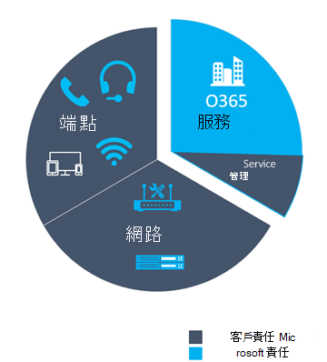
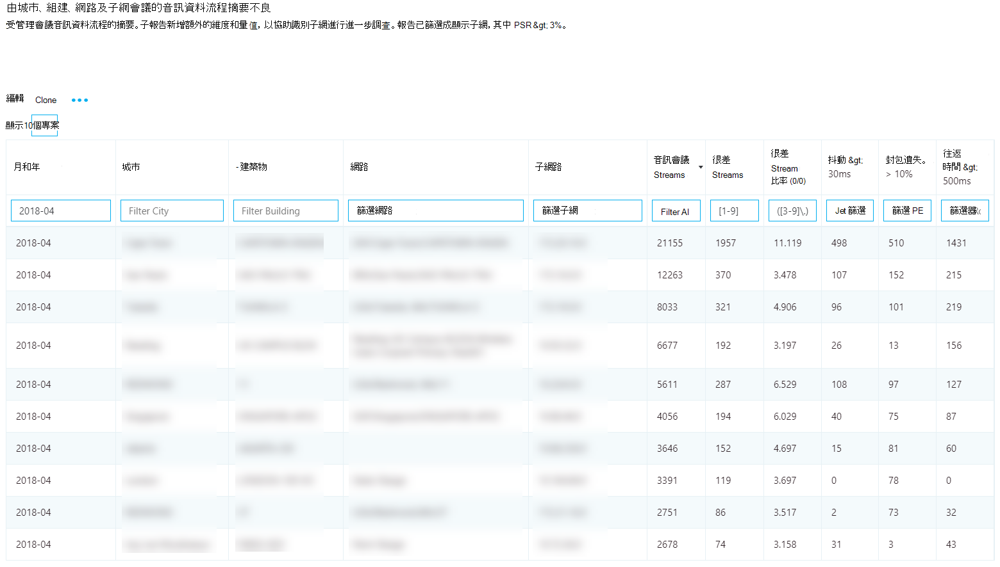
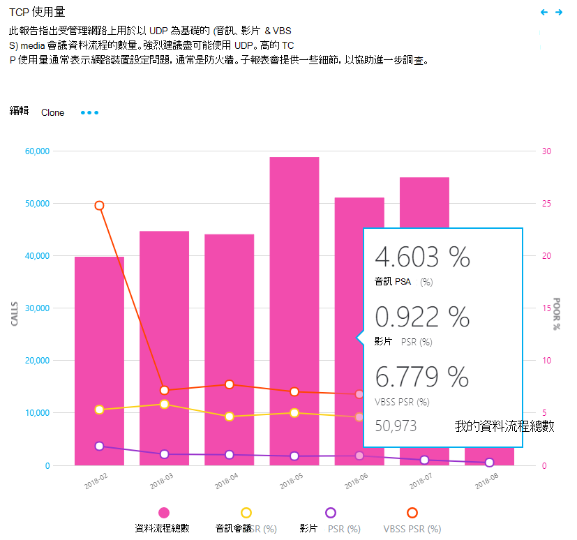
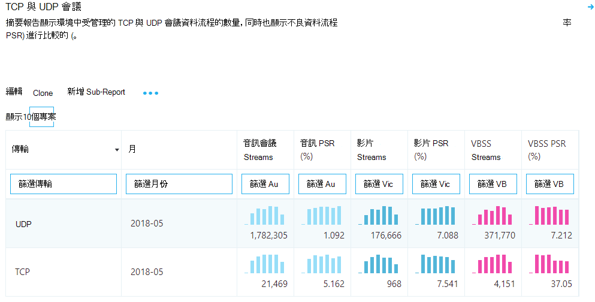
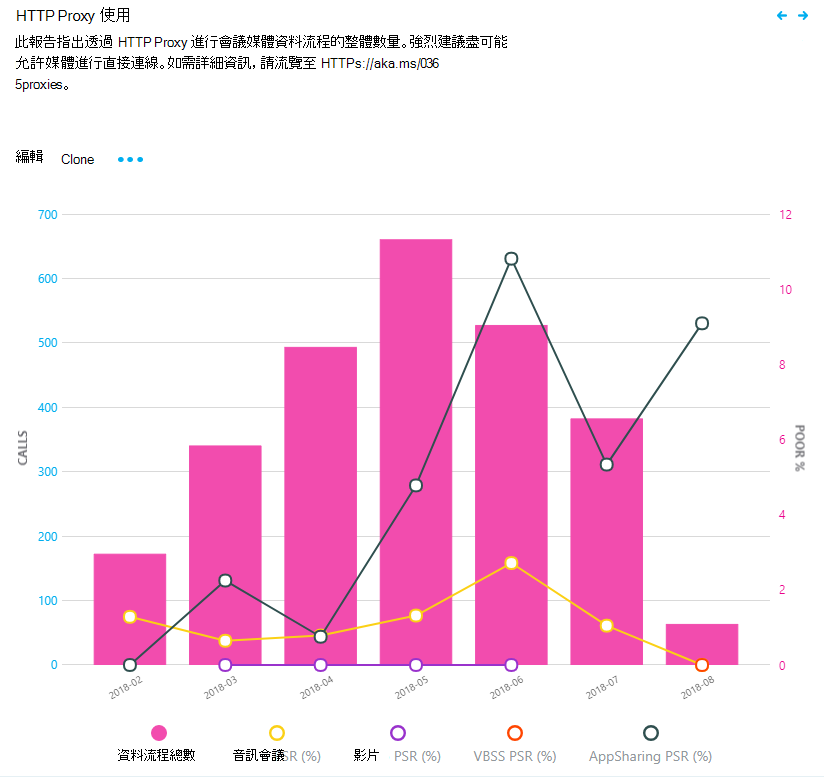

#  <a name="use-cqd-to-manage-call-and-meeting-quality-in-microsoft-teams"></a><span data-ttu-id="996b4-103">在 Microsoft 團隊中使用 CQD 管理通話與會議品質</span><span class="sxs-lookup"><span data-stu-id="996b4-103">Use CQD to manage call and meeting quality in Microsoft Teams</span></span> 

<span data-ttu-id="996b4-104">本文將協助您使用 Microsoft 團隊通話品質儀表板（CQD），協助您管理及維護貴組織的通話與會議品質的程式。</span><span class="sxs-lookup"><span data-stu-id="996b4-104">This article will help you - the Teams admin or support and helpdesk engineer - to develop a process for monitoring and maintaining call and meeting quality for your organization by using Microsoft Teams Call Quality Dashboard (CQD).</span></span> <span data-ttu-id="996b4-105">我們的指導方針會強調音訊品質案例，因為您針對改善音訊體驗所做的任何網路改進都會轉化為影片和共用的改良功能。</span><span class="sxs-lookup"><span data-stu-id="996b4-105">Our guidance emphasizes audio-quality scenarios because any network improvements you make to improve the audio experience will translate to improvements in video and sharing.</span></span>

<span data-ttu-id="996b4-106">本指南的主要內容是兩個[策劃 CQD 範本](https://aka.ms/QERtemplates)，我們建議您先下載它們，然後再逐步閱讀本文中的指導方針。</span><span class="sxs-lookup"><span data-stu-id="996b4-106">Key to this guidance are the two [curated CQD templates](https://aka.ms/QERtemplates) - we recommend that you download them before you go through the guidance in this article.</span></span>

<span data-ttu-id="996b4-107">本文假設您已[設定 CQD](turning-on-and-using-call-quality-dashboard.md)。</span><span class="sxs-lookup"><span data-stu-id="996b4-107">This article assumes that you've already [set up CQD](turning-on-and-using-call-quality-dashboard.md).</span></span>


## <a name="categories-to-monitor-and-maintain"></a><span data-ttu-id="996b4-108">要監視及維護的類別</span><span class="sxs-lookup"><span data-stu-id="996b4-108">Categories to monitor and maintain</span></span>

<span data-ttu-id="996b4-109">當您在小組中推出會議和語音功能之後，您將需要進行持續監視及維護的方案。</span><span class="sxs-lookup"><span data-stu-id="996b4-109">Once you've rolled out meetings and voice in Teams, you'll need a plan for ongoing monitoring and maintenance.</span></span> <span data-ttu-id="996b4-110">如此一來，就能確保團隊總是以最佳的方式運作。</span><span class="sxs-lookup"><span data-stu-id="996b4-110">Doing so will ensure that Teams is always running optimally.</span></span> <span data-ttu-id="996b4-111">此方案應包含下列主要區域。</span><span class="sxs-lookup"><span data-stu-id="996b4-111">This plan should include the key areas listed below.</span></span> <span data-ttu-id="996b4-112">您也應該針對品質度量建立目標，以及在問題發生時進行疑難排解及隔離問題的方案。</span><span class="sxs-lookup"><span data-stu-id="996b4-112">You should also establish targets for quality metrics and a plan for troubleshooting and isolating problems when they happen.</span></span>

<table>
<thead>
<tr class="header">
<th><span data-ttu-id="996b4-113">類別</span><span class="sxs-lookup"><span data-stu-id="996b4-113">Category</span></span></th>
<th><span data-ttu-id="996b4-114">描述</span><span class="sxs-lookup"><span data-stu-id="996b4-114">Description</span></span></th>
</tr>
</thead>
<tbody>
<tr class="odd">
<td><span data-ttu-id="996b4-115"><strong>通話品質</strong></span><span class="sxs-lookup"><span data-stu-id="996b4-115"><strong>Call quality</strong></span></span></td>
<td>
<p><span data-ttu-id="996b4-116">依內部通話（例如 VPN、WiFi、有線）或外部呼叫來細分度量單位</span><span class="sxs-lookup"><span data-stu-id="996b4-116">Break down the metrics by internal calls (within your organization, such as VPN, WiFi, wired) or external calls</span></span></p>
<p><span data-ttu-id="996b4-117">透過組建或網路細分度量標準</span><span class="sxs-lookup"><span data-stu-id="996b4-117">Break down the metrics by building or network</span></span></p>
<p><span data-ttu-id="996b4-118">VPN 通話</span><span class="sxs-lookup"><span data-stu-id="996b4-118">VPN calls</span></span></p>
<p><span data-ttu-id="996b4-119">使用 TCP、UDP 或 proxy 的通話</span><span class="sxs-lookup"><span data-stu-id="996b4-119">Calls using TCP, UDP, or proxy</span></span></p>
</td>
</tr>
<tr class="even">
<td><span data-ttu-id="996b4-120"><strong>通話可靠性</strong></span><span class="sxs-lookup"><span data-stu-id="996b4-120"><strong>Call reliability</strong></span></span></td>
<td><p><span data-ttu-id="996b4-121">找出並修正任何網路或防火牆問題</span><span class="sxs-lookup"><span data-stu-id="996b4-121">Identify and remediate any network or firewall problems</span></span></p>
<p><span data-ttu-id="996b4-122">深入瞭解通話設定與丟單失敗百分比</span><span class="sxs-lookup"><span data-stu-id="996b4-122">Gain insights into the percentages of call setup and drop failures</span></span></p>
<p><span data-ttu-id="996b4-123">瞭解大部分的撥號設定與丟單失敗發生的位置</span><span class="sxs-lookup"><span data-stu-id="996b4-123">Learn where the majority of call setup and drop failures occur</span></span></p>
</td>
</tr>
<tr class="odd">
<td><span data-ttu-id="996b4-124"><strong>使用者問卷</strong></span><span class="sxs-lookup"><span data-stu-id="996b4-124"><strong>User survey</strong></span></span></td>
<td>
<p><span data-ttu-id="996b4-125">使用費率給我的通話資料打分，瞭解使用者的實際體驗</span><span class="sxs-lookup"><span data-stu-id="996b4-125">Use Rate My Call data to learn about users' actual experience</span></span></p>
<p><span data-ttu-id="996b4-126">較差的體驗在哪裡？</span><span class="sxs-lookup"><span data-stu-id="996b4-126">Where are the poor experiences occurring?</span></span></p>
<p><span data-ttu-id="996b4-127">將較差的體驗與通話品質、可靠性和裝置產生關聯</span><span class="sxs-lookup"><span data-stu-id="996b4-127">Correlate the poor experience with call quality, reliability, and devices</span></span></p>
</td>
</tr>
<tr class="even">
<td><span data-ttu-id="996b4-128"><strong>裝置</strong></span><span class="sxs-lookup"><span data-stu-id="996b4-128"><strong>Devices</strong></span></span></td>
<td><p><span data-ttu-id="996b4-129">瞭解哪些麥克風和喇叭最常使用，以及它們對通話品質的影響</span><span class="sxs-lookup"><span data-stu-id="996b4-129">Learn which microphones and speakers are most commonly used and their impact on call quality</span></span></p>
<p><span data-ttu-id="996b4-130">是否要定期修補支援音訊、影片、USB 及 WiFi 驅動程式？</span><span class="sxs-lookup"><span data-stu-id="996b4-130">Are the supporting audio, video, USB, and WiFi drivers being regularly patched?</span></span></p>
</td>
</tr>
<tr class="odd">
<td><span data-ttu-id="996b4-131"><strong>台</strong></span><span class="sxs-lookup"><span data-stu-id="996b4-131"><strong>Clients</strong></span></span></td>
<td>
<p><span data-ttu-id="996b4-132">瞭解使用哪些用戶端類型和版本，以及它們對通話品質與可靠性的影響</span><span class="sxs-lookup"><span data-stu-id="996b4-132">Learn which client types and versions are being used and their impact on call quality and reliability</span></span>  </p>
</ol></td>
</tr>
</tbody>
</table>

<span data-ttu-id="996b4-133">透過連續評估與修正本文所述的區域，您可以減少對使用者造成負面影響的可能性。</span><span class="sxs-lookup"><span data-stu-id="996b4-133">By continually assessing and remediating the areas described in this article, you can reduce their potential to negatively affect your users.</span></span> <span data-ttu-id="996b4-134">大多數的使用者問題都可以分為下列類別：</span><span class="sxs-lookup"><span data-stu-id="996b4-134">Most user problems can be grouped into the following categories:</span></span>

-   <span data-ttu-id="996b4-135">防火牆或 proxy 配置不完整</span><span class="sxs-lookup"><span data-stu-id="996b4-135">Incomplete firewall or proxy configuration</span></span>
-   <span data-ttu-id="996b4-136">低 wi-fi 覆蓋範圍</span><span class="sxs-lookup"><span data-stu-id="996b4-136">Poor Wi-Fi coverage</span></span>
-   <span data-ttu-id="996b4-137">頻寬不足</span><span class="sxs-lookup"><span data-stu-id="996b4-137">Insufficient bandwidth</span></span>
-   <span data-ttu-id="996b4-138">點對點</span><span class="sxs-lookup"><span data-stu-id="996b4-138">VPN</span></span>
-   <span data-ttu-id="996b4-139">用戶端版本與驅動程式不一致或過時</span><span class="sxs-lookup"><span data-stu-id="996b4-139">Inconsistent or outdated client versions and drivers</span></span>
-   <span data-ttu-id="996b4-140">未優化或內建音訊裝置</span><span class="sxs-lookup"><span data-stu-id="996b4-140">Unoptimized or built-in audio devices</span></span>
-   <span data-ttu-id="996b4-141">有問題的子網或網路裝置</span><span class="sxs-lookup"><span data-stu-id="996b4-141">Problematic subnets or network devices</span></span>

<span data-ttu-id="996b4-142">在部署團隊或商務用 Skype Online 前，請先進行適當的規劃與設計，您就可以減少維持高品質體驗所需的工作量。</span><span class="sxs-lookup"><span data-stu-id="996b4-142">Through proper planning and design before deploying Teams or Skype for Business Online, you can reduce the amount of effort that will be required to maintain high-quality experiences.</span></span>

<span data-ttu-id="996b4-143">本文主要是使用 [通話品質儀表板] （CQD）線上作為主要工具來報告和調查每一個區域，重點是在音訊上最大化採納與影響。</span><span class="sxs-lookup"><span data-stu-id="996b4-143">This article focuses on using the Call Quality Dashboard (CQD) Online as the primary tool to report and investigate each area, with a special emphasis on audio to maximize adoption and impact.</span></span> <span data-ttu-id="996b4-144">針對改善音訊體驗的網路所做的任何改善，也會直接翻譯成影片與桌面共用的改良功能。</span><span class="sxs-lookup"><span data-stu-id="996b4-144">Any improvements made to the network to improve the audio experience will also directly translate to improvements in video and desktop sharing.</span></span>

<span data-ttu-id="996b4-145">為加速您的評估，提供[兩個策劃 CQD 範本](https://aka.ms/qertemplates)：一個用於管理所有網路，而另一個則只針對受管理（內部）網路篩選。</span><span class="sxs-lookup"><span data-stu-id="996b4-145">To accelerate your assessment, [two curated CQD templates](https://aka.ms/qertemplates) are provided: one is for managing all networks and the other is filtered for managed (internal) networks only.</span></span> <span data-ttu-id="996b4-146">雖然所有網路範本報告都設定為顯示建立和網路資訊，但是當您在收集與上傳資訊時，仍然可以使用它們。</span><span class="sxs-lookup"><span data-stu-id="996b4-146">Although the All Networks template reports are configured to display building and network information, they can still be used while you work toward collecting and uploading building information.</span></span> <span data-ttu-id="996b4-147">將組建資訊上傳到 CQD，可讓服務在與外部子網區分內部的同時，透過新增自訂的建築物、網路和位置資訊來加強報告。</span><span class="sxs-lookup"><span data-stu-id="996b4-147">Uploading building information into CQD enables the service to enhance reporting by adding custom building, network, and location information while differentiating internal from external subnets.</span></span> <span data-ttu-id="996b4-148">如需詳細資訊，請參閱[建立對應](CQD-building-mapping.md)。</span><span class="sxs-lookup"><span data-stu-id="996b4-148">For more information, read [Building mapping](CQD-building-mapping.md).</span></span>

### <a name="intended-audience"></a><span data-ttu-id="996b4-149">目標物件</span><span class="sxs-lookup"><span data-stu-id="996b4-149">Intended audience</span></span>

<span data-ttu-id="996b4-150">本文旨在供合作夥伴與客戶的相關人員使用，包括共同作業主管/架構師、顧問、變更管理/採用專家、網路組長、桌面組長及 IT 系統管理員等角色。</span><span class="sxs-lookup"><span data-stu-id="996b4-150">This article is intended to be used by partner and customer stakeholders with roles such as Collaboration Lead/Architect, Consultant, Change Management/Adoption Specialist, Support/Help Desk Lead, Network Lead, Desktop Lead, and IT Admin.</span></span>

<span data-ttu-id="996b4-151">本文也適用于指定的品質擁護者使用。</span><span class="sxs-lookup"><span data-stu-id="996b4-151">This article is also intended to be used by the designated quality champion(s).</span></span> <span data-ttu-id="996b4-152">如需詳細資訊，請參閱[品質擁護者角色](4-envision-plan-my-service-management.md#the-quality-champion-role)。</span><span class="sxs-lookup"><span data-stu-id="996b4-152">For more information, see [the Quality Champion role](4-envision-plan-my-service-management.md#the-quality-champion-role).</span></span>


## <a name="what-is-quality"></a><span data-ttu-id="996b4-153">什麼是品質？</span><span class="sxs-lookup"><span data-stu-id="996b4-153">What is quality?</span></span>

<span data-ttu-id="996b4-154">在這種情況下，品質是服務衡量標準與使用者經驗的結合。</span><span class="sxs-lookup"><span data-stu-id="996b4-154">In this context, quality is a combination of service metrics and user experience.</span></span>


### <a name="service-metrics"></a><span data-ttu-id="996b4-155">服務度量單位</span><span class="sxs-lookup"><span data-stu-id="996b4-155">Service metrics</span></span>

<span data-ttu-id="996b4-156">服務度量單位是由特定的用戶端測量標準所組成。</span><span class="sxs-lookup"><span data-stu-id="996b4-156">Service metrics consist of specific client-based metrics.</span></span> <span data-ttu-id="996b4-157">在每次通話期間，用戶端會收集通話的遙測，並在每次通話結束時提交報告，以便在 CQD 或每個[使用者的呼叫分析](set-up-call-analytics.md)中存取。</span><span class="sxs-lookup"><span data-stu-id="996b4-157">During each call, the client collects telemetry for the call and submits a report at the end of each call that can later be accessed in CQD or in [per-user call analytics](set-up-call-analytics.md).</span></span> <span data-ttu-id="996b4-158">這些指標包括（但不限於）：</span><span class="sxs-lookup"><span data-stu-id="996b4-158">These metrics include (but aren't limited to):</span></span>

-   <span data-ttu-id="996b4-159">較差的資料流程（內送及外送）</span><span class="sxs-lookup"><span data-stu-id="996b4-159">Poor Stream (incoming and outgoing)</span></span>
-   <span data-ttu-id="996b4-160">設定失敗率</span><span class="sxs-lookup"><span data-stu-id="996b4-160">Setup Failure Rate</span></span>
-   <span data-ttu-id="996b4-161">丟單失敗率</span><span class="sxs-lookup"><span data-stu-id="996b4-161">Drop Failure Rate</span></span>


#### <a name="poor-stream-rate"></a><span data-ttu-id="996b4-162">較差的串流速率</span><span class="sxs-lookup"><span data-stu-id="996b4-162">Poor stream rate</span></span>

<span data-ttu-id="996b4-163">較差的串流速率（PSR.EXE）代表組織中品質較差的資料流程總百分比。</span><span class="sxs-lookup"><span data-stu-id="996b4-163">The poor stream rate (PSR) represents the organization's overall percentage of streams that have poor quality.</span></span> <span data-ttu-id="996b4-164">這個指標是要醒目提示貴組織在哪些區域中，您的組織能專注于減少此值並改善使用者體驗等最大的影響，這就是為什麼在查看 PSR.EXE 時， [managed 網路](#managed-versus-unmanaged-networks)是主要的焦點。</span><span class="sxs-lookup"><span data-stu-id="996b4-164">This metric is meant to highlight areas where your organization can concentrate effort to have the strongest impact toward reducing this value and improving the user experience, which is why [managed networks](#managed-versus-unmanaged-networks) are the primary focus when looking at PSR.</span></span> <span data-ttu-id="996b4-165">外部使用者也很重要，但調查會因組織而異。</span><span class="sxs-lookup"><span data-stu-id="996b4-165">External users are important too, but investigation differs on an organizational basis.</span></span> <span data-ttu-id="996b4-166">考慮為外部使用者提供最佳做法，並獨立于整體組織調查外部通話。</span><span class="sxs-lookup"><span data-stu-id="996b4-166">Consider providing best practices for external users, and investigate external calls independently from the overall organization.</span></span>

<span data-ttu-id="996b4-167">CQD 中的實際度量單位依工作量而異，但在本文中，我們主要將重點放在_音訊不佳的百分比_測量中。</span><span class="sxs-lookup"><span data-stu-id="996b4-167">The actual measurement in CQD varies by workload, but for the purposes of this article, we focus primarily on the _Audio Poor Percentage_ measurement.</span></span> <span data-ttu-id="996b4-168">PSR.EXE 是由下表所述的五個網路度量值所組成。</span><span class="sxs-lookup"><span data-stu-id="996b4-168">PSR is made up of the five network metric averages described in the following table.</span></span> <span data-ttu-id="996b4-169">針對要分類為較差的資料流程，只有一個公制需要超過定義的閾值。</span><span class="sxs-lookup"><span data-stu-id="996b4-169">For a stream to be classified as poor, only one metric needs to exceed the defined threshold.</span></span> <span data-ttu-id="996b4-170">CQD 提供「不佳的原因 ...」測量，以更清楚地瞭解哪個條件導致資料流程分類為較差。</span><span class="sxs-lookup"><span data-stu-id="996b4-170">CQD provides the "Poor Due To…" measurements to better understand what condition caused the stream to be classified as poor.</span></span> <span data-ttu-id="996b4-171">若要深入瞭解，請參閱[CQD 中的資料流程分類](stream-classification-in-call-quality-dashboard.md)。</span><span class="sxs-lookup"><span data-stu-id="996b4-171">To learn more, read [Stream classification in CQD](stream-classification-in-call-quality-dashboard.md).</span></span>

> [!Note]
> <span data-ttu-id="996b4-172">CQD 提供「不佳的原因 ...」測量，以更清楚地瞭解哪個條件導致資料流程分類為較差。</span><span class="sxs-lookup"><span data-stu-id="996b4-172">CQD provides the "Poor due to…" measurements to better understand what condition caused the stream to be classified as poor.</span></span>


##### <a name="audio-poor-quality-metrics"></a><span data-ttu-id="996b4-173">音訊品質不佳的指標</span><span class="sxs-lookup"><span data-stu-id="996b4-173">Audio poor quality metrics</span></span>

| <span data-ttu-id="996b4-174">公制平均值</span><span class="sxs-lookup"><span data-stu-id="996b4-174">Metric average</span></span>     | <span data-ttu-id="996b4-175">描述</span><span class="sxs-lookup"><span data-stu-id="996b4-175">Description</span></span>     | <span data-ttu-id="996b4-176">使用者體驗</span><span class="sxs-lookup"><span data-stu-id="996b4-176">User experience</span></span> |
|-------------|-----------------|-----------------|
| <span data-ttu-id="996b4-177">抖動 \> 30 毫秒</span><span class="sxs-lookup"><span data-stu-id="996b4-177">Jitter \>30 ms</span></span>        | <span data-ttu-id="996b4-178">這是連續資料包之間延遲的平均變更。</span><span class="sxs-lookup"><span data-stu-id="996b4-178">This is the average change in delay between successive packets.</span></span> <span data-ttu-id="996b4-179">團隊和商務用 Skype 可透過緩衝來適應某些層級的抖動。</span><span class="sxs-lookup"><span data-stu-id="996b4-179">Teams and Skype for Business can adapt to some levels of jitter through buffering.</span></span> <span data-ttu-id="996b4-180">只有抖動超過參與者通知抖動效果的緩衝時才是如此。</span><span class="sxs-lookup"><span data-stu-id="996b4-180">It's only when the jitter exceeds the buffering that a participant notices the effects of jitter.</span></span>      | <span data-ttu-id="996b4-181">以不同速度傳入的資料包會導致演講者的語音音效機器人。</span><span class="sxs-lookup"><span data-stu-id="996b4-181">The packets arriving at different speeds cause a speaker's voice to sound robotic.</span></span>   |
| <span data-ttu-id="996b4-182">資料包遺失率 \> 10% 或0。1</span><span class="sxs-lookup"><span data-stu-id="996b4-182">Packet loss rate \>10% or 0.1</span></span>        | <span data-ttu-id="996b4-183">這通常會定義為遺失的資料包百分比。</span><span class="sxs-lookup"><span data-stu-id="996b4-183">This is often defined as a percentage of packets that are lost.</span></span> <span data-ttu-id="996b4-184">資料包遺失會直接影響音訊品質-從較小、個別的遺失包，這些資料包幾乎不會影響到導致音訊完全剪下的後置脈衝損失。</span><span class="sxs-lookup"><span data-stu-id="996b4-184">Packet loss directly affects audio quality—from small, individual lost packets that have almost no impact to back-to-back burst losses that cause audio to cut out completely.</span></span>     | <span data-ttu-id="996b4-185">丟棄且未送達預期目的地的資料包會引起媒體中的差距，導致不想要的音節與單字，以及不連貫的影片和共用。</span><span class="sxs-lookup"><span data-stu-id="996b4-185">The packets being dropped and not arriving at their intended destination cause gaps in the media, resulting in missed syllables and words, and choppy video and sharing.</span></span> |
| <span data-ttu-id="996b4-186">雙程時間 \> 500 ms</span><span class="sxs-lookup"><span data-stu-id="996b4-186">Round-trip time \>500 ms</span></span>        | <span data-ttu-id="996b4-187">這是取得從 A 指向點 B 並回到點 A 的 IP 資料包所需的時間。此網路傳播延遲會與兩個點之間的物理距離和光線速度之間的距離相關，並包括網路路徑中各種裝置所佔用的額外額外負荷。</span><span class="sxs-lookup"><span data-stu-id="996b4-187">This is the time it takes to get an IP packet from point A to point B and back to point A. This network propagation delay is tied to the physical distance between the two points and the speed of light, and includes additional overhead taken by the various devices in the network path.</span></span>      | <span data-ttu-id="996b4-188">資料包太長而無法送達目的地會導致 walkie talkie 的效果。</span><span class="sxs-lookup"><span data-stu-id="996b4-188">The packets taking too long to arrive at their destination cause a walkie-talkie effect.</span></span>   |
| <span data-ttu-id="996b4-189">NMOS 下降平均值 \> 1。0</span><span class="sxs-lookup"><span data-stu-id="996b4-189">NMOS degradation average \>1.0</span></span>         | <span data-ttu-id="996b4-190">資料流程的平均[網路平均觀念成績（NMOS）](https://docs.microsoft.com/previous-versions/office/communications-server/bb894481(v=office.12)#network-mos)下降。</span><span class="sxs-lookup"><span data-stu-id="996b4-190">Average [Network Mean Opinion Score (NMOS)](https://docs.microsoft.com/previous-versions/office/communications-server/bb894481(v=office.12)#network-mos) degradation for the stream.</span></span> <span data-ttu-id="996b4-191">代表網路遺失和抖動對導致 NMOS 下降的音訊品質有多大的影響。</span><span class="sxs-lookup"><span data-stu-id="996b4-191">Represents how much the network loss and jitter has affected the quality of received audio that caused the NMOS to drop by more than one point.</span></span> | <span data-ttu-id="996b4-192">這會結合抖動、資料包遺失，以及較低的程度，增加往返時間。</span><span class="sxs-lookup"><span data-stu-id="996b4-192">This is a combination of jitter, packet loss, and—to a lesser degree—increased round-trip time.</span></span> <span data-ttu-id="996b4-193">使用者可能會遇到這些問題的組合。</span><span class="sxs-lookup"><span data-stu-id="996b4-193">The user might be experiencing a combination of these symptoms.</span></span>   |
| <span data-ttu-id="996b4-194">隱藏樣本 \> 7% 或0.07 的平均比率</span><span class="sxs-lookup"><span data-stu-id="996b4-194">Average ratio of concealed samples \>7% or 0.07</span></span> | <span data-ttu-id="996b4-195">音訊幀數的平均比率，由資料包遺失修複產生的隱藏範例，到音訊畫面總數目。</span><span class="sxs-lookup"><span data-stu-id="996b4-195">Average ratio of the number of audio frames with concealed samples generated by packet loss healing to the total number of audio frames.</span></span> <span data-ttu-id="996b4-196">隱藏的音訊範例是一種技術，用來平滑通常是由網路資料包所造成的突然轉場。</span><span class="sxs-lookup"><span data-stu-id="996b4-196">A concealed audio sample is a technique used to smooth out the abrupt transition that would usually be caused by dropped network packets.</span></span>      | <span data-ttu-id="996b4-197">[高值] 表示已套用大量的 [損失 concealment]，並產生扭曲或遺失的音訊。</span><span class="sxs-lookup"><span data-stu-id="996b4-197">High values indicate that significant levels of loss concealment were applied and resulted in distorted or lost audio.</span></span>     |

##### <a name="why-do-we-prefer-to-use-streams-instead-of-calls"></a><span data-ttu-id="996b4-198">為什麼我們想要使用串流而不是通話？</span><span class="sxs-lookup"><span data-stu-id="996b4-198">Why do we prefer to use streams instead of calls?</span></span>

<span data-ttu-id="996b4-199">資料流程可讓我們知道來電的哪個特定腿不佳-外寄或撥入。</span><span class="sxs-lookup"><span data-stu-id="996b4-199">Streams let us know which particular leg of the call was poor - outgoing or incoming.</span></span> <span data-ttu-id="996b4-200">當您要查看通話分析是否有不佳的通話時，請判斷呼叫者的資料流程（出站）或被呼叫的資料流程（inbound）是否有不佳的通話。</span><span class="sxs-lookup"><span data-stu-id="996b4-200">When you're looking at call analytics for a poor call, determine whether the poor call was due to that caller's stream (outbound) or callee's stream (inbound).</span></span> <span data-ttu-id="996b4-201">判斷哪些資料流程會影響通話品質，對於會議而言甚至更加重要。</span><span class="sxs-lookup"><span data-stu-id="996b4-201">Determining which stream is impacting call quality is even more important for conferences.</span></span> <span data-ttu-id="996b4-202">如果您只是查看通話資料，您會看到某人參與了多少會議，但您不會看到哪些人是使用中的喇叭，但卻看不到您的螢幕共用。</span><span class="sxs-lookup"><span data-stu-id="996b4-202">If you're only looking at call data, you'll see how many conferences a person participates in, but you won't see which people are active speakers, doing the most screen sharing.</span></span>

<span data-ttu-id="996b4-203">通話資料可提供使用方式指標，但不一定會將您引導至無法正常通話品質的根本原因。</span><span class="sxs-lookup"><span data-stu-id="996b4-203">Call data gives you usage metrics, but it won't necessarily lead you to the root cause for poor call quality.</span></span> <span data-ttu-id="996b4-204">透過查看資料流程方向，您可以找出不在受管理的網路上的通話（例如，來自非員工的呼叫（例如，供應商或其他網路上的人員）撥打電話等因素。</span><span class="sxs-lookup"><span data-stu-id="996b4-204">By looking at stream direction, you can identify factors such as a call that's not on a managed network, a call from a non-employee (e.g., a vendor or someone on a different network).</span></span> <span data-ttu-id="996b4-205">在這些情況下，如果其他人的網路連線較差，整個通話都會標示為不佳。</span><span class="sxs-lookup"><span data-stu-id="996b4-205">In these cases, if the other person's network connection was poor, the entire call will be flagged as poor.</span></span> <span data-ttu-id="996b4-206">您無法對外部因素執行任何動作，所以這個資料並不是很有説明的。</span><span class="sxs-lookup"><span data-stu-id="996b4-206">You can't do  anything about external factors, so this data isn't helpful.</span></span>

<span data-ttu-id="996b4-207">資料流程方向也可協助您找出有問題的裝置或用戶端。</span><span class="sxs-lookup"><span data-stu-id="996b4-207">Stream direction can also help you identify problematic devices or clients.</span></span>

 - <span data-ttu-id="996b4-208">例如，如果您的裝置預算有限，且想要為大量音訊使用者提供裝置，請使用音訊使用量報告（VoIP），並篩選出站資料流程與會議。</span><span class="sxs-lookup"><span data-stu-id="996b4-208">For example, If you have a limited budget for devices and want to provide devices only for heavy audio users, use the audio usage report (VoIP) and filter for outbound streams and conferencing.</span></span> <span data-ttu-id="996b4-209">尋找在內建麥克風說話的大量音訊使用者，這些都可能會與較差的通話品質（並且您可能會想要為這些人提供音訊裝置）相關聯。</span><span class="sxs-lookup"><span data-stu-id="996b4-209">Look for high-volume audio users who are speaking into built-in microphones - these may correlate to poorer call quality (and you might want to provide audio devices for these people).</span></span> <span data-ttu-id="996b4-210">為了更清楚起見，您可以篩選資料包利用率，讓您針對特別高容量的音訊使用者進行設定。</span><span class="sxs-lookup"><span data-stu-id="996b4-210">For added clarity, you could filter for packet utilization, which will let you target especially high-volume audio users.</span></span> 

  - <span data-ttu-id="996b4-211">另一個範例涉及螢幕共用。</span><span class="sxs-lookup"><span data-stu-id="996b4-211">Another example involves screen sharing.</span></span> <span data-ttu-id="996b4-212">如果客戶使用舊的團隊用戶端，螢幕共用效能可能會受到影響。</span><span class="sxs-lookup"><span data-stu-id="996b4-212">If a customer is using an old Teams client, screen sharing performance may be affected.</span></span> <span data-ttu-id="996b4-213">您可以針對完成許多螢幕共用的人員，為用戶端升級劃分優先順序，以解決這個問題。</span><span class="sxs-lookup"><span data-stu-id="996b4-213">You could address this problem by prioritizing client upgrades for people who do a lot of screen sharing.</span></span>

 - <span data-ttu-id="996b4-214">透過找出資料流程的哪個方向造成不佳的通話品質，您可以判斷您是否有與 QoS 或頻寬相關的問題。</span><span class="sxs-lookup"><span data-stu-id="996b4-214">By identifying which direction of a stream is causing poor call quality, you can determine whether you've got a QoS or bandwidth-related problem.</span></span> <span data-ttu-id="996b4-215">如果您尚未完全實現 QoS，或者您只在用戶端（而不是在輸入資料流程）標示資料包，您可能會看到較差的通話品質。</span><span class="sxs-lookup"><span data-stu-id="996b4-215">If you haven't fully implemented QoS, or if you only mark packets at the client and not at the inbound stream, you might see poorer call quality.</span></span> <span data-ttu-id="996b4-216">透過查看資料流程方向，您可以更精確地查看資料包遺失、延遲或抖動的特定方向。</span><span class="sxs-lookup"><span data-stu-id="996b4-216">By looking at stream direction, you can get a more granular view of packet loss, latency, or jitter in a specific direction.</span></span> 

   - <span data-ttu-id="996b4-217">例如，假設使用者在有線連線（抖動）上 complains 機器人音訊。</span><span class="sxs-lookup"><span data-stu-id="996b4-217">For example, let's say a user complains of robotic audio while on a wired connection (jitter).</span></span> <span data-ttu-id="996b4-218">透過查看資料流程和方向，您可以判斷問題只會出現在進貨資料流程上，只適用于一組特定的子網。</span><span class="sxs-lookup"><span data-stu-id="996b4-218">By looking at stream and direction, you can determine that the problem happens on the inbound stream, only for a specific set of subnets.</span></span> <span data-ttu-id="996b4-219">在您將此資訊提供給您的網路小組之後，他們就能向下追蹤，找出無法繞過媒體流量的錯誤配置 WAN 加速器。</span><span class="sxs-lookup"><span data-stu-id="996b4-219">After you give this information to your networking team, they can track it down to a misconfigured WAN accelerator that was not bypassing media traffic.</span></span> <span data-ttu-id="996b4-220">網路小組重新配置 WAN 加速器之後，抖動就會消失，並改善通話品質。</span><span class="sxs-lookup"><span data-stu-id="996b4-220">Once the network team reconfigures the WAN accelerator, jitter disappears and call quality improves.</span></span> 


#### <a name="setup-failure-rate"></a><span data-ttu-id="996b4-221">設定失敗率</span><span class="sxs-lookup"><span data-stu-id="996b4-221">Setup Failure Rate</span></span>

<span data-ttu-id="996b4-222">設定失敗率（亦即在 CQD 中的_呼叫設定失敗百分比_測量）是在通話開始時端點之間無法建立媒體路徑的串流數。</span><span class="sxs-lookup"><span data-stu-id="996b4-222">The setup failure rate, otherwise known as the _Total Call Setup Failure Percentage_ measurement in CQD, is the number of streams where the media path couldn't be established between the endpoints at the start of the call.</span></span>

<span data-ttu-id="996b4-223">這代表無法建立的任何媒體資料流程。</span><span class="sxs-lookup"><span data-stu-id="996b4-223">This represents any media stream that couldn't be established.</span></span> <span data-ttu-id="996b4-224">考慮到這個問題對使用者經驗造成影響的嚴重性，目標是將這個值縮小至盡可能接近零。</span><span class="sxs-lookup"><span data-stu-id="996b4-224">Given the severity of the impact of this problem on the user experience, the goal is to reduce this value to as close to zero as possible.</span></span> <span data-ttu-id="996b4-225">這個指標的高值在新部署中的防火牆規則不完整的情況下比較常見，但請務必定期觀看。</span><span class="sxs-lookup"><span data-stu-id="996b4-225">A high value for this metric is more common in new deployments with incomplete firewall rules than a mature deployment, but it's still important to watch on a regular basis.</span></span>

<span data-ttu-id="996b4-226">這個指標是透過取得失敗的資料流程總數除以提交成功呼叫詳細資料記錄（CDR）的總串流數來計算：</span><span class="sxs-lookup"><span data-stu-id="996b4-226">This metric is calculated by taking the total number of streams that failed to set up divided by the total number of streams that submitted a successful call detail record (CDR):</span></span>

-   <span data-ttu-id="996b4-227">**設定失敗率**= 總的通話設定失敗資料流程計數/總 CDR 可用資料流程計數</span><span class="sxs-lookup"><span data-stu-id="996b4-227">**Setup Failure Rate** = Total Call Setup Failed Stream Count / Total CDR Available Stream Count</span></span>

#### <a name="drop-failure-rate"></a><span data-ttu-id="996b4-228">丟單失敗率</span><span class="sxs-lookup"><span data-stu-id="996b4-228">Drop Failure Rate</span></span>

<span data-ttu-id="996b4-229">在 CQD 中，擊落失敗率（亦稱為 [_總呼叫中斷失敗百分比_]）是已成功建立的資料流程在媒體路徑無法正常終止的百分比。</span><span class="sxs-lookup"><span data-stu-id="996b4-229">The drop failure rate, otherwise known as the _Total Call Dropped Failure Percentage_ measurement in CQD, is the percentage of successfully established streams where the media path didn't terminate normally.</span></span>

<span data-ttu-id="996b4-230">這代表任何意外終止的媒體資料流程。</span><span class="sxs-lookup"><span data-stu-id="996b4-230">This represents any media stream that terminated unexpectedly.</span></span> <span data-ttu-id="996b4-231">雖然這種影響並非與設定失敗的資料流程一樣嚴重，但仍會對使用者體驗造成負面影響。</span><span class="sxs-lookup"><span data-stu-id="996b4-231">Although the impact of this isn't as severe as a stream that failed to set up, it still negatively affects the user experience.</span></span> <span data-ttu-id="996b4-232">突然且頻繁的媒體跌落不只會對使用者體驗產生嚴重影響，因此它們會導致使用者需要重新連線，進而導致生產率損失（不提及不滿）。</span><span class="sxs-lookup"><span data-stu-id="996b4-232">Sudden and frequent media drops not only can have a severe impact on the user experience, they result in the need for users to reconnect, resulting in lost productivity (not to mention frustration).</span></span>

<span data-ttu-id="996b4-233">指標的計算方式為：將丟棄的資料流程總數除以已成功設定的資料流程總計數：</span><span class="sxs-lookup"><span data-stu-id="996b4-233">The metric is calculated by taking the total number of dropped streams divided by the total count of streams that set up successfully:</span></span>

-   <span data-ttu-id="996b4-234">**丟單失敗率**= 總的呼叫中斷串流總數/總呼叫設定成功的資料流程計數</span><span class="sxs-lookup"><span data-stu-id="996b4-234">**Drop Failure Rate** = Total Call Dropped Stream Count / Total Call Setup Succeeded Stream Count</span></span>

### <a name="define-your-target-metrics"></a><span data-ttu-id="996b4-235">定義您的目標度量</span><span class="sxs-lookup"><span data-stu-id="996b4-235">Define your target metrics</span></span>

<span data-ttu-id="996b4-236">本節討論我們用來評估服務健康情況的一些核心服務度量單位。</span><span class="sxs-lookup"><span data-stu-id="996b4-236">This section discusses some of the core service metrics that we use to assess the health of the services.</span></span> <span data-ttu-id="996b4-237">若要不斷地評估並推動努力，將這些測量標準放在其定義的目標之下，您將有助於確保您的使用者體驗一致且可靠的通話品質。</span><span class="sxs-lookup"><span data-stu-id="996b4-237">By continually assessing and driving efforts to keep these metrics below their defined targets, you'll help ensure that your users experience consistent, reliable call quality.</span></span> <span data-ttu-id="996b4-238">在起始點，請使用下表中的建議目標。</span><span class="sxs-lookup"><span data-stu-id="996b4-238">As a starting point, use the suggested targets in the table below.</span></span> <span data-ttu-id="996b4-239">視需要調整目標，以符合您的業務目標。</span><span class="sxs-lookup"><span data-stu-id="996b4-239">Adjust the targets as needed to meet your business objectives.</span></span>

<table>
<tr>
<th rowspan="2" colspan="2" valign="center"><span data-ttu-id="996b4-240">網路類型</span><span class="sxs-lookup"><span data-stu-id="996b4-240">Network type</span></span></th><th rowspan="1"><span data-ttu-id="996b4-241">品質目標</span><span class="sxs-lookup"><span data-stu-id="996b4-241">Quality targets</span></span></th><th colspan="2"><span data-ttu-id="996b4-242">可靠性目標</span><span class="sxs-lookup"><span data-stu-id="996b4-242">Reliability targets</span></span></th></tr>
<tr><th><span data-ttu-id="996b4-243">音訊低劣的資料流程速度</span><span class="sxs-lookup"><span data-stu-id="996b4-243">Audio Poor Stream Rate</span></span></th><th><span data-ttu-id="996b4-244">設定失敗率</span><span class="sxs-lookup"><span data-stu-id="996b4-244">Setup Failure Rate</span></span></th><th><span data-ttu-id="996b4-245">丟單失敗率</span><span class="sxs-lookup"><span data-stu-id="996b4-245">Drop Failure Rate</span></span></th></tr>
<tr><td rowspan="2"><span data-ttu-id="996b4-246"><strong>\* All</strong></span><span class="sxs-lookup"><span data-stu-id="996b4-246"><strong>All</strong></span></span></td><td><span data-ttu-id="996b4-247">內部</span><span class="sxs-lookup"><span data-stu-id="996b4-247">Internal</span></span></td><td><span data-ttu-id="996b4-248">2.0%</span><span class="sxs-lookup"><span data-stu-id="996b4-248">2.0%</span></span></td><td><span data-ttu-id="996b4-249">0.5%</span><span class="sxs-lookup"><span data-stu-id="996b4-249">0.5%</span></span></td><td><span data-ttu-id="996b4-250">2.0%</span><span class="sxs-lookup"><span data-stu-id="996b4-250">2.0%</span></span></td></tr>
<tr><td><span data-ttu-id="996b4-251">全域</span><span class="sxs-lookup"><span data-stu-id="996b4-251">Overall</span></span></td><td><span data-ttu-id="996b4-252">3.0%</span><span class="sxs-lookup"><span data-stu-id="996b4-252">3.0%</span></span></td><td><span data-ttu-id="996b4-253">1.0%</span><span class="sxs-lookup"><span data-stu-id="996b4-253">1.0%</span></span></td><td><span data-ttu-id="996b4-254">3.0%</span><span class="sxs-lookup"><span data-stu-id="996b4-254">3.0%</span></span></td></tr>
<tr><td rowspan="5"><span data-ttu-id="996b4-255"><strong>會議</strong></span><span class="sxs-lookup"><span data-stu-id="996b4-255"><strong>Conferencing</strong></span></span></td><td><span data-ttu-id="996b4-256">內部</span><span class="sxs-lookup"><span data-stu-id="996b4-256">Internal</span></span></td><td><span data-ttu-id="996b4-257">2.0%</span><span class="sxs-lookup"><span data-stu-id="996b4-257">2.0%</span></span></td><td><span data-ttu-id="996b4-258">0.5%</span><span class="sxs-lookup"><span data-stu-id="996b4-258">0.5%</span></span></td><td><span data-ttu-id="996b4-259">2.0%</span><span class="sxs-lookup"><span data-stu-id="996b4-259">2.0%</span></span></td></tr>
<tr><td><span data-ttu-id="996b4-260">有線內部</span><span class="sxs-lookup"><span data-stu-id="996b4-260">Wired internal</span></span></td><td><span data-ttu-id="996b4-261">1.0%</span><span class="sxs-lookup"><span data-stu-id="996b4-261">1.0%</span></span></td><td><span data-ttu-id="996b4-262">0.5%</span><span class="sxs-lookup"><span data-stu-id="996b4-262">0.5%</span></span></td><td><span data-ttu-id="996b4-263">1.0%</span><span class="sxs-lookup"><span data-stu-id="996b4-263">1.0%</span></span></td></tr>
<tr><td><span data-ttu-id="996b4-264">Wi-fi 5 GHz 內部</span><span class="sxs-lookup"><span data-stu-id="996b4-264">Wi-Fi 5 GHz internal</span></span></td><td><span data-ttu-id="996b4-265">1.0%</span><span class="sxs-lookup"><span data-stu-id="996b4-265">1.0%</span></span></td><td><span data-ttu-id="996b4-266">0.5%</span><span class="sxs-lookup"><span data-stu-id="996b4-266">0.5%</span></span></td><td><span data-ttu-id="996b4-267">1.0%</span><span class="sxs-lookup"><span data-stu-id="996b4-267">1.0%</span></span></td></tr>
<tr><td><span data-ttu-id="996b4-268">Wi-fi 2.4 GHz 內部</span><span class="sxs-lookup"><span data-stu-id="996b4-268">Wi-Fi 2.4 GHz internal</span></span></td><td><span data-ttu-id="996b4-269">2.0%</span><span class="sxs-lookup"><span data-stu-id="996b4-269">2.0%</span></span></td><td><span data-ttu-id="996b4-270">0.5%</span><span class="sxs-lookup"><span data-stu-id="996b4-270">0.5%</span></span></td><td><span data-ttu-id="996b4-271">2.0%</span><span class="sxs-lookup"><span data-stu-id="996b4-271">2.0%</span></span></td></tr>
<tr><td><span data-ttu-id="996b4-272">全域</span><span class="sxs-lookup"><span data-stu-id="996b4-272">Overall</span></span></td><td><span data-ttu-id="996b4-273">2.0%</span><span class="sxs-lookup"><span data-stu-id="996b4-273">2.0%</span></span></td><td><span data-ttu-id="996b4-274">0.5%</span><span class="sxs-lookup"><span data-stu-id="996b4-274">0.5%</span></span></td><td><span data-ttu-id="996b4-275">3.0%</span><span class="sxs-lookup"><span data-stu-id="996b4-275">3.0%</span></span></td></tr>
<tr><td rowspan="4"><span data-ttu-id="996b4-276"><strong>P2P</strong></span><span class="sxs-lookup"><span data-stu-id="996b4-276"><strong>P2P</strong></span></span></td><td><span data-ttu-id="996b4-277">內部</span><span class="sxs-lookup"><span data-stu-id="996b4-277">Internal</span></span></td><td><span data-ttu-id="996b4-278">2.0%</span><span class="sxs-lookup"><span data-stu-id="996b4-278">2.0%</span></span></td><td><span data-ttu-id="996b4-279">0.5%</span><span class="sxs-lookup"><span data-stu-id="996b4-279">0.5%</span></span></td><td><span data-ttu-id="996b4-280">2.0%</span><span class="sxs-lookup"><span data-stu-id="996b4-280">2.0%</span></span></td></tr>
<tr><td><span data-ttu-id="996b4-281">有線/Wi-fi 5 GHz 內部</span><span class="sxs-lookup"><span data-stu-id="996b4-281">Wired/Wi-Fi 5 GHz internal</span></span></td><td><span data-ttu-id="996b4-282">1.0%</span><span class="sxs-lookup"><span data-stu-id="996b4-282">1.0%</span></span></td><td><span data-ttu-id="996b4-283">0.5%</span><span class="sxs-lookup"><span data-stu-id="996b4-283">0.5%</span></span></td><td><span data-ttu-id="996b4-284">1.0%</span><span class="sxs-lookup"><span data-stu-id="996b4-284">1.0%</span></span></td></tr>
<tr><td><span data-ttu-id="996b4-285">有線/Wi-fi 5 GHz 整體</span><span class="sxs-lookup"><span data-stu-id="996b4-285">Wired/Wi-Fi 5 GHz overall</span></span></td><td><span data-ttu-id="996b4-286">2.0%</span><span class="sxs-lookup"><span data-stu-id="996b4-286">2.0%</span></span></td><td><span data-ttu-id="996b4-287">1.0%</span><span class="sxs-lookup"><span data-stu-id="996b4-287">1.0%</span></span></td><td><span data-ttu-id="996b4-288">1.0%</span><span class="sxs-lookup"><span data-stu-id="996b4-288">1.0%</span></span></td></tr>
<tr><td><span data-ttu-id="996b4-289">全域</span><span class="sxs-lookup"><span data-stu-id="996b4-289">Overall</span></span></td><td><span data-ttu-id="996b4-290">2.0%</span><span class="sxs-lookup"><span data-stu-id="996b4-290">2.0%</span></span></td><td><span data-ttu-id="996b4-291">1.0%</span><span class="sxs-lookup"><span data-stu-id="996b4-291">1.0%</span></span></td><td><span data-ttu-id="996b4-292">3.0%</span><span class="sxs-lookup"><span data-stu-id="996b4-292">3.0%</span></span></td></tr>
</table>

### <a name="user-experience"></a><span data-ttu-id="996b4-293">使用者體驗</span><span class="sxs-lookup"><span data-stu-id="996b4-293">User experience</span></span>

<span data-ttu-id="996b4-294">分析使用者體驗的美工圖案比科學更多，因為這裡收集的度量單位並不一定代表網路或服務發生問題，而是只指示使用者感覺問題。</span><span class="sxs-lookup"><span data-stu-id="996b4-294">Analyzing the user experience is more art than science, because the metrics gathered here don't always mean that there's a problem with the network or service but rather, they simply indicate that the user perceives a problem.</span></span> <span data-ttu-id="996b4-295">CQD 包含內建的調查機制，可讓我的通話速度（RMC），協助估量整體使用者經驗。</span><span class="sxs-lookup"><span data-stu-id="996b4-295">CQD includes a built-in survey mechanism — Rate My Call (RMC) — to help gauge overall user experience.</span></span> <span data-ttu-id="996b4-296">RMC 可讓您深入瞭解使用者對下列問題的觀點：</span><span class="sxs-lookup"><span data-stu-id="996b4-296">RMC will give you insight into the following questions from the perspective of your users:</span></span>

-   <span data-ttu-id="996b4-297">我知道如何使用此方案嗎？</span><span class="sxs-lookup"><span data-stu-id="996b4-297">Do I know how to use the solution?</span></span>
-   <span data-ttu-id="996b4-298">這個方案便於使用且直觀，而且它支援我的日常通訊需求？</span><span class="sxs-lookup"><span data-stu-id="996b4-298">Is the solution easy to use and intuitive, and does it support my day-to-day communication needs?</span></span>
-   <span data-ttu-id="996b4-299">此方案可協助我完成工作嗎？</span><span class="sxs-lookup"><span data-stu-id="996b4-299">Does the solution help me get my job done?</span></span>
-   <span data-ttu-id="996b4-300">這個方案的整體認識是什麼？</span><span class="sxs-lookup"><span data-stu-id="996b4-300">What's my overall perception of the solution?</span></span>
-   <span data-ttu-id="996b4-301">無論是在何處，都能在任何時間點使用解決方案？</span><span class="sxs-lookup"><span data-stu-id="996b4-301">Can I use the solution at any point in time, regardless of where I am?</span></span>
-   <span data-ttu-id="996b4-302">我可以設定及維護通話嗎？</span><span class="sxs-lookup"><span data-stu-id="996b4-302">Can I set up and maintain a call?</span></span>

#### <a name="rate-my-call"></a><span data-ttu-id="996b4-303">評價我的通話</span><span class="sxs-lookup"><span data-stu-id="996b4-303">Rate My Call</span></span> 

<span data-ttu-id="996b4-304">在小組和商務用 Skype 中內置通話（RMC）。</span><span class="sxs-lookup"><span data-stu-id="996b4-304">Rate My Call (RMC) is built into Teams and Skype for Business.</span></span> <span data-ttu-id="996b4-305">它會在每10個通話中自動彈出一個，或10%。</span><span class="sxs-lookup"><span data-stu-id="996b4-305">It automatically pops up after one in every 10 calls, or 10 percent.</span></span> <span data-ttu-id="996b4-306">此簡短問卷會要求使用者對通話進行評分，並提供一些內容，以瞭解為何通話品質可能較差。</span><span class="sxs-lookup"><span data-stu-id="996b4-306">This brief survey asks the user to rate the call and provide a little context for why the call quality might have been poor.</span></span> <span data-ttu-id="996b4-307">一或兩個評等不佳，3到4個是良好的，5是極好的。</span><span class="sxs-lookup"><span data-stu-id="996b4-307">A one or two rating is considered poor, three to four is good, and five is excellent.</span></span> <span data-ttu-id="996b4-308">雖然這是延遲指標的一部分，但對於發現服務規格可能遺漏的問題而言，這是一個非常實用的規格。</span><span class="sxs-lookup"><span data-stu-id="996b4-308">Although it's somewhat of a lagging indicator, this is a useful metric for uncovering issues that service metrics can miss.</span></span>

> [!Note]
> <span data-ttu-id="996b4-309">人體因數：使用者通常會在通話品質良好時忽略調查，當通話品質不正確時，就會填寫問卷。</span><span class="sxs-lookup"><span data-stu-id="996b4-309">The human factor: Users often ignore the survey when call quality is good, and they fill it out when call quality is bad.</span></span> <span data-ttu-id="996b4-310">因此，即使服務衡量標準良好，您的 RMC 報告也可能會在差側扭曲。</span><span class="sxs-lookup"><span data-stu-id="996b4-310">As a result, your RMC reports might be skewed to the poor side even while service metrics are good.</span></span>

<span data-ttu-id="996b4-311">您可以使用 CQD 來報告 RMC 的使用者回應，並將範例報告包含在 CQD 範本中。</span><span class="sxs-lookup"><span data-stu-id="996b4-311">You can use CQD to report on RMC user responses, and sample reports are included in the CQD template.</span></span> <span data-ttu-id="996b4-312">不過，本文不會詳細討論。</span><span class="sxs-lookup"><span data-stu-id="996b4-312">However, they aren't discussed in detail in this article.</span></span> 

#### <a name="client-and-device-readiness"></a><span data-ttu-id="996b4-313">用戶端和裝置準備就緒</span><span class="sxs-lookup"><span data-stu-id="996b4-313">Client and device readiness</span></span>

<span data-ttu-id="996b4-314">您需要實體用戶端和裝置策略，以協助確保您的使用者擁有一致且積極的使用者體驗。</span><span class="sxs-lookup"><span data-stu-id="996b4-314">You need a solid client and device strategy to help ensure that your users have a consistent and positive user experience.</span></span> <span data-ttu-id="996b4-315">幾個主要原則會推動每個準備策略。</span><span class="sxs-lookup"><span data-stu-id="996b4-315">A few key principles drive each readiness strategy.</span></span>

##### <a name="client-readiness"></a><span data-ttu-id="996b4-316">用戶端就緒</span><span class="sxs-lookup"><span data-stu-id="996b4-316">Client readiness</span></span>

<span data-ttu-id="996b4-317">讓團隊用戶端保持在最新狀態，可確保您的使用者永遠能取得最佳的體驗。</span><span class="sxs-lookup"><span data-stu-id="996b4-317">Keeping the Teams client up-to-date ensures that your users are always getting the best-possible experience.</span></span> <span data-ttu-id="996b4-318">Microsoft 會頻繁發行[團隊用戶端的更新](teams-client-update.md)（除非您關閉此功能（我們不建議這樣做），否則更新會在背景中自行安裝。</span><span class="sxs-lookup"><span data-stu-id="996b4-318">Microsoft releases frequent [updates to the Teams client](teams-client-update.md) (the update installs itself in the background unless you've turned off this functionality - which we don't recommend).</span></span> <span data-ttu-id="996b4-319">請務必記住修補網路、影片、USB 和音訊驅動程式，因為它們經常被忽視，且可能會影響通話和會議品質。</span><span class="sxs-lookup"><span data-stu-id="996b4-319">It's also important to remember to patch network, video, USB, and audio drivers, because they're often overlooked and can affect call and meeting quality.</span></span> <span data-ttu-id="996b4-320">考慮將網路、Wi-fi、影片、USB 和音訊驅動程式新增到您目前的修補程式管理程式。</span><span class="sxs-lookup"><span data-stu-id="996b4-320">Consider adding network, Wi-Fi, video, USB, and audio drivers to your current patch management process.</span></span>


##### <a name="device-readiness"></a><span data-ttu-id="996b4-321">裝置就緒</span><span class="sxs-lookup"><span data-stu-id="996b4-321">Device readiness</span></span>

<span data-ttu-id="996b4-322">任何單一策略都不會影響使用者體驗，而不是您的裝置準備方案。</span><span class="sxs-lookup"><span data-stu-id="996b4-322">No one single strategy can affect the user experience more than your device readiness strategy.</span></span> <span data-ttu-id="996b4-323">例如，依賴其膝上型電腦和麥克風的使用者會在通話和會議中遇到許多背景雜音。</span><span class="sxs-lookup"><span data-stu-id="996b4-323">For example, users who rely on their laptop speakers and microphone will experience a lot of background noise in calls and meetings.</span></span> <span data-ttu-id="996b4-324">團隊專用於幾乎任何裝置，但如果您有與裝置相關的問題，請參閱[手機供團隊](phones-for-teams.md)使用。</span><span class="sxs-lookup"><span data-stu-id="996b4-324">Teams is designed to work with almost any device, but if you're having device-related problems, check out [Phone for Teams](phones-for-teams.md).</span></span>


### <a name="categories-of-quality"></a><span data-ttu-id="996b4-325">品質類別</span><span class="sxs-lookup"><span data-stu-id="996b4-325">Categories of quality</span></span>

<span data-ttu-id="996b4-326">Operationalize 一組品質管制做法-這可讓您獲得良好通話和會議品質的最佳機會。</span><span class="sxs-lookup"><span data-stu-id="996b4-326">Operationalize a set of quality-management practices - this gives you the best chance of good call and meeting quality.</span></span> <span data-ttu-id="996b4-327">優質管理方案會解決下列類別：</span><span class="sxs-lookup"><span data-stu-id="996b4-327">A good quality management plan addresses these categories:</span></span>

-   <span data-ttu-id="996b4-328">**網路：** 焦點在不良資料流程比率（PSR.EXE）規格、TCP 使用量、有線和無線子網上，以及識別 HTTP proxy 與 VPN 使用的音訊品質</span><span class="sxs-lookup"><span data-stu-id="996b4-328">**Network:** Audio quality focused on the Poor Stream Ratio (PSR) metric, TCP usage, wired and wireless subnets, and identifying the use of HTTP proxies and VPN</span></span>

-   <span data-ttu-id="996b4-329">**端點：** 音訊裝置和最新用戶端</span><span class="sxs-lookup"><span data-stu-id="996b4-329">**Endpoints:** Audio devices and up-to-date clients</span></span>

-   <span data-ttu-id="996b4-330">**服務管理：** 此類別包含兩個區段：</span><span class="sxs-lookup"><span data-stu-id="996b4-330">**Service Management:** This category comprises two sections:</span></span>

    -   <span data-ttu-id="996b4-331">首先，Microsoft 必須負責管理和維護小組及商務用 Skype Online 服務。</span><span class="sxs-lookup"><span data-stu-id="996b4-331">First is Microsoft's responsibility to manage and maintain the Teams and Skype for Business Online services.</span></span>

    -   <span data-ttu-id="996b4-332">第二個是貴組織管理的工作，以確保對服務的可靠存取，例如更新建立資訊，並在新的 Office 365 IP 位址中維護防火牆，以將基礎結構新增至服務。</span><span class="sxs-lookup"><span data-stu-id="996b4-332">Second are tasks your organization manages to ensure reliable access to the service, such as updating building information and maintaining firewalls for new Office 365 IP addresses as infrastructure is added to the service.</span></span>

<span data-ttu-id="996b4-333"></span><span class="sxs-lookup"><span data-stu-id="996b4-333"></span></span>

<span data-ttu-id="996b4-334">請查看下列建議的工作清單，以維持品質。</span><span class="sxs-lookup"><span data-stu-id="996b4-334">Review the following list of tasks recommended to maintain quality.</span></span> <span data-ttu-id="996b4-335">您應該定期執行這些工作，例如 [每週]。</span><span class="sxs-lookup"><span data-stu-id="996b4-335">You should perform these tasks regularly - for example, weekly.</span></span>

#### <a name="service-management-tasks"></a><span data-ttu-id="996b4-336">服務管理工作</span><span class="sxs-lookup"><span data-stu-id="996b4-336">Service management tasks</span></span>

<span data-ttu-id="996b4-337">這些工作的範圍包括確保有足夠的頻寬可達到服務，而不需要飽和網際網路連結，請確認所有受管理的網路區域的服務品質（QoS）都在適當的地方，並在防火牆上保持在[Office 365 IP 範圍](https://aka.ms/o365ips)的最上層。</span><span class="sxs-lookup"><span data-stu-id="996b4-337">These tasks range from ensuring there is sufficient bandwidth to reach the service without saturating internet links, validating that quality of service (QoS) is in place on all managed network areas, and staying on top of [Office 365 IP ranges on firewalls](https://aka.ms/o365ips).</span></span>

#### <a name="network-tasks"></a><span data-ttu-id="996b4-338">網路工作</span><span class="sxs-lookup"><span data-stu-id="996b4-338">Network tasks</span></span>

<span data-ttu-id="996b4-339">網路任務有兩種類別：可靠性和品質。</span><span class="sxs-lookup"><span data-stu-id="996b4-339">There are two categories of network tasks: reliability and quality.</span></span> <span data-ttu-id="996b4-340">可靠性側重于測量使用者成功進行呼叫並保持連線的能力。</span><span class="sxs-lookup"><span data-stu-id="996b4-340">Reliability focuses on measuring the user's ability to make calls successfully and stay connected.</span></span> <span data-ttu-id="996b4-341">[品質] 主要是在通話期間和結束後，透過使用者用戶端傳送給小組和商務用 Skype Online 的匯總遙測。</span><span class="sxs-lookup"><span data-stu-id="996b4-341">Quality focuses on the aggregated telemetry sent to Teams and Skype for Business Online by the user's client during the call and after it has ended.</span></span> 

<span data-ttu-id="996b4-342">根據可靠性對使用者體驗的重要影響，我們建議您先評估並調查可靠性量度，然後再深入瞭解品質。</span><span class="sxs-lookup"><span data-stu-id="996b4-342">Given the critical impact that reliability has on the user experience, we recommend that you assess and investigate reliability metrics before you dive into quality.</span></span> 

#### <a name="endpoints-tasks"></a><span data-ttu-id="996b4-343">端點任務</span><span class="sxs-lookup"><span data-stu-id="996b4-343">Endpoints tasks</span></span>

<span data-ttu-id="996b4-344">此類別中的主要工作會移除一般[小組用戶端更新](teams-client-update.md)的任何障礙。</span><span class="sxs-lookup"><span data-stu-id="996b4-344">The main task in this category removing any obstacles to regular [Teams client updates](teams-client-update.md).</span></span> <span data-ttu-id="996b4-345">依預設，小組會定期自動更新（除非您關閉該設定，但我們不建議這樣做）。</span><span class="sxs-lookup"><span data-stu-id="996b4-345">By default, Teams automatically updates regularly (unless you turn off that setting, which we don't recommend).</span></span> 

<span data-ttu-id="996b4-346">您也應該監視裝置，並在您發現與裝置相關的問題時提供更新。</span><span class="sxs-lookup"><span data-stu-id="996b4-346">You should also monitor devices and provide updates whenever you identify problems related to a device.</span></span>

## <a name="use-cqd-to-manage-call-quality"></a><span data-ttu-id="996b4-347">使用 CQD 管理通話品質</span><span class="sxs-lookup"><span data-stu-id="996b4-347">Use CQD to manage call quality</span></span>

<span data-ttu-id="996b4-348">在您[設定 CQD](turning-on-and-using-call-quality-dashboard.md)之後，您就可以開始使用它來管理貴組織的通話與會議品質。</span><span class="sxs-lookup"><span data-stu-id="996b4-348">Once you've [set up CQD](turning-on-and-using-call-quality-dashboard.md), you're ready to start using it to manage call and meeting quality for your organization.</span></span>

<span data-ttu-id="996b4-349">團隊效能的大部分問題都屬於下列類別：</span><span class="sxs-lookup"><span data-stu-id="996b4-349">Most problems with Teams performance fall into the following categories:</span></span>

-   <span data-ttu-id="996b4-350">防火牆或 proxy 配置不完整</span><span class="sxs-lookup"><span data-stu-id="996b4-350">Incomplete firewall or proxy configuration</span></span>
-   <span data-ttu-id="996b4-351">低 wi-fi 覆蓋範圍</span><span class="sxs-lookup"><span data-stu-id="996b4-351">Poor Wi-Fi coverage</span></span>
-   <span data-ttu-id="996b4-352">頻寬不足</span><span class="sxs-lookup"><span data-stu-id="996b4-352">Insufficient bandwidth</span></span>
-   <span data-ttu-id="996b4-353">點對點</span><span class="sxs-lookup"><span data-stu-id="996b4-353">VPN</span></span>
-   <span data-ttu-id="996b4-354">用戶端版本與驅動程式不一致或過時</span><span class="sxs-lookup"><span data-stu-id="996b4-354">Inconsistent or outdated client versions and drivers</span></span>
-   <span data-ttu-id="996b4-355">未優化或內建音訊裝置</span><span class="sxs-lookup"><span data-stu-id="996b4-355">Unoptimized or built-in audio devices</span></span>
-   <span data-ttu-id="996b4-356">有問題的子網或網路裝置</span><span class="sxs-lookup"><span data-stu-id="996b4-356">Problematic subnets or network devices</span></span>

<span data-ttu-id="996b4-357">如果您要花點時間來評估這些區域並修正任何不足的問題，您就可以減少為所有使用者維持高品質的團隊體驗所需的工作量。</span><span class="sxs-lookup"><span data-stu-id="996b4-357">If you take the time before you roll out Teams to assess these areas and remediate any deficiencies, you'll reduce the amount of effort needed to maintain a high-quality Teams experience for all your users.</span></span> <span data-ttu-id="996b4-358">若要協助評估您的網路以準備您的團隊推出，請參閱[小組的顧問](use-advisor-teams-roll-out.md)並[準備您的小組網路](prepare-network.md)。</span><span class="sxs-lookup"><span data-stu-id="996b4-358">For help assessing your network in preparation for your Teams rollout, read [Advisor for Teams](use-advisor-teams-roll-out.md) and [Prepare your network for Teams](prepare-network.md).</span></span>

### <a name="expectations-using-cqd"></a><span data-ttu-id="996b4-359">使用 CQD 的預期</span><span class="sxs-lookup"><span data-stu-id="996b4-359">Expectations using CQD</span></span>

<span data-ttu-id="996b4-360">使用通話品質儀表板（CQD），深入瞭解使用團隊和商務用 Skype 服務所進行的通話品質。</span><span class="sxs-lookup"><span data-stu-id="996b4-360">Use the Call Quality Dashboard (CQD) to gain insight into the quality of calls made by using Teams and Skype for Business services.</span></span> <span data-ttu-id="996b4-361">CQD 的設計目的是協助小組和商務用 Skype 系統管理員和網路工程師優化網路，並密切瞭解品質、可靠性和使用者體驗。</span><span class="sxs-lookup"><span data-stu-id="996b4-361">CQD is designed to help Teams and Skype for Business admins and network engineers optimize the network and keep a close eye on quality, reliability, and the user experience.</span></span> <span data-ttu-id="996b4-362">CQD 會在整個組織中查看匯總遙測，其中的整體模式可能會變得很明顯;這可讓您做出明智的評定及規劃修正。</span><span class="sxs-lookup"><span data-stu-id="996b4-362">CQD looks at aggregate telemetry for an entire organization, where overall patterns can become apparent; this lets you make informed assessments and plan remediation.</span></span> <span data-ttu-id="996b4-363">CQD 提供可讓您深入瞭解整體品質、可靠性和使用者體驗的度量報告。</span><span class="sxs-lookup"><span data-stu-id="996b4-363">CQD provides reports of metrics that provide insight into overall quality, reliability, and user experience.</span></span>

<span data-ttu-id="996b4-364">CQD 雖然對分析趨勢和子網很有用，但並不一定會針對特定案例提供特定原因。</span><span class="sxs-lookup"><span data-stu-id="996b4-364">CQD, although useful for analyzing trends and subnets, doesn't always provide a specific cause for a given scenario.</span></span> <span data-ttu-id="996b4-365">請務必瞭解這一點，並在使用 CQD 時設定正確的預期：</span><span class="sxs-lookup"><span data-stu-id="996b4-365">It's important to understand this and set the correct expectation when using CQD:</span></span>

-   <span data-ttu-id="996b4-366">CQD 不會針對每個案例提供根源</span><span class="sxs-lookup"><span data-stu-id="996b4-366">CQD won't provide the root cause for every scenario</span></span>
-   <span data-ttu-id="996b4-367">CQD 不包含電話系統或音訊會議串流</span><span class="sxs-lookup"><span data-stu-id="996b4-367">CQD won't contain Phone System or Audio Conferencing streams</span></span>
-   <span data-ttu-id="996b4-368">CQD 將會根據趨勢來撥打進一步調查的區域</span><span class="sxs-lookup"><span data-stu-id="996b4-368">CQD will call out areas for further investigation based on trends</span></span>

### <a name="cqd-reports-overview"></a><span data-ttu-id="996b4-369">CQD 報表概覽</span><span class="sxs-lookup"><span data-stu-id="996b4-369">CQD reports overview</span></span>

<span data-ttu-id="996b4-370">使用畫面頂端的下拉式功能表來開啟報表。</span><span class="sxs-lookup"><span data-stu-id="996b4-370">Use the drop-down menu at the top of the screen to open a report.</span></span> <span data-ttu-id="996b4-371">如需每個報表中提供的資料清單，請參閱[CQD 報表中的可用資料](CQD-data-and-reports.md#data-available-in-cqd-reports)。</span><span class="sxs-lookup"><span data-stu-id="996b4-371">For a list of the data provided in each report, read [Data available in CQD reports](CQD-data-and-reports.md#data-available-in-cqd-reports).</span></span>

<span data-ttu-id="996b4-372">2020年1月[的新功能：下載 POWER BI 查詢範本以進行 CQD](https://github.com/MicrosoftDocs/OfficeDocs-SkypeForBusiness/blob/live/Teams/downloads/CQD-Power-BI-query-templates.zip?raw=true)。</span><span class="sxs-lookup"><span data-stu-id="996b4-372">New in January 2020: [Download Power BI query templates for CQD](https://github.com/MicrosoftDocs/OfficeDocs-SkypeForBusiness/blob/live/Teams/downloads/CQD-Power-BI-query-templates.zip?raw=true).</span></span> <span data-ttu-id="996b4-373">可自訂的 Power BI 範本，您可以用來分析及報告您的 CQD 資料。</span><span class="sxs-lookup"><span data-stu-id="996b4-373">Customizable Power BI templates you can use to analyze and report your CQD data.</span></span>


### <a name="teams-vs-skype-for-business"></a><span data-ttu-id="996b4-374">團隊與商務用 Skype</span><span class="sxs-lookup"><span data-stu-id="996b4-374">Teams vs. Skype for Business</span></span>

<span data-ttu-id="996b4-375">CQD 可以同時報告團隊和商務用 Skype。</span><span class="sxs-lookup"><span data-stu-id="996b4-375">CQD can report on both Teams and Skype for Business.</span></span> <span data-ttu-id="996b4-376">不過，有時候您可能會想要開發報表來查看團隊遙測與商務用 Skype 分開的情況。</span><span class="sxs-lookup"><span data-stu-id="996b4-376">However, there might be times when you want to develop a report to look at Teams telemetry separate from Skype for Business.</span></span>

#### <a name="summary-reports"></a><span data-ttu-id="996b4-377">摘要報告</span><span class="sxs-lookup"><span data-stu-id="996b4-377">Summary reports</span></span>

<span data-ttu-id="996b4-378">若要修改 [摘要報告] 頁面，只查看 [團隊] 或 [商務用 Skype]，請從畫面頂端選取 [**產品篩選**] 下拉式功能表，然後選取您想要的產品。</span><span class="sxs-lookup"><span data-stu-id="996b4-378">To modify the summary reports page to look at only Teams or Skype for Business, select the **Product Filter** drop-down menu from the top of the screen, and then select the product you want.</span></span>

![顯示 [篩選] 選項之下拉式功能表的螢幕擷取畫面](media/qerguide-image-productfilter.png)

#### <a name="detailed-reports"></a><span data-ttu-id="996b4-380">詳細報告</span><span class="sxs-lookup"><span data-stu-id="996b4-380">Detailed reports</span></span>

<span data-ttu-id="996b4-381">若要篩選所有詳細的報表，請在瀏覽器列中，將下列專案附加到 URL 的結尾：</span><span class="sxs-lookup"><span data-stu-id="996b4-381">To filter all detailed reports, in the browser bar, append the following to the end of the URL:</span></span>

```PowerShell
/filter/[AllStreams].[Is Teams]|[FALSE]
```

<span data-ttu-id="996b4-382">**範例**</span><span class="sxs-lookup"><span data-stu-id="996b4-382">**Example:**</span></span>

```https://cqd.teams.microsoft.com/cqd/#/1234567/2018-5/filter/[AllStreams].[Is Teams]|[FALSE]```

<span data-ttu-id="996b4-383">如需 URL 篩選的詳細資訊，請參閱本節稍後的[篩選報表](CQD-data-and-reports.md#report-filters)。</span><span class="sxs-lookup"><span data-stu-id="996b4-383">For more information about URL filters, read [Filtering reports](CQD-data-and-reports.md#report-filters) later in this section.</span></span>

<span data-ttu-id="996b4-384">若要篩選個別的詳細報表，請將篩選新增 ``Is Teams`` 至報表，並將其設定為 True 或 False。</span><span class="sxs-lookup"><span data-stu-id="996b4-384">To filter an individual detailed report, add the filter ``Is Teams`` to the report and set it to True or False.</span></span>

![[新增篩選] 頁面的螢幕擷取畫面](media/qerguide-image-addteamsfilter.png)

### <a name="managed-versus-unmanaged-networks"></a><span data-ttu-id="996b4-386">受管理的與非管理的網路</span><span class="sxs-lookup"><span data-stu-id="996b4-386">Managed versus unmanaged networks</span></span>

<span data-ttu-id="996b4-387">根據預設，CQD 中的所有端點都會分類為外部。</span><span class="sxs-lookup"><span data-stu-id="996b4-387">By default, all endpoints in CQD are classified as external.</span></span> <span data-ttu-id="996b4-388">一旦推出檔案，我們就可以開始查看受管理的端點資料。</span><span class="sxs-lookup"><span data-stu-id="996b4-388">As soon as a building file is introduced, we can begin to look at managed endpoint data.</span></span> <span data-ttu-id="996b4-389">如先前所述，CQD 中的網路定義為：</span><span class="sxs-lookup"><span data-stu-id="996b4-389">As previously discussed, networks in CQD are defined as:</span></span>

-   <span data-ttu-id="996b4-390">_受管理的網路_（通常稱為內部或內部）會受到組織的影響及控制。</span><span class="sxs-lookup"><span data-stu-id="996b4-390">A _managed network_, often referred to as internal or inside, can be influenced and controlled by the organization.</span></span> <span data-ttu-id="996b4-391">這包括內部局域網、遠端 WAN 和 VPN。</span><span class="sxs-lookup"><span data-stu-id="996b4-391">This includes the internal LAN, the remote WAN, and VPN.</span></span>
-   <span data-ttu-id="996b4-392">_未受管理的網路_（通常稱為外部或外部）不會受到組織的影響或控制。</span><span class="sxs-lookup"><span data-stu-id="996b4-392">An _unmanaged network_, often referred to as external or outside, can't be influenced or controlled by the organization.</span></span> <span data-ttu-id="996b4-393">未受管理的網路範例是賓館或機場網路。</span><span class="sxs-lookup"><span data-stu-id="996b4-393">An example of an unmanaged network is a hotel or airport network.</span></span>

### <a name="dimensions-measures-and-filters"></a><span data-ttu-id="996b4-394">維度、量值與篩選</span><span class="sxs-lookup"><span data-stu-id="996b4-394">Dimensions, measures, and filters</span></span>

<span data-ttu-id="996b4-395">標準格式的 CQD 查詢包含下列三個參數：</span><span class="sxs-lookup"><span data-stu-id="996b4-395">A well-formed CQD query contains all three of the following parameters:</span></span>

-   <span data-ttu-id="996b4-396">**維度：** 我要如何旋轉資料。</span><span class="sxs-lookup"><span data-stu-id="996b4-396">**Dimension:** How I want to pivot on the data.</span></span>

-   <span data-ttu-id="996b4-397">**測度：** 我想要報告的內容。</span><span class="sxs-lookup"><span data-stu-id="996b4-397">**Measure:** What I want to report on.</span></span>

-   <span data-ttu-id="996b4-398">**篩選：** 我要如何減少查詢所傳回的資料集。</span><span class="sxs-lookup"><span data-stu-id="996b4-398">**Filter:** How I want to reduce the dataset the query returns.</span></span>

<span data-ttu-id="996b4-399">另一個要看的是，_維度_是分組函數，一個_量值_是我感興趣的資料，而 [_篩選_] 是我想要將結果縮小到與我的查詢相關的結果。</span><span class="sxs-lookup"><span data-stu-id="996b4-399">Another way to look at this is that a _dimension_ is the grouping function, a _measure_ is the data I'm interested in, and a _filter_ is how I want to narrow down the results to those that are relevant to my query.</span></span>

<span data-ttu-id="996b4-400">標準格式的查詢範例會**顯示「資料流程」 [Measure] （由子網 [Dimension]）來建立 6 [Filter]**。</span><span class="sxs-lookup"><span data-stu-id="996b4-400">An example of a well-formed query is **Show me Poor Streams [Measure] by Subnet [Dimension] for Building 6 [Filter]**.</span></span> <span data-ttu-id="996b4-401">如需詳細資訊，請參閱[CQD 中可用的維度與量值](https://aka.ms/cqd-dm)。</span><span class="sxs-lookup"><span data-stu-id="996b4-401">For more information, see [Dimensions and measures available in CQD](https://aka.ms/cqd-dm).</span></span>

### <a name="first-vs-second"></a><span data-ttu-id="996b4-402">第一個與第二個</span><span class="sxs-lookup"><span data-stu-id="996b4-402">First vs. second</span></span> 

<span data-ttu-id="996b4-403">CQD 中的許多維度與量值會分類為第一或第二個。</span><span class="sxs-lookup"><span data-stu-id="996b4-403">Many of the dimensions and measures in CQD are classified as first or second.</span></span> <span data-ttu-id="996b4-404">CQD 不使用 [來電者/被叫方] 欄位 _，因為呼叫者與被_叫方之間有中間的步驟，所以它們已_重新命名。_</span><span class="sxs-lookup"><span data-stu-id="996b4-404">CQD doesn't use caller/callee fields—these have been renamed _first_ and _second_ because there are intervening steps between the caller and callee.</span></span> <span data-ttu-id="996b4-405">下列邏輯決定所涉及的端點標示為「第一」：</span><span class="sxs-lookup"><span data-stu-id="996b4-405">The following logic determines which endpoint involved is labeled as first:</span></span>

-   <span data-ttu-id="996b4-406">如果是在資料流程或通話中參與伺服器，則**首先**會是伺服器端點（[會議服務器]、[中繼伺服器] 等）。</span><span class="sxs-lookup"><span data-stu-id="996b4-406">**First** will always be a server endpoint (Conference Server, Mediation Server, and so on) if a server is involved in the stream or call.</span></span>

-   <span data-ttu-id="996b4-407">**第二個**將一直是用戶端端點，除非資料流程位於兩個伺服器端點之間。</span><span class="sxs-lookup"><span data-stu-id="996b4-407">**Second** will always be a client endpoint unless the stream is between two server endpoints.</span></span>

-   <span data-ttu-id="996b4-408">如果兩個端點都是相同類型，則首先根據使用者代理程式類別的內部順序來選擇。</span><span class="sxs-lookup"><span data-stu-id="996b4-408">If both endpoints are the same type, the choice of which is first is based on internal ordering of the user agent category.</span></span> <span data-ttu-id="996b4-409">這可確保順序一致。</span><span class="sxs-lookup"><span data-stu-id="996b4-409">This ensures the ordering is consistent.</span></span>

<span data-ttu-id="996b4-410">如需判斷第一個或第二個端點相同的詳細資訊，請參閱[CQD 中可用的維度與量值](https://aka.ms/cqd-dm)。</span><span class="sxs-lookup"><span data-stu-id="996b4-410">For more information about determining the first or second endpoint when they're both the same, see [Dimensions and measures available in CQD](https://aka.ms/cqd-dm).</span></span>

### <a name="stream-vs-call"></a><span data-ttu-id="996b4-411">資料流程與撥號</span><span class="sxs-lookup"><span data-stu-id="996b4-411">Stream vs. call</span></span>

<span data-ttu-id="996b4-412">您必須瞭解通話與資料流程間的差異，才能正確選擇您要在 CQD 中看到的維度或量值。</span><span class="sxs-lookup"><span data-stu-id="996b4-412">You need to understand the difference between a call and a stream to properly choose which dimensions or measures you'll be looking at in CQD.</span></span> <span data-ttu-id="996b4-413">雖然 CQD 的主要焦點是位於資料流程上，但也提供以呼叫為基礎的度量單位。</span><span class="sxs-lookup"><span data-stu-id="996b4-413">Although CQD's primary focus is on streams, call-based measurements are also available.</span></span>

-   <span data-ttu-id="996b4-414">**串流：**_資料流程_存在於兩個端點之間。</span><span class="sxs-lookup"><span data-stu-id="996b4-414">**Stream:** A _stream_ exists between only two endpoints.</span></span> <span data-ttu-id="996b4-415">每個方向只有一個資料流程，且需要兩個數據流才能進行通訊。</span><span class="sxs-lookup"><span data-stu-id="996b4-415">There is only one stream for each direction, and two streams are required for communication.</span></span> <span data-ttu-id="996b4-416">資料流程對於調查建築物、網路或子網很有用。</span><span class="sxs-lookup"><span data-stu-id="996b4-416">Streams are useful for investigating buildings, networks, or subnets.</span></span> <span data-ttu-id="996b4-417">在某些情況下，會在量化指標的名稱（例如，呼叫設定資料流程或呼叫丟棄的資料流程）中使用 call 和 stream。</span><span class="sxs-lookup"><span data-stu-id="996b4-417">In some cases, both call and stream are used in the measurement's name (for example, Call Setup Stream or Call Dropped Stream).</span></span> <span data-ttu-id="996b4-418">這些專案仍會分類為串流。</span><span class="sxs-lookup"><span data-stu-id="996b4-418">These are still classified as streams.</span></span>

-   <span data-ttu-id="996b4-419">**通話：**_通話_是來自所有參與者的所有資料流程的群組。</span><span class="sxs-lookup"><span data-stu-id="996b4-419">**Call:** A _call_ is a grouping of all streams from all participants.</span></span> <span data-ttu-id="996b4-420">通話至少包含兩個數據流。</span><span class="sxs-lookup"><span data-stu-id="996b4-420">A call consists of—at minimum—two streams.</span></span> <span data-ttu-id="996b4-421">單一通話至少會有兩個端點，每個端點最少為一個串流。</span><span class="sxs-lookup"><span data-stu-id="996b4-421">A single call will have at least two endpoints, each with a minimum of one stream.</span></span>

<span data-ttu-id="996b4-422">如需有關維度或量值是參照至通話或資料流程的其他指導方針，請參閱[CQD 中可用的維度與量值](https://aka.ms/cqd-dm)</span><span class="sxs-lookup"><span data-stu-id="996b4-422">For additional guidance on whether the dimension or measure is referring to a call or a stream, see [Dimensions and measures available in CQD](https://aka.ms/cqd-dm)</span></span>

### <a name="good-poor-and-unclassified-calls"></a><span data-ttu-id="996b4-423">良好、較差及未分類通話</span><span class="sxs-lookup"><span data-stu-id="996b4-423">Good, poor, and unclassified calls</span></span>

<span data-ttu-id="996b4-424">通話會分類為良好、較差或未分類。</span><span class="sxs-lookup"><span data-stu-id="996b4-424">A call is categorized either as good, poor, or unclassified.</span></span> <span data-ttu-id="996b4-425">讓我們花點時間深入討論每一個專案。</span><span class="sxs-lookup"><span data-stu-id="996b4-425">Let's take a moment to talk about each one in more detail.</span></span>

-   <span data-ttu-id="996b4-426">**良好或不佳：**[良好或較差的通話] 包含一組完整的服務度量，由服務產生並接收完整的 QoE 報告。</span><span class="sxs-lookup"><span data-stu-id="996b4-426">**Good or poor:** A good or poor call consists of a call that contains a complete set of service metrics, for which a full QoE report was generated and received by the service.</span></span> <span data-ttu-id="996b4-427">[在本文先前](#poor-stream-rate)所述，判斷資料流程是否良好或變差。</span><span class="sxs-lookup"><span data-stu-id="996b4-427">Determining whether a stream is good or poor is described [earlier in this article](#poor-stream-rate).</span></span>

-   <span data-ttu-id="996b4-428">未**分類：** 未分類的資料流程不包含完整的一組服務度量單位。</span><span class="sxs-lookup"><span data-stu-id="996b4-428">**Unclassified:** An unclassified stream doesn't contain a full set of service metrics.</span></span> <span data-ttu-id="996b4-429">這些可能是短通話（通常少於60秒），因為無法計算平均值，也不會產生 QoE 報告。</span><span class="sxs-lookup"><span data-stu-id="996b4-429">These can be short calls—usually less than 60 seconds—where averages couldn't be computed and a QoE report wasn't generated.</span></span> <span data-ttu-id="996b4-430">未分類呼叫最常見的原因，就是幾乎沒有資料包利用率。</span><span class="sxs-lookup"><span data-stu-id="996b4-430">The most common reason for calls to be unclassified is that there was little to no packet utilization.</span></span> <span data-ttu-id="996b4-431">例如，參與者在靜音和永不說話時加入會議。</span><span class="sxs-lookup"><span data-stu-id="996b4-431">An example of this would be a participant who joins a meeting on mute and never speaks.</span></span> <span data-ttu-id="996b4-432">參與者正在接收，但無法傳送媒體。</span><span class="sxs-lookup"><span data-stu-id="996b4-432">The participant is receiving, but not transmitting, media.</span></span> <span data-ttu-id="996b4-433">如果沒有傳送媒體，就不會有任何可供 CQD 用來分類端點的輸出媒體資料流程的指標。</span><span class="sxs-lookup"><span data-stu-id="996b4-433">Without media being transmitted, there won't be any metrics available for CQD to use to classify the endpoint's outbound media stream.</span></span>

<span data-ttu-id="996b4-434">若要深入瞭解，請參閱[CQD 中的資料流程分類](stream-classification-in-call-quality-dashboard.md)。</span><span class="sxs-lookup"><span data-stu-id="996b4-434">To learn more, read [Stream classification in CQD](stream-classification-in-call-quality-dashboard.md).</span></span>

### <a name="common-subnets"></a><span data-ttu-id="996b4-435">常見子網</span><span class="sxs-lookup"><span data-stu-id="996b4-435">Common subnets</span></span>

<span data-ttu-id="996b4-436">常見子網是賓館、家用網路、熱點及類似區域所使用的專用子網。</span><span class="sxs-lookup"><span data-stu-id="996b4-436">Common subnets are specific private subnets that are used by hotels, home networks, hotspots, and similar areas.</span></span> <span data-ttu-id="996b4-437">這些子網難以進行會審，因為其廣泛使用。</span><span class="sxs-lookup"><span data-stu-id="996b4-437">These subnets are difficult to triage due to their widespread use.</span></span> <span data-ttu-id="996b4-438">如果您的組織使用其中一個常見的子網，我們建議您將該網路移至另一個子網。</span><span class="sxs-lookup"><span data-stu-id="996b4-438">If your organization uses one of these common subnets, we recommend that you move that network to another subnet.</span></span> <span data-ttu-id="996b4-439">這將使 CQD 的報告變得更容易。</span><span class="sxs-lookup"><span data-stu-id="996b4-439">This will make reporting easier in CQD.</span></span> <span data-ttu-id="996b4-440">請注意，[所有網路] 範本中的報告已設定為排除這些子網，以將其排除在品質較差的來源。</span><span class="sxs-lookup"><span data-stu-id="996b4-440">When noted, reports in the All Networks template have been configured to exclude these subnets to eliminate them as a source of poor quality.</span></span> <span data-ttu-id="996b4-441">常見的子網定義如下：其影響會因組織而異。</span><span class="sxs-lookup"><span data-stu-id="996b4-441">Common subnets are defined below; their impact will vary by organization.</span></span>

-   <span data-ttu-id="996b4-442">10.0.0.0/24</span><span class="sxs-lookup"><span data-stu-id="996b4-442">10.0.0.0/24</span></span>
-   <span data-ttu-id="996b4-443">192.168.0.0/24</span><span class="sxs-lookup"><span data-stu-id="996b4-443">192.168.0.0/24</span></span>
-   <span data-ttu-id="996b4-444">192.168.1.0/24</span><span class="sxs-lookup"><span data-stu-id="996b4-444">192.168.1.0/24</span></span>
-   <span data-ttu-id="996b4-445">192.168.2.0/24</span><span class="sxs-lookup"><span data-stu-id="996b4-445">192.168.2.0/24</span></span>
-   <span data-ttu-id="996b4-446">172.20.10.0/24</span><span class="sxs-lookup"><span data-stu-id="996b4-446">172.20.10.0/24</span></span>
-   <span data-ttu-id="996b4-447">192.168.43.0/24</span><span class="sxs-lookup"><span data-stu-id="996b4-447">192.168.43.0/24</span></span>

<span data-ttu-id="996b4-448">調查使用共同子網的受管理網路時，您需要使用第二個反身本機 IP 維度來組成群組子網。</span><span class="sxs-lookup"><span data-stu-id="996b4-448">When investigating a managed network that uses a common subnet, you'll need to use the Second Reflexive Local IP dimension to group subnets.</span></span> <span data-ttu-id="996b4-449">此維度包含端點的公用 IP 位址。</span><span class="sxs-lookup"><span data-stu-id="996b4-449">This dimension contains the endpoint's public IP address.</span></span>


## <a name="reliability-investigations"></a><span data-ttu-id="996b4-450">可靠性調查</span><span class="sxs-lookup"><span data-stu-id="996b4-450">Reliability investigations</span></span>

<span data-ttu-id="996b4-451">改善品質的第一個步驟是評估整個組織的可靠性狀態。</span><span class="sxs-lookup"><span data-stu-id="996b4-451">The first step to improving quality is to assess the state of reliability across the organization.</span></span> <span data-ttu-id="996b4-452">因為可靠性對於積極的使用者體驗至關重要，所以我們從測量可靠性的兩個元件開始：</span><span class="sxs-lookup"><span data-stu-id="996b4-452">Because reliability is vital to a positive user experience, we start with the two components that measure reliability:</span></span>

1.  <span data-ttu-id="996b4-453">**安裝失敗：** 無法建立通話。</span><span class="sxs-lookup"><span data-stu-id="996b4-453">**Setup failures:** The call couldn't be established.</span></span>

2.  <span data-ttu-id="996b4-454">**Drop 失敗：** 通話已建立且意外終止。</span><span class="sxs-lookup"><span data-stu-id="996b4-454">**Drop failures:** The call was established and unexpectedly terminated.</span></span>

<span data-ttu-id="996b4-455">在本節中，我們將說明同時調查兩個區域的方法。</span><span class="sxs-lookup"><span data-stu-id="996b4-455">Throughout this section, we'll cover methods to investigate both areas.</span></span>

> [!NOTE]
> <span data-ttu-id="996b4-456">本文並未涵蓋範本中包含的所有報表。</span><span class="sxs-lookup"><span data-stu-id="996b4-456">Not all reports included in the templates are covered in this article.</span></span> <span data-ttu-id="996b4-457">不過，以下所述的調查方法仍適用。</span><span class="sxs-lookup"><span data-stu-id="996b4-457">However, the methods of investigation explained below still apply.</span></span> <span data-ttu-id="996b4-458">如需詳細資訊，請參閱個別報表的描述。</span><span class="sxs-lookup"><span data-stu-id="996b4-458">Please refer to the individual report description for more information.</span></span>


### <a name="setup-failures"></a><span data-ttu-id="996b4-459">設定失敗</span><span class="sxs-lookup"><span data-stu-id="996b4-459">Setup failures</span></span>

<span data-ttu-id="996b4-460">首先，請優先處理此區域中的修正設定失敗問題，因為這些失敗會對使用者體驗產生嚴重的負面影響。</span><span class="sxs-lookup"><span data-stu-id="996b4-460">Prioritize remediating setup failures in this area first, because these failures have a significant negative impact on the user experience.</span></span>

<span data-ttu-id="996b4-461">您可以評估組織的整體設定失敗百分比，然後根據組建或網路最高的百分比來排定調查區域的優先順序。</span><span class="sxs-lookup"><span data-stu-id="996b4-461">Begin your investigation by assessing the percentage of overall setup failures for the organization, and then prioritize areas of investigation based on the highest percentage by building or network.</span></span> 

#### <a name="setup-failure-trend-analysis"></a><span data-ttu-id="996b4-462">設定失敗趨勢分析</span><span class="sxs-lookup"><span data-stu-id="996b4-462">Setup failure trend analysis</span></span>

<span data-ttu-id="996b4-463">此報告顯示串流的總總量、資料流程設定失敗，以及資料流程設定失敗率。</span><span class="sxs-lookup"><span data-stu-id="996b4-463">This report displays the total amount of streams, stream setup failures, and the stream setup failure rate.</span></span> <span data-ttu-id="996b4-464">指向任何一個資料行，以顯示其個別的值。</span><span class="sxs-lookup"><span data-stu-id="996b4-464">Point to any one of the columns to display its individual values.</span></span> 

##### <a name="analysis"></a><span data-ttu-id="996b4-465">分析</span><span class="sxs-lookup"><span data-stu-id="996b4-465">Analysis</span></span>

<span data-ttu-id="996b4-466">您可以使用此報告來回答下列問題，並決定您的下一個動作課程：</span><span class="sxs-lookup"><span data-stu-id="996b4-466">By using this report, you can answer the following questions and determine your next course of action:</span></span>

-   <span data-ttu-id="996b4-467">目前月份的電話設定失敗總百分比是什麼？</span><span class="sxs-lookup"><span data-stu-id="996b4-467">What is the total call setup failure percentage for the current month?</span></span>

-   <span data-ttu-id="996b4-468">[通話設定失敗] 的總百分比是低於或高於定義的目標度量嗎？</span><span class="sxs-lookup"><span data-stu-id="996b4-468">Is the total call setup failure percentage below or above the defined target metric?</span></span>

-   <span data-ttu-id="996b4-469">失敗趨勢是否較差或比上個月更佳？</span><span class="sxs-lookup"><span data-stu-id="996b4-469">Is the failure trend worse or better than the previous month?</span></span>

-   <span data-ttu-id="996b4-470">失敗趨勢是增加、穩定或遞減嗎？</span><span class="sxs-lookup"><span data-stu-id="996b4-470">Is the failure trend increasing, steady, or decreasing?</span></span>

<span data-ttu-id="996b4-471">不論這些問題的答案如何，請使用隨附子報表來進一步調查，以尋找任何可能需要修正的個別建築物或子網。</span><span class="sxs-lookup"><span data-stu-id="996b4-471">Irrespective of your answers to these questions, take the time to investigate further by using the companion sub-reports to look for any individual buildings or subnets that might need remediation.</span></span> <span data-ttu-id="996b4-472">雖然整體失敗率可能低於目標度量，但一或多個建築物或網路的失敗率可能高於目標指標，且需要調查。</span><span class="sxs-lookup"><span data-stu-id="996b4-472">Although the overall failure rate might be below the target metric, the failure rates for one or more buildings or networks might be above the target metric and need investigation.</span></span>

#### <a name="setup-failure-investigations"></a><span data-ttu-id="996b4-473">設定失敗調查</span><span class="sxs-lookup"><span data-stu-id="996b4-473">Setup failure investigations</span></span> 

<span data-ttu-id="996b4-474">這個摘要報告是用來探索及隔離任何可能需要修正的建築物或網路。</span><span class="sxs-lookup"><span data-stu-id="996b4-474">This summary report is used to discover and isolate any buildings or networks that might need remediation.</span></span>

> [!NOTE]
> <span data-ttu-id="996b4-475">請務必將 [月年度] 報表篩選調整為 [本月]。</span><span class="sxs-lookup"><span data-stu-id="996b4-475">Be sure to adjust the Month Year report filter to the current month.</span></span> <span data-ttu-id="996b4-476">選取 [**編輯**]，然後調整 [**月**] 報表篩選，以儲存新的預設月份。</span><span class="sxs-lookup"><span data-stu-id="996b4-476">Select **Edit**, and adjust the **Month Year** report filter to save the new default month.</span></span>

##### <a name="remediation"></a><span data-ttu-id="996b4-477">修正</span><span class="sxs-lookup"><span data-stu-id="996b4-477">Remediation</span></span> 

<span data-ttu-id="996b4-478">將您的第一次修正工作重點放在具有最大大量故障的建築物或子網上。</span><span class="sxs-lookup"><span data-stu-id="996b4-478">Focus your first remediation efforts on buildings or subnets that have the largest volume of failures.</span></span> <span data-ttu-id="996b4-479">這將會最大化對使用者體驗的影響，並有助於快速減少組織電話設定失敗的速度。</span><span class="sxs-lookup"><span data-stu-id="996b4-479">This will maximize impact on the user experience and help to quickly reduce the rate of organizational call setup failures.</span></span> <span data-ttu-id="996b4-480">下表列出由 CQD 報告的設定失敗的兩個原因。</span><span class="sxs-lookup"><span data-stu-id="996b4-480">The following table lists the two reasons for setup failures as reported by CQD.</span></span>

| <span data-ttu-id="996b4-481">通話設定失敗的原因</span><span class="sxs-lookup"><span data-stu-id="996b4-481">Call Setup Failures reason</span></span>       | <span data-ttu-id="996b4-482">常見的原因</span><span class="sxs-lookup"><span data-stu-id="996b4-482">Typical cause</span></span>                    |
|----------------------------------|----------------------------------|
| <span data-ttu-id="996b4-483">遺失固件深層資料包檢查例外規則</span><span class="sxs-lookup"><span data-stu-id="996b4-483">Missing FW Deep Packet Inspection Exemption Rule</span></span> | <span data-ttu-id="996b4-484">表示由於深入的資料包檢查規則而使媒體路徑無法建立，所以沿著路徑的網路裝置無法進行建立。</span><span class="sxs-lookup"><span data-stu-id="996b4-484">Indicates that network equipment along the path prevented the media path from being established due to deep packet inspection rules.</span></span> <span data-ttu-id="996b4-485">這可能是因為防火牆規則沒有正確設定。</span><span class="sxs-lookup"><span data-stu-id="996b4-485">This is likely due to firewall rules not being correctly configured.</span></span> <span data-ttu-id="996b4-486">在這種情況下，TCP 握手成功，但 SSL 握手沒有。</span><span class="sxs-lookup"><span data-stu-id="996b4-486">In this scenario, the TCP handshake succeeded but the SSL handshake didn't.</span></span>      |
| <span data-ttu-id="996b4-487">遺失的 FW IP 封鎖例外規則</span><span class="sxs-lookup"><span data-stu-id="996b4-487">Missing FW IP Block Exception Rule</span></span>      | <span data-ttu-id="996b4-488">表示路徑中的網路裝置無法建立媒體路徑給 Microsoft 365 或 Office 365 網路。</span><span class="sxs-lookup"><span data-stu-id="996b4-488">Indicates that network equipment along the path prevented the media path from being established to the Microsoft 365 or Office 365 network.</span></span> <span data-ttu-id="996b4-489">這可能是因為無法正確設定 proxy 或防火牆規則，以允許存取用於團隊和商務用 Skype 流量的 IP 位址和埠。</span><span class="sxs-lookup"><span data-stu-id="996b4-489">This might be due to proxy or firewall rules not being correctly configured to allow access to IP addresses and ports used for Teams and Skype for Business traffic.</span></span> |

<span data-ttu-id="996b4-490">當您開始修正時，您可以將精力集中在特定的建築物或子網上。</span><span class="sxs-lookup"><span data-stu-id="996b4-490">As you begin your remediation, you can focus your efforts on a particular building or subnet.</span></span> <span data-ttu-id="996b4-491">如上表所示，這些問題是由防火牆或 proxy 設定所導致。</span><span class="sxs-lookup"><span data-stu-id="996b4-491">As the preceding table shows, these issues are due to firewall or proxy configurations.</span></span> <span data-ttu-id="996b4-492">請參閱下表中的選項，以取得修正動作。</span><span class="sxs-lookup"><span data-stu-id="996b4-492">Review the options in the following table for remediation actions.</span></span>

|      <span data-ttu-id="996b4-493">修正</span><span class="sxs-lookup"><span data-stu-id="996b4-493">Remediation</span></span>      |<span data-ttu-id="996b4-494">指導方針</span><span class="sxs-lookup"><span data-stu-id="996b4-494">Guidance</span></span>  |
|-----------------------|----------|
| <span data-ttu-id="996b4-495">設定防火牆</span><span class="sxs-lookup"><span data-stu-id="996b4-495">Configure firewalls</span></span> | <span data-ttu-id="996b4-496">與您的網路小組合作，並對照[Office 365 IP 位址清單](https://aka.ms/o365ips)驗證您的防火牆設定。</span><span class="sxs-lookup"><span data-stu-id="996b4-496">Work with your network team and verify your firewalls configuration against [the Office 365 IP address list](https://aka.ms/o365ips).</span></span><br><br><span data-ttu-id="996b4-497">確認[媒體子網](https://support.office.com/article/Office-365-URLs-and-IP-address-ranges-8548a211-3fe7-47cb-abb1-355ea5aa88a2#bkmk_teams)和埠都包含在防火牆規則中。</span><span class="sxs-lookup"><span data-stu-id="996b4-497">Verify that the [media subnets](https://support.office.com/article/Office-365-URLs-and-IP-address-ranges-8548a211-3fe7-47cb-abb1-355ea5aa88a2#bkmk_teams) and ports are included in the firewall rules.</span></span> <br><br><span data-ttu-id="996b4-498">確認在防火牆中開啟[必要的埠](prepare-network.md)。</span><span class="sxs-lookup"><span data-stu-id="996b4-498">Verify that the [necessary ports](prepare-network.md) are opened in the firewall.</span></span> <span data-ttu-id="996b4-499">UDP 應該有優先權，因為 TCP 被視為音訊、影片和影片畫面共用的容錯回復通訊協定，而其使用會影響通話品質。</span><span class="sxs-lookup"><span data-stu-id="996b4-499">UDP should be given priority because TCP is considered a failback protocol for audio, video, and video-based screen sharing, and its use will affect the quality of the call.</span></span> <span data-ttu-id="996b4-500">舊版 RDP 應用程式共用只使用 TCP。</span><span class="sxs-lookup"><span data-stu-id="996b4-500">Legacy RDP application sharing uses TCP only.</span></span>|

### <a name="drop-failures"></a><span data-ttu-id="996b4-501">Drop 失敗</span><span class="sxs-lookup"><span data-stu-id="996b4-501">Drop failures</span></span>

<span data-ttu-id="996b4-502">與 setup 失敗代碼不同的是，CQD 沒有 drop 失敗程式碼來指出為什麼會發生 drop 失敗，這會讓您難以隔離特定的根本原因。</span><span class="sxs-lookup"><span data-stu-id="996b4-502">Unlike setup failure codes, CQD has no drop failure code to indicate why drop failures occur, which makes it difficult to isolate a specific root cause.</span></span> <span data-ttu-id="996b4-503">若要更完善的會審放下失敗，請使用推理的方法。</span><span class="sxs-lookup"><span data-stu-id="996b4-503">To better triage drop failures, use an inferred approach.</span></span> <span data-ttu-id="996b4-504">透過修正媒體的任何感興趣區域、修補用戶端和驅動程式，以及推動小組和商務用 Skype 的認證裝置使用量，您可能會想要拒絕丟單失敗。</span><span class="sxs-lookup"><span data-stu-id="996b4-504">By remediating any areas of interest for media, patching clients and drivers, and driving usage of certified devices for Teams and Skype for Business, you can expect drop failures to decline.</span></span>

#### <a name="drop-failure-trend-analysis"></a><span data-ttu-id="996b4-505">丟單失敗趨勢分析</span><span class="sxs-lookup"><span data-stu-id="996b4-505">Drop failure trend analysis</span></span>

<span data-ttu-id="996b4-506">此報告顯示音訊流量總量、總丟單失敗次數及擊落失敗率。</span><span class="sxs-lookup"><span data-stu-id="996b4-506">This report displays the total amount of audio streams, total drop failures, and the drop failure rate.</span></span> <span data-ttu-id="996b4-507">指向任何一個資料行，以顯示其值。</span><span class="sxs-lookup"><span data-stu-id="996b4-507">Point to any one of the columns to display its values.</span></span> 


##### <a name="analysis"></a><span data-ttu-id="996b4-508">分析</span><span class="sxs-lookup"><span data-stu-id="996b4-508">Analysis</span></span>

<span data-ttu-id="996b4-509">透過使用這種類型的報表，您可以回答下列問題：</span><span class="sxs-lookup"><span data-stu-id="996b4-509">By using this type of report, you can answer the following questions:</span></span>

-   <span data-ttu-id="996b4-510">目前的擊落失敗率為何？</span><span class="sxs-lookup"><span data-stu-id="996b4-510">What is the current drop failure rate?</span></span>
-   <span data-ttu-id="996b4-511">Drop 失敗率是否低於定義的目標度量？</span><span class="sxs-lookup"><span data-stu-id="996b4-511">Is the drop failure rate below the defined target metric?</span></span>
-   <span data-ttu-id="996b4-512">失敗趨勢是否較差或比上個月更佳？</span><span class="sxs-lookup"><span data-stu-id="996b4-512">Is the failure trend worse or better than the previous month?</span></span>
-   <span data-ttu-id="996b4-513">失敗趨勢是增加、穩定或遞減嗎？</span><span class="sxs-lookup"><span data-stu-id="996b4-513">Is the failure trend increasing, steady, or decreasing?</span></span>

<span data-ttu-id="996b4-514">無論上述問題的答案如何，請花時間調查子報表，以尋找任何可能需要修正的建築物或網路。</span><span class="sxs-lookup"><span data-stu-id="996b4-514">Irrespective of the answers to the questions above, take the time to investigate using the sub-reports to look for any buildings or networks that might need remediation.</span></span> <span data-ttu-id="996b4-515">雖然整體 drop 失敗率可能低於目標度量，但一或多個建築物或網路的擊落失敗率可能高於目標指標，且需要調查。</span><span class="sxs-lookup"><span data-stu-id="996b4-515">Although the overall drop failure rate might be below the target metric, the drop failure rate for one or more buildings or networks might be above the target metric and need investigation.</span></span>

#### <a name="drop-failure-investigations"></a><span data-ttu-id="996b4-516">擊落失敗調查</span><span class="sxs-lookup"><span data-stu-id="996b4-516">Drop failure investigations</span></span>

<span data-ttu-id="996b4-517">在此報告的失敗指示此通話被意外丟棄，並產生消極的使用者體驗。</span><span class="sxs-lookup"><span data-stu-id="996b4-517">Failures reported here indicate that the call was dropped unexpectedly and resulted in a negative user experience.</span></span> <span data-ttu-id="996b4-518">與趨勢報告不同，這些報告提供其他深入瞭解需要進一步調查之子網的深入見解。</span><span class="sxs-lookup"><span data-stu-id="996b4-518">Unlike the trending reports, these reports provide additional insights into specific subnets that need further investigation.</span></span>


##### <a name="remediation"></a><span data-ttu-id="996b4-519">修正</span><span class="sxs-lookup"><span data-stu-id="996b4-519">Remediation</span></span>

<span data-ttu-id="996b4-520">使用隨附的表格報告，您可以隔離網路中超過您所定義之目標度量的問題區域。</span><span class="sxs-lookup"><span data-stu-id="996b4-520">Using the included table reports, you can isolate problem areas in the network where the drop rate is above the target metric you've defined.</span></span> <span data-ttu-id="996b4-521">將您的第一次修正工作重點放在具有最高總串流數的建築物或子網上，以產生最大的影響。</span><span class="sxs-lookup"><span data-stu-id="996b4-521">Focus your first remediation efforts on buildings or subnets that have the highest total stream count, to make the biggest impact.</span></span>

<span data-ttu-id="996b4-522">呼叫下降的常見原因：</span><span class="sxs-lookup"><span data-stu-id="996b4-522">Common causes of call drops:</span></span>

-   <span data-ttu-id="996b4-523">預配的網路或網際網路出口</span><span class="sxs-lookup"><span data-stu-id="996b4-523">Under-provisioned network or internet egress</span></span>
-   <span data-ttu-id="996b4-524">受限制的網路上沒有設定 QoS</span><span class="sxs-lookup"><span data-stu-id="996b4-524">No QoS configured on constrained networks</span></span>
-   <span data-ttu-id="996b4-525">舊版用戶端版本</span><span class="sxs-lookup"><span data-stu-id="996b4-525">Older client versions</span></span>
-   <span data-ttu-id="996b4-526">使用者行為</span><span class="sxs-lookup"><span data-stu-id="996b4-526">User behavior</span></span>

<span data-ttu-id="996b4-527">在您探索問題區域之後，您可以使用[每個使用者的呼叫分析](use-call-analytics-to-troubleshoot-poor-call-quality.md)，進一步查看該組建中的特定問題的使用者。</span><span class="sxs-lookup"><span data-stu-id="996b4-527">After you discover your problem areas, you can use [per-user call analytics](use-call-analytics-to-troubleshoot-poor-call-quality.md) to further review users in that building for specific issues.</span></span> <span data-ttu-id="996b4-528">[通話分析] 包含其他 EUII 資料，對於進一步產生 drop 失敗的可能原因也很有用。</span><span class="sxs-lookup"><span data-stu-id="996b4-528">Call analytics contains additional EUII data and can be useful for further isolating potential reasons for the drop failures.</span></span>

<span data-ttu-id="996b4-529">無論下一個步驟為何，建議您的技術人員在特定建築物或子網中發現的問題都是一種很好的做法。</span><span class="sxs-lookup"><span data-stu-id="996b4-529">Regardless of your next step, it's a good practice to notify your helpdesk that an issue has been discovered with specific buildings or subnets.</span></span> <span data-ttu-id="996b4-530">這可讓技術支援人員快速回應來電，並更有效率地會審使用者。</span><span class="sxs-lookup"><span data-stu-id="996b4-530">This lets the helpdesk quickly respond to incoming calls and triage users more efficiently.</span></span> <span data-ttu-id="996b4-531">然後，您可以將已標記的使用者報告回到工程小組，進一步進行調查。</span><span class="sxs-lookup"><span data-stu-id="996b4-531">Flagged users can then be reported back to the engineering team for further investigation.</span></span>

<span data-ttu-id="996b4-532">下表列出一些常見的管理與修正失敗的方法。</span><span class="sxs-lookup"><span data-stu-id="996b4-532">The following table lists some common methods to manage and remediate drop failures.</span></span>

| <span data-ttu-id="996b4-533">修正</span><span class="sxs-lookup"><span data-stu-id="996b4-533">Remediation</span></span>                              | <span data-ttu-id="996b4-534">指導方針</span><span class="sxs-lookup"><span data-stu-id="996b4-534">Guidance</span></span>                      |
|------------------------------------------|-------------------------------|
| <span data-ttu-id="996b4-535">**Network/網際網路**</span><span class="sxs-lookup"><span data-stu-id="996b4-535">**Network/internet**</span></span>                         | <span data-ttu-id="996b4-536">**擁塞**：與您的網路小組合作，以監視特定建築物/子網上的頻寬，以確認是否有使用過度的問題。</span><span class="sxs-lookup"><span data-stu-id="996b4-536">**Congestion**: Work with your network team to monitor bandwidth at specific buildings/subnets to confirm that there are issues with overutilization.</span></span> <span data-ttu-id="996b4-537">如果您確認有網路擁塞，請考慮增加建立或應用程式 QoS 的頻寬。</span><span class="sxs-lookup"><span data-stu-id="996b4-537">If you do confirm that there is network congestion, consider increasing bandwidth to that building or applying QoS.</span></span> <span data-ttu-id="996b4-538">使用隨附[品質較差的資料流程摘要報告](#quality-investigations)來查看問題子網，以取得抖動、延遲和資料包遺失的問題，因為這些通常會位於刪除的資料流程前面。</span><span class="sxs-lookup"><span data-stu-id="996b4-538">Use the included [Quality Poor Stream summary reports](#quality-investigations) to review the problem subnets for issues with jitter, latency, and packet loss, because these will often precede a dropped stream.</span></span><br><br><span data-ttu-id="996b4-539">**QoS**：如果增加頻寬是不切實際或成本不高，請考慮實施 QoS。</span><span class="sxs-lookup"><span data-stu-id="996b4-539">**QoS**: If increasing bandwidth is impractical or cost-prohibitive, consider implementing QoS.</span></span> <span data-ttu-id="996b4-540">這個工具非常適合用來管理擁塞的通訊，並能保證受管理的網路上的媒體資料包在非媒體流量上方的優先順序。</span><span class="sxs-lookup"><span data-stu-id="996b4-540">This tool is very effective at managing congested traffic and can guarantee that media packets on the managed network are prioritized above non-media traffic.</span></span> <span data-ttu-id="996b4-541">或者，如果沒有明確的證據證明存在頻寬問題，請考慮下列解決方案：</span><span class="sxs-lookup"><span data-stu-id="996b4-541">Alternatively, if there's no clear evidence that bandwidth is the culprit, consider these solutions:</span></span><ul><li>[<span data-ttu-id="996b4-542">Microsoft 團隊 QoS 指導方針</span><span class="sxs-lookup"><span data-stu-id="996b4-542">Microsoft Teams QoS guidance</span></span>](qos-in-teams.md)</li></ul><br><span data-ttu-id="996b4-543">**執行網路準備情況評估**：網路評量提供預期頻寬使用量的詳細資料，以及如何處理頻寬和網路變更，以及團隊與商務用 Skype 的建議網路使用做法。</span><span class="sxs-lookup"><span data-stu-id="996b4-543">**Perform a network readiness assessment**: A network assessment provides details about expected bandwidth usage, how to cope with bandwidth and network changes, and recommended networking practices for Teams and Skype for Business.</span></span> <span data-ttu-id="996b4-544">使用上一個資料表做為您的來源，您有一份代表最佳候選評估的建築物或子網清單。</span><span class="sxs-lookup"><span data-stu-id="996b4-544">Using the preceding table as your source, you have a list of buildings or subnets that are excellent candidates for an assessment.</span></span><ul><li>[<span data-ttu-id="996b4-545">針對 Teams 準備組織的網路</span><span class="sxs-lookup"><span data-stu-id="996b4-545">Prepare your organization's network for Teams</span></span>](prepare-network.md)</li></ul> |
| <span data-ttu-id="996b4-546">**用戶端（僅適用于商務用 Skype Online）**</span><span class="sxs-lookup"><span data-stu-id="996b4-546">**Clients (Skype for Business Online only)**</span></span> | <span data-ttu-id="996b4-547">某些舊版商務用 Skype 用戶端已已知、有記錄的媒體可靠性問題。</span><span class="sxs-lookup"><span data-stu-id="996b4-547">Some older Skype for Business clients have known, documented issues with media reliability.</span></span> <span data-ttu-id="996b4-548">查看來自多個受影響使用者的呼叫分析報告，或在 CQD 中建立自訂用戶端版本表格報告</span><span class="sxs-lookup"><span data-stu-id="996b4-548">Review the Call Analytics reports from multiple affected users, or create a custom Client Version table report in CQD filtered to specific buildings or subnets with Total Call Dropped Failure % measure.</span></span> <span data-ttu-id="996b4-549">這項資訊將協助您瞭解該特定建築物與特定用戶端版本中的呼叫中斷之間是否存在關聯性。</span><span class="sxs-lookup"><span data-stu-id="996b4-549">This information will help you understand whether a relationship exists between call drops in that specific building and a specific version of the client.</span></span>     |
| <span data-ttu-id="996b4-550">**裝置**</span><span class="sxs-lookup"><span data-stu-id="996b4-550">**Devices**</span></span>                                  |<span data-ttu-id="996b4-551">如果裝置是通話品質問題中的問題，請考慮更新違犯的裝置。</span><span class="sxs-lookup"><span data-stu-id="996b4-551">If devices are the culprit in call-quality problems, consider updating offending devices.</span></span> <span data-ttu-id="996b4-552">若要深入瞭解，請參閱[手機供團隊](phones-for-teams.md)進一步瞭解。</span><span class="sxs-lookup"><span data-stu-id="996b4-552">Read [Phones for Teams](phones-for-teams.md) to learn more.</span></span> |
| <span data-ttu-id="996b4-553">**使用者行為**</span><span class="sxs-lookup"><span data-stu-id="996b4-553">**User behavior**</span></span>                            | <span data-ttu-id="996b4-554">如果您認為網路、裝置或用戶端都不是問題，請考慮開發使用者採用戰略，教育使用者如何最好地加入和結束會議。</span><span class="sxs-lookup"><span data-stu-id="996b4-554">If you determine that neither network, devices, or clients are the issue, consider developing a user adoption strategy to educate users how to best join and exit meetings.</span></span> <span data-ttu-id="996b4-555">更聰明的團隊和商務用 Skype 使用者將能為會議中的所有參與者提供較佳的使用者體驗。</span><span class="sxs-lookup"><span data-stu-id="996b4-555">A smarter Teams and Skype for Business user will produce a better user experience for all participants in the meeting.</span></span> <span data-ttu-id="996b4-556">例如，將膝上型電腦設為睡眠（關閉蓋子）而不離開會議的使用者，就會分類為意外的呼叫下沉。</span><span class="sxs-lookup"><span data-stu-id="996b4-556">For example, a user who puts their laptop to sleep (by closing the lid) without exiting the meeting will be classified as an unexpected call drop.</span></span>   |

## <a name="quality-investigations"></a><span data-ttu-id="996b4-557">品質調查</span><span class="sxs-lookup"><span data-stu-id="996b4-557">Quality investigations</span></span>

<span data-ttu-id="996b4-558">在組織中，評估音訊品質狀態的下一個步驟是調查不良的串流速率（PSR.EXE）、TCP 和 proxy 使用方式。</span><span class="sxs-lookup"><span data-stu-id="996b4-558">The next step to assess the state of audio quality across the organization is to investigate Poor Stream Rate (PSR), TCP, and proxy usage.</span></span> <span data-ttu-id="996b4-559">請務必記住，CQD 資料並不會提供特定的根本原因，而是提供可能的問題區域，以與適當的小組開始合作，以取得修正活動。</span><span class="sxs-lookup"><span data-stu-id="996b4-559">It's important to remember that CQD data doesn't provide you a specific root cause, but instead provides you with likely problem areas to begin a collaborative conversation with the appropriate teams for remediation activities.</span></span> 

> [!NOTE]
> <span data-ttu-id="996b4-560">本文並未涵蓋範本中包含的所有報表。不過，以下所述的調查方法仍適用于這些報表。</span><span class="sxs-lookup"><span data-stu-id="996b4-560">Not all reports included in the templates are covered in this article; however, the methods of investigation explained below will still apply for those reports.</span></span> <span data-ttu-id="996b4-561">如需詳細資訊，請參閱個別報表的描述。</span><span class="sxs-lookup"><span data-stu-id="996b4-561">Refer to the individual report description for more information.</span></span> 

### <a name="quality"></a><span data-ttu-id="996b4-562">品質</span><span class="sxs-lookup"><span data-stu-id="996b4-562">Quality</span></span>

<span data-ttu-id="996b4-563">PSR.EXE 百分比可用來指出組織是否為指定焦點區域的會議定義指標目標。</span><span class="sxs-lookup"><span data-stu-id="996b4-563">The PSR percentages are used to indicate whether the organization is meeting defined metric targets for a given focus area.</span></span> <span data-ttu-id="996b4-564">請務必注意，即使高層百分比位於定義的目標中，個別的子網或建築物可能不符合已定義的目標，因此需要進一步調查。</span><span class="sxs-lookup"><span data-stu-id="996b4-564">It's important to note that even if the high-level percentages are within the defined target, individual subnets or buildings might not meet the defined targets and, therefore, need further investigation.</span></span> <span data-ttu-id="996b4-565">例如，如果整個音訊 PSR.EXE 百分比是4月的2% （符合樣本目標），個別的建築物和子網可能仍會有較差的體驗，這取決於這2% 的整體分佈情況。</span><span class="sxs-lookup"><span data-stu-id="996b4-565">For example, if the overall audio PSR percentage is 2 percent in April, which meets the sample target, individual buildings and subnets might still be having poor experiences, depending on the overall distribution of that 2 percent.</span></span> 

<span data-ttu-id="996b4-566">若要評估不良資料流程的百分比，請使用品質報告。</span><span class="sxs-lookup"><span data-stu-id="996b4-566">To assess the percentage of poor streams, use the quality reports.</span></span> <span data-ttu-id="996b4-567">提供各種品質報告來審查整個、會議、二方、PSTN 通話、VPN 和會議室的規格。</span><span class="sxs-lookup"><span data-stu-id="996b4-567">Various quality reports are provided to review metrics for overall, conferencing, two-party, PSTN calling, VPN, and meeting rooms.</span></span> <span data-ttu-id="996b4-568">提供每月、每週及每日報告以協助此處理程式。</span><span class="sxs-lookup"><span data-stu-id="996b4-568">Monthly, weekly, and daily reports are provided to assist in this process.</span></span> <span data-ttu-id="996b4-569">每週和每日報告都受限於受管理的網路範本，以提高其效能並減少雜色。</span><span class="sxs-lookup"><span data-stu-id="996b4-569">Weekly and daily reports are limited to the Managed Networks template to increase their effectiveness and reduce noise.</span></span> 

#### <a name="quality-trend-analysis"></a><span data-ttu-id="996b4-570">品質趨勢分析</span><span class="sxs-lookup"><span data-stu-id="996b4-570">Quality trend analysis</span></span>

<span data-ttu-id="996b4-571">[趨勢報告] 會隨著時間顯示品質資訊，並用於協助識別並瞭解每個興趣領域內的品質趨勢。</span><span class="sxs-lookup"><span data-stu-id="996b4-571">Trending reports display quality information over time and are used to help identify and understand quality trends within each area of interest.</span></span> <span data-ttu-id="996b4-572">如上所述，範本中有一些報告樹，可用於調查品質;會議、二方、PSTN 通話、VPN 和會議室。</span><span class="sxs-lookup"><span data-stu-id="996b4-572">As noted above, there are report trees included in the templates for investigating quality; conferencing, two-party, PSTN calling, VPN, and meeting rooms.</span></span> <span data-ttu-id="996b4-573">針對分析品質而言，調查程式是一樣的。</span><span class="sxs-lookup"><span data-stu-id="996b4-573">For the purposes of analyzing quality, the investigative process is the same.</span></span> <span data-ttu-id="996b4-574">不過，我們建議您先開始使用會議，因為會議品質的任何改善也會對所有其他區域產生積極的影響。</span><span class="sxs-lookup"><span data-stu-id="996b4-574">However, we recommend that you start with conferencing first, because any improvements in conference quality will also positively affect all other areas.</span></span> 

> [!Note]
> <span data-ttu-id="996b4-575">調查兩方、PSTN 通話和會議室與調查會議類似。</span><span class="sxs-lookup"><span data-stu-id="996b4-575">Investigating two-party, PSTN calling, and meeting rooms are similar to investigating conferencing.</span></span> <span data-ttu-id="996b4-576">焦點是隔離具有最差品質的建築物或子網，並找出品質不佳的原因。</span><span class="sxs-lookup"><span data-stu-id="996b4-576">The focus is to isolate buildings or subnets that have the worst quality and identify the reason for the poor quality.</span></span>

> [!Important]
> <span data-ttu-id="996b4-577">VPN 式報告是使用第二個 VPN 維度來篩選。</span><span class="sxs-lookup"><span data-stu-id="996b4-577">VPN-based reports are filtered by using the Second VPN dimension.</span></span> <span data-ttu-id="996b4-578">這個維度要求 VPN 網路介面卡正確地註冊為遠端存取配接器。</span><span class="sxs-lookup"><span data-stu-id="996b4-578">This dimension requires that the VPN network adapter be properly registered as a Remote Access Adapter.</span></span> <span data-ttu-id="996b4-579">VPN 廠商無法可靠地使用這個標誌，而且您的里程會根據貴組織部署的 VPN 供應商而有所不同。</span><span class="sxs-lookup"><span data-stu-id="996b4-579">VPN vendors don't reliably use this flag, and your mileage will vary depending on the VPN vendor deployed at your organization.</span></span> <span data-ttu-id="996b4-580">如有需要，請使用建築物或網路名稱來修改[VPN](CQD-upload-tenant-building-data.md#vpn)報告。</span><span class="sxs-lookup"><span data-stu-id="996b4-580">Modify the [VPN](CQD-upload-tenant-building-data.md#vpn) reports if needed by using the building or network name.</span></span>

##### <a name="investigation"></a><span data-ttu-id="996b4-581">研究</span><span class="sxs-lookup"><span data-stu-id="996b4-581">Investigation</span></span>

<span data-ttu-id="996b4-582">您可以使用這些報表，回答下列問題：</span><span class="sxs-lookup"><span data-stu-id="996b4-582">By using these reports, you can answer the following questions:</span></span>

-   <span data-ttu-id="996b4-583">目前的月份總 PSR.EXE 是什麼？</span><span class="sxs-lookup"><span data-stu-id="996b4-583">What is the total PSR for the current month?</span></span>
-   <span data-ttu-id="996b4-584">PSR.EXE 是否在定義的目標度量以下？</span><span class="sxs-lookup"><span data-stu-id="996b4-584">Is the PSR below the defined target metric?</span></span>
-   <span data-ttu-id="996b4-585">PSR.EXE 比上個月更糟或變得更好嗎？</span><span class="sxs-lookup"><span data-stu-id="996b4-585">Is PSR worse or better than the previous month?</span></span>
-   <span data-ttu-id="996b4-586">PSR.EXE 趨勢是增加、穩定或遞減嗎？</span><span class="sxs-lookup"><span data-stu-id="996b4-586">Is the PSR trend increasing, steady, or decreasing?</span></span>

<span data-ttu-id="996b4-587">無論上述問題的答案如何，您都可以使用子報表來尋找任何可能需要調查的建築物或子網，以取得調查的時間。</span><span class="sxs-lookup"><span data-stu-id="996b4-587">Irrespective of the answers to the questions above, take the time to investigate by using the sub-reports to look for any buildings or subnets that might need investigation.</span></span> <span data-ttu-id="996b4-588">雖然整體 PSR.EXE 可能低於目標度量，但一或多個建築物或網路的 PSR.EXE，通常是指標及需求修正。</span><span class="sxs-lookup"><span data-stu-id="996b4-588">Although the overall PSR might be below the target metric, often the PSR for one or more buildings or networks is above the metric and needs remediation.</span></span>

#### <a name="quality-investigations"></a><span data-ttu-id="996b4-589">品質調查</span><span class="sxs-lookup"><span data-stu-id="996b4-589">Quality investigations</span></span>

<span data-ttu-id="996b4-590">[品質摘要] 報告可讓您深入瞭解如何將串流分類為較差，並有助於隔離受管理網路中的問題區域。</span><span class="sxs-lookup"><span data-stu-id="996b4-590">The quality summary reports give you deeper insight into what contributed to the streams' being classified as poor and helps to isolate problem areas in the managed network.</span></span>

<span data-ttu-id="996b4-591">雖然所使用的尺寸可能會稍有不同，但每個報告都會包含總數據流、PSR.EXE 和品質不佳等的量值。</span><span class="sxs-lookup"><span data-stu-id="996b4-591">Although the dimensions used might differ slightly between report, each report will include measures for total streams, total poor streams, PSR, and poor quality due to.</span></span> <span data-ttu-id="996b4-592">已針對每一個感興趣的領域建立報告：會議、二方、PSTN 通話、VPN 和會議室。</span><span class="sxs-lookup"><span data-stu-id="996b4-592">Reports have been created for each area of interest: conferencing, two-party, PSTN calling, VPN, and meeting rooms.</span></span> <span data-ttu-id="996b4-593">受管理的網路範本包含其他報告，可利用透過組建檔案上傳的位置資訊。</span><span class="sxs-lookup"><span data-stu-id="996b4-593">The Managed Network template includes additional reports to take advantage of the location information uploaded via the building file.</span></span>


> [!Note]
> <span data-ttu-id="996b4-594">常見的子網難以進行會審，因為其廣泛使用。</span><span class="sxs-lookup"><span data-stu-id="996b4-594">Common subnets are difficult to triage due to their widespread use.</span></span> <span data-ttu-id="996b4-595">顯示用戶端公用 IP （第二個自反局域 IP）的個別報告已新增至 [所有網路] 範本，以協助使用常見網路的修正辦公室。</span><span class="sxs-lookup"><span data-stu-id="996b4-595">A separate report that displays the client's public IP (Second Reflexive Local IP) has been added to the All Networks template to assist with remediating offices that use common networks.</span></span>




##### <a name="remediation"></a><span data-ttu-id="996b4-597">修正</span><span class="sxs-lookup"><span data-stu-id="996b4-597">Remediation</span></span>

<span data-ttu-id="996b4-598">將修正工作集中在具有最大大量資料流程的建築物或子網上，因為這可讓您獲得最大的影響，並有助於快速改善使用者體驗。</span><span class="sxs-lookup"><span data-stu-id="996b4-598">Focus your remediation efforts on buildings or subnets that have the largest volume of streams, because this will maximize impact and help to improve the user experience quickly.</span></span> <span data-ttu-id="996b4-599">使用抖動、資料包遺失及往返時間（RTT）測量來瞭解品質不佳的問題（可能會有一個以上的問題）：</span><span class="sxs-lookup"><span data-stu-id="996b4-599">Use the jitter, packet loss, and round-trip time (RTT) measurements to understand what's contributing to the poor quality (it's possible for there to be more than one problem):</span></span>

-   <span data-ttu-id="996b4-600">**抖動**：媒體資料包的使用速度可能不同，從而導致喇叭音效機器人。</span><span class="sxs-lookup"><span data-stu-id="996b4-600">**Jitter**: Media packets are arriving at different speeds, which causes a speaker to sound robotic.</span></span>
-   <span data-ttu-id="996b4-601">**資料包遺失**：媒體資料包遭到刪除，這會造成遺失文字或音節的效果。</span><span class="sxs-lookup"><span data-stu-id="996b4-601">**Packet loss**: Media packets are being dropped, which creates the effect of missing words or syllables.</span></span>
-   <span data-ttu-id="996b4-602">**RTT**：媒體資料包需要花很長的時間才能取得目的地，這會建立 walkie talkie 的效果。</span><span class="sxs-lookup"><span data-stu-id="996b4-602">**RTT**: Media packets are taking a long time to get to their destination, which creates a walkie-talkie effect.</span></span>

<span data-ttu-id="996b4-603">若要協助您調查品質問題，請使用 [[每使用者通話分析](use-call-analytics-to-troubleshoot-poor-call-quality.md)]。</span><span class="sxs-lookup"><span data-stu-id="996b4-603">To assist your investigation into quality issues, use [per-user call analytics](use-call-analytics-to-troubleshoot-poor-call-quality.md).</span></span> <span data-ttu-id="996b4-604">使用通話分析，您可以查看特定會議或使用者的通話報告。</span><span class="sxs-lookup"><span data-stu-id="996b4-604">With Call Analytics, you can look at a specific conference or user's call report.</span></span> <span data-ttu-id="996b4-605">此報告將包含 EUII/PII 資料，且在您尋找失敗的原因時很有用。</span><span class="sxs-lookup"><span data-stu-id="996b4-605">This report will contain EUII/PII data and is useful when you're looking for the cause of a failure.</span></span> <span data-ttu-id="996b4-606">在您知道哪個組建受到影響之後，請直接追蹤該組建中的使用者。</span><span class="sxs-lookup"><span data-stu-id="996b4-606">After you know which building is affected, it should be straightforward to track down users in that building.</span></span> 

<span data-ttu-id="996b4-607">別忘了讓您的技術支援人員知道這些網路出現品質問題，所以他們可以快速進行會審並回應來電。</span><span class="sxs-lookup"><span data-stu-id="996b4-607">Don't forget to let your helpdesk know that these networks are experiencing quality issues, so they can quickly triage and respond to incoming calls.</span></span>

| <span data-ttu-id="996b4-608">修正</span><span class="sxs-lookup"><span data-stu-id="996b4-608">Remediation</span></span>                              | <span data-ttu-id="996b4-609">指導方針</span><span class="sxs-lookup"><span data-stu-id="996b4-609">Guidance</span></span>                         |
|------------------------------------------|----------------------------------|
| <span data-ttu-id="996b4-610">**聯網**</span><span class="sxs-lookup"><span data-stu-id="996b4-610">**Networks**</span></span>                                 | <span data-ttu-id="996b4-611">**擁塞**：過度使用或未預配的網路可能會導致媒體質量發生問題。</span><span class="sxs-lookup"><span data-stu-id="996b4-611">**Congestion**: An overused or under-provisioned network can cause issues with media quality.</span></span> <span data-ttu-id="996b4-612">與網路小組合作，判斷來自使用者的網路連線至網際網路出口點是否有足夠的頻寬支援媒體。</span><span class="sxs-lookup"><span data-stu-id="996b4-612">Work with the network team to determine whether the network connections from the user to the internet egress point has enough bandwidth to support media.</span></span> <br><br><span data-ttu-id="996b4-613">**執行網路準備情況評估**：網路評量提供預期頻寬使用量的詳細資料，以及如何處理頻寬和網路變更，以及團隊與商務用 Skype 的建議網路使用做法。</span><span class="sxs-lookup"><span data-stu-id="996b4-613">**Perform a network readiness assessment**: A network assessment provides details about expected bandwidth usage, how to cope with bandwidth and network changes, and recommended networking practices for Teams and Skype for Business.</span></span> <span data-ttu-id="996b4-614">使用上一個資料表做為您的來源，您有一份代表最佳候選評估的建築物或子網清單。</span><span class="sxs-lookup"><span data-stu-id="996b4-614">Using the preceding table as your source, you have a list of buildings or subnets that are excellent candidates for an assessment.</span></span><ul><li>[<span data-ttu-id="996b4-615">針對 Teams 準備組織的網路</span><span class="sxs-lookup"><span data-stu-id="996b4-615">Prepare your organization's network for Teams</span></span>](prepare-network.md)</li></ul>|
| <span data-ttu-id="996b4-616">**服務品質 (QoS)**</span><span class="sxs-lookup"><span data-stu-id="996b4-616">**Quality of Service (QoS)**</span></span>  | <span data-ttu-id="996b4-617">QoS 是一種行之有效的工具，可協助您在擁擠的網路上劃分資料包優先順序，以確保它們的目的地和時間都保持不變。</span><span class="sxs-lookup"><span data-stu-id="996b4-617">QoS is a proven tool to help prioritize packets on a congested network to ensure they arrive at their destination intact and on time.</span></span> <span data-ttu-id="996b4-618">考慮在整個組織中實現 QoS，以最大限度地提高頻寬限制的使用者體驗品質。</span><span class="sxs-lookup"><span data-stu-id="996b4-618">Consider implementing QoS across your organization to maximize the quality of the user experience where bandwidth is constrained.</span></span> <span data-ttu-id="996b4-619">QoS 將協助解決與大量資料包遺失相關的問題，以及減少抖動與往返時間等問題。</span><span class="sxs-lookup"><span data-stu-id="996b4-619">QoS will help solve issues typically associated with high levels of packet loss, and—to a lesser degree—jitter and round-trip times.</span></span><ul><li>[<span data-ttu-id="996b4-620">團隊 QoS 指導方針</span><span class="sxs-lookup"><span data-stu-id="996b4-620">Teams QoS guidance</span></span>](qos-in-teams.md)</li></ul> |
| <span data-ttu-id="996b4-621">**Wi-fi**</span><span class="sxs-lookup"><span data-stu-id="996b4-621">**Wi-Fi**</span></span>               | <span data-ttu-id="996b4-622">Wi-fi 可能會對通話品質產生很大的影響。</span><span class="sxs-lookup"><span data-stu-id="996b4-622">Wi-Fi can have a significant impact on call quality.</span></span> <span data-ttu-id="996b4-623">Wi-fi 部署通常不會考慮 VoIP 服務的網路需求，而且通常是品質較差的來源。</span><span class="sxs-lookup"><span data-stu-id="996b4-623">Wi-Fi deployments don't typically take into consideration the network requirements for VoIP services and are often a source of poor quality.</span></span> <span data-ttu-id="996b4-624">如需優化 Wi-fi 基礎結構的詳細資訊，請參閱[這篇有關 wi-fi 規劃的文章](/skypeforbusiness/certification/plan-wifi)。</span><span class="sxs-lookup"><span data-stu-id="996b4-624">For more information about optimizing your Wi-Fi infrastructure, see [this article about Wi-Fi planning](/skypeforbusiness/certification/plan-wifi).</span></span><br><br><span data-ttu-id="996b4-625">**無線驅動程式**：確認無線驅動程式是最新的。</span><span class="sxs-lookup"><span data-stu-id="996b4-625">**Wireless driver**: Ensure that wireless drivers are up to date.</span></span> <span data-ttu-id="996b4-626">這將有助於降低與過時的驅動程式相關的任何較差的使用者經驗。</span><span class="sxs-lookup"><span data-stu-id="996b4-626">This will help mitigate any poor user experience related to an outdated driver.</span></span> <span data-ttu-id="996b4-627">許多組織在其修補程式週期中不會包含無線驅動程式，而且這些驅動程式在幾年後可能會有修補程式。</span><span class="sxs-lookup"><span data-stu-id="996b4-627">Many organizations don't include wireless drivers in their patch cycles, and these drivers can go unpatched for years.</span></span> <span data-ttu-id="996b4-628">許多無線問題都是透過確保無線驅動程式是最新的方式來解決。</span><span class="sxs-lookup"><span data-stu-id="996b4-628">Many wireless issues are solved by ensuring the wireless drivers are up to date.</span></span><br><br><span data-ttu-id="996b4-629">**WMM**：無線多媒體擴充（WMM）又稱為 wi-fi 多媒體，提供無線網路的基本 QoS 功能。</span><span class="sxs-lookup"><span data-stu-id="996b4-629">**WMM**: Wireless Multimedia Extensions (WMM), also known as Wi-Fi Multimedia, provides basic QoS features to wireless networks.</span></span> <span data-ttu-id="996b4-630">現代無線網路必須支援許多裝置。</span><span class="sxs-lookup"><span data-stu-id="996b4-630">Modern wireless networks must support many devices.</span></span> <span data-ttu-id="996b4-631">這些裝置會爭用頻寬，而且可能會造成 VoIP 服務的品質問題，其中的速度與延遲是至關重要的。</span><span class="sxs-lookup"><span data-stu-id="996b4-631">These devices compete for bandwidth and can lead to quality issues for VoIP services, where speed and latency are vital.</span></span> <span data-ttu-id="996b4-632">請諮詢您的無線轉銷商以取得詳細資訊，並考慮在無線網路上實施 WMM，以排定商務用 Skype 與團隊媒體的優先順序。</span><span class="sxs-lookup"><span data-stu-id="996b4-632">Consult your wireless vendor for specifics and consider implementing WMM on your wireless network to prioritize Skype for Business and Teams media.</span></span><br><br><span data-ttu-id="996b4-633">**存取點密度**：存取點可能太遠，或不在理想的位置。</span><span class="sxs-lookup"><span data-stu-id="996b4-633">**Access point density**: Access points might be too far apart or not in an ideal location.</span></span> <span data-ttu-id="996b4-634">若要將潛在干擾降至最低，請在會議室中放置額外的存取點，並在不受牆壁或其他物件（也就是弱類型的位置）中放入較弱的位置。</span><span class="sxs-lookup"><span data-stu-id="996b4-634">To minimize potential interference, place extra access points in conference rooms and in locations that aren't obstructed by walls or other objects where the Wi-Fi signal is weak.</span></span><br><br><span data-ttu-id="996b4-635">**2.4 ghz 與 5 ghz**： 5 ghz 可提供較低的背景干擾與較高的速度，以及在使用 Wi-fi 部署 VoIP 時應優先的優先順序。</span><span class="sxs-lookup"><span data-stu-id="996b4-635">**2.4 GHz versus 5 GHz**: 5 GHz provides less background interference and higher speeds, and should be prioritized when deploying VoIP over Wi-Fi.</span></span> <span data-ttu-id="996b4-636">不過，5 GHz 與 2.4 GHz 不一樣，也不會輕易滲透牆。</span><span class="sxs-lookup"><span data-stu-id="996b4-636">However, 5 GHz isn't as strong as 2.4 GHz and doesn't penetrate walls as easily.</span></span> <span data-ttu-id="996b4-637">請檢查您的組建版面配置，判斷您可以信賴哪個頻率來取得最佳連接。</span><span class="sxs-lookup"><span data-stu-id="996b4-637">Review your building layout to determine which frequency you can rely on for the best connection.</span></span> |
|<span data-ttu-id="996b4-638">**網路裝置**</span><span class="sxs-lookup"><span data-stu-id="996b4-638">**Network device**</span></span> | <span data-ttu-id="996b4-639">較大型的組織可能會有成百上千個裝置分佈在網路上。</span><span class="sxs-lookup"><span data-stu-id="996b4-639">Larger organizations might have hundreds of devices spread out across the network.</span></span> <span data-ttu-id="996b4-640">與您的網路小組共同作業，以確保使用者的網路裝置和網際網路都能維持在最新狀態。</span><span class="sxs-lookup"><span data-stu-id="996b4-640">Work with your network team to ensure that the network devices from the user to the internet are maintained and up to date.</span></span> |
| <span data-ttu-id="996b4-641">**點對點**</span><span class="sxs-lookup"><span data-stu-id="996b4-641">**VPN**</span></span>  | <span data-ttu-id="996b4-642">VPN 裝置並未傳統設計來處理即時媒體工作負載。</span><span class="sxs-lookup"><span data-stu-id="996b4-642">VPN appliances aren't traditionally designed to handle real-time media workloads.</span></span> <span data-ttu-id="996b4-643">某些 VPN 設定會禁止使用 UDP （這是媒體的首選通訊協定），而且只依賴 TCP。</span><span class="sxs-lookup"><span data-stu-id="996b4-643">Some VPN configurations prohibit the use of UDP (which is the preferred protocol for media) and rely on TCP only.</span></span> <span data-ttu-id="996b4-644">考慮實現 VPN 分割隧道解決方案，以協助將 VPN 減少為品質較差的來源。</span><span class="sxs-lookup"><span data-stu-id="996b4-644">Consider implementing a VPN split-tunnel solution to help reduce VPN as a source of poor quality.</span></span> |
| <span data-ttu-id="996b4-645">**台**</span><span class="sxs-lookup"><span data-stu-id="996b4-645">**Clients**</span></span> <br><span data-ttu-id="996b4-646">（僅適用于商務用 Skype Online）</span><span class="sxs-lookup"><span data-stu-id="996b4-646">(Skype for Business Online only)</span></span> | <span data-ttu-id="996b4-647">確保定期更新所有用戶端。</span><span class="sxs-lookup"><span data-stu-id="996b4-647">Ensure all clients are being regularly updated.</span></span> |
| <span data-ttu-id="996b4-648">**裝置**</span><span class="sxs-lookup"><span data-stu-id="996b4-648">**Devices**</span></span> | <span data-ttu-id="996b4-649">如果裝置是通話品質問題中的問題，請考慮更新違犯的裝置。</span><span class="sxs-lookup"><span data-stu-id="996b4-649">If devices are the culprit in call-quality problems, consider updating offending devices.</span></span> <span data-ttu-id="996b4-650">若要深入瞭解，請參閱[手機供團隊](phones-for-teams.md)進一步瞭解。</span><span class="sxs-lookup"><span data-stu-id="996b4-650">Read [Phones for Teams](phones-for-teams.md) to learn more.</span></span> |
| <span data-ttu-id="996b4-651">**驅動程式**</span><span class="sxs-lookup"><span data-stu-id="996b4-651">**Drivers**</span></span> | <span data-ttu-id="996b4-652">修補網路（乙太網與 Wi-fi）、音訊、影片和 USB 驅動程式都應該是整個修補程式管理原則的一部分。</span><span class="sxs-lookup"><span data-stu-id="996b4-652">Patching network (Ethernet and Wi-Fi), audio, video, and USB drivers should be part of your overall patch management strategy.</span></span> <span data-ttu-id="996b4-653">更新驅動程式可解決許多品質問題。</span><span class="sxs-lookup"><span data-stu-id="996b4-653">Many quality issues are solved by updating drivers.</span></span> |
| <span data-ttu-id="996b4-654">**Wi-fi 上的會議室**</span><span class="sxs-lookup"><span data-stu-id="996b4-654">**Meeting rooms on Wi-Fi**</span></span> | <span data-ttu-id="996b4-655">我們強烈建議您使用至少 1 Gbps 乙太網連線，將會議室裝置連線至網路。</span><span class="sxs-lookup"><span data-stu-id="996b4-655">We highly recommend that meeting room devices be connected to the network by using at least a 1-Gbps Ethernet connection.</span></span> <span data-ttu-id="996b4-656">會議室裝置通常包含多個音訊與影片流量，以及會議內容（例如螢幕共用），並具有比其他團隊或商務用 Skype 端點更高的網路需求。</span><span class="sxs-lookup"><span data-stu-id="996b4-656">Meeting room devices typically include multiple audio and video streams, along with meeting content such as screen sharing, and have higher network requirements than other Teams or Skype for Business endpoints.</span></span> <span data-ttu-id="996b4-657">依定義，會議室只會在安裝期間提供福利的固定裝置。</span><span class="sxs-lookup"><span data-stu-id="996b4-657">Meeting rooms are, by definition, stationary devices where Wi-Fi affords a benefit only during installation.</span></span><br><br><span data-ttu-id="996b4-658">會議室需要進行額外的注意與注意，以確保使用這些裝置的體驗達到或超過預期。</span><span class="sxs-lookup"><span data-stu-id="996b4-658">Meeting rooms need to be treated with extra care and attention to ensure that the experience using these devices is meeting or exceeding expectations.</span></span> <span data-ttu-id="996b4-659">會議室的品質問題通常會快速上報，因為它們通常是由資深的人員使用。</span><span class="sxs-lookup"><span data-stu-id="996b4-659">Quality issues with meeting rooms are usually going to be escalated quickly, because they're often used by senior-level staff.</span></span><br><br><span data-ttu-id="996b4-660">所有專案都是同等的（除了便利性之外），Wi-fi 效能通常小於有線連線。</span><span class="sxs-lookup"><span data-stu-id="996b4-660">With all things being equal (apart from convenience), Wi-Fi performance is often less than a wired connection.</span></span> <span data-ttu-id="996b4-661">隨著「攜帶您自己的裝置」原則以及膝上型電腦的急劇增加，您通常會使用 Wi-fi 存取點。</span><span class="sxs-lookup"><span data-stu-id="996b4-661">With the rise of "bring your own device" policies and the proliferation of laptops, Wi-Fi access points are often over-utilized.</span></span> <span data-ttu-id="996b4-662">即時媒體可能不會在 Wi-fi 網路上劃分優先順序，這可能會在高峰使用時間導致品質問題。</span><span class="sxs-lookup"><span data-stu-id="996b4-662">Real-time media might not be prioritized on Wi-Fi networks, which can lead to quality issues during peak use times.</span></span> <span data-ttu-id="996b4-663">這種繁重的使用方式可能會與會議中有十二人的會議相符，每個人都有自己的膝上型電腦和智慧型手機，而且都與會議室裝置連線到相同的 Wi-fi 存取點。</span><span class="sxs-lookup"><span data-stu-id="996b4-663">This heavy usage can coincide with a meeting where there might be a dozen people in attendance, each with their own laptop and smartphone, all connected to the same Wi-Fi access point as the meeting room device.</span></span><br><br><span data-ttu-id="996b4-664">Wi-fi 只能看作是針對行動安裝的暫時解決方案，或在已正確設定 Wi-fi 以支援商務級即時媒體的情況下使用。</span><span class="sxs-lookup"><span data-stu-id="996b4-664">Wi-Fi should only be considered as a temporary solution, for a mobile installation, or when Wi-Fi has been properly provisioned to support business-class, real-time–based media.</span></span> |


### <a name="tcp"></a><span data-ttu-id="996b4-665">TCP-OUT</span><span class="sxs-lookup"><span data-stu-id="996b4-665">TCP</span></span> 

<span data-ttu-id="996b4-666">傳輸控制通訊協定（TCP）被視為 [回切傳輸]，而不是您想要用於即時媒體的主要傳輸。</span><span class="sxs-lookup"><span data-stu-id="996b4-666">Transmission Control Protocol (TCP) is considered a failback transport and not the primary transport you want for real-time media.</span></span> <span data-ttu-id="996b4-667">因為 TCP 的全狀態性質，所以它是回切傳輸的原因。</span><span class="sxs-lookup"><span data-stu-id="996b4-667">The reason it's a failback transport is due to the stateful nature of TCP.</span></span> <span data-ttu-id="996b4-668">例如，如果通話是在潛在的網路上進行，而媒體資料包則是在延遲後的數秒前（這是不再有用的資料包），這會使頻寬更糟，這可能會導致錯誤的情況。</span><span class="sxs-lookup"><span data-stu-id="996b4-668">For example, if a call is made on a latent network and media packets are delayed, then packets from a few seconds ago—which are no longer useful—compete for bandwidth to get to the receiver, which can make a bad situation worse.</span></span> <span data-ttu-id="996b4-669">這會讓音訊 healer 縫合及伸展音訊，從而產生可聽見的專案，通常是以抖動的形式出現。</span><span class="sxs-lookup"><span data-stu-id="996b4-669">This makes the audio healer stitch and stretch audio, resulting in audible artifacts, often in the form of jitter.</span></span>

<span data-ttu-id="996b4-670">此區段中的報表不會對良好與不良的資料流程產生任何差異。</span><span class="sxs-lookup"><span data-stu-id="996b4-670">The reports in this section don't make a distinction between good and poor streams.</span></span> <span data-ttu-id="996b4-671">考慮到 UDP 是可取的，報告會尋找使用 TCP 進行音訊、影片及影片的螢幕共用（VBSS）。</span><span class="sxs-lookup"><span data-stu-id="996b4-671">Given that UDP is preferred, the reports look for the use of TCP for audio, video, and video-based screen sharing (VBSS).</span></span> <span data-ttu-id="996b4-672">提供的串流速率較差是為了協助比較 UDP 品質與 TCP 品質，讓您能專注于最大限度的效果。</span><span class="sxs-lookup"><span data-stu-id="996b4-672">Poor stream rates are provided to help compare UDP quality versus TCP quality so that you can focus your efforts where the impact is the greatest.</span></span> <span data-ttu-id="996b4-673">TCP 使用量主要是由不完整的防火牆規則所造成。</span><span class="sxs-lookup"><span data-stu-id="996b4-673">TCP usage is primarily caused by incomplete firewall rules.</span></span> <span data-ttu-id="996b4-674">如需小組和商務用 Skype Online 防火牆規則的詳細資訊，請參閱[Microsoft 365 和 Office 365 url 與 IP 位址範圍](https://aka.ms/o365ips)。</span><span class="sxs-lookup"><span data-stu-id="996b4-674">For more information about firewall rules for Teams and Skype for Business Online, see [Microsoft 365 and Office 365 URLs and IP address ranges](https://aka.ms/o365ips).</span></span>

> [!Note]
> <span data-ttu-id="996b4-675">[音訊]、[影片] 和 [VBSS]，將所有偏好的 UDP 做為主要傳輸。</span><span class="sxs-lookup"><span data-stu-id="996b4-675">Audio, video, and VBSS all prefer UDP as their primary transport.</span></span> <span data-ttu-id="996b4-676">舊版 RDP 應用程式共用工作負載只使用 TCP。</span><span class="sxs-lookup"><span data-stu-id="996b4-676">The legacy RDP Application Sharing workload only uses TCP.</span></span>

#### <a name="tcp-usage"></a><span data-ttu-id="996b4-677">TCP 使用量</span><span class="sxs-lookup"><span data-stu-id="996b4-677">TCP usage</span></span>

<span data-ttu-id="996b4-678">TCP 報告表示過去七個月內的整體 TCP 使用量。</span><span class="sxs-lookup"><span data-stu-id="996b4-678">TCP reports indicates the overall TCP usage over the last seven months.</span></span> <span data-ttu-id="996b4-679">本節中的所有進一步報告將重點向下縮小特定建築物，以及 TCP 最常使用的子網。</span><span class="sxs-lookup"><span data-stu-id="996b4-679">All further reports in this section will focus on narrowing down specific buildings and subnets where TCP is most commonly used.</span></span> <span data-ttu-id="996b4-680">每個會議和兩方的資料流程都有不同的報表。</span><span class="sxs-lookup"><span data-stu-id="996b4-680">Separate reports are available for both conferencing and two-party streams.</span></span>



##### <a name="investigation"></a><span data-ttu-id="996b4-682">研究</span><span class="sxs-lookup"><span data-stu-id="996b4-682">Investigation</span></span>

<span data-ttu-id="996b4-683">您可以使用此報告回答下列問題：</span><span class="sxs-lookup"><span data-stu-id="996b4-683">By using this report, you can answer the following questions:</span></span>

-   <span data-ttu-id="996b4-684">目前月份的 TCP 資料流程總容量為何？</span><span class="sxs-lookup"><span data-stu-id="996b4-684">What is the total volume of TCP streams for the current month?</span></span>
-   <span data-ttu-id="996b4-685">它是否比前個月更糟或變得更好？</span><span class="sxs-lookup"><span data-stu-id="996b4-685">Is it worse or better than the previous month?</span></span>
-   <span data-ttu-id="996b4-686">TCP 使用量趨勢是增加、穩定或遞減嗎？</span><span class="sxs-lookup"><span data-stu-id="996b4-686">Is the TCP usage trend increasing, steady, or decreasing?</span></span>
-   <span data-ttu-id="996b4-687">TCP PSR.EXE 與我的整體 PSR.EXE 是否相同？</span><span class="sxs-lookup"><span data-stu-id="996b4-687">Is the TCP PSR the same as my overall PSR?</span></span>

<span data-ttu-id="996b4-688">如果您發現 TCP 使用量趨勢增加或高於正常的每月使用時間，請使用子報表來尋找任何可能需要修正的建築物或網路，以進行調查。</span><span class="sxs-lookup"><span data-stu-id="996b4-688">If you notice that the TCP usage trend is increasing or above normal monthly usage, take the time to investigate by using the sub-reports to look for any buildings or networks that might need remediation.</span></span> <span data-ttu-id="996b4-689">理想的情況是，您想要在受管理的網路上盡可能少進行 TCP 式音訊會話。</span><span class="sxs-lookup"><span data-stu-id="996b4-689">Ideally, you want as few TCP-based audio sessions as possible on the managed network.</span></span>

#### <a name="tcp-vs-udp"></a><span data-ttu-id="996b4-690">TCP 與 UDP</span><span class="sxs-lookup"><span data-stu-id="996b4-690">TCP vs. UDP</span></span>

<span data-ttu-id="996b4-691">此報告會識別最新月份的 TCP 和 UDP 使用方式報告（VBSS），以及音訊、影片和影片畫面共用（）的數量。</span><span class="sxs-lookup"><span data-stu-id="996b4-691">This report identifies the volume of TCP versus UDP usage reporting on the latest month for audio, video, and video-based screen sharing (VBSS).</span></span> 



##### <a name="analysis"></a><span data-ttu-id="996b4-693">分析</span><span class="sxs-lookup"><span data-stu-id="996b4-693">Analysis</span></span>

<span data-ttu-id="996b4-694">雖然您想要盡可能地降低 TCP 使用量，但您可能會在其他健康的部署中看到一些 TCP 使用量。</span><span class="sxs-lookup"><span data-stu-id="996b4-694">Although you want TCP usage to be as low as possible, you might see a bit of TCP usage in an otherwise healthy deployment.</span></span> <span data-ttu-id="996b4-695">TCP 本身不會對不佳的呼叫造成影響，因此會提供串流速度，以協助找出 TCP 使用量是否是品質不佳的參與者。</span><span class="sxs-lookup"><span data-stu-id="996b4-695">TCP by itself won't contribute to a poor call, so stream rates are provided to help identify whether TCP usage is a contributor to poor quality.</span></span> 

#### <a name="tcp-investigations"></a><span data-ttu-id="996b4-696">TCP 調查</span><span class="sxs-lookup"><span data-stu-id="996b4-696">TCP investigations</span></span>

<span data-ttu-id="996b4-697">在提供的 CQD 範本中，您可以使用 [Managed 網路] 或 [所有網路] 範本來建立和子網報告，流覽至 TCP 資料流程。</span><span class="sxs-lookup"><span data-stu-id="996b4-697">In the provided CQD templates, navigate to the TCP Streams by Building and Subnet reports by using either the Managed Networks or All Networks template.</span></span> <span data-ttu-id="996b4-698">出於調查 TCP 使用的目的，程式是一樣的，因此我們將重點放在會議上的討論。</span><span class="sxs-lookup"><span data-stu-id="996b4-698">For the purpose of investigating TCP usage, the process is the same, so we'll focus the discussion here on conferencing.</span></span>


##### <a name="remediation"></a><span data-ttu-id="996b4-699">修正</span><span class="sxs-lookup"><span data-stu-id="996b4-699">Remediation</span></span>

<span data-ttu-id="996b4-700">這個報告會識別對 TCP 使用量而言所造成的特定建築物與子網。</span><span class="sxs-lookup"><span data-stu-id="996b4-700">This report identifies specific buildings and subnets that are contributing to the volume of TCP usage.</span></span> <span data-ttu-id="996b4-701">此外還包含額外的報告，以識別通話中所使用的 Microsoft 中繼 IP，以協助隔離遺失的防火牆規則。</span><span class="sxs-lookup"><span data-stu-id="996b4-701">An additional report is also included to identify the Microsoft Relay IP that was used in the call to help isolate missing firewall rules.</span></span> <span data-ttu-id="996b4-702">將您的修正工作重點放在那些具有最高 TCP 資料流程的建築物上，以獲得最佳效果。</span><span class="sxs-lookup"><span data-stu-id="996b4-702">Focus your remediation efforts on those buildings that have the highest volume of TCP streams to maximize impact.</span></span>

<span data-ttu-id="996b4-703">TCP 使用的最常見原因是防火牆或 proxy 中缺少例外規則。</span><span class="sxs-lookup"><span data-stu-id="996b4-703">The most common cause of TCP usage is missing exception rules in firewalls or proxies.</span></span> <span data-ttu-id="996b4-704">我們將在下一節中討論 proxy，所以現在將焦點放在防火牆上。</span><span class="sxs-lookup"><span data-stu-id="996b4-704">We'll be talking about proxies in the next section, so for now focus your efforts on the firewalls.</span></span> <span data-ttu-id="996b4-705">使用所提供的建築物或子網，您可以判斷需要更新哪些防火牆。</span><span class="sxs-lookup"><span data-stu-id="996b4-705">By using the building or subnet provided, you can determine which firewall needs to be updated.</span></span>

| <span data-ttu-id="996b4-706">修正</span><span class="sxs-lookup"><span data-stu-id="996b4-706">Remediation</span></span>        | <span data-ttu-id="996b4-707">指導方針</span><span class="sxs-lookup"><span data-stu-id="996b4-707">Guidance</span></span>     |
|--------------------|--------------------------------------|
| <span data-ttu-id="996b4-708">設定防火牆</span><span class="sxs-lookup"><span data-stu-id="996b4-708">Configure firewall</span></span> | <span data-ttu-id="996b4-709">確認已從您的防火牆中排除[Microsoft 365 或 Office 365 IP 埠和位址](https://aka.ms/o365ips)。</span><span class="sxs-lookup"><span data-stu-id="996b4-709">Verify that [Microsoft 365 or Office 365 IP ports and addresses](https://aka.ms/o365ips) are excluded from your firewall.</span></span> <span data-ttu-id="996b4-710">針對媒體相關的 TCP 問題，請將您的初始工作重點放在下列各項：</span><span class="sxs-lookup"><span data-stu-id="996b4-710">For media-related TCP issues, focus your initial efforts on the following:</span></span><ul><li><span data-ttu-id="996b4-711">確認用戶端媒體子網 13.107.64.0/18 和 52.112.0.0/14 都在您的防火牆規則中。</span><span class="sxs-lookup"><span data-stu-id="996b4-711">Verify that the client media subnets 13.107.64.0/18 and 52.112.0.0/14 are in your firewall rules.</span></span></li><li><span data-ttu-id="996b4-712">UDP 埠3478–3481是必要的媒體埠，必須開啟，否則用戶端會傳回 TCP 埠443的故障。</span><span class="sxs-lookup"><span data-stu-id="996b4-712">UDP ports 3478–3481 are the required media ports and must be opened, otherwise the client will fail back to TCP port 443.</span></span></li></ul> |
| <span data-ttu-id="996b4-713">是否</span><span class="sxs-lookup"><span data-stu-id="996b4-713">Verify</span></span>             | <span data-ttu-id="996b4-714">使用[Microsoft Network 評量工具](https://www.microsoft.com/download/details.aspx?id=53885)，檢查與特定 Microsoft 365 或 OFFICE 365 IP 位址的連線問題，以及受影響的建築物或子網上的埠。</span><span class="sxs-lookup"><span data-stu-id="996b4-714">Use the [Microsoft Network Assessment Tool](https://www.microsoft.com/download/details.aspx?id=53885) to check for issues with connectivity to specific Microsoft 365 or Office 365 IP addresses and ports from the affected building or subnet.</span></span>    |

### <a name="http-proxy"></a><span data-ttu-id="996b4-715">HTTP proxy</span><span class="sxs-lookup"><span data-stu-id="996b4-715">HTTP proxy</span></span>

<span data-ttu-id="996b4-716">出於許多原因，HTTP proxy 不是建立媒體會話的首選路徑。</span><span class="sxs-lookup"><span data-stu-id="996b4-716">HTTP proxies aren't the preferred path for establishing media sessions, for a multitude of reasons.</span></span> <span data-ttu-id="996b4-717">許多包含可防止服務連線完成並帶來中斷的深資料包檢查功能。</span><span class="sxs-lookup"><span data-stu-id="996b4-717">Many contain deep packet inspection features that can prevent connections to the service from being completed and introduce disruptions.</span></span> <span data-ttu-id="996b4-718">此外，幾乎所有的 proxy 都會強制 TCP，而不是允許使用 UDP，這是針對最佳音訊品質所建議的。</span><span class="sxs-lookup"><span data-stu-id="996b4-718">Additionally, almost all proxies force TCP as opposed to allowing UDP, which is recommended for optimal audio quality.</span></span>

<span data-ttu-id="996b4-719">我們總是建議您將用戶端設定為直接連線至團隊和商務用 Skype 服務。</span><span class="sxs-lookup"><span data-stu-id="996b4-719">We always recommend that you configure the client to directly connect to Teams and Skype for Business services.</span></span> <span data-ttu-id="996b4-720">這對於媒體通信量而言尤為重要。</span><span class="sxs-lookup"><span data-stu-id="996b4-720">This is especially important for media-based traffic.</span></span>


> [!IMPORTANT]
> <span data-ttu-id="996b4-721">我們建議您上傳[有效的組建](CQD-upload-tenant-building-data.md)檔案，讓您可以在分析 proxy 使用量時，區分外部音訊資料流程。</span><span class="sxs-lookup"><span data-stu-id="996b4-721">We recommend that you upload a [valid building file](CQD-upload-tenant-building-data.md) so you can distinguish inside from outside audio streams when analyzing proxy usage.</span></span> 


#### <a name="http-proxy-usage"></a><span data-ttu-id="996b4-722">HTTP proxy 使用量</span><span class="sxs-lookup"><span data-stu-id="996b4-722">HTTP proxy usage</span></span>

<span data-ttu-id="996b4-723">範本這個區段中的 HTTP proxy 串流報告，與 TCP 報告非常類似。</span><span class="sxs-lookup"><span data-stu-id="996b4-723">The HTTP proxy stream report in this section of the template is much like the TCP reports.</span></span> <span data-ttu-id="996b4-724">它不會查看通話是否較差或良好，但通話是否是經由 HTTP 連線。</span><span class="sxs-lookup"><span data-stu-id="996b4-724">It doesn't look at whether calls are poor or good, but whether the call is connected over HTTP.</span></span>



##### <a name="analysis"></a><span data-ttu-id="996b4-726">分析</span><span class="sxs-lookup"><span data-stu-id="996b4-726">Analysis</span></span>

<span data-ttu-id="996b4-727">您想要查看盡可能少的 HTTP 媒體資料流程。</span><span class="sxs-lookup"><span data-stu-id="996b4-727">You want to see as few HTTP media streams as possible.</span></span> <span data-ttu-id="996b4-728">如果您有資料流程遍歷您的 proxy，請諮詢您的網路小組，以確保適當的排除措施正確無誤，讓用戶端直接路由至小組或商務用 Skype Online 媒體子網。</span><span class="sxs-lookup"><span data-stu-id="996b4-728">If you have streams traversing your proxy, consult your networking team to ensure that the proper exclusions are in place so that clients are directly routing to Teams or Skype for Business Online media subnets.</span></span>

<span data-ttu-id="996b4-729">如果您的組織只有一個網際網路 proxy，請確認正確的[Microsoft 365 或 Office 365 url 與 IP 位址範圍排除](https://aka.ms/o365ips)。</span><span class="sxs-lookup"><span data-stu-id="996b4-729">If you have only one internet proxy in your organization, verify the proper [Microsoft 365 or Office 365 URLs and IP address range exclusions](https://aka.ms/o365ips).</span></span> <span data-ttu-id="996b4-730">如果您的組織中設定了多個網際網路 proxy，請使用 HTTP 子報表來隔離受影響的建築物或子網。</span><span class="sxs-lookup"><span data-stu-id="996b4-730">If more than one internet proxy is configured in your organization, use the HTTP sub-report to isolate which building or subnet is affected.</span></span>

<span data-ttu-id="996b4-731">對於無法繞過 proxy 的組織而言，請務必將商務用 Skype 用戶端設定為在 proxy 之後正確登入，如商務用 Skype 中所述，請[使用 proxy 伺服器登入，而不是嘗試直接](https://support.microsoft.com/help/3207112/skype-for-business-should-use-proxy-server-to-sign-in-instead-of-tryin)連線。</span><span class="sxs-lookup"><span data-stu-id="996b4-731">For organizations that can't bypass the proxy, ensure that the Skype for Business client is configured to sign in properly when it's located behind a proxy, as outlined in the article [Skype for Business should use proxy server to sign in instead of trying direct connection](https://support.microsoft.com/help/3207112/skype-for-business-should-use-proxy-server-to-sign-in-instead-of-tryin).</span></span> 


#### <a name="http-proxy-investigations"></a><span data-ttu-id="996b4-732">HTTP proxy 調查</span><span class="sxs-lookup"><span data-stu-id="996b4-732">HTTP proxy investigations</span></span>

<span data-ttu-id="996b4-733">此報告會識別出對 HTTP 使用量有影響的特定建築物與子網。</span><span class="sxs-lookup"><span data-stu-id="996b4-733">This report identifies specific buildings and subnets that are contributing to HTTP usage.</span></span>


##### <a name="remediation"></a><span data-ttu-id="996b4-734">修正</span><span class="sxs-lookup"><span data-stu-id="996b4-734">Remediation</span></span>

<span data-ttu-id="996b4-735">我們[建議](proxy-servers-for-skype-for-business-online.md)您永遠都不要針對商務用 Skype 和小組（尤其是媒體流量）略過這些代理。</span><span class="sxs-lookup"><span data-stu-id="996b4-735">We [recommend](proxy-servers-for-skype-for-business-online.md) that you always bypass proxies for Skype for Business and Teams, especially media traffic.</span></span> <span data-ttu-id="996b4-736">Proxy 不會讓商務用 Skype 更加安全，因為其流量已經過加密。</span><span class="sxs-lookup"><span data-stu-id="996b4-736">Proxies don't make Skype for Business more secure, because its traffic is already encrypted.</span></span> <span data-ttu-id="996b4-737">效能相關問題可透過延遲與資料包遺失來引進環境。</span><span class="sxs-lookup"><span data-stu-id="996b4-737">Performance-related problems can be introduced to the environment through latency and packet loss.</span></span> <span data-ttu-id="996b4-738">這類問題將會在即時資料流至關重要的情況下，使用音訊、影片和螢幕共用來產生負面體驗。</span><span class="sxs-lookup"><span data-stu-id="996b4-738">Issues such as these will result in a negative experience with audio, video and screen sharing, where real-time streams are essential.</span></span>

<span data-ttu-id="996b4-739">HTTP 使用的最常見原因是 proxy 中缺少例外規則。</span><span class="sxs-lookup"><span data-stu-id="996b4-739">The most common cause of HTTP usage is missing exception rules in proxies.</span></span> <span data-ttu-id="996b4-740">使用所提供的建築物或子網，您可以快速判斷需要為媒體旁路設定哪些 proxy。</span><span class="sxs-lookup"><span data-stu-id="996b4-740">By using the building or subnet provided, you can quickly determine which proxy needs to be configured for media bypass.</span></span>

<span data-ttu-id="996b4-741">確認所需的[Microsoft 365 或 Office 365 fqdn](https://aka.ms/o365ips)是在您的 proxy 中列入白名單。</span><span class="sxs-lookup"><span data-stu-id="996b4-741">Verify that the required [Microsoft 365 or Office 365 FQDNs](https://aka.ms/o365ips) are whitelisted in your proxy.</span></span>

## <a name="endpoint-investigations"></a><span data-ttu-id="996b4-742">端點調查</span><span class="sxs-lookup"><span data-stu-id="996b4-742">Endpoint investigations</span></span>

<span data-ttu-id="996b4-743">本節重點針對用戶端版本的報告工作，以及使用已認證的裝置。</span><span class="sxs-lookup"><span data-stu-id="996b4-743">This section is focused on the tasks for reporting on client versions and the use of certified devices.</span></span> <span data-ttu-id="996b4-744">您可以在用戶端版本、用戶端類型、擷取裝置與驅動程式（麥克風）、影片捕獲裝置以及 Wi-fi 供應商和驅動程式版本的大綱用法中使用報告。</span><span class="sxs-lookup"><span data-stu-id="996b4-744">Reports are available to outline usage for client versions, client type, capture devices and drivers (microphone), video capture devices, and Wi-Fi vendor and driver versions.</span></span>

> [!NOTE]
> <span data-ttu-id="996b4-745">本文並未涵蓋範本中包含的所有報表。不過，以下所述的調查方法仍適用。</span><span class="sxs-lookup"><span data-stu-id="996b4-745">Not all reports included in the templates are covered in this article; however, the methods of investigation explained below still apply.</span></span> <span data-ttu-id="996b4-746">如需詳細資訊，請參閱個別報表的描述。</span><span class="sxs-lookup"><span data-stu-id="996b4-746">Refer to the individual report description for more information.</span></span>

### <a name="client-versions"></a><span data-ttu-id="996b4-747">用戶端版本</span><span class="sxs-lookup"><span data-stu-id="996b4-747">Client versions</span></span>

<span data-ttu-id="996b4-748">這些報告主要是識別使用中的商務用 Skype 用戶端版本，以及其在環境中的相對量。</span><span class="sxs-lookup"><span data-stu-id="996b4-748">These reports focus on identifying Skype for Business client versions in use and their relative volume in the environment.</span></span>

> [!IMPORTANT]
> <span data-ttu-id="996b4-749">目前，團隊用戶端會透過 Azure 內容傳遞網路自動發佈並更新，並將由服務保持最新狀態。</span><span class="sxs-lookup"><span data-stu-id="996b4-749">Currently, Teams clients are distributed and updated automatically through the Azure Content Delivery Network and will be kept up to date by the service.</span></span> <span data-ttu-id="996b4-750">因此，您不需要監視團隊用戶端版本（除非您關閉自動更新，否則我們不建議這樣做）。</span><span class="sxs-lookup"><span data-stu-id="996b4-750">As a result, you don't need to monitor Teams client versions (unless you turn off the auto updating, which we don't recommend).</span></span>

<span data-ttu-id="996b4-751">除非您排除聯盟參與者資料，否則這些報告將包含來自聯盟端點的用戶端遙測。</span><span class="sxs-lookup"><span data-stu-id="996b4-751">Unless you exclude federated participant data, these reports will include client telemetry from federated endpoints.</span></span> <span data-ttu-id="996b4-752">若要排除同盟端點，您必須在您組織的[租使用者識別碼](CQD-data-and-reports.md#how-to-find-your-tenant-id)中，新增第二個租使用者 id 的查詢篩選器。</span><span class="sxs-lookup"><span data-stu-id="996b4-752">To exclude federated endpoints, you must add a query filter for Second Tenant ID set to your organization's [tenant ID](CQD-data-and-reports.md#how-to-find-your-tenant-id).</span></span> <span data-ttu-id="996b4-753">或者，您也可以使用[URL 篩選](CQD-data-and-reports.md#url-filters)來排除同盟參與者遙測。</span><span class="sxs-lookup"><span data-stu-id="996b4-753">Alternatively, you can use a [URL filter](CQD-data-and-reports.md#url-filters) to exclude federated participant telemetry.</span></span>


#### <a name="remediation"></a><span data-ttu-id="996b4-754">修正</span><span class="sxs-lookup"><span data-stu-id="996b4-754">Remediation</span></span>

<span data-ttu-id="996b4-755">驅動高品質的使用者體驗的重要部分是，確保受管理的用戶端執行的是最新版本的商務用 Skype，除了可確保支援的音訊、影片、網路及 USB 驅動程式都是最新版本。</span><span class="sxs-lookup"><span data-stu-id="996b4-755">A critical part of driving high-quality user experiences is ensuring that managed clients are running up-to-date versions of Skype for Business, in addition to ensuring the supporting audio, video, network, and USB drivers are up to date.</span></span> <span data-ttu-id="996b4-756">這提供數個優點，其中包括：</span><span class="sxs-lookup"><span data-stu-id="996b4-756">This provides several benefits, among them:</span></span> 

-   <span data-ttu-id="996b4-757">更容易管理幾個版本，與許多版本相比。</span><span class="sxs-lookup"><span data-stu-id="996b4-757">It's easier to manage a few versions versus many versions.</span></span>
-   <span data-ttu-id="996b4-758">它提供經驗的一致性等級。</span><span class="sxs-lookup"><span data-stu-id="996b4-758">It provides a level of consistency of experience.</span></span>
-   <span data-ttu-id="996b4-759">它可讓您更輕鬆地排查通話品質和可用性問題。</span><span class="sxs-lookup"><span data-stu-id="996b4-759">It makes it easier to troubleshoot problems with call quality and usability.</span></span>
-   <span data-ttu-id="996b4-760">Microsoft 會持續進行整個產品的一般改善及優化。</span><span class="sxs-lookup"><span data-stu-id="996b4-760">Microsoft continually makes general improvements and optimizations across the product.</span></span> <span data-ttu-id="996b4-761">確保使用者收到這些更新，會降低遇到已解決問題的風險。</span><span class="sxs-lookup"><span data-stu-id="996b4-761">Ensuring that users receive these updates reduces their risk of running into a problem that has already been solved.</span></span>

<span data-ttu-id="996b4-762">將您的部署限制在超過六個月之前的用戶端版本，將可減少所需支援的版本數，改善使用者的整體體驗並改善易管理性。</span><span class="sxs-lookup"><span data-stu-id="996b4-762">Limiting your deployment to client versions that are less than six months old will improve the overall user experience and improve manageability by reducing the number of versions that need to be supported.</span></span>

<span data-ttu-id="996b4-763">如果您使用的是 Office 隨選即用，您會自動在六個月內的視窗中。</span><span class="sxs-lookup"><span data-stu-id="996b4-763">If you're using only Office Click-to-Run, you'll automatically be within the six-month window.</span></span> <span data-ttu-id="996b4-764">不需要進一步的動作。</span><span class="sxs-lookup"><span data-stu-id="996b4-764">No further action is required.</span></span>

<span data-ttu-id="996b4-765">如果您有混合的隨選即用與安裝程式套件（MSI），您可以使用報告來確認 MSI 用戶端定期更新。</span><span class="sxs-lookup"><span data-stu-id="996b4-765">If you have a mix of Click-to-Run and installer packages (MSI), you can use the report to verify that the MSI clients are being updated regularly.</span></span> <span data-ttu-id="996b4-766">如果您發現用戶端落後，請與負責管理 Office 更新的小組合作，並確定他們要定期核准和部署用戶端修補程式。</span><span class="sxs-lookup"><span data-stu-id="996b4-766">If you notice clients are falling behind, work with the team responsible for managing Office updates and ensure that they're approving and deploying client patches regularly.</span></span>

<span data-ttu-id="996b4-767">您也必須考慮並確保網路、影片、USB 和音訊驅動程式也有修補。</span><span class="sxs-lookup"><span data-stu-id="996b4-767">It's also important to consider and ensure that the network, video, USB, and audio drivers are being patched as well.</span></span> <span data-ttu-id="996b4-768">您可以輕鬆地忽略這些驅動程式，而不要將它們包含在您的修補程式管理原則中。</span><span class="sxs-lookup"><span data-stu-id="996b4-768">It can be easy to overlook these drivers and not include them in your patch management strategy.</span></span>

<span data-ttu-id="996b4-769">您可以透過下列連結找到商務用 Skype 的版本號碼：</span><span class="sxs-lookup"><span data-stu-id="996b4-769">Version numbers for Skype for Business can be found via the links below:</span></span>

-   [<span data-ttu-id="996b4-770">Microsoft 365 App 之更新的發行資訊</span><span class="sxs-lookup"><span data-stu-id="996b4-770">Release information for updates to Microsoft 365 Apps</span></span>](https://docs.microsoft.com/officeupdates/release-notes-office365-proplus)
-   [<span data-ttu-id="996b4-771">適用于企業的 Microsoft 365 應用程式更新歷程記錄</span><span class="sxs-lookup"><span data-stu-id="996b4-771">Update history for Microsoft 365 Apps for enterprise</span></span>](https://docs.microsoft.com/officeupdates/update-history-office365-proplus-by-date)
-   [<span data-ttu-id="996b4-772">商務用 Skype 的下載及更新</span><span class="sxs-lookup"><span data-stu-id="996b4-772">Skype for Business downloads and updates</span></span>](/SkypeForBusiness/software-updates)

### <a name="devices"></a><span data-ttu-id="996b4-773">裝置</span><span class="sxs-lookup"><span data-stu-id="996b4-773">Devices</span></span>

<span data-ttu-id="996b4-774">若要使用麥克風裝置報告，我們需要瞭解平均觀念分數（MOS）的概念。</span><span class="sxs-lookup"><span data-stu-id="996b4-774">To make use of the microphone device report, we need to understand the concept of the mean opinion score (MOS).</span></span> <span data-ttu-id="996b4-775">MOS 是用來估量所察覺之音訊品質的黃金標準測量。</span><span class="sxs-lookup"><span data-stu-id="996b4-775">MOS is the gold-standard measurement to gauge the perceived audio quality.</span></span> <span data-ttu-id="996b4-776">它是從0到5的整數評分來表示。</span><span class="sxs-lookup"><span data-stu-id="996b4-776">It's represented as an integer rating from 0 to 5.</span></span>

<span data-ttu-id="996b4-777">語音品質的所有測量單位都是人員如何感覺語音品質。</span><span class="sxs-lookup"><span data-stu-id="996b4-777">The basis of all measures of voice quality is how a person perceives the quality of speech.</span></span> <span data-ttu-id="996b4-778">因為它受到人類的認知影響，所以本身就是主觀的。</span><span class="sxs-lookup"><span data-stu-id="996b4-778">Because it's affected by human perception, it's inherently subjective.</span></span> <span data-ttu-id="996b4-779">主觀測試有數種不同的方法。</span><span class="sxs-lookup"><span data-stu-id="996b4-779">There are several different methodologies for subjective testing.</span></span> <span data-ttu-id="996b4-780">大多數的語音品質測量都是以絕對分類評級（ACR）刻度為基礎。</span><span class="sxs-lookup"><span data-stu-id="996b4-780">Most voice quality measures are based on an absolute categorization rating (ACR) scale.</span></span>

<span data-ttu-id="996b4-781">在 ACR 主觀測試中，有統計數量巨大的人員會以1（差）到5（良好）的比例來評定其體驗品質。</span><span class="sxs-lookup"><span data-stu-id="996b4-781">In an ACR subjective test, a statistically significant number of people rate their quality of experience on a scale of 1 (bad) to 5 (excellent).</span></span> <span data-ttu-id="996b4-782">分數的平均值是 MOS。</span><span class="sxs-lookup"><span data-stu-id="996b4-782">The average of the scores is the MOS.</span></span> <span data-ttu-id="996b4-783">產生的 MOS 取決於向群組所公開的經驗範圍，以及評級的經驗類型。</span><span class="sxs-lookup"><span data-stu-id="996b4-783">The resulting MOS depends on the range of experiences that were exposed to the group and to the type of experience being rated.</span></span>

<span data-ttu-id="996b4-784">因為對即時通訊系統進行語音品質的主觀測試是不切實際的，所以 Microsoft 團隊和商務用 Skype 會使用高級演算法來產生 MOS 值，以客觀預測主觀測試的結果。</span><span class="sxs-lookup"><span data-stu-id="996b4-784">Because it's impractical to conduct subjective tests of voice quality for a live communication system, Microsoft Teams and Skype for Business generate MOS values by using advanced algorithms to objectively predict the results of a subjective test.</span></span>

<span data-ttu-id="996b4-785">可用的一組 MOS 及相關的度量單位可提供透過音訊裝置傳送給使用者的體驗品質。</span><span class="sxs-lookup"><span data-stu-id="996b4-785">The available set of MOS and associated metrics provide a view into the quality of the experience being delivered to the users by an audio device.</span></span> 

<span data-ttu-id="996b4-786">您可以為擁有針對小組和商務用 Skype 認證的裝置提供使用者，以減少因裝置本身（例如，內建的膝上型電腦喇叭和麥克風）而遇到負面體驗的可能性。</span><span class="sxs-lookup"><span data-stu-id="996b4-786">By supplying users with devices certified for Teams and Skype for Business, you reduce the likelihood of encountering negative experiences due to the device itself (which is more likely, for example, with built-in laptop speakers and microphones).</span></span> <span data-ttu-id="996b4-787">如需詳細資訊，請參閱[認證計畫](/SkypeForBusiness/certification/overview)和[合作夥伴解決方案目錄](https://partnersolutions.skypeforbusiness.com/solutionscatalog/personal-peripherals-pcs)中的相關文章。</span><span class="sxs-lookup"><span data-stu-id="996b4-787">For more information, see these articles on the [certification program](/SkypeForBusiness/certification/overview) and the [partner solutions catalog](https://partnersolutions.skypeforbusiness.com/solutionscatalog/personal-peripherals-pcs).</span></span>

<span data-ttu-id="996b4-788">裝置報告是用來依音量與 MOS 分數（僅限音訊）來評估裝置使用量，而且可以在 [用戶端 & 裝置] 下的隨附範本中找到。</span><span class="sxs-lookup"><span data-stu-id="996b4-788">The device reports are used to assess device usage by volume and MOS score (audio only), and can be found in the accompanying templates under Clients & Devices.</span></span> 

> [!IMPORTANT]
> <span data-ttu-id="996b4-789">除非您排除聯盟參與者資料，否則這些報告將包含來自聯盟端點的用戶端遙測。</span><span class="sxs-lookup"><span data-stu-id="996b4-789">Unless you exclude federated participant data, these reports will include client telemetry from federated endpoints.</span></span> <span data-ttu-id="996b4-790">若要排除同盟端點，您必須在您組織的[租使用者識別碼](CQD-data-and-reports.md#how-to-find-your-tenant-id)中，新增**第二個租使用者 id**的查詢篩選器。</span><span class="sxs-lookup"><span data-stu-id="996b4-790">To exclude federated endpoints, you must add a query filter for **Second Tenant ID** set to your organization's [tenant ID](CQD-data-and-reports.md#how-to-find-your-tenant-id).</span></span> <span data-ttu-id="996b4-791">或者，您也可以使用[URL 篩選](CQD-data-and-reports.md#url-filters)來排除同盟參與者遙測。</span><span class="sxs-lookup"><span data-stu-id="996b4-791">ALternatively, you can use a [URL filter](CQD-data-and-reports.md#url-filters) to exclude federated participant telemetry.</span></span>


> [!Note]
> <span data-ttu-id="996b4-792">您可能會注意到，當您查看此報告時，您會看到多次報告相同的裝置。</span><span class="sxs-lookup"><span data-stu-id="996b4-792">You might notice when viewing this report that you see the same device reported multiple times.</span></span> <span data-ttu-id="996b4-793">這是由於將裝置報告給 CQD 的方式所導致。</span><span class="sxs-lookup"><span data-stu-id="996b4-793">This is due to the way the device is reported being reported to CQD.</span></span> <span data-ttu-id="996b4-794">硬體與作業系統區域設定的差異會導致報告裝置資料的方式差異。</span><span class="sxs-lookup"><span data-stu-id="996b4-794">Differences in hardware and OS locale cause differences in how device data is reported.</span></span>

##### <a name="remediation"></a><span data-ttu-id="996b4-795">修正</span><span class="sxs-lookup"><span data-stu-id="996b4-795">Remediation</span></span>

<span data-ttu-id="996b4-796">通常，您需要探索並階段找出未認證的裝置，並將它們取代為認證的裝置。</span><span class="sxs-lookup"><span data-stu-id="996b4-796">Typically, you'll need to discover and phase out non-certified devices and replace them with certified devices.</span></span> <span data-ttu-id="996b4-797">查看裝置報告時的一些考慮事項包括：</span><span class="sxs-lookup"><span data-stu-id="996b4-797">Some considerations when reviewing the device reports include:</span></span>

-   <span data-ttu-id="996b4-798">適用于團隊和商務用 Skype 的裝置是否已獲認證？</span><span class="sxs-lookup"><span data-stu-id="996b4-798">Are the devices in use certified for Teams and Skype for Business?</span></span> 
-   <span data-ttu-id="996b4-799">您可以使用[每個使用者的呼叫分析](use-call-analytics-to-troubleshoot-poor-call-quality.md)來識別特定裝置的使用者。</span><span class="sxs-lookup"><span data-stu-id="996b4-799">You can identify users of a specific device by using [per-user call analytics](use-call-analytics-to-troubleshoot-poor-call-quality.md).</span></span> <span data-ttu-id="996b4-800">請檢查以確定他們擁有最新的裝置驅動程式，且其裝置未透過 USB 集線器或塢站連接。</span><span class="sxs-lookup"><span data-stu-id="996b4-800">Check to make sure they have the latest device drivers and that their device isn't connected through a USB hub or docking station.</span></span> 
-   <span data-ttu-id="996b4-801">各種不同的驅動程式版本在使用中有多少不同？</span><span class="sxs-lookup"><span data-stu-id="996b4-801">How many different versions of various drivers are in use?</span></span> <span data-ttu-id="996b4-802">他們是定期進行修補嗎？</span><span class="sxs-lookup"><span data-stu-id="996b4-802">Are they being patched regularly?</span></span> <span data-ttu-id="996b4-803">確保定期修補音訊、影片和 Wi-fi 驅動程式，以協助將這些問題排除在品質問題的來源，並讓使用者體驗更具預見性和一致性。</span><span class="sxs-lookup"><span data-stu-id="996b4-803">Ensuring that audio, video, and Wi-Fi drivers are being patched regularly will help eliminate these as a source of quality issues and make the user experience more predictable and consistent.</span></span>

##### <a name="audio"></a><span data-ttu-id="996b4-804">音訊</span><span class="sxs-lookup"><span data-stu-id="996b4-804">Audio</span></span>

<span data-ttu-id="996b4-805">下一個工作是判斷[認證音訊裝置](https://partnersolutions.skypeforbusiness.com/solutionscatalog/personal-peripherals-pcs)的整體使用量。</span><span class="sxs-lookup"><span data-stu-id="996b4-805">The next task is to determine the overall usage of [certified audio devices](https://partnersolutions.skypeforbusiness.com/solutionscatalog/personal-peripherals-pcs).</span></span> <span data-ttu-id="996b4-806">我們建議您至少80% 的所有音訊資料流程都使用經過認證的音訊裝置。</span><span class="sxs-lookup"><span data-stu-id="996b4-806">We recommend that at least 80 percent of all audio streams use a certified audio device.</span></span> <span data-ttu-id="996b4-807">最佳做法是將麥克風裝置報告匯出至 Excel，以計算認證或核准裝置的使用方式。</span><span class="sxs-lookup"><span data-stu-id="996b4-807">This is best accomplished by exporting the microphone devices report to Excel to calculate the usage of certified or approved devices.</span></span> <span data-ttu-id="996b4-808">組織通常會保留所有核准裝置的清單，因此篩選及排序資料應該相當簡單。</span><span class="sxs-lookup"><span data-stu-id="996b4-808">Organizations typically keep a list of all approved devices, so filtering and sorting the data should be straightforward.</span></span>

##### <a name="video"></a><span data-ttu-id="996b4-809">影片</span><span class="sxs-lookup"><span data-stu-id="996b4-809">Video</span></span>

<span data-ttu-id="996b4-810">影片驅動程式也很重要，就是繼續更新。</span><span class="sxs-lookup"><span data-stu-id="996b4-810">Video drivers are important to keep updated as well.</span></span> <span data-ttu-id="996b4-811">確保經常修正的視訊卡，將無法排除視頻驅動程式，因為這是視頻串流品質較差的來源。</span><span class="sxs-lookup"><span data-stu-id="996b4-811">Ensuring that video cards are being regularly patched will help exclude video drivers as a source of poor quality for video streams.</span></span> <span data-ttu-id="996b4-812">使用[經過驗證的影片裝置](https://partnersolutions.skypeforbusiness.com/solutionscatalog/personal-peripherals-pcs)將有助於確保使用者體驗順暢且高品質。</span><span class="sxs-lookup"><span data-stu-id="996b4-812">Using [certified video devices](https://partnersolutions.skypeforbusiness.com/solutionscatalog/personal-peripherals-pcs) will help ensure a smooth and high-quality user experience.</span></span> <span data-ttu-id="996b4-813">支援 H-p 原生編碼的視頻裝置是可取的，以減少在視訊會議期間的 CPU 使用量。</span><span class="sxs-lookup"><span data-stu-id="996b4-813">Video devices that support H.264 native encoding are preferred, to reduce CPU usage during video conferencing.</span></span>

##### <a name="wi-fi"></a><span data-ttu-id="996b4-814">Wi-fi</span><span class="sxs-lookup"><span data-stu-id="996b4-814">Wi-Fi</span></span>

<span data-ttu-id="996b4-815">Wi-fi 驅動程式也必須在一般節奏上進行修補，而且應該包含在您的修補程式管理原則中。</span><span class="sxs-lookup"><span data-stu-id="996b4-815">Wi-Fi drivers also need to be patched on a regular cadence as well and should be included in your patch management strategy.</span></span> <span data-ttu-id="996b4-816">您可以透過維護最新的 Wi-fi 驅動程式來修正許多品質問題。</span><span class="sxs-lookup"><span data-stu-id="996b4-816">Many quality issues can be corrected by maintaining up-to-date Wi-Fi drivers.</span></span> <span data-ttu-id="996b4-817">如需優化 Wi-fi 基礎結構的詳細資訊，請參閱[這篇有關 wi-fi 規劃的文章](/skypeforbusiness/certification/networking-wifi)。</span><span class="sxs-lookup"><span data-stu-id="996b4-817">For more information about optimizing your Wi-Fi infrastructure, see [this article about Wi-Fi planning](/skypeforbusiness/certification/networking-wifi).</span></span>


## <a name="related-topics"></a><span data-ttu-id="996b4-818">相關主題</span><span class="sxs-lookup"><span data-stu-id="996b4-818">Related topics</span></span>

[<span data-ttu-id="996b4-819">針對團隊使用顧問</span><span class="sxs-lookup"><span data-stu-id="996b4-819">Use Advisor for Teams</span></span>](use-advisor-teams-roll-out.md)

[<span data-ttu-id="996b4-820">準備用於 Teams 的網路</span><span class="sxs-lookup"><span data-stu-id="996b4-820">Prepare your network for Teams</span></span>](prepare-network.md)

[<span data-ttu-id="996b4-821">Office 365 網路連接原則</span><span class="sxs-lookup"><span data-stu-id="996b4-821">Office 365 Network Connectivity Principles</span></span>](https://aka.ms/pnc)

[<span data-ttu-id="996b4-822">團隊分析和報告</span><span class="sxs-lookup"><span data-stu-id="996b4-822">Teams analytics and reporting</span></span>](teams-analytics-and-reports/teams-reporting-reference.md)

[<span data-ttu-id="996b4-823">在 Teams 中管理裝置</span><span class="sxs-lookup"><span data-stu-id="996b4-823">Manage your devices in Teams</span></span>](device-management.md)

[<span data-ttu-id="996b4-824">改善及監視團隊的通話品質</span><span class="sxs-lookup"><span data-stu-id="996b4-824">Improve and monitor call quality for Teams</span></span>](monitor-call-quality-qos.md)

[<span data-ttu-id="996b4-825">什麼是 CQD？</span><span class="sxs-lookup"><span data-stu-id="996b4-825">What is CQD?</span></span>](CQD-what-is-call-quality-dashboard.md)

[<span data-ttu-id="996b4-826">設定通話品質儀表板（CQD）</span><span class="sxs-lookup"><span data-stu-id="996b4-826">Set up Call Quality Dashboard (CQD)</span></span>](turning-on-and-using-call-quality-dashboard.md)

[<span data-ttu-id="996b4-827">上傳租使用者及組建資料</span><span class="sxs-lookup"><span data-stu-id="996b4-827">Upload tenant and building data</span></span>](CQD-upload-tenant-building-data.md)

[<span data-ttu-id="996b4-828">CQD 資料和報表</span><span class="sxs-lookup"><span data-stu-id="996b4-828">CQD data and reports</span></span>](CQD-data-and-reports.md)

[<span data-ttu-id="996b4-829">CQD 中可用的維度與量值</span><span class="sxs-lookup"><span data-stu-id="996b4-829">Dimensions and measures available in CQD</span></span>](dimensions-and-measures-available-in-call-quality-dashboard.md)

[<span data-ttu-id="996b4-830">CQD 中的資料流程分類</span><span class="sxs-lookup"><span data-stu-id="996b4-830">Stream Classification in CQD</span></span>](stream-classification-in-call-quality-dashboard.md)

[<span data-ttu-id="996b4-831">使用 Power BI 來分析 CQD 資料</span><span class="sxs-lookup"><span data-stu-id="996b4-831">Use Power BI to analyze CQD data</span></span>](CQD-Power-BI-query-templates.md)
