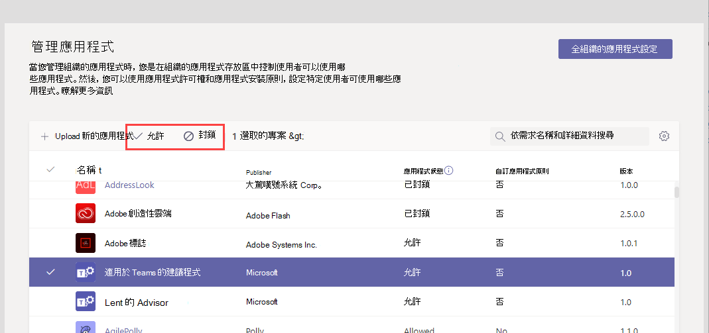

# Microsoft 團隊中的資源特定同意

[!INCLUDE [preview-feature](includes/preview-feature.md)]

Microsoft 團隊中的資源特定同意可讓小組擁有者同意存取小組資料的 app。 這類存取的範例包括閱讀頻道訊息、建立和刪除頻道，以及建立和移除頻道索引標籤的功能。

如果您是管理員，您可以控制貴組織中的小組擁有者是否能透過您使用 Azure Active Directory （Azure AD） PowerShell 模組或 Azure 入口網站和 Microsoft 團隊系統管理中心來設定的設定進行同意。  

## 設定團隊擁有者是否可授與應用程式的同意

您必須設定的設定，才能控制小組擁有者是否可以同意 app。 請務必查看下列所有設定。

### Azure AD 中的設定

下列兩個設定決定團隊擁有者是否可以同意 app。

> [!IMPORTANT]
> 變更這些設定中的任何一個，不會影響已獲同意之 app 的資料存取權。 例如，如果您將這些設定設定為防止小組擁有者同意，這些變更就不會移除已授與的資料存取權。

#### 「使用者可以同意代表自己存取公司資料的 app」設定

此設定會控制貴組織中的使用者是否可以代表自己同意 app。 若要讓小組擁有者授與同意，此設定必須設定為 **[是]**。 若要管理此設定，請執行下列動作：

1. 在 Azure 入口網站中，移至 [**企業應用程式**]  >  **使用者設定**。
2. 在 [**企業應用程式**] 底下，設定**使用者可以同意代表自己存取公司資料的應用程式** **，或****選擇 [是]**。

您也可以使用 PowerShell 管理此設定。 若要深入瞭解，請參閱[設定使用者內容到應用程式](https://docs.microsoft.com/azure/active-directory/manage-apps/configure-user-consent#configure-user-consent-to-applications)。

#### "EnableGroupSpecificConsent" 設定

此設定會控制貴組織中的使用者是否可以同意針對其擁有之群組存取公司資料的 app。 必須為小組擁有者啟用此設定，才能授與同意。 如需如何使用 PowerShell 管理此設定的步驟，請參閱[將群組擁有者同意設定為存取群組資料的 app](https://docs.microsoft.com/azure/active-directory/manage-apps/configure-user-consent#configure-group-owner-consent-to-apps-accessing-group-data)。

### Microsoft 團隊系統管理中心中的設定

除了 Azure AD 中的設定、[[管理應用程式](manage-apps.md)] 頁面上的 [集中式[應用程式設定](manage-apps.md#manage-org-wide-app-settings)]、[[管理應用程式](manage-apps.md#allow-and-block-apps)] 頁面上的 [已封鎖] 或 [允許]，以及分派給小組擁有者的[應用程式許可權原則](teams-app-permission-policies.md)，決定小組擁有者是否同意。

> [!IMPORTANT]
> 變更這些設定中的任何一個，不會影響已獲同意之 app 的資料存取權。 例如，如果您停用協力廠商應用程式，或是您封鎖特定 app 來避免小組擁有者同意，這些變更不會移除已授與的資料存取權。  

#### 整個組織內應用程式設定中的 [允許協力廠商應用程式] 設定

此全組織式應用程式設定可控制貴組織中的使用者是否可以使用協力廠商應用程式。 此設定必須是開啟的，才能讓小組擁有者同意。 若要管理此設定，請執行下列動作：

1. 在 Microsoft 團隊系統管理中心的左導覽中，移至 [**團隊 app**  >  **管理 app**]，然後按一下 [**全組織式應用程式設定**]。
2. 在 [**協力廠商應用程式**] 底下，關閉或開啟 [**允許協力廠商應用程式**]。

    ![[在小組中允許協力廠商應用程式] 設定的螢幕擷取畫面](media/resource-specific-consent-org-wide-setting.png)

您可能需要等候 24 小時，變更才會生效。

#### 允許或封鎖組織層級的應用程式

當您封鎖或允許 [[管理應用程式](manage-apps.md#allow-and-block-apps)] 頁面上的應用程式時，該應用程式會遭到封鎖，或您組織中的所有使用者都能使用該 app。 小組擁有者只會在允許應用程式時，同意 app。 若要允許或封鎖組織階層的 app，請執行下列動作：

1. 在 Microsoft 團隊系統管理中心的左導覽中，移至 [**團隊 app**  >  **管理應用程式**]。
2. 在 [管理應用程式] 頁面上，選取應用程式，然後按一下 [**封鎖**] 來封鎖它，或按一下 [**允許**] 以允許它。

    

#### 指派給小組擁有者的 App 許可權原則

小組擁有者只可以同意其 app 許可權原則允許其執行的 app。 若要查看及管理指派給小組擁有者的應用程式許可權原則，請執行下列動作：

1. 在 Microsoft 團隊系統管理中心的左導覽中，前往 [**使用者**]。
2. 按兩下小組擁有者的顯示名稱，然後按一下 [**原則**]。
3. 指派給小組擁有者的原則會列在 [**應用程式許可權原則**] 底下。
    - 若要指派其他原則，請按一下 [**編輯**]，然後選取您要指派的原則。
    - 若要編輯指派給小組擁有者的原則設定，請按一下 [原則名稱]，然後進行所要的變更。  

## 上傳自訂應用程式

當您上傳使用資源特定同意的自訂應用程式（也稱為旁載）時，應用程式必須來自要安裝的租使用者。 換句話說，Azure AD app 註冊必須來自于此租使用者。 全域管理員會免除此限制，而且可以從任何租使用者直接上傳至小組（側載）或租使用者目錄的自訂 app。

## 相關主題

- [Microsoft Graph](https://developer.microsoft.com/graph)
- [在 Microsoft 團隊系統管理中心管理您的應用程式](manage-apps.md)
- [在 Teams 中管理應用程式權限原則](teams-app-permission-policies.md)
