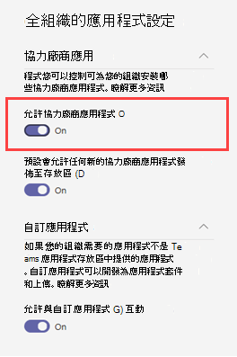

# 中特定資源Microsoft Teams

[!INCLUDE [preview-feature](includes/preview-feature.md)]

團隊中的資源特定Microsoft Teams可讓團隊擁有者同意應用程式存取小組資料。 這類存取的範例包括讀取頻道訊息、建立及刪除頻道，以及建立及移除頻道標籤。

做為系統管理員，您可以控制貴組織中團隊擁有者是否可以透過您透過 Azure Active Directory (Azure AD) PowerShell 模組或 Azure 入口網站和系統管理中心所設定Microsoft Teams同意。  

## 設定團隊擁有者是否可以同意應用程式

以下是您必須設定來控制團隊擁有者是否可以同意應用程式。 請務必檢查下列所有設定。

### 設定 Azure AD

下列兩個設定會決定團隊擁有者是否可以同意應用程式。

> [!IMPORTANT]
> 變更這些設定並不會影響已獲得同意之 App 的存取資料。 例如，如果您設定這些設定以防止團隊擁有者同意，這些變更不會移除已授予的資料存取權。

#### 「使用者可以同意應用程式代表他們存取公司資料」設定

此設定可控制貴組織的使用者是否能代表他們同意使用 App。 若要讓團隊擁有者同意，此設定必須設為 **是**。 若要管理此設定，請執行下列操作：

1. 在 Azure 入口網站中，前往 **Enterprise應用程式**  >  **使用者設定**。
2. 在 **Enterprise應用程式** 下，將使用者可以 **同意** 代表其存取公司資料的 App 設為 **No** 或 **Yes**。

您也可以使用 PowerShell 管理此設定。 若要深入瞭解，請參閱設定 [應用程式的使用者內容](/azure/active-directory/manage-apps/configure-user-consent#configure-user-consent-to-applications)。

#### 「EnableGroupSpecificConsent」設定

此設定可控制貴組織中使用者是否可以同意應用程式存取他們擁有之群組的公司資料。 團隊擁有者必須啟用此設定，才能表示同意。 若要瞭解如何使用 PowerShell 管理此設定的步驟，請參閱設定群組擁有者同意 [存取群組資料的應用程式](/azure/active-directory/manage-apps/configure-user-consent#configure-group-owner-consent-to-apps-accessing-group-data)。

### 設定系統管理Microsoft Teams中心

除了 Azure AD 中的設定之外，在管理應用程式頁面上的全組織應用程式設定、應用程式在管理應用程式頁面上是否受到封鎖或允許，以及指派給團隊擁有者的應用程式許可權政策，都決定團隊擁有者是否可以給予同意。

> [!IMPORTANT]
> 變更這些設定並不會影響已獲得同意之 App 的存取資料。 例如，如果您停用全組織的協力廠商應用程式，或是封鎖特定應用程式，以防止團隊擁有者同意，這些變更不會移除已授予的資料存取權。  

#### 全組織 App 設定中的 「允許協力廠商應用程式」設定

此全組織應用程式設定可控制貴組織中的使用者是否可以使用協力廠商應用程式。 此設定必須為啟用，才能讓團隊擁有者同意。 若要管理此設定，請執行下列操作：

1. 在系統管理中心的左側導Microsoft Teams，請Teams **應用程式**  >  **管理** 應用程式，然後按一下 [全 **組織應用程式設定**>。
2. 在第 **三方應用程式** 下，關閉或開啟允許 **協力廠商應用程式**。

    

您可能需要等候 24 小時，變更才會生效。

#### 在組織層級允許或封鎖應用程式

當您封鎖或允許管理應用程式頁面上的應用程式時，該應用程式會封鎖或允許貴組織的所有使用者使用。 只有允許應用程式時，團隊擁有者才能同意應用程式。 若要允許或封鎖組織層級的應用程式，請執行下列操作：

1. 在 Microsoft Teams 系統管理中心的左側瀏覽窗格中，移至 **Teams 應用程式** > **管理應用程式**。
2. 在 [管理應用程式> 頁面上，選取應用程式， **然後按一下 [封鎖** 以封鎖它或 **按一下 [允許** 允許該 App。

    

#### 指派給團隊擁有者的應用程式權限原則

團隊擁有者只能同意其應用程式權限原則允許其執行的應用程式。 若要查看及管理指派給團隊擁有者的應用程式許可權政策，請執行下列操作：

1. 在系統管理中心的左側導Microsoft Teams，**請前往使用者**。
2. 按兩下團隊擁有者的顯示名稱，然後按一下 [ **政策**。
3. 指派給團隊擁有者的政策會列在 **應用程式許可權政策下**。
    - 若要指派不同的策略，請按一下 [ **編輯**，然後選取您想要指派的策略。
    - 若要編輯指派給團隊擁有者之策略的設定，請按一下該策略名稱，然後進行您想要的變更。  

## 上傳自訂應用程式

上傳自訂應用程式 (亦稱為) 使用特定資源同意的側載應用程式時，應用程式必須來自其安裝的租使用者。 換句話說，應用程式註冊Azure AD來自此租使用者。 全域系統管理員不受此限制，而且可以直接將自訂應用程式從任何租使用者上傳至小組 (側載入) 或租使用者應用程式目錄。

## 相關主題

- [可用的 RSC 許可權](/microsoftteams/platform/graph-api/rsc/resource-specific-consent)
- [Microsoft Graph](https://developer.microsoft.com/graph)
- [在系統管理中心管理Microsoft Teams應用程式](manage-apps.md)
- [在 Teams 中管理應用程式權限原則](teams-app-permission-policies.md)
