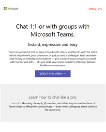
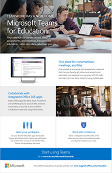

適用于教育系統管理員的 Microsoft 團隊資源
==============================================

## 採用內容

使用學校的資訊和標誌建立自訂的電子郵件訊息、海報及海報。 或者，您可以使用 [現成的列印海報]、[傳單] 及其他講義，讓您的組織對 Microsoft 團隊感到興奮。

|可自訂的電子郵件範本 |         |
|---------|---------|
|**瞭解團隊的基本概念** [下載 .zip 檔案](https://github.com/MicrosoftDocs/OfficeDocs-SkypeForBusiness/blob/live/Teams/downloads/edu-resources/getting-started.zip?raw=true)  ![瞭解 [團隊基本資訊] 電子郵件範本的螢幕擷取畫面。](media/outlook-template-teams-basics.png)   |**自訂您的學習環境** [下載 .zip 檔案](https://github.com/MicrosoftDocs/OfficeDocs-SkypeForBusiness/blob/live/Teams/downloads/edu-resources/customize-learning.zip?raw=true) ![[自訂您的學習環境] 範本的螢幕擷取畫面。](media/outlook-template-teams-learn.png)       |
|**瞭解如何在團隊中簡化您的工作流程** [下載 .zip 檔案](https://github.com/MicrosoftDocs/OfficeDocs-SkypeForBusiness/blob/live/Teams/downloads/edu-resources/workflows.zip?raw=true)      |**瞭解如何像專業人員聊天** [下載 .zip 檔案](https://github.com/MicrosoftDocs/OfficeDocs-SkypeForBusiness/blob/live/Teams/downloads/edu-resources/chat.zip?raw=true)         |
|**在旅途中隨身攜帶團隊** [下載 .zip 檔案](https://github.com/MicrosoftDocs/OfficeDocs-SkypeForBusiness/blob/live/Teams/downloads/edu-resources/get-teams.zip?raw=true) ![[取得小組] 範本的螢幕擷取畫面。](media/outlook-template-teams-connect.png)    |          |

|可自訂且可供列印的海報和海報  |        |
|---------|---------|
|**介紹 Microsoft 團隊教育版-值** [下載可自訂的 .docx 檔案](https://github.com/MicrosoftDocs/OfficeDocs-SkypeForBusiness/blob/live/Teams/downloads/edu-resources/teams-edu-customizable-poster-intro-values.docx?raw=true) [下載現成的 .pdf 檔](https://github.com/MicrosoftDocs/OfficeDocs-SkypeForBusiness/blob/live/Teams/downloads/edu-resources/teams-edu-posters-values.pdf?raw=true) ![[值] 海報的螢幕擷取畫面。](media/poster-intro-values.png)    |**Microsoft 團隊教育版簡介-功能** [下載可自訂的 .docx 檔案](https://github.com/MicrosoftDocs/OfficeDocs-SkypeForBusiness/blob/live/Teams/downloads/edu-resources/team-edu-customizable-poster-intro-features.docx?raw=true) [下載現成的 .pdf 檔](https://github.com/MicrosoftDocs/OfficeDocs-SkypeForBusiness/blob/live/Teams/downloads/edu-resources/teams-edu-poster-features.pdf?raw=true) ![[功能] 海報的螢幕擷取畫面。](media/poster-intro-features.png)          |
|**使用 Microsoft 團隊的價值** [下載可自訂的 .docx 檔案](https://github.com/MicrosoftDocs/OfficeDocs-SkypeForBusiness/blob/live/Teams/downloads/edu-resources/teams-edu-customizable-poster-empower-values.docx?raw=true) [下載現成的 .pdf 檔](https://github.com/MicrosoftDocs/OfficeDocs-SkypeForBusiness/blob/live/Teams/downloads/edu-resources/teams-edu-posters-values.pdf?raw=true) ![[準備值] 海報的螢幕擷取畫面。](media/poster-empower-values.png)   |**使用 Microsoft 團隊的功能** [下載可自訂的 .docx 檔案](https://github.com/MicrosoftDocs/OfficeDocs-SkypeForBusiness/blob/live/Teams/downloads/edu-resources/teams-edu-customizable-poster-empower-features.docx?raw=true) [下載現成的 .pdf 檔](https://github.com/MicrosoftDocs/OfficeDocs-SkypeForBusiness/blob/live/Teams/downloads/edu-resources/teams-edu-poster-features.pdf?raw=true) ![[功能] 標牌的螢幕擷取畫面。](media/poster-empower-features.png)          |
|**Microsoft 團隊教育版的價值** [下載可自訂的 .docx 檔案](https://github.com/MicrosoftDocs/OfficeDocs-SkypeForBusiness/blob/live/Teams/downloads/edu-resources/teams-edu-customizable-flyer-values.docx?raw=true) [下載現成的 .pdf 檔](https://github.com/MicrosoftDocs/OfficeDocs-SkypeForBusiness/blob/live/Teams/downloads/edu-resources/teams-edu-flyer-values.pdf?raw=true)     |**Microsoft 團隊教育版的功能** [下載可自訂的 .docx 檔案](https://github.com/MicrosoftDocs/OfficeDocs-SkypeForBusiness/blob/live/Teams/downloads/edu-resources/teams-edu-customizable-flyer-values.docx?raw=true) [下載現成的 .pdf 檔](https://github.com/MicrosoftDocs/OfficeDocs-SkypeForBusiness/blob/live/Teams/downloads/edu-resources/teams-edu-flyer-features.pdf?raw=true)         |

|可供列印的資料包  |        |
|---------|---------|
|**開始使用 Microsoft 團隊取得教育版-秘訣和訣竅** [下載現成的 .pdf 檔](https://github.com/MicrosoftDocs/OfficeDocs-SkypeForBusiness/blob/live/Teams/downloads/edu-resources/teams-edu-packet-get-started.pdf?raw=true)     |

## 行動信號

- 查看我們的[Microsoft 團隊互動示範](https://teamsdemo.office.com/)（完成5分鐘）
- 在[microsoft 365 系統管理中心](https://portal.office.com/adminportal/home#/Settings/ServicesAndAddIns)開啟 microsoft 團隊（以 Office 365 系統管理員身分登入）
- 下載團隊用戶端：[在您的所有裝置上取得團隊](https://teams.microsoft.com/downloads)
- 深入瞭解 Office 365 教育版說明[中心](https://support.office.com/education)

## 其他資源

- [Microsoft 團隊藍圖](https://aka.ms/teamsroadmap)
- 使用我們的[技術社區博客](https://techcommunity.microsoft.com/t5/Microsoft-Teams-Blog/bg-p/MicrosoftTeamsBlog)掌握最新資訊
- Matt Soseman 「高效雲端」 [Microsoft 團隊 PowerShell 支援](https://blogs.technet.microsoft.com/skypehybridguy/2017/11/07/microsoft-teams-powershell-support/)的博客
- [傳送建議](https://aka.ms/eduuservoice)
- [聯絡客戶支援](https://aka.ms/o365portal)
- [詢問團隊社區](https://aka.ms/msteamscommunity)
- [尋找更多教育版資源](https://education.microsoft.com/)

