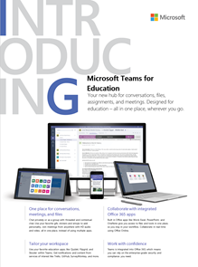

適用于教育系統管理員的 Microsoft 團隊資源Microsoft Teams resources for Education admins
==============================================

## 採用內容Adoption content

使用學校的資訊和標誌建立自訂的電子郵件訊息、海報及海報。Create customized email messages, posters, and flyers with your school's information and logo. 或者，您可以使用 [現成的列印海報]、[傳單] 及其他講義，讓您的組織對 Microsoft 團隊感到興奮。Or use ready-to-print posters, flyers, and other handouts to get your organization excited about Microsoft Teams.

|可自訂的電子郵件範本Customizable email templates |         |
|---------|---------|
|**瞭解團隊的基本概念****Learn the Teams Basics** [下載 .zip 檔案Download the .zip file](https://github.com/MicrosoftDocs/OfficeDocs-SkypeForBusiness/blob/live/Teams/downloads/edu-resources/getting-started.zip?raw=true)  ![瞭解 [團隊基本資訊] 電子郵件範本的螢幕擷取畫面。](media/outlook-template-teams-basics.png)   |**自訂您的學習環境****Customize your learning environment** [下載 .zip 檔案Download the .zip file](https://github.com/MicrosoftDocs/OfficeDocs-SkypeForBusiness/blob/live/Teams/downloads/edu-resources/customize-learning.zip?raw=true) ![[自訂您的學習環境] 範本的螢幕擷取畫面。](media/outlook-template-teams-learn.png)       |
|**瞭解如何在團隊中簡化您的工作流程****See how to streamline your workflow in Teams** [下載 .zip 檔案Download the .zip file](https://github.com/MicrosoftDocs/OfficeDocs-SkypeForBusiness/blob/live/Teams/downloads/edu-resources/workflows.zip?raw=true)      |**瞭解如何像專業人員聊天****Learn how to chat like a pro** [下載 .zip 檔案Download the .zip file](https://github.com/MicrosoftDocs/OfficeDocs-SkypeForBusiness/blob/live/Teams/downloads/edu-resources/chat.zip?raw=true)         |
|**在旅途中隨身攜帶團隊****Take Teams on the go** [下載 .zip 檔案Download the .zip file](https://github.com/MicrosoftDocs/OfficeDocs-SkypeForBusiness/blob/live/Teams/downloads/edu-resources/get-teams.zip?raw=true) ![[取得小組] 範本的螢幕擷取畫面。](media/outlook-template-teams-connect.png)    |          |

|可自訂且可供列印的海報和海報Customizable and ready-to-print flyers and posters  |        |
|---------|---------|
|**介紹 Microsoft 團隊教育版-值****Introducing Microsoft Teams for Education - Values** [下載可自訂的 .docx 檔案Download the customizable .docx file](https://github.com/MicrosoftDocs/OfficeDocs-SkypeForBusiness/blob/live/Teams/downloads/edu-resources/teams-edu-customizable-poster-intro-values.docx?raw=true) [下載現成的 .pdf 檔Download the ready-to-print .pdf file](https://github.com/MicrosoftDocs/OfficeDocs-SkypeForBusiness/blob/live/Teams/downloads/edu-resources/teams-edu-posters-values.pdf?raw=true) ![[值] 海報的螢幕擷取畫面。](media/poster-intro-values.png)    |**Microsoft 團隊教育版簡介-功能****Introducing Microsoft Teams for Education - Features** [下載可自訂的 .docx 檔案Download the customizable .docx file](https://github.com/MicrosoftDocs/OfficeDocs-SkypeForBusiness/blob/live/Teams/downloads/edu-resources/team-edu-customizable-poster-intro-features.docx?raw=true) [下載現成的 .pdf 檔Download the ready-to-print .pdf file](https://github.com/MicrosoftDocs/OfficeDocs-SkypeForBusiness/blob/live/Teams/downloads/edu-resources/teams-edu-poster-features.pdf?raw=true) ![[功能] 海報的螢幕擷取畫面。](media/poster-intro-features.png)          |
|**使用 Microsoft 團隊的價值****Empower with Microsoft Teams - Values** [下載可自訂的 .docx 檔案Download the customizable .docx file](https://github.com/MicrosoftDocs/OfficeDocs-SkypeForBusiness/blob/live/Teams/downloads/edu-resources/teams-edu-customizable-poster-empower-values.docx?raw=true) [下載現成的 .pdf 檔Download the ready-to-print .pdf file](https://github.com/MicrosoftDocs/OfficeDocs-SkypeForBusiness/blob/live/Teams/downloads/edu-resources/teams-edu-posters-values.pdf?raw=true) ![[準備值] 海報的螢幕擷取畫面。](media/poster-empower-values.png)   |**使用 Microsoft 團隊的功能****Empower with Microsoft Teams - Features** [下載可自訂的 .docx 檔案Download the customizable .docx file](https://github.com/MicrosoftDocs/OfficeDocs-SkypeForBusiness/blob/live/Teams/downloads/edu-resources/teams-edu-customizable-poster-empower-features.docx?raw=true) [下載現成的 .pdf 檔Download the ready-to-print .pdf file](https://github.com/MicrosoftDocs/OfficeDocs-SkypeForBusiness/blob/live/Teams/downloads/edu-resources/teams-edu-poster-features.pdf?raw=true) ![[功能] 標牌的螢幕擷取畫面。](media/poster-empower-features.png)          |
|**Microsoft 團隊教育版的價值****The value of Microsoft Teams for Education** [下載可自訂的 .docx 檔案Download the customizable .docx file](https://github.com/MicrosoftDocs/OfficeDocs-SkypeForBusiness/blob/live/Teams/downloads/edu-resources/teams-edu-customizable-flyer-values.docx?raw=true) [下載現成的 .pdf 檔Download the ready-to-print .pdf file](https://github.com/MicrosoftDocs/OfficeDocs-SkypeForBusiness/blob/live/Teams/downloads/edu-resources/teams-edu-flyer-values.pdf?raw=true)     |**Microsoft 團隊教育版的功能****The features of Microsoft Teams for Education** [下載可自訂的 .docx 檔案Download the customizable .docx file](https://github.com/MicrosoftDocs/OfficeDocs-SkypeForBusiness/blob/live/Teams/downloads/edu-resources/teams-edu-customizable-flyer-values.docx?raw=true) [下載現成的 .pdf 檔Download the ready-to-print .pdf file](https://github.com/MicrosoftDocs/OfficeDocs-SkypeForBusiness/blob/live/Teams/downloads/edu-resources/teams-edu-flyer-features.pdf?raw=true)         |

|可供列印的資料包Ready-to-print packets  |        |
|---------|---------|
|**開始使用 Microsoft 團隊取得教育版-秘訣和訣竅****Get started with Microsoft Teams for Education - Tips and Tricks** [下載現成的 .pdf 檔Download the ready-to-print .pdf file](https://github.com/MicrosoftDocs/OfficeDocs-SkypeForBusiness/blob/live/Teams/downloads/edu-resources/teams-edu-packet-get-started.pdf?raw=true)     |

## 行動信號Call to action

- 查看我們的[Microsoft 團隊互動示範](https://teamsdemo.office.com/)（完成5分鐘）Check out our hands-on [Microsoft Teams Interactive Demo](https://teamsdemo.office.com/) (5 minutes to complete)
- 在[microsoft 365 系統管理中心](https://portal.office.com/adminportal/home#/Settings/ServicesAndAddIns)開啟 microsoft 團隊（以 Office 365 系統管理員身分登入）Turn on Microsoft Teams in the [Microsoft 365 admin center](https://portal.office.com/adminportal/home#/Settings/ServicesAndAddIns) (sign in as an Office 365 admin)
- 下載團隊用戶端：[在您的所有裝置上取得團隊](https://teams.microsoft.com/downloads)Download Teams clients: [Get Teams on all your devices](https://teams.microsoft.com/downloads)
- 深入瞭解 Office 365 教育版說明[中心](https://support.office.com/education)Learn more about Office 365 for Education at the [Education help center](https://support.office.com/education)

## 其他資源Additional resources

- [Microsoft 團隊藍圖Microsoft Teams roadmap](https://aka.ms/teamsroadmap)
- 使用我們的[技術社區博客](https://techcommunity.microsoft.com/t5/Microsoft-Teams-Blog/bg-p/MicrosoftTeamsBlog)掌握最新資訊Stay up to date with our [Tech Community Blog](https://techcommunity.microsoft.com/t5/Microsoft-Teams-Blog/bg-p/MicrosoftTeamsBlog)
- Matt Soseman 「高效雲端」 [Microsoft 團隊 PowerShell 支援](https://blogs.technet.microsoft.com/skypehybridguy/2017/11/07/microsoft-teams-powershell-support/)的博客Matt Soseman's "The Productive Cloud" Blog about [Microsoft Teams PowerShell Support](https://blogs.technet.microsoft.com/skypehybridguy/2017/11/07/microsoft-teams-powershell-support/)
- [傳送建議Send a suggestion](https://aka.ms/eduuservoice)
- [聯絡客戶支援Contact support](https://aka.ms/o365portal)
- [詢問團隊社區Ask the Teams community](https://aka.ms/msteamscommunity)
- [尋找更多教育版資源Find more resources for education](https://education.microsoft.com/)

