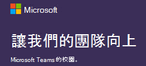

# 適用於 Microsoft Teams 教育版管理員的資源

## 遠端學習的資源

您的學校或大學是否需要啟用遠端Microsoft Teams功能？ 使用快速入門單頁機及下列任何採用資料快速上手！

## 採用內容

讓學校Microsoft Teams電子郵件、海報、講義，以及更多您現在可自由使用的資源。 您也可以使用充滿橫幅、GIF 和影片的新數位工具套件，與線上和整個校園的學生聯繫。 今天開始使用！

使用這些資料 [之前，請先](https://github.com/MicrosoftDocs/OfficeDocs-SkypeForBusiness/blob/live/Teams/downloads/edu-resources/license_agreement_teams_for_education.pdf?raw=true) 閱讀條款與條件。

### 實體資產

|&nbsp; | &nbsp; |
|---------|---------|
|海報 - [可自訂](https://github.com/MicrosoftDocs/OfficeDocs-SkypeForBusiness/blob/live/Teams/downloads/edu-resources/posters-customizable.zip?raw=true) 且 [可列印](https://github.com/MicrosoftDocs/OfficeDocs-SkypeForBusiness/blob/live/Teams/downloads/edu-resources/posters-print-ready.zip?raw=true)      |[講義](https://github.com/MicrosoftDocs/OfficeDocs-SkypeForBusiness/blob/live/Teams/downloads/edu-resources/handouts.zip?raw=true) |
|[傳單](https://github.com/MicrosoftDocs/OfficeDocs-SkypeForBusiness/blob/live/Teams/downloads/edu-resources/flyers.zip?raw=true)    |[書籍廣告](https://github.com/MicrosoftDocs/OfficeDocs-SkypeForBusiness/blob/live/Teams/downloads/edu-resources/book-adverts.zip?raw=true)          |
|[小提示和訣竅摺頁冊的相片。](https://github.com/MicrosoftDocs/OfficeDocs-SkypeForBusiness/blob/live/Teams/downloads/edu-resources/get-started-tips-tricks.zip?raw=true)      |

### 數位資產

請務必查看數位工具套件[指南，](https://github.com/MicrosoftDocs/OfficeDocs-SkypeForBusiness/blob/live/Teams/downloads/edu-resources/digital-toolkit-guidance.zip?raw=true)以最大化您的Teams啟動！ 

| &nbsp; |&nbsp;  |
|---------|---------|
|[電子郵件範本](https://github.com/MicrosoftDocs/OfficeDocs-SkypeForBusiness/blob/live/Teams/downloads/edu-resources/email-templates.zip?raw=true)      |[GIF](https://github.com/MicrosoftDocs/OfficeDocs-SkypeForBusiness/blob/live/Teams/downloads/edu-resources/gifs.zip?raw=true)         |
|[網頁橫幅](https://github.com/MicrosoftDocs/OfficeDocs-SkypeForBusiness/blob/live/Teams/downloads/edu-resources/web-banners.zip?raw=true)     |[視頻](https://github.com/MicrosoftDocs/OfficeDocs-SkypeForBusiness/blob/live/Teams/downloads/edu-resources/videos.zip?raw=true)           |
|[數位螢幕廣告](https://github.com/MicrosoftDocs/OfficeDocs-SkypeForBusiness/blob/live/Teams/downloads/edu-resources/digital-screen-adverts.zip?raw=true)    |      |

## 行動信號

- 請流覽[Teams 教育版](https://www.microsoft.com/en-us/education/products/teams/default.aspx)頁面以觀看訓練、影片和互動式示範
- 在 Teams 中開啟[Microsoft 365 系統管理中心 (](https://portal.office.com/adminportal/home#/Settings/ServicesAndAddIns)以系統管理員Office 365) 
- 下載Teams用戶端[：在所有Teams上取得](https://teams.microsoft.com/downloads)
- 在教育Office 365中心深入瞭解[教育用教育課程](https://support.office.com/education)

## 其他資源

- [Teams藍圖](https://aka.ms/teamsroadmap)
- 使用我們的 Tech Community[部落格Community最新](https://techcommunity.microsoft.com/t5/Microsoft-Teams-Blog/bg-p/MicrosoftTeamsBlog)
- [Teams PowerShell 概觀](teams-powershell-overview.md)
- [傳送建議](https://aka.ms/eduuservoice)
- [與支援人員聯繫](https://aka.ms/o365portal)
- [詢問Teams社群](https://aka.ms/msteamscommunity)
- [尋找更多教育資源](https://education.microsoft.com/)
