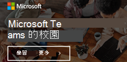

適用於 Microsoft Teams 教育版管理員的資源
==============================================

## 採用內容

透過電子郵件、海報、講義及其他您可以免費使用的資源，讓您的學校感到興奮。 您也可以透過含橫幅、Gif 及影片的新數位工具台，在整個校園中與學生進行線上與進行。 今天就開始吧！

在使用這些材料前，請先閱讀[條款與條件](https://github.com/MicrosoftDocs/OfficeDocs-SkypeForBusiness/blob/live/Teams/downloads/edu-resources/license_agreement_teams_for_education.pdf?raw=true)。

### 實物資產

| |  |
|---------|---------|
|[秘訣和訣竅手冊](https://github.com/MicrosoftDocs/OfficeDocs-SkypeForBusiness/blob/live/Teams/downloads/edu-resources/get-started-tips-tricks.zip?raw=true)      |
|海報-[可自訂](https://github.com/MicrosoftDocs/OfficeDocs-SkypeForBusiness/blob/live/Teams/downloads/edu-resources/posters-customizable.zip?raw=true)且[列印就緒](https://github.com/MicrosoftDocs/OfficeDocs-SkypeForBusiness/blob/live/Teams/downloads/edu-resources/posters-print-ready.zip?raw=true)      |[演講](https://github.com/MicrosoftDocs/OfficeDocs-SkypeForBusiness/blob/live/Teams/downloads/edu-resources/handouts.zip?raw=true) |
|[單](https://github.com/MicrosoftDocs/OfficeDocs-SkypeForBusiness/blob/live/Teams/downloads/edu-resources/flyers.zip?raw=true)    |[書籍 adverts](https://github.com/MicrosoftDocs/OfficeDocs-SkypeForBusiness/blob/live/Teams/downloads/edu-resources/book-adverts.zip?raw=true)          |

### 數位資產

請務必查看[數位工具組](https://github.com/MicrosoftDocs/OfficeDocs-SkypeForBusiness/blob/live/Teams/downloads/edu-resources/digital-toolkit-guidance.zip?raw=true)的相關指南，讓您的團隊開始發揮最大的效用！ 

|  |  |
|---------|---------|
|[電子郵件範本](https://github.com/MicrosoftDocs/OfficeDocs-SkypeForBusiness/blob/live/Teams/downloads/edu-resources/email-templates.zip?raw=true)      |[Gif](https://github.com/MicrosoftDocs/OfficeDocs-SkypeForBusiness/blob/live/Teams/downloads/edu-resources/gifs.zip?raw=true)         |
|[網頁橫幅](https://github.com/MicrosoftDocs/OfficeDocs-SkypeForBusiness/blob/live/Teams/downloads/edu-resources/web-banners.zip?raw=true)     |[資料](https://github.com/MicrosoftDocs/OfficeDocs-SkypeForBusiness/blob/live/Teams/downloads/edu-resources/videos.zip?raw=true)           |
|[數位螢幕 adverts](https://github.com/MicrosoftDocs/OfficeDocs-SkypeForBusiness/blob/live/Teams/downloads/edu-resources/digital-screen-adverts.zip?raw=true)    |      |

## 行動信號

- 請流覽[教育版團隊頁面](https://www.microsoft.com/en-us/education/products/teams/default.aspx)，以取得訓練、影片和互動式示範
- 在[Microsoft 365 系統管理中心](https://portal.office.com/adminportal/home#/Settings/ServicesAndAddIns)開啟團隊（以 Office 365 系統管理員身分登入）
- 下載團隊用戶端：[在您的所有裝置上取得團隊](https://teams.microsoft.com/downloads)
- 深入瞭解 Office 365 教育版說明[中心](https://support.office.com/education)

## 其他資源

- [團隊藍圖](https://aka.ms/teamsroadmap)
- 使用我們的[技術社區博客](https://techcommunity.microsoft.com/t5/Microsoft-Teams-Blog/bg-p/MicrosoftTeamsBlog)掌握最新資訊
- [團隊 PowerShell 概覽](teams-powershell-overview.md)
- [傳送建議](https://aka.ms/eduuservoice)
- [聯絡客戶支援](https://aka.ms/o365portal)
- [詢問團隊社區](https://aka.ms/msteamscommunity)
- [尋找更多教育版資源](https://education.microsoft.com/)
