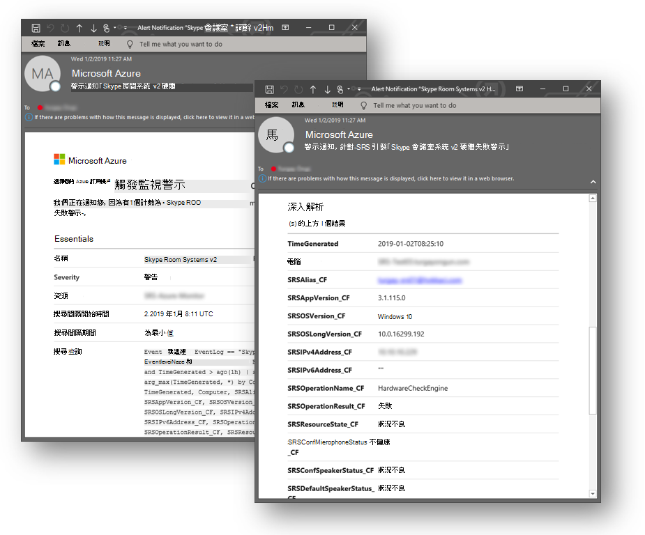

# <a name="deploy-microsoft-teams-rooms-management-with-azure-monitor"></a><span data-ttu-id="921eb-103">使用 Azure 監視器部署 Microsoft 團隊聊天室管理</span><span class="sxs-lookup"><span data-stu-id="921eb-103">Deploy Microsoft Teams Rooms management with Azure Monitor</span></span>

<span data-ttu-id="921eb-104">本文將說明如何使用 Azure 監視器設定及部署 Microsoft 團隊會議室裝置的整合端對端管理。</span><span class="sxs-lookup"><span data-stu-id="921eb-104">This article discusses how to set up and deploy integrated, end-to-end management of Microsoft Teams Rooms devices by using Azure Monitor.</span></span>

<span data-ttu-id="921eb-105">您可以在 Azure 監視器中設定 Log Analytics，以提供基本的遙測和警示，協助您管理 Microsoft 團隊聊天室會議室裝置。</span><span class="sxs-lookup"><span data-stu-id="921eb-105">You can configure Log Analytics within Azure Monitor to provide basic telemetry and alerts that will help you manage Microsoft Teams Rooms meeting room devices.</span></span> <span data-ttu-id="921eb-106">隨著您的管理解決方案逐漸成熟，您可能會決定要部署其他資料和管理功能來建立更詳細的裝置可用性與效能的視圖。</span><span class="sxs-lookup"><span data-stu-id="921eb-106">As your management solution matures, you might decide to deploy additional data and management capabilities to create a more detailed view of device availability and performance.</span></span>

<span data-ttu-id="921eb-107">透過遵循本指南，您可以使用類似下列範例的儀表板，來取得裝置可用性、應用程式和硬體健康情況，以及 Microsoft 團隊聊天室應用程式及作業系統版本發佈的詳細狀態報表。</span><span class="sxs-lookup"><span data-stu-id="921eb-107">By following this guide, you can use a dashboard like the following example to get detailed status reporting for device availability, application and hardware health, and Microsoft Teams Rooms application and operating system version distribution.</span></span>

<span data-ttu-id="921eb-108"></span><span class="sxs-lookup"><span data-stu-id="921eb-108"></span></span>

<span data-ttu-id="921eb-109">在較高的層次，您必須執行下列工作：</span><span class="sxs-lookup"><span data-stu-id="921eb-109">At a high level, you need to perform the following tasks:</span></span>


1. [<span data-ttu-id="921eb-110">驗證 Log Analytics 設定</span><span class="sxs-lookup"><span data-stu-id="921eb-110">Validate Log Analytics configuration</span></span>](azure-monitor-deploy.md#validate_LogAnalytics)
2. [<span data-ttu-id="921eb-111">針對 Log Analytics 管理設定設定測試裝置</span><span class="sxs-lookup"><span data-stu-id="921eb-111">Configure test devices for Log Analytics management setup</span></span>](azure-monitor-deploy.md#configure_test_devices)
3. [<span data-ttu-id="921eb-112">對應自訂欄位</span><span class="sxs-lookup"><span data-stu-id="921eb-112">Map custom fields</span></span>](azure-monitor-deploy.md#Custom_fields)
4. [<span data-ttu-id="921eb-113">在 Log Analytics 中定義 Microsoft 團隊聊天室視圖</span><span class="sxs-lookup"><span data-stu-id="921eb-113">Define the Microsoft Teams Rooms views in Log Analytics</span></span>](azure-monitor-deploy.md#Define_Views)
5. [<span data-ttu-id="921eb-114">定義警示</span><span class="sxs-lookup"><span data-stu-id="921eb-114">Define alerts</span></span>](azure-monitor-deploy.md#Alerts)
6. [<span data-ttu-id="921eb-115">設定所有要監視的裝置</span><span class="sxs-lookup"><span data-stu-id="921eb-115">Configure all devices for Monitoring</span></span>](azure-monitor-deploy.md#configure_all_devices)
7. [<span data-ttu-id="921eb-116">設定其他 Azure 監視器解決方案</span><span class="sxs-lookup"><span data-stu-id="921eb-116">Configure additional Azure Monitor solutions</span></span>](azure-monitor-deploy.md#Solutions)

> [!IMPORTANT]
> <span data-ttu-id="921eb-117">雖然使用的是最小的設定，但 Azure 監視器記錄分析可以監視執行 Windows 作業系統的電腦，但在開始部署代理程式到所有 Microsoft 團隊前，仍有一些 Microsoft 團隊機房必須採取的特定步驟。會議室裝置。</span><span class="sxs-lookup"><span data-stu-id="921eb-117">Although with minimal configuration, Azure Monitor Log Analytics can monitor a computer running a Windows operating system, there are still some Microsoft Teams Rooms–specific steps that you need to take before you start deploying agents to all Microsoft Teams Rooms devices.</span></span>
> <span data-ttu-id="921eb-118">因此，我們強烈建議您以正確的循序執行所有設定步驟，以進行受控設定和設定。</span><span class="sxs-lookup"><span data-stu-id="921eb-118">Therefore, we highly recommend you perform all configuration steps in the right order for a controlled setup and configuration.</span></span> <span data-ttu-id="921eb-119">最終結果的品質很高，取決於初始配置的品質。</span><span class="sxs-lookup"><span data-stu-id="921eb-119">The quality of the end result very much depends on the quality of the initial configuration.</span></span>

## <a name="validate-log-analytics-configuration"></a><span data-ttu-id="921eb-120">驗證 Log Analytics 設定</span><span class="sxs-lookup"><span data-stu-id="921eb-120">Validate Log Analytics configuration</span></span>
<span data-ttu-id="921eb-121"><a name="validate_LogAnalytics"> </a></span><span class="sxs-lookup"><span data-stu-id="921eb-121"></span></span>

<span data-ttu-id="921eb-122">您必須擁有 Log Analytics 工作區，才能開始從 Microsoft 團隊聊天室裝置收集記錄。</span><span class="sxs-lookup"><span data-stu-id="921eb-122">You need to have a Log Analytics workspace to start collecting logs from Microsoft Teams Rooms devices.</span></span> <span data-ttu-id="921eb-123">工作區是一種獨特的記錄分析環境，擁有自己的資料存放庫、資料來源及解決方案。</span><span class="sxs-lookup"><span data-stu-id="921eb-123">A workspace is a unique Log Analytics environment with its own data repository, data sources, and solutions.</span></span> <span data-ttu-id="921eb-124">如果您已有 Log Analytics 工作區，您可以使用它來監視 Microsoft 團隊會議室部署，或者，您也可以建立特定于 Microsoft 小組聊天室監視需求的專用 Log Analytics 工作區。</span><span class="sxs-lookup"><span data-stu-id="921eb-124">If you already have an existing Log Analytics workspace, you might use it to monitor your Microsoft Teams Rooms deployment or alternatively, you can create a dedicated Log Analytics workspace specific to your Microsoft Teams Rooms monitoring needs.</span></span>

<span data-ttu-id="921eb-125">如果您需要建立新的 Log Analytics 工作區，請依照在[Azure 入口網站中建立 Log analytics 工作區](https://docs.microsoft.com/azure/azure-monitor/learn/quick-create-workspace)一文中的指示操作。</span><span class="sxs-lookup"><span data-stu-id="921eb-125">If you need to create a new Log Analytics workspace, follow the instructions in the article [Create a Log Analytics workspace in the Azure portal](https://docs.microsoft.com/azure/azure-monitor/learn/quick-create-workspace)</span></span>

> [!NOTE]
> <span data-ttu-id="921eb-126">若要將 Log Analytics 與 Azure 監視器搭配使用，您必須擁有有效的 Azure 訂閱。</span><span class="sxs-lookup"><span data-stu-id="921eb-126">To use Log Analytics with Azure Monitor, you need to have an active Azure subscription.</span></span> <span data-ttu-id="921eb-127">如果您沒有 Azure 訂閱，您可以建立[免費試用訂閱](https://azure.microsoft.com/free)作為起始點。</span><span class="sxs-lookup"><span data-stu-id="921eb-127">If you don’t have an Azure subscription, you can create [a free trial subscription](https://azure.microsoft.com/free) as a starting point.</span></span>

### <a name="configure-log-analytics-to-collect-microsoft-teams-rooms-event-logs"></a><span data-ttu-id="921eb-128">設定記錄分析以收集 Microsoft 團隊聊天室事件記錄</span><span class="sxs-lookup"><span data-stu-id="921eb-128">Configure Log Analytics to collect Microsoft Teams Rooms event logs</span></span>

<span data-ttu-id="921eb-129">Log Analytics 只會收集設定中指定的 Windows 事件記錄事件。</span><span class="sxs-lookup"><span data-stu-id="921eb-129">Log Analytics only collects events from the Windows event logs that are specified in the settings.</span></span> <span data-ttu-id="921eb-130">針對每個記錄，只會收集已選取嚴重性的事件。</span><span class="sxs-lookup"><span data-stu-id="921eb-130">For each log, only the events with the selected severities are collected.</span></span>

<span data-ttu-id="921eb-131">您需要設定記錄分析，以收集監視 Microsoft 團隊聊天室裝置和應用程式狀態所需的記錄。</span><span class="sxs-lookup"><span data-stu-id="921eb-131">You need to configure Log Analytics to collect the logs required to monitor Microsoft Teams Rooms device and application status.</span></span> <span data-ttu-id="921eb-132">Microsoft 團隊會議室裝置會使用**Skype 室系統**事件記錄檔。</span><span class="sxs-lookup"><span data-stu-id="921eb-132">Microsoft Teams Rooms devices use the **Skype Room System** event log.</span></span>

<span data-ttu-id="921eb-133">若要設定記錄分析以收集 Microsoft 團隊聊天室事件，請參閱[Azure 監視器中的 Windows 事件記錄資料來源](https://docs.microsoft.com/azure/azure-monitor/platform/data-sources-windows-events)</span><span class="sxs-lookup"><span data-stu-id="921eb-133">To configure Log Analytics to collect the Microsoft Teams Rooms events, see [Windows event log data sources in Azure Monitor](https://docs.microsoft.com/azure/azure-monitor/platform/data-sources-windows-events)</span></span>

<span data-ttu-id="921eb-134">![[事件記錄] 設定的螢幕擷取畫面](../media/Deploy-Azure-Monitor-2.png "事件記錄檔設定")</span><span class="sxs-lookup"><span data-stu-id="921eb-134"></span></span>

> [!IMPORTANT]
> <span data-ttu-id="921eb-135">設定 Windows 事件記錄設定，並輸入 [ **Skype 室系統**] 作為事件記錄名稱，然後選取 [**錯誤**]、[**警告**] 及 [**資訊**] 核取方塊。</span><span class="sxs-lookup"><span data-stu-id="921eb-135">Configure Windows Event Log settings and enter **Skype Room System** as event log name, and then select the **Error**, **Warning**, and **Information** check boxes.</span></span>

## <a name="configure-test-devices-for-azure-monitoring"></a><span data-ttu-id="921eb-136">針對 Azure 監視設定測試裝置</span><span class="sxs-lookup"><span data-stu-id="921eb-136">Configure test devices for Azure Monitoring</span></span>
<span data-ttu-id="921eb-137"><a name="configure_test_devices"> </a></span><span class="sxs-lookup"><span data-stu-id="921eb-137"></span></span>

<span data-ttu-id="921eb-138">您必須準備 Log Analytics，才能監視 Microsoft 團隊聊天室-相關事件。</span><span class="sxs-lookup"><span data-stu-id="921eb-138">You need to prepare Log Analytics to be able to monitor Microsoft Teams Rooms–related events.</span></span> <span data-ttu-id="921eb-139">首先，您必須將 Microsoft Monitoring agent 部署到您擁有實際存取權的一或兩個 Microsoft 團隊會議室裝置，並讓這些測試裝置產生一些資料，並將它推入 Log Analytics 工作區。</span><span class="sxs-lookup"><span data-stu-id="921eb-139">To start with, you need to deploy Microsoft Monitoring agents to just one or two Microsoft Teams Rooms devices that you have physical access to, and get those test devices generate some data and push it to the Log Analytics workspace.</span></span>

### <a name="install-microsoft-monitoring-agents-to-test-devices"></a><span data-ttu-id="921eb-140">安裝 Microsoft Monitoring agent 以測試裝置</span><span class="sxs-lookup"><span data-stu-id="921eb-140">Install Microsoft Monitoring agents to test devices</span></span>

<span data-ttu-id="921eb-141">使用[[連線 Windows 電腦至 Azure 中的 Log Analytics 服務]](https://docs.microsoft.com/azure/azure-monitor/platform/agent-windows)中提供的指示，將 Microsoft Monitoring agent 部署到測試裝置。</span><span class="sxs-lookup"><span data-stu-id="921eb-141">Deploy the Microsoft Monitoring agent to the test devices by using the instructions provided in [Connect Windows computers to the Log Analytics service in Azure](https://docs.microsoft.com/azure/azure-monitor/platform/agent-windows).</span></span> <span data-ttu-id="921eb-142">本文提供部署 Windows 版 Microsoft Monitoring Agent 之步驟的詳細資訊，以及取得 Log Analytics***工作區識別碼***與***主鍵***以取得連線至的 microsoft 團隊聊天室裝置的指示您的 Azure 監視器部署，以及驗證 agent 連線至 Log Analytics 實例的步驟。</span><span class="sxs-lookup"><span data-stu-id="921eb-142">This article provides detailed information about the steps for deploying Microsoft Monitoring Agent for Windows, instructions for obtaining the Log Analytics ***Workspace ID*** and the ***primary key*** to get Microsoft Teams Rooms devices connected to your Azure Monitor deployment, and steps to verify agent connectivity to Log Analytics instance.</span></span>

### <a name="generate-sample-microsoft-teams-rooms-events"></a><span data-ttu-id="921eb-143">產生範例 Microsoft 團隊會議室活動</span><span class="sxs-lookup"><span data-stu-id="921eb-143">Generate sample Microsoft Teams Rooms events</span></span>

<span data-ttu-id="921eb-144">將 Microsoft Monitoring agent 部署到測試裝置之後，請確認 Azure 監視器收集的是所需的事件記錄資料。</span><span class="sxs-lookup"><span data-stu-id="921eb-144">After the Microsoft Monitoring agent is deployed onto the test devices, verify that the required event log data is collected by Azure Monitor.</span></span>

> [!NOTE]
> <span data-ttu-id="921eb-145">安裝 Microsoft Monitoring agent 之後，請重新開機裝置，並確認已啟動 Microsoft 團隊會議室會議應用程式，讓它能在事件記錄檔中產生新的事件。</span><span class="sxs-lookup"><span data-stu-id="921eb-145">Reboot the device after the installation of the Microsoft Monitoring agent, and make sure that Microsoft Teams Rooms Meeting app is started, so that it can generate new events into the Event Log.</span></span>

1.  <span data-ttu-id="921eb-146">登入[Microsoft Azure 入口網站](https://portal.azure.com)，然後移至 [記錄分析]，然後選取您的工作區。</span><span class="sxs-lookup"><span data-stu-id="921eb-146">Sign in to the [Microsoft Azure portal](https://portal.azure.com) and go to Log Analytics and select your workspace.</span></span>

2.  <span data-ttu-id="921eb-147">列出由 Microsoft 團隊聊天室裝置產生的心跳事件：</span><span class="sxs-lookup"><span data-stu-id="921eb-147">List the heartbeat events generated by a Microsoft Teams Rooms device:</span></span>
    1.  <span data-ttu-id="921eb-148">選取您的工作區，然後移至 [**記錄**]，然後使用查詢來檢索將擁有 Microsoft 團隊會議室之自訂欄位的心跳記錄。</span><span class="sxs-lookup"><span data-stu-id="921eb-148">Select your workspace and go to **Logs** and use a query to retrieve the heartbeat records that will have the custom fields for Microsoft Teams Rooms.</span></span>
    2.  <span data-ttu-id="921eb-149">範例查詢：`Event | where Source == "SRS-App" and EventID == 2000`</span><span class="sxs-lookup"><span data-stu-id="921eb-149">Sample query: `Event | where Source == "SRS-App" and EventID == 2000`</span></span>

3.  <span data-ttu-id="921eb-150">確認查詢傳回包含由 Microsoft 小組聊天室會議 app 所產生之事件的記錄記錄。</span><span class="sxs-lookup"><span data-stu-id="921eb-150">Make sure that the query returns log records that include events generated by the Microsoft Teams Rooms meetings app.</span></span>

4.  <span data-ttu-id="921eb-151">產生硬體問題，並驗證所需的事件是否已記錄在 Azure 記錄分析中。</span><span class="sxs-lookup"><span data-stu-id="921eb-151">Generate a hardware issue, and validate that the required events are logged in Azure Log Analytics.</span></span>
    1.  <span data-ttu-id="921eb-152">在測試 Microsoft 團隊聊天室系統上，拔掉其中一個週邊裝置。</span><span class="sxs-lookup"><span data-stu-id="921eb-152">Unplug one of the peripheral devices on the test Microsoft Teams Rooms system.</span></span> <span data-ttu-id="921eb-153">這可能是相機、免提、麥克風或前置房間顯示器</span><span class="sxs-lookup"><span data-stu-id="921eb-153">This could be the camera, speakerphone, microphone, or Front Room Display</span></span>
    2.  <span data-ttu-id="921eb-154">等待10分鐘，以將事件記錄填入 Azure 記錄分析。</span><span class="sxs-lookup"><span data-stu-id="921eb-154">Wait 10 minutes for the event log to be populated in Azure Log Analytics.</span></span>
    3.  <span data-ttu-id="921eb-155">使用查詢列出硬體錯誤事件：`Event | where Source == "SRS-App" and EventID == 3001`</span><span class="sxs-lookup"><span data-stu-id="921eb-155">Use a query to list hardware error events: `Event | where Source == "SRS-App" and EventID == 3001`</span></span>

5.  <span data-ttu-id="921eb-156">產生應用程式問題，並驗證所需的事件已記錄。</span><span class="sxs-lookup"><span data-stu-id="921eb-156">Generate an application issue, and validate that the required events are logged.</span></span>
    1.  <span data-ttu-id="921eb-157">修改 Microsoft [團隊聊天室] 應用程式設定，然後輸入不正確的會話初始通訊協定（SIP）位址/密碼對。</span><span class="sxs-lookup"><span data-stu-id="921eb-157">Modify Microsoft Teams Rooms application configuration, and type an incorrect Session Initiation Protocol (SIP) address/password pair.</span></span>
    2.  <span data-ttu-id="921eb-158">等待10分鐘，以將事件記錄填入 Azure 記錄分析。</span><span class="sxs-lookup"><span data-stu-id="921eb-158">Wait 10 minutes for the event log to be populated in Azure Log Analytics.</span></span>
    3.  <span data-ttu-id="921eb-159">使用查詢來列出應用程式錯誤事件：`Event | where Source == "SRS-App" and EventID == 2001 and EventLevel == 1`</span><span class="sxs-lookup"><span data-stu-id="921eb-159">Use a query to list application error events: `Event | where Source == "SRS-App" and EventID == 2001 and EventLevel == 1`</span></span>

> [!IMPORTANT]
> <span data-ttu-id="921eb-160">在可以設定自訂欄位之前，必須先進行這些範例事件記錄。</span><span class="sxs-lookup"><span data-stu-id="921eb-160">These sample event logs are required before custom fields can be configured.</span></span> <span data-ttu-id="921eb-161">請不要繼續進行下一個步驟，直到您收集到所需的事件記錄為止。</span><span class="sxs-lookup"><span data-stu-id="921eb-161">Don’t proceed to the next step until you have collected the required event logs.</span></span>

## <a name="map-custom-fields"></a><span data-ttu-id="921eb-162">對應自訂欄位</span><span class="sxs-lookup"><span data-stu-id="921eb-162">Map custom fields</span></span>
<span data-ttu-id="921eb-163"><a name="Custom_fields"> </a></span><span class="sxs-lookup"><span data-stu-id="921eb-163"></span></span>

<span data-ttu-id="921eb-164">您可以使用自訂欄位來提取事件記錄中的特定資料。</span><span class="sxs-lookup"><span data-stu-id="921eb-164">You use custom fields to extract specific data from the event logs.</span></span> <span data-ttu-id="921eb-165">您需要定義自訂欄位，稍後會在您的磚、儀表板視圖和通知中使用。</span><span class="sxs-lookup"><span data-stu-id="921eb-165">You need to define custom fields that will be used later with your tiles, dashboard views, and alerts.</span></span> <span data-ttu-id="921eb-166">請參閱[記錄分析中的自訂欄位](https://docs.microsoft.com/azure/azure-monitor/platform/custom-fields)，並熟悉這些概念，然後再開始建立您的自訂欄位。</span><span class="sxs-lookup"><span data-stu-id="921eb-166">See [Custom fields in Log Analytics](https://docs.microsoft.com/azure/azure-monitor/platform/custom-fields) and become familiar with the concepts before you start creating your custom fields.</span></span>

<span data-ttu-id="921eb-167">若要將自訂欄位從捕獲的事件記錄提取出來，請依照下列步驟進行：</span><span class="sxs-lookup"><span data-stu-id="921eb-167">To extract your custom fields out of the captured event logs, follow these steps:</span></span>

1.  <span data-ttu-id="921eb-168">登入[Microsoft Azure 入口網站](https://portal.azure.com)，然後移至 [記錄分析]，然後選取您的工作區。</span><span class="sxs-lookup"><span data-stu-id="921eb-168">Sign in to the [Microsoft Azure portal](https://portal.azure.com) and go to Log Analytics and select your workspace.</span></span>

2. <span data-ttu-id="921eb-169">列出由 Microsoft 團隊聊天室裝置產生的事件：</span><span class="sxs-lookup"><span data-stu-id="921eb-169">List the events generated by a Microsoft Teams Rooms device:</span></span>
   1.  <span data-ttu-id="921eb-170">移至 [**記錄**] 並使用查詢來檢索將擁有自訂欄位的記錄。</span><span class="sxs-lookup"><span data-stu-id="921eb-170">Go to **Logs** and use a query to retrieve the records that will have the custom field.</span></span>
   2.  <span data-ttu-id="921eb-171">範例查詢：`Event | where Source == "SRS-App" and EventID == 2000`</span><span class="sxs-lookup"><span data-stu-id="921eb-171">Sample query: `Event | where Source == "SRS-App" and EventID == 2000`</span></span>

3. <span data-ttu-id="921eb-172">選取其中一個記錄，選取左側的按鈕，然後啟動欄位提取嚮導。</span><span class="sxs-lookup"><span data-stu-id="921eb-172">Select one of the records, select the button to the left, and start the field extraction wizard.</span></span>
4. <span data-ttu-id="921eb-173">醒目提示您想要從 RenderedDescription 提取的資料，並提供欄位標題。</span><span class="sxs-lookup"><span data-stu-id="921eb-173">Highlight the data you’d like to extract from the RenderedDescription and provide a Field Title.</span></span> <span data-ttu-id="921eb-174">您應該使用的功能變數名稱會在資料表1中提供。</span><span class="sxs-lookup"><span data-stu-id="921eb-174">The field names that you should use are provided in Table 1.</span></span>

   <span data-ttu-id="921eb-175"></span><span class="sxs-lookup"><span data-stu-id="921eb-175"></span></span>

5. <span data-ttu-id="921eb-176">使用*資料表 1*中所示的對應。</span><span class="sxs-lookup"><span data-stu-id="921eb-176">Use the mappings shown in *Table 1*.</span></span> <span data-ttu-id="921eb-177">當您定義新欄位時，記錄分析會自動附加\*\* \_CF\*\*字串。</span><span class="sxs-lookup"><span data-stu-id="921eb-177">Log Analytics will automatically append the **\_CF** string when you define the new field.</span></span>

> [!IMPORTANT]
> <span data-ttu-id="921eb-178">請記住，所有 JSON 和 Log Analytics 欄位都是區分大小寫的。</span><span class="sxs-lookup"><span data-stu-id="921eb-178">Remember that all JSON and Log Analytics fields are case-sensitive.</span></span>
> 
> <span data-ttu-id="921eb-179">請注意下表中每個自訂欄位所需的查詢。</span><span class="sxs-lookup"><span data-stu-id="921eb-179">Pay attention to the queries required for each custom field in the table below.</span></span> <span data-ttu-id="921eb-180">您必須使用正確的記錄分析查詢，才能成功地提取自訂欄位值。</span><span class="sxs-lookup"><span data-stu-id="921eb-180">You need to use the correct queries for Log Analytics to successfully extract custom field values.</span></span>
> 
 <span data-ttu-id="921eb-181"></span><span class="sxs-lookup"><span data-stu-id="921eb-181"></span></span>

<span data-ttu-id="921eb-182">**表格1**</span><span class="sxs-lookup"><span data-stu-id="921eb-182">**Table 1**</span></span>

| <span data-ttu-id="921eb-183">**JSON 欄位**</span><span class="sxs-lookup"><span data-stu-id="921eb-183">**JSON field**</span></span>                   | <span data-ttu-id="921eb-184">**記錄分析自訂欄位**</span><span class="sxs-lookup"><span data-stu-id="921eb-184">**Log Analytics custom field**</span></span> | <span data-ttu-id="921eb-185">**事件識別碼**</span><span class="sxs-lookup"><span data-stu-id="921eb-185">**Event ID**</span></span> | <span data-ttu-id="921eb-186">**要與提取搭配使用的查詢**</span><span class="sxs-lookup"><span data-stu-id="921eb-186">**Query to use with the extraction**</span></span>                   |
|:---------------------------------|:-------------------------------|:-------------|:-------------------------------------------------------|
| <span data-ttu-id="921eb-187">說明</span><span class="sxs-lookup"><span data-stu-id="921eb-187">Description</span></span>                      | <span data-ttu-id="921eb-188">SRSEventDescription</span><span class="sxs-lookup"><span data-stu-id="921eb-188">SRSEventDescription</span></span>         | <span data-ttu-id="921eb-189">**2000**</span><span class="sxs-lookup"><span data-stu-id="921eb-189">**2000**</span></span>     | <span data-ttu-id="921eb-190">來源\| = = "SRS-App" 和 EventID = = 2000 的事件</span><span class="sxs-lookup"><span data-stu-id="921eb-190">Event \| where Source == "SRS-App" and EventID == 2000</span></span> |
| <span data-ttu-id="921eb-191">ResourceState</span><span class="sxs-lookup"><span data-stu-id="921eb-191">ResourceState</span></span>                    | <span data-ttu-id="921eb-192">SRSResourceState</span><span class="sxs-lookup"><span data-stu-id="921eb-192">SRSResourceState</span></span>            | <span data-ttu-id="921eb-193">**2000**</span><span class="sxs-lookup"><span data-stu-id="921eb-193">**2000**</span></span>     | <span data-ttu-id="921eb-194">來源\| = = "SRS-App" 和 EventID = = 2000 的事件</span><span class="sxs-lookup"><span data-stu-id="921eb-194">Event \| where Source == "SRS-App" and EventID == 2000</span></span> |
| <span data-ttu-id="921eb-195">End</span><span class="sxs-lookup"><span data-stu-id="921eb-195">OperationName</span></span>                    | <span data-ttu-id="921eb-196">SRSOperationName</span><span class="sxs-lookup"><span data-stu-id="921eb-196">SRSOperationName</span></span>            | <span data-ttu-id="921eb-197">**2000**</span><span class="sxs-lookup"><span data-stu-id="921eb-197">**2000**</span></span>     | <span data-ttu-id="921eb-198">來源\| = = "SRS-App" 和 EventID = = 2000 的事件</span><span class="sxs-lookup"><span data-stu-id="921eb-198">Event \| where Source == "SRS-App" and EventID == 2000</span></span> |
| <span data-ttu-id="921eb-199">OperationResult</span><span class="sxs-lookup"><span data-stu-id="921eb-199">OperationResult</span></span>                  | <span data-ttu-id="921eb-200">SRSOperationResult</span><span class="sxs-lookup"><span data-stu-id="921eb-200">SRSOperationResult</span></span>          | <span data-ttu-id="921eb-201">**2000**</span><span class="sxs-lookup"><span data-stu-id="921eb-201">**2000**</span></span>     | <span data-ttu-id="921eb-202">來源\| = = "SRS-App" 和 EventID = = 2000 的事件</span><span class="sxs-lookup"><span data-stu-id="921eb-202">Event \| where Source == "SRS-App" and EventID == 2000</span></span> |
| <span data-ttu-id="921eb-203">OS</span><span class="sxs-lookup"><span data-stu-id="921eb-203">OS</span></span>                               | <span data-ttu-id="921eb-204">SRSOSVersion</span><span class="sxs-lookup"><span data-stu-id="921eb-204">SRSOSVersion</span></span>                | <span data-ttu-id="921eb-205">**2000**</span><span class="sxs-lookup"><span data-stu-id="921eb-205">**2000**</span></span>     | <span data-ttu-id="921eb-206">來源\| = = "SRS-App" 和 EventID = = 2000 的事件</span><span class="sxs-lookup"><span data-stu-id="921eb-206">Event \| where Source == "SRS-App" and EventID == 2000</span></span> |
| <span data-ttu-id="921eb-207">OSVersion</span><span class="sxs-lookup"><span data-stu-id="921eb-207">OSVersion</span></span>                        | <span data-ttu-id="921eb-208">SRSOSLongVersion</span><span class="sxs-lookup"><span data-stu-id="921eb-208">SRSOSLongVersion</span></span>            | <span data-ttu-id="921eb-209">**2000**</span><span class="sxs-lookup"><span data-stu-id="921eb-209">**2000**</span></span>     | <span data-ttu-id="921eb-210">來源\| = = "SRS-App" 和 EventID = = 2000 的事件</span><span class="sxs-lookup"><span data-stu-id="921eb-210">Event \| where Source == "SRS-App" and EventID == 2000</span></span> |
| <span data-ttu-id="921eb-211">昵稱</span><span class="sxs-lookup"><span data-stu-id="921eb-211">Alias</span></span>                            | <span data-ttu-id="921eb-212">SRSAlias</span><span class="sxs-lookup"><span data-stu-id="921eb-212">SRSAlias</span></span>                    | <span data-ttu-id="921eb-213">**2000**</span><span class="sxs-lookup"><span data-stu-id="921eb-213">**2000**</span></span>     | <span data-ttu-id="921eb-214">來源\| = = "SRS-App" 和 EventID = = 2000 的事件</span><span class="sxs-lookup"><span data-stu-id="921eb-214">Event \| where Source == "SRS-App" and EventID == 2000</span></span> |
| <span data-ttu-id="921eb-215">DisplayName</span><span class="sxs-lookup"><span data-stu-id="921eb-215">DisplayName</span></span>                      | <span data-ttu-id="921eb-216">SRSDisplayName</span><span class="sxs-lookup"><span data-stu-id="921eb-216">SRSDisplayName</span></span>              | <span data-ttu-id="921eb-217">**2000**</span><span class="sxs-lookup"><span data-stu-id="921eb-217">**2000**</span></span>     | <span data-ttu-id="921eb-218">來源\| = = "SRS-App" 和 EventID = = 2000 的事件</span><span class="sxs-lookup"><span data-stu-id="921eb-218">Event \| where Source == "SRS-App" and EventID == 2000</span></span> |
| <span data-ttu-id="921eb-219">AppVersion</span><span class="sxs-lookup"><span data-stu-id="921eb-219">AppVersion</span></span>                       | <span data-ttu-id="921eb-220">SRSAppVersion</span><span class="sxs-lookup"><span data-stu-id="921eb-220">SRSAppVersion</span></span>               | <span data-ttu-id="921eb-221">**2000**</span><span class="sxs-lookup"><span data-stu-id="921eb-221">**2000**</span></span>     | <span data-ttu-id="921eb-222">來源\| = = "SRS-App" 和 EventID = = 2000 的事件</span><span class="sxs-lookup"><span data-stu-id="921eb-222">Event \| where Source == "SRS-App" and EventID == 2000</span></span> |
| <span data-ttu-id="921eb-223">IPv4Address</span><span class="sxs-lookup"><span data-stu-id="921eb-223">IPv4Address</span></span>                      | <span data-ttu-id="921eb-224">SRSIPv4Address</span><span class="sxs-lookup"><span data-stu-id="921eb-224">SRSIPv4Address</span></span>              | <span data-ttu-id="921eb-225">**2000**</span><span class="sxs-lookup"><span data-stu-id="921eb-225">**2000**</span></span>     | <span data-ttu-id="921eb-226">來源\| = = "SRS-App" 和 EventID = = 2000 的事件</span><span class="sxs-lookup"><span data-stu-id="921eb-226">Event \| where Source == "SRS-App" and EventID == 2000</span></span> |
| <span data-ttu-id="921eb-227">IPv6Address</span><span class="sxs-lookup"><span data-stu-id="921eb-227">IPv6Address</span></span>                      | <span data-ttu-id="921eb-228">SRSIPv6Address</span><span class="sxs-lookup"><span data-stu-id="921eb-228">SRSIPv6Address</span></span>              | <span data-ttu-id="921eb-229">**2000**</span><span class="sxs-lookup"><span data-stu-id="921eb-229">**2000**</span></span>     | <span data-ttu-id="921eb-230">來源\| = = "SRS-App" 和 EventID = = 2000 的事件</span><span class="sxs-lookup"><span data-stu-id="921eb-230">Event \| where Source == "SRS-App" and EventID == 2000</span></span> |
| <span data-ttu-id="921eb-231">會議麥克風狀態</span><span class="sxs-lookup"><span data-stu-id="921eb-231">Conference Microphone status</span></span>     | <span data-ttu-id="921eb-232">SRSConfMicrophoneStatus</span><span class="sxs-lookup"><span data-stu-id="921eb-232">SRSConfMicrophoneStatus</span></span>     | <span data-ttu-id="921eb-233">**3001**</span><span class="sxs-lookup"><span data-stu-id="921eb-233">**3001**</span></span>     | <span data-ttu-id="921eb-234">來源\| = = "SRS-App" 和 EventID = = 3001 的事件</span><span class="sxs-lookup"><span data-stu-id="921eb-234">Event \| where Source == "SRS-App" and EventID == 3001</span></span> |
| <span data-ttu-id="921eb-235">會議演講者狀態</span><span class="sxs-lookup"><span data-stu-id="921eb-235">Conference Speaker status</span></span>        | <span data-ttu-id="921eb-236">SRSConfSpeakerStatus</span><span class="sxs-lookup"><span data-stu-id="921eb-236">SRSConfSpeakerStatus</span></span>        | <span data-ttu-id="921eb-237">**3001**</span><span class="sxs-lookup"><span data-stu-id="921eb-237">**3001**</span></span>     | <span data-ttu-id="921eb-238">來源\| = = "SRS-App" 和 EventID = = 3001 的事件</span><span class="sxs-lookup"><span data-stu-id="921eb-238">Event \| where Source == "SRS-App" and EventID == 3001</span></span> |
| <span data-ttu-id="921eb-239">預設演講者狀態</span><span class="sxs-lookup"><span data-stu-id="921eb-239">Default Speaker status</span></span>           | <span data-ttu-id="921eb-240">SRSDefaultSpeakerStatus</span><span class="sxs-lookup"><span data-stu-id="921eb-240">SRSDefaultSpeakerStatus</span></span>     | <span data-ttu-id="921eb-241">**3001**</span><span class="sxs-lookup"><span data-stu-id="921eb-241">**3001**</span></span>     | <span data-ttu-id="921eb-242">來源\| = = "SRS-App" 和 EventID = = 3001 的事件</span><span class="sxs-lookup"><span data-stu-id="921eb-242">Event \| where Source == "SRS-App" and EventID == 3001</span></span> |
| <span data-ttu-id="921eb-243">相機狀態</span><span class="sxs-lookup"><span data-stu-id="921eb-243">Camera status</span></span>                    | <span data-ttu-id="921eb-244">SRSCameraStatus</span><span class="sxs-lookup"><span data-stu-id="921eb-244">SRSCameraStatus</span></span>             | <span data-ttu-id="921eb-245">**3001**</span><span class="sxs-lookup"><span data-stu-id="921eb-245">**3001**</span></span>     | <span data-ttu-id="921eb-246">來源\| = = "SRS-App" 和 EventID = = 3001 的事件</span><span class="sxs-lookup"><span data-stu-id="921eb-246">Event \| where Source == "SRS-App" and EventID == 3001</span></span> |
| <span data-ttu-id="921eb-247">房間顯示狀態的正面</span><span class="sxs-lookup"><span data-stu-id="921eb-247">Front of Room Display status</span></span>     | <span data-ttu-id="921eb-248">SRSFORDStatus</span><span class="sxs-lookup"><span data-stu-id="921eb-248">SRSFORDStatus</span></span>               | <span data-ttu-id="921eb-249">**3001**</span><span class="sxs-lookup"><span data-stu-id="921eb-249">**3001**</span></span>     | <span data-ttu-id="921eb-250">來源\| = = "SRS-App" 和 EventID = = 3001 的事件</span><span class="sxs-lookup"><span data-stu-id="921eb-250">Event \| where Source == "SRS-App" and EventID == 3001</span></span> |
| <span data-ttu-id="921eb-251">動作感應器狀態</span><span class="sxs-lookup"><span data-stu-id="921eb-251">Motion Sensor status</span></span>             | <span data-ttu-id="921eb-252">SRSMotionSensorStatus</span><span class="sxs-lookup"><span data-stu-id="921eb-252">SRSMotionSensorStatus</span></span>       | <span data-ttu-id="921eb-253">**3001**</span><span class="sxs-lookup"><span data-stu-id="921eb-253">**3001**</span></span>     | <span data-ttu-id="921eb-254">來源\| = = "SRS-App" 和 EventID = = 3001 的事件</span><span class="sxs-lookup"><span data-stu-id="921eb-254">Event \| where Source == "SRS-App" and EventID == 3001</span></span> |
| <span data-ttu-id="921eb-255">HDMI 攝取狀態</span><span class="sxs-lookup"><span data-stu-id="921eb-255">HDMI Ingest status</span></span>               | <span data-ttu-id="921eb-256">SRSHDMIIngestStatus</span><span class="sxs-lookup"><span data-stu-id="921eb-256">SRSHDMIIngestStatus</span></span>         | <span data-ttu-id="921eb-257">**3001**</span><span class="sxs-lookup"><span data-stu-id="921eb-257">**3001**</span></span>     | <span data-ttu-id="921eb-258">來源\| = = "SRS-App" 和 EventID = = 3001 的事件</span><span class="sxs-lookup"><span data-stu-id="921eb-258">Event \| where Source == "SRS-App" and EventID == 3001</span></span> |


## <a name="define-the-microsoft-teams-rooms-views-in-log-analytics"></a><span data-ttu-id="921eb-259">在 Log Analytics 中定義 Microsoft 團隊聊天室視圖</span><span class="sxs-lookup"><span data-stu-id="921eb-259">Define the Microsoft Teams Rooms views in Log Analytics</span></span>
<span data-ttu-id="921eb-260"><a name="Define_Views"> </a></span><span class="sxs-lookup"><span data-stu-id="921eb-260"></span></span>

<span data-ttu-id="921eb-261">收集資料並對應自訂欄位之後，您可以使用 [視圖設計工具] 來開發包含各種磚的儀表板，以監視 Microsoft 團隊會議室事件。</span><span class="sxs-lookup"><span data-stu-id="921eb-261">After data is collected and custom fields are mapped, you can use View Designer to develop a dashboard containing various tiles to monitor Microsoft Teams Rooms events.</span></span> <span data-ttu-id="921eb-262">使用 [視圖設計工具] 建立下列磚。</span><span class="sxs-lookup"><span data-stu-id="921eb-262">Use View Designer to create the following tiles.</span></span> <span data-ttu-id="921eb-263">如需詳細資訊，請參閱[在 Log Analytics 中使用 [視圖設計工具] 建立自訂視圖](https://docs.microsoft.com/azure/azure-monitor/platform/view-designer)</span><span class="sxs-lookup"><span data-stu-id="921eb-263">For more information, see [Create custom views by using View Designer in Log Analytics](https://docs.microsoft.com/azure/azure-monitor/platform/view-designer)</span></span>

> [!NOTE]
> <span data-ttu-id="921eb-264">本指南中的上述步驟應該已完成，儀表板磚才能正常運作。</span><span class="sxs-lookup"><span data-stu-id="921eb-264">Previous steps in this guide should have been completed for the dashboard tiles to work properly.</span></span>

### <a name="create-a-microsoft-teams-rooms-dashboard-by-using-the-import-method"></a><span data-ttu-id="921eb-265">使用 import 方法建立 Microsoft 團隊聊天室儀表板</span><span class="sxs-lookup"><span data-stu-id="921eb-265">Create a Microsoft Teams Rooms dashboard by using the import method</span></span>

<span data-ttu-id="921eb-266">您可以匯入 Microsoft 團隊聊天室儀表板，然後快速開始監控您的裝置。</span><span class="sxs-lookup"><span data-stu-id="921eb-266">You can import an Microsoft Teams Rooms dashboard and start monitoring your devices quickly.</span></span> <span data-ttu-id="921eb-267">請採取下列步驟匯入儀表板：</span><span class="sxs-lookup"><span data-stu-id="921eb-267">Take the following steps to import the dashboard:</span></span>

1.  <span data-ttu-id="921eb-268">取得[SkypeRoomSystems_v2 omsview](https://go.microsoft.com/fwlink/?linkid=835675)儀表板檔案。</span><span class="sxs-lookup"><span data-stu-id="921eb-268">Get the [SkypeRoomSystems_v2.omsview](https://go.microsoft.com/fwlink/?linkid=835675) dashboard file.</span></span>
2.  <span data-ttu-id="921eb-269">登入[Microsoft Azure 入口網站](https://portal.azure.com)，然後移至 [記錄分析]，然後選取您的工作區。</span><span class="sxs-lookup"><span data-stu-id="921eb-269">Sign in to the [Microsoft Azure portal](https://portal.azure.com) and go to Log Analytics and select your workspace.</span></span>
3.  <span data-ttu-id="921eb-270">開啟 [**視圖設計**工具]。</span><span class="sxs-lookup"><span data-stu-id="921eb-270">Open **View Designer**.</span></span>
4.  <span data-ttu-id="921eb-271">選取 [匯**入**]，然後選取**SkypeRoomSystems_v2 omsview**檔案。</span><span class="sxs-lookup"><span data-stu-id="921eb-271">Select **Import**, and then select the **SkypeRoomSystems_v2.omsview** file.</span></span>
5.  <span data-ttu-id="921eb-272">選取 [**儲存**]。</span><span class="sxs-lookup"><span data-stu-id="921eb-272">Select **Save**.</span></span>

### <a name="create-a-microsoft-teams-rooms-dashboard-manually"></a><span data-ttu-id="921eb-273">手動建立 Microsoft 團隊聊天室儀表板</span><span class="sxs-lookup"><span data-stu-id="921eb-273">Create a Microsoft Teams Rooms dashboard manually</span></span>

<span data-ttu-id="921eb-274">或者，您也可以建立自己的儀表板，然後只新增您想要監視的磚。</span><span class="sxs-lookup"><span data-stu-id="921eb-274">Alternatively, you can create your own dashboard and add only the tiles that you wish to monitor.</span></span>

#### <a name="configure-the-overview-tile"></a><span data-ttu-id="921eb-275">設定 [概覽] 磚</span><span class="sxs-lookup"><span data-stu-id="921eb-275">Configure the Overview Tile</span></span>

1.  <span data-ttu-id="921eb-276">開啟 [**視圖設計**工具]。</span><span class="sxs-lookup"><span data-stu-id="921eb-276">Open **View Designer**.</span></span>
2.  <span data-ttu-id="921eb-277">選取 **[一覽磚**]，然後從圖庫中選取**兩個數字**。</span><span class="sxs-lookup"><span data-stu-id="921eb-277">Select **Overview Tile**, and then select **Two numbers** from the gallery.</span></span>
3.  <span data-ttu-id="921eb-278">為磚**Microsoft 團隊聊天室**命名。</span><span class="sxs-lookup"><span data-stu-id="921eb-278">Name the tile **Microsoft Teams Rooms**.</span></span>
4.  <span data-ttu-id="921eb-279">定義**第一個磚**：</span><span class="sxs-lookup"><span data-stu-id="921eb-279">Define the **First Tile**:</span></span><br>
    <span data-ttu-id="921eb-280">**圖例：** 在上個月內至少傳送過一次心跳的裝置</span><span class="sxs-lookup"><span data-stu-id="921eb-280">**Legend:** Devices that sent a heartbeat at least once within the last month</span></span><br>
    <span data-ttu-id="921eb-281">**Query：**```Event | where EventLog == "Skype Room System" and TimeGenerated > ago(30d) | summarize TotalSRSDevices = dcount(Computer)```</span><span class="sxs-lookup"><span data-stu-id="921eb-281">**Query:** ```Event | where EventLog == "Skype Room System" and TimeGenerated > ago(30d) | summarize TotalSRSDevices = dcount(Computer)```</span></span>
5.  <span data-ttu-id="921eb-282">定義**第二個磚**：</span><span class="sxs-lookup"><span data-stu-id="921eb-282">Define the **Second Tile**:</span></span><br>
    <span data-ttu-id="921eb-283">**圖例：** 在過去一個小時內傳送心跳的活動裝置</span><span class="sxs-lookup"><span data-stu-id="921eb-283">**Legend:** Active devices that sent a heartbeat within the last hour</span></span><br>
    <span data-ttu-id="921eb-284">**Query：**```Event | where EventLog == "Skype Room System" and SRSOperationName_CF == "Heartbeat" and TimeGenerated > ago(1h) | summarize TotalSRSDevices = dcount(Computer)```</span><span class="sxs-lookup"><span data-stu-id="921eb-284">**Query:** ```Event | where EventLog == "Skype Room System" and SRSOperationName_CF == "Heartbeat" and TimeGenerated > ago(1h) | summarize TotalSRSDevices = dcount(Computer)```</span></span>
6.  <span data-ttu-id="921eb-285">選取 **[** 套用]。</span><span class="sxs-lookup"><span data-stu-id="921eb-285">Select **Apply**.</span></span>

### <a name="create-a-tile-that-displays-active-devices"></a><span data-ttu-id="921eb-286">建立顯示活動裝置的磚</span><span class="sxs-lookup"><span data-stu-id="921eb-286">Create a tile that displays active devices</span></span>

1.  <span data-ttu-id="921eb-287">選取 [**查看儀表板**] 以開始新增您的磚。</span><span class="sxs-lookup"><span data-stu-id="921eb-287">Select **View Dashboard** to start adding your tiles.</span></span>
2.  <span data-ttu-id="921eb-288">從圖庫選取 [**編號] & 清單**</span><span class="sxs-lookup"><span data-stu-id="921eb-288">Select **Number & list** from the gallery</span></span>
3.  <span data-ttu-id="921eb-289">定義**一般**屬性：</span><span class="sxs-lookup"><span data-stu-id="921eb-289">Define the **General** properties:</span></span><br>
    <span data-ttu-id="921eb-290">[**群組標題]：** 心跳狀態</span><span class="sxs-lookup"><span data-stu-id="921eb-290">**Group Title:** Heartbeat Status</span></span><br>
    <span data-ttu-id="921eb-291">[**新增] 群組：** 選定</span><span class="sxs-lookup"><span data-stu-id="921eb-291">**New Group:** Selected</span></span>
4.  <span data-ttu-id="921eb-292">定義**磚**屬性：</span><span class="sxs-lookup"><span data-stu-id="921eb-292">Define the **Tile** properties:</span></span><br>
    <span data-ttu-id="921eb-293">**圖例：** 作用中裝置（在最近20分鐘內傳送的心跳）</span><span class="sxs-lookup"><span data-stu-id="921eb-293">**Legend:** Active devices (heartbeat sent in the last 20 minutes)</span></span><br>
    <span data-ttu-id="921eb-294">**磚查詢：**```Event | where EventLog == "Skype Room System" and SRSOperationName_CF == "Heartbeat" and TimeGenerated > ago(20m) | summarize AggregatedValue = count() by Computer | count```</span><span class="sxs-lookup"><span data-stu-id="921eb-294">**Tile Query:** ```Event | where EventLog == "Skype Room System" and SRSOperationName_CF == "Heartbeat" and TimeGenerated > ago(20m) | summarize AggregatedValue = count() by Computer | count```</span></span>
5.  <span data-ttu-id="921eb-295">定義**清單**屬性：</span><span class="sxs-lookup"><span data-stu-id="921eb-295">Define the **List** properties:</span></span><br>
    <span data-ttu-id="921eb-296">**清單查詢：**```Event | where EventLog == "Skype Room System" and SRSOperationName_CF == "Heartbeat" and TimeGenerated > ago(20m) | summarize TimeGenerated = max(TimeGenerated) by Computer | order by TimeGenerated```</span><span class="sxs-lookup"><span data-stu-id="921eb-296">**List Query:** ```Event | where EventLog == "Skype Room System" and SRSOperationName_CF == "Heartbeat" and TimeGenerated > ago(20m) | summarize TimeGenerated = max(TimeGenerated) by Computer | order by TimeGenerated```</span></span>
6.  <span data-ttu-id="921eb-297">定義**欄標題**：</span><span class="sxs-lookup"><span data-stu-id="921eb-297">Define **Column Titles**:</span></span><br>
    <span data-ttu-id="921eb-298">**名稱：** 電腦名稱稱</span><span class="sxs-lookup"><span data-stu-id="921eb-298">**Name:** Computer Name</span></span><br>
    <span data-ttu-id="921eb-299">**值：** 上次心跳</span><span class="sxs-lookup"><span data-stu-id="921eb-299">**Value:** Last Heartbeat</span></span>
7.  <span data-ttu-id="921eb-300">定義**導覽查詢**。</span><span class="sxs-lookup"><span data-stu-id="921eb-300">Define **Navigation Query**.</span></span><br>
    ```search {selected item} | where EventLog == "Skype Room System" and SRSOperationName_CF == "Heartbeat" | summarize arg_max(TimeGenerated, *) by Computer | project TimeGenerated, Computer, SRSAlias_CF, SRSAppVersion_CF, SRSOSVersion_CF, SRSOSLongVersion_CF, SRSIPv4Address_CF, SRSIPv6Address_CF, SRSOperationName_CF, SRSOperationResult_CF, SRSResourceState_CF, SRSEventDescription_CF```
8.  <span data-ttu-id="921eb-301">選取 **[** 套用]，然後按一下 [**關閉**]。</span><span class="sxs-lookup"><span data-stu-id="921eb-301">Select **Apply**, and then **Close**.</span></span>

### <a name="create-a-tile-that-displays-devices-that-have-connectivity-issues"></a><span data-ttu-id="921eb-302">建立顯示有連線問題之裝置的磚</span><span class="sxs-lookup"><span data-stu-id="921eb-302">Create a tile that displays devices that have connectivity issues</span></span>

1.  <span data-ttu-id="921eb-303">從圖庫選取 [**編號 & 清單**]，然後新增新的磚。</span><span class="sxs-lookup"><span data-stu-id="921eb-303">Select **Number & list** from the gallery, and then add a new tile.</span></span>
2.  <span data-ttu-id="921eb-304">定義**一般**屬性：</span><span class="sxs-lookup"><span data-stu-id="921eb-304">Define the **General** properties:</span></span><br>
    <span data-ttu-id="921eb-305">[**群組標題]：** 留空</span><span class="sxs-lookup"><span data-stu-id="921eb-305">**Group Title:** Leave empty</span></span><br>
    <span data-ttu-id="921eb-306">[**新增] 群組：** 未選取</span><span class="sxs-lookup"><span data-stu-id="921eb-306">**New Group:** Not Selected</span></span>
3.  <span data-ttu-id="921eb-307">定義**磚**屬性：</span><span class="sxs-lookup"><span data-stu-id="921eb-307">Define the **Tile** properties:</span></span><br>
    <span data-ttu-id="921eb-308">**圖例：** 非作用中的裝置（最近20分鐘內未傳送任何心跳訊息）</span><span class="sxs-lookup"><span data-stu-id="921eb-308">**Legend:** Inactive Devices (no heartbeat message sent in the last 20 minutes)</span></span><br>
    <span data-ttu-id="921eb-309">**磚查詢：**```Event | where EventLog == "Skype Room System" and SRSOperationName_CF == "Heartbeat" | summarize LastHB = max(TimeGenerated) by Computer | where LastHB < ago(20m) | count```</span><span class="sxs-lookup"><span data-stu-id="921eb-309">**Tile Query:** ```Event | where EventLog == "Skype Room System" and SRSOperationName_CF == "Heartbeat" | summarize LastHB = max(TimeGenerated) by Computer | where LastHB < ago(20m) | count```</span></span>
4.  <span data-ttu-id="921eb-310">定義**清單**屬性：</span><span class="sxs-lookup"><span data-stu-id="921eb-310">Define the **List** properties:</span></span><br>
    <span data-ttu-id="921eb-311">**清單查詢：**```Event | where EventLog == "Skype Room System" and SRSOperationName_CF == "Heartbeat" | summarize TimeGenerated = max(TimeGenerated) by Computer | where TimeGenerated < ago(20m) | order by TimeGenerated```</span><span class="sxs-lookup"><span data-stu-id="921eb-311">**List Query:** ```Event | where EventLog == "Skype Room System" and SRSOperationName_CF == "Heartbeat" | summarize TimeGenerated = max(TimeGenerated) by Computer | where TimeGenerated < ago(20m) | order by TimeGenerated```</span></span>
5.  <span data-ttu-id="921eb-312">定義**欄標題**：</span><span class="sxs-lookup"><span data-stu-id="921eb-312">Define **Column Titles**:</span></span><br>
    <span data-ttu-id="921eb-313">**名稱：** 電腦名稱稱</span><span class="sxs-lookup"><span data-stu-id="921eb-313">**Name:** Computer Name</span></span><br>
    <span data-ttu-id="921eb-314">**值：** 上次心跳</span><span class="sxs-lookup"><span data-stu-id="921eb-314">**Value:** Last Heartbeat</span></span>
6.  <span data-ttu-id="921eb-315">定義**導覽查詢**：</span><span class="sxs-lookup"><span data-stu-id="921eb-315">Define **Navigation Query**:</span></span><br>
    ```search {selected item} | where EventLog == "Skype Room System" and SRSOperationName_CF == "Heartbeat" | summarize arg_max(TimeGenerated, *) by Computer | project TimeGenerated, Computer, SRSAlias_CF, SRSAppVersion_CF, SRSOSVersion_CF, SRSOSLongVersion_CF, SRSIPv4Address_CF, SRSIPv6Address_CF, SRSOperationName_CF, SRSOperationResult_CF, SRSResourceState_CF, SRSEventDescription_CF```
7.  <span data-ttu-id="921eb-316">選取 **[** 套用]，然後按一下 [**關閉**]。</span><span class="sxs-lookup"><span data-stu-id="921eb-316">Select **Apply**, and then **Close**.</span></span>

### <a name="create-a-tile-that-displays-devices-that-have-a-hardware-error"></a><span data-ttu-id="921eb-317">建立顯示有硬體錯誤之裝置的磚</span><span class="sxs-lookup"><span data-stu-id="921eb-317">Create a tile that displays devices that have a hardware error</span></span>

1.  <span data-ttu-id="921eb-318">從圖庫選取 [**編號 & 清單**]，然後新增新的磚。</span><span class="sxs-lookup"><span data-stu-id="921eb-318">Select **Number & list** from the gallery, and then add a new tile.</span></span>
2.  <span data-ttu-id="921eb-319">定義**一般**屬性：</span><span class="sxs-lookup"><span data-stu-id="921eb-319">Define the **General** properties:</span></span><br>
    <span data-ttu-id="921eb-320">[**群組標題]：** 硬體狀態</span><span class="sxs-lookup"><span data-stu-id="921eb-320">**Group Title:** Hardware Status</span></span><br>
    <span data-ttu-id="921eb-321">[**新增] 群組：** 選定</span><span class="sxs-lookup"><span data-stu-id="921eb-321">**New Group:** Selected</span></span>
3.  <span data-ttu-id="921eb-322">定義**磚**屬性：</span><span class="sxs-lookup"><span data-stu-id="921eb-322">Define the **Tile** properties:</span></span><br>
    <span data-ttu-id="921eb-323">**圖例：** 過去一個小時內遇到硬體錯誤的裝置</span><span class="sxs-lookup"><span data-stu-id="921eb-323">**Legend:** Devices that experienced a hardware error in the last hour</span></span><br>
    <span data-ttu-id="921eb-324">**磚查詢：**```Event | where EventLog == "Skype Room System" and EventLevelName == "Error" and EventID == "3001" and TimeGenerated > ago(1h) | summarize AggregatedValue = count() by Computer | count```</span><span class="sxs-lookup"><span data-stu-id="921eb-324">**Tile Query:** ```Event | where EventLog == "Skype Room System" and EventLevelName == "Error" and EventID == "3001" and TimeGenerated > ago(1h) | summarize AggregatedValue = count() by Computer | count```</span></span>
4.  <span data-ttu-id="921eb-325">定義**清單**屬性：</span><span class="sxs-lookup"><span data-stu-id="921eb-325">Define the **List** properties:</span></span><br>
    <span data-ttu-id="921eb-326">**清單查詢：**```Event | where EventLog == "Skype Room System" and EventLevelName == "Error" and EventID == "3001" and TimeGenerated > ago(1h) | summarize TimeGenerated = max(TimeGenerated) by Computer | order by TimeGenerated```</span><span class="sxs-lookup"><span data-stu-id="921eb-326">**List Query:** ```Event | where EventLog == "Skype Room System" and EventLevelName == "Error" and EventID == "3001" and TimeGenerated > ago(1h) | summarize TimeGenerated = max(TimeGenerated) by Computer | order by TimeGenerated```</span></span>
5.  <span data-ttu-id="921eb-327">定義**欄標題**：</span><span class="sxs-lookup"><span data-stu-id="921eb-327">Define **Column Titles**:</span></span><br>
    <span data-ttu-id="921eb-328">**名稱：** 電腦名稱稱</span><span class="sxs-lookup"><span data-stu-id="921eb-328">**Name:** Computer Name</span></span><br>
    <span data-ttu-id="921eb-329">**值：** 上一個錯誤</span><span class="sxs-lookup"><span data-stu-id="921eb-329">**Value:** Last Error</span></span>
6.  <span data-ttu-id="921eb-330">定義**導覽查詢**：</span><span class="sxs-lookup"><span data-stu-id="921eb-330">Define **Navigation Query**:</span></span><br>
    ```search {selected item} | where EventLog == "Skype Room System" and EventID == 3001 and EventLevelName == "Error" | summarize arg_max(TimeGenerated, *) by Computer | project TimeGenerated, Computer, SRSAlias_CF, SRSAppVersion_CF, SRSOSVersion_CF, SRSOSLongVersion_CF, SRSIPv4Address_CF, SRSIPv6Address_CF, SRSOperationName_CF, SRSOperationResult_CF, SRSResourceState_CF, SRSConfMicrophoneStatus_CF, SRSConfSpeakerStatus_CF, SRSDefaultSpeakerStatus_CF, SRSCameraStatus_CF, SRSFORDStatus_CF, SRSMotionSensorStatus_CF, SRSHDMIIngestStatus_CF, SRSEventDescription_CF | sort by TimeGenerated desc```
7.  <span data-ttu-id="921eb-331">選取 **[** 套用]，然後按一下 [**關閉**]。</span><span class="sxs-lookup"><span data-stu-id="921eb-331">Select **Apply**, and then **Close**.</span></span>

### <a name="create-a-tile-that-displays-microsoft-teams-rooms-operating-system-versions"></a><span data-ttu-id="921eb-332">建立顯示 Microsoft 團隊聊天室作業系統版本的磚</span><span class="sxs-lookup"><span data-stu-id="921eb-332">Create a tile that displays Microsoft Teams Rooms Operating System versions</span></span>

1.  <span data-ttu-id="921eb-333">從圖庫中選取 [**同心圓 & 清單**]，然後新增新的磚。</span><span class="sxs-lookup"><span data-stu-id="921eb-333">Select **Donut & list** from the gallery, and then add a new tile.</span></span>
2.  <span data-ttu-id="921eb-334">定義**一般**屬性：</span><span class="sxs-lookup"><span data-stu-id="921eb-334">Define the **General** properties:</span></span><br>
    <span data-ttu-id="921eb-335">[**群組標題]：** 作業系統詳細資料</span><span class="sxs-lookup"><span data-stu-id="921eb-335">**Group Title:** Operating System details</span></span><br>
    <span data-ttu-id="921eb-336">[**新增] 群組：** 選定</span><span class="sxs-lookup"><span data-stu-id="921eb-336">**New Group:** Selected</span></span>
3.  <span data-ttu-id="921eb-337">定義**標頭**屬性：</span><span class="sxs-lookup"><span data-stu-id="921eb-337">Define the **Header** properties:</span></span><br>
    <span data-ttu-id="921eb-338">**標題：** 作業系統版本</span><span class="sxs-lookup"><span data-stu-id="921eb-338">**Title:** Operating System versions</span></span><br>
    <span data-ttu-id="921eb-339">**副標題：** 運行特定作業系統版本的裝置</span><span class="sxs-lookup"><span data-stu-id="921eb-339">**Subtitle:** Devices running specific OS versions</span></span>
4.  <span data-ttu-id="921eb-340">定義**同心圓**屬性：</span><span class="sxs-lookup"><span data-stu-id="921eb-340">Define the **Donut** properties:</span></span><br>
    <span data-ttu-id="921eb-341">**Query：**```Event | where EventLog == "Skype Room System" and SRSOperationName_CF == "Heartbeat" | summarize OS_Version = max(SRSOSLongVersion_CF) by Computer | summarize AggregatedValue = count() by OS_Version | sort by OS_Version asc```</span><span class="sxs-lookup"><span data-stu-id="921eb-341">**Query:** ```Event | where EventLog == "Skype Room System" and SRSOperationName_CF == "Heartbeat" | summarize OS_Version = max(SRSOSLongVersion_CF) by Computer | summarize AggregatedValue = count() by OS_Version | sort by OS_Version asc```</span></span><br>
    <span data-ttu-id="921eb-342">**文字置中：** 台</span><span class="sxs-lookup"><span data-stu-id="921eb-342">**Center Text:** Devices</span></span><br>
    <span data-ttu-id="921eb-343">**操作：** 總計</span><span class="sxs-lookup"><span data-stu-id="921eb-343">**Operation:** Sum</span></span>
5.  <span data-ttu-id="921eb-344">定義**清單**屬性。</span><span class="sxs-lookup"><span data-stu-id="921eb-344">Define the **List** properties.</span></span><br>
    <span data-ttu-id="921eb-345">**清單查詢：**```Event | where EventLog == "Skype Room System" and SRSOperationName_CF == "Heartbeat" | summarize SRSOSLongVersion_CF = max(SRSOSLongVersion_CF) by Computer | sort by Computer asc```</span><span class="sxs-lookup"><span data-stu-id="921eb-345">**List Query:** ```Event | where EventLog == "Skype Room System" and SRSOperationName_CF == "Heartbeat" | summarize SRSOSLongVersion_CF = max(SRSOSLongVersion_CF) by Computer | sort by Computer asc```</span></span><br>
    <span data-ttu-id="921eb-346">**隱藏圖形：** 選定</span><span class="sxs-lookup"><span data-stu-id="921eb-346">**Hide Graph:** Selected</span></span><br>
    <span data-ttu-id="921eb-347">**啟用**走勢圖：未選取</span><span class="sxs-lookup"><span data-stu-id="921eb-347">**Enable Sparklines:** Not selected</span></span>
6.  <span data-ttu-id="921eb-348">定義**欄標題**。</span><span class="sxs-lookup"><span data-stu-id="921eb-348">Define **Column Titles**.</span></span><br>
    <span data-ttu-id="921eb-349">**名稱：** 電腦名稱稱</span><span class="sxs-lookup"><span data-stu-id="921eb-349">**Name:** Computer Name</span></span><br>
    <span data-ttu-id="921eb-350">**值：** 留空</span><span class="sxs-lookup"><span data-stu-id="921eb-350">**Value:** Leave Empty</span></span>
7.  <span data-ttu-id="921eb-351">定義**導覽查詢**。</span><span class="sxs-lookup"><span data-stu-id="921eb-351">Define **Navigation Query**.</span></span><br>
    ```search {selected item} | where EventLog == "Skype Room System" and SRSOperationName_CF == "Heartbeat" | summarize arg_max(TimeGenerated, *) by Computer | project TimeGenerated, Computer, SRSDisplayName_CF, SRSAlias_CF, SRSAppVersion_CF, SRSOSVersion_CF, SRSOSLongVersion_CF, SRSIPv4Address_CF, SRSIPv6Address_CF, SRSOperationName_CF, SRSOperationResult_CF, SRSResourceState_CF, SRSEventDescription_CF```
8.  <span data-ttu-id="921eb-352">選取 **[套用] 然後按一下**[**關閉**]。</span><span class="sxs-lookup"><span data-stu-id="921eb-352">Select **Apply** and then **Close**.</span></span>

### <a name="create-a-tile-that-displays-microsoft-teams-rooms-application-versions"></a><span data-ttu-id="921eb-353">建立顯示 Microsoft 團隊聊天室應用程式版本的磚</span><span class="sxs-lookup"><span data-stu-id="921eb-353">Create a tile that displays Microsoft Teams Rooms application versions</span></span>

1.  <span data-ttu-id="921eb-354">從圖庫中選取 [**同心圓 & 清單**]，然後新增新的磚。</span><span class="sxs-lookup"><span data-stu-id="921eb-354">Select **Donut & list** from the gallery, and then add a new tile.</span></span>
2.  <span data-ttu-id="921eb-355">定義**一般**屬性：</span><span class="sxs-lookup"><span data-stu-id="921eb-355">Define the **General** properties:</span></span><br>
    <span data-ttu-id="921eb-356">[**群組標題]：** Microsoft 團隊聊天室應用程式詳細資料</span><span class="sxs-lookup"><span data-stu-id="921eb-356">**Group Title:** Microsoft Teams Rooms application details</span></span><br>
    <span data-ttu-id="921eb-357">[**新增] 群組：** 選定</span><span class="sxs-lookup"><span data-stu-id="921eb-357">**New Group:** Selected</span></span>
3.  <span data-ttu-id="921eb-358">定義**標頭**屬性：</span><span class="sxs-lookup"><span data-stu-id="921eb-358">Define the **Header** properties:</span></span><br>
    <span data-ttu-id="921eb-359">**標題：** 應用程式版本</span><span class="sxs-lookup"><span data-stu-id="921eb-359">**Title:** Application versions</span></span><br>
    <span data-ttu-id="921eb-360">**副標題：** 運行特定應用程式版本的裝置</span><span class="sxs-lookup"><span data-stu-id="921eb-360">**Subtitle:** Devices running specific application versions</span></span>
4.  <span data-ttu-id="921eb-361">定義**同心圓**屬性：</span><span class="sxs-lookup"><span data-stu-id="921eb-361">Define the **Donut** properties:</span></span><br>
    <span data-ttu-id="921eb-362">**Query：**```Event | where EventLog == "Skype Room System" and SRSOperationName_CF == "Heartbeat" | summarize App_Version = max(SRSAppVersion_CF) by Computer | summarize AggregatedValue = count() by App_Version | sort by App_Version asc```</span><span class="sxs-lookup"><span data-stu-id="921eb-362">**Query:** ```Event | where EventLog == "Skype Room System" and SRSOperationName_CF == "Heartbeat" | summarize App_Version = max(SRSAppVersion_CF) by Computer | summarize AggregatedValue = count() by App_Version | sort by App_Version asc```</span></span><br>
    <span data-ttu-id="921eb-363">**文字置中：** 台</span><span class="sxs-lookup"><span data-stu-id="921eb-363">**Center Text:** Devices</span></span><br>
    <span data-ttu-id="921eb-364">**操作：** 總計</span><span class="sxs-lookup"><span data-stu-id="921eb-364">**Operation:** Sum</span></span>
5.  <span data-ttu-id="921eb-365">定義**清單**屬性。</span><span class="sxs-lookup"><span data-stu-id="921eb-365">Define the **List** properties.</span></span><br>
    <span data-ttu-id="921eb-366">**清單查詢：**```Event | where EventLog == "Skype Room System" and SRSOperationName_CF == "Heartbeat" | summarize SRSAppVersion_CF = max(SRSAppVersion_CF) by Computer | sort by Computer asc```</span><span class="sxs-lookup"><span data-stu-id="921eb-366">**List Query:** ```Event | where EventLog == "Skype Room System" and SRSOperationName_CF == "Heartbeat" | summarize SRSAppVersion_CF = max(SRSAppVersion_CF) by Computer | sort by Computer asc```</span></span><br>
    <span data-ttu-id="921eb-367">**隱藏圖形：** 選定</span><span class="sxs-lookup"><span data-stu-id="921eb-367">**Hide Graph:** Selected</span></span><br>
    <span data-ttu-id="921eb-368">**啟用**走勢圖：未選取</span><span class="sxs-lookup"><span data-stu-id="921eb-368">**Enable Sparklines:** Not selected</span></span>
6.  <span data-ttu-id="921eb-369">定義**欄標題**。</span><span class="sxs-lookup"><span data-stu-id="921eb-369">Define **Column Titles**.</span></span><br>
    <span data-ttu-id="921eb-370">**名稱：** 電腦名稱稱</span><span class="sxs-lookup"><span data-stu-id="921eb-370">**Name:** Computer Name</span></span><br>
    <span data-ttu-id="921eb-371">**值：** 留空</span><span class="sxs-lookup"><span data-stu-id="921eb-371">**Value:** Leave Empty</span></span>
7.  <span data-ttu-id="921eb-372">定義**導覽查詢**。</span><span class="sxs-lookup"><span data-stu-id="921eb-372">Define **Navigation Query**.</span></span><br>
    ```search {selected item} | where EventLog == "Skype Room System" and SRSOperationName_CF == "Heartbeat" | summarize arg_max(TimeGenerated, *) by Computer | project TimeGenerated, Computer, SRSAlias_CF, SRSAppVersion_CF, SRSOSVersion_CF, SRSOSLongVersion_CF, SRSIPv4Address_CF, SRSIPv6Address_CF, SRSOperationName_CF, SRSOperationResult_CF, SRSResourceState_CF, SRSEventDescription_CF```
8.  <span data-ttu-id="921eb-373">選取 **[套用] 然後按一下**[**關閉**]。</span><span class="sxs-lookup"><span data-stu-id="921eb-373">Select **Apply** and then **Close**.</span></span>

### <a name="create-a-tile-that-displays-devices-that-have-an-application-error"></a><span data-ttu-id="921eb-374">建立顯示有應用程式錯誤之裝置的磚</span><span class="sxs-lookup"><span data-stu-id="921eb-374">Create a tile that displays devices that have an application error</span></span>

1.  <span data-ttu-id="921eb-375">從圖庫選取 [**編號 & 清單**]，然後新增新的磚。</span><span class="sxs-lookup"><span data-stu-id="921eb-375">Select **Number & list** from the gallery, and then add a new tile.</span></span>
2.  <span data-ttu-id="921eb-376">定義**一般**屬性。</span><span class="sxs-lookup"><span data-stu-id="921eb-376">Define the **General** properties.</span></span><br>
    <span data-ttu-id="921eb-377">[**群組標題]：** 留空</span><span class="sxs-lookup"><span data-stu-id="921eb-377">**Group Title:** Leave empty</span></span><br>
    <span data-ttu-id="921eb-378">[**新增] 群組：** 未選取</span><span class="sxs-lookup"><span data-stu-id="921eb-378">**New Group:** Not Selected</span></span>
3.  <span data-ttu-id="921eb-379">定義**磚**屬性。</span><span class="sxs-lookup"><span data-stu-id="921eb-379">Define the **Tile** properties.</span></span><br>
    <span data-ttu-id="921eb-380">**圖例：** 過去一個小時內遇到應用程式錯誤的裝置</span><span class="sxs-lookup"><span data-stu-id="921eb-380">**Legend:** Devices that experienced an application error in the last hour</span></span><br>
    <span data-ttu-id="921eb-381">**磚查詢：**```Event | where EventLog == "Skype Room System" and EventLevelName == "Error" and EventID == "2001" and TimeGenerated > ago(1h) | summarize AggregatedValue = count() by Computer | count```</span><span class="sxs-lookup"><span data-stu-id="921eb-381">**Tile Query:** ```Event | where EventLog == "Skype Room System" and EventLevelName == "Error" and EventID == "2001" and TimeGenerated > ago(1h) | summarize AggregatedValue = count() by Computer | count```</span></span>
4.  <span data-ttu-id="921eb-382">定義**清單**屬性。</span><span class="sxs-lookup"><span data-stu-id="921eb-382">Define the **List** properties.</span></span><br>
    <span data-ttu-id="921eb-383">**清單查詢：**```Event | where EventLog == "Skype Room System" and EventLevelName == "Error" and EventID == "2001" and TimeGenerated > ago(1h) | summarize TimeGenerated = max(TimeGenerated) by Computer | order by TimeGenerated```</span><span class="sxs-lookup"><span data-stu-id="921eb-383">**List Query:** ```Event | where EventLog == "Skype Room System" and EventLevelName == "Error" and EventID == "2001" and TimeGenerated > ago(1h) | summarize TimeGenerated = max(TimeGenerated) by Computer | order by TimeGenerated```</span></span>
5.  <span data-ttu-id="921eb-384">定義**欄標題**。</span><span class="sxs-lookup"><span data-stu-id="921eb-384">Define **Column Titles**.</span></span><br>
    <span data-ttu-id="921eb-385">**名稱：** 電腦名稱稱</span><span class="sxs-lookup"><span data-stu-id="921eb-385">**Name:** Computer Name</span></span><br>
    <span data-ttu-id="921eb-386">**值：** 上一個錯誤</span><span class="sxs-lookup"><span data-stu-id="921eb-386">**Value:** Last Error</span></span>
6.  <span data-ttu-id="921eb-387">定義**導覽查詢**。</span><span class="sxs-lookup"><span data-stu-id="921eb-387">Define **Navigation Query**.</span></span><br>
    ```search {selected item} | where EventLog == "Skype Room System" and EventID == 2001 and EventLevelName == "Error" | summarize arg_max(TimeGenerated, *) by Computer | project TimeGenerated, Computer, SRSAlias_CF, SRSAppVersion_CF, SRSOSVersion_CF, SRSOSLongVersion_CF, SRSIPv4Address_CF, SRSIPv6Address_CF, SRSOperationName_CF, SRSOperationResult_CF, SRSResourceState_CF, SRSEventDescription_CF | sort by TimeGenerated desc```
7.  <span data-ttu-id="921eb-388">選取 **[套用] 然後按一下**[**關閉**]。</span><span class="sxs-lookup"><span data-stu-id="921eb-388">Select **Apply** and then **Close**.</span></span>

### <a name="create-a-tile-that-displays-devices-that-have-been-restarted"></a><span data-ttu-id="921eb-389">建立顯示已重新開機之裝置的磚</span><span class="sxs-lookup"><span data-stu-id="921eb-389">Create a tile that displays devices that have been restarted</span></span>

1.  <span data-ttu-id="921eb-390">從圖庫選取 [**編號 & 清單**]，然後新增新的磚。</span><span class="sxs-lookup"><span data-stu-id="921eb-390">Select **Number & list** from the gallery, and then add a new tile.</span></span>
2.  <span data-ttu-id="921eb-391">定義**一般**屬性。</span><span class="sxs-lookup"><span data-stu-id="921eb-391">Define the **General** properties.</span></span><br>
    <span data-ttu-id="921eb-392">[**群組標題]：** 留空</span><span class="sxs-lookup"><span data-stu-id="921eb-392">**Group Title:** Leave empty</span></span><br>
    <span data-ttu-id="921eb-393">[**新增] 群組：** 未選取</span><span class="sxs-lookup"><span data-stu-id="921eb-393">**New Group:** Not Selected</span></span>
3.  <span data-ttu-id="921eb-394">定義**磚**屬性。</span><span class="sxs-lookup"><span data-stu-id="921eb-394">Define the **Tile** properties.</span></span><br>
    <span data-ttu-id="921eb-395">**圖例：** 在過去24小時內重新開機應用程式的裝置，以及重新開機的次數</span><span class="sxs-lookup"><span data-stu-id="921eb-395">**Legend:** Devices where the application was restarted in the last 24 hours, and number of restarts</span></span><br>
    <span data-ttu-id="921eb-396">**磚查詢：**```Event | where EventLog == "Skype Room System" and EventID == "4000" and TimeGenerated > ago(24h) | summarize AggregatedValue = count() by Computer | count```</span><span class="sxs-lookup"><span data-stu-id="921eb-396">**Tile Query:** ```Event | where EventLog == "Skype Room System" and EventID == "4000" and TimeGenerated > ago(24h) | summarize AggregatedValue = count() by Computer | count```</span></span>
4.  <span data-ttu-id="921eb-397">定義**清單**屬性。</span><span class="sxs-lookup"><span data-stu-id="921eb-397">Define the **List** properties.</span></span><br>
    <span data-ttu-id="921eb-398">**清單查詢：**```Event | where EventLog == "Skype Room System" and EventID == "4000" and TimeGenerated > ago(24h) | order by TimeGenerated | summarize AggregatedValue = count(EventID) by Computer```</span><span class="sxs-lookup"><span data-stu-id="921eb-398">**List Query:** ```Event | where EventLog == "Skype Room System" and EventID == "4000" and TimeGenerated > ago(24h) | order by TimeGenerated | summarize AggregatedValue = count(EventID) by Computer```</span></span>
5.  <span data-ttu-id="921eb-399">定義**欄標題**。</span><span class="sxs-lookup"><span data-stu-id="921eb-399">Define **Column Titles**.</span></span><br>
    <span data-ttu-id="921eb-400">**名稱：** 電腦名稱稱</span><span class="sxs-lookup"><span data-stu-id="921eb-400">**Name:** Computer Name</span></span><br>
    <span data-ttu-id="921eb-401">**值：** 重新開機次數</span><span class="sxs-lookup"><span data-stu-id="921eb-401">**Value:** Number of Restarts</span></span>
6.  <span data-ttu-id="921eb-402">定義**導覽查詢**。</span><span class="sxs-lookup"><span data-stu-id="921eb-402">Define **Navigation Query**.</span></span><br>
    ```search {selected item} | where EventLog == "Skype Room System" and EventID == "4000" and TimeGenerated > ago(24h) | project TimeGenerated, Computer, SRSAlias_CF, SRSAppVersion_CF, SRSOSVersion_CF, SRSOSLongVersion_CF, SRSIPv4Address_CF, SRSIPv6Address_CF, SRSOperationName_CF, SRSOperationResult_CF, SRSResourceState_CF, SRSEventDescription_CF```
7.  <span data-ttu-id="921eb-403">選取 **[套用] 然後按一下**[**關閉**]。</span><span class="sxs-lookup"><span data-stu-id="921eb-403">Select **Apply** and then **Close**.</span></span>
8.  <span data-ttu-id="921eb-404">選取 [**儲存**] 以儲存您的儀表板。</span><span class="sxs-lookup"><span data-stu-id="921eb-404">Select **Save** to save your dashboard.</span></span>

<span data-ttu-id="921eb-405">現在您已經完成建立您的視圖了。</span><span class="sxs-lookup"><span data-stu-id="921eb-405">Now you’ve completed creating your views.</span></span>

## <a name="configure-alerts-in-azure-monitor"></a><span data-ttu-id="921eb-406">在 Azure 監視器中設定通知</span><span class="sxs-lookup"><span data-stu-id="921eb-406">Configure Alerts in Azure Monitor</span></span>
<span data-ttu-id="921eb-407"><a name="Alerts"> </a></span><span class="sxs-lookup"><span data-stu-id="921eb-407"></span></span>

<span data-ttu-id="921eb-408">當 Microsoft [小組室] 主控台遇到問題時，Azure 監視器可以引發通知，以通知系統管理員。</span><span class="sxs-lookup"><span data-stu-id="921eb-408">Azure Monitor can raise alerts to notify the administrators, when a Microsoft Teams Rooms console encounters an issue.</span></span>

<span data-ttu-id="921eb-409">Azure 監視器包含內建的警示機制，可透過定期時間間隔執行排程的記錄搜尋。</span><span class="sxs-lookup"><span data-stu-id="921eb-409">Azure Monitor includes a built-in alerting mechanism that runs through scheduled log searches at regular intervals.</span></span> <span data-ttu-id="921eb-410">如果記錄搜尋的結果符合特定準則，就會建立警示記錄。</span><span class="sxs-lookup"><span data-stu-id="921eb-410">If the results of the log search match some particular criteria, an alert record is created.</span></span>

<span data-ttu-id="921eb-411">然後，規則會自動執行一或多個動作，主動通知您警報或喚醒呼叫另一個處理常式。</span><span class="sxs-lookup"><span data-stu-id="921eb-411">The rule can then automatically run one or more actions to proactively notify you of the alert or invoke another process.</span></span> <span data-ttu-id="921eb-412">警報的可能選項如下：</span><span class="sxs-lookup"><span data-stu-id="921eb-412">The possible options with alerts are:</span></span>
-   <span data-ttu-id="921eb-413">傳送電子郵件</span><span class="sxs-lookup"><span data-stu-id="921eb-413">Sending an email</span></span>
-   <span data-ttu-id="921eb-414">透過 HTTP POST 要求喚醒操作外部程式</span><span class="sxs-lookup"><span data-stu-id="921eb-414">Invoking an external process through an HTTP POST request</span></span>
-   <span data-ttu-id="921eb-415">在 Azure 自動化服務中啟動 runbook</span><span class="sxs-lookup"><span data-stu-id="921eb-415">Starting a runbook in Azure Automation service</span></span>

<span data-ttu-id="921eb-416">請參閱[在 Azure 監視器中記錄警報](https://docs.microsoft.com/azure/azure-monitor/platform/alerts-unified-log)，以深入瞭解 azure 監視器中的通知。</span><span class="sxs-lookup"><span data-stu-id="921eb-416">See [Log alerts in Azure Monitor](https://docs.microsoft.com/azure/azure-monitor/platform/alerts-unified-log) to learn more about the alerts in Azure Monitor.</span></span>

> [!NOTE]
> <span data-ttu-id="921eb-417">下列範例會在 Microsoft 小組聊天室裝置產生硬體或應用程式錯誤時傳送電子郵件通知。</span><span class="sxs-lookup"><span data-stu-id="921eb-417">The following examples send email alerts when a Microsoft Teams Rooms device generates a hardware or an application error.</span></span>

### <a name="configure-an-email-alert-for-microsoft-teams-rooms-hardware-issues"></a><span data-ttu-id="921eb-418">針對 Microsoft 團隊聊天室硬體問題設定電子郵件通知</span><span class="sxs-lookup"><span data-stu-id="921eb-418">Configure an email alert for Microsoft Teams Rooms hardware issues</span></span>

<span data-ttu-id="921eb-419">設定提醒規則，檢查在過去一個小時內遇到過硬體問題的 Microsoft 團隊聊天室裝置。</span><span class="sxs-lookup"><span data-stu-id="921eb-419">Configure an alert rule that checks for Microsoft Teams Rooms devices that have encountered hardware issues within the last hour.</span></span>
1.  <span data-ttu-id="921eb-420">登入[Microsoft Azure 入口網站](https://portal.azure.com)，然後移至 [記錄分析]，然後選取您的工作區。</span><span class="sxs-lookup"><span data-stu-id="921eb-420">Sign in to the [Microsoft Azure portal](https://portal.azure.com) and go to Log Analytics and select your workspace.</span></span>

2. <span data-ttu-id="921eb-421">流覽至 Log Analytics 工作區並選取 [**警示**]，然後選取 [**新增通知規則**]。</span><span class="sxs-lookup"><span data-stu-id="921eb-421">Navigate to your Log Analytics workspace and select **Alerts** and then select **New alert rule**</span></span>

3. <span data-ttu-id="921eb-422">選取 [**新增條件**]，然後選擇 [**自訂記錄搜尋**]。</span><span class="sxs-lookup"><span data-stu-id="921eb-422">Select **Add condition** and then **Custom log search**</span></span>

4.  <span data-ttu-id="921eb-423">在 [搜尋查詢] 文字方塊中輸入下列查詢。</span><span class="sxs-lookup"><span data-stu-id="921eb-423">Enter the following query to the Search query text box.</span></span><br>
    ```
    Event
    | where EventLog == "Skype Room System" and EventLevelName == "Error" and EventID == "3001" and TimeGenerated > ago(1h)
    | summarize arg_max(TimeGenerated, *) by Computer
    | project TimeGenerated, Computer, SRSAlias_CF, SRSAppVersion_CF, SRSOSVersion_CF, SRSOSLongVersion_CF, SRSIPv4Address_CF, SRSIPv6Address_CF, SRSOperationName_CF, SRSOperationResult_CF, SRSResourceState_CF, SRSConfMicrophoneStatus_CF, SRSConfSpeakerStatus_CF, SRSDefaultSpeakerStatus_CF, SRSCameraStatus_CF, SRSFORDStatus_CF, SRSMotionSensorStatus_CF, SRSHDMIIngestStatus_CF, SRSEventDescription_CF
    |sort by TimeGenerated desc
    ```

5.  <span data-ttu-id="921eb-424">設定警報邏輯設定：</span><span class="sxs-lookup"><span data-stu-id="921eb-424">Configure the Alert logic settings:</span></span><br>
    <span data-ttu-id="921eb-425">**依據：** 結果數</span><span class="sxs-lookup"><span data-stu-id="921eb-425">**Based on:** Number of results</span></span><br>
    <span data-ttu-id="921eb-426">**條件：** 較大的</span><span class="sxs-lookup"><span data-stu-id="921eb-426">**Condition:** Greater then</span></span><br>
    <span data-ttu-id="921eb-427">**Treshold：** 0</span><span class="sxs-lookup"><span data-stu-id="921eb-427">**Treshold:** 0</span></span><br>

6. <span data-ttu-id="921eb-428">設定評估設定，然後選取 [**完成**]：</span><span class="sxs-lookup"><span data-stu-id="921eb-428">Configure Evaluation settings and select **Done**:</span></span> <br>
    <span data-ttu-id="921eb-429">**句號（分鐘）：** 60</span><span class="sxs-lookup"><span data-stu-id="921eb-429">**Period (in minutes):** 60</span></span><br>
    <span data-ttu-id="921eb-430">**Frequency （分鐘）：** 60</span><span class="sxs-lookup"><span data-stu-id="921eb-430">**Frequency (in minutes):** 60</span></span><br>

7. <span data-ttu-id="921eb-431">設定動作群組：</span><span class="sxs-lookup"><span data-stu-id="921eb-431">Configure action groups:</span></span>
    1.  <span data-ttu-id="921eb-432">選取 [**建立新**的]</span><span class="sxs-lookup"><span data-stu-id="921eb-432">Select **Create New**</span></span>
    2.  <span data-ttu-id="921eb-433">針對 [*動作組名稱*] 和 [*簡稱*] 欄位提供適當的名稱。</span><span class="sxs-lookup"><span data-stu-id="921eb-433">Provide suitable names for the *Action group name* and *Short Name* fields.</span></span>
    3.  <span data-ttu-id="921eb-434">指定唯一的*動作名稱*，然後選取 [**電子郵件/SMS/推播/語音**]，然後選取 [**編輯詳細資料**]。</span><span class="sxs-lookup"><span data-stu-id="921eb-434">Specify a unique *Action Name* and select **Email/SMS/Push/Voice**, and then select **Edit details**.</span></span>
    4.  <span data-ttu-id="921eb-435">選取 [電子郵件] 核取方塊，並提供將接收通知之人員或群組的電子郵件地址。</span><span class="sxs-lookup"><span data-stu-id="921eb-435">Select the Email checkbox and provide the email address of the person or group that will recieve the alerts.</span></span>
    5.  <span data-ttu-id="921eb-436">您也可以提供您的電話號碼，以取得 SMS、語音通話或兩者的通知。</span><span class="sxs-lookup"><span data-stu-id="921eb-436">You may also provide your phone number to get notified with SMS, a voice call or both.</span></span>
    6. <span data-ttu-id="921eb-437">選取 **[確定]**。</span><span class="sxs-lookup"><span data-stu-id="921eb-437">Select **OK**.</span></span>

8. <span data-ttu-id="921eb-438">如果您想要覆蓋提醒電子郵件的主旨行，請**自訂 [動作**]。</span><span class="sxs-lookup"><span data-stu-id="921eb-438">**Customize Actions** if you like to override the subject line of the alert emails.</span></span>

9. <span data-ttu-id="921eb-439">指定 [規則名稱] 和 [描述]。</span><span class="sxs-lookup"><span data-stu-id="921eb-439">Specify a rule name and description.</span></span><br>
    <span data-ttu-id="921eb-440">**規則名稱：** Microsoft 團隊會議室硬體失敗提醒</span><span class="sxs-lookup"><span data-stu-id="921eb-440">**Rule Name:** Microsoft Teams Rooms Hardware Failure Alert</span></span><br>
    <span data-ttu-id="921eb-441">**描述：** 過去一個小時內遇到硬體問題的裝置清單</span><span class="sxs-lookup"><span data-stu-id="921eb-441">**Description:** List of devices that encountered a hardware issue within the last hour</span></span><br>

10. <span data-ttu-id="921eb-442">選取預期的嚴重性，並確認已啟用規則。</span><span class="sxs-lookup"><span data-stu-id="921eb-442">Select the intended severity and make sure the rule is enabled.</span></span>

11. <span data-ttu-id="921eb-443">選取 [**建立警示規則**]。</span><span class="sxs-lookup"><span data-stu-id="921eb-443">Select **Create alert rule**.</span></span>

### <a name="configure-an-email-alert-for-microsoft-teams-rooms-application-issues"></a><span data-ttu-id="921eb-444">針對 Microsoft 小組聊天室應用程式問題設定電子郵件通知</span><span class="sxs-lookup"><span data-stu-id="921eb-444">Configure an email alert for Microsoft Teams Rooms application issues</span></span>

<span data-ttu-id="921eb-445">重複相同的程式，但使用下列查詢來列出在過去一個小時內遇到應用程式問題的裝置。</span><span class="sxs-lookup"><span data-stu-id="921eb-445">Repeat the same procedure but use the following query to list devices that have encountered application issues within the last hour.</span></span>

    ```
    Event
    | where EventLog == "Skype Room System" and EventLevelName == "Error" and EventID == "2001" and TimeGenerated > ago(1h)
    | summarize arg_max(TimeGenerated, *) by Computer
    | project TimeGenerated, Computer, SRSAlias_CF, SRSAppVersion_CF, SRSOSVersion_CF, SRSOSLongVersion_CF, SRSIPv4Address_CF, SRSIPv6Address_CF, SRSOperationName_CF, SRSOperationResult_CF, SRSResourceState_CF, SRSEventDescription_CF
    | sort by TimeGenerated desc
    ```

<span data-ttu-id="921eb-446">您現在已完成定義通知。</span><span class="sxs-lookup"><span data-stu-id="921eb-446">Now you’ve completed defining alerts.</span></span> <span data-ttu-id="921eb-447">您可以使用上述範例來定義其他警示。</span><span class="sxs-lookup"><span data-stu-id="921eb-447">You can define additional alerts by using the examples above.</span></span>

<span data-ttu-id="921eb-448">產生預警時，您會收到一封電子郵件，其中列出在過去一個小時內遇到問題的裝置。</span><span class="sxs-lookup"><span data-stu-id="921eb-448">When an alert is generated, you’ll get an email that lists the devices that encountered an issue within the last hour.</span></span>

<span data-ttu-id="921eb-449"></span><span class="sxs-lookup"><span data-stu-id="921eb-449"></span></span>

## <a name="configure-all-devices-for-azure-monitoring"></a><span data-ttu-id="921eb-450">針對 Azure 監視設定所有裝置</span><span class="sxs-lookup"><span data-stu-id="921eb-450">Configure all devices for Azure Monitoring</span></span>
<span data-ttu-id="921eb-451"><a name="configure_all_devices"></a>在儀表板和通知設定之後，您可以在所有 Microsoft 團隊聊天室裝置上設定和設定 Microsoft Monitoring agent，以完成您的監視部署。</span><span class="sxs-lookup"><span data-stu-id="921eb-451"><a name="configure_all_devices"> </a> After the dashboards and alerts are configured, you can set up and configure Microsoft Monitoring agent on all Microsoft Teams Rooms devices to complete your monitoring deployment.</span></span>

<span data-ttu-id="921eb-452">雖然您可以在每個裝置上手動安裝和設定 Microsoft Monitoring agent，但我們強烈建議您利用現有的軟體部署工具和方法。</span><span class="sxs-lookup"><span data-stu-id="921eb-452">Although you can install and configure the Microsoft Monitoring agent manually on each device, we highly recommend you leverage existing software deployment tools and methods.</span></span>

<span data-ttu-id="921eb-453">如果您是第一次建立 Microsoft 團隊聊天室裝置，您可能會想要在組建程式中包含 Microsoft Monitoring agent 設定和配置步驟。</span><span class="sxs-lookup"><span data-stu-id="921eb-453">If you’re building your Microsoft Teams Rooms devices for the first time, you might want to include the Microsoft Monitoring agent setup and configuration steps as part of your build process.</span></span> <span data-ttu-id="921eb-454">如需詳細資訊，請參閱[使用命令列安裝代理程式](https://docs.microsoft.com/azure/azure-monitor/platform/agent-windows#install-the-agent-using-the-command-line)。</span><span class="sxs-lookup"><span data-stu-id="921eb-454">For more information, see [Install the agent using the command line](https://docs.microsoft.com/azure/azure-monitor/platform/agent-windows#install-the-agent-using-the-command-line).</span></span>

### <a name="deploying-microsoft-monitoring-agent-by-using-a-group-policy-object-gpo"></a><span data-ttu-id="921eb-455">使用群組原則物件（GPO）部署 Microsoft Monitoring agent</span><span class="sxs-lookup"><span data-stu-id="921eb-455">Deploying Microsoft Monitoring agent by using a Group Policy Object (GPO)</span></span>

<span data-ttu-id="921eb-456">如果您已在實施 Azure 監視之前部署 Microsoft 團隊機房裝置，您可以使用提供的腳本來設定和設定代理程式，方法是使用 Active Directory 群組原則物件。</span><span class="sxs-lookup"><span data-stu-id="921eb-456">If you already deployed your Microsoft Teams Rooms devices before you implement Azure Monitoring, you can use the provided script to set up and configure the agents by using Active Directory group policy objects.</span></span>

1.  <span data-ttu-id="921eb-457">建立共用的網路路徑，並授予 [**網域電腦**] 群組的 [讀取存取權]。</span><span class="sxs-lookup"><span data-stu-id="921eb-457">Create a shared network path and grant read access to **Domain Computers** group.</span></span>

2.  <span data-ttu-id="921eb-458">從 Windows 版 Microsoft Monitoring Agent 下載64位版本<https://go.microsoft.com/fwlink/?LinkID=517476></span><span class="sxs-lookup"><span data-stu-id="921eb-458">Download the 64-bit version of the Microsoft Monitoring Agent for Windows from <https://go.microsoft.com/fwlink/?LinkID=517476></span></span>

3.  <span data-ttu-id="921eb-459">將安裝套件的內容解壓縮至網路共用。</span><span class="sxs-lookup"><span data-stu-id="921eb-459">Extract the contents of the setup package into the network share.</span></span>
    1.  <span data-ttu-id="921eb-460">開啟命令提示字元視窗，然後執行**MMASetup-AMD64/c**</span><span class="sxs-lookup"><span data-stu-id="921eb-460">Open a Command Prompt window, and then execute **MMASetup-AMD64.exe /c**</span></span>
    2.  <span data-ttu-id="921eb-461">指定您剛建立的共用，並解壓縮內容。</span><span class="sxs-lookup"><span data-stu-id="921eb-461">Specify the share you just created, and extract the content.</span></span>

4.  <span data-ttu-id="921eb-462">建立新的群組原則物件，然後將它指派給 Microsoft 團隊聊天室電腦帳戶所在的組織單位。</span><span class="sxs-lookup"><span data-stu-id="921eb-462">Create a new Group Policy Object and assign it to the organizational unit where Microsoft Teams Rooms machine accounts are located.</span></span>

5.  <span data-ttu-id="921eb-463">設定 PowerShell 執行原則：</span><span class="sxs-lookup"><span data-stu-id="921eb-463">Configure PowerShell execution policy:</span></span>
    1.  <span data-ttu-id="921eb-464">編輯新建立的 [群組原則] 物件，然後流覽\\至\\ [電腦\\設定原則\\ ] 管理範本 windows 元件 windows PowerShell</span><span class="sxs-lookup"><span data-stu-id="921eb-464">Edit the newly created Group Policy Object and navigate to Computer Configuration \\ Policies \\ Administrative Templates \\ Windows Components \\ Windows PowerShell</span></span>
    2.  <span data-ttu-id="921eb-465">啟用 [**開啟腳本執行**]，並將**執行原則**設定為 [**允許本機腳本**]。</span><span class="sxs-lookup"><span data-stu-id="921eb-465">Enable the **Turn on Script Execution** and set **Execution Policy** to **Allow Local Scripts**.</span></span>

6.  <span data-ttu-id="921eb-466">設定啟動腳本：</span><span class="sxs-lookup"><span data-stu-id="921eb-466">Configure the startup script:</span></span>
    1.  <span data-ttu-id="921eb-467">複製下列腳本，並將其儲存為 Install-MMAgent. ps1。</span><span class="sxs-lookup"><span data-stu-id="921eb-467">Copy the following script and save it as Install-MMAgent.ps1.</span></span>
    2.  <span data-ttu-id="921eb-468">修改 WorkspaceId、WorkspaceKey 和 SetupPath 參數，以符合您的配置。</span><span class="sxs-lookup"><span data-stu-id="921eb-468">Modify WorkspaceId, WorkspaceKey, and SetupPath parameters to match your configuration.</span></span>
    3.  <span data-ttu-id="921eb-469">編輯相同的群組原則物件，並流覽至 [ \\電腦\\設定] \\原則 Windows 設定腳本（啟動/關閉）</span><span class="sxs-lookup"><span data-stu-id="921eb-469">Edit the same Group Policy Object and navigate to Computer Configuration \\ Policies \\ Windows Settings \\ Scripts (Startup/Shutdown)</span></span>
    4.  <span data-ttu-id="921eb-470">按兩下以選取 [**啟動**]，然後選取 [ **PowerShell 腳本**]。</span><span class="sxs-lookup"><span data-stu-id="921eb-470">Double-click to select **Startup**, and then select **PowerShell Scripts**.</span></span>
    5.  <span data-ttu-id="921eb-471">選取 [**顯示**檔案]，然後將**Install-MMAgent**檔案複製到該資料夾。</span><span class="sxs-lookup"><span data-stu-id="921eb-471">Select **Show Files**, and then copy the **Install-MMAgent.ps1** file to that folder.</span></span>
    6.  <span data-ttu-id="921eb-472">選取 [**新增**]，然後按一下 **[流覽]**。</span><span class="sxs-lookup"><span data-stu-id="921eb-472">Select **Add**, and then **Browse**.</span></span>
    7.  <span data-ttu-id="921eb-473">選取您剛才複製的 ps1 腳本。</span><span class="sxs-lookup"><span data-stu-id="921eb-473">Select the ps1 script you just copied.</span></span>

7.  <span data-ttu-id="921eb-474">Microsoft 團隊會議室裝置應該在第二次重新開機時安裝和設定 Microsoft Monitoring agent。</span><span class="sxs-lookup"><span data-stu-id="921eb-474">Microsoft Teams Rooms devices should install and configure the Microsoft Monitoring agent with the second reboot.</span></span>

```
# Install-MMAgent.ps1
<#
Date:        04/20/2018
Script:      Install-MMAgent.ps1
Version:     1.0
#>

# Set the parameters
$WorkspaceId = "<your workspace id>"
$WorkspaceKey = "<your workspace key>"
$SetupPath = "\\Server\Share"

$SetupParameters = "/qn NOAPM=1 ADD_OPINSIGHTS_WORKSPACE=1 OPINSIGHTS_WORKSPACE_AZURE_CLOUD_TYPE=0 OPINSIGHTS_WORKSPACE_ID=$WorkspaceId OPINSIGHTS_WORKSPACE_KEY=$WorkspaceKey AcceptEndUserLicenseAgreement=1"

# $SetupParameters = $SetupParameters + " OPINSIGHTS_PROXY_URL=<Proxy server URL> OPINSIGHTS_PROXY_USERNAME=<Proxy server username> OPINSIGHTS_PROXY_PASSWORD=<Proxy server password>"

# Start PowerShell logging
Start-Transcript -Path C:\Temp\MMA-Install.Log

# Check if the Microsoft Monitoring Agent is installed
$mma = New-Object -ComObject 'AgentConfigManager.MgmtSvcCfg'

# Check if the Microsoft Monitoring agent is installed
if (!$mma)
{
    #Install agent
    Start-Process -FilePath "$SetupPath\Setup.exe" -ArgumentList $SetupParameters -ErrorAction Stop -Wait
}

# Check if the agent has a valid configuration
$CheckMMA = $mma.GetCloudWorkspace($WorkspaceId).AgentId
if (!$CheckMMA)
{
    # Apply new configuration
    $mma.AddCloudWorkspace($WorkspaceId, $WorkspaceKey)
    $mma.ReloadConfiguration()
}

Stop-Transcript
```

> [!NOTE]
> <span data-ttu-id="921eb-475">當您需要重新設定代理、將其移至不同的工作區，或在初始安裝之後修改 proxy 設定時，您可以參閱[管理和維護 Log Analytics agent](https://docs.microsoft.com/azure/azure-monitor/platform/agent-manage)一文。</span><span class="sxs-lookup"><span data-stu-id="921eb-475">You can refer to the article [Managing and maintaining the Log Analytics agent](https://docs.microsoft.com/azure/azure-monitor/platform/agent-manage) when you need to reconfigure an agent, move it to a different workspace, or modify proxy settings after the initial installation.</span></span>

## <a name="additional-solutions"></a><span data-ttu-id="921eb-476">其他解決方案</span><span class="sxs-lookup"><span data-stu-id="921eb-476">Additional Solutions</span></span>
<span data-ttu-id="921eb-477"><a name="Solutions"> </a></span><span class="sxs-lookup"><span data-stu-id="921eb-477"></span></span>

<span data-ttu-id="921eb-478">Azure 監視器透過其[方案庫](https://docs.microsoft.com/azure/azure-monitor/insights/solutions)提供內建管理解決方案，進一步協助您監控您的環境。</span><span class="sxs-lookup"><span data-stu-id="921eb-478">Azure Monitor provides built-in management solutions through its [solution gallery](https://docs.microsoft.com/azure/azure-monitor/insights/solutions) to further help you monitor your environment.</span></span> <span data-ttu-id="921eb-479">我們強烈建議您也將 [[警示管理](https://docs.microsoft.com/azure/azure-monitor/platform/alert-management-solution)] 和 [ [Azure Log Analytics 代理程式健康](https://docs.microsoft.com/azure/azure-monitor/insights/solution-agenthealth)方案] 新增至您的工作區。</span><span class="sxs-lookup"><span data-stu-id="921eb-479">We highly recommend that you add [Alert Management](https://docs.microsoft.com/azure/azure-monitor/platform/alert-management-solution) and [Azure Log Analytics Agent Health](https://docs.microsoft.com/azure/azure-monitor/insights/solution-agenthealth) solutions to your workspace as well.</span></span>

> [!NOTE]
> <span data-ttu-id="921eb-480">Agent 健康方案可協助您找出您的環境中過時或中斷的 Microsoft 監視代理程式，且通知管理解決方案會提供在指定期間內所產生之警報的詳細資料。</span><span class="sxs-lookup"><span data-stu-id="921eb-480">The Agent Health solution can help you identify outdated or broken Microsoft Monitoring agents within your environment, and the Alert Management solution provides details about the alerts that have been raised within a given period.</span></span>

## <a name="see-also"></a><span data-ttu-id="921eb-481">另請參閱</span><span class="sxs-lookup"><span data-stu-id="921eb-481">See also</span></span>

[<span data-ttu-id="921eb-482">使用 Azure 監視器規劃 Microsoft 團隊聊天室管理</span><span class="sxs-lookup"><span data-stu-id="921eb-482">Plan Microsoft Teams Rooms management with Azure Monitor</span></span>](azure-monitor-plan.md)

[<span data-ttu-id="921eb-483">使用 Azure 監視器管理 Microsoft 團隊聊天室裝置</span><span class="sxs-lookup"><span data-stu-id="921eb-483">Manage Microsoft Teams Rooms devices with Azure Monitor</span></span>](azure-monitor-manage.md)
