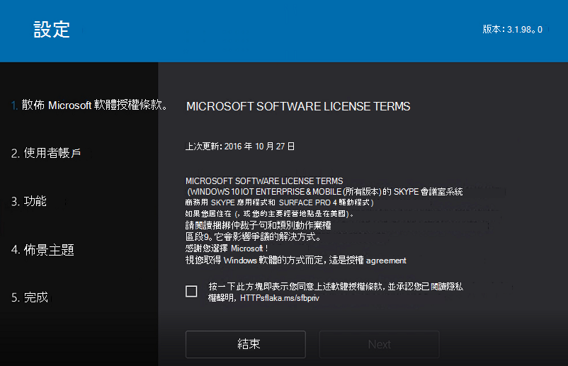

# <a name="deploy-microsoft-teams-rooms-by-using-system-center-configuration-manager"></a><span data-ttu-id="6c54d-103">使用 System Center Configuration Manager 部署 Microsoft 團隊聊天室</span><span class="sxs-lookup"><span data-stu-id="6c54d-103">Deploy Microsoft Teams Rooms by using System Center Configuration Manager</span></span>

<span data-ttu-id="6c54d-104">本文提供使用 System Center Configuration Manager 建立 Microsoft 團隊聊天室部署的所有必要資訊。</span><span class="sxs-lookup"><span data-stu-id="6c54d-104">This article gives you all the necessary information to create your Microsoft Teams Rooms deployments by using System Center Configuration Manager.</span></span>

<span data-ttu-id="6c54d-105">使用 System Center Configuration Manager 提供的便於使用的方法, 您可以將作業系統及其他應用程式部署到多個目標裝置。</span><span class="sxs-lookup"><span data-stu-id="6c54d-105">With the easy-to-use methods provided by System Center Configuration Manager, you can deploy the operating system and other applications to multiple target devices.</span></span>

<span data-ttu-id="6c54d-106">使用下面所示的方法引導您完成 Configuration Manager 設定, 並視貴組織的需求自訂整個本指南所提供的範例套件與腳本。</span><span class="sxs-lookup"><span data-stu-id="6c54d-106">Use the approach illustrated below to guide you through your Configuration Manager configuration, and customize the sample packages and scripts provided throughout this guidance as needed for your organization.</span></span>


> [!IMPORTANT]
> <span data-ttu-id="6c54d-108">此解決方案只經過以 Surface Pro 式部署進行測試。</span><span class="sxs-lookup"><span data-stu-id="6c54d-108">This solution has only been tested with Surface Pro–based deployments.</span></span> <span data-ttu-id="6c54d-109">針對不是以 Surface Pro 為基礎的設定, 請遵循製造商的指導方針。</span><span class="sxs-lookup"><span data-stu-id="6c54d-109">Follow the manufacturer’s guidelines for configurations that aren’t based on Surface Pro.</span></span>

## <a name="validate-prerequisites"></a><span data-ttu-id="6c54d-110">驗證先決條件</span><span class="sxs-lookup"><span data-stu-id="6c54d-110">Validate prerequisites</span></span>

<span data-ttu-id="6c54d-111">若要使用 Configuration Manager 來部署 Microsoft 團隊聊天室, 請確定您符合下列先決條件及需求。</span><span class="sxs-lookup"><span data-stu-id="6c54d-111">To deploy Microsoft Teams Rooms with Configuration Manager, ensure that you meet the following prerequisites and requirements.</span></span>

### <a name="system-center-configuration-manager-requirements"></a><span data-ttu-id="6c54d-112">系統中心 Configuration Manager 需求</span><span class="sxs-lookup"><span data-stu-id="6c54d-112">System Center Configuration Manager requirements</span></span>

-   <span data-ttu-id="6c54d-113">系統中心 Configuration Manager 版本必須至少為1706或更新版本。</span><span class="sxs-lookup"><span data-stu-id="6c54d-113">System Center Configuration Manager version must be at least 1706 or above.</span></span> <span data-ttu-id="6c54d-114">我們建議使用1710或更新版本。</span><span class="sxs-lookup"><span data-stu-id="6c54d-114">We recommend using 1710 or later.</span></span> <span data-ttu-id="6c54d-115">請參閱[System Center Configuration Manager 中的 windows 10 支援](https://docs.microsoft.com/sccm/core/plan-design/configs/support-for-windows-10#windows-10-as-a-client), 以瞭解 Configuration Manager 支援的 windows 10 版本。</span><span class="sxs-lookup"><span data-stu-id="6c54d-115">Check out [Support for Windows 10 in System Center Configuration Manager](https://docs.microsoft.com/sccm/core/plan-design/configs/support-for-windows-10#windows-10-as-a-client) to learn about the Windows 10 versions that Configuration Manager supports.</span></span>

-   <span data-ttu-id="6c54d-116">必須安裝適用于 Windows 10 的 Windows 評估版和部署套件 (ADK) 版本。</span><span class="sxs-lookup"><span data-stu-id="6c54d-116">A supported version of Windows Assessment and Deployment Kit (ADK) for Windows 10 must be installed.</span></span> <span data-ttu-id="6c54d-117">請參閱您可以搭配不同版本 Configuration Manager 使用的[Windows 10 ADK](https://docs.microsoft.com/sccm/core/plan-design/configs/support-for-windows-10#windows-10-adk)版本, 並確保您的部署包含正確的版本。</span><span class="sxs-lookup"><span data-stu-id="6c54d-117">See the versions of the [Windows 10 ADK](https://docs.microsoft.com/sccm/core/plan-design/configs/support-for-windows-10#windows-10-adk) that you can use with different versions of Configuration Manager, and ensure that your deployment includes the correct version.</span></span>

-   <span data-ttu-id="6c54d-118">網站系統伺服器必須已獲指派發佈點角色, 且應啟用啟動影像以進行[開機前執行環境 (PXE) 支援](https://docs.microsoft.com/sccm/osd/deploy-use/use-pxe-to-deploy-windows-over-the-network), 才能啟用網路啟動的部署。</span><span class="sxs-lookup"><span data-stu-id="6c54d-118">The site system servers must have been assigned the distribution point role, and the boot images should be enabled for [preboot execution environment (PXE) support](https://docs.microsoft.com/sccm/osd/deploy-use/use-pxe-to-deploy-windows-over-the-network) to enable network-initiated deployments.</span></span> <span data-ttu-id="6c54d-119">如果未啟用 PXE 支援, 您可以針對您的部署使用[可引導媒體](https://docs.microsoft.com/sccm/osd/deploy-use/use-bootable-media-to-deploy-windows-over-the-network)。</span><span class="sxs-lookup"><span data-stu-id="6c54d-119">If PXE support isn’t enabled, you can use [bootable media](https://docs.microsoft.com/sccm/osd/deploy-use/use-bootable-media-to-deploy-windows-over-the-network) for your deployments.</span></span>

-   <span data-ttu-id="6c54d-120">必須將網路存取帳戶設定為支援新的電腦 (裸機) 部署案例。</span><span class="sxs-lookup"><span data-stu-id="6c54d-120">A network access account must be configured to support new computer (bare metal) deployment scenarios.</span></span> <span data-ttu-id="6c54d-121">若要深入瞭解網路存取帳戶的設定, 請參閱[管理帳戶以存取 System Center Configuration Manager 中的內容](https://docs.microsoft.com/sccm/core/plan-design/hierarchy/manage-accounts-to-access-content#bkmk_NAA)。</span><span class="sxs-lookup"><span data-stu-id="6c54d-121">To learn more about the configuration of a network access account, see [Manage accounts to access content in System Center Configuration Manager](https://docs.microsoft.com/sccm/core/plan-design/hierarchy/manage-accounts-to-access-content#bkmk_NAA).</span></span>

-   <span data-ttu-id="6c54d-122">如果您很可能同時將相同的 Microsoft 團隊會議室影像部署到多個單元, 建議您啟用[多播支援](https://docs.microsoft.com/sccm/osd/deploy-use/use-multicast-to-deploy-windows-over-the-network)。</span><span class="sxs-lookup"><span data-stu-id="6c54d-122">We recommend that you enable [multicast support](https://docs.microsoft.com/sccm/osd/deploy-use/use-multicast-to-deploy-windows-over-the-network), if you’re likely to deploy the same Microsoft Teams Rooms image to multiple units at the same time.</span></span>

### <a name="networking-requirements"></a><span data-ttu-id="6c54d-123">網路需求</span><span class="sxs-lookup"><span data-stu-id="6c54d-123">Networking requirements</span></span>

-   <span data-ttu-id="6c54d-124">您的網路應該有一個動態主機設定通訊協定 (DHCP) 伺服器, 該伺服器是針對自動 IP 位址分配, 將其部署到 Microsoft 團隊會議室單元的子網。</span><span class="sxs-lookup"><span data-stu-id="6c54d-124">Your network should have a Dynamic Host Configuration Protocol (DHCP) server, configured for automatic IP address distribution to the subnets where Microsoft Teams Rooms units will be deployed.</span></span>

    > [!NOTE]
    > <span data-ttu-id="6c54d-125">DHCP 租約期限必須設定為超過映射部署持續時間的值。</span><span class="sxs-lookup"><span data-stu-id="6c54d-125">DHCP lease duration must be set to a value longer than the image deployment duration.</span></span> <span data-ttu-id="6c54d-126">否則, 部署可能會失敗。</span><span class="sxs-lookup"><span data-stu-id="6c54d-126">Otherwise, the deployment might fail.</span></span>

-   <span data-ttu-id="6c54d-127">您的網路 (包括交換器和虛擬 Lan (Vlan)) 應該設定為支援 PXE。</span><span class="sxs-lookup"><span data-stu-id="6c54d-127">Your network, including switches and virtual LANs (VLANs), should be configured to support PXE.</span></span> <span data-ttu-id="6c54d-128">如需 IP 協助程式和 PXE 設定的詳細資訊, 請參閱您的網路廠商。</span><span class="sxs-lookup"><span data-stu-id="6c54d-128">Refer to your network vendor for more information about IP Helper and PXE configuration.</span></span> <span data-ttu-id="6c54d-129">或者, 如果沒有啟用 PXE 支援, 您也可以將[可引導媒體](https://docs.microsoft.com/sccm/osd/deploy-use/use-bootable-media-to-deploy-windows-over-the-network)用於部署。</span><span class="sxs-lookup"><span data-stu-id="6c54d-129">Alternatively, you can use [bootable media](https://docs.microsoft.com/sccm/osd/deploy-use/use-bootable-media-to-deploy-windows-over-the-network) for your deployments, if PXE support isn’t enabled.</span></span>

    > [!NOTE]
    > <span data-ttu-id="6c54d-130">在 Surface Pro 裝置上, 只有當您使用乙太網路介面卡或來自 Microsoft 的插接站時, 才支援從網路啟動 (PXE 啟動)。</span><span class="sxs-lookup"><span data-stu-id="6c54d-130">For Surface Pro devices, booting from the network (PXE boot) is only supported when you use an Ethernet adapter or docking station from Microsoft.</span></span> <span data-ttu-id="6c54d-131">協力廠商乙太網路介面卡不支援使用 Surface Pro 進行 PXE 啟動。</span><span class="sxs-lookup"><span data-stu-id="6c54d-131">Third-party Ethernet adapters don’t support PXE boot with Surface Pro.</span></span> <span data-ttu-id="6c54d-132">如需詳細資訊, 請參閱[乙太網路介面卡與 Surface 部署](https://docs.microsoft.com/surface/ethernet-adapters-and-surface-device-deployment)。</span><span class="sxs-lookup"><span data-stu-id="6c54d-132">See [Ethernet adapters and Surface deployment](https://docs.microsoft.com/surface/ethernet-adapters-and-surface-device-deployment) for more information.</span></span>

## <a name="configure-system-center-configuration-manager-for-operating-system-deployment"></a><span data-ttu-id="6c54d-133">設定系統中心 Configuration Manager 以進行作業系統部署</span><span class="sxs-lookup"><span data-stu-id="6c54d-133">Configure System Center Configuration Manager for operating system deployment</span></span>

<span data-ttu-id="6c54d-134">本文假設您已經有良好的 System Center Configuration Manager 部署, 並不詳細說明從零開始部署和設定 Configuration Manager 所需的所有步驟。</span><span class="sxs-lookup"><span data-stu-id="6c54d-134">This article assumes you already have a healthy System Center Configuration Manager deployment, and doesn’t detail all the steps required to deploy and configure Configuration Manager from scratch.</span></span> <span data-ttu-id="6c54d-135">System Center Configuration Manager 上的[檔和設定指導](https://docs.microsoft.com/sccm/)方針是一種很好的資源;如果您尚未部署 Configuration Manager, 我們建議您從這些資源開始。</span><span class="sxs-lookup"><span data-stu-id="6c54d-135">The [documentation and the configuration guidance](https://docs.microsoft.com/sccm/) on the System Center Configuration Manager is a great resource; we recommend you start with these resources if you haven’t yet deployed Configuration Manager.</span></span>

<span data-ttu-id="6c54d-136">使用下列指示確認作業系統部署 (OSD) 功能已正確設定。</span><span class="sxs-lookup"><span data-stu-id="6c54d-136">Use the following instructions to verify that the operating system deployment (OSD) features are configured properly.</span></span>

### <a name="validate-and-upgrade-configuration-manager"></a><span data-ttu-id="6c54d-137">驗證和升級 Configuration Manager</span><span class="sxs-lookup"><span data-stu-id="6c54d-137">Validate and upgrade Configuration Manager</span></span>

1.  <span data-ttu-id="6c54d-138">在 Configuration Manager 主控台中, 移至 [**管理** \> **更新及服務**]。</span><span class="sxs-lookup"><span data-stu-id="6c54d-138">In the Configuration Manager console, go to **Administration** \> **Updates and Servicing**.</span></span>

2.  <span data-ttu-id="6c54d-139">檢查已安裝的組建以及尚未安裝的適用更新。</span><span class="sxs-lookup"><span data-stu-id="6c54d-139">Check the installed build and applicable updates that haven’t been installed yet.</span></span>

3.  <span data-ttu-id="6c54d-140">[在 System Center Configuration Manager 中查看 Windows 10 的支援服務](https://docs.microsoft.com/sccm/core/plan-design/configs/support-for-windows-10#windows-10-as-a-client);如果您需要升級您的部署, 請選取您要安裝的更新, 然後選取 [**下載**]。</span><span class="sxs-lookup"><span data-stu-id="6c54d-140">Review [Support for Windows 10 in System Center Configuration Manager](https://docs.microsoft.com/sccm/core/plan-design/configs/support-for-windows-10#windows-10-as-a-client); if you need to upgrade your deployment, select the update you want to install, and then select **Download**.</span></span>

4.  <span data-ttu-id="6c54d-141">下載完成後, 請選取更新, 然後選取 [**安裝更新套件**]。</span><span class="sxs-lookup"><span data-stu-id="6c54d-141">After the download is complete, select the update, and then select **Install Update Pack**.</span></span>

### <a name="configure-distribution-points-to-support-pxe-and-multicast"></a><span data-ttu-id="6c54d-142">設定發佈點以支援 PXE 和多播</span><span class="sxs-lookup"><span data-stu-id="6c54d-142">Configure distribution points to support PXE and multicast</span></span>

1.  <span data-ttu-id="6c54d-143">在 Configuration Manager 主控台中, 移至 [**管理** \> **發佈點**]。</span><span class="sxs-lookup"><span data-stu-id="6c54d-143">In the Configuration Manager console, go to **Administration** \> **Distribution Points**.</span></span>

2.  <span data-ttu-id="6c54d-144">選取將提供 Microsoft [小組聊天室] 部署的發佈點伺服器, 然後選取 [**屬性**]。</span><span class="sxs-lookup"><span data-stu-id="6c54d-144">Select the distribution point server that will serve the Microsoft Teams Rooms deployment, and then select **Properties**.</span></span>

3.  <span data-ttu-id="6c54d-145">選取 [ **PXE** ] 索引標籤, 並確認已啟用下列設定:</span><span class="sxs-lookup"><span data-stu-id="6c54d-145">Select the **PXE** tab, and ensure that the following settings are enabled:</span></span>
    -   <span data-ttu-id="6c54d-146">為用戶端啟用 PXE 支援</span><span class="sxs-lookup"><span data-stu-id="6c54d-146">Enable PXE support for clients</span></span>
    -   <span data-ttu-id="6c54d-147">允許此發佈點回應傳入的 PXE 要求</span><span class="sxs-lookup"><span data-stu-id="6c54d-147">Allow this distribution point to respond to incoming PXE requests</span></span>
    -   <span data-ttu-id="6c54d-148">啟用未知電腦支援</span><span class="sxs-lookup"><span data-stu-id="6c54d-148">Enable unknown computer support</span></span>

4.  <span data-ttu-id="6c54d-149">*選用:* 若要啟用多播支援, 請選取 [**多播**] 索引標籤, 並確認已啟用下列設定:</span><span class="sxs-lookup"><span data-stu-id="6c54d-149">*Optional:* To enable multicast support, select the **Multicast** tab, and ensure that the following settings are enabled:</span></span>
    -   <span data-ttu-id="6c54d-150">啟用多播以同時傳送資料給多個用戶端</span><span class="sxs-lookup"><span data-stu-id="6c54d-150">Enable multicast to simultaneously send data to multiple clients</span></span>
    -   <span data-ttu-id="6c54d-151">根據您的網路小組的建議設定 UDP 埠範圍</span><span class="sxs-lookup"><span data-stu-id="6c54d-151">Configure the UDP port range as per your network team’s recommendation</span></span>

### <a name="configure-the-network-access-account"></a><span data-ttu-id="6c54d-152">設定網路存取帳戶</span><span class="sxs-lookup"><span data-stu-id="6c54d-152">Configure the Network Access Account</span></span>

1.  <span data-ttu-id="6c54d-153">在 Configuration Manager 主控台中, 移至 [**管理** \> **網站** \>設定**網站**], 然後選取 [網站]。</span><span class="sxs-lookup"><span data-stu-id="6c54d-153">In the Configuration Manager console, go to **Administration** \> **Site Configuration** \> **Sites**, and then select the site.</span></span>

2.  <span data-ttu-id="6c54d-154">在 [**設定**] 群組中, 選取 [**設定網站元件** \> **軟體發佈**]。</span><span class="sxs-lookup"><span data-stu-id="6c54d-154">In the **Settings** group, select **Configure Site Components** \> **Software Distribution**.</span></span>

3.  <span data-ttu-id="6c54d-155">選取 [**網路存取帳戶**] 索引標籤。設定一或多個帳戶, 然後選取 **[確定]**。</span><span class="sxs-lookup"><span data-stu-id="6c54d-155">Select the **Network Access Account** tab. Set up one or more accounts, and then select **OK**.</span></span>

> [!NOTE]
> <span data-ttu-id="6c54d-156">帳戶不需要任何特殊權利, 除了從發佈點伺服器的 [**從網路存取此電腦**] 許可權以外。</span><span class="sxs-lookup"><span data-stu-id="6c54d-156">The accounts don’t need any special rights, except for the **Access this computer from the network** right on the distribution point server.</span></span> <span data-ttu-id="6c54d-157">一般網域使用者帳戶將是適當的。</span><span class="sxs-lookup"><span data-stu-id="6c54d-157">A generic domain user account will be appropriate.</span></span> <span data-ttu-id="6c54d-158">如需詳細資訊, 請參閱[管理 System Center Configuration Manager 中的 [管理帳戶] 以存取內容](https://docs.microsoft.com/sccm/core/plan-design/hierarchy/manage-accounts-to-access-content#bkmk_NAA)。</span><span class="sxs-lookup"><span data-stu-id="6c54d-158">For more information, see [Manage accounts to access content in System Center Configuration Manager](https://docs.microsoft.com/sccm/core/plan-design/hierarchy/manage-accounts-to-access-content#bkmk_NAA).</span></span>

### <a name="configure-a-boot-image"></a><span data-ttu-id="6c54d-159">設定啟動影像</span><span class="sxs-lookup"><span data-stu-id="6c54d-159">Configure a boot image</span></span>

1.  <span data-ttu-id="6c54d-160">在 Configuration Manager 主控台中, 移至**軟體庫** \> **作業系統** \> **啟動影像**。</span><span class="sxs-lookup"><span data-stu-id="6c54d-160">In the Configuration Manager console, go to **Software Library** \> **Operating System** \> **Boot Images**.</span></span>

2.  <span data-ttu-id="6c54d-161">選取 **[啟動影像 (x64)**], 然後選取 [**屬性**]。</span><span class="sxs-lookup"><span data-stu-id="6c54d-161">Select **Boot image (x64)**, and then select **Properties**.</span></span>

3.  <span data-ttu-id="6c54d-162">選取 [**資料來源**] 索引標籤, 然後**從啟用 PXE 的發佈點啟用此啟動影像**。</span><span class="sxs-lookup"><span data-stu-id="6c54d-162">Select the **Data Source** tab, and enable **Deploy this boot image from the PXE-enabled distribution point**.</span></span>

4.  <span data-ttu-id="6c54d-163">選取 [**選用元件**] 索引標籤來安裝必要的元件:</span><span class="sxs-lookup"><span data-stu-id="6c54d-163">Select the **Optional Components** tab to install required components:</span></span>

    1.  <span data-ttu-id="6c54d-164">選取 [星形] 圖示, 然後搜尋 **[HTML (WinPE-HTA)** ]</span><span class="sxs-lookup"><span data-stu-id="6c54d-164">Select the star icon, and search for **HTML (WinPE-HTA)**</span></span>

    2.  <span data-ttu-id="6c54d-165">選取 **[確定]** , 將 HTML 應用程式支援新增至啟動影像。</span><span class="sxs-lookup"><span data-stu-id="6c54d-165">Select **OK** to add HTML application support in to the boot image.</span></span>

5.  <span data-ttu-id="6c54d-166">*選用:* 若要自訂部署體驗, 請選取 [**自訂**] 索引標籤。</span><span class="sxs-lookup"><span data-stu-id="6c54d-166">*Optional:* To customize the deployment experience, select the **Customization** tab.</span></span>
    -   <span data-ttu-id="6c54d-167">如果您想要在部署期間存取命令提示字元, 請啟用**命令支援 (僅限測試)** 。</span><span class="sxs-lookup"><span data-stu-id="6c54d-167">Enable **command support (testing only)** if you want to have access to a command prompt during the deployment.</span></span> <span data-ttu-id="6c54d-168">啟用此功能時, 您可以在部署期間的任何時間選取**F8**來啟動命令提示字元。</span><span class="sxs-lookup"><span data-stu-id="6c54d-168">When this is enabled, you can start a command prompt by selecting **F8** at any time during the deployment.</span></span>
    -   <span data-ttu-id="6c54d-169">您也可以指定要在部署期間顯示的自訂背景圖像。</span><span class="sxs-lookup"><span data-stu-id="6c54d-169">You can also specify a custom background image to be displayed during the deployment.</span></span> <span data-ttu-id="6c54d-170">若要設定影像, 請啟用 **[指定自訂背景圖像檔案 (UNC 路徑**)], 然後選取您的背景。</span><span class="sxs-lookup"><span data-stu-id="6c54d-170">To set an image, enable **Specify the custom background image file (UNC path** and select your background.</span></span>

6.  <span data-ttu-id="6c54d-171">出現提示時, 請選取 **[是]** , 然後將更新的啟動影像發佈到您的發佈點。</span><span class="sxs-lookup"><span data-stu-id="6c54d-171">When asked, select **Yes** and distribute the updated boot image to your distribution points.</span></span>

<span data-ttu-id="6c54d-172">如需詳細資訊, 請參閱[使用 System Center Configuration Manager 管理啟動影像](https://docs.microsoft.com/sccm/osd/get-started/manage-boot-images)。</span><span class="sxs-lookup"><span data-stu-id="6c54d-172">For more information, see [Manage boot images with System Center Configuration Manager](https://docs.microsoft.com/sccm/osd/get-started/manage-boot-images).</span></span>

> [!NOTE]
> <span data-ttu-id="6c54d-173">您可以建立可啟動的 USB 媒體, 以針對沒有 PXE 支援的環境啟動 Configuration Manager 任務順序部署。</span><span class="sxs-lookup"><span data-stu-id="6c54d-173">You can create a bootable USB media to initiate Configuration Manager task sequence–based deployments for environments that have no PXE support.</span></span> <span data-ttu-id="6c54d-174">可啟動的媒體只包含啟動影像、選用的預先啟動命令以及其必要的檔案, 以及 Configuration Manager 二進位檔案以支援在 Windows PE 中啟動, 並在其餘的部署程式中連線至 Configuration Manager。</span><span class="sxs-lookup"><span data-stu-id="6c54d-174">The bootable media contains only the boot image, optional prestart commands and their required files, and Configuration Manager binaries to support booting into Windows PE and connecting to Configuration Manager for the rest of the deployment process.</span></span> <span data-ttu-id="6c54d-175">如需詳細資訊, 請參閱[如何建立可啟動的媒體](https://docs.microsoft.com/sccm/osd/deploy-use/create-bootable-media#BKMK_CreateBootableMedia)。</span><span class="sxs-lookup"><span data-stu-id="6c54d-175">For more information, see [How to Create Bootable Media](https://docs.microsoft.com/sccm/osd/deploy-use/create-bootable-media#BKMK_CreateBootableMedia).</span></span>

## <a name="create-configuration-manager-packages"></a><span data-ttu-id="6c54d-176">建立 Configuration Manager 套件</span><span class="sxs-lookup"><span data-stu-id="6c54d-176">Create Configuration Manager packages</span></span>

> [!IMPORTANT]
> <span data-ttu-id="6c54d-177">每個 SRS 安裝程式版本所需的作業系統版本都會隨每個 MSI 發行而變更。</span><span class="sxs-lookup"><span data-stu-id="6c54d-177">The required operating system version for each SRS installer version changes with every MSI release.</span></span> <span data-ttu-id="6c54d-178">若要判斷特定 MSI 的最佳作業系統版本, 請執行一次主控台安裝程式腳本。</span><span class="sxs-lookup"><span data-stu-id="6c54d-178">To determine the best operating system version for a given MSI, run the console setup script once.</span></span> <span data-ttu-id="6c54d-179">若要深入瞭解, 請參閱[使用 System Center Configuration Manager 部署 Microsoft 團隊聊天室](room-systems-scale.md)。</span><span class="sxs-lookup"><span data-stu-id="6c54d-179">To learn more, see [Deploy Microsoft Teams Rooms by using System Center Configuration Manager](room-systems-scale.md).</span></span>

<span data-ttu-id="6c54d-180">Configuration Manager 需要多個套件來部署並設定 Microsoft 團隊會議室單位。</span><span class="sxs-lookup"><span data-stu-id="6c54d-180">Configuration Manager requires a number of packages to deploy and configure the Microsoft Teams Rooms units.</span></span>

<span data-ttu-id="6c54d-181">您需要建立並設定下列套件, 然後將它們發佈到已指派發佈點伺服器角色的 Configuration Manager 網站系統。</span><span class="sxs-lookup"><span data-stu-id="6c54d-181">You need to create and configure the following packages, and then distribute them to the Configuration Manager site systems that have been assigned the distribution point server role.</span></span>

| <span data-ttu-id="6c54d-182">**套件名稱**</span><span class="sxs-lookup"><span data-stu-id="6c54d-182">**Package name**</span></span>                     | <span data-ttu-id="6c54d-183">**類型**</span><span class="sxs-lookup"><span data-stu-id="6c54d-183">**Type**</span></span>               | <span data-ttu-id="6c54d-184">**說明**</span><span class="sxs-lookup"><span data-stu-id="6c54d-184">**Description**</span></span>                                                                           |
|--------------------------------------|------------------------|-------------------------------------------------------------------------------------------|
| <span data-ttu-id="6c54d-185">SRS v2-SRS 應用程式套件</span><span class="sxs-lookup"><span data-stu-id="6c54d-185">SRS v2 - SRS Application Package</span></span>     | <span data-ttu-id="6c54d-186">軟體套件</span><span class="sxs-lookup"><span data-stu-id="6c54d-186">Software package</span></span>       | <span data-ttu-id="6c54d-187">Microsoft 團隊聊天室部署套件封裝</span><span class="sxs-lookup"><span data-stu-id="6c54d-187">Package for the Microsoft Teams Rooms deployment kit</span></span>                                      |
| <span data-ttu-id="6c54d-188">SRS v2-Sysprep 套件</span><span class="sxs-lookup"><span data-stu-id="6c54d-188">SRS v2 - Sysprep Package</span></span>             | <span data-ttu-id="6c54d-189">軟體套件</span><span class="sxs-lookup"><span data-stu-id="6c54d-189">Software package</span></span>       | <span data-ttu-id="6c54d-190">[自訂以無人參與的 .xml] 來設定 Microsoft 團隊會議室單位</span><span class="sxs-lookup"><span data-stu-id="6c54d-190">Package for the custom Unattended.xml to configure Microsoft Teams Rooms units</span></span>            |
| <span data-ttu-id="6c54d-191">SRS v2-設定 SRSComputerName 套件</span><span class="sxs-lookup"><span data-stu-id="6c54d-191">SRS v2 - Set-SRSComputerName Package</span></span> | <span data-ttu-id="6c54d-192">軟體套件</span><span class="sxs-lookup"><span data-stu-id="6c54d-192">Software package</span></span>       | <span data-ttu-id="6c54d-193">要在部署期間指派電腦名稱稱的 HTML 應用程式 (HTA) 套件</span><span class="sxs-lookup"><span data-stu-id="6c54d-193">Package for the HTML application (HTA) to assign a computer name during the deployment</span></span>    |
| <span data-ttu-id="6c54d-194">SRS v2-設定 SRS 設定</span><span class="sxs-lookup"><span data-stu-id="6c54d-194">SRS v2 - Configure SRS Setup</span></span>         | <span data-ttu-id="6c54d-195">軟體套件</span><span class="sxs-lookup"><span data-stu-id="6c54d-195">Software package</span></span>       | <span data-ttu-id="6c54d-196">打包以設定 Microsoft 團隊聊天室應用程式的部署</span><span class="sxs-lookup"><span data-stu-id="6c54d-196">Package to configure deployment of the Microsoft Teams Rooms app</span></span>                          |
| <span data-ttu-id="6c54d-197">SRS v2-OS 更新套件</span><span class="sxs-lookup"><span data-stu-id="6c54d-197">SRS v2 - OS Updates Package</span></span>          | <span data-ttu-id="6c54d-198">軟體套件</span><span class="sxs-lookup"><span data-stu-id="6c54d-198">Software package</span></span>       | <span data-ttu-id="6c54d-199">打包以部署強制的作業系統更新</span><span class="sxs-lookup"><span data-stu-id="6c54d-199">Package to deploy mandatory operating system updates</span></span>                                      |
| <span data-ttu-id="6c54d-200">SRS v2-根憑證套件</span><span class="sxs-lookup"><span data-stu-id="6c54d-200">SRS v2 - Root Certificate Package</span></span>    | <span data-ttu-id="6c54d-201">軟體套件</span><span class="sxs-lookup"><span data-stu-id="6c54d-201">Software package</span></span>       | <span data-ttu-id="6c54d-202">選用-套件來部署根憑證 (不需要網域加入的單位)</span><span class="sxs-lookup"><span data-stu-id="6c54d-202">Optional - Package to deploy the root certificate (not required for domain-joined units)</span></span>  |
| <span data-ttu-id="6c54d-203">SRS v2-Microsoft Monitoring Agent 套件</span><span class="sxs-lookup"><span data-stu-id="6c54d-203">SRS v2 - Microsoft Monitoring Agent Package</span></span> | <span data-ttu-id="6c54d-204">軟體套件</span><span class="sxs-lookup"><span data-stu-id="6c54d-204">Software package</span></span>       | <span data-ttu-id="6c54d-205">選用-套件部署並設定 Microsoft Operations Management Suite 代理程式</span><span class="sxs-lookup"><span data-stu-id="6c54d-205">Optional - Package to deploy and configure the Microsoft Operations Management Suite agent</span></span>|
| <span data-ttu-id="6c54d-206">SRS v2-WinPE 背景套件</span><span class="sxs-lookup"><span data-stu-id="6c54d-206">SRS v2 - WinPE Background Package</span></span>    | <span data-ttu-id="6c54d-207">軟體套件</span><span class="sxs-lookup"><span data-stu-id="6c54d-207">Software package</span></span>       | <span data-ttu-id="6c54d-208">要搭配啟動影像使用的自訂背景圖像套件</span><span class="sxs-lookup"><span data-stu-id="6c54d-208">Package for the custom background image to use with boot images</span></span>                           |
| <span data-ttu-id="6c54d-209">Windows 10 企業版</span><span class="sxs-lookup"><span data-stu-id="6c54d-209">Windows 10 Enterprise</span></span>                | <span data-ttu-id="6c54d-210">作業系統影像</span><span class="sxs-lookup"><span data-stu-id="6c54d-210">Operating system image</span></span> | <span data-ttu-id="6c54d-211">作業系統安裝檔案 (安裝 .wim) 的封裝</span><span class="sxs-lookup"><span data-stu-id="6c54d-211">Package for the operating system installation file (install.wim)</span></span>                          |
| <span data-ttu-id="6c54d-212">Surface Pro</span><span class="sxs-lookup"><span data-stu-id="6c54d-212">Surface Pro</span></span>                          | <span data-ttu-id="6c54d-213">驅動程式套件</span><span class="sxs-lookup"><span data-stu-id="6c54d-213">Driver package</span></span>         | <span data-ttu-id="6c54d-214">Microsoft Surface Pro 裝置驅動程式和固件套件</span><span class="sxs-lookup"><span data-stu-id="6c54d-214">Package for the device drivers and firmware for Microsoft Surface Pro</span></span>                     |
| <span data-ttu-id="6c54d-215">Surface Pro 4</span><span class="sxs-lookup"><span data-stu-id="6c54d-215">Surface Pro 4</span></span>                        | <span data-ttu-id="6c54d-216">驅動程式套件</span><span class="sxs-lookup"><span data-stu-id="6c54d-216">Driver package</span></span>         | <span data-ttu-id="6c54d-217">Microsoft Surface 專業版4的裝置驅動程式和固件套件</span><span class="sxs-lookup"><span data-stu-id="6c54d-217">Package for the device drivers and firmware for Microsoft Surface Pro 4</span></span>                   |

<span data-ttu-id="6c54d-218">如需詳細資訊, 請參閱[System Center Configuration Manager 中的套件與程式](https://docs.microsoft.com/sccm/apps/deploy-use/packages-and-programs)。</span><span class="sxs-lookup"><span data-stu-id="6c54d-218">For more information, see [Packages and programs in System Center Configuration Manager](https://docs.microsoft.com/sccm/apps/deploy-use/packages-and-programs).</span></span>

### <a name="create-folders-for-the-package-source-files"></a><span data-ttu-id="6c54d-219">建立套件來源檔案的資料夾</span><span class="sxs-lookup"><span data-stu-id="6c54d-219">Create folders for the package source files</span></span>

<span data-ttu-id="6c54d-220">在第一次建立及更新時, Configuration Manager 需要將套件來源檔案組織在特定資料夾結構中。</span><span class="sxs-lookup"><span data-stu-id="6c54d-220">Configuration Manager requires package source files to be organized in a specific folder structure when they’re first created and when they’re updated.</span></span>

<span data-ttu-id="6c54d-221">在 System Center Configuration Manager 管理中心網站或主要網站上建立下列資料夾結構, 或在您用來存放套件來源檔案的伺服器共用上建立下列資料夾結構:</span><span class="sxs-lookup"><span data-stu-id="6c54d-221">Create the following folder structure on the System Center Configuration Manager central administration site or primary site, or on a server share you’re using to host package source files:</span></span>

-   <span data-ttu-id="6c54d-222">SRS v2-Microsoft Monitoring Agent 套件</span><span class="sxs-lookup"><span data-stu-id="6c54d-222">SRS v2 - Microsoft Monitoring Agent Package</span></span>
-   <span data-ttu-id="6c54d-223">SRS v2-OS 更新套件</span><span class="sxs-lookup"><span data-stu-id="6c54d-223">SRS v2 - OS Updates Package</span></span>
-   <span data-ttu-id="6c54d-224">SRS v2-根憑證套件</span><span class="sxs-lookup"><span data-stu-id="6c54d-224">SRS v2 - Root Certificate Package</span></span>
-   <span data-ttu-id="6c54d-225">SRS v2-設定 SRSComputerName 套件</span><span class="sxs-lookup"><span data-stu-id="6c54d-225">SRS v2 - Set-SRSComputerName Package</span></span>
-   <span data-ttu-id="6c54d-226">SRS v2-SRS 應用程式套件</span><span class="sxs-lookup"><span data-stu-id="6c54d-226">SRS v2 - SRS Application Package</span></span>
-   <span data-ttu-id="6c54d-227">SRS v2-設定 SRS 設定</span><span class="sxs-lookup"><span data-stu-id="6c54d-227">SRS v2 - Configure SRS Setup</span></span>
-   <span data-ttu-id="6c54d-228">SRS v2-Sysprep 套件</span><span class="sxs-lookup"><span data-stu-id="6c54d-228">SRS v2 - Sysprep Package</span></span>
-   <span data-ttu-id="6c54d-229">驅動程式</span><span class="sxs-lookup"><span data-stu-id="6c54d-229">Drivers</span></span>
    -   <span data-ttu-id="6c54d-230">Surface Pro</span><span class="sxs-lookup"><span data-stu-id="6c54d-230">Surface Pro</span></span>
    -   <span data-ttu-id="6c54d-231">Surface Pro 4</span><span class="sxs-lookup"><span data-stu-id="6c54d-231">Surface Pro 4</span></span>
-   <span data-ttu-id="6c54d-232">作業系統</span><span class="sxs-lookup"><span data-stu-id="6c54d-232">Operating Systems</span></span>
    -   <span data-ttu-id="6c54d-233">Windows 10 企業版</span><span class="sxs-lookup"><span data-stu-id="6c54d-233">Windows 10 Enterprise</span></span>

> [!TIP]
> <span data-ttu-id="6c54d-234">您也可以[下載](https://github.com/MicrosoftDocs/OfficeDocs-SkypeForBusiness/blob/live/Skype/SfbOnline/downloads/Skype-Room-Systems-v2/SRS-v2-Configuration-Manager-Files.zip?raw=true)並使用 zip 檔案, 其中包含套件的資料夾結構、您需要使用的腳本, 以及您必須匯入的任務順序範本。</span><span class="sxs-lookup"><span data-stu-id="6c54d-234">You may also [download](https://github.com/MicrosoftDocs/OfficeDocs-SkypeForBusiness/blob/live/Skype/SfbOnline/downloads/Skype-Room-Systems-v2/SRS-v2-Configuration-Manager-Files.zip?raw=true) and use the zip file that includes the folder structure for the packages, the scripts that you need to use, and the task sequence template, that you need to import.</span></span>

### <a name="create-the-monitoring-agent-package"></a><span data-ttu-id="6c54d-235">建立監視代理套件</span><span class="sxs-lookup"><span data-stu-id="6c54d-235">Create the Monitoring agent package</span></span>

1. <span data-ttu-id="6c54d-236">從<https://go.microsoft.com/fwlink/?LinkId=828603>下載監視代理程式。</span><span class="sxs-lookup"><span data-stu-id="6c54d-236">Download the Monitoring agent from <https://go.microsoft.com/fwlink/?LinkId=828603>.</span></span>

2. <span data-ttu-id="6c54d-237">在命令提示字元中開啟 [命令提示字元] 視窗, 然後輸入**MMASetup-AMD64/c:** , 將套件解壓縮至 [ **SRS V2-Microsoft Monitoring Agent 套件**] 資料夾。</span><span class="sxs-lookup"><span data-stu-id="6c54d-237">Extract the package into the **SRS v2 - Microsoft Monitoring Agent Package** folder by opening a Command Prompt window and entering **MMASetup-AMD64.exe /C:**     at the command prompt.</span></span>

3. <span data-ttu-id="6c54d-238">在 Configuration Manager 主控台中, 移至 [**軟體庫** \> **應用程式管理** \> **套件**], 然後選取 [**建立套件**]。</span><span class="sxs-lookup"><span data-stu-id="6c54d-238">In the Configuration Manager console, go to **Software Library** \> **Application Management** \> **Packages**, and then select **Create Package**.</span></span>

4. <span data-ttu-id="6c54d-239">輸入下列資訊來建立套件:</span><span class="sxs-lookup"><span data-stu-id="6c54d-239">Enter the following information to create the package:</span></span>

   - <span data-ttu-id="6c54d-240">名稱<strong>: SRS v2-Microsoft Monitoring Agent 套件</strong></span><span class="sxs-lookup"><span data-stu-id="6c54d-240">Name<strong>: SRS v2 - Microsoft Monitoring Agent Package</strong></span></span>

   - <span data-ttu-id="6c54d-241">製造商<strong>: Microsoft Corporation</strong></span><span class="sxs-lookup"><span data-stu-id="6c54d-241">Manufacturer<strong>: Microsoft Corporation</strong></span></span>

   - <span data-ttu-id="6c54d-242">版本<strong>: 8.1.11081.0</strong> (輸入下載的安裝檔版本)</span><span class="sxs-lookup"><span data-stu-id="6c54d-242">Version<strong>: 8.1.11081.0</strong> (enter the version of the downloaded installation file)</span></span>

   - <span data-ttu-id="6c54d-243">選取 [**此套件包含來源**檔案] 核取方塊, 輸入**SRS V2-Microsoft Monitoring Agent 套件**資料夾的路徑, 然後選取 **[下一步]**。</span><span class="sxs-lookup"><span data-stu-id="6c54d-243">Select the **This package contains source files** check box, enter the path to the **SRS v2 - Microsoft Monitoring Agent Package** folder, and then select **Next**.</span></span>

5. <span data-ttu-id="6c54d-244">選取 [**不建立程式**], 然後選取 **[下一步]**。</span><span class="sxs-lookup"><span data-stu-id="6c54d-244">Select **Do not create a program**, and then select **Next**.</span></span>

6. <span data-ttu-id="6c54d-245">查看 [**確認設定**] 頁面, 然後選取 **[下一步]**。</span><span class="sxs-lookup"><span data-stu-id="6c54d-245">Review the **Confirm the settings** page, and then select **Next**.</span></span>

7. <span data-ttu-id="6c54d-246">選取 [**關閉**]。</span><span class="sxs-lookup"><span data-stu-id="6c54d-246">Select **Close**.</span></span>

### <a name="create-the-operating-system-updates-package"></a><span data-ttu-id="6c54d-247">建立作業系統更新套件</span><span class="sxs-lookup"><span data-stu-id="6c54d-247">Create the operating system updates package</span></span>

1. <span data-ttu-id="6c54d-248">在 [ **SRS v2-OS 更新套件**] 資料夾中, 建立名為**Install-SRSv2-OS-Updates**的新 PowerShell 腳本。</span><span class="sxs-lookup"><span data-stu-id="6c54d-248">In the **SRS v2 - OS Updates Package** folder, create a new PowerShell script named **Install-SRSv2-OS-Updates.ps1**.</span></span>

2. <span data-ttu-id="6c54d-249">將下列腳本複製到**Install-SRSv2-OS-Updates**腳本中。</span><span class="sxs-lookup"><span data-stu-id="6c54d-249">Copy the script below into the **Install-SRSv2-OS-Updates.ps1** script.</span></span> <span data-ttu-id="6c54d-250">或者, 您也可以從[這裡](https://github.com/MicrosoftDocs/OfficeDocs-SkypeForBusiness/blob/live/Skype/SfbOnline/downloads/Skype-Room-Systems-v2/SRS-v2-Configuration-Manager-Files.zip?raw=true)下載 Install-SRSv2-OS-Updates. ps1 腳本。</span><span class="sxs-lookup"><span data-stu-id="6c54d-250">Alternatively, you can download the Install-SRSv2-OS-Updates.ps1 script from [here](https://github.com/MicrosoftDocs/OfficeDocs-SkypeForBusiness/blob/live/Skype/SfbOnline/downloads/Skype-Room-Systems-v2/SRS-v2-Configuration-Manager-Files.zip?raw=true).</span></span>
   ```
   # Install-SRSv2-OS-Updates.ps1
   $strPath = split-path -parent $MyInvocation.MyCommand.Definition
   $total = gci $strPath *.msu | measure | Select-Object -expand Count
   $i = 0
   gci $strPath *.msu | ForEach-Object {
     $i++
     WUSA ""$_.FullName /quiet /norestart""
     Write-Progress -activity "Applying Mandatory Updates" -status "Installing
     $_ .. $i of $total" -percentComplete (($i / $total) * 100)
     Wait-Process -name wusa
   }
   ```
3. <span data-ttu-id="6c54d-251">將強制執行的 Windows 更新套件下載到同一個資料夾中。</span><span class="sxs-lookup"><span data-stu-id="6c54d-251">Download the mandatory Windows Update packages into the same folder.</span></span>
   > [!NOTE]
   > <span data-ttu-id="6c54d-252">發佈本文時, 只需要[KB4056892](http://download.windowsupdate.com/c/msdownload/update/software/secu/2018/01/windows10.0-kb4056892-x64_a41a378cf9ae609152b505c40e691ca1228e28ea.msu) 。</span><span class="sxs-lookup"><span data-stu-id="6c54d-252">At the time this article was published, only [KB4056892](http://download.windowsupdate.com/c/msdownload/update/software/secu/2018/01/windows10.0-kb4056892-x64_a41a378cf9ae609152b505c40e691ca1228e28ea.msu) was required.</span></span> <span data-ttu-id="6c54d-253">請核取 [[設定 Microsoft 團隊聊天室] 主控台](console.md), 查看是否需要任何其他更新。</span><span class="sxs-lookup"><span data-stu-id="6c54d-253">Check [Configure a Microsoft Teams Rooms console](console.md), to see whether any other updates are required.</span></span>

4. <span data-ttu-id="6c54d-254">在 Configuration Manager 主控台中, 移至 [**軟體庫** \> **應用程式管理** \> **套件**], 然後選取 [**建立套件**]。</span><span class="sxs-lookup"><span data-stu-id="6c54d-254">In the Configuration Manager console, go to **Software Library** \> **Application Management** \> **Packages**, and then select **Create Package**.</span></span>

5. <span data-ttu-id="6c54d-255">輸入下列資訊來建立套件:</span><span class="sxs-lookup"><span data-stu-id="6c54d-255">Enter the following information to create the package:</span></span>
   -   <span data-ttu-id="6c54d-256">名稱: **SRS v2-OS 更新套件**</span><span class="sxs-lookup"><span data-stu-id="6c54d-256">Name: **SRS v2 – OS Updates Package**</span></span>
   -   <span data-ttu-id="6c54d-257">製造商: **Microsoft Corporation**</span><span class="sxs-lookup"><span data-stu-id="6c54d-257">Manufacturer: **Microsoft Corporation**</span></span>
   -   <span data-ttu-id="6c54d-258">版本: **1.0.0**</span><span class="sxs-lookup"><span data-stu-id="6c54d-258">Version: **1.0.0**</span></span>
   -   <span data-ttu-id="6c54d-259">選取 [**此套件包含來源**檔案] 核取方塊, 輸入**SRS V2-OS 更新套件**資料夾的路徑, 然後選取 **[下一步]**。</span><span class="sxs-lookup"><span data-stu-id="6c54d-259">Select the **This package contains source files** check box, enter the path to the **SRS v2 - OS Updates Package** folder, and then select **Next**.</span></span>

6. <span data-ttu-id="6c54d-260">選取 [**不建立程式**], 然後選取 **[下一步]**。</span><span class="sxs-lookup"><span data-stu-id="6c54d-260">Select **Do not create a program**, and then select **Next**.</span></span>

7. <span data-ttu-id="6c54d-261">查看 [**確認設定**] 頁面, 然後選取 **[下一步]**。</span><span class="sxs-lookup"><span data-stu-id="6c54d-261">Review the **Confirm the settings** page, and then select **Next**.</span></span>

8. <span data-ttu-id="6c54d-262">選取 [**關閉**]。</span><span class="sxs-lookup"><span data-stu-id="6c54d-262">Select **Close**.</span></span>

### <a name="create-the-root-certificate-package-optional"></a><span data-ttu-id="6c54d-263">建立根憑證套件 (選用)</span><span class="sxs-lookup"><span data-stu-id="6c54d-263">Create the root certificate package (optional)</span></span>

<span data-ttu-id="6c54d-264">您可以建立此套件, 以發佈不會加入 Active Directory 網域之裝置的根憑證。</span><span class="sxs-lookup"><span data-stu-id="6c54d-264">You create this package to distribute the root certificate for devices that won’t be joined to an Active Directory domain.</span></span> <span data-ttu-id="6c54d-265">只有在符合下列條件時, 才能建立此套件:</span><span class="sxs-lookup"><span data-stu-id="6c54d-265">Create this package only if both the following conditions apply:</span></span>
-   <span data-ttu-id="6c54d-266">您的部署包括內部部署 Lync 或商務用 Skype 伺服器。</span><span class="sxs-lookup"><span data-stu-id="6c54d-266">Your deployment includes on-premises Lync or Skype for Business Server.</span></span>
-   <span data-ttu-id="6c54d-267">Microsoft 球隊房間單元已設定為在工作組中工作, 而不是網域成員。</span><span class="sxs-lookup"><span data-stu-id="6c54d-267">Microsoft Teams Rooms units are configured to work in a workgroup instead of a domain member.</span></span>

1.  <span data-ttu-id="6c54d-268">將根憑證複製到 [ **SRS v2] (根憑證套件**資料夾) 中。</span><span class="sxs-lookup"><span data-stu-id="6c54d-268">Copy the root certificate into the **SRS v2 – Root Certificate Package** folder.</span></span>

2.  <span data-ttu-id="6c54d-269">在 Configuration Manager 主控台中, 移至 [**軟體庫** \> **應用程式管理** \> **套件**], 然後選取 [**建立套件**]。</span><span class="sxs-lookup"><span data-stu-id="6c54d-269">In the Configuration Manager console, go to **Software Library** \> **Application Management** \> **Packages**, and then select **Create Package**.</span></span>

3.  <span data-ttu-id="6c54d-270">輸入下列資訊來建立套件:</span><span class="sxs-lookup"><span data-stu-id="6c54d-270">Enter the following information to create the package:</span></span>
    -   <span data-ttu-id="6c54d-271">名稱: **SRS v2 –根憑證套件**</span><span class="sxs-lookup"><span data-stu-id="6c54d-271">Name: **SRS v2 – Root Certificate Package**</span></span>
    -   <span data-ttu-id="6c54d-272">製造商:*貴組織的名稱*</span><span class="sxs-lookup"><span data-stu-id="6c54d-272">Manufacturer: *Your organization’s name*</span></span>
    -   <span data-ttu-id="6c54d-273">版本: **1.0.0**</span><span class="sxs-lookup"><span data-stu-id="6c54d-273">Version: **1.0.0**</span></span>
    -   <span data-ttu-id="6c54d-274">選取 [**此套件包含來源**檔案] 核取方塊, 輸入 [ **SRS V2 –根憑證套件**] 資料夾的路徑, 然後選取 **[下一步]**。</span><span class="sxs-lookup"><span data-stu-id="6c54d-274">Select the **This package contains source files** check box, enter the path to the **SRS v2 – Root Certificate Package** folder, and then select **Next**.</span></span>

4.  <span data-ttu-id="6c54d-275">選取 [**不建立程式**], 然後選取 **[下一步]**。</span><span class="sxs-lookup"><span data-stu-id="6c54d-275">Select **Do not create a program**, and then select **Next**.</span></span>

5.  <span data-ttu-id="6c54d-276">查看 [**確認設定**] 頁面, 然後選取 **[下一步]**。</span><span class="sxs-lookup"><span data-stu-id="6c54d-276">Review the **Confirm the settings** page, and then select **Next**.</span></span>

6.  <span data-ttu-id="6c54d-277">選取 [**關閉**]。</span><span class="sxs-lookup"><span data-stu-id="6c54d-277">Select **Close**.</span></span>

### <a name="create-the-microsoft-teams-rooms-deployment-kit-package"></a><span data-ttu-id="6c54d-278">建立 Microsoft 團隊聊天室部署套件封裝</span><span class="sxs-lookup"><span data-stu-id="6c54d-278">Create the Microsoft Teams Rooms deployment kit package</span></span>

1.  <span data-ttu-id="6c54d-279">從<https://go.microsoft.com/fwlink/?linkid=851168>下載最新版本的**Microsoft 團隊聊天室部署套件**, 然後將其安裝到工作站。</span><span class="sxs-lookup"><span data-stu-id="6c54d-279">Download the latest version of the **Microsoft Teams Rooms deployment kit** from <https://go.microsoft.com/fwlink/?linkid=851168>, and install it to a workstation.</span></span>

2.  <span data-ttu-id="6c54d-280">將**C:\\Program Files (x86)\\Skype 室系統部署套件**中的內容複寫到**SRS v2-srs 應用程式**套件資料夾中。</span><span class="sxs-lookup"><span data-stu-id="6c54d-280">Copy the content from **C:\\Program Files (x86)\\Skype Room System Deployment Kit** to the **SRS v2 - SRS Application Package** folder.</span></span>

3.  <span data-ttu-id="6c54d-281">在 Configuration Manager 主控台中, 移至 [**軟體庫** \> **應用程式管理** \> **套件**], 然後選取 [**建立套件**]。</span><span class="sxs-lookup"><span data-stu-id="6c54d-281">In the Configuration Manager console, go to **Software Library** \> **Application Management** \> **Packages**, and then select **Create Package**.</span></span>

4.  <span data-ttu-id="6c54d-282">輸入下列資訊來建立套件:</span><span class="sxs-lookup"><span data-stu-id="6c54d-282">Enter the following information to create the package:</span></span>
    -   <span data-ttu-id="6c54d-283">名稱: **srs v2 – Srs 應用程式套件**</span><span class="sxs-lookup"><span data-stu-id="6c54d-283">Name: **SRS v2 – SRS Application Package**</span></span>
    -   <span data-ttu-id="6c54d-284">製造商: **Microsoft Corporation**</span><span class="sxs-lookup"><span data-stu-id="6c54d-284">Manufacturer: **Microsoft Corporation**</span></span>
    -   <span data-ttu-id="6c54d-285">版本: **3.1.104.0** (輸入下載的安裝檔版本)</span><span class="sxs-lookup"><span data-stu-id="6c54d-285">Version: **3.1.104.0** (enter the version of the downloaded installation file)</span></span>
    -   <span data-ttu-id="6c54d-286">選取 [**此套件包含來源**檔案] 核取方塊, 輸入**SRS V2 – SRS 應用程式套件**資料夾的路徑, 然後選取 **[下一步]**。</span><span class="sxs-lookup"><span data-stu-id="6c54d-286">Select the **This package contains source files** check box, enter the path to the **SRS v2 – SRS Application Package** folder, and then select **Next**.</span></span>
5.  <span data-ttu-id="6c54d-287">選取 [**不建立程式**], 然後選取 **[下一步]**。</span><span class="sxs-lookup"><span data-stu-id="6c54d-287">Select **Do not create a program**, and then select **Next**.</span></span>

6.  <span data-ttu-id="6c54d-288">查看 [**確認設定**] 頁面, 然後選取 **[下一步]**。</span><span class="sxs-lookup"><span data-stu-id="6c54d-288">Review the **Confirm the settings** page, and then select **Next**.</span></span>

7.  <span data-ttu-id="6c54d-289">選取 [**關閉**]。</span><span class="sxs-lookup"><span data-stu-id="6c54d-289">Select **Close**.</span></span>

### <a name="create-the-computer-name-assignment-package"></a><span data-ttu-id="6c54d-290">建立電腦名稱稱指派套件</span><span class="sxs-lookup"><span data-stu-id="6c54d-290">Create the computer name assignment package</span></span>

1.  <span data-ttu-id="6c54d-291">在**SRS v2-Set-SRSComputerName 套件**資料夾中, 建立名為**SET-SRSCOMPUTERNAME**的新 HTML 應用程式。</span><span class="sxs-lookup"><span data-stu-id="6c54d-291">In the **SRS v2 - Set-SRSComputerName Package** folder, create a new HTML application named **Set-SRSComputerName.hta** .</span></span>

2.  <span data-ttu-id="6c54d-292">將下列腳本複製到**Set-SRSComputerName**檔中。</span><span class="sxs-lookup"><span data-stu-id="6c54d-292">Copy the following script into the **Set-SRSComputerName.hta** file.</span></span> <span data-ttu-id="6c54d-293">或者, 您也可以從[這裡](https://github.com/MicrosoftDocs/OfficeDocs-SkypeForBusiness/blob/live/Skype/SfbOnline/downloads/Skype-Room-Systems-v2/SRS-v2-Configuration-Manager-Files.zip?raw=true)下載 Set-SRSComputerName 的 .hta 檔案。</span><span class="sxs-lookup"><span data-stu-id="6c54d-293">Alternatively, you can download the Set-SRSComputerName.hta file from [here](https://github.com/MicrosoftDocs/OfficeDocs-SkypeForBusiness/blob/live/Skype/SfbOnline/downloads/Skype-Room-Systems-v2/SRS-v2-Configuration-Manager-Files.zip?raw=true).</span></span>
    ```
    <!DOCTYPE HTML>
    <html>
    <head>
    <title>Set SRS Computer Name</title>
    <HTA:APPLICATION
      APPLICATIONNAME="Set SRS Computer Name"
      ID="SetSRSComputerName"
      VERSION="1.0"
      SCROLL="no"
      SINGLEINSTANCE="yes"
      WINDOWSTATE="maximize"
      MaximizeButton="no"
      MinimizeButton="no"
      SysMenu="no"
      ShowInTaskbar="no"
      Caption="no"
      />
    <style type="text/css">
    body {
        background-color: #fdfeff;
        color: darkblue;
        font-family: Calibri;
        font-size: 12pt;
        margin: 4em 3em;
    }
    </style>
    </head>
    <script language="VBScript">
    Public strNewComputerName
    Sub GenerateComputerName()
        strComputer = "."
        Set objWMIService = GetObject("winmgmts:\\" & strComputer & "\root\cimv2")
        Set colItems = objWMIService.ExecQuery("Select * from Win32_BIOS",,48)
        For Each objItem in colItems
            strSerialNumber = objItem.SerialNumber
        Next
        strNewComputerName = "SRS-"  & right(replace(strSerialNumber, "-","") ,10)
        TextArea1.innerHTML = "The serial number of the device: " & strSerialNumber
        strHTMLText = strHTMLText & "<br> Computer name to be assigned: <font color = red>" & strNewComputerName & "</font>"
        strHTMLText = strHTMLText & "<br><br> Click Accept to use this as the computer name and continue deployment, or Change to set a new name."
        strHTMLText = strHTMLText & "<p><input type=""button"" value=""Accept"" name = ""Accept_Button"" onclick=""SetComputerName"" />"
        strHTMLText = strHTMLText & " <input type=""button"" value=""Change"" name = ""Change_Button"" onclick=""ChangeComputerName"" />"
        TextArea2.innerHTML = strHTMLText
    End Sub

    Sub SetComputerName()
        dim result
        result = MsgBox("Computer Name to be assigned: " & strNewComputerName &vbcrlf & "Are you sure you want to continue?", 36)
        If (result = vbYes) then
            SET env = CreateObject("Microsoft.SMS.TSEnvironment")
            env("OSDComputerName") = strNewComputerName
            self.close
        elseif (result = vbNo) then
            Window_OnLoad
        End If
    End Sub

    Sub UpdateComputerName()
        strNewComputerName = newcomputername.value
        if len(trim(strNewComputerName)) = 0 then
            MsgBox "Computer name cannot be empty." &vbcrlf & "Update and try again.",16
            exit sub
        end if
        SetComputerName
    End Sub

    Sub ChangeComputerName()
        TextArea2.innerHTML = "<p>Type the new computer name and click Accept:  <input type=""text"" name=""newcomputername"" value =" & strNewComputerName & " />"
        TextArea2.innerHTML = TextArea2.innerHTML & "<br><input type=""button"" value=""Update"" name = ""Update_Button"" onclick=""UpdateComputerName"" />"
    End Sub

    Sub Window_OnLoad
        Set oTSProgressUI = CreateObject("Microsoft.SMS.TsProgressUI")
        oTSProgressUI.CloseProgressDialog
        GenerateComputerName
    End Sub
    </script>

    <body>
    <span id = "TextArea1"></span>
    <span id = "TextArea2">
    </span>
    </body>
    </html>

    ```
3.  <span data-ttu-id="6c54d-294">在 Configuration Manager 主控台中, 移至 [**軟體庫** \> **應用程式管理** \> **套件**], 然後選取 [**建立套件**]。</span><span class="sxs-lookup"><span data-stu-id="6c54d-294">In the Configuration Manager console, go to **Software Library** \> **Application Management** \> **Packages**, and then select **Create Package**.</span></span>

4.  <span data-ttu-id="6c54d-295">輸入下列資訊來建立套件:</span><span class="sxs-lookup"><span data-stu-id="6c54d-295">Enter the following information to create the package:</span></span>

    -   <span data-ttu-id="6c54d-296">名稱: **SRS v2-Set-SRSComputerName 套件**</span><span class="sxs-lookup"><span data-stu-id="6c54d-296">Name: **SRS v2 - Set-SRSComputerName Package**</span></span>

    -   <span data-ttu-id="6c54d-297">製造商: **Microsoft Corporation**</span><span class="sxs-lookup"><span data-stu-id="6c54d-297">Manufacturer: **Microsoft Corporation**</span></span>

    -   <span data-ttu-id="6c54d-298">版本: **1.0.0**</span><span class="sxs-lookup"><span data-stu-id="6c54d-298">Version: **1.0.0**</span></span>

    -   <span data-ttu-id="6c54d-299">選取 [**此套件包含來源**檔案] 核取方塊, 輸入**SRS v2 SRSComputerName 套件**資料夾的路徑, 然後選取 **[下一步]**。</span><span class="sxs-lookup"><span data-stu-id="6c54d-299">Select the **This package contains source files** check box, enter the path to the **SRS v2 - Set-SRSComputerName Package** folder, and then select **Next**.</span></span>

5.  <span data-ttu-id="6c54d-300">選取 [**不建立程式**], 然後選取 **[下一步]**。</span><span class="sxs-lookup"><span data-stu-id="6c54d-300">Select **Do not create a program**, and then select **Next**.</span></span>

6.  <span data-ttu-id="6c54d-301">查看 [**確認設定**] 頁面, 然後選取 **[下一步]**。</span><span class="sxs-lookup"><span data-stu-id="6c54d-301">Review the **Confirm the settings** page, and then select **Next**.</span></span>

7.  <span data-ttu-id="6c54d-302">選取 [**關閉**]。</span><span class="sxs-lookup"><span data-stu-id="6c54d-302">Select **Close**.</span></span>

### <a name="create-the-sysprep-package"></a><span data-ttu-id="6c54d-303">建立 Sysprep 套件</span><span class="sxs-lookup"><span data-stu-id="6c54d-303">Create the Sysprep package</span></span>

1. <span data-ttu-id="6c54d-304">在 [ **SRS v2 – Sysprep 套件**] 資料夾中, 建立名為**UNATTEND.XML**的新 XML 檔案。</span><span class="sxs-lookup"><span data-stu-id="6c54d-304">In the **SRS v2 – Sysprep Package** folder, create a new XML file named **Unattend.xml** .</span></span>

2. <span data-ttu-id="6c54d-305">將下列文字複製到**無人參與 .xml**檔案中。</span><span class="sxs-lookup"><span data-stu-id="6c54d-305">Copy the following text into the **Unattend.xml** file.</span></span> <span data-ttu-id="6c54d-306">或者, 您可以從[這裡](https://github.com/MicrosoftDocs/OfficeDocs-SkypeForBusiness/blob/live/Skype/SfbOnline/downloads/Skype-Room-Systems-v2/SRS-v2-Configuration-Manager-Files.zip?raw=true)下載無人參與的 .xml 檔案。</span><span class="sxs-lookup"><span data-stu-id="6c54d-306">Alternatively, you can download the Unattend.xml file from [here](https://github.com/MicrosoftDocs/OfficeDocs-SkypeForBusiness/blob/live/Skype/SfbOnline/downloads/Skype-Room-Systems-v2/SRS-v2-Configuration-Manager-Files.zip?raw=true).</span></span>
   ```
   <?xml version="1.0" encoding="utf-8"?>
   <unattend xmlns="urn:schemas-microsoft-com:unattend">
   <settings pass="specialize">
       <component name="Microsoft-Windows-Embedded-BootExp" processorArchitecture="amd64" publicKeyToken="31bf3856ad364e35" language="neutral" versionScope="NonSxS" xmlns:wcm="https://schemas.microsoft.com/WMIConfig/2002/State" xmlns:xsi="http://www.w3.org/2001/XMLSchema-instance">
           <DisableBootMenu>1</DisableBootMenu>
           <DisplayDisabled>1</DisplayDisabled>
       </component>
       <component name="Microsoft-Windows-powercpl" processorArchitecture="amd64" publicKeyToken="31bf3856ad364e35" language="neutral" versionScope="nonSxS" xmlns:wcm="https://schemas.microsoft.com/WMIConfig/2002/State" xmlns:xsi="http://www.w3.org/2001/XMLSchema-instance">
           <PreferredPlan>8c5e7fda-e8bf-4a96-9a85-a6e23a8c635c</PreferredPlan>
       </component>
   </settings>
   <settings pass="oobeSystem">
       <component name="Microsoft-Windows-Shell-Setup" processorArchitecture="amd64" publicKeyToken="31bf3856ad364e35" language="neutral" versionScope="nonSxS" xmlns:wcm="https://schemas.microsoft.com/WMIConfig/2002/State" xmlns:xsi="http://www.w3.org/2001/XMLSchema-instance">
           <OOBE>
               <HideEULAPage>true</HideEULAPage>
               <HideLocalAccountScreen>true</HideLocalAccountScreen>
               <HideOEMRegistrationScreen>true</HideOEMRegistrationScreen>
               <HideOnlineAccountScreens>true</HideOnlineAccountScreens>
               <HideWirelessSetupInOOBE>true</HideWirelessSetupInOOBE>
               <SkipMachineOOBE>true</SkipMachineOOBE>
               <SkipUserOOBE>true</SkipUserOOBE>
               <ProtectYourPC>1</ProtectYourPC>
           </OOBE>
           <AutoLogon>
               <Enabled>true</Enabled>
               <Username>Skype</Username>
               <Password>
                   <Value>UABhAHMAcwB3AG8AcgBkAA==</Value>
                   <PlainText>false</PlainText>
               </Password>
           </AutoLogon>
           <UserAccounts>
               <LocalAccounts>
                   <LocalAccount wcm:action="add">
                       <Password>
                           <Value>cwBmAGIAUABhAHMAcwB3AG8AcgBkAA==</Value>
                           <PlainText>false</PlainText>
                       </Password>
                       <Name>Admin</Name>
                       <Group>Administrators</Group>
                       <DisplayName>Administrator</DisplayName>
                       <Description>Administrator</Description>
                   </LocalAccount>
               </LocalAccounts>
           </UserAccounts>
       </component>
   </settings>
   <cpi:offlineImage cpi:source="wim:h:/install.wim#Windows 10 Enterprise" xmlns:cpi="urn:schemas-microsoft-com:cpi" />
   </unattend>
   ```
3. <span data-ttu-id="6c54d-307">在 Configuration Manager 主控台中, 移至 [**軟體庫** \> **應用程式管理** \> **套件**], 然後選取 [**建立套件**]。</span><span class="sxs-lookup"><span data-stu-id="6c54d-307">In the Configuration Manager console, go to **Software Library** \> **Application Management** \> **Packages**, and then select **Create Package**.</span></span>

4. <span data-ttu-id="6c54d-308">輸入下列資訊來建立套件:</span><span class="sxs-lookup"><span data-stu-id="6c54d-308">Enter the following information to create the package:</span></span>
   -   <span data-ttu-id="6c54d-309">名稱: **SRS v2-Sysprep 套件**</span><span class="sxs-lookup"><span data-stu-id="6c54d-309">Name: **SRS v2 - Sysprep Package**</span></span>
   -   <span data-ttu-id="6c54d-310">製造商: **Microsoft Corporation**</span><span class="sxs-lookup"><span data-stu-id="6c54d-310">Manufacturer: **Microsoft Corporation**</span></span>
   -   <span data-ttu-id="6c54d-311">版本: **1.0.0**</span><span class="sxs-lookup"><span data-stu-id="6c54d-311">Version: **1.0.0**</span></span>
   -   <span data-ttu-id="6c54d-312">選取 [**此套件包含來源**檔案] 核取方塊, 輸入**SRS V2-Sysprep 套件**資料夾的路徑, 然後選取 **[下一步]**。</span><span class="sxs-lookup"><span data-stu-id="6c54d-312">Select the **This package contains source files** check box, enter the path to the **SRS v2 – Sysprep Package** folder, and then select **Next**.</span></span>
5. <span data-ttu-id="6c54d-313">選取 [**不建立程式**], 然後選取 **[下一步]**。</span><span class="sxs-lookup"><span data-stu-id="6c54d-313">Select **Do not create a program**, and then select **Next**.</span></span>

6. <span data-ttu-id="6c54d-314">查看 [**確認設定**] 頁面, 然後選取 **[下一步]**。</span><span class="sxs-lookup"><span data-stu-id="6c54d-314">Review the **Confirm the settings** page, and then select **Next**.</span></span>

7. <span data-ttu-id="6c54d-315">選取 [**關閉**]。</span><span class="sxs-lookup"><span data-stu-id="6c54d-315">Select **Close**.</span></span>

### <a name="create-the-windows-10-enterprise-package"></a><span data-ttu-id="6c54d-316">建立 Windows 10 企業版套件</span><span class="sxs-lookup"><span data-stu-id="6c54d-316">Create the Windows 10 Enterprise package</span></span>

1.  <span data-ttu-id="6c54d-317">取得 Windows 10 企業版 x64 媒體, 然後將**安裝 .wim**檔案複製到**作業系統\\Windows 10 企業版**資料夾中。</span><span class="sxs-lookup"><span data-stu-id="6c54d-317">Obtain a Windows 10 Enterprise x64 media, and copy the **install.wim** file to the **Operating Systems\\Windows 10 Enterprise** folder.</span></span>

2.  <span data-ttu-id="6c54d-318">在 Configuration Manager 主控台中, 移至**軟體庫** \> **作業系統** \>的**作業系統影像**, 然後選取 [**新增作業系統影像**]。</span><span class="sxs-lookup"><span data-stu-id="6c54d-318">In the Configuration Manager console, go to **Software Library** \> **Operating Systems** \> **Operating System Images**, and then select **Add Operating System Image**.</span></span>

3.  <span data-ttu-id="6c54d-319">指定您剛複製的**安裝 .wim**檔案的路徑, 然後選取 **[下一步]**。</span><span class="sxs-lookup"><span data-stu-id="6c54d-319">Specify the path to the **install.wim** file you just copied, and then select **Next**.</span></span>

4.  <span data-ttu-id="6c54d-320">更新**版本**欄位, 使其符合 Windows 10 企業版影像的組建編號, 然後選取 **[下一步]**。</span><span class="sxs-lookup"><span data-stu-id="6c54d-320">Update the **Version** field to match the build number of the Windows 10 Enterprise image, and then select **Next**.</span></span>

5.  <span data-ttu-id="6c54d-321">查看 [**詳細資料**] 頁面, 然後選取 **[下一步]**。</span><span class="sxs-lookup"><span data-stu-id="6c54d-321">Review the **Details** page, and then select **Next**.</span></span>

6.  <span data-ttu-id="6c54d-322">選取 [**關閉**]。</span><span class="sxs-lookup"><span data-stu-id="6c54d-322">Select **Close**.</span></span>

<span data-ttu-id="6c54d-323">如需詳細資訊, 請參閱[使用 System Center Configuration Manager 管理作業系統影像](https://docs.microsoft.com/sccm/osd/get-started/manage-operating-system-images)。</span><span class="sxs-lookup"><span data-stu-id="6c54d-323">For more information, see [Manage operating system images with System Center Configuration Manager](https://docs.microsoft.com/sccm/osd/get-started/manage-operating-system-images).</span></span>

### <a name="create-surface-pro-device-driver-packages"></a><span data-ttu-id="6c54d-324">建立 Surface Pro 裝置驅動程式套件</span><span class="sxs-lookup"><span data-stu-id="6c54d-324">Create Surface Pro device driver packages</span></span>

<span data-ttu-id="6c54d-325">Surface Pro 和 Surface Pro 4 都支援 Microsoft 球隊會議室。</span><span class="sxs-lookup"><span data-stu-id="6c54d-325">Microsoft Teams Rooms is supported for both Surface Pro and Surface Pro 4.</span></span> <span data-ttu-id="6c54d-326">您需要針對您的環境中的每個 Surface Pro 模型建立驅動程式套件。</span><span class="sxs-lookup"><span data-stu-id="6c54d-326">You need to create a driver package for each Surface Pro model you have in your environment.</span></span>

> [!IMPORTANT]
> <span data-ttu-id="6c54d-327">驅動程式必須與 Windows 10 企業版組建和 Microsoft 團隊聊天室部署套件版本相容。</span><span class="sxs-lookup"><span data-stu-id="6c54d-327">The drivers must be compatible with the Windows 10 Enterprise build and the Microsoft Teams Rooms deployment kit version.</span></span> <span data-ttu-id="6c54d-328">如需詳細資訊, 請參閱[下載 Surface 裝置的最新固件和驅動程式](https://docs.microsoft.com/surface/deploy-the-latest-firmware-and-drivers-for-surface-devices), 並[設定](console.md)主機。</span><span class="sxs-lookup"><span data-stu-id="6c54d-328">For more information, see [Download the latest firmware and drivers for Surface devices](https://docs.microsoft.com/surface/deploy-the-latest-firmware-and-drivers-for-surface-devices) and [Configure a console](console.md).</span></span>

1.  <span data-ttu-id="6c54d-329">下載最新的驅動程式和固件。</span><span class="sxs-lookup"><span data-stu-id="6c54d-329">Download the latest drivers and firmware.</span></span>
    -   <span data-ttu-id="6c54d-330">針對 Surface Pro:<https://www.microsoft.com/download/details.aspx?id=55484></span><span class="sxs-lookup"><span data-stu-id="6c54d-330">For Surface Pro: <https://www.microsoft.com/download/details.aspx?id=55484></span></span>
    -   <span data-ttu-id="6c54d-331">針對 Surface Pro 4:<https://www.microsoft.com/download/details.aspx?id=49498></span><span class="sxs-lookup"><span data-stu-id="6c54d-331">For Surface Pro 4: <https://www.microsoft.com/download/details.aspx?id=49498></span></span>

2.  <span data-ttu-id="6c54d-332">解壓縮已下載的驅動程式和固件。</span><span class="sxs-lookup"><span data-stu-id="6c54d-332">Extract the downloaded driver and firmware.</span></span> <span data-ttu-id="6c54d-333">開啟命令提示字元視窗, 然後在命令提示字元中, 輸入下列其中一個命令:</span><span class="sxs-lookup"><span data-stu-id="6c54d-333">Open a Command Prompt window and at the command prompt, enter one of the following commands:</span></span>
    -   `msiexec /a C:\SurfacePro_Win10.msi /passive TARGETDIR="C:\_Sources\\Drivers\Surface Pro"`
    -   `msiexec /a C:\SurfacePro4_Win10.msi /passive TARGETDIR="C:\_Sources\\Drivers\Surface Pro 4"`

3.  <span data-ttu-id="6c54d-334">在 Configuration Manager 主控台中, 移至 [**軟體庫** \> **作業系統** \> **驅動程式**], 然後選取 [匯**入驅動程式**]。</span><span class="sxs-lookup"><span data-stu-id="6c54d-334">In the Configuration Manager console, go to **Software Library** \> **Operating Systems** \> **Drivers**, and then select **Import Driver**.</span></span>

4.  <span data-ttu-id="6c54d-335">選取 **[匯入下列網路路徑 (UNC)] 中的 [所有驅動程式**], 選取 [來源]\\資料夾\\(\\例如, C: _Sources 驅動程式 Surface Pro), 然後選取 **[下一步]**。</span><span class="sxs-lookup"><span data-stu-id="6c54d-335">Select **Import all drivers in the following network path (UNC)**, select the source folder (for example, C:\\_Sources\\Drivers\\Surface Pro), and then select **Next**.</span></span>

5.  <span data-ttu-id="6c54d-336">在 [**指定匯入的驅動程式的詳細資料**] 頁面上, 選取所有列出的驅動程式, 然後選取 [**啟用這些驅動程式並允許電腦安裝它們**]。</span><span class="sxs-lookup"><span data-stu-id="6c54d-336">On the **Specify the details for the imported drivers** page, select all the listed drivers, and then select **Enable these drivers and allow computers to install them**.</span></span>

6.  <span data-ttu-id="6c54d-337">選取 [**類別**], 建立與 Surface 模型相符的新類別, 選取 **[確定]**, 然後選取 **[下一步**]。</span><span class="sxs-lookup"><span data-stu-id="6c54d-337">Select **Categories**, create a new category that matches the Surface model, select **OK**, and then select **Next**.</span></span>

7.  <span data-ttu-id="6c54d-338">選取 [**新增套件**]。</span><span class="sxs-lookup"><span data-stu-id="6c54d-338">Select **New Package**.</span></span>

8.  <span data-ttu-id="6c54d-339">指定與 Surface Pro 模型相符的套件名稱, 輸入要儲存驅動程式套件檔案的資料夾路徑, 選取 **[確定]**, 然後選取 **[下一步**]。</span><span class="sxs-lookup"><span data-stu-id="6c54d-339">Specify the package name that matches the Surface Pro model, enter a folder path to store the driver package files in, select **OK**, and then select **Next**.</span></span>

9.  <span data-ttu-id="6c54d-340">在 [**啟動影像**] 頁面上, 確認沒有選取任何啟動影像, 然後選取 **[下一步]**。</span><span class="sxs-lookup"><span data-stu-id="6c54d-340">On the **boot images** page, ensure that no boot images are selected, and then select **Next**.</span></span>

10. <span data-ttu-id="6c54d-341">選取 [**關閉**]。</span><span class="sxs-lookup"><span data-stu-id="6c54d-341">Select **Close**.</span></span>

11. <span data-ttu-id="6c54d-342">移至**軟體庫** \> **作業系統** \> **驅動程式**, 選取**資料夾\>的 [建立資料夾**], 然後輸入與您剛匯入驅動程式的 Surface Pro 模型相符的資料夾名稱。</span><span class="sxs-lookup"><span data-stu-id="6c54d-342">Go to **Software Library** \> **Operating Systems** \> **Drivers**, select **Folder \> Create Folder**, and enter a folder name that matches the Surface Pro model that you just imported the drivers for.</span></span>

12. <span data-ttu-id="6c54d-343">將所有已匯入的驅動程式移至新建立的資料夾, 以便更輕鬆地流覽和操作。</span><span class="sxs-lookup"><span data-stu-id="6c54d-343">Move all the imported drivers to the newly created folder for easier navigation and operation.</span></span>

> [!NOTE]
> <span data-ttu-id="6c54d-344">針對您可能擁有的其他 Surface Pro 模型重複相同的步驟。</span><span class="sxs-lookup"><span data-stu-id="6c54d-344">Repeat the same steps for other Surface Pro models you might have.</span></span> <span data-ttu-id="6c54d-345">如需詳細資訊, 請參閱[系統中心 Configuration Manager 中的管理驅動程式](https://docs.microsoft.com/sccm/osd/get-started/manage-drivers)。</span><span class="sxs-lookup"><span data-stu-id="6c54d-345">For more information, see [Manage drivers in System Center Configuration Manager](https://docs.microsoft.com/sccm/osd/get-started/manage-drivers).</span></span>

### <a name="create-microsoft-teams-rooms-configuration-package"></a><span data-ttu-id="6c54d-346">建立 Microsoft 團隊會議室配置套件</span><span class="sxs-lookup"><span data-stu-id="6c54d-346">Create Microsoft Teams Rooms Configuration Package</span></span>

1.  <span data-ttu-id="6c54d-347">在 Configuration Manager 主控台中, 移至 [**軟體庫** \> **應用程式管理** \> **套件**], 然後選取 [**建立套件**]。</span><span class="sxs-lookup"><span data-stu-id="6c54d-347">In the Configuration Manager console, go to **Software Library** \> **Application Management** \> **Packages**, and then select **Create Package**.</span></span>

2.  <span data-ttu-id="6c54d-348">輸入下列資訊來建立套件:</span><span class="sxs-lookup"><span data-stu-id="6c54d-348">Enter the following information to create the package:</span></span>

    -   <span data-ttu-id="6c54d-349">名稱: **SRS v2-設定 SRS 安裝套件**</span><span class="sxs-lookup"><span data-stu-id="6c54d-349">Name: **SRS v2 - Configure SRS Setup Package**</span></span>

    -   <span data-ttu-id="6c54d-350">製造商: **Microsoft Corporation**</span><span class="sxs-lookup"><span data-stu-id="6c54d-350">Manufacturer: **Microsoft Corporation**</span></span>

    -   <span data-ttu-id="6c54d-351">版本: **1.0.0**</span><span class="sxs-lookup"><span data-stu-id="6c54d-351">Version: **1.0.0**</span></span>

    -   <span data-ttu-id="6c54d-352">選取 [**此套件包含來源**檔案] 核取方塊, 輸入**SRS V2-[設定 srs 設定**] 資料夾的路徑, 然後選取 **[下一步]**。</span><span class="sxs-lookup"><span data-stu-id="6c54d-352">Select the **This package contains source files** check box, enter the path to the **SRS v2 - Configure SRS Setup** folder, and then select **Next**.</span></span>

3.  <span data-ttu-id="6c54d-353">選取 [**不建立程式**], 然後選取 **[下一步]**。</span><span class="sxs-lookup"><span data-stu-id="6c54d-353">Select **Do not create a program**, and then select **Next**.</span></span>

4.  <span data-ttu-id="6c54d-354">查看 [**確認設定**] 頁面, 然後選取 **[下一步]**。</span><span class="sxs-lookup"><span data-stu-id="6c54d-354">Review the **Confirm the settings** page, and then select **Next**.</span></span>

5.  <span data-ttu-id="6c54d-355">選取 [**關閉**]。</span><span class="sxs-lookup"><span data-stu-id="6c54d-355">Select **Close**.</span></span>


## <a name="distribute-configuration-manager-packages"></a><span data-ttu-id="6c54d-356">發佈 Configuration Manager 套件</span><span class="sxs-lookup"><span data-stu-id="6c54d-356">Distribute Configuration Manager packages</span></span>

<span data-ttu-id="6c54d-357">所有套件都必須發佈到 Configuration Manager 階層中已指派發佈點角色的伺服器。</span><span class="sxs-lookup"><span data-stu-id="6c54d-357">All the packages must be distributed to the servers that have been assigned the distribution point role in the Configuration Manager hierarchy.</span></span> <span data-ttu-id="6c54d-358">遵循下列指示來啟動套件發佈。</span><span class="sxs-lookup"><span data-stu-id="6c54d-358">Follow the instructions below to initiate package distribution.</span></span>

1.  <span data-ttu-id="6c54d-359">發佈軟體套件。</span><span class="sxs-lookup"><span data-stu-id="6c54d-359">Distribute software packages.</span></span>

    1.  <span data-ttu-id="6c54d-360">在 Configuration Manager 主控台中, 移至 [**軟體庫** \> **應用程式管理** \> **套件**]。</span><span class="sxs-lookup"><span data-stu-id="6c54d-360">In the Configuration Manager console, go to **Software Library** \> **Application Management** \> **Packages**.</span></span> <span data-ttu-id="6c54d-361">選取所有您要發佈的軟體套件, 然後選取 [**發佈內容**]。</span><span class="sxs-lookup"><span data-stu-id="6c54d-361">Select all the software packages you want to distribute, and then select **Distribute Content**.</span></span>

    2.  <span data-ttu-id="6c54d-362">查看套件清單, 然後選取 **[下一步]**。</span><span class="sxs-lookup"><span data-stu-id="6c54d-362">Review the list of packages, and then select **Next**.</span></span>

    3.  <span data-ttu-id="6c54d-363">根據您的 Configuration Manager 階層, 將所有發佈點伺服器 (或發佈點群組) 新增至清單, 然後選取 **[下一步]**。</span><span class="sxs-lookup"><span data-stu-id="6c54d-363">Add all the distribution point servers (or distribution point groups, depending on your Configuration Manager hierarchy) to the list, and then select **Next**.</span></span>

    4.  <span data-ttu-id="6c54d-364">選取 **[下一步]**, 然後選取 [**關閉**]。</span><span class="sxs-lookup"><span data-stu-id="6c54d-364">Select **Next**, and then select **Close**.</span></span>

2.  <span data-ttu-id="6c54d-365">發佈驅動程式套件。</span><span class="sxs-lookup"><span data-stu-id="6c54d-365">Distribute driver packages.</span></span>

    1.  <span data-ttu-id="6c54d-366">在 Configuration Manager 主控台中, 移至**軟體庫** \> **作業系統** \> **驅動程式套件**。</span><span class="sxs-lookup"><span data-stu-id="6c54d-366">In the Configuration Manager console, go to **Software Library** \> **Operating Systems** \> **Driver Packages**.</span></span> <span data-ttu-id="6c54d-367">選取您要發佈的所有驅動程式套件, 然後選取 [**發佈內容**]。</span><span class="sxs-lookup"><span data-stu-id="6c54d-367">Select all the driver packages you want to distribute, and then select **Distribute Content**.</span></span>

    2.  <span data-ttu-id="6c54d-368">查看套件清單, 然後選取 **[下一步]**。</span><span class="sxs-lookup"><span data-stu-id="6c54d-368">Review the list of packages, and then select **Next**.</span></span>

    3.  <span data-ttu-id="6c54d-369">根據您的 Configuration Manager 階層, 將所有發佈點伺服器 (或發佈點群組) 新增至清單, 然後選取 **[下一步]**。</span><span class="sxs-lookup"><span data-stu-id="6c54d-369">Add all the distribution point servers (or distribution point groups, depending on your Configuration Manager hierarchy) to the list, and then select **Next**.</span></span>

    4.  <span data-ttu-id="6c54d-370">選取 **[下一步]**, 然後選取 [**關閉**]。</span><span class="sxs-lookup"><span data-stu-id="6c54d-370">Select **Next**, and then select **Close**.</span></span>

3.  <span data-ttu-id="6c54d-371">發佈作業系統封裝。</span><span class="sxs-lookup"><span data-stu-id="6c54d-371">Distribute operating system packages.</span></span>

    1.  <span data-ttu-id="6c54d-372">在 Configuration Manager 主控台中, 移至**軟體庫** \> **作業系統** \>的**作業系統影像**。</span><span class="sxs-lookup"><span data-stu-id="6c54d-372">In the Configuration Manager console, go to **Software Library** \> **Operating Systems** \> **Operating System Images**.</span></span> <span data-ttu-id="6c54d-373">選取所有您想要散佈的作業系統影像, 然後選取 [**發佈內容**]。</span><span class="sxs-lookup"><span data-stu-id="6c54d-373">Select all the operating system images you want to distribute, and then select **Distribute Content**.</span></span>

    2.  <span data-ttu-id="6c54d-374">查看套件清單, 然後選取 **[下一步]**。</span><span class="sxs-lookup"><span data-stu-id="6c54d-374">Review the list of packages, and then select **Next**.</span></span>

    3.  <span data-ttu-id="6c54d-375">根據您的 Configuration Manager 階層, 將所有發佈點伺服器 (或發佈點群組) 新增至清單, 然後選取 **[下一步]**。</span><span class="sxs-lookup"><span data-stu-id="6c54d-375">Add all the distribution point servers (or distribution point groups, depending on your Configuration Manager hierarchy) to the list, and then select **Next**.</span></span>

    4.  <span data-ttu-id="6c54d-376">選取 **[下一步]**, 然後選取 [**關閉**]。</span><span class="sxs-lookup"><span data-stu-id="6c54d-376">Select **Next**, and then select **Close**.</span></span>

> [!NOTE]
> <span data-ttu-id="6c54d-377">套件發佈可能需要一些時間, 視套件大小、Configuration Manager 階層、發佈點伺服器數目, 以及您網路中可用的頻寬而定。</span><span class="sxs-lookup"><span data-stu-id="6c54d-377">Package distribution might take some time, depending on the package size, Configuration Manager hierarchy, number of distribution point servers, and the bandwidth available in your network.</span></span>
> 
> <span data-ttu-id="6c54d-378">您必須先發佈所有套件, 才能開始部署 Microsoft 團隊會議室。</span><span class="sxs-lookup"><span data-stu-id="6c54d-378">All the packages must be distributed before you can start deploying a Microsoft Teams Rooms unit.</span></span>
> 
> <span data-ttu-id="6c54d-379">您可以前往**監視** \> **發佈狀態** \> **內容狀態**, 在 Configuration Manager 主控台中查看套件發佈的狀態。</span><span class="sxs-lookup"><span data-stu-id="6c54d-379">You can review the status of your package distribution in the Configuration Manager console by going to **Monitoring** \> **Distribution Status** \> **Content Status**.</span></span>

## <a name="configuration-manager-task-sequences"></a><span data-ttu-id="6c54d-380">Configuration Manager 任務序列</span><span class="sxs-lookup"><span data-stu-id="6c54d-380">Configuration Manager task sequences</span></span>

<span data-ttu-id="6c54d-381">您可以使用 [System Center Configuration Manager] 的任務序列來自動將作業系統映射部署到目的地電腦的步驟。</span><span class="sxs-lookup"><span data-stu-id="6c54d-381">You use task sequences with System Center Configuration Manager to automate the steps for deploying an operating system image to a destination computer.</span></span> <span data-ttu-id="6c54d-382">若要以自動化的方式部署 Microsoft 團隊會議室, 您可以建立一個工作序列, 參照用於啟動目的地 Microsoft 團隊聊天室電腦的啟動影像、您想要安裝的 Windows 10 企業版作業系統影像, 以及任何其他其他內容, 例如其他應用程式或軟體更新。</span><span class="sxs-lookup"><span data-stu-id="6c54d-382">To deploy a Microsoft Teams Rooms unit in an automated fashion, you create a task sequence that references the boot image used to start the destination Microsoft Teams Rooms computer, the Windows 10 Enterprise operating system image that you want to install, and any other additional content, such as other applications or software updates.</span></span>

### <a name="import-the-sample-task-sequence"></a><span data-ttu-id="6c54d-383">匯入範例任務序列</span><span class="sxs-lookup"><span data-stu-id="6c54d-383">Import the sample task sequence</span></span>

<span data-ttu-id="6c54d-384">您可以下載並輕鬆匯入範例任務序列, 並加以自訂以符合您的需求。</span><span class="sxs-lookup"><span data-stu-id="6c54d-384">You can download and easily import a sample task sequence and customize it to meet your needs.</span></span>

1.  <span data-ttu-id="6c54d-385">[**下載**](https://github.com/MicrosoftDocs/OfficeDocs-SkypeForBusiness/blob/live/Skype/SfbOnline/downloads/Skype-Room-Systems-v2/SRS-v2-Configuration-Manager-Files.zip?raw=true)範例任務序列, 並將下載的 zip 檔案複製到共用位置。</span><span class="sxs-lookup"><span data-stu-id="6c54d-385">[**Download**](https://github.com/MicrosoftDocs/OfficeDocs-SkypeForBusiness/blob/live/Skype/SfbOnline/downloads/Skype-Room-Systems-v2/SRS-v2-Configuration-Manager-Files.zip?raw=true) the sample task sequence, and copy the downloaded zip file to a shared location.</span></span>
2.  <span data-ttu-id="6c54d-386">在 Configuration Manager 主控台中, 移至 [**軟體庫** \> **作業系統** \> ]**任務序列**, 然後選取 [匯**入任務序列**]。</span><span class="sxs-lookup"><span data-stu-id="6c54d-386">In the Configuration Manager console, go to **Software Library** \> **Operating Systems** \> **Task Sequences**, and then select **Import Task Sequence**.</span></span>

3.  <span data-ttu-id="6c54d-387">選取 **[流覽]**, 移至您在步驟1中使用的共用資料夾位置, 選取 [ **Microsoft 團隊聊天室部署 (zh-cn) .zip**檔案], 然後選取 **[下一步]**。</span><span class="sxs-lookup"><span data-stu-id="6c54d-387">Select **Browse**, go to the shared folder location you used in step 1, select the **Microsoft Teams Rooms Deployment (EN-US).zip** file, and then select **Next**.</span></span>

4.  <span data-ttu-id="6c54d-388">將**動作**設定為 [**新建**], 然後選取 **[下一步]**。</span><span class="sxs-lookup"><span data-stu-id="6c54d-388">Set **Action** to **Create New**, and then select **Next**.</span></span>

5.  <span data-ttu-id="6c54d-389">確認設定, 然後選取 **[下一步]**。</span><span class="sxs-lookup"><span data-stu-id="6c54d-389">Confirm the settings, and then select **Next**.</span></span>

6.  <span data-ttu-id="6c54d-390">選取 [**關閉**]。</span><span class="sxs-lookup"><span data-stu-id="6c54d-390">Select **Close**.</span></span>

### <a name="validate-that-the-reference-packages-are-correctly-linked-to-each-task-sequence-step"></a><span data-ttu-id="6c54d-391">驗證參照套件是否已正確連結至每個任務序列步驟。</span><span class="sxs-lookup"><span data-stu-id="6c54d-391">Validate that the reference packages are correctly linked to each task sequence step.</span></span>

1. <span data-ttu-id="6c54d-392">選取匯入的任務序列, 然後選取 [**編輯**]。</span><span class="sxs-lookup"><span data-stu-id="6c54d-392">Select the imported task sequence, and then select **Edit**.</span></span>

    <span data-ttu-id="6c54d-393">[任務順序編輯器] 隨即開啟, 並顯示您需要部署並設定 Microsoft 團隊會議室單位的每個順序步驟。</span><span class="sxs-lookup"><span data-stu-id="6c54d-393">The Task Sequence Editor opens and displays each sequential step that you need to deploy and configure a Microsoft Teams Rooms unit.</span></span>

2. <span data-ttu-id="6c54d-394">逐步執行每個步驟, 並完成建議的更新:</span><span class="sxs-lookup"><span data-stu-id="6c54d-394">Walk through each step and complete the recommended updates:</span></span>

   1. <span data-ttu-id="6c54d-395">**在 WINDOWS PE 中重新開機**: 此步驟會重新開機, 然後將電腦引導至 Windows PXE。</span><span class="sxs-lookup"><span data-stu-id="6c54d-395">**Restart in Windows PE**: This step restarts and then boots the computer into Windows PXE.</span></span> <span data-ttu-id="6c54d-396">此步驟不需要任何變更。</span><span class="sxs-lookup"><span data-stu-id="6c54d-396">No changes are required for this step.</span></span>

   2. <span data-ttu-id="6c54d-397">[**分區磁片0– UEFI**]: 此步驟會根據設定的設定, 來擦除磁片設定並建立分區。</span><span class="sxs-lookup"><span data-stu-id="6c54d-397">**Partition Disk 0 – UEFI**: This step wipes the disk configuration and creates partitions based on the configured settings.</span></span> <span data-ttu-id="6c54d-398">我們建議您不要對此步驟進行任何變更。</span><span class="sxs-lookup"><span data-stu-id="6c54d-398">We recommend that you not make any changes to this step.</span></span>

   3. <span data-ttu-id="6c54d-399">**設定 SRS 電腦名稱**: 此步驟包含一個 HTML 應用程式, 可在部署期間提供 UI 來設定 Microsoft 團隊會議室單位的電腦名稱稱。</span><span class="sxs-lookup"><span data-stu-id="6c54d-399">**Set SRS Computer Name**: This step includes an HTML application to provide a UI to set a computer name for the Microsoft Teams Rooms unit during the deployment.</span></span>
      -  <span data-ttu-id="6c54d-400">這是一個選用的步驟, 但只有在您想要透過備用程式管理電腦命名時, 才能停用。</span><span class="sxs-lookup"><span data-stu-id="6c54d-400">This is an optional step, but it can only be disabled if you want to manage computer naming through an alternate process.</span></span>
      -  <span data-ttu-id="6c54d-401">確認已選取 [ **SRS v2-Set-SRSComputerName**套件]。</span><span class="sxs-lookup"><span data-stu-id="6c54d-401">Verify that the **SRS v2 - Set-SRSComputerName** package is selected.</span></span> <span data-ttu-id="6c54d-402">如果沒有, 請流覽到套件並選取。</span><span class="sxs-lookup"><span data-stu-id="6c54d-402">If it isn’t, browse to the package and select it.</span></span>

   4. <span data-ttu-id="6c54d-403">套用**作業系統**: 此步驟指定要部署的作業系統映射, 以及要使用的無人參與 Sysprep 答案檔案。</span><span class="sxs-lookup"><span data-stu-id="6c54d-403">**Apply Operating System**: This step specifies the operating system image to be deployed and the unattended Sysprep answer file to use.</span></span>
      -  <span data-ttu-id="6c54d-404">確認已選取正確的 Windows 10 企業版作業系統影像檔案。</span><span class="sxs-lookup"><span data-stu-id="6c54d-404">Verify that the correct Windows 10 Enterprise operating system image file is selected.</span></span>
      -  <span data-ttu-id="6c54d-405">確認已啟用 [**針對自訂安裝使用無人參與或 Sysprep 答案**檔案], 並且已選取 [ **SRS V2-Sysprep 套件**]。</span><span class="sxs-lookup"><span data-stu-id="6c54d-405">Verify that **Use an unattended or Sysprep answer file for a custom installation** is enabled, and the **SRS v2 - Sysprep Package** is selected.</span></span> <span data-ttu-id="6c54d-406">另外, 請\*\*\*\* 確認 [檔案名] 已設定為 [**無人參與 .xml**]。</span><span class="sxs-lookup"><span data-stu-id="6c54d-406">Also ensure that **File Name** is set to **unattend.xml**.</span></span>

   5. <span data-ttu-id="6c54d-407">套用**Windows 設定**: 此步驟會收集 Windows 安裝的相關資訊。</span><span class="sxs-lookup"><span data-stu-id="6c54d-407">**Apply Windows Settings**: This step gathers information about the Windows installation.</span></span>
      -  <span data-ttu-id="6c54d-408">提供授權及註冊資訊, 包括產品金鑰、當地系統管理員帳戶密碼及時區 (視您的需求而定)。</span><span class="sxs-lookup"><span data-stu-id="6c54d-408">Provide licensing and registration information including the product key, local administrator account password, and time zone (depending on your needs).</span></span>

   6. <span data-ttu-id="6c54d-409">[套用**網路設定**]: 此步驟可讓您指定 [工作組] 或 [Active Directory 功能變數名稱] 和 [組織單位]。</span><span class="sxs-lookup"><span data-stu-id="6c54d-409">**Apply Network Settings**: This step allows you to specify a workgroup or Active Directory domain name and organizational unit.</span></span>
      > [!NOTE]
      > <span data-ttu-id="6c54d-410">請參閱[Skype 會議室系統網域加入考慮](domain-joining-considerations.md)在將 Microsoft 團隊會議室部署為 Actve Directory 網域的成員時所需採取的建議動作。</span><span class="sxs-lookup"><span data-stu-id="6c54d-410">See [Skype Room System domain joining considerations](domain-joining-considerations.md) for recommended actions you need to take in deploying Microsoft Teams Rooms units as members of an Actve Directory domain.</span></span>
   7. <span data-ttu-id="6c54d-411">套用**驅動程式:** 這個步驟及其子步驟是根據您所擁有的 Surface Pro 模型來部署適用的裝置驅動程式和固件。</span><span class="sxs-lookup"><span data-stu-id="6c54d-411">**Apply Drivers:** This step and its sub-steps are used to deploy applicable device drivers and firmware based on the Surface Pro model you have.</span></span> <span data-ttu-id="6c54d-412">更新每個步驟, 以指定與此部署相關聯的相關驅動程式套件。</span><span class="sxs-lookup"><span data-stu-id="6c54d-412">Update each step to specify the relevant driver package associated with this deployment.</span></span>
      -   <span data-ttu-id="6c54d-413">每個驅動程式套件都設定為利用 Windows 管理工具 (WMI) 篩選器, 以根據 Surface Pro 品牌和型號部署相關的驅動程式和固件。</span><span class="sxs-lookup"><span data-stu-id="6c54d-413">Each driver package is configured to leverage Windows Management Instrumentation (WMI) filters to deploy relevant drivers and firmware based on the Surface Pro make and model.</span></span>
      -   <span data-ttu-id="6c54d-414">我們強烈建議您不要變更這些驅動程式的設定, 否則部署可能會失敗。</span><span class="sxs-lookup"><span data-stu-id="6c54d-414">We highly recommend that you not alter the configuration of these drivers, otherwise deployment might fail.</span></span>

   8. <span data-ttu-id="6c54d-415">**設定 Windows 與 Configuration manager**: 此步驟會部署並設定 configuration manager 用戶端。</span><span class="sxs-lookup"><span data-stu-id="6c54d-415">**Set up Windows and Configuration Manager**: This step deploys and configures the Configuration Manager client.</span></span> <span data-ttu-id="6c54d-416">更新此步驟以指定內建 Configuration Manager 用戶端套件。</span><span class="sxs-lookup"><span data-stu-id="6c54d-416">Update this step to specify the built-in Configuration Manager Client Package.</span></span>

   9. <span data-ttu-id="6c54d-417">**安裝根憑證**: 此步驟會為非網域加入的裝置發佈根憑證, 因此預設為選用並停用。</span><span class="sxs-lookup"><span data-stu-id="6c54d-417">**Install Root Certificate**: This step distributes the root certificate for non–domain-joined devices, and therefore is optional and disabled by default.</span></span>
      -   <span data-ttu-id="6c54d-418">如果您需要將根憑證部署到 Microsoft 團隊會議室單位, 請啟用此步驟。</span><span class="sxs-lookup"><span data-stu-id="6c54d-418">Enable this step if you need to deploy a root certificate to the Microsoft Teams Rooms units.</span></span>
      -   <span data-ttu-id="6c54d-419">如果您需要執行此步驟, 請確認已選取 [ **SRS v2 –根憑證套件**] 和 [**停用64位檔案系統**重新導向]。</span><span class="sxs-lookup"><span data-stu-id="6c54d-419">If you do need to perform this step, verify that the **SRS v2 – Root Certificate Package** and **Disable 64-bit file system redirection** are selected.</span></span>

   10. <span data-ttu-id="6c54d-420">**安裝並設定監視代理程式**: 此步驟會安裝64位版本的 Microsoft Azure 監視器代理, 並將代理程式設定為連線到您的 Log Analytics 工作區。</span><span class="sxs-lookup"><span data-stu-id="6c54d-420">**Install and Configure Monitoring Agent**: This step installs the 64-bit version of the Microsoft Azure Monitor agent and configures the agent to connect to your Log Analytics workspace.</span></span>
       -   <span data-ttu-id="6c54d-421">此步驟預設為停用。</span><span class="sxs-lookup"><span data-stu-id="6c54d-421">This step is disabled by default.</span></span> <span data-ttu-id="6c54d-422">只有在您要使用監視 Agent 來監視 Microsoft 團隊會議室單位的健康情況時, 才能啟用此步驟。</span><span class="sxs-lookup"><span data-stu-id="6c54d-422">Enable this step only if you’re going to use the Monitoring Agent to monitor the health of your Microsoft Teams Rooms units.</span></span>
       -   <span data-ttu-id="6c54d-423">編輯這個步驟並更新命令列參數, 以指定您的**工作區識別碼**和**工作區金鑰**。</span><span class="sxs-lookup"><span data-stu-id="6c54d-423">Edit this step and update the command-line parameters to specify your **Workspace ID** and **Workspace Key**.</span></span>
       -   <span data-ttu-id="6c54d-424">如需取得作業管理套件工作區識別碼和主鍵的詳細資訊, 請參閱[設定 Azure 監視的測試裝置](azure-monitor-deploy.md#configure-test-devices-for-azure-monitoring)。</span><span class="sxs-lookup"><span data-stu-id="6c54d-424">See [Configure test devices for Azure Monitoring](azure-monitor-deploy.md#configure-test-devices-for-azure-monitoring) for more information about obtaining the Operations Management Suite Workspace ID and the primary key.</span></span>
       -   <span data-ttu-id="6c54d-425">確認已選取 [ **SRS v2 – Microsoft Monitoring Agent 封裝**及**停用64位檔案系統**重新導向]。</span><span class="sxs-lookup"><span data-stu-id="6c54d-425">Verify that the **SRS v2 – Microsoft Monitoring Agent Package** and **Disable 64-bit file system redirection** are selected.</span></span>
       -   <span data-ttu-id="6c54d-426">如需有關監視 Microsoft 團隊聊天室部署狀況的詳細資訊, 請參閱[使用 Azure 監視器規劃 Microsoft 團隊聊天室管理](azure-monitor-plan.md)、[使用 Azure 監視器部署 microsoft 團隊聊天室管理](azure-monitor-deploy.md)和[管理 Microsoft使用 Azure 監視器的小組聊天室裝置](azure-monitor-manage.md)。</span><span class="sxs-lookup"><span data-stu-id="6c54d-426">For more information about monitoring the health of your Microsoft Teams Rooms deployment, see [Plan Microsoft Teams Rooms management with Azure Monitor](azure-monitor-plan.md), [Deploy Microsoft Teams Rooms management with Azure Monitor](azure-monitor-deploy.md) and [Manage Microsoft Teams Rooms devices with Azure Monitor](azure-monitor-manage.md).</span></span>

   11. <span data-ttu-id="6c54d-427">**複製 SRS V2 設定檔**: 此步驟會將所需的設定和配置檔案從 Microsoft 團隊聊天室部署套件複製到本機硬碟。</span><span class="sxs-lookup"><span data-stu-id="6c54d-427">**Copy SRS v2 Configuration Files**: This step copies the required setup and configuration files from the Microsoft Teams Rooms deployment kit to the local hard drive.</span></span> <span data-ttu-id="6c54d-428">此步驟不需要自訂。</span><span class="sxs-lookup"><span data-stu-id="6c54d-428">No customization is required for this step.</span></span>
       -   <span data-ttu-id="6c54d-429">確認已選取 [ **srs v2 – srs] 應用程式套件**和 [**停用64位檔案系統**重新導向]。</span><span class="sxs-lookup"><span data-stu-id="6c54d-429">Verify that the **SRS v2 – SRS Application Package** and **Disable 64-bit file system redirection** are selected.</span></span>

   12. <span data-ttu-id="6c54d-430">**安裝-SRSv2-OS-更新**: 此步驟會將 Microsoft 小組聊天室部署所需的任何強制作業系統更新部署。</span><span class="sxs-lookup"><span data-stu-id="6c54d-430">**Install-SRSv2-OS-Updates**: This step deploys any mandatory operating system updates required with the Microsoft Teams Rooms deployment.</span></span> <span data-ttu-id="6c54d-431">請執行下列步驟：</span><span class="sxs-lookup"><span data-stu-id="6c54d-431">Do the following:</span></span>
       -   <span data-ttu-id="6c54d-432">檢查 [[設定 Microsoft 團隊聊天室] 主控台](console.md), 查看需要哪些更新。</span><span class="sxs-lookup"><span data-stu-id="6c54d-432">Check [Configure a Microsoft Teams Rooms console](console.md) to see which updates are required.</span></span>
       -   <span data-ttu-id="6c54d-433">確認您的**SRS v2-OS 更新套件**包含所有需要的更新。</span><span class="sxs-lookup"><span data-stu-id="6c54d-433">Verify that your **SRS v2 – OS Updates Package** includes all the required updates.</span></span>
       -   <span data-ttu-id="6c54d-434">確認已選取 [ **SRS v2-OS 更新套件**]。</span><span class="sxs-lookup"><span data-stu-id="6c54d-434">Verify that the **SRS v2 – OS Updates Package** is selected.</span></span>
       -   <span data-ttu-id="6c54d-435">確認 [PowerShell 執行原則] 設定為 [**略過**]。</span><span class="sxs-lookup"><span data-stu-id="6c54d-435">Verify that the PowerShell execution policy is set to **Bypass**.</span></span>

   13. <span data-ttu-id="6c54d-436">**重新開機電腦**: 此步驟會在安裝必要的作業系統更新之後, 重新開機電腦。</span><span class="sxs-lookup"><span data-stu-id="6c54d-436">**Restart Computer**: This step reboots the computer after the mandatory operating system updates are installed.</span></span> <span data-ttu-id="6c54d-437">此步驟不需要自訂。</span><span class="sxs-lookup"><span data-stu-id="6c54d-437">No customization is required for this step.</span></span>

   14. <span data-ttu-id="6c54d-438">**設定 Windows 元件**: 此步驟會配置必要的 Windows 功能。</span><span class="sxs-lookup"><span data-stu-id="6c54d-438">**Configure Windows Components**: This step configures the required Windows features.</span></span> <span data-ttu-id="6c54d-439">此步驟不需要自訂。</span><span class="sxs-lookup"><span data-stu-id="6c54d-439">No customization is required for this step.</span></span>

   15. <span data-ttu-id="6c54d-440">**重新開機電腦**: 此步驟會在設定 Windows 功能之後重新開機電腦。</span><span class="sxs-lookup"><span data-stu-id="6c54d-440">**Restart Computer**: This step reboots the computer after the Windows features are configured.</span></span> <span data-ttu-id="6c54d-441">此步驟不需要自訂。</span><span class="sxs-lookup"><span data-stu-id="6c54d-441">No customization is required for this step.</span></span>

   16. <span data-ttu-id="6c54d-442">**新增本機 Skype 使用者**: 此步驟會建立用來自動登入 Windows 的本機 skype 帳戶, 並啟動 Microsoft 團隊聊天室應用程式。</span><span class="sxs-lookup"><span data-stu-id="6c54d-442">**Add Local Skype User**: This step creates the local Skype account used to automatically sign in to Windows and start the Microsoft Teams Rooms application.</span></span> <span data-ttu-id="6c54d-443">這個步驟沒有任何與它相關聯的軟體套件, 且不需要進行自訂。</span><span class="sxs-lookup"><span data-stu-id="6c54d-443">This step doesn’t have any software package associated with it, and no customization is required for it.</span></span>

   17. <span data-ttu-id="6c54d-444">**設定和設定 SRS 應用程式**: 此步驟會針對下次啟動作業系統, 為 Microsoft 團隊聊天室應用程式安裝進行配置。</span><span class="sxs-lookup"><span data-stu-id="6c54d-444">**Set up and configure SRS application**: This step configures the Microsoft Teams Rooms application installation for the next boot of the operating system.</span></span>
       -   <span data-ttu-id="6c54d-445">確認已選取 [ **srs v2]-[設定 Srs 安裝套件**] 和 [**停用64位檔案系統**重新導向]。</span><span class="sxs-lookup"><span data-stu-id="6c54d-445">Verify that the **SRS v2 – Configure SRS Setup Package** and **Disable 64-bit file system redirection** are selected.</span></span>

> [!IMPORTANT]
> <span data-ttu-id="6c54d-446">任務序列步驟必須遵循所提供的順序, 這一點非常重要。</span><span class="sxs-lookup"><span data-stu-id="6c54d-446">It is very important that the task sequence steps must be in the provided order.</span></span> <span data-ttu-id="6c54d-447">修改步驟順序或設定其他步驟可能會中斷部署。</span><span class="sxs-lookup"><span data-stu-id="6c54d-447">Modifying the order of steps, or configuring additional steps might break the deployment.</span></span>
>
> <span data-ttu-id="6c54d-448">**設定和設定 SRS 應用程式**步驟必須是任務序列中的最後一個步驟, 否則部署可能會失敗。</span><span class="sxs-lookup"><span data-stu-id="6c54d-448">**Set up and configure SRS application** step must be the last step in the task sequence, otherwise the deployment might fail.</span></span>

### <a name="create-deployment-for-the-task-sequence"></a><span data-ttu-id="6c54d-449">建立任務序列的部署</span><span class="sxs-lookup"><span data-stu-id="6c54d-449">Create deployment for the task sequence</span></span>

1. <span data-ttu-id="6c54d-450">選取任務序列, 然後選取 [**部署**]。</span><span class="sxs-lookup"><span data-stu-id="6c54d-450">Select the task sequence, and then select **Deploy**.</span></span>

2. <span data-ttu-id="6c54d-451">選取 **[流覽]** 以選取要部署的 [目標集合]。</span><span class="sxs-lookup"><span data-stu-id="6c54d-451">Select **Browse** to select target collection for deployment.</span></span>

3. <span data-ttu-id="6c54d-452">選取 [**所有未知電腦**], 然後選取 **[確定]**。</span><span class="sxs-lookup"><span data-stu-id="6c54d-452">Select **All Unknown Computers** and then select **OK**.</span></span>

4. <span data-ttu-id="6c54d-453">選取 **[下一步]**。</span><span class="sxs-lookup"><span data-stu-id="6c54d-453">Select **Next**.</span></span>

5. <span data-ttu-id="6c54d-454">選取 [在**用途**] 下拉式清單中的 [**可用**]。</span><span class="sxs-lookup"><span data-stu-id="6c54d-454">Select **Available** on the **Purpose** drop down list.</span></span>

6. <span data-ttu-id="6c54d-455">在 [**可用至下列**清單] 中, 選取 [**僅限媒體和 PXE** ], 然後選取 **[下一步]**。</span><span class="sxs-lookup"><span data-stu-id="6c54d-455">Select **Only Media and PXE** in the **Make available to the following** list, and then select **Next**.</span></span>
   > [!WARNING]
   > <span data-ttu-id="6c54d-456">將 [**目的**] 設定為 [**可用**] 非常重要。</span><span class="sxs-lookup"><span data-stu-id="6c54d-456">It is very important that **Purpose** is set to **Available**.</span></span> <span data-ttu-id="6c54d-457">確定**用途**未設定為 [ \*\*\*\* **必要**]。</span><span class="sxs-lookup"><span data-stu-id="6c54d-457">Make sure that the **Purpose** is **NOT** set to **Required**.</span></span> <span data-ttu-id="6c54d-458">此外, 請務必在 [**可供下列**] 中選取 [**僅限媒體和 PXE** ]。</span><span class="sxs-lookup"><span data-stu-id="6c54d-458">Also make sure that you select **Only Media and PXE** in the **Make available to the following**.</span></span>
   >
   > <span data-ttu-id="6c54d-459">如果將這些值設定為其他值, 可能會導致所有電腦在啟動時取得 Microsoft 團隊會議室部署影像。</span><span class="sxs-lookup"><span data-stu-id="6c54d-459">Setting these values to something else might cause all computers to get the Microsoft Teams Rooms deployment image when booted.</span></span>
7. <span data-ttu-id="6c54d-460">請勿指定任何排程, 然後選取 **[下一步]**。</span><span class="sxs-lookup"><span data-stu-id="6c54d-460">Do not specify any schedule and select **Next**.</span></span>

8. <span data-ttu-id="6c54d-461">請勿變更 [**使用者體驗**] 區段中的任何專案, 然後選取 **[下一步]**。</span><span class="sxs-lookup"><span data-stu-id="6c54d-461">Do not change anything within the **User Experience** section and select **Next**.</span></span>

9. <span data-ttu-id="6c54d-462">請勿變更 [**通知**] 區段中的任何專案, 然後選取 **[下一步]**。</span><span class="sxs-lookup"><span data-stu-id="6c54d-462">Do not change anything within the **Alerts** section and select **Next**.</span></span>

10. <span data-ttu-id="6c54d-463">請勿變更 [**發佈點**] 區段中的任何專案, 然後選取 **[下一步]**。</span><span class="sxs-lookup"><span data-stu-id="6c54d-463">Do not change anything within the **Distribution Points** section and select **Next**.</span></span>

11. <span data-ttu-id="6c54d-464">確認設定, 然後選取 **[下一步]**。</span><span class="sxs-lookup"><span data-stu-id="6c54d-464">Confirm the settings and then select **Next**.</span></span>

12. <span data-ttu-id="6c54d-465">選取 [**關閉**]。</span><span class="sxs-lookup"><span data-stu-id="6c54d-465">Select **Close**.</span></span>

<a name="validate-and-troubleshoot-the-solution"></a><span data-ttu-id="6c54d-466">驗證及疑難排解解決方案</span><span class="sxs-lookup"><span data-stu-id="6c54d-466">Validate and troubleshoot the solution</span></span>
--------------------------------------

<span data-ttu-id="6c54d-467">完成 System Center Configuration Manager 工作序列之後, 您必須執行測試執行, 以驗證任務序列是否可部署並設定 Microsoft 團隊會議室單位。</span><span class="sxs-lookup"><span data-stu-id="6c54d-467">After you’ve completed the System Center Configuration Manager task sequences, you’ll need to perform a test run to validate that the task sequence can deploy and configure Microsoft Teams Rooms units.</span></span>

1.  <span data-ttu-id="6c54d-468">使用其中一個支援的乙太網配接器或使用 Surface dock, 將測試裝置連線到有線網路。</span><span class="sxs-lookup"><span data-stu-id="6c54d-468">Connect the test device to the wired network by using one of the supported Ethernet adapters or using the Surface dock.</span></span> <span data-ttu-id="6c54d-469">如果尚未針對您的環境設定 PXE 啟動功能, 您可以使用[您先前建立](https://docs.microsoft.com/sccm/osd/deploy-use/create-bootable-media)的 usb 快閃記憶體磁碟機上的啟動影像, 然後連線至 Configuration Manager。</span><span class="sxs-lookup"><span data-stu-id="6c54d-469">If PXE boot functionality hasn’t been configured for your environment, you can use the boot image on the USB flash drive [that you created earlier](https://docs.microsoft.com/sccm/osd/deploy-use/create-bootable-media) to boot from USB and connect to Configuration Manager.</span></span>

2.  <span data-ttu-id="6c54d-470">存取固件並啟動 PXE 啟動:</span><span class="sxs-lookup"><span data-stu-id="6c54d-470">Access the firmware and initiate PXE boot:</span></span>

    1.  <span data-ttu-id="6c54d-471">確認 Surface 裝置已關閉電源。</span><span class="sxs-lookup"><span data-stu-id="6c54d-471">Ensure the Surface device is powered off.</span></span>

    2.  <span data-ttu-id="6c54d-472">按住**音量**按鈕。</span><span class="sxs-lookup"><span data-stu-id="6c54d-472">Press and hold the **Volume Up** button.</span></span>

    3.  <span data-ttu-id="6c54d-473">按下並放開 [**電源**] 按鈕。</span><span class="sxs-lookup"><span data-stu-id="6c54d-473">Press and release the **Power** button.</span></span>

    4.  <span data-ttu-id="6c54d-474">在裝置開始啟動之後, 請放開**Volume**按鈕。</span><span class="sxs-lookup"><span data-stu-id="6c54d-474">After the device begins to boot, release the **Volume Up** button.</span></span>

    5.  <span data-ttu-id="6c54d-475">選取 [**啟動配置**]。</span><span class="sxs-lookup"><span data-stu-id="6c54d-475">Select **Boot configuration**.</span></span>

    6.  <span data-ttu-id="6c54d-476">請執行下列其中一項操作:</span><span class="sxs-lookup"><span data-stu-id="6c54d-476">Do one of the following:</span></span>

        -   <span data-ttu-id="6c54d-477">選取 [ **PXE 引導**], 然後將它拖曳到清單頂端。</span><span class="sxs-lookup"><span data-stu-id="6c54d-477">Select **PXE boot**, and drag it to the top of the list.</span></span> <span data-ttu-id="6c54d-478">或者, 您可以在網路介面卡上向左滑動, 立即引導至裝置。</span><span class="sxs-lookup"><span data-stu-id="6c54d-478">Alternatively, you can swipe left on the network adapter to boot to the device immediately.</span></span> <span data-ttu-id="6c54d-479">這不會影響啟動順序。</span><span class="sxs-lookup"><span data-stu-id="6c54d-479">This won’t affect the boot order.</span></span>
        -   <span data-ttu-id="6c54d-480">選取裝有啟動媒體的 USB 快閃記憶體磁片磁碟機。</span><span class="sxs-lookup"><span data-stu-id="6c54d-480">Select the USB flash drive that holds the boot media.</span></span>

3.  <span data-ttu-id="6c54d-481">選取\*\*\*\*[結束], 然後選取 [**立即重新開機**]。</span><span class="sxs-lookup"><span data-stu-id="6c54d-481">Select **Exit**, and then select **Restart Now**.</span></span>

4.  <span data-ttu-id="6c54d-482">出現提示時, 請選取 [針對網路引導服務**輸入**]。</span><span class="sxs-lookup"><span data-stu-id="6c54d-482">When prompted, select **Enter** for network boot service.</span></span>

5.  <span data-ttu-id="6c54d-483">Windows PE 會載入到記憶體中, 任務序列嚮導將會啟動。</span><span class="sxs-lookup"><span data-stu-id="6c54d-483">Windows PE will load into memory, and the Task Sequence Wizard will start.</span></span> <span data-ttu-id="6c54d-484">選取 **[下一步]** 繼續。</span><span class="sxs-lookup"><span data-stu-id="6c54d-484">Select **Next** to continue.</span></span>

6.  <span data-ttu-id="6c54d-485">選取您先前匯入的任務序列, 然後選取 **[下一步]**。</span><span class="sxs-lookup"><span data-stu-id="6c54d-485">Select the task sequence that you imported earlier, and then select **Next**.</span></span>

7.  <span data-ttu-id="6c54d-486">在應用磁片設定之後, 系統會提示您指定裝置的電腦名稱稱。</span><span class="sxs-lookup"><span data-stu-id="6c54d-486">After the disk configuration is applied, you’ll be prompted to specify a computer name for the device.</span></span> <span data-ttu-id="6c54d-487">使用者介面會根據 Surface Pro 裝置的序列值, 顯示建議的電腦名稱稱。</span><span class="sxs-lookup"><span data-stu-id="6c54d-487">The user interface will display a recommended computer name based on the serial number of the Surface Pro device.</span></span> <span data-ttu-id="6c54d-488">您要麼接受建議的名稱, 要麼指定一個新的名稱。</span><span class="sxs-lookup"><span data-stu-id="6c54d-488">You can either accept the proposed name or specify a new one.</span></span> <span data-ttu-id="6c54d-489">依照 [電腦名稱稱指派] 畫面上的指示進行。</span><span class="sxs-lookup"><span data-stu-id="6c54d-489">Follow the instructions on the computer name assignment screen.</span></span> <span data-ttu-id="6c54d-490">當您選取 [**接受**] 時, 就會開始部署。</span><span class="sxs-lookup"><span data-stu-id="6c54d-490">When you select **Accept**, the deployment begins.</span></span>

8.  <span data-ttu-id="6c54d-491">部署程式的其餘部分是自動操作, 不會要求您提供任何其他的使用者輸入。</span><span class="sxs-lookup"><span data-stu-id="6c54d-491">The rest of the deployment process is automatic and doesn’t ask for any more user input.</span></span>

9.  <span data-ttu-id="6c54d-492">部署工作序列完成設定裝置之後, 您會看到下列配置畫面, 要求您設定 Microsoft 團隊聊天室應用程式設定。</span><span class="sxs-lookup"><span data-stu-id="6c54d-492">After the deployment task sequence finishes configuring the device, you’ll see the following configuration screen that asks you to configure the Microsoft Teams Rooms application settings.</span></span>

    

10.  <span data-ttu-id="6c54d-494">將 Surface Pro 插入 Microsoft 團隊聊天室主控台, 然後設定應用程式設定。</span><span class="sxs-lookup"><span data-stu-id="6c54d-494">Plug the Surface Pro into the Microsoft Teams Rooms console, and configure the application settings.</span></span>

11.  <span data-ttu-id="6c54d-495">驗證[Microsoft 團隊聊天室](https://support.office.com/article/Skype-Room-Systems-version-2-help-e667f40e-5aab-40c1-bd68-611fe0002ba2)中所列的功能是否可協助您在已部署的裝置上運作。</span><span class="sxs-lookup"><span data-stu-id="6c54d-495">Validate that the capabilities listed in [Microsoft Teams Rooms help](https://support.office.com/article/Skype-Room-Systems-version-2-help-e667f40e-5aab-40c1-bd68-611fe0002ba2) are working on the deployed device.</span></span>


<span data-ttu-id="6c54d-496">若要排查失敗的安裝問題, 請檢查**SMSTS**檔案, 該檔案會記錄 Configuration Manager 工作序列中執行的所有步驟。</span><span class="sxs-lookup"><span data-stu-id="6c54d-496">To troubleshoot a failed installation, check the **SMSTS.log** file, which logs all the steps executed in a Configuration Manager task sequence.</span></span>

<span data-ttu-id="6c54d-497">SMSTS 檔案會根據組建程式的階段, 儲存在其中一個路徑上。</span><span class="sxs-lookup"><span data-stu-id="6c54d-497">The SMSTS.log file is stored on one of a number of paths, depending on the stage of the build process.</span></span> <span data-ttu-id="6c54d-498">檢查下表, 找出 SMSTS 檔案的路徑。</span><span class="sxs-lookup"><span data-stu-id="6c54d-498">Check the following table to identify the path to the SMSTS.log file.</span></span>


| <span data-ttu-id="6c54d-499">**部署階段**</span><span class="sxs-lookup"><span data-stu-id="6c54d-499">**Deployment phase**</span></span>                                                            | <span data-ttu-id="6c54d-500">**任務序列記錄路徑**</span><span class="sxs-lookup"><span data-stu-id="6c54d-500">**Task sequence log path**</span></span>                         |
|---------------------------------------------------------------------------------|----------------------------------------------------|
| <span data-ttu-id="6c54d-501">WinPE, 在 HDD 格式之前</span><span class="sxs-lookup"><span data-stu-id="6c54d-501">WinPE, before HDD format</span></span>                                                        | <span data-ttu-id="6c54d-502">X:\\Windows\\Temp\\smstslog\\smsts</span><span class="sxs-lookup"><span data-stu-id="6c54d-502">X:\\Windows\\Temp\\smstslog\\smsts.log</span></span>             |
| <span data-ttu-id="6c54d-503">WinPE, 在 HDD 格式化之後</span><span class="sxs-lookup"><span data-stu-id="6c54d-503">WinPE, after HDD format</span></span>                                                         | <span data-ttu-id="6c54d-504">C:\\_SMSTaskSequence\\記錄\\Smstslog\\smsts .log</span><span class="sxs-lookup"><span data-stu-id="6c54d-504">C:\\_SMSTaskSequence\\Logs\\Smstslog\\smsts.log</span></span>    |
| <span data-ttu-id="6c54d-505">在安裝 Configuration Manager 代理程式之前部署的作業系統</span><span class="sxs-lookup"><span data-stu-id="6c54d-505">Operating system deployed, before the Configuration Manager agent was installed</span></span> | <span data-ttu-id="6c54d-506">c:\\_SMSTaskSequence\\記錄\\Smstslog\\smsts .log</span><span class="sxs-lookup"><span data-stu-id="6c54d-506">c:\\_SMSTaskSequence\\Logs\\Smstslog\\smsts.log</span></span>    |
| <span data-ttu-id="6c54d-507">已部署的作業系統與 Configuration Manager 代理</span><span class="sxs-lookup"><span data-stu-id="6c54d-507">Operating system and the Configuration Manager agent deployed</span></span>                   | <span data-ttu-id="6c54d-508">% windir%\\System32\\ccm\\記錄\\Smstslog\\smsts</span><span class="sxs-lookup"><span data-stu-id="6c54d-508">%windir%\\System32\\ccm\\logs\\Smstslog\\smsts.log</span></span> |
| <span data-ttu-id="6c54d-509">任務循序執行完成</span><span class="sxs-lookup"><span data-stu-id="6c54d-509">Task sequence execution complete</span></span>                                                | <span data-ttu-id="6c54d-510">% windir%\\System32\\ccm\\記錄\\smsts 記錄</span><span class="sxs-lookup"><span data-stu-id="6c54d-510">%windir%\\System32\\ccm\\logs\\smsts.log</span></span>           |

> [!TIP]
> <span data-ttu-id="6c54d-511">您可以在任務序列期間隨時選取**F8** , 以開啟命令主控台, 然後取得 SMSTS 檔案的存取權。</span><span class="sxs-lookup"><span data-stu-id="6c54d-511">You can select **F8** at any time during the task sequence to open a command console, and then get access to the SMSTS.log file.</span></span>

<span data-ttu-id="6c54d-512">若要疑難排解 PXE 啟動問題, 請檢查 Configuration Manager 伺服器上特定于 PXE 動作的兩個記錄檔:</span><span class="sxs-lookup"><span data-stu-id="6c54d-512">To troubleshoot PXE boot issues, check the two log files on the Configuration Manager server that are specific to PXE actions:</span></span>

-   <span data-ttu-id="6c54d-513">**Pxecontrol 記錄**, 位於 Configuration Manager 安裝記錄目錄中</span><span class="sxs-lookup"><span data-stu-id="6c54d-513">**Pxecontrol.log**, located in the Configuration Manager installation logs directory</span></span>

-   <span data-ttu-id="6c54d-514">位於 Configuration Manager 管理點 (MP) 記錄目錄中的**Smspxe 記錄**</span><span class="sxs-lookup"><span data-stu-id="6c54d-514">**Smspxe.log**, located in Configuration Manager Management Point (MP) logs directory</span></span>

<span data-ttu-id="6c54d-515">如需可用來進一步疑難排解 Configuration Manager 安裝的記錄檔案完整清單, 請參閱[System Center Configuration manager 中的記錄](https://docs.microsoft.com/sccm/core/plan-design/hierarchy/log-files)檔案。</span><span class="sxs-lookup"><span data-stu-id="6c54d-515">For a complete list of the log files that you can use to further troubleshoot your Configuration Manager installation, see [Log files in System Center Configuration Manager](https://docs.microsoft.com/sccm/core/plan-design/hierarchy/log-files).</span></span>
