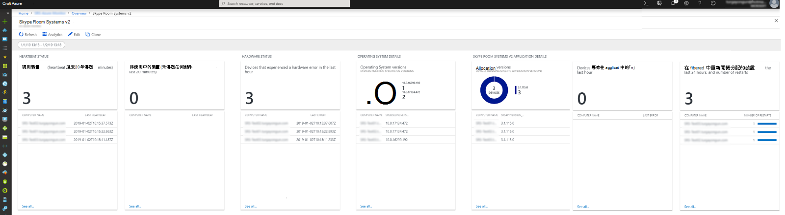
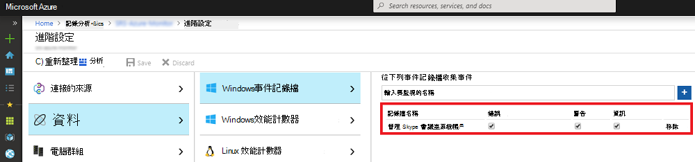

# <a name="deploy-no-loc-textmicrosoft-teams-rooms-management-with-no-loc-textazure-monitor"></a>使用 :::no-loc text="Microsoft Teams Rooms"::: 部署管理 :::no-loc text="Azure Monitor":::

本文將討論如何使用 來設定及部署整合式、端對端管理 :::no-loc text="Microsoft Teams Rooms"::: 裝置 :::no-loc text="Azure Monitor"::: 。

您可以設定 :::no-loc text="Log Analytics"::: 為內部 :::no-loc text="Azure Monitor"::: 提供基本遙測和通知，可協助管理 :::no-loc text="Microsoft Teams Rooms"::: 會議室裝置。 隨著您的管理解決方案逐漸成熟，您可能會決定部署額外的資料和管理功能，以建立更詳細的裝置可用性與績效視圖。

您可以遵循本指南，使用下列範例的儀表板，取得裝置可用性、應用程式和硬體健康情況，以及應用程式和作業系統版本發佈 :::no-loc text="Microsoft Teams Rooms"::: 的詳細狀態報表。



在較高層級上，您需要執行下列工作：


1. [驗證 :::no-loc text="Log Analytics"::: 組組](azure-monitor-deploy.md#validate_LogAnalytics)
2. [設定管理設定 :::no-loc text="Log Analytics"::: 的測試裝置](azure-monitor-deploy.md#configure_test_devices)
3. [地圖自訂欄位](azure-monitor-deploy.md#Custom_fields)
4. [在 中 :::no-loc text="Microsoft Teams Rooms"::: 定義視圖 :::no-loc text="Log Analytics":::](azure-monitor-deploy.md#Define_Views)
5. [定義通知](azure-monitor-deploy.md#Alerts)
6. [設定所有監控裝置](azure-monitor-deploy.md#configure_all_devices)
7. [設定其他 :::no-loc text="Azure Monitor"::: 解決方案](azure-monitor-deploy.md#Solutions)

> [!IMPORTANT]
> 雖然使用最小組組，可以監控執行作業系統的電腦，但您仍然需要執行一些特定步驟，才能開始將代理程式部署到 :::no-loc text="Azure Monitor"::: :::no-loc text="Log Analytics"::: :::no-loc text="Windows"::: :::no-loc text="Microsoft Teams Rooms"::: 所有 :::no-loc text="Microsoft Teams Rooms"::: 裝置。
> 因此，我們強烈建議您以正確的循序執行所有設定步驟，以控制設定和設定。 最終結果的品質非常取決於初始組組的品質。

## <a name="validate-no-loc-textlog-analytics-configuration"></a>驗證 :::no-loc text="Log Analytics"::: 組組
<a name="validate_LogAnalytics"> </a>

您需要有工作區 :::no-loc text="Log Analytics"::: ，以開始從裝置收集 :::no-loc text="Microsoft Teams Rooms"::: 記錄。 工作區是一個獨一無二的環境，具有自己的資料存放庫、 :::no-loc text="Log Analytics"::: 資料來源和解決方案。 如果您已經有現有的工作區，您可以使用它監控您的部署，或者您也可以建立專屬的工作區，以滿足 :::no-loc text="Log Analytics"::: :::no-loc text="Microsoft Teams Rooms"::: :::no-loc text="Log Analytics"::: 您的 :::no-loc text="Microsoft Teams Rooms"::: 監控需求。

如果您需要建立新工作區，請遵循入口網站中建立工作區一文 :::no-loc text="Log Analytics"::: [ :::no-loc text="Log Analytics"::: 中的 :::no-loc text="Azure"::: 指示](/azure/azure-monitor/learn/quick-create-workspace)

> [!NOTE]
> 若要與 :::no-loc text="Log Analytics"::: :::no-loc text="Azure Monitor"::: 一起使用，您必須有使用中 :::no-loc text="Azure"::: 訂閱。 如果您沒有訂閱，您可以建立免費試用訂閱 :::no-loc text="Azure"::: 做為起點。 [](https://azure.microsoft.com/free)

### <a name="configure-no-loc-textlog-analytics-to-collect-no-loc-textmicrosoft-teams-rooms-event-logs"></a>設定 :::no-loc text="Log Analytics"::: 以 :::no-loc text="Microsoft Teams Rooms"::: 收集事件記錄

:::no-loc text="Log Analytics"::: 只會從設定中指定的事件 :::no-loc text="Windows"::: 記錄中收集事件。 針對每一個記錄，只會收集具有所選嚴重性的事件。

您需要設定以 :::no-loc text="Log Analytics"::: 收集監控裝置和應用程式狀態所需的 :::no-loc text="Microsoft Teams Rooms"::: 記錄。 :::no-loc text="Microsoft Teams Rooms"::: 裝置會使用 **:::no-loc text="Skype Room System":::** 事件記錄。

若要設定 :::no-loc text="Log Analytics"::: 以收集 :::no-loc text="Microsoft Teams Rooms"::: 事件，請參閱[ :::no-loc text="Windows"::: 在 :::no-loc text="Azure Monitor"::: ](/azure/azure-monitor/platform/data-sources-windows-events)



> [!IMPORTANT]
> 設定 :::no-loc text="Windows"::: 事件記錄設定並輸入 **:::no-loc text="Skype Room System":::** 為事件記錄名稱，然後選取錯誤、**警告****和資訊** 核取方塊。

## <a name="configure-test-devices-for-azure-monitoring"></a>設定 Azure 監控的測試裝置
<a name="configure_test_devices"> </a>

您必須做好準備， :::no-loc text="Log Analytics"::: 才能監控 :::no-loc text="Microsoft Teams Rooms"::: –相關事件。 首先，您必須將代理程式部署到一或兩個您具有實體存取權的設備，並取得這些測試裝置會產生一些資料，並推送到 :::no-loc text="Microsoft Monitoring"::: :::no-loc text="Microsoft Teams Rooms"::: :::no-loc text="Log Analytics"::: 工作區。

### <a name="install-no-loc-textmicrosoft-monitoring-agents-to-test-devices"></a>安裝 :::no-loc text="Microsoft Monitoring"::: 代理程式以測試裝置

使用電腦在 中的服務連線將代理程式部署到 :::no-loc text="Microsoft Monitoring"::: [ :::no-loc text="Windows"::: :::no-loc text="Log Analytics"::: 測試裝置 :::no-loc text="Azure"::: ](/azure/azure-monitor/platform/agent-windows)。 本文提供有關部署代理程式的步驟、取得 :::no-loc text="Microsoft Monitoring"::: :::no-loc text="Windows"::: :::no-loc text="Log Analytics":::  * **工作區識別碼** _ *__* :::no-loc text="Microsoft Teams Rooms"::: :::no-loc text="Azure Monitor"::: :::no-loc text="Log Analytics"::: 和 _ 主鍵 * 以將裝置連接到您的部署的指示，以及驗證代理程式與實例之間連接的步驟的詳細資訊。

### <a name="generate-sample-no-loc-textmicrosoft-teams-rooms-events"></a>產生 :::no-loc text="Microsoft Teams Rooms"::: 範例事件

將代理程式部署到測試裝置後，請確認所需事件記錄資料是由 :::no-loc text="Microsoft Monitoring"::: 收集者 :::no-loc text="Azure Monitor"::: 所收集。

> [!NOTE]
> 安裝代理程式之後重新開機裝置，然後確認會議應用程式已啟動，以便它可以在事件記錄中 :::no-loc text="Microsoft Monitoring"::: :::no-loc text="Microsoft Teams Rooms"::: 產生新事件。

1.  請登錄入口[ :::no-loc text="Microsoft Azure"::: 網站，](https://portal.azure.com)然後 :::no-loc text="Log Analytics"::: 前往並選取您的工作區。

2.  列出裝置產生的心跳 :::no-loc text="Microsoft Teams Rooms"::: 事件：
    1.  選取您的工作區，然後前往 **記錄，** 然後使用查詢來取回具有 自訂欄位的心跳記錄 :::no-loc text="Microsoft Teams Rooms"::: 。
    2.  範例查詢： `Event | where Source == "SRS-App" and EventID == 2000`

3.  請確定查詢會返回包含會議應用程式所產生事件的 :::no-loc text="Microsoft Teams Rooms"::: 記錄。

4.  產生硬體問題，並驗證所需事件是否登入 :::no-loc text="Azure Log Analytics"::: 。
    1.  拔除測試系統上的其中一個周邊 :::no-loc text="Microsoft Teams Rooms"::: 裝置。 這可能是相機、喇叭、麥克風或會議室顯示器
    2.  請等候 10 分鐘，讓事件記錄填入 :::no-loc text="Azure Log Analytics"::: 。
    3.  使用查詢列出硬體錯誤事件： `Event | where Source == "SRS-App" and EventID == 3001`

5.  產生應用程式問題，並驗證記錄所需的事件。
    1.  修改應用程式組式，然後輸入不正確的會話初始通訊協定 (SIP) :::no-loc text="Microsoft Teams Rooms"::: 位址/密碼組。
    2.  請等候 10 分鐘，讓事件記錄填入 :::no-loc text="Azure Log Analytics"::: 。
    3.  使用查詢列出應用程式錯誤事件： `Event | where Source == "SRS-App" and EventID == 2001 and EventLevel == 1`

> [!IMPORTANT]
> 在自訂欄位可以配置之前，這些範例事件記錄是必填項。 在收集必要的事件記錄之前，請勿繼續進行下一個步驟。

## <a name="map-custom-fields"></a>地圖自訂欄位
<a name="Custom_fields"> </a>

您可以使用自訂欄位從事件記錄中解壓縮特定資料。 您需要定義自訂欄位，稍後會用於磚、儀表板視圖和通知。 在開始[建立自訂欄位 :::no-loc text="Log Analytics"::: ](/azure/azure-monitor/platform/custom-fields)之前，請參閱中的自訂欄位，並熟悉概念。

若要從捕獲的事件記錄中解壓縮自訂欄位，請遵循下列步驟：

1.  請登錄入口[ :::no-loc text="Microsoft Azure"::: 網站，](https://portal.azure.com)然後 :::no-loc text="Log Analytics"::: 前往並選取您的工作區。

2. 列出裝置產生的 :::no-loc text="Microsoft Teams Rooms"::: 事件：
   1.  前往記錄 **，** 然後使用查詢來取回具有自訂欄位的記錄。
   2.  範例查詢： `Event | where Source == "SRS-App" and EventID == 2000`

3. 選取其中一個記錄，選取左側的按鈕，然後啟動欄位提取精靈。
4. 強調要從 RenderedDescription 中抽選的資料，並提供欄位標題。 您應該使用的功能變數名稱會于資料表 1 中提供。
5. 使用表格 *1* 中顯示的映射。 :::no-loc text="Log Analytics":::會在您定義 **\_ 新欄位** 時自動附加 CF 字串。

> [!IMPORTANT]
> 請記住，所有 JSON 和 :::no-loc text="Log Analytics"::: 欄位都是區分大小寫的。
> 
> 請注意下表中每個自訂欄位所需的查詢。 您必須使用正確的查詢，以 :::no-loc text="Log Analytics"::: 成功解壓縮自訂域值。
> 
**表格 1**

| **JSON 欄位**                   | **:::no-loc text="Log Analytics"::: 自訂欄位** | **事件識別碼** | **要用於提取的查詢**                   |
|:---------------------------------|:-------------------------------|:-------------|:-------------------------------------------------------|
| 描述                      | SRSEventDescription         | **2000**     | Source \| == "SRS-App" 和 EventID == 2000 的事件 |
| ResourceState                    | SRSResourceState            | **2000**     | Source \| == "SRS-App" 和 EventID == 2000 的事件 |
| OperationName                    | SRSOperationName            | **2000**     | Source \| == "SRS-App" 和 EventID == 2000 的事件 |
| OperationResult                  | SRSOperationResult          | **2000**     | Source \| == "SRS-App" 和 EventID == 2000 的事件 |
| 作業系統                               | SRSOSVersion                | **2000**     | Source \| == "SRS-App" 和 EventID == 2000 的事件 |
| OSVersion                        | SRSOSLongVersion            | **2000**     | Source \| == "SRS-App" 和 EventID == 2000 的事件 |
| 別名                            | SRSAlias                    | **2000**     | Source \| == "SRS-App" 和 EventID == 2000 的事件 |
| DisplayName                      | SRSDisplayName              | **2000**     | Source \| == "SRS-App" 和 EventID == 2000 的事件 |
| AppVersion                       | SRSAppVersion               | **2000**     | Source \| == "SRS-App" 和 EventID == 2000 的事件 |
| IPv4Address                      | SRSIPv4Address              | **2000**     | Source \| == "SRS-App" 和 EventID == 2000 的事件 |
| IPv6Address                      | SRSIPv6Address              | **2000**     | Source \| == "SRS-App" 和 EventID == 2000 的事件 |
| 會議麥克風狀態     | SRSConfMicrophoneStatus     | **3001**     | Source \| == "SRS-App" 和 EventID == 3001 的事件 |
| 會議演講者狀態        | SRSConfSpeakerStatus        | **3001**     | Source \| == "SRS-App" 和 EventID == 3001 的事件 |
| 預設演講者狀態           | SRSDefaultSpeakerStatus     | **3001**     | Source \| == "SRS-App" 和 EventID == 3001 的事件 |
| 相機狀態                    | SRSCameraStatus             | **3001**     | Source \| == "SRS-App" 和 EventID == 3001 的事件 |
| 會議室顯示狀態前方     | SRSFORDStatus               | **3001**     | Source \| == "SRS-App" 和 EventID == 3001 的事件 |
| 動作感應器狀態             | SRSMotionSensorStatus       | **3001**     | Source \| == "SRS-App" 和 EventID == 3001 的事件 |
| HDMI 輸入狀態               | SRSHDMIIngestStatus         | **3001**     | Source \| == "SRS-App" 和 EventID == 3001 的事件 |


## <a name="define-the-no-loc-textmicrosoft-teams-rooms-views-in-no-loc-textlog-analytics"></a>在 中 :::no-loc text="Microsoft Teams Rooms"::: 定義視圖 :::no-loc text="Log Analytics":::
<a name="Define_Views"> </a>

收集資料並對應自訂欄位之後，您可以使用 View Designer 來開發包含各種磚的儀表板，以監控 :::no-loc text="Microsoft Teams Rooms"::: 事件。 使用 View Designer 建立下列磚。 詳細資訊，請參閱在 中使用[View Designer 建立 :::no-loc text="Log Analytics"::: 自訂視圖](/azure/azure-monitor/platform/view-designer)

> [!NOTE]
> 本指南中的先前步驟應該已經完成，儀表板磚可以正常運作。

### <a name="create-a-microsoft-teams-rooms-dashboard-by-using-the-import-method"></a>使用Microsoft Teams 會議室建立儀表板

您可以輸入儀表板 :::no-loc text="Microsoft Teams Rooms"::: 並開始快速監控您的裝置。 請執行下列步驟來輸入儀表板：

1.  取得 [SkypeRoomSystems_v2.omsview](https://go.microsoft.com/fwlink/?linkid=835675) 儀表板檔案。
2.  請登錄入口[ :::no-loc text="Microsoft Azure"::: 網站，](https://portal.azure.com)然後 :::no-loc text="Log Analytics"::: 前往並選取您的工作區。
3.  開啟 **View Designer**。
4.  選取 **[匯出**，然後選取 **SkypeRoomSystems_v2.omsview** 檔案。
5.  選取 [儲存 **]**。

### <a name="create-a-microsoft-teams-rooms-dashboard-manually"></a>手動建立Microsoft Teams 會議室儀表板

或者，您可以建立自己的儀表板，並只新增要監控的磚。

#### <a name="configure-the-overview-tile"></a>設定概觀磚

1.  開啟 **View Designer**。
2.  選取 **概觀磚**， **然後從圖庫** 選取兩個數字。
3.  為磚命名 **:::no-loc text="Microsoft Teams Rooms":::** 。
4.  定義第 **一個磚**：<br>
    **圖例：** 上個月內至少送出一次心跳的裝置<br>
    **查詢：**```Event | where EventLog == "Skype Room System" and TimeGenerated > ago(30d) | summarize TotalSRSDevices = dcount(Computer)```
5.  定義第 **二個磚**：<br>
    **圖例：** 在上一小時內送出心跳的裝置<br>
    **查詢：**```Event | where EventLog == "Skype Room System" and SRSOperationName_CF == "Heartbeat" and TimeGenerated > ago(1h) | summarize TotalSRSDevices = dcount(Computer)```
6.  選取 **Apply**。

### <a name="create-a-tile-that-displays-active-devices"></a>建立顯示使用中裝置磚

1.  選取 **查看儀表板** 以開始新增磚。
2.  從 **圖庫&** 編號清單
3.  定義 **一般** 屬性：<br>
    **群組標題：** 心跳狀態<br>
    **新群組：** 選擇
4.  定義 **磚** 屬性：<br>
    **圖例：** 使用中的裝置 (過去 20 分鐘內的心跳) <br>
    **磚查詢：**```Event | where EventLog == "Skype Room System" and SRSOperationName_CF == "Heartbeat" and TimeGenerated > ago(20m) | summarize AggregatedValue = count() by Computer | count```
5.  定義 **清單** 屬性：<br>
    **清單查詢：**```Event | where EventLog == "Skype Room System" and SRSOperationName_CF == "Heartbeat" and TimeGenerated > ago(20m) | summarize TimeGenerated = max(TimeGenerated) by Computer | order by TimeGenerated```
6.  定義 **欄標題**：<br>
    **名稱：** 電腦名稱稱<br>
    **值：** 最後一個心跳
7.  定義 **流覽查詢**。<br>
    ```search {selected item} | where EventLog == "Skype Room System" and SRSOperationName_CF == "Heartbeat" | summarize arg_max(TimeGenerated, *) by Computer | project TimeGenerated, Computer, SRSAlias_CF, SRSAppVersion_CF, SRSOSVersion_CF, SRSOSLongVersion_CF, SRSIPv4Address_CF, SRSIPv6Address_CF, SRSOperationName_CF, SRSOperationResult_CF, SRSResourceState_CF, SRSEventDescription_CF```
8.  選取 **Apply**，然後 **關閉**。

### <a name="create-a-tile-that-displays-devices-that-have-connectivity-issues"></a>建立顯示有連接問題的裝置磚

1.  從 **圖庫&** 編號清單，然後新增磚。
2.  定義 **一般** 屬性：<br>
    **群組標題：** 保留空白<br>
    **新群組：** 未選取
3.  定義 **磚** 屬性：<br>
    **圖例：** 非 (裝置) <br>
    **磚查詢：**```Event | where EventLog == "Skype Room System" and SRSOperationName_CF == "Heartbeat" | summarize LastHB = max(TimeGenerated) by Computer | where LastHB < ago(20m) | count```
4.  定義 **清單** 屬性：<br>
    **清單查詢：**```Event | where EventLog == "Skype Room System" and SRSOperationName_CF == "Heartbeat" | summarize TimeGenerated = max(TimeGenerated) by Computer | where TimeGenerated < ago(20m) | order by TimeGenerated```
5.  定義 **欄標題**：<br>
    **名稱：** 電腦名稱稱<br>
    **值：** 最後一個心跳
6.  定義 **流覽查詢**：<br>
    ```search {selected item} | where EventLog == "Skype Room System" and SRSOperationName_CF == "Heartbeat" | summarize arg_max(TimeGenerated, *) by Computer | project TimeGenerated, Computer, SRSAlias_CF, SRSAppVersion_CF, SRSOSVersion_CF, SRSOSLongVersion_CF, SRSIPv4Address_CF, SRSIPv6Address_CF, SRSOperationName_CF, SRSOperationResult_CF, SRSResourceState_CF, SRSEventDescription_CF```
7.  選取 **Apply**，然後 **關閉**。

### <a name="create-a-tile-that-displays-devices-that-have-a-hardware-error"></a>建立顯示硬體錯誤的裝置磚

1.  從 **圖庫&** 編號清單，然後新增磚。
2.  定義 **一般** 屬性：<br>
    **群組標題：** 硬體狀態<br>
    **新群組：** 選擇
3.  定義 **磚** 屬性：<br>
    **圖例：** 過去一小時內發生硬體錯誤的裝置<br>
    **磚查詢：**```Event | where EventLog == "Skype Room System" and EventLevelName == "Error" and EventID == "3001" and TimeGenerated > ago(1h) | summarize AggregatedValue = count() by Computer | count```
4.  定義 **清單** 屬性：<br>
    **清單查詢：**```Event | where EventLog == "Skype Room System" and EventLevelName == "Error" and EventID == "3001" and TimeGenerated > ago(1h) | summarize TimeGenerated = max(TimeGenerated) by Computer | order by TimeGenerated```
5.  定義 **欄標題**：<br>
    **名稱：** 電腦名稱稱<br>
    **值：** 上次錯誤
6.  定義 **流覽查詢**：<br>
    ```search {selected item} | where EventLog == "Skype Room System" and EventID == 3001 and EventLevelName == "Error" | summarize arg_max(TimeGenerated, *) by Computer | project TimeGenerated, Computer, SRSAlias_CF, SRSAppVersion_CF, SRSOSVersion_CF, SRSOSLongVersion_CF, SRSIPv4Address_CF, SRSIPv6Address_CF, SRSOperationName_CF, SRSOperationResult_CF, SRSResourceState_CF, SRSConfMicrophoneStatus_CF, SRSConfSpeakerStatus_CF, SRSDefaultSpeakerStatus_CF, SRSCameraStatus_CF, SRSFORDStatus_CF, SRSMotionSensorStatus_CF, SRSHDMIIngestStatus_CF, SRSEventDescription_CF | sort by TimeGenerated desc```
7.  選取 **Apply**，然後 **關閉**。

### <a name="create-a-tile-that-displays-no-loc-textmicrosoft-teams-rooms-operating-system-versions"></a>建立顯示作業系統 :::no-loc text="Microsoft Teams Rooms"::: 版本的磚

1.  從 **圖庫&** 環圈清單，然後新增磚。
2.  定義 **一般** 屬性：<br>
    **群組標題：** 作業系統詳細資料<br>
    **新群組：** 選擇
3.  定義 **標題** 屬性：<br>
    **標題：** 作業系統版本<br>
    **副標題：** 執行特定作業系統版本的裝置
4.  定義 **環圈** 屬性：<br>
    **查詢：**```Event | where EventLog == "Skype Room System" and SRSOperationName_CF == "Heartbeat" | summarize OS_Version = max(SRSOSLongVersion_CF) by Computer | summarize AggregatedValue = count() by OS_Version | sort by OS_Version asc```<br>
    **文字中央：** 設備<br>
    **作業：** 和
5.  定義 **清單** 屬性。<br>
    **清單查詢：**```Event | where EventLog == "Skype Room System" and SRSOperationName_CF == "Heartbeat" | summarize SRSOSLongVersion_CF = max(SRSOSLongVersion_CF) by Computer | sort by Computer asc```<br>
    **隱藏Graph：** 選擇<br>
    **啟用走勢圖：** 未選取
6.  定義 **欄標題**。<br>
    **名稱：** 電腦名稱稱<br>
    **值：** 保留空白
7.  定義 **流覽查詢**。<br>
    ```search {selected item} | where EventLog == "Skype Room System" and SRSOperationName_CF == "Heartbeat" | summarize arg_max(TimeGenerated, *) by Computer | project TimeGenerated, Computer, SRSDisplayName_CF, SRSAlias_CF, SRSAppVersion_CF, SRSOSVersion_CF, SRSOSLongVersion_CF, SRSIPv4Address_CF, SRSIPv6Address_CF, SRSOperationName_CF, SRSOperationResult_CF, SRSResourceState_CF, SRSEventDescription_CF```
8.  選取 **Apply，** 然後 **關閉**。

### <a name="create-a-tile-that-displays-no-loc-textmicrosoft-teams-rooms-application-versions"></a>建立顯示應用程式 :::no-loc text="Microsoft Teams Rooms"::: 版本的磚

1.  從 **圖庫&** 環圈清單，然後新增磚。
2.  定義 **一般** 屬性：<br>
    **群組標題：** :::no-loc text="Microsoft Teams Rooms"::: 應用程式詳細資料<br>
    **新群組：** 選擇
3.  定義 **標題** 屬性：<br>
    **標題：** 應用程式版本<br>
    **副標題：** 執行特定應用程式版本的裝置
4.  定義 **環圈** 屬性：<br>
    **查詢：**```Event | where EventLog == "Skype Room System" and SRSOperationName_CF == "Heartbeat" | summarize App_Version = max(SRSAppVersion_CF) by Computer | summarize AggregatedValue = count() by App_Version | sort by App_Version asc```<br>
    **文字中央：** 設備<br>
    **作業：** 和
5.  定義 **清單** 屬性。<br>
    **清單查詢：**```Event | where EventLog == "Skype Room System" and SRSOperationName_CF == "Heartbeat" | summarize SRSAppVersion_CF = max(SRSAppVersion_CF) by Computer | sort by Computer asc```<br>
    **隱藏Graph：** 選擇<br>
    **啟用走勢圖：** 未選取
6.  定義 **欄標題**。<br>
    **名稱：** 電腦名稱稱<br>
    **值：** 保留空白
7.  定義 **流覽查詢**。<br>
    ```search {selected item} | where EventLog == "Skype Room System" and SRSOperationName_CF == "Heartbeat" | summarize arg_max(TimeGenerated, *) by Computer | project TimeGenerated, Computer, SRSAlias_CF, SRSAppVersion_CF, SRSOSVersion_CF, SRSOSLongVersion_CF, SRSIPv4Address_CF, SRSIPv6Address_CF, SRSOperationName_CF, SRSOperationResult_CF, SRSResourceState_CF, SRSEventDescription_CF```
8.  選取 **Apply，** 然後 **關閉**。

### <a name="create-a-tile-that-displays-devices-that-have-an-application-error"></a>建立顯示有應用程式錯誤的裝置磚

1.  從 **圖庫&** 編號清單，然後新增磚。
2.  定義 **一般** 屬性。<br>
    **群組標題：** 保留空白<br>
    **新群組：** 未選取
3.  定義 **磚** 屬性。<br>
    **圖例：** 過去一小時內發生應用程式錯誤的裝置<br>
    **磚查詢：**```Event | where EventLog == "Skype Room System" and EventLevelName == "Error" and EventID == "2001" and TimeGenerated > ago(1h) | summarize AggregatedValue = count() by Computer | count```
4.  定義 **清單** 屬性。<br>
    **清單查詢：**```Event | where EventLog == "Skype Room System" and EventLevelName == "Error" and EventID == "2001" and TimeGenerated > ago(1h) | summarize TimeGenerated = max(TimeGenerated) by Computer | order by TimeGenerated```
5.  定義 **欄標題**。<br>
    **名稱：** 電腦名稱稱<br>
    **值：** 上次錯誤
6.  定義 **流覽查詢**。<br>
    ```search {selected item} | where EventLog == "Skype Room System" and EventID == 2001 and EventLevelName == "Error" | summarize arg_max(TimeGenerated, *) by Computer | project TimeGenerated, Computer, SRSAlias_CF, SRSAppVersion_CF, SRSOSVersion_CF, SRSOSLongVersion_CF, SRSIPv4Address_CF, SRSIPv6Address_CF, SRSOperationName_CF, SRSOperationResult_CF, SRSResourceState_CF, SRSEventDescription_CF | sort by TimeGenerated desc```
7.  選取 **Apply，** 然後 **關閉**。

### <a name="create-a-tile-that-displays-devices-that-have-been-restarted"></a>建立顯示已重新開機之裝置的磚

1.  從 **圖庫&** 編號清單，然後新增磚。
2.  定義 **一般** 屬性。<br>
    **群組標題：** 保留空白<br>
    **新群組：** 未選取
3.  定義 **磚** 屬性。<br>
    **圖例：** 過去 24 小時內重新開機應用程式的裝置，以及重新開機次數<br>
    **磚查詢：**```Event | where EventLog == "Skype Room System" and EventID == "4000" and TimeGenerated > ago(24h) | summarize AggregatedValue = count() by Computer | count```
4.  定義 **清單** 屬性。<br>
    **清單查詢：**```Event | where EventLog == "Skype Room System" and EventID == "4000" and TimeGenerated > ago(24h) | order by TimeGenerated | summarize AggregatedValue = count(EventID) by Computer```
5.  定義 **欄標題**。<br>
    **名稱：** 電腦名稱稱<br>
    **值：** 重新開機次數
6.  定義 **流覽查詢**。<br>
    ```search {selected item} | where EventLog == "Skype Room System" and EventID == "4000" and TimeGenerated > ago(24h) | project TimeGenerated, Computer, SRSAlias_CF, SRSAppVersion_CF, SRSOSVersion_CF, SRSOSLongVersion_CF, SRSIPv4Address_CF, SRSIPv6Address_CF, SRSOperationName_CF, SRSOperationResult_CF, SRSResourceState_CF, SRSEventDescription_CF```
7.  選取 **Apply，** 然後 **關閉**。
8.  選取 **儲存** 以儲存儀表板。

現在，您已完成建立您的視圖。

## <a name="configure-alerts-in-no-loc-textazure-monitor"></a>在 中設定通知 :::no-loc text="Azure Monitor":::
<a name="Alerts"> </a>

:::no-loc text="Azure Monitor"::: 當主機遇到問題時，可以提醒系統管理員 :::no-loc text="Microsoft Teams Rooms"::: 。

:::no-loc text="Azure Monitor"::: 包含內建的警示機制，會定期執行排程記錄搜尋。 如果記錄搜尋的結果符合特定準則，即會建立通知記錄。

規則接著會自動執行一或多個動作，主動通知您通知或援用另一個程式。 有通知的可能選項有：
-   傳送電子郵件
-   透過 HTTP POST 要求來啟動外部程式
-   啟動服務中的 :::no-loc text="Azure Automation"::: Runbook

請參閱[在 中記錄 :::no-loc text="Azure Monitor"::: 通知](/azure/azure-monitor/platform/alerts-unified-log)，以深入瞭解 中的通知 :::no-loc text="Azure Monitor"::: 。

> [!NOTE]
> 下列範例在裝置產生硬體或應用程式錯誤時傳送 :::no-loc text="Microsoft Teams Rooms"::: 電子郵件通知。

### <a name="configure-an-email-alert-for-no-loc-textmicrosoft-teams-rooms-hardware-issues"></a>設定硬體問題 :::no-loc text="Microsoft Teams Rooms"::: 的電子郵件通知

設定提醒規則，檢查過去一小時內發生硬體問題的 :::no-loc text="Microsoft Teams Rooms"::: 裝置。
1.  請登錄入口[ :::no-loc text="Microsoft Azure"::: 網站，](https://portal.azure.com)然後 :::no-loc text="Log Analytics"::: 前往並選取您的工作區。

2. 流覽至您的 :::no-loc text="Log Analytics"::: 工作區，然後 **選取通知** ，然後選取 **新增通知規則**

3. 選取 **新增條件** ，然後 **選取自訂記錄搜尋**

4.  在搜尋查詢文字方塊中輸入下列查詢。<br>
    ```
    Event
    | where EventLog == "Skype Room System" and EventLevelName == "Error" and EventID == "3001" and TimeGenerated > ago(1h)
    | summarize arg_max(TimeGenerated, *) by Computer
    | project TimeGenerated, Computer, SRSAlias_CF, SRSAppVersion_CF, SRSOSVersion_CF, SRSOSLongVersion_CF, SRSIPv4Address_CF, SRSIPv6Address_CF, SRSOperationName_CF, SRSOperationResult_CF, SRSResourceState_CF, SRSConfMicrophoneStatus_CF, SRSConfSpeakerStatus_CF, SRSDefaultSpeakerStatus_CF, SRSCameraStatus_CF, SRSFORDStatus_CF, SRSMotionSensorStatus_CF, SRSHDMIIngestStatus_CF, SRSEventDescription_CF
    |sort by TimeGenerated desc
    ```

5.  設定通知邏輯設定：<br>
    **根據：** 結果數目<br>
    **條件：** 大於<br>
    **閾值：0**<br>

6. 設定評估設定 **，然後選取** 完成 ： <br>
    **期間 (分鐘) ：60**<br>
    **以 (分鐘) 頻率：60**<br>

7. 設定動作群組：
    1.  選取 **建立新**
    2.  為動作組名和簡短名稱 *欄位**提供適當的* 名稱。
    3.  指定唯一 *的動作名稱，* 然後選取 **電子郵件/簡訊/推/語音**，然後選取編輯 **詳細資料**。
    4.  選取 **電子郵件** 核取方塊，並提供接收通知之人員或群組的電子郵件地址。
    5.  您也可以提供電話號碼，以取得電話、簡訊或兩者的通知。
    6. 選取 **確定**。

8. **如果您想要重寫** 通知電子郵件的主題行，請自訂動作。

9. 指定規則名稱和描述。<br>
    **規則名稱：** :::no-loc text="Microsoft Teams Rooms"::: 硬體失敗通知<br>
    **描述：** 過去一小時內發生硬體問題的裝置清單<br>

10. 選取預定的嚴重性，然後確認已啟用規則。

11. 選取 **建立警示規則**。

### <a name="configure-an-email-alert-for-no-loc-textmicrosoft-teams-rooms-application-issues"></a>設定應用程式問題 :::no-loc text="Microsoft Teams Rooms"::: 的電子郵件通知

重複相同的程式，但使用下列查詢列出過去一小時內遇到應用程式問題的裝置。

    ```
    Event
    | where EventLog == "Skype Room System" and EventLevelName == "Error" and EventID == "2001" and TimeGenerated > ago(1h)
    | summarize arg_max(TimeGenerated, *) by Computer
    | project TimeGenerated, Computer, SRSAlias_CF, SRSAppVersion_CF, SRSOSVersion_CF, SRSOSLongVersion_CF, SRSIPv4Address_CF, SRSIPv6Address_CF, SRSOperationName_CF, SRSOperationResult_CF, SRSResourceState_CF, SRSEventDescription_CF
    | sort by TimeGenerated desc
    ```

現在，您已完成定義通知。 您可以使用上述範例定義其他警示。

產生通知時，您就會收到一封電子郵件，列出過去一小時內發生問題的裝置。

![範例 :::no-loc text="Azure Monitor"::: 通知電子郵件] (。/media/Deploy-Azure-Monitor-6.png「範例 :::no-loc text="Azure Monitor"::: 通知電子郵件」) 

## <a name="configure-all-devices-for-no-loc-textazure-monitoring"></a>設定所有裝置 :::no-loc text="Azure Monitoring":::
<a name="configure_all_devices"></a>設定儀表板和通知之後，您可以在所有裝置上設定和設定代理程式， :::no-loc text="Microsoft Monitoring"::: :::no-loc text="Microsoft Teams Rooms"::: 以完成監控部署。

雖然您可以在每個裝置上手動安裝和設定代理程式，但我們強烈建議您 :::no-loc text="Microsoft Monitoring"::: 利用現有的軟體部署工具和方法。

如果您是第一次建立裝置，您可能會想要將代理程式設定和設定步驟納入您的建立 :::no-loc text="Microsoft Teams Rooms"::: :::no-loc text="Microsoft Monitoring"::: 程式。 詳細資訊，請參閱 [使用命令列安裝代理程式](/azure/azure-monitor/platform/agent-windows#install-the-agent-using-the-command-line)。

### <a name="deploying-no-loc-textmicrosoft-monitoring-agent-by-using-a-group-policy-object-gpo"></a>使用 :::no-loc text="Microsoft Monitoring"::: 群組原則物件或 GPO (部署) 

如果您已經部署您的裝置，然後再進行部署，您可以使用群組原則物件，使用所提供的腳本來設定 :::no-loc text="Microsoft Teams Rooms"::: :::no-loc text="Azure Monitoring"::: :::no-loc text="Active Directory"::: 和設定代理程式。

1.  建立共用網路路徑，並授予網域 **電腦群組的讀取** 存取權。

2.  下載 64 位版本的 :::no-loc text="Microsoft Monitoring"::: Agent，從 :::no-loc text="Windows":::<https://go.microsoft.com/fwlink/?LinkID=517476>

3.  將設定套件的內容解壓縮到網路共用中。
    1.  開啟命令提示視窗，然後執行 **MMASetup-AMD64.exe /c**
    2.  指定您剛剛建立共用，然後解壓縮內容。

4.  建立新的群組原則物件，並將其指派給電腦 :::no-loc text="Microsoft Teams Rooms"::: 帳戶所在的組織單位。

5.  設定 PowerShell 執行策略：
    1.  編輯新建立群組原則物件，並流覽至電腦群組 \\ 策略 \\ 系統管理範本 \\ :::no-loc text="Windows"::: 元件 \\:::no-loc text="Windows PowerShell":::
    2.  啟用開啟 **腳本執行，** 並設定 **執行策略** 以 **允許本地腳本**。

6.  設定啟動腳本：
    1.  複製下列腳本並儲存為Install-MMAgent.ps1。
    2.  修改 WorkspaceId、WorkspaceKey 和 SetupPath 參數，以配合您的設定。
    3.  編輯相同的群組原則物件，然後流覽至電腦群組 \\ 設定 \\ :::no-loc text="Windows"::: \\ 腳本 (啟動/關機) 
    4.  按兩下以選取 **[啟動**，然後選取 **PowerShell 腳本**。
    5.  選取 **顯示檔案**，然後將 **Install-MMAgent.ps1檔案複製到** 該資料夾。
    6.  選取 **新增**，然後 **流覽**。
    7.  選取您剛才複製的 ps1 腳本。

7.  :::no-loc text="Microsoft Teams Rooms"::: 裝置應安裝並設定 :::no-loc text="Microsoft Monitoring"::: 第二次重新開機的代理程式。

```PowerShell
# Install-MMAgent.ps1
<#
Date:        04/20/2018
Script:      Install-MMAgent.ps1
Version:     1.0
#>

# Set the parameters
$WorkspaceId = "<your workspace id>"
$WorkspaceKey = "<your workspace key>"
$SetupPath = "\\Server\Share"

$SetupParameters = "/qn NOAPM=1 ADD_OPINSIGHTS_WORKSPACE=1 OPINSIGHTS_WORKSPACE_AZURE_CLOUD_TYPE=0 OPINSIGHTS_WORKSPACE_ID=$WorkspaceId OPINSIGHTS_WORKSPACE_KEY=$WorkspaceKey AcceptEndUserLicenseAgreement=1"

# $SetupParameters = $SetupParameters + " OPINSIGHTS_PROXY_URL=<Proxy server URL> OPINSIGHTS_PROXY_USERNAME=<Proxy server username> OPINSIGHTS_PROXY_PASSWORD=<Proxy server password>"

# Start PowerShell logging
Start-Transcript -Path C:\Temp\MMA-Install.Log

# Check if the Microsoft Monitoring Agent is installed
$mma = New-Object -ComObject 'AgentConfigManager.MgmtSvcCfg'

# Check if the Microsoft Monitoring agent is installed
if (!$mma)
{
    #Install agent
    Start-Process -FilePath "$SetupPath\Setup.exe" -ArgumentList $SetupParameters -ErrorAction Stop -Wait
}

# Check if the agent has a valid configuration
$CheckMMA = $mma.GetCloudWorkspace($WorkspaceId).AgentId
if (!$CheckMMA)
{
    # Apply new configuration
    $mma.AddCloudWorkspace($WorkspaceId, $WorkspaceKey)
    $mma.ReloadConfiguration()
}

Stop-Transcript
```

> [!NOTE]
> 當您需要重新設定 [代理程式、 :::no-loc text="Log Analytics"::: ](/azure/azure-monitor/platform/agent-manage) 將其移至不同的工作區，或修改代理設定時，請參閱管理及維護代理一文。

## <a name="additional-solutions"></a>其他解決方案
<a name="Solutions"> </a>

:::no-loc text="Azure Monitor"::: 透過其解決方案庫提供內建的管理解決方案 [，](/azure/azure-monitor/insights/solutions) 進一步説明您監控環境。 我們強烈建議您新增[通知管理](/azure/azure-monitor/platform/alert-management-solution)與[ :::no-loc text="Azure Log Analytics"::: 代理人員健康](/azure/azure-monitor/insights/solution-agenthealth)狀態解決方案至您的工作區。

> [!NOTE]
> 代理程式健康情況解決方案可協助您識別環境中過期或已中斷的代理程式，而警示管理解決方案會提供有關特定期間中已提出之警示 :::no-loc text="Microsoft Monitoring"::: 的詳細資訊。

## <a name="see-also"></a>另請參閱

[使用 :::no-loc text="Microsoft Teams Rooms"::: 規劃管理 :::no-loc text="Azure Monitor":::](azure-monitor-plan.md)

[使用 :::no-loc text="Microsoft Teams Rooms"::: 管理裝置 :::no-loc text="Azure Monitor":::](azure-monitor-manage.md)