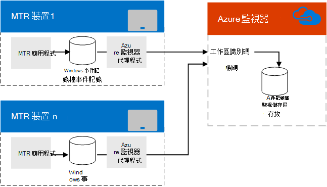

# 使用 azure 監視器Microsoft Teams 會議室管理計畫
 
 本文討論規劃使用 Azure 監視器管理Microsoft Teams 會議室裝置或Microsoft Teams或商務用 Skype考慮。
  
[Azure 監視器](/azure/azure-monitor/overview) 是一系列管理服務，從一開始即是在雲端中設計。 Azure 監視器元件完全託管在 Azure 中，而不是部署和管理內部部署資源。 組組是最小的，您只需要幾分鐘就可以完全啟動並運作。 有了一些自訂工作，它可針對個別會議室系統提供系統健康情況或錯誤即時通知，協助管理 Microsoft Teams 會議室 會議系統，並可能放大管理數千間 Microsoft Teams 會議室 會議室。
  
本文提供實行 Microsoft Teams 會議室 會議裝置 Azure 監視器管理所需的需求、設計/架構及實做最佳做法的討論，並提供有關實做 Microsoft Teams 會議室 版 Azure 監視器的詳細文章的連結，以及持續監控 Microsoft Teams 會議室 會議室的重要參考資訊。 
  
## 功能概觀

  
主機Microsoft Teams 會議室上的應用程式會將事件寫入其Windows記錄。 安裝之後，Microsoft 監控代理程式會將資訊傳遞至 Azure Monitor 服務。 
  
正確配置之後，Log Analytics 會剖析事件描述內嵌的 JSON 負載，描述每個 Microsoft Teams 會議室 系統的運作方式，以及偵測到哪些錯誤。 
  
使用 Azure 監視器的系統管理員Microsoft Teams 會議室離線或遇到應用程式、連線或硬體失敗之系統的通知，以及知道系統是否必須重新開機。 每個系統狀態會經常更新，因此這些通知會接近即時更新。
  
## Azure 監視器需求

您必須擁有 Azure 監視器的有效 Azure 訂閱，才能使用記錄分析功能。 請參閱 [開始使用記錄分析工作區](/azure/azure-monitor/learn/quick-create-workspace) ，為貴組織建立訂閱。
  
您應該視需要熟悉如何使用記錄分析視圖設計工具。 請參閱 [記錄分析中的查看，](/azure/azure-monitor/platform/view-designer) 瞭解這些詳細資料。
  
### 相關工作

1. 訂閱 Azure 監視器記錄分析之後，請建立自訂欄位[ (](azure-monitor-deploy.md#Custom_fields)如地圖自訂欄位) 所述，以剖析從 Microsoft Teams 會議室 主控台Microsoft Teams 會議室的資訊。 這包括瞭解在瞭解記錄專案中記載的 [JSON 架構](azure-monitor-manage.md#understand-the-log-entries)。
    
2. 在記錄Microsoft Teams 會議室中建立管理檢視。 您可以手動[建立Microsoft Teams 會議室儀表板](azure-monitor-deploy.md#create-a-microsoft-teams-rooms-dashboard-manually)。
    
## 個別Microsoft Teams 會議室主機需求

每個 Microsoft Teams 會議室 主機都是在 Surface Pro 裝置上以資訊站模式執行的應用程式 (一般而言，它已配置為唯一可在裝置上執行的應用程式) 。 如同任何Windows應用程式一樣，Microsoft Teams 會議室應用程式會將啟動和硬體故障等事件寫入 Windows記錄。 在裝置上新增 Microsoft Monitor Microsoft Teams 會議室可讓您收集這些事件。  (請參閱連線 Windows到[Azure](/azure/azure-monitor/platform/agent-windows)中的記錄分析服務以查看詳細資料。) 
  
## 持續管理

使用 Azure 監視器管理Microsoft Teams 會議室裝置時，您必須瞭解 Azure 監視器使用的事件記錄中包含的資訊。 請參閱 [瞭解這些健康情況訊息](azure-monitor-manage.md#understand-the-log-entries) 的詳細資訊記錄專案。
  
### 相關工作

- 瞭解使用者產生的Microsoft Teams 會議室，以及如何解決 (請參閱瞭解記錄專案) 
    
## 另請參閱

[使用 azure Microsoft Teams 會議室部署管理](azure-monitor-deploy.md)
  
[使用 azure 監視器Microsoft Teams 會議室管理裝置](azure-monitor-manage.md)
