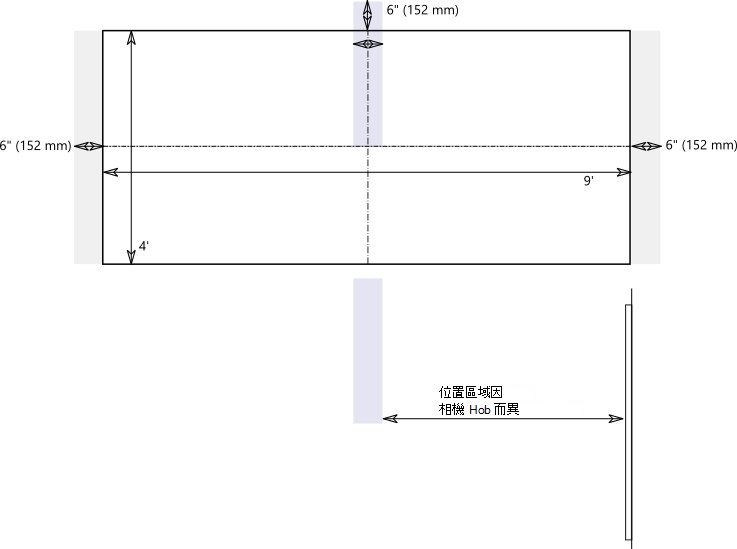
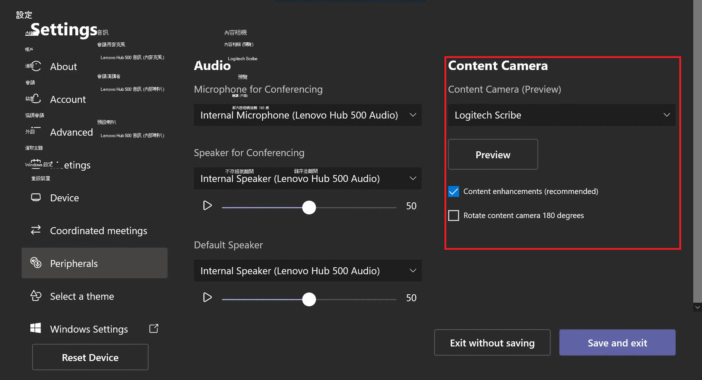

# 內容相機

您現在可以將內容相機與Microsoft Teams 會議室系統搭配使用。 內容相機會與特殊的影像處理軟體和白板互動，讓簡報者能夠在類比白板上繪圖，並與遠端參與者共用內容。

請參閱下列影片以瞭解內容相機功能的範例。

> [!VIDEO https://www.microsoft.com/videoplayer/embed/RE3E7fy]

## 設定內容相機

> [!NOTE]
> 一律遵守您國家或地區的建築代碼，這可定義離樓層最小距離，或是要求保護高架固定設備的安全，以裝入玻璃或其他結構。 依照您所選取相機隨附之硬體的安裝指示進行。 OEM 相機安裝套件包括相機、USB 2.0 延伸器，以及必要的纜線。

用於共用的白板大小會影響相機的位置。 版面大小建議如下：

-  (0.9–1.8 m) 寬 - 支援
- 6-9寬 (1.8-2.7) m - 建議
- 9-12 哚寬 (2.7-3.6 米) 寬 - 支援
- 超過 12 ft. (3.6 m) 寬 — 相機涵蓋 9-12 吋吋。 (2.7 至 3.6 m) ，其餘的相機則會裁) 。

## 相機位置

內容相機在白板上的理想位置會垂直和水準置中。 本機建置碼可能會有高度限制，要求相機高於白板頂端。

您最多可以將相機安裝在 6 個內。  (比白板頂端高 152 公釐) ，並且在白板上置中對齊，如圖所示。 確認相機影像至少包含 6 英吋。 水準 (152 公釐) 框線。 您可以在 Microsoft Teams 會議室 應用程式中使用相機預覽來判斷相機的最終位置。

### 相機距離

使用一般白板標記，最佳的遠端使用者體驗是分享內容相機影像中每個圖元範圍內 1 到 2 公釐的筆跡線條，而最佳的結果是每圖元使用 1.5 公釐。 所有支援的相機都提供 1920 x 1080 解析度，有些可能超過該解析度。

相機與白板之間的距離會與相機解析度和 [水準檢視欄位] 結合 (HFoV) 來判斷與白板之間的距離。 下表顯示各種白板大小的距離範例。 您可以使用這些值做為起點，決定內容相機的最終位置。

**相機與白板的距離**

| 相機 HFoV |3 (0.91 m)      | 6 (1.8 m)     | 9 (2.74 m)         |12 ft。 (3.65 m)          | 從 Whiteboard 的最大距離  |
|:---         |:---               |:---                |:---                 |:---             | :--- |
| 80°         | 1.79 吋 (0.54 公分)  | 3.58 吋 (1.09 m)   | 5.36 吋 (1.6 公)     |7.15 吋 (2.17 m)  |7.51 公 (2.28 公)  |
| 90°         | 1.5 吋 (0.45 公)  | 3.00 (0.91 m)    | 4.5 吋 (1.37 公)     |6.0 (1.82 m)     |6.3 (1.92 m)  |
| 100°        | 1.26 (0.38 m) | 2.52 吋 (0.77 m)    | 3.78 呎 (1.15 公)    |5.03 吋 (1.53 公)    |5.29 吋 (1.61 m)  |
| 110°        | 1.05 吋 (0.32 m) | 2.10 (0.64 m)    | 3.15 吋 (0.96 公分)    |4.2 (1.28 m)     |4.41 (1.31 m)  |
| 120°        | 0.87 (0.26 m) | 1.73 呎 (0.52 公)    | 2.60 (0.79 m)    |3.46 吋 (1.05 m)    |3.64 (1.10 m)  |
             

安裝白板的內容相機和牆壁之間的距離取決於該相機型號的 HFoV，因而有所不同。 安裝配備較大 HFoV (120 度的相機，例如) 靠近牆面，以及距離牆壁較窄的 HFoV 相機。 開始安裝所選相機之前，請先檢查 HFoV。

如果您的白板大於 12 呎。 (3.65 公) 或沒有像全牆白板一樣 (角落) ，您可以將相機放在中間的任何位置。 美化軟體會在找不到白板角落時選取中間的區域。

> [!NOTE]
> 您可以使用深色膠帶或其他專案，在全牆白板上建立定義的內容相機區域。 這可協助會議室內的出席者知道何時在內容相機擷取的區域中繪圖。
>
> 您可以選擇將相機固定在可移動的三腳架上，而不是永久掛架。 將三腳架置中放在白板上。 此設定可能是暫時性的，或在設備幾乎無法重迭的情況下使用。 如果您使用暫存架，請記住，如果您在初始共用之後移動相機，內容增強功能將會受到影響，而且您必須重新分享才能更正移動。
>
> 不支援白色的寫入面板。

## 支援的相機

若要判斷您是否可以使用相機做為內容相機，請參閱 [USB 音訊和視訊周邊裝置的認證韌體版本](requirements.md#certified-firmware-versions-for-usb-audio-and-video-peripherals)。

或者，請參閱 Microsoft Teams 裝置市集以 [取得 aka.ms/teamsdevices](https://aka.ms/teamsdevices)支援的「內容相機套件」。

## 相機設定

一旦在會議室中安裝相機，請在該聊天室的Microsoft Teams 會議室主機上設定：

1. 選 **取 [設定** ![ ] 設定圖示。 ](../media/70f1b43f-16d6-4172-9139-71d845c4ed5c.png) 以管理員登入，然後選取 [**周邊設備]**。
2. 在 [ **內容相機]** 區段中，選取內容相機，並確定已選取 [ **內容增強** 功能] 選項。
3.  (選用) 如果因為相機從吊頂安裝相機而上下顛倒安裝相機，請核取 [ **旋轉內容相機 180°** ] 選項。
4. 選 **取 [儲存並結束]**。

您也可以使用 [XML 組態檔](xml-config-file.md)從遠端調整這些設定。

## 另請參閱

[使用 XML 組態檔遠端系統管理Microsoft Teams 會議室主機設定](xml-config-file.md)

[Microsoft Teams 會議室需求](requirements.md)

