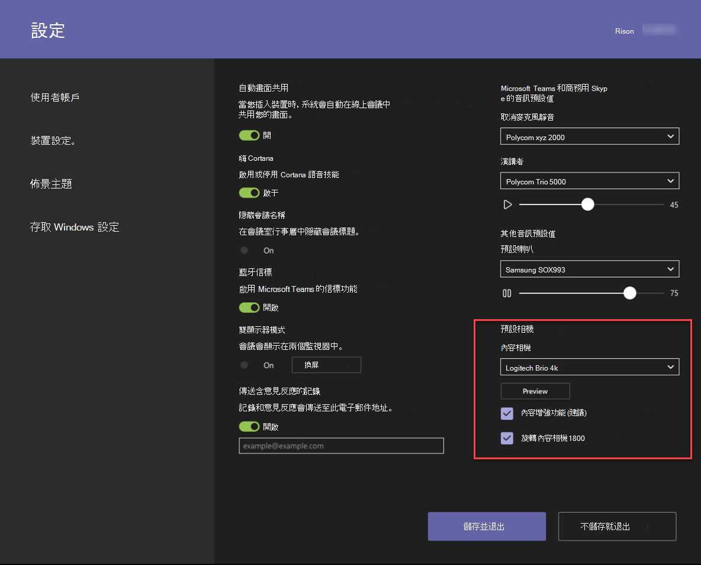

# 內容相機Content cameras

您現在可以使用內容相機搭配 Microsoft [小組室系統]。You can now use a content camera with a Microsoft Teams Room system. 內容相機會與特殊的影像處理軟體和白板互動，讓簡報者在類比白板上繪圖，並與遠端參與者共用內容。A content camera interacts with special image-processing software and a whiteboard to allow a presenter to draw on an analog whiteboard and share the content with remote participants.

請參閱下列影片，以取得內容攝影機功能的範例。See the following video for examples of content camera functionality.

> [!VIDEO https://www.microsoft.com/videoplayer/embed/RE3E7fy]

## 設定內容攝影機Set up a content camera

> [!NOTE]
> 請務必遵循您的國家或地區的建築物程式碼，這可能會定義最小到地面的距離，或要求將天花板掛載的裝置安全地提供給 rafter 或其他結構。Always adhere to your country or area's building code, which may define a minimum distance from the floor or a requirement that ceiling-mounted equipment be secured to a rafter or other structure. 針對您所選取的相機提供的硬體，按照安裝指示進行。Follow the mounting instruction for the hardware provided with the camera you‘ve selected. OEM 相機安裝套件包括相機、USB 2.0 延伸器以及所需的纜線。OEM camera mounting kits include a camera, USB 2.0 extenders and required cabling.

共用所用的白板大小會影響相機的位置。The size of the whiteboard used for sharing affects the placement of the camera. 建議的版面大小：Board size recommendations are:

- 支援3到6英尺（0.9 – 1.8 m）3–6 ft. (0.9–1.8 m) wide — Supported
- 全（1.8 – 2.7 m）寬的6–9英尺（建議使用）6–9 ft. (1.8–2.7 m) wide — Recommended
- 支援 9-12 英尺（2.7 – 3.6 m）9–12 ft. (2.7–3.6 m) wide — Supported
- 超過12英尺（3.6 m）寬-相機涵蓋9–12英尺（2.7 到 3.6 m），並裁掉其餘部分。Above 12 ft. (3.6 m) wide — camera covers 9–12 ft. (2.7–3.6 m) and crops the rest.

## 相機位置Camera location

內容相機的理想位置是在白板上垂直或水準居中。Ideal placement of a content camera is centered vertically and horizontally on the whiteboard. 本機組建程式碼可能會有高度限制，必須比白板頂端更高的相機升高。Local building codes may have height restrictions that require the camera be elevated higher than the top of the white board.

您最多可以將相機安裝到6。You can install the camera up to 6 in. （152 mm）高於白板頂端，並以白色面板為中心（如圖所示）。(152 mm) higher than the top of the whiteboard, and centered on the white board as shown. 請確定相機影像包含至少6個。Make sure that the camera image includes at least a 6 in. （152 mm）會在兩邊水準框線。(152 mm) border on both sides horizontally. 您可以在 Microsoft 團隊聊天室 app 中使用相機預覽來判斷相機的最終位置。You can use the camera preview in the Microsoft Teams Rooms app to determine final placement of the camera.

### 相機距離Camera distances

使用典型的白板標記，最佳的遠端使用者體驗是在內容相機影像中的每個圖元範圍中共用筆跡筆劃，而最佳結果則會使用 1.5 mm/象素。Using typical whiteboard markers, the optimal remote user experience is to share ink strokes in the 1–2 mm per pixel range in the content camera image, and the best results use 1.5 mm per pixel. 所有支援的相機都提供 1920 x 1080 解析度，而部分可能超出該解析度。All supported cameras provide 1920 x 1080 resolution, and some can exceed that resolution.

相機與 [白板] 的距離會結合相機解析度和 HFoV 來判斷白板的距離。The distance of the camera from the whiteboard combines with the camera resolution and HFoV to determine the distance from the whiteboard. 下表顯示各種白板大小的距離範例。The following table shows examples of distances for various whiteboard sizes. 您可以使用這些值做為開始點來決定內容相機的最終位置。You can use these values as starting points to determine final placement of the content camera.

**從白板的相機距離****Camera distance from whiteboard**

| 相機 HFoVCamera HFoV |3英尺（0.91 m）3 ft. (0.91 m)     | 6英尺（1.8 m）6 ft. (1.8 m)    | 9英尺（2.74 m）9 ft. (2.74 m)        |12英尺。 （3.65 m）12 ft.  (3.65 m)         | 從白板最大距離Max distance from Whiteboard  |
|:---         |:---               |:---                |:---                 |:---             | :--- |
| 80°80°         | 1.79 英尺（0.54 m）1.79 ft. (0.54 m) | 3.58 英尺（1.09 m）3.58 ft. (1.09 m)  | 5.36 英尺（1.6 m）5.36 ft. (1.6 m)    |7.15 英尺（2.17 m）7.15 ft. (2.17 m) |7.51 英尺（2.28 m）7.51 ft. (2.28 m) |
| 90°90°         | 1.5 英尺（0.45 m）1.5 ft. (0.45 m) | 3.00 英尺（0.91 m）3.00 ft. (0.91 m)   | 4.5 英尺（1.37 m）4.5 ft. (1.37 m)    |6.0 英尺（1.82 m）6.0 ft. (1.82 m)    |6.3 英尺（1.92 m）6.3 ft. (1.92 m) |
| 100°100°        | 1.26 英尺（0.38 m）1.26 ft. (0.38 m)| 2.52 英尺（0.77 m）2.52 ft. (0.77 m)   | 3.78 英尺（1.15 m）3.78 ft. (1.15 m)   |5.03 英尺（1.53 m）5.03 ft. (1.53 m)   |5.29 英尺（1.61 m）5.29 ft. (1.61 m) |
| 110°110°        | 1.05 英尺（0.32 m）1.05 ft. (0.32 m)| 2.10 英尺（0.64 m）2.10 ft. (0.64 m)   | 3.15 英尺（0.96 m）3.15 ft. (0.96 m)   |4.2 英尺（1.28 m）4.2 ft. (1.28 m)    |4.41 英尺（1.31 m）4.41 ft. (1.31 m) |
| 120°120°        | 0.87 英尺（0.26 m）0.87 ft. (0.26 m)| 1.73 英尺（0.52 m）1.73 ft. (0.52 m)   | 2.60 英尺（0.79 m）2.60 ft. (0.79 m)   |3.46 英尺（1.05 m）3.46 ft. (1.05 m)   |3.64 英尺（1.10 m）3.64 ft. (1.10 m) |
|             |               |                  |                  |        |                    |                  |

[內容相機] 與 [白板] 上所安裝的牆之間的距離，取決於該模型的 HFoV，也就是不同的。The distance between the content camera and the wall the whiteboard is mounted on depends on the HFoV for that model of camera, which varies. 使用較大的 HFoV （例如120度）安裝攝影機，並將相機的 HFoV 距離牆遠較窄。Install cameras with a larger HFoV (120 degrees for example) closer to the wall, and cameras with a narrower HFoV farther away from the wall. 在您開始安裝選取的相機之前，請先檢查 HFoV。Check the HFoV before you start to install the chosen camera.

如果您的白板大於12英尺（3.65 m）或沒有角落（例如全形白板），您可以將相機放在中間的任何位置。If you have whiteboards larger than 12 ft. (3.65 m) or with no corners (like full wall whiteboards), you can place the camera anywhere in the middle. 如果找不到 [白板角落]，增強軟體會選取中間的區域。The enhancement software selects an area in the middle if it fails to find whiteboard corners.

> [!NOTE]
> 您可以使用彩色的膠帶或其他專案，在全牆白板上建立已定義的內容相機區域。You can use dark-colored tape or other items to create a defined content camera area on a full-wall white board.
>
> 您可以選擇是否要將相機安裝在可移動的機架上，而不是永久安裝。You can choose to have the camera mounted on a moveable tripod instead of a permanent mount. 在白板上將 [置中] 放在中央。Place the tripod centered on the whiteboard. 這項設定可能是暫時的，或用於在裝置上有挖空的情況。This setup may be temporary or used where there is little chance of knocking over the equipment. 如果您使用的是暫時裝載，請記住，如果您在初次共用之後移動攝像頭，就會影響內容增強，您必須重新共用才能讓移動正確。If you use a temporary mount, remember that content enhancement will be impacted if you move the camera after the initial share and you will need to re-share to correct for movement.
>
> 不支援不是白色的書寫板。A writing board that isn't white is not supported.

## 支援的相機Supported cameras

若要判斷您是否可以使用相機做為內容攝影機，請參閱[USB 音訊與視頻週邊設備的已認證固件版本](requirements.md#certified-firmware-versions-for-usb-audio-and-video-peripherals)。To determine whether you can use a camera as a content camera, refer to [Certified firmware versions for USB audio and video peripherals](requirements.md#certified-firmware-versions-for-usb-audio-and-video-peripherals).

或者，請參閱 Microsoft 團隊裝置 marketplace 以取得支援的內容攝影機[aka.ms/teamsdevices](https://aka.ms/teamsdevices)。Or, refer to the Microsoft Teams devices marketplace for supported Content Camera Kits at [aka.ms/teamsdevices](https://aka.ms/teamsdevices).

## 相機設定Camera settings

在房間中安裝攝影機之後，請在該聊天室的 Microsoft 團隊聊天室主控台上進行設定：Once the camera is installed in the room, set it up on that room's Microsoft Teams Rooms console:

1. 選取 [**設定** ] 圖示、[以系統管理員身分登入]，然後選取 [**裝置設定**]。Select **Settings** ,  log in as Admin, and select **Device Settings**.
2. 在 [**相機預設值**] 區段中，選取 [內容相機]，並確認已選取 [**內容增強功能**] 選項。In the **Camera Defaults** section, select the content camera and make sure that the **Content enhancements** option is selected.
3. 可選如果相機是從天花板掛載，且已倒置安裝攝像頭，請核取 [**旋轉內容相機 180** ] 選項。(Optional) If the camera was installed upside down because the camera was mounted from the ceiling, check the **Rotate content camera 180°** option.
4. 選取 [**儲存並**結束]。Select **Save and exit**.

您也可以使用[XML 設定檔](xml-config-file.md)來遠端調整這些設定。You can also adjust these settings remotely using an [XML configuration file](xml-config-file.md).

## 另請參閱See also

[使用 XML 設定檔遠端系統管理 Microsoft 團隊聊天室的主控台設定Manage a Microsoft Teams Rooms console settings remotely with an XML configuration file](xml-config-file.md)

[Microsoft 團隊會議室需求Microsoft Teams Rooms requirements](requirements.md)

> [!NOTE]
> 某些具有 Microsoft Surface Pro （例如 Logitech Smartdock 和 Crestron SR）的 Microsoft 團隊機房裝置還不支援 [內容相機]。Certain Microsoft Teams Room devices that have Microsoft Surface Pro based consoles (such as, Logitech Smartdock and Crestron SR) do not yet support content camera. 這些裝置的支援稍後會在 CY2019 中新增。Support for these devices will added later in CY2019. 
>
