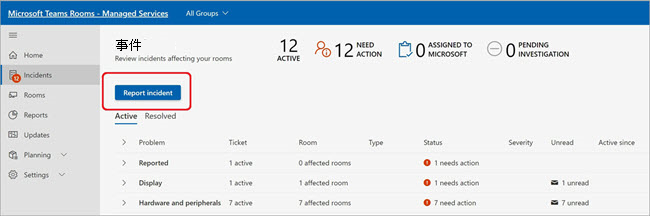
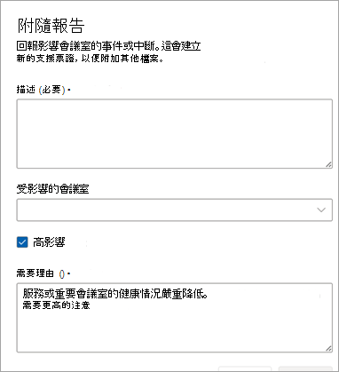
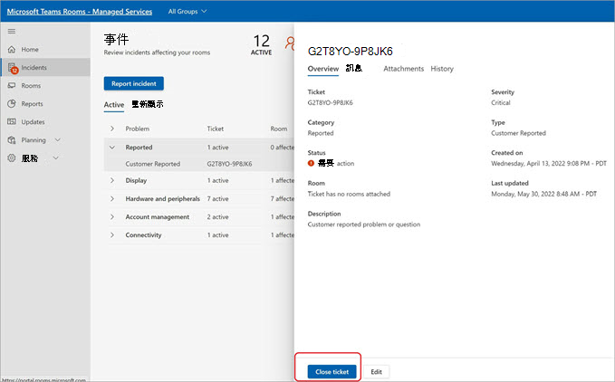
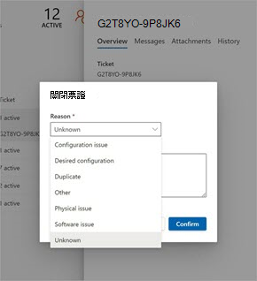
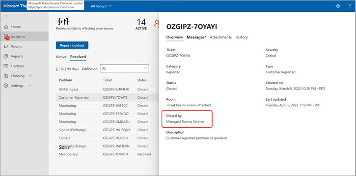

# 客戶回報的事件票證

對於任何 Microsoft 未加上標幟的事件種類，或針對服務/功能的相關問題，客戶或合作夥伴代表客戶可以使用 [報告事件] 功能來提醒 Microsoft 調查問題或回答問題。

<!---->

在 [描述] 欄位中，盡可能描述您需要 Microsoft 協助的問題。 您可以新增一或多個會議室。

<!---->

客戶回報的事件 (CRI) 被視為重要票證，這表示 MTRP 服務營運中心會先分級這些票證。   (請 [在這裡](microsoft-teams-rooms-premium.md) 查看客戶回報事件的服務描述 SLA：當會議室或會議室被選取為 CRI 的一部分時，每個聊天室都會標示為不正常，直到 CRI 關閉為止。

## 關閉客戶回報的事件票證

客戶回報的事件可以由客戶、代表客戶管理會議室的合作夥伴或 Microsoft 服務營運中心的工程師關閉。

**關閉事件**

1. 選取 **[關閉]**。
1. 從清單中選取類別，選擇要關閉的原因。

   確認關閉原因後，票證就會關閉並移至 **[已解決]**。

<!---->

<!---->

在 [票證詳細資料概觀] 區段底下，代表客戶管理會議室的客戶或合作夥伴可以查看誰關閉了票證：受管理的會議室服務 (Microsoft) 或客戶/合作夥伴的名稱。  

<!---->

## 常見問題集

**任何人都可以關閉票證嗎？**

使用者或 Microsoft 的受管理會議室服務營運中心只能關閉客戶回報的事件。 已指派合作夥伴以票證管理版權管理其會議室的客戶，將能夠關閉客戶回報的事件。

**我可以限制誰可以關閉票證嗎？**

目前不可以。 所有擁有票證管理許可權的使用者都可以關閉 CRI。

**我是否在客戶回報的事件票證關閉時收到通知？**

目前不可以。