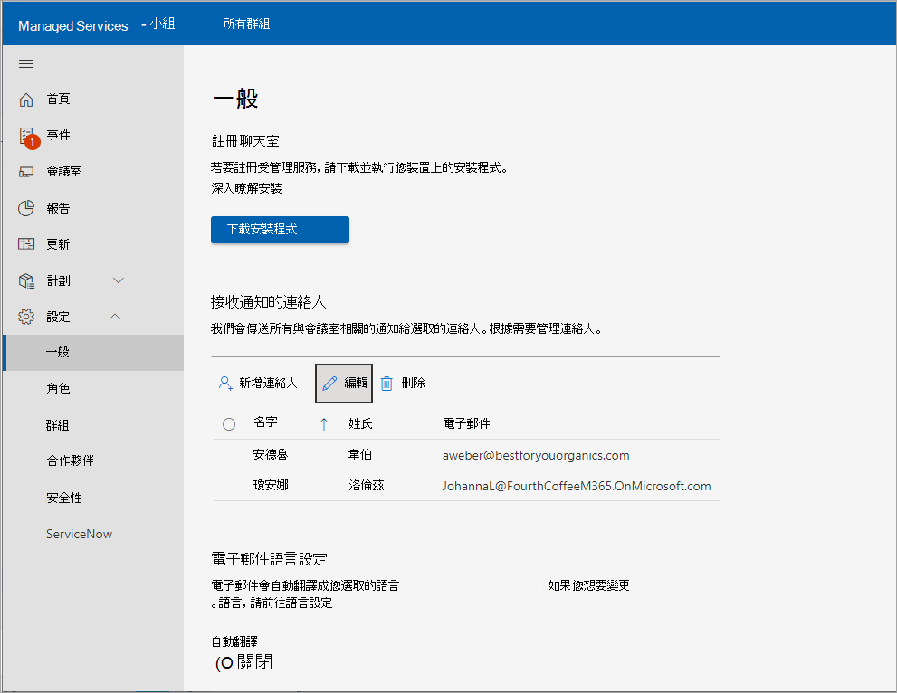

# <a name="enroll-device-into-pro-management"></a>將裝置註冊至專業管理

部署需要將Microsoft Teams 會議室裝置上線至Microsoft Teams 會議室專業版管理入口網站。 監控服務代理程式適用于經過認證的 Microsoft Teams 會議室 (MTR) 系統和周邊設備。

## <a name="prerequisites"></a>必要條件

嘗試註冊程式之前，請依照下列程式設定硬體：

### <a name="adding-proxy-settings-optional"></a>新增 Proxy 設定 (選用) 

1. 以系統管理員身分登入：以[MTR 裝置管理員使用者](#performing-operations-as-the-admin-user-of-the-mtr-device)身分執行操作。
1. 在螢幕) 左下 (的 [Windows ***Search** _] 欄位中，輸入 _ *cmd** (長按螢幕或向右選取，然後選擇 [ **_以系統管理員身_** 分執行]) 。
1. 執行下列命令 (命令結尾的雙引號很重要) ：

   - 如果使用單一 ***Proxy 伺服器***： `bitsadmin /Util /SetIEProxy LOCALSYSTEM MANUAL_PROXY <proxyserver>:<port> ""`

     *例子：*

     ```DOS
     bitsadmin /Util /SetIEProxy LOCALSYSTEM MANUAL_PROXY contosoproxy.corp.net:8080 ""
     ```

   - 如果使用 ***pac*** 檔案： `bitsadmin /Util /SetIEProxy LOCALSYSTEM AUTOSCRIPT <pac file url>`

     *例子：*

     ```DOS
     bitsadmin /Util /SetIEProxy LOCALSYSTEM AUTOSCRIPT http://contosoproxy.corp.net/proxy.pac
     ```

### <a name="enabling-tpm-settings"></a>啟用 TPM 設定

> [!NOTE]
> TPM 必須啟用才能註冊專業管理。

如果 Intel NUC 裝置上的 TPM 已停用，請在下列裝置上啟用 TPM：

1. 將鍵盤插入 NUC 裝置。
1. 重新開機裝置。
1. 若要顯示 BIOS 畫面，請快速按 **F2**。
1. 選取 [ **進階]**。
1. 選取 **[安全性]**。
1. 在 [安全性功能] 底下的右側，啟用 **Intel 平臺信任技術**。
1. 若要儲存您的設定，請按 **F10**。
1. 在確認方塊中，選取 [ **是]**。

## <a name="performing-operations-as-the-admin-user-of-the-mtr-device"></a>以 MTR 裝置管理員使用者身分執行作業

某些設定/安裝程式會要求您以系統管理員身分登入裝置。

以系統管理員身分登入裝置 (本機系統管理員) ：

1. 確定您掛斷任何進行中的通話，並返回主畫面。
1. 在 [Microsoft Teams 會議室使用者介面中，選取 [**更多**]，然後選取 [**設定**]，當系統提示您輸入裝置上的本機系統管理員密碼 (預設密碼為 **_sfb_**) 。
1. 選 **取 [設定]**，然後選取  **[Windows 設定]**  以本機系統管理員身分存取 Windows。

1. 從 Windows 登入畫面中顯示的使用者清單中  **，選取** [系統管理員 (或您裝置) 的個別本機系統管理員。

> [!NOTE]
> 如果電腦 *已加入網域*，請選擇 [ **其他使用者**]，然後使用 **.\admin**，或在裝置上設定為使用者名稱的本機系統管理員使用者名稱。

執行必要的系統管理工作之後，若要返回Microsoft Teams 會議室應用程式：

1. 從 Windows [***開始] 功能表*** 中，從管理員帳戶登出。
1. 選取畫面最左側的使用者帳戶圖示，然後選取 **Skype**，即可返回Microsoft Teams 會議室。

> [!NOTE]
> 如果未列出 Skype 使用者，請選取 [其他使用者]，然後輸入 ***.\skype*** 做為使用者名稱，然後登入。

## <a name="urls-required-for-communication"></a>通訊所需的 URL

 > [!NOTE]
 > MTR 裝置代理程式與Microsoft Teams 會議室專業版管理入口網站之間的所有網路流量都是透過埠 443 的 SSL *。*  請[參閱Office 365 URL 和 IP 位址範圍 - Microsoft 365 企業版 |Microsoft Docs](/microsoft-365/enterprise/urls-and-ip-address-ranges?view=o365-worldwide&preserve-view=true)。

如果您已在企業環境中啟用 **交通允許清單** ，則必須允許下列主機：

agent.rooms.microsoft.com<br>
global.azure-devices-provisioning.net<br>
gj3ftstorage.blob.core.windows.net<br>
mmrstgnoamiot.azure-devices.net<br>
mmrstgnoamstor.blob.core.windows.net<br>
mmrprodapaciot.azure-devices.net<br>
mmrprodapacstor.blob.core.windows.net<br>
mmrprodemeaiot.azure-devices.net<br>
mmrprodemeastor.blob.core.windows.net<br>
mmrprodnoamiot.azure-devices.net<br>
mmrprodnoamstor.blob.core.windows.net

## <a name="enrollment-process"></a>註冊程式

註冊程式涉及下列步驟：

1. 在Microsoft Teams 會議室專業版管理入口 [http://portal.rooms.microsoft.com](https://portal.rooms.microsoft.com/) 網站的左側導覽列中，展開 [**設定]**，然後選取 [**一般]**。
1. 在 *[註冊聊天室] 底* 下，選取 **[下載安裝程式**  ] 以下載監控專員軟體。
1. **選：** 設定代理程式的 Proxy 設定;請參閱 [ (選擇性) 新增 Proxy 設定](#adding-proxy-settings-optional)。
1. 安裝在 MTR 裝置上進行步驟 2) 下載的代理程式安裝程式 (，方法是在 MTR 裝置上執行 MSI，或透過將 MSI 應用程式大量發佈到環境中裝置的標準方式， (群組原則等) 
1. 會議室會在 5-10 分鐘內出現在入口網站中。

   

> [!NOTE]
> 如果您需要安裝代理程式，但 MTR 上沒有 Teams 應用程式可以登入 Teams，您可以使用我們的註冊金鑰做為選擇性程式。 移至 [？] (入口網站右上角的 [說明]) ，然後選取 [下載金鑰 (選用) ]。 安裝專員時，請將先前從入口 (網站) 下載的「自我註冊金鑰」放置在裝置的 **C：\Rigel** 目錄中。

## <a name="installation"></a>安裝

從入口網站或使用) 上方提供的 AKA.ms URL 從Microsoft (下載安裝程式之後，解壓縮其內容以存取檔案 **ManagedRoomsInstaller.msi**。

安裝模式有兩種：1) 個別的本機電腦安裝，以及 2) 大量部署模式， (通常透過Intune類似的方法) 。 我們建議針對未加入網域的電腦或您無法遠端執行 MSI 安裝程式的電腦個別安裝。

由於客戶可在大量部署模式中執行 MSI 應用程式的各種不同方式，本文只會逐步執行個別模式的安裝，以及大量安裝在Intune註冊的裝置上。

### <a name="individual-device-installation"></a>個別裝置安裝

1. 以系統管理員身分登入裝置。 請確定已遵循 *以裝置管理員使用者身分執行作業* 的步驟。

1. 將檔案 **ManagedRoomsInstaller.msi** 複製到 MTR 裝置。

   執行 ***ManagedRoomsInstaller.msi*** 為授權合約畫面。

1. 閱讀合約後，核取 ***我接受授權合約中的條款** _，然後按 _*Install**。

    這會開始Microsoft Teams 會議室專業版監視軟體安裝。 系統會顯示提高許可權 (以系統管理員) 的身分執行的提示。

1. 選取 **[是]**。

    安裝將會繼續。 在安裝程式期間，主機視窗會開啟並開始Microsoft Teams 會議室專業版監視軟體安裝的最後一個階段。

    > [!NOTE]
    > 請勿關閉視窗。 安裝完成後，精靈會顯示「完成」按鈕。

### <a name="intune-enrolled-device-bulk-deployment"></a>Intune註冊的裝置大量部署

下列元件是成功安裝的先決條件： 

- **Intune註冊**：Windows 裝置上的Teams 會議室必須已經在 Intune 註冊。
  如需如何在 Intune 的 Windows 裝置上註冊Teams 會議室的詳細資訊，請參閱使用[Microsoft Endpoint Manager 在 Windows 裝置上註冊Microsoft Teams 會議室 - Microsoft Tech Community](https://techcommunity.microsoft.com/t5/intune-customer-success/enrolling-microsoft-teams-rooms-on-windows-devices-with/ba-p/3246986)
- **包含 Windows 裝置上所有Teams 會議室成員的 Azure AD 群組**– 在 Azure AD 中建立的群組，其中包含應為Microsoft Teams 會議室進階版服務一部分的 Windows 裝置上的所有Teams 會議室。 這個群組將用來定位 MTR Pro 代理程式的部署。
  
> [!NOTE]
> 您可以考慮將 Azure AD 中的動態群組用於此用途，如需詳細資訊，請參閱使用[Microsoft Endpoint Manager 在 Windows 裝置上註冊Microsoft Teams 會議室 - Microsoft Tech Community](https://techcommunity.microsoft.com/t5/intune-customer-success/enrolling-microsoft-teams-rooms-on-windows-devices-with/ba-p/3246986)
- **下載 MTR Pro 代理****程式安裝程式**- 從 <https://aka.ms/serviceportalagentmsi> 中下載專員的 zip 檔案，並將 zip (ManagedRoomsInstaller.msi) 的內容擷取到本機暫存資料夾。

**使用 Intune 安裝**

1. 登入[Microsoft端點管理員系統管理中心](https://go.microsoft.com/fwlink/?linkid=2109431)。
1. 選 **取 [應用程式**  >  **所有應用程式**  >  **新增]**。
1. 在 [ **選取應用程式類型** ] 窗格的 [ **其他** 應用程式類型] 底下，選取 **[企業營運應用程式]**。
1. 按一下 **[選取]**。 隨即顯示 **[新增應用程式** ] 步驟。 
1. 在 [ **新增應用程式** ] 窗格中，按一下 **[選取應用程式套件檔案]**。
   1. 在 **[應用程式套件檔案** ] 窗格中，選取 [  **流覽]**。 然後，選取先前下載 **的ManagedRoomsInstaller.msi** 檔案， (參閱) 的先決條件一節。
   1. 完成後，請在 **[應用程式套件檔案**] 窗格中選取 [**確定**] 以新增應用程式。
1. 在 **[應用程式資訊** ] 頁面中，執行下列變更：
   1. Publisher：輸入 **Microsoft Corporation**。
   1. 忽略應用程式版本：選取 **[是]**。

      > [!NOTE]
      > MTR Pro 代理程式正在自我更新;，您應該明確忽略應用程式版本 (任何比較基準版本都可以自動更新) 。

   1.  (選用) 類別：選取 **[電腦管理]**。
   
1. 按一下 **[下一步** ] 以顯示 [ **作業]** 頁面。
   1. 在 [ **必要** ] 區段底下，按一下 **[+ 新增群組** ]，以某一組裝置為目標以安裝專員。
   1. 在 [ **選取群組** ] 窗格的 [搜尋] 方塊中輸入組名 (參照上方的先決條件) ，然後按一下所要的 **群組** ，然後按一下 [ **選取]**。
      如需詳細資訊，請參閱[新增群組來組織使用者和裝置](https://go.microsoft.com/fwlink/?linkid=2202166)，以及[將應用程式指派給Microsoft Intune群組](https://go.microsoft.com/fwlink/?linkid=2202270)。
1. 按一下 **[下一步** ] 以顯示 [ **校閱 + 建立]** 頁面。
1. 檢閱您為應用程式輸入的值和設定。 完成後，請按一下 [**建立**]，將應用程式新增至Intune。

完成程式後，您的裝置將會在幾分鐘後開始安裝 MTR Pro 代理程式。

> [!NOTE]
> 安裝之後，MTR Pro 代理程式最多可能需要八小時來執行最新版本的自我更新，並出現在 MTR Pro 入口網站中。
若要加快 MTR Pro 入口網站中的自動註冊，請考慮依照代理程式部署重新開機 MTR 裝置。

## <a name="completing-enrollment"></a>完成註冊

安裝完成後，請等候 5-10 分鐘，然後重新整理入口網站以在清單中檢視裝置， *回報為上* 線狀態。

在 *上線* 狀態下，系統會顯示並更新聊天室的狀態，但不會提出任何警示或建立調查票證。

選擇會議室，然後選 **取 [註冊**  ] 以開始接收事件警示。

### <a name="unenrolling-and-uninstalling-monitoring-software"></a>取消註冊和卸載監視軟體

若要取消註冊裝置，請從 MTR 裝置移除監視代理程式，如下所示：

1. 在受到監視的裝置上，以系統管理員身分登入裝置。 請務必依照 *以裝置管理員使用者身分執行操作中的* 步驟進行。
1. 從 [aka.ms/MTRPDeviceOffBoarding](https://aka.ms/MTRPDeviceOffBoarding)下載重設腳本。
1. 擷取裝置上某處的腳本，然後複製路徑。
1. 以系統管理員身分開啟 PowerShell：在螢幕) 左下 (的 [Windows ***Search** _] 欄位中，輸入 「Powershell」，然後以滑鼠右鍵按一下 _*_Windows PowerShell_**。
1. 選取 *[以系統管理員身分執行]* 並接受 UAC 提示。
1. 輸入 *Set-ExecutionPolicy –ExecutionPolicy RemoteSigned* ，然後在下一個提示按 **Y** 。
1. 將解壓縮的登出腳本的完整路徑貼上或輸入到 PowerShell 視窗，然後按 **Enter**。

   範例：

   ```powershell
   C:\Users\admin\Downloads\MTRP\_Device\_Offboarding\MTRP\_Device\_Offboarding.ps1
   ```

   此命令會將裝置重設為使用者標準 MTR 更新，並移除 MTR Pro 監控代理程式和檔案。

1. 從 [Microsoft Teams 會議室專業版管理] 入口網站的左側功能表中，選取 [**會議室]**。
1. 在提供的聊天室清單中，選擇您要取消註冊的聊天室，然後選取 [ **取消註冊** ] 以停止取得事件警示或調查票證，或是回報該聊天室的事件。

## <a name="troubleshooting-table"></a>疑難排解表格

> [!NOTE]
> 所有Microsoft Teams 會議室專業版監控錯誤都會記錄在Microsoft **受管理會議室** 的特定事件記錄檔上。

***應用程式執行時間記錄檔位置*** =

C：\Windows\ServiceProfiles\LocalService\AppData\Local\ServicePortalAgent\ app-x.x.x\ServicePortalAgent\ServicePortal \_ LogFile.log \_ ，其中 **x.x.x** 是應用程式版本號碼。

|症狀|建議的程式|
|---|---|
|您收到錯誤訊息，指出： </p><p> ***錯誤：請使用_ 執行此應用程式** <br> _ *_elevated privileges_**|以向上呈報的許可權執行應用程式，然後再試一次。|
|||
|您收到錯誤訊息，指出： </p><p> ***找不到 TPM 資料***|確定您的裝置在 BIOS 中已開啟 TPM (信賴平臺模組) 。 這通常會在裝置 BIOS 的安全性設定中找到。|
|||
|您收到錯誤訊息： </p><p> ***錯誤：找不到名為「管理員」或「Skype」的本機使用者帳戶***|確定使用者帳戶存在於經過認證的 Microsoft Teams 會議室系統裝置上。|
|||
|您會收到上述未涵蓋的任何錯誤狀態訊息。|請將安裝記錄檔的複本提供給Microsoft Teams 系統支援專員。|
