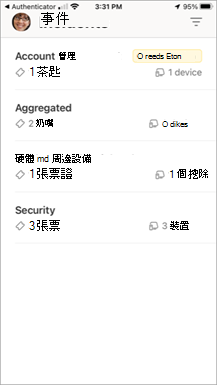
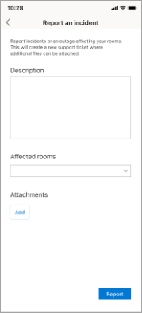
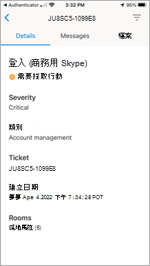
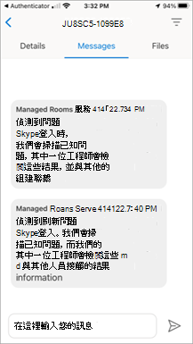
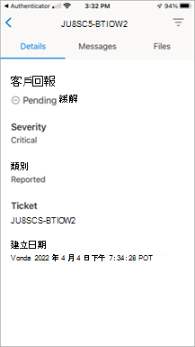
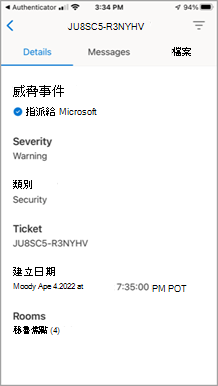
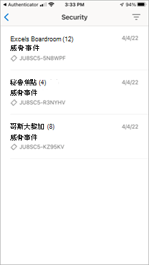
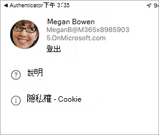

# Teams 會議室行動用戶端應用程式功能

有時候您可能需要從行動裝置管理Teams 會議室受管理的服務 (MTMS) 。 行動裝置應用程式有許多功能可供您從行動裝置或平板電腦裝置管理。
## 開始之前

您必須是 Microsoft 365 組織中的系統管理員，才能使用Teams 會議室行動裝置 App。
從 Apple App Store 或[Google Play 商店](https://play.google.com/store/search?q=Microsoft%20Teams%20Rooms&c=apps)下載[Teams 會議室](https://apps.apple.com/app/apple-store/id761397963?pt=80423&ct=docsaboutadminapp&mt=8)行動裝置 App。

行動用戶端提供在貴組織內建立票證和管理事件功能。

## 後續步驟

**若要取得 MTMS 行動應用程式**

1. 在應用程式商店中搜尋Teams 會議室受管理的服務，並安裝它。
2. 使用您的全域系統管理員電子郵件地址登入，並檢視儀表板以查看服務健康情況、監控使用者授權，以及查看訊息和服務要求。

**若要使用Teams 會議室行動裝置 App**

1. 從[Apple App Store]()或[Google Play 商店]()下載應用程式。
1. 確定您有有效的 Microsoft 365 訂閱。
1. 使用您用來存取Teams 會議室桌面應用程式的工作認證。

## 管理事件

以下是您在行動應用程式上管理事件的一些功能。

- 接收新事件的推播通知。
- 點選通知，立即開啟並檢視事件詳細資料。
- 列出所有作用中和已解決的事件，包括郵件上的已讀取和未讀取狀態。
- 以票證資訊檢視基本事件詳細資料，包括訊息。
- 檢視票證附件和檔案。
- 從使用者面板登出 (登出) 會停用通知/訊息。

[事件] 頁面會顯示開啟的事件種類。

### 報告事件

### 依類別檢視事件

![顯示 MTMS 行動應用程式 [會議室問題] 畫面的螢幕擷取畫面。](../media/mtms-extended-app-001.png)

### 管理票證
以下是您在行動裝置 App 上管理票證的一些功能。

- 認可事件 (標示為已讀) 。
- 讀取、張貼及回復票證上的訊息。
- 切換至深色模式。
- 新增附件 (擷取並上傳圖片) 。
- 建立票證以報告事件。
- 使用 Microsoft Defender 管理安全性與與專家通訊

應用程式會在個別的索引標籤下顯示票證詳細資料、訊息和檔案。

<!--

### Sign out

-->

## 疑難排解

您可以嘗試一些常見的行動裝置 App 疑難排解步驟：
- 關閉並重新開啟應用程式。
- 卸載並重新安裝應用程式。 確定您使用的是最新版本的應用程式。
- 如果您的裝置上已安裝 Microsoft Authenticator 或公司入口網站應用程式，請嘗試重新安裝或更新為最新版本。 如果還是沒有用，您可以在 feedback365@microsoft.com 傳送電子郵件給我們，讓我們知道。
