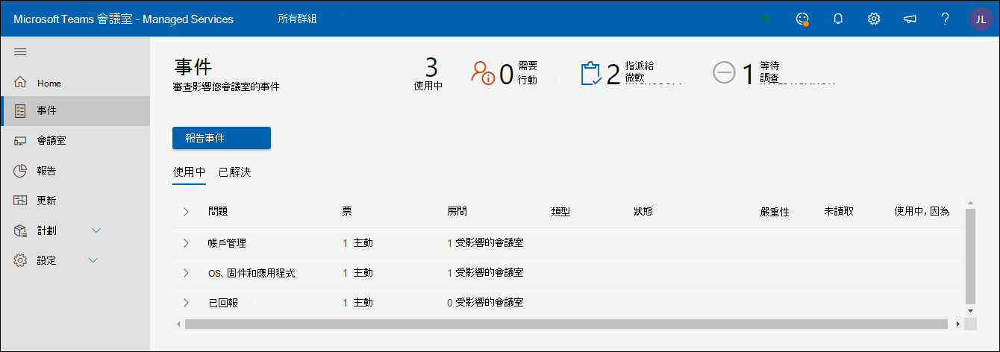
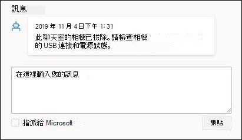
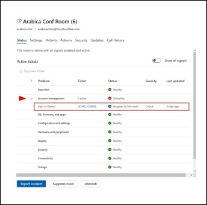
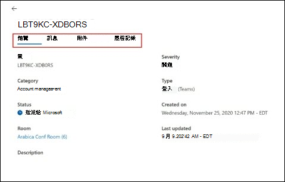
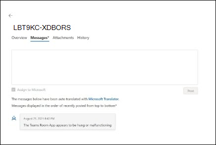
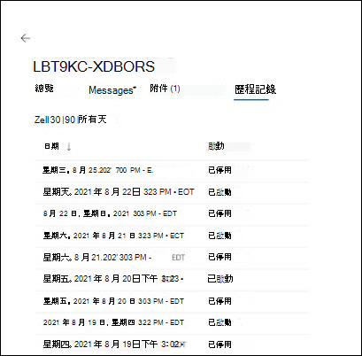

# Microsoft 受管理的會議室入口網站

## 概觀

受管理的會議室入口網站 (「會議室入口網站」) 提供會議室健康情況的檢視。 此入口網站的客戶檢視適用于您的可見度和意見反應，並協助您現有的監控工具/做法。

監視的範圍為

- 事件檢視
  - 影響會議室的主要問題
  - 將會議室還原為健康狀態所需的動作
  - Microsoft 正在調查的問題
- Microsoft Teams 會議室裝置的檢視
  - Microsoft Teams 會議室 (MTR) 裝置層級狀態的快照
  - 每個裝置的基本歷程記錄和詳細資料

**Microsoft Teams 會議室裝置的檢視**

- Microsoft Teams 會議室 (MTR) 裝置層級狀態的快照
- 每個裝置的基本歷程記錄和詳細資料

> [!Important]
> 檢閱 [**指派使用者給受管理的服務系統管理員角色**](enrolling-mtrp-managed-service.md#assign-users-to-the-managed-service-administrator-role) ，並確定入口網站的存取權因您的業務需求而有所限制。

## 術語

以下是入口網站中常用的字詞。

|字詞 |意義 |
| :- | :- |
|**監視軟體** |部署在每個 Microsoft Teams 會議室裝置上的監視專員。 |
|**應用程式** |Microsoft Teams Room system 應用程式 (，不論是使用 商務用 Skype 或 Microsoft Teams 做為共同作業服務。 |
|**會議室/裝置** |已認證的 Microsoft Teams 會議室系統裝置。 |
|**未受監視** | 當做受管理服務一部分部署的 Microsoft 監視軟體無法連線至雲端服務。 我們無法收到裝置的遙測。 |
|
**健康 /** 

**不良** 
|裝置/周邊設備出現異常。 |
|**抑制** |如果已知裝置正在維護中，而其警示應被忽略，則可以刻意隱藏裝置。 |
|**上線** |會議室裝置在進行設定時的狀態已新增，但尚未準備就緒，成為定期支援的會議室。 |
|**事件** |影響需要採取行動之使用者的會議體驗的問題。 |
|**設定錯誤** |偵測到的設定不正確/常用。 |
|**支援票證** |追蹤事件所有通訊/動作的 Microsoft 內部追蹤識別碼。 |

## 事件檢視

此檢視是受管理會議室入口網站中 [事件] 索引標籤的概觀。 此頁面是入口網站的預設首頁。

### 頂層摘要 
頂層摘要會一目了然地顯示影響會議室的問題、您需要執行的動作，以及 Microsoft 正在執行哪些相關動作：

|# |解釋 |
| :- | :- |
|1 |影響會議室的事件種類 |
|2 |**需要採取動作**：需要您介入才能解決的專案。 |
|3 |**指派給 MICROSOFT**：Microsoft 人員目前調查的專案。 |
|4 |**待調查**：Microsoft 人員要調查佇列中的專案。 |

事件預期會處於下列三種狀態的其中之一：

- **需要採取動作**：指派給您以執行動作
- **指派給 Microsoft**：指派給 Microsoft 以進行下一個動作
- **待調查**：正在調查後續步驟

### 檢閱事件

下圖列出目前在聊天室中的所有事件。 指派給您的專案位於 *最上方* ，以下是您需要查看的後續步驟。 此外，指派給 Microsoft 或待調查人員的詳細資料可讓您用來進行待處理。

按一下任何狀態為「**需要採取動作**」的專案，會顯示該事件的其他詳細資料。

## 事件種類

事件分為兩種廣泛的嚴重性類型：

- **重要**：可能導致會議發生問題的事件，應優先處理。
- **警告** – 事件是規劃維護動作的通知。 如果未處理這些專案，則經過一段時間後，會議室就比較容易發生問題。 警告的目的是要讓您有時間規劃及協調支援。

如果有一段時間沒有出席，警告可能會轉換為「**重要**」。

## 裝置和事件的健康情況狀態

嚴重性歸類為 **「重要」** 的事件會影響裝置的健康狀態。 如果至少有一個與裝置相關聯 **的嚴重性 = 「Important」** 的事件，則會將其分類為 **_不正常的_** 裝置。

分類為 **「警告」** 嚴重性的事件不會影響裝置上回報的健康情況狀態。 不過，如果裝置有與其相關聯的警告層級事件，則會如下所示顯示裝置的健康情況狀態。

以下是您可能會看到的一些事件種類，以及每種類型的說明。 針對每種類型，與事件相關聯的動作會根據問題而更加具體。

**資料表 1：具有「重要」嚴重性的事件**

|類型 |解釋 |
| :- | :- |
|**顯示器** |連接到裝置的顯示器看起來並不健康。|
|**會議麥克風，會議喇叭** |音訊裝置 (麥克風/喇叭) 設定錯誤。 |
|**相機** |連接到裝置的相機看起來並不健康。 |
|**HDMI Ingest** |HDMI Ingest 不健康。 |
|Exchange **)  (** 登入 |Microsoft Teams 會議室應用程式會存取 Exchange 的行事曆資訊，登入成功的任何問題都會以登入事件回報。 |
|**Teams**)  (登入 |Microsoft Teams Room 應用程式登入裝置，如果客戶使用 Teams) ，此事件 (會回報無法登入。 |
|**登入** (商務用 Skype)  |Microsoft Teams Room 應用程式登入裝置，如果客戶使用商務用 Skype) ，此事件 (會回報無法登入商務用 Skype)  |
|**近接感應器** |Microsoft Teams 會議室應用程式會邀請出席者在鄰近時加入會議。 此功能失敗將回報在此事件之下。 |

**資料表 2：具有「警告」嚴重性的事件**

|類型 |解釋 |
| :- | :- |
|**應用程式版本** |裝置上執行的 Microsoft Teams 會議室應用程式版本不是最新版本。 使用者遇到問題的已知原因就是版本過舊。 |
|**作業系統版本** |不再建議在會議室中執行的 Windows 作業系統版本。 |
|**網路** |由於評估後需要進行其他工作，這將會在短期內以警告類型的方式移除。 |

## 回應事件

事件分為三種類別：需要採取行動、待處理調查或指派給 Microsoft。

### 「需要採取動作」事件

將狀態設為 **[需要採取動作** ] 的事件會指派給您以採取矯正動作。

每一個這類事件都會有一個包含 Microsoft 建議之動作的動作欄位，如下所示：

- 如果您已採取動作，您可以在 [回應] 方塊中使用附注來回應事件，然後在張貼之前選擇 [指派給 Microsoft]。
- 此外，根據您的檢閱，通知可能不正確。 在這種情況下，請提供該意見反應並指派回 Microsoft。
- 最後，如果您想要新增批註，為您自己的小組或 Microsoft 小組提供其他內容，請張貼訊息，而不要開啟「指派給 Microsoft」。

>[!NOTE]
>您的矯正動作或許可以解決問題，而受管理的會議室監控會從清單中清除該事件。 在上述情況下，您可能沒有機會解決問題並將它指派回 Microsoft。 這個問題將在未來的版本中解決。

### 「待調查」事件

針對正在調查的事件，描述欄位會包含事件的相關資訊、一般原因，以及解決特定問題可能很實用的解決方案，讓您可以立即採取行動。

### 「已指派給 Microsoft」事件

針對指派給 Microsoft 的事件，[動作] 欄位會包含有關已規劃或進度之矯正步驟的簡短詳細資料。 這些步驟可能需要與您的小組共同作業，而延伸的共同作業將視需要透過電子郵件/通話來完成。 一旦這些問題獲得解決，這些問題將會從入口網站中消失，未來還會有追蹤這類事件及其解決方式的歷程記錄。

## 會議室檢視

每個裝置都是房間及其連接周邊裝置的 Proxy。 健康裝置代表健康房間，而不正常的裝置代表會議室可能在會議期間造成問題。 除了 [事件] 檢視之外，受管理的會議室入口網站也提供會議室健康情況概觀，並協助您疑難排解裝置詳細資料，以及瞭解事件歷程記錄重複失敗。

**健康、不健康、中斷連線** [會議室] 檢視的頂端面板可快速快照顯示有多少裝置處於良好狀態， (「健康」) 、有多少部裝置受到「不健康」)  (問題的影響、有多少部裝置未提供遙測 (「已中斷連線」) ，以及有多少部裝置因覆寫 (而隱藏為覆寫) 。 會議室會使用不斷演進的準則和語言來監控會議室的健康情況。 目標是要盡可能準確地反映會議室中使用者體驗的實際情況，並使其可採取動作。

**健康/不正常的會議室**：

沒有任何嚴重性「重要」事件的裝置/周邊設備符合目前的健康準則，並標示為健康情況。 不過，這並不表示入口網站中每個不正常的裝置都有空間中斷。 事件的描述和動作部分包含關於問題的更具體詳細資料，以及可能影響使用者體驗的詳細資料。

**已中斷連線的裝置：**

在受管理會議室試驗中部署的 Microsoft 監視專員與受管理會議室雲端服務中斷連線。 我們未收到會議室的遙測，也沒有最新的健康情況狀態。 這可能是因為網路問題、防火牆原則變更或裝置映射有變更所導致。

## 會議室詳細資料：狀態和變更

**會議室詳細資料：狀態** [裝置 *狀態]* 索引標籤提供裝置狀態的合併檢視、裝置使用中的所有問題、解決問題所需的動作，或進行中的動作。 [狀態] 索引標籤也包含 [事件] 索引卷 *標* 下之裝置健康情況不同元件的明細。如果裝置中斷連線，將無法使用狀態詳細資料。

**顯示所有訊號：** 若要檢視訊號類別中包含的所有訊號，請啟用 [顯示所有訊號] 切換按鈕。 展開箭號會顯示在可按一下以展開手風手道檢視的類別標題旁邊。

**隱藏/取消壓縮票證** 註冊聊天室時，您會指出您想要收到會議室遙測變更的通知。 在某些情況下，特定裝置或周邊裝置處於已知狀態，而您不希望產生票證或通知。 使用隱藏票證功能，會將任何有關該特定訊號的通知設為靜音。 當您準備好要讓服務監控並通知您訊號時，只要取消壓縮個別訊號即可。

**活動票證類別展開** 在每個票證類別底下，任何作用中或最新解決的票證都會隨著嚴重性以及上次更新票證的時間一併顯示。 按一下展開箭號，所有票證都會顯示為有效的票證資訊連結。

使用中票證類別擴充：在每個票證類別下，任何使用中或最新解決的票證都會隨著嚴重性以及上次更新票證的時間一併顯示。 按一下展開箭號，所有票證都會顯示為有效的票證資訊連結。

## 活動票證：概觀

每個建立的事件都會識別已偵測到的問題，以及需要採取的矯正措施，以將會議室還原為健康狀態。 產生的票證會傳達事件概觀，其中包含由受管理服務 AI 以及調查此問題的 Microsoft 服務工程小組所產生的任何訊息。 系統會列出已針對事件疑難排解收集的所有附件。 [歷程記錄] 索引標籤會提供已識別問題的日期。

活動票證：訊息：訊息 UI 是主要通訊工具，可與正在修復所識別問題的 Microsoft 服務工程師互動。 請務必確認 Microsoft 的通訊，以確保我們為您提供最佳的可能服務。 如果您已採取建議的動作，請在 [回應] 方塊中使用您的記事來回應此事件，並在張貼之前按一下 [指派給 Microsoft] 將它指派回 Microsoft。
此外，根據您的檢閱，通知可能不正確。 在這種情況下，請提供該意見反應並指派回 Microsoft。
最後，如果您想要新增批註，為您自己的小組或 Microsoft 小組提供其他內容，只要張貼訊息而不開啟「指派給 Microsoft」

活動票證：附件 Microsoft 服務工程師有時需要額外的資訊，才能加強其對問題的調查。 [附件] 索引標籤可讓您上傳要求的圖片、影片或記錄檔。

使用中票證：歷程記錄 每個會議室訊號只有一個票證編號會根據用途指派給該號碼。 會議室裝置或周邊設備會保留在會議室中，且隨著時間可能會發生問題。 藉由在特定的唯一票證識別碼下維護此資訊，會保留所有歷史資訊，並可分析其行為模式。 歷程記錄 UI 提供針對此訊號所建立和解決之所有票證動作的檢視。

常見問題動態票證會如何影響我和會議室的運作？  
客戶將會看到智慧型票證的建立，以及除了二進位訊號票證之外的補救。 例如，會議室 (顯示器 1、顯示鍵 2 & MTR 觸控面板顯示器) ，可以多達三個顯示器。 不過，只有 1 (一個) 健康或不健康顯示訊號。 有了新的動態票證，我們現在可以產生每個顯示訊號唯一的票證。
