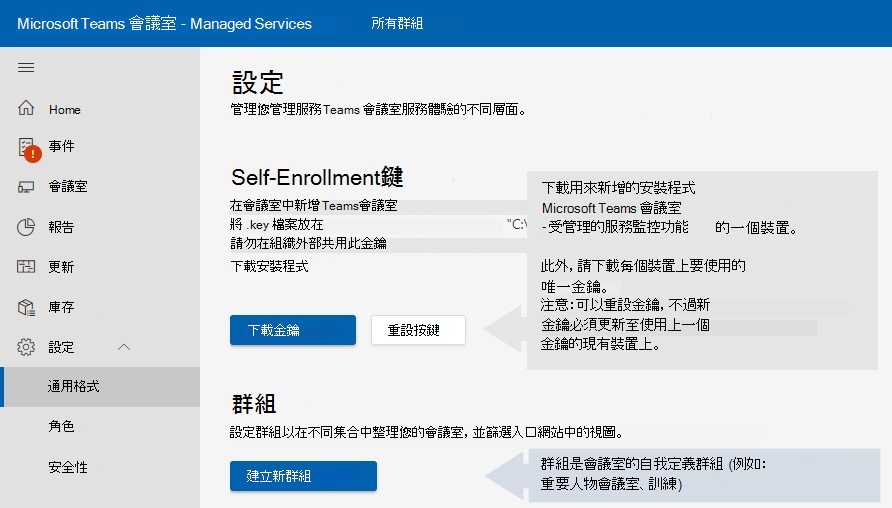

# 監控裝置軟體安裝

部署需要將Microsoft Teams 會議室裝置上Microsoft Teams 會議室受管理的服務。 監控服務代理程式適用于經認證的 ROOM Microsoft Teams ROOM (或) 及周邊設備。

## 以一名管理使用者執行一些操作

某些組組/安裝程式會要求您以系統管理員的登入方式登入裝置。

若要以系統管理員或系統管理員 (登入) ：

1. 確保您掛斷任何進行中的通話，並返回主畫面。
1. 在 Microsoft Teams 聊天室使用者介面中，選取更多，然後選取 **設定**，系統會提示您輸入裝置上的本地系統管理員密碼 (預設密碼為 **_sfb_**) 。
1. 選取 **設定**，然後選取 **Windows 設定** 以Windows管理員的存取許可權。  

1. 從登入畫面中顯示的使用者Windows，選取 (或裝置各自的本地系統管理員) 。

> [!NOTE]
> 如果電腦已 *加入網* 域，請選擇 **其他使用者**，然後使用 **.\admin，** 或裝置中已配置的當地系統管理員使用者名稱做為使用者名稱。  

執行必要的系統管理工作Microsoft Teams返回會議室應用程式：

1. 從 ***Windows[開始] 功能表***，從系統管理帳戶登出。
1. 選取Microsoft Teams最左側的使用者帳戶圖示，然後選取 **Skype。**

> [!NOTE]
> 如果未Skype使用者，請選取其他使用者，然後輸入 ***.\skype*** 做為使用者名稱，然後登錄。

## 必要條件

在嘗試註冊程式之前，請遵循下列程式來設定硬體：

### 新增 Proxy 設定 (選) 

1. 以系統管理員的管理員使用者執行操作來 [登入](#performing-operations-as-the-admin-user-of-the-mtr-device)。
1. 在 Windows ***** Search _ field (螢幕) 左下區段，輸入 _ *Cmd** (長按螢幕或向右選取，然後選擇執行為系統管理員) 。 ****  
1. 在命令結尾 (雙引號執行下列命令，) ：
   - 如果使用單 Proxy ***伺服器***：bitsadmin /Util /SetIEProxy LOCALSYSTEM MANUAL \_ PROXY ： <proxyserver> <port> ""

      *範例：bitsadmin* /Util /SetIEProxy LOCALSYSTEM MANUAL PROXY contosoproxy.corp.net:8080 \_ ""
      

   - 如果使用 ***pac*** 檔案：bitsadmin /Util /SetIEProxy LOCALSYSTEM AUTOSCRIPT <pac file url> ""

      
      *範例：bitsadmin* /Util /SetIEProxy LOCALSYSTEM AUTOSCRIPT `http://contosoproxy.corp.net/proxy.pac` ""
      

### 啟用 TPM 設定

如果 Intel NUC 裝置上的 TPM 已停用，請于這些裝置上啟用 TPM，如下所示：  

1. 將鍵盤插入 NUC 裝置。  
1. 重新開機裝置。  
1. 若要顯示BIOS 畫面，請快速按 **F2。**  
1. 選取 **進位**。  
1. 選取 **安全性**。  
1. 在安全性功能下方的右側，啟用 **Intel Platform Trust 技術**。  
1. 若要儲存您的設定，請按 **F10。**  
1. 在確認方塊中 **，選取** 是 。  

## 通訊所需的 URL

 > [!NOTE]
 > 在一個服務服務入口網站中，第 443 個埠上的 SSL 是一種由三Microsoft Teams 會議室管理服務服務入口網站之間的所有網路流量 *。*  請參閱[Office 365 URL 和 IP 位址範圍 - Microsoft 365 企業版 |Microsoft Docs](/microsoft-365/enterprise/urls-and-ip-address-ranges?view=o365-worldwide&preserve-view=true)。

如果您的企業環境中已啟用流量允許清單，則必須允許下列主機：

agent.rooms.microsoft.com 
global.azure-devices-provisioning.net 
gj3ftstorage.blob.core.windows.net 
iothubsgagwt5wgvwg6.azure-devices.net 
blobssgagwt5wgvwg6.blob.core.windows.net 
mmrstgnoamiot.azure-devices.net 
mmrstgnoamstor.blob.core.windows.net 
mmrprodapaciot.azure-devices.net 
mmrprodapacstor.blob.core.windows.net 
mmrprodemeaiot.azure-devices.net 
mmrprodemeastor.blob.core.windows.net 
mmrprodnoamiot.azure-devices.net 
mmrprodnoamstor.blob.core.windows.net

## 流程圖

註冊套裝程式含幾個步驟：  

1. 在管理服務入口網站左側導Microsoft Teams 會議室 [http://portal.rooms.microsoft.com](https://portal.rooms.microsoft.com/) 欄上，展開 設定並選取 **一****般**。  
1. 在 *自動註冊金鑰下*， **選取下載安裝程式** 超連結 https://aka.ms/serviceportalagentmsi 以下載監控代理程式軟體。
1. 選取 **下載金鑰**。 將金鑰檔案放在您註冊的每個裝置上的 **C：\Rigel** 資料夾下。  
1. **選：** 設定代理人的 Proxy 設定;請參閱 [新增 Proxy 設定 (或) 。](#adding-proxy-settings-optional)
1.  (安裝在步驟 2) 中下載的代理程式安裝程式，方法可以是在一台國道裝置上執行 MSI，或是透過一般方式將 MSI 應用程式發佈至您環境內的裝置 (Group-Policy 等)   
1. 會議室在 5-10 分鐘內會出現在入口網站中。 如果沒有，請 managedroomsupport@microsoft.com。  

## 安裝

從 Microsoft 下載安裝程式 (從入口網站或使用上述 AKA.ms URL) ，解壓縮其內容以存取 **ManagedRoomsInstaller.msi。**

有兩種安裝模式：個別本機電腦安裝與大量部署模式 (通常透過類似方法的群組原則) 。 我們建議您針對非網域連接的電腦或無法遠端執行 MSI 安裝程式的電腦個別安裝。  

由於客戶可在大量部署模式中執行 MSI 應用程式的方式很多，本檔只會在個別模式中進行安裝。  

 > [!NOTE]
 > 無論執行什麼模式，安裝程式流程都是一樣的。 唯一的微差異在於安裝不會要求使用者在大量部署模式中按下一個和關閉按鈕。  

## 個別裝置 &mdash; 網域加入的演練

1. 以系統管理員方式登入裝置 – 確保以裝置系統管理員使用者執行 *操作的步驟。*

1. 將下列檔案複製到第三次檢查裝置：

   - 將先前從入口網站下載的 (註冊金鑰) 至 **裝置 C：\Rigel** 目錄。
   - 將 **ManagedRoomsInstaller.msi(** 入口網站或網站下載的 AKA.MS) 複製到裝置。

1. 執行 ***** ManagedRoomsInstaller.msi_時，會看到授權合約畫面。 閱讀協定之後，請檢查 _*_我接受_*_ 授權合約中的條款，然後按 _ *Install** 按鈕。  

    這會開始Microsoft Teams 會議室管理服務監視軟體安裝。 系統會顯示以系統管理員 (時) 標的提示。
 1. 選取 ***是***。

    安裝會繼續。 在安裝程式期間，主機視窗會開啟，並開始進行Microsoft Teams 會議室管理服務監視軟體安裝。  

    > [!NOTE]
    > 請勿關閉視窗。 安裝完成後，精靈會顯示「完成」按鈕。

## 完成註冊

安裝完成後，請稍候 5-10 分鐘，然後重新更新入口網站，且裝置將會列出，並報告為 *上機* 狀態。

在 *上線* 狀態中，會顯示並更新聊天室的狀態，但不會引發任何通知或建立調查票證。

選擇會議室， **然後選取註冊**  以開始取得事件通知、調查票證，或報告事件。

對於任何問題，請在入口網站中開啟客戶報告的事件，或 managedroomsupport@microsoft.com。

### 取消註冊和卸載監視軟體

若要取消註冊裝置，請從一台監控裝置移除監控代理程式，如下所示：

1. 在受監視的裝置上，以系統管理員的名次登入裝置。 請務必遵循以裝置系統管理員使用者執行作業 *中的步驟*。
1. 從 aka.ms/MTRPDeviceOffBoarding 下載[重設 aka.ms/MTRPDeviceOffBoarding。](https://aka.ms/MTRPDeviceOffBoarding)
1. 在裝置上的某處解壓縮腳本並複製路徑。
1. 以系統管理員的Windows開啟 PowerShell：在 Windows ***Search** _ 欄位 (畫面左下區段) 輸入 [Powershell」，然後以滑鼠右鍵按一下 __*_ Windows PowerShell **。
1. 選取 *「以系統管理員執行」* 並接受 UAC 提示。
1. 輸入 *Set-ExecutionPolicy -ExecutionPolicy RemoteSigned，* 然後在下一個提示時按 **Y。**  
1. 在 PowerShell 視窗中貼上或輸入解壓縮的登出腳本的完整路徑，然後按 **Enter。**

   例如：

   *C：\Users\admin\Downloads \_ \_ \_ \_Offboarding.ps1\*  

   這會將裝置重設為使用者標準的一次技術更新，並移除了一些MTRP 監控代理程式與檔案。

1. 從管理服務入口網站左側功能表Microsoft Teams 會議室，**選取會議室**。  
1. 在提供的會議室清單中，選擇您想要取消註冊的聊天室，然後選取取消 **註冊** 以停止取得事件通知或調查票證，或針對會議室報告事件。

## 疑難排解表格

> [!NOTE]
> 所有Microsoft Teams 會議室 – Managed Services 監控錯誤會記錄在名為 Microsoft Managed **Rooms 的特定事件記錄檔案中**。 

### ***應用程式執行時間記錄檔案位置*** =  

C：\Windows\ServiceProfiles\LocalService\AppData\Local\ServicePortalAgent\ app-x.x.x\ServicePortalAgent\ServicePortal \_ Verbose \_ LogFile.log，其中 **x.x.x** 是應用程式版本號碼。

|**症狀**  |**建議的程式**  |
| :- | :- |
|
您收到錯誤訊息，指出   

***錯誤：請使用** _ 執行此應用程式 

_ *_提升許可權_**  
|以升級的許可權執行應用程式，然後再試一次  |
|  |  |
|
您收到錯誤訊息，指出   

***找不到 TPM 資料***  
|請確保您的裝置已在其BIOS 中 (TPM) 平臺模組。 這通常可以在裝置BIOS的安全性設定中找到  |
|  |  |
|
您收到錯誤訊息  

` `***錯誤：找不到名為 "admin" 或 "Skype 的當地使用者帳戶***  
|確認使用者帳戶存在於經過認證的會議室Microsoft Teams裝置上。  |
|  |  |
|您收到上述未涵蓋的任何錯誤狀態訊息  |請提供安裝記錄的副本給您的 Microsoft Teams支援代理。 |
