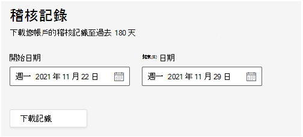

# 在受管理服務Teams 會議室稽核記錄

在受Teams 會議室管理 (TRM) 服務中稽核可讓您搜尋由使用者和系統管理員在入口網站中執行活動的稽核記錄。 此功能預設為啟用。 只有 Managed Service 系統管理員有匯出及查看記錄的許可權。

> [!NOTE]
> 在 TRM 服務中執行的動作不會Microsoft 365或Office 365稽核 

## 匯出記錄

當您匯出稽核記錄搜尋的所有結果時，來自統一稽核記錄中的原始資料會複製到逗號分隔值 (CSV) 檔案，然後下載到您的本地電腦。 

**若要下載記錄** 

1. 請前往 **設定 > 稽核>一般資訊**。
1. 若要定義感興趣的記錄的日期範圍，請輸入 **開始日期****和結束日期。**

   > [!NOTE]
   > 記錄最多隻能使用 180 天。

1. 選取 **下載記錄。**

   

   視窗底部的訊息會提示您開啟或儲存 CSV 檔案。 

1. 選取 **儲存**  >  **為**，然後儲存 CSV 檔案至您的本地電腦。 

1. 搜尋所有活動或廣泛日期範圍時，下載許多搜尋結果需要一段時間。 CSV 檔案下載完成後，視窗底部會顯示一則訊息。

## 稽核記錄中的詳細屬性

下表說明 CSV 中包含的屬性。

|屬性|描述|
| - | - |
|activity.category|
執行動作的物件類別。 可能的值：

**使用者、作業、合作夥伴資訊、角色**
|
|activity.objectName|已修改的物件名稱。|
|activity.operation|執行的操作類型。 可能的值為： **建立、更新、刪除** |
|activity.resultStatus|
指出在 **activity.operation** (屬性中指定的) 動作是否成功。

該值為成功 **或****失敗**。
|
|activity.tenantId|執行動作的租使用者 GUID|
|creationTime|使用者執行活動時， (UTC) 以 ISO 格式顯示。|
|user.userId|執行導致記錄記錄之動作的使用者。|
|user.userTenantId|執行動作之使用者的租使用者 GUID|

