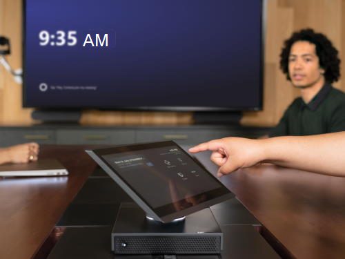
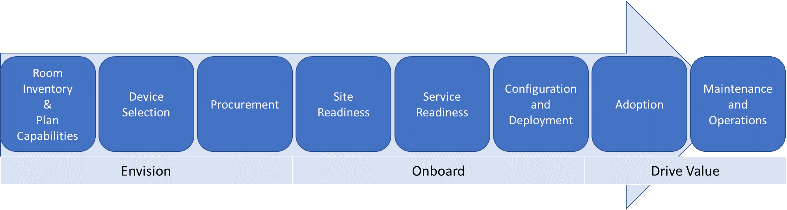

# 規劃Microsoft Teams 會議室

本文將介紹一種端對端的方法，以規劃、提供及操作Microsoft Teams 會議室做為整體會議室策略的一部分。

您可以在下方找到規劃資訊，涵蓋建議的方法和您需要做出的重要決策，以及支援技術資訊的連結。 即使您已經完全部署，我們也建議您檢閱規劃、部署及管理章節。

## Microsoft Teams 會議室概觀

Microsoft Teams 會議室提供完整的會議體驗，可將 HD 視訊、音訊和內容共用帶入各種大小的會議，從小型的交集區到大型會議室。

 
[Microsoft Teams 會議室說明](https://support.office.com/article/Skype-Room-Systems-version-2-help-e667f40e-5aab-40c1-bd68-611fe0002ba2)是一項絕佳的資源，可讓您深入瞭解Microsoft Teams 會議室，以及它如何在您的部署中新增價值。

## Microsoft Teams 會議室元件

Microsoft Teams 會議室包含下列主要元件，可提供絕佳的使用者體驗：

- 觸控螢幕主機
- 計算模組
- Microsoft Teams 會議室應用程式
- 周邊設備 (相機、麥克風、喇叭) 
- 外接螢幕最多 (兩個) 
- HDMI 輸入

您可以從許多廠商購買這些元件做為預先安裝的搭售方案，或者您可以依照 [本文中所述的需求](requirements.md)個別購買支援的元件。

您可以使用Microsoft Teams或商務用 Skype內部部署來部署Microsoft Teams 會議室。  如需所需授權的相關資訊，請參閱[Teams 會議室授權更新](rooms-licensing.md)。

| &nbsp;   |  &nbsp;   |
|-----------|------------|
|  決策點|<ul><li>您是否會在組織中部署Microsoft Teams 會議室？ </li><li>如何採購您的Microsoft Teams 會議室系統？</li></ul> |
|  後續步驟 | <ul><li>找出誰將在整個部署中參與重要活動。</li><li>檢閱您 (的會議室，並計畫設定) 瞭解您要部署Microsoft Teams 會議室的位置，以及適合會議室大小的周邊裝置。</li></ul> |
| | |

## 找出誰將在整個部署中參與重要活動

使用下方所示的方法來引導您完成部署，並視需要自訂為貴組織提供的範例輸出。

首先，先瞭解您所擁有的會議室，並想像未來哪一個會議室最適合您，然後逐一選取並採購所需的設備、準備您的網站、設定和部署您的服務、管理變更和使用者採用，以及開發作業和維護程式。

您可能需要跨多個小組協調這些活動。 我們提供您應涵蓋之主要活動的高層級檢視，並針對通常參與部署和管理會議室系統的團隊提供建議，以協助您決定需要與誰合作。

| 工作                       | 神秘可能會使任務遺落           | 指派給 | 此內容的連結 |
|----------------------------|----------------------------------------|-------------|-----------------------|
| 庫存空間            | 設施 / AV 小組 / IT Project小組 |             | [會議室庫存和功能規劃](#room-inventory-and-capability-planning) |
| 規劃功能          | IT Project小組                        |             | [會議室庫存和功能規劃](#room-inventory-and-capability-planning) |
| 裝置選取範圍           | IT Project團隊/ AV 團隊              |             | [裝置選取範圍](#device-selection) |
| 採購                | IT Project團隊/ AV 團隊              |             | [採購](#procurement) |
| 網站整備             | 設施 / AV 小組 / IT Project小組 |             | [網站整備](rooms-deploy.md#site-readiness) |
| 服務整備          | IT Project小組                        |             | [服務整備](rooms-deploy.md#service-readiness) |
| 設定              | IT Project小組                        |             | [設定與部署](rooms-deploy.md#configuration-and-deployment) |
| Deployment                 | 設施 / AV 小組 / IT Project小組 |             | [部署檢查清單](console.md#microsoft-teams-rooms-deployment-checklist) |
| 採用                   | 設施 / AV 小組 / IT Project小組 |             | [採用](#plan-for-adoption-and-change-management) |
| 維護和作業 | AV 團隊/IT Project團隊              |             | [管理概觀](rooms-manage.md) |

## 會議室庫存和功能規劃

第一步是清查貴組織的現有會議空間和會議室，以瞭解其環境、會議室大小、版面配置和用途。 然後，您可以識別您希望每個房間都具備的功能，例如智慧型相機、白板、內容相機等。

在您建立每個現有會議室的設備和功能庫存之後，您對於該會議室摘要的需求就會納入您的裝置選取計畫中，以建立豐富的會議解決方案。 除了會議室大小和用途之外， (每個聊天室所需的音訊、視訊) 形式，在決定哪個解決方案最適合每個聊天室時，都扮演著重要的角色。

在您的探索中，考慮空間音效和版面配置是關鍵。 例如，檢查會議室中的椅子不會封鎖相機檢視。 確認會議室沒有多餘的回音或吵雜的空氣，而且空間有足夠的電力供螢幕和Microsoft Teams 會議室使用。 有許多因素需要考慮，您的音訊視覺 (AV) 小組或合作夥伴將能夠提供建議。

| &nbsp;   | &nbsp;    |
|-----------|------------|
|  後續步驟|<ul><li>檢閱範圍中的會議室，並為其定義Microsoft Teams 會議室組態。</li></ul>|

_會議/會議室庫存範例_

| 網站      | 會議室名稱 | 會議室類型 | 人數 | 在範圍中？ | 目前的聊天室功能           | 未來會議室功能 |
|-----------|-----------|-----------|------------------|-----------|-------------------------------------|--------------------------|
| 倫敦 HQ | 居裡     | 中型    | 6 &ndash; 12       | 是       | 揚聲器                        | 1 個螢幕、音訊和視訊加上簡報 PSTN 存取 |
| 雪梨 HQ | 山      | 大型     | 12 &ndash; 16      | 是       | 舊版 AV 裝置、1 個螢幕和相機 | 2 個螢幕、音訊和視訊加上簡報 PSTN 存取 |

## 裝置選取範圍

根據您未來想要的聊天室功能，評估哪個Microsoft Teams 會議室解決方案最適合每個聊天室。 視房間大小和配置而定，決定最適合的 AV 周邊裝置。

如需依據房間類型和大小的系統和周邊裝置類型指導方針，[請參閱Microsoft Teams 會議室需求](requirements.md)一文。

根據您偏好的廠商，使用需求文章中提供的資訊來定義每個聊天室類型的Microsoft Teams 會議室及支援的周邊裝置設定，並將此設定做為您部署的範本。

**Pro秘訣**– 某些聊天室類型可能不適用於您的部署。

| &nbsp; | &nbsp; |
|---|---|
|   決策點 | <ul><li>從您的庫存中，您的部署範圍為哪些類型的會議室？</li><li>您會針對每個聊天室類型部署哪些系統？</li></ul> |
|  後續步驟 | <ul><li>開始收集所選系統的重要運算元據，並吸引您的採購小組。</li></ul> |

_貴組織Microsoft Teams 會議室部署範本範例_

| 會議室類型/大小     | 人數 | Microsoft Teams 會議室系統 | 周邊裝置 | 顯示 ()       |
|--------------------|------------------|------------------------------|--------------------|-----------------|
| Focus 10'by 9'    | 2 &ndash; 4        |                              |                    |                 |
| Small 16' by 16'   | 4 &ndash; 6        |                              |                    |                 |
| 中 18' 乘以 20'  | 6 &ndash; 12       |                              |                    |                 |
| 大型 15' 乘以 32'   | 12 &ndash; 16      |                              |                    |                 |

**Pro秘訣 –** 現在是開始收集您所選擇之Microsoft Teams 會議室解決方案相關資訊的好時機。

## 採購

您可以透過裝置合作夥伴，將所選的系統視為搭售方案或整合式解決方案。

您可以從需求[文章](requirements.md)中列出的多個合作夥伴取得Microsoft Teams 會議室。 請造訪合作夥伴的網站，以深入瞭解這些解決方案和採購選項。

視您的部署規模和方法而定，您可能會決定將Microsoft Teams 會議室和支援的周邊裝置運送到中央位置，以進行初始設定和指派。 對於跨許多網站分段推行，這可能是個好方法。 或者，您可以選擇將搭售方案直接寄送到您的網站。

| &nbsp; | &nbsp; |
|---|---|
|   決策點|<ul><li>您會將元件直接運送至網站或分機設備嗎？</li><li>如果您決定使用一個) ，神秘會管理分場 (？</li></ul> |
|  後續步驟|<ul><li>規劃營運。</li><li>規劃採用及變更管理。</li></ul> |

## 規劃營運

貴組織必須持續執行監視、管理和管理工作，而且必須同意誰將在部署初期完成這些工作。

許多組織都有 AV 小組或合作夥伴負責管理其會議室和裝置。 或者，您可以利用Microsoft Teams 會議室進階版，讓 Microsoft 協助管理Teams 會議室。 決定未來誰將管理Microsoft Teams 會議室裝置，以監控效能以及部署軟體更新和 Hotfix。

考慮您將路由Microsoft Teams 會議室相關通話的技術服務佇列，並提供常見問題給技術服務小組，讓他們更瞭解如何使用Microsoft Teams 會議室，以及他們可以採取的重要疑難排解步驟。 此常見問題的一個好起點是 [使用者說明](https://support.microsoft.com/office/microsoft-teams-rooms-help-e667f40e-5aab-40c1-bd68-611fe0002ba2) 和 [已知問題](known-issues.md)。

| &nbsp; | &nbsp; |
|---|---|
| ![選擇 [管理員]。](../media/audio_conferencing_image7.png)  決策點|<ul><li>決定誰將管理Microsoft Teams 會議室。</li><li>決定要路由Microsoft Teams 會議室相關通話的技術服務人員佇列。</li></ul> |
|  後續步驟 |<ul><li>準備託管帳戶。</li></ul> |

## 規劃採用及變更管理

Microsoft Teams 會議室系統為您的使用者引進新功能。 請務必瞭解這對您的使用者來說將會是一項變更，而且您應該確保您的內部行銷活動能識別新系統對您的使用者有何優點，而關鍵討論點潛在客戶可以用來與其團隊討論。

請考慮在每一個網站上排程節目和通知活動及海報，以告知使用者新功能。 您也可以在會議室中建立「快速入門手冊」。 考慮在每一個網站上尋找會議冠軍，以協助其他人快速上手並開始使用裝置。
