# 標準和會議室規劃工具

使用您環境中的智慧建議，您可以建立及策展標準。 接著，您可以將標準發佈至地區、網站、大樓或特定會議室，與合作夥伴共用規劃的會議室，以追蹤會議室部署。

## 查看會議室類型

您可以在此頁面上，在貴組織中查看會議室或會議空間類型。 快速分解會議室的標準數目、已發現的新裝置數目，以及需要採取動作的裝置數量。

此頁面也有一個命令列，您可以在其中啟動建立標準工作流程，或流覽至探索裝置、變更記錄及存檔。

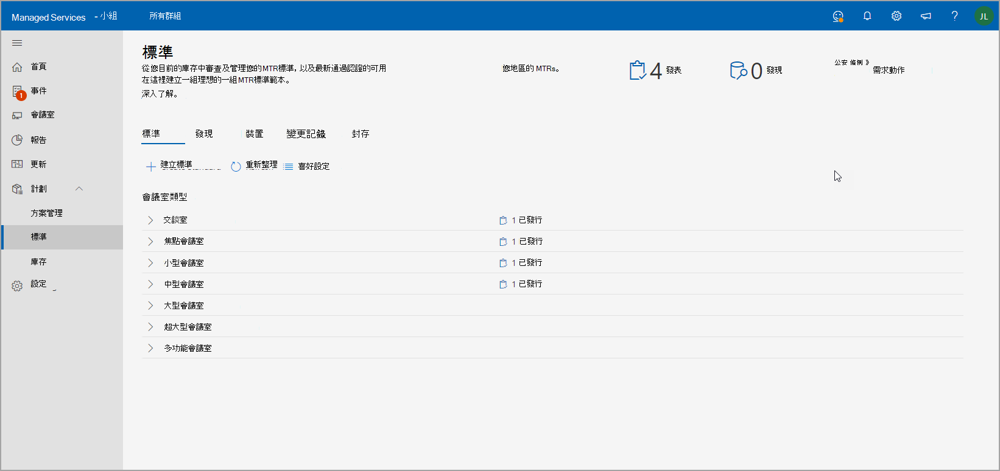
### 建立標準

使用建立 **標準工作流程** 來建立標準。

**啟動工作流程**

1. 選取 **建立一般標準**，然後提供一般詳細資料，例如標準的名稱和描述。

   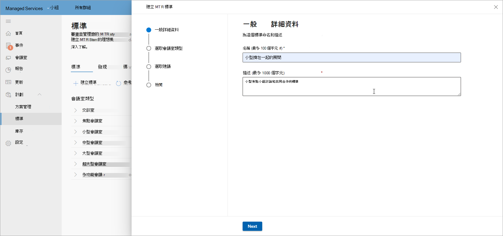

1. 針對此標準選取您的會議室類型。

   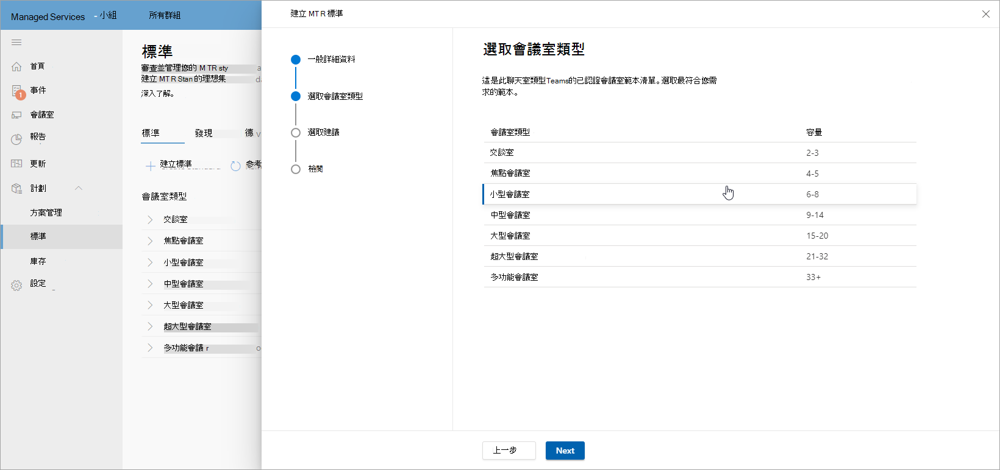

1. 從建議的硬體庫存中Teams，選取您所選擇的會議室裝置。

   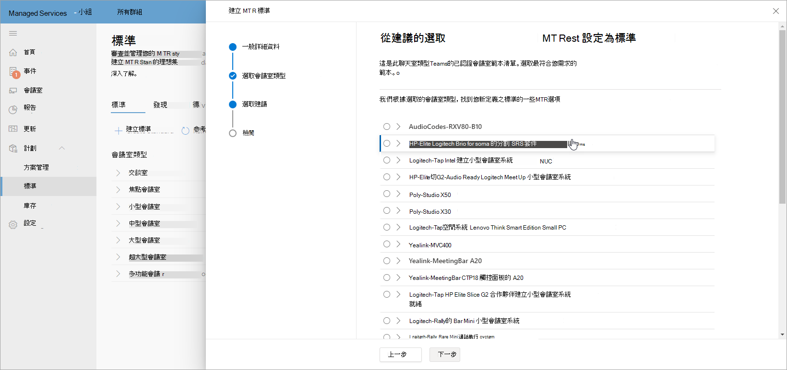

1. 請閱閱 《第三次國標》 資訊。

   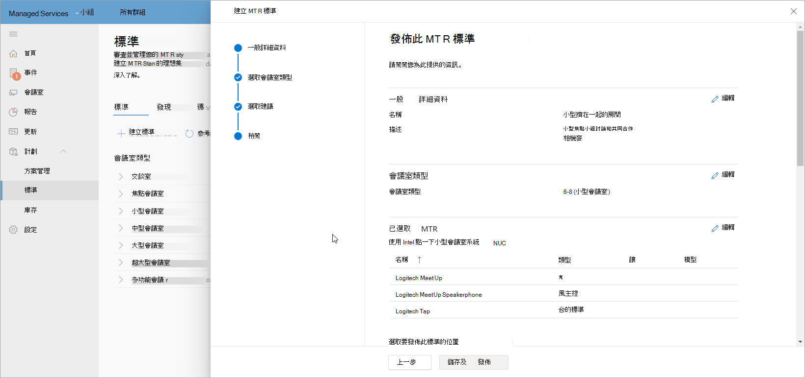

1. 將標準發佈至地區、網站、建築物或特定會議室。

   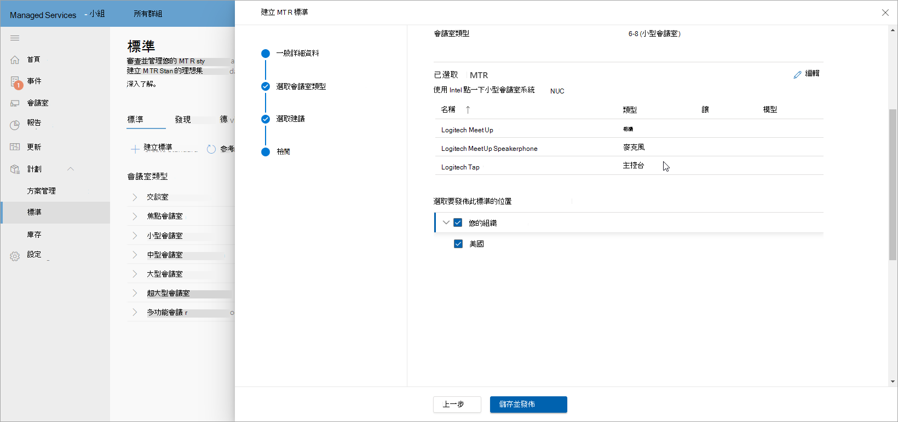

工作流程完成後，標準會成功建立併發布至網站、地區、建築物或會議室。 現在這些標準會用於規劃用途。

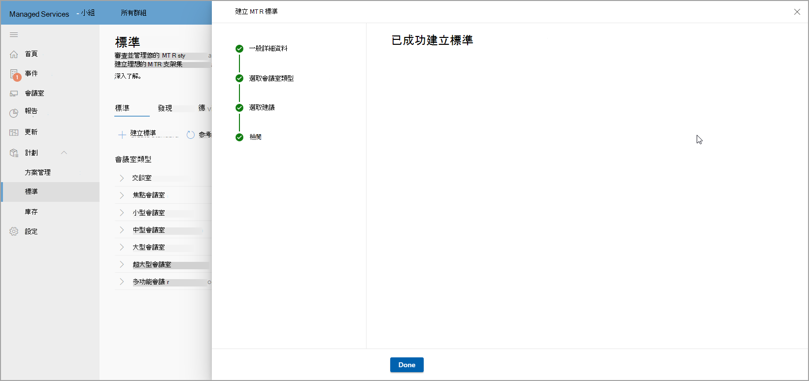
### 已發現裝置

在標準中，選取 **已發現** 裝置，以在貴組織中查看所有非標準已發現裝置。

您可以採取行動，從庫存中這些已發現裝置來審查及建立標準。

## 會議室規劃

使用會議室規劃工具精靈規劃具有會議擴充 **標準的** 會議室。

若要以引導式體驗啟動會議室規劃器：

1. 從左側流覽，選取庫存，然後選擇規劃 **會議室**。

   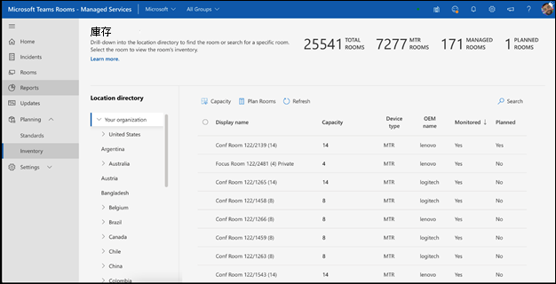

1. 從位置目錄新增會議室至規劃工具。

   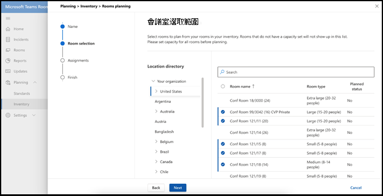

1. 設定您的標準作業喜好設定如下：

   - 如果您的規劃合作夥伴已記錄，您可以選取讓我 **的合作夥伴指派所有這些會議室的最佳解決方案**。 此選項可讓合作夥伴為客戶選取最適合當地找到的解決方案。

   - 如果您規劃內部會議擴充，請選取組織系統管理員會使用組織標準為 **所有會議室指派最佳解決方案**。 標準會自動從組織在標準視圖中核准和發佈的專案指派。

1. 選取 **組織系統管理員會指派最佳解決方案...**

   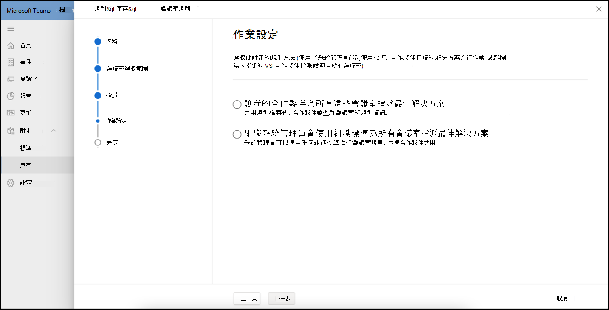

您可以將標準大量指派給多個會議室。

1. 檢查會議室名稱下方的 **多個會議室**。

   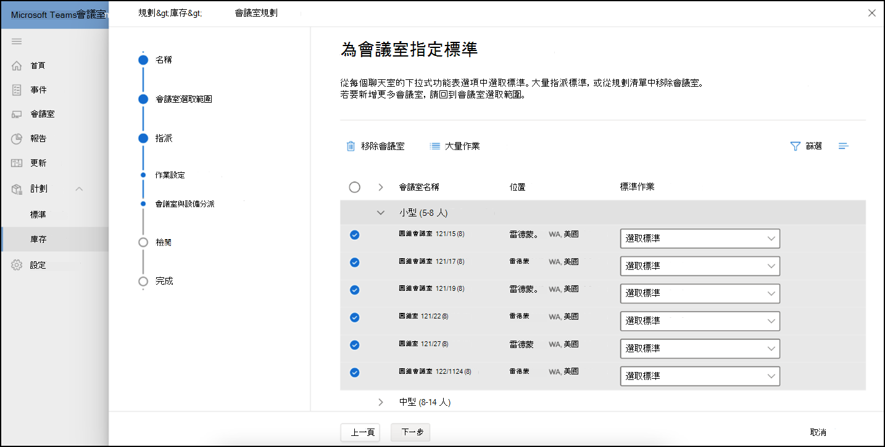

   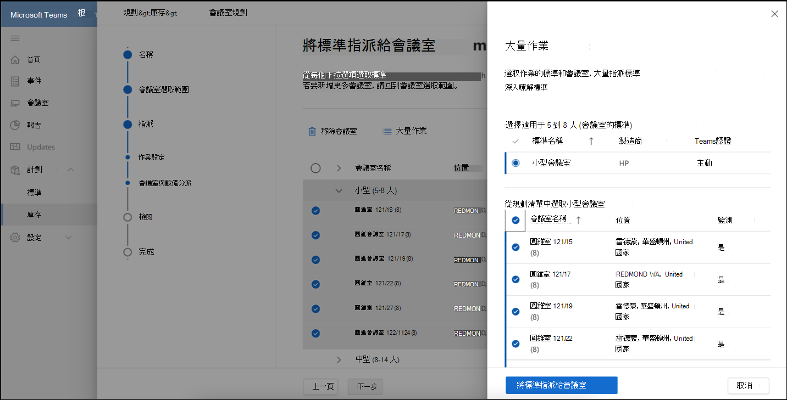

如果位置、地區或網站有一種以上可用標準，請從標準作業清單中選取一個標準，以指派給顯示在會議室名稱底下 **的會議室**。

檢查標準作業並完成計畫。 您可以將計畫列印成 PDF，以與合作夥伴共用。

## 存取控制

會議室規劃工具精靈預設為受管理服務系統管理員角色啟用。 針對客戶和其他所有內建角色，在許可權選項卡下設定庫存 **管理** 的許可權。

