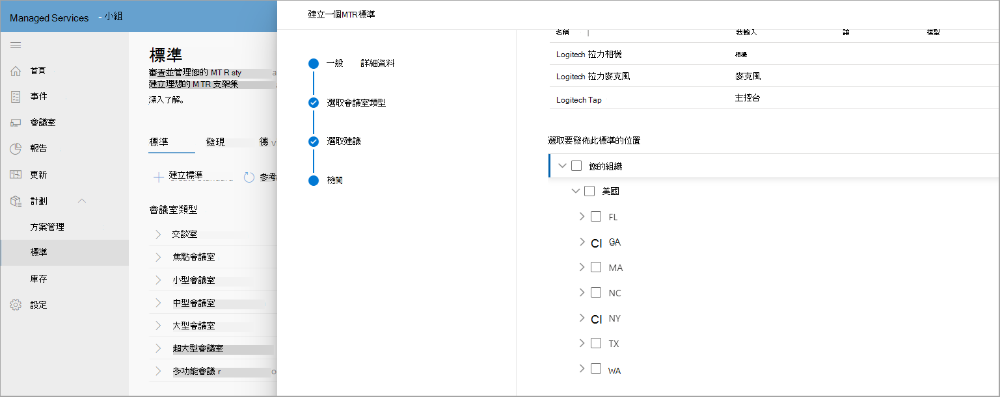
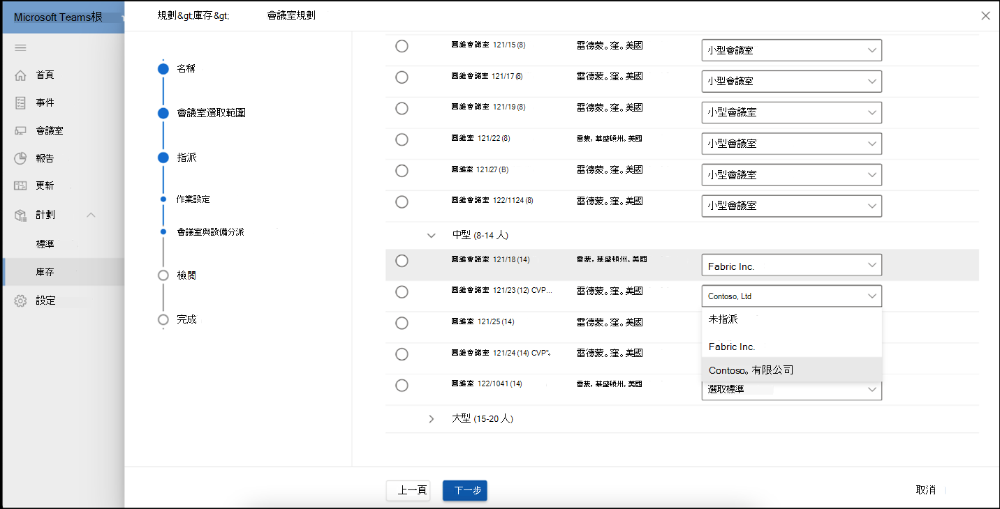

# 標準與會議室規劃工具

您可以使用您環境的智慧建議建立和匯總標準。 然後，您可以將標準發佈到地區、網站、大樓或特定的會議室，與合作夥伴共用規劃的會議室，以追蹤會議室部署。

## 檢視會議室類型

您可以在此頁面上檢視組織內的會議室或會議空間類型。 快速說明會議室有多少標準、發現的新裝置數目，以及需要採取動作的裝置數目。

此頁面也有命令列，您可以在其中啟動 [  **建立標準** 工作流程]，或流覽至 [已探索的裝置]、[變更記錄檔] 和 [封存]。

### 建立標準

使用 **[建立標準** ] 工作流程來建立標準。

**若要啟動工作流程**

1. 選 **取 [建立 MTR 標準**]，然後提供一般詳細資料，例如標準的名稱和描述。

   

1. 選取此標準的會議室類型。

   

1. 在您的硬體庫存中，從建議的 Teams 認證會議室範本中選取。 清單會根據上一個步驟中選取的聊天室類型而有所不同。

   

1. 檢閱 MTR 標準資訊。

   

1. 將您的標準發佈到地區、網站、建築物或特定的會議室。

   

一旦發佈之後，標準就會用於規劃用途。

### 探索的裝置

在 [標準] 中，選取 **[已探索的裝置** ] 以檢視貴組織中所有非標準的發現裝置。

您可以採取行動，在庫存中檢閱和建立這些已發現裝置的標準。

## 會議室規劃

使用會議室規劃精靈規劃具有會議擴充標準的 **會議室** 。

若要以引導式體驗啟動會議室規劃工具：

1. 從左側導覽選取 [庫存]，然後選擇 [ **規劃會議室]**。

   

1. 從位置目錄新增會議室至規劃工具。

   

1. 將您的標準工作分派喜好設定如下：

   - 如果您有記錄規劃的合作夥伴，您可以選取 [ **讓我的合作夥伴為所有這些會議室指派最佳解決方案]**。 這個選項可讓合作夥伴為客戶選取最佳的本機解決方案。

   - 如果您規劃內部會議擴充功能，請選取 **[組織管理員會使用組織標準為所有會議室指派最佳解決方案]**。 這些標準會自動從組織在 [標準] 檢視中核准及發佈的專案中指派。

1. 選 **取 [組織管理員會指派最佳解決方案...**

   

您可以大量指派標準給多個會議室。

1. 檢查 [會議室名稱] 下方的多個 **會議室**。

   

   

如果您有一個以上的標準可供位置、地區或網站使用，請從 [ **標準工作分派** ] 清單中選取一個標準，以指派給顯示在 [會議室名稱] 下方的會議 **室**。

檢閱標準作業並完成計畫。 您可以將計畫列印成 PDF，以便與合作夥伴共用。

## Access 控制項

根據預設，會議室規劃精靈會啟用 Managed Service 系統管理員角色。 針對客戶和其他所有內建角色，請在 [許可權] 索引標籤下設定庫存管理 **權** 限。

