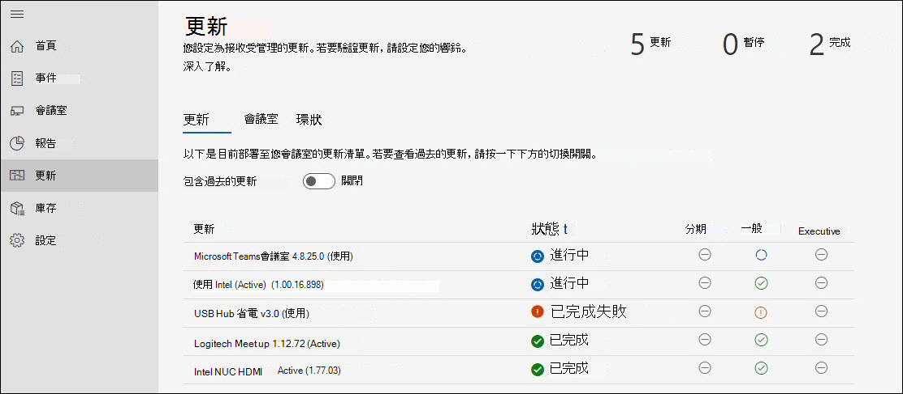
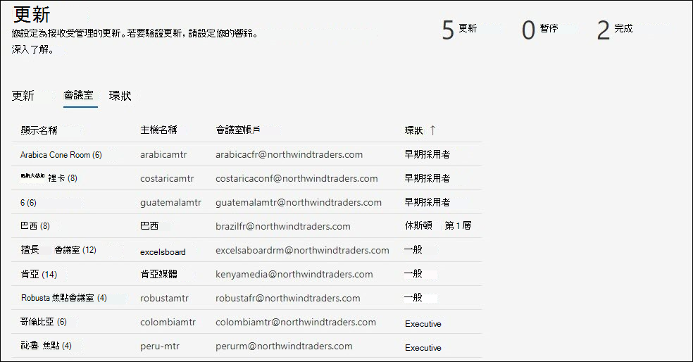

# 更新管理 
現代化會議室配備Microsoft Teams 會議室裝置及其他周邊設備，例如相機、麥克風或喇叭，以及可能更多裝置，以建立包容性且有效的會議體驗。 來自不同 OEM 類型的設備提供所需的確切組織體驗;不過，必須持續維護軟體和韌體。  

Microsoft Teams 會議室受管理的服務可保證貴組織中的每一個會議室都會維持在建議的層級，以提供隨時準備就緒且正常運作的會議室。 Microsoft 的目標是為您的營運員工降低智慧與自動化的複雜度和工作步調。 疑難排解或診斷會儘快執行。 

## 將裝置轉換為受管理的服務 
已上線至受管理服務的會議室裝置通常會有與我們指導方針不同的變更管理歷程記錄和做法。  

- 若要從受管理的服務獲益，您必須轉換管理受管理服務產品群組下所有更新的變更管理。
- 變更管理影響事件 SLAs 的多個來源，因為有一項探索和補救會在會議室發生事件時重新重新開機。
- Microsoft 已實作控制措施和檢查，以實作可能不同于一個組織的原則，以及在特殊情況下增強能力。
- 會議室裝置最終會更新為一般標準，但因特定硬體安裝問題而造成例外狀況除外。  

## 轉換裝置：基本整備檢查 
大部分非預期的失敗來自于基本映射的變更，且變更管理歷程記錄不確定。 

建議您進行簡單的整備檢查：  

- **基本圖像**：基底圖像必須來自特定 OEM。 如果過去已重建裝置，且在一般工作中顯示非預期的失敗或行為，則必須還原基本映射。 我們可以提供協助，但無法遠端重建會議室裝置，因此您需要當地網站技術人員。  
- **Base OS， Edition：** 基本作業系統和版本必須符合Microsoft Teams 會議室裝置的需求。 如果不是這樣，必須將它修正為上線的一部分。 Microsoft Teams 會議室需要Semi-Annual通道服務選項底下的Windows 10 IoT 企業版或Windows 10 企業版 SKU。 如需詳細資訊，請參閱官方 [MTR 指引](rooms-lifecycle-support.md#windows-10-release-support) 。

## 整備檢查

有幾個接收受管理服務更新的先決條件： 

|軟體 |指導方針 |
|:- |:- |
|記錄同步處理服務  |應該會在 Logitech 會議室裝置上安裝並執行。 除非封鎖，否則系統會自動從 Windows 更新安裝必要的同步處理服務。 您也可以安裝完整的同步處理套件。 |
|Windows 作業系統更新 |應保留啟用狀態，且不要重新導向至 WSUS，也不應從網路觀點封鎖。 不一定要使用 GPO 或 MDM 原則來管理作業系統更新。 |
|Microsoft Store 更新   |應該會關閉。 如果開啟受管理的服務，將會關閉 Microsoft Store 更新。 |
|防毒軟體 |如果您在這些裝置上執行 AV 軟體，您應該確保 AV 已針對 Teams 和 Skype dlls 設定排除專案。 如需詳細資訊，請參閱這裡。 |
|其他軟體 |應使用 Managed Services 檢閱其他軟體，例如協力廠商遠端桌面檢視等，以排除副作用。 |
|其他變更管理|可能會干擾已涵蓋的更新，且不應導入。 |

## 受管理的更新 – 運作方式 
管理更新的方式有兩種：  

- **自動管理**：更新會根據受管理的服務評估安裝在您的會議室裝置中。 在我們的產品群組中管理的更新不需要介入。
- **驗證的頻道**：設定響鈴系統以預覽特定裝置上的更新，這樣您就可以在不使用相關聯的腿形時監控更新。 在廣泛推行之前，頻道設定會提供一層額外的到期到期日。  

### 自動管理

如果您選擇自動管理，則不需要採取任何動作來執行更新。 不過，您應該檢閱受管理服務支援的目前更新組合。 產品群組會持續取得新的新增專案，而我們優先處理最頻繁且具影響力的更新，以確保您的會議室穩定性。 檢查目前清單 (在本檔) 的[更新管理] 區段底下，以規劃貴組織所需的任何其他變更管理。  

**建議：** 請勿在任何受管理的裝置上自行安裝受管理服務所涵蓋的更新。 如果您遇到任何問題，請在入口網站中回報事件。

### 通道驗證

選擇頻道驗證時，請檢閱下列各節，瞭解受管理服務中的頻道運作方式，以及可為貴組織自訂的選項。 即使使用通道驗證，Managed Services 仍會嘗試確保會議室不會在建議的更新中逾期。 視情況而定，會議室可能會收到「追平」更新，以確保它符合受管理的服務建議。  

 檢查入口網站首頁及受管理服務檔中的公告，以在產品群組中推出新類型的軟體和韌體。 由於 Managed Services 專家每天都會檢閱我們裝置組合中的更新版本，因此會根據需求處理特定問題和目標更新。  

### 排程 
受管理的更新會根據會議室中的設備，以及不符合適用軟體和韌體的 Managed Services 標準，排定為會議室。 

- 為了協助客戶符合變更管理需求，請在階段階段中的 **星期三** 開始更新部署。 如果需要重大更新，我們將會略過此排程，並在更新可用時立即發行。 

- 更新是根據特定房間的需求來排序。 
- 如果您有驗證更新的設定通道，更新將會透過通道順序進行。 
- 如果我們判斷會議室穩定性是根據您的情況而改善，新的更新可以取代已排入佇列的更新。  
- 更新通常會在夜間維護視窗期間套用，也就是當地時間 **上午 12：00 到早上 5：00** 的會議室，以避免任何類型的干擾。 

## Microsoft Teams 會議室應用程式更新週期原則 
MTR 工程小組的支援原則指出，版本的十二 (12) 個月生命週期已過期，或自該版本發行之後已發行超過兩個更新，則所有支援都會終止。 然後，客戶必須更新為支援的版本。 請參閱[Microsoft Teams 會議室應用程式版本支援 - Microsoft Teams |Microsoft Docs](rooms-lifecycle-support.md)詳細的服務說明。

為了在所有受管理的會議室中維持統一標準，並讓我們能夠有效率地找出熱門問題，我們將根據支援與訂閱服務條款及條件，支援及部署兩個最新的主要或次要版本 (N、N-1) MTR App 軟體。 我們會視需要略過更新通道，自動將不符合規範的會議室帶入最新狀態。 

N-1 原則也適用于協力廠商軟體。  

## 更新管理體驗逐步解說  
若要檢視更新，請登入受管理的服務入口網站，然後流覽至更新頁面。

[更新窗格會顯示更新管理的高層級概觀，包含下列索引標籤：

- **更新**：受管理服務透過貴組織協調的軟體或韌體更新。  
- **會議室**：[會議室] 索引標籤提供每個會議室所屬的會議室和頻道檢視。
- **頻道**：[頻道] 索引標籤會顯示貴組織的會議室頻道。

### 更新  

此檢視會顯示您租使用者的相關更新及其個別狀態。 若要檢視不再有效的過去更新，請選取 [ **包含過去的更新** ] 切換到 [開啟]。  

任何更新都可以處於下列其中一種狀態：

| 地位 | 描述 |
|:- |:- |
| 計畫 | 系統會針對指定頻道中的會議室排程更新。 請記住，更新只會在進度到達會議室所在的通道之後顯示 [已排程]。 例如，如果新的更新位於週期週期中，它只會顯示 [分段週期] 頻道中的 [排定會議室]。  
 在更新進行到該通道之前，其他通道將會有「不需要」狀態。
 |
| 進行中 | 更新正在進行中，個別頻道會顯示狀態。 此狀態會顯示整體響鈴狀態，因此，如果更新適用于租使用者中分級通道中的單一會議室，則更新會處於「進行中」狀態，直到達到高階主管通道為止。 |
| 已完成失敗 | 更新已完成所有設定的頻道的進度，且至少在一個會議室中失敗。 |
| 完成 | 更新已完成所有設定的頻道的進度，並已成功安裝在所有適用的會議室。|
| 廢棄 | 已停用更新。 進一步部署已停止。 這是典型的，因為更新已經由新版本取代。 |
| 暫停 | 更新處於暫停狀態。 |
| 非必要 | 更新可能尚未評估該聊天室，或不適用於該聊天室。 |

### 房間  

[會議室] 索引標籤會顯示您租使用者中的所有會議室，以及它們所屬的頻道。  

若要設定聊天室應屬於哪一個頻道：  

1. 按一下會議室以顯示詳細檢視。  
1. 在 [ **響鈴**] 底下，按一下 **[變更]**。  
1. 選取聊天室應所屬的 [頻道]。  
1. 按一下 **[指派]**。  

詳細的會議室檢視會在 **更新** 節點底下顯示相關更新及其狀態。  

### 環  

頻道可用來降低因部署功能更新而衍生出的問題風險。 這是透過逐步將更新部署到整個網站來完成。 每個頻道都應該有 Microsoft Teams 會議室清單和對應的推行排程。 定義頻道通常是一次性事件 (或至少不常) ，但 IT 應該時常重新造訪這些群組，以確保排序仍然正確無誤。  

[ **頻道]** 索引標籤會列出您租使用者中的所有頻道。 有三個預先設定的圓圈：  

- **分階段**：將會議室指派給您測試過的分組頻道。 所有新更新都會先在這裡推出。 一般而言，您會想要確保您的舞臺頻道代表環境中各種裝置類型的會議室。 如果某些類型的聊天室設定不常見，或是發生問題的記錄，請考慮在 [分段] 中表示。

- **一般**：根據預設，所有會議室都會置於此頻道中。 企業中使用的大部分聊天室裝置都屬於此類別。 

- **高階主管**：此群組應包含您最常公開的會議室，您想要主動將干擾降到最低。 一個很好的範例是用於高階主管會議或大型小組會議的大型會議室。 

### 指定推行時程表

更新不能超過 60 天完成所有頻道。  

|參數 |解釋 |
|:- |:- |
|延期期間|一旦更新從第一個通道啟動，延遲期間就是在此通道上啟動更新之前的幾天內的延遲。|
|推行期間|
在此通道上進行更新後，此時該在此通道中部署。 例如，如果持續時間是 5 天，一旦更新在此通道上啟動，就會部署超過 5 天到此通道中的會議室。|
|測試期間|測試/驗證通道中套用至通道之更新的天數。 測試期間會在部署完成後開始，一旦完成，更新就會移至下一個通道。|
|完成時間|「完成時間」欄會指出此頻道)  (推行期間 + 測試期間的總天數。|
|總時間|底部是「合計」列，表示從第一個到最後一個通道完成更新需要多久時間。|

### 建立自訂頻道

1. 流覽至 [ **頻道] 索引卷** 標。  
1. 按一下 **[新增通道]**。  
1. 指定此通道收到更新的順序，其中 1 位是第一個，9 個為最後一個。  
1. 為這個頻道命名。  
1. 如有需要，請提供描述。  
1. 指定此通道中更新的推出天數。  
1. 指定測試期間。  
1. 按一下 [ **提交]**。  

> [!NOTE]
> 「由其他頻道設定的天數」是更新完成所有頻道的總天數。 「剩餘天數」表示 *此* 通道完成的最大天數。 「天中推行期間」和「天數測試期間」的總和不可超過此金額。  

**編輯頻道**

1. 流覽至 [ **頻道] 索引卷** 標。
1. 按一下要刪除的頻道。  
1. 按一下 **[編輯通道]**。  
1. 視需要編輯推出和測試的天數。

**刪除頻道**

1. 流覽至 [ **頻道] 索引卷** 標。  
1. 按一下要刪除的頻道。  
1. 按一下 **[刪除通道]**。  

> [!NOTE]
> 無法刪除預設頻道。  

**移動會議室**

將會議室從一個頻道移到另一個頻道有兩種方式：

1. 流覽至 [ **頻道] 索引卷** 標。  
1. 按一下要從中移動會議室的頻道  
1. 按一下 **[移動會議室]**。  
1. 在 [會議室清單] 中選取您要移動 **的會議室**。  
1. 選擇目標頻道，選取的會議室會在下拉式清單中移至該頻道。  
1. 按一下 **[移動會議室]**。  

**或**

1. 開啟您要透過 [事件]、[會議室] 或 [更新 - >會議室])  (移動的聊天室詳細資料。
1. 按一下 **[更新**] 索引標籤。  
1. 在 [ **指派的頻道**] 底下，按一下 **[變更]**。
1. 從下拉式清單中選取新通道。  
1. 按一下 **[指派]**。

## 受管理的更新：可見度與控制

受管理的服務可協調整個組織的更新。 不過，如有需要，您能夠看到並控制要進行著想。 方法如下： 

- 如果更新失敗，系統會自動向 Microsoft Managed Service Operations 小組產生票證。 營運小組會採取步驟來補救失敗，並視需要與您互動。  
- 如果您看到造成問題的更新，您可以使用 [暫停] 按鈕 **來暫停** 更新。 按 [暫停] 按鈕會建立作業中心的票證以進行調查。 請務必在暫停更新時提供詳細資料，以協助加快事件回應。  
- 如果您在會議室中看到更新失敗，而您已修正像是網路中斷連線等合理原因，您可以使用 [ **全部重試] 失敗** 按鈕來重試更新。  
- 當您可能決定要更早使用更新時，可能會遇到緊急狀況。 在此情況下，您可以使用 **[強制更新]** 按鈕。 使用 [強制更新] 選項時，您可以選擇立即強制更新，或在下一個可用的會議室時強制更新。  

> [!NOTE]
> **我們不建議使用「強制更新」** 做為一般更新管理策略。 如果您推送的更新仍在驗證通過中，您可能會遇到我們已經瞭解的問題。 在這種情況下，這類聊天室的事件解決方式會盡力解決。  

- 此外，為了確保良好的變更管理做法，我們將記錄服務內部的每項強制更新。 在未來，我們預期也會讓您看到這一點。
