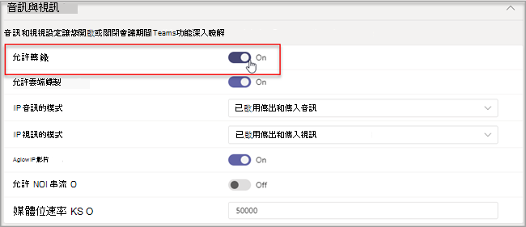

# 管理智慧型喇叭的語音辨識技術控制項

智慧型喇叭會使用語音設定檔資訊來識別誰在即時抄寫中表達內容。 當Microsoft Teams 會議室會議室Windows配備智慧型演講者時，可在會議期間使用即時抄寫。 本文說明租使用者系統管理員如何控制用於語音辨識的語音分析，以產生即時抄寫。 您可以控制組織使用語音辨識的程度，以及下列功能：

- 在文字記錄中編輯演講者的名稱。
- 變更文字記錄中單字的演講者，或變更文字記錄中所有片語中的演講者 (但不要變更) 。
- 變更會議中列出的人員之喇叭識別。
- 移除每個文字記錄上識別為該演講者的一或多個片語識別。

## 審查智慧型喇叭需求

智慧型喇叭包含特殊的七麥克風陣列。 系統使用語音設定檔資訊來識別會議室中最多 10 個人的聲音。

下列專案為智慧型喇叭需求：

- 客戶租使用者必須位於美國 (北美) 。1
- 會議室最多應有 10 個人出席。
- 會議室的上傳連結至少為 7Mbps。

 1 智慧型喇叭和相關語音設定檔及使用方式僅適用于 EN-US 語言，且適用于美國 NA-US 地區 (租) 使用。 租使用者使用者註冊並使用智慧型喇叭進行屬性化抄寫時，這兩個條件都必須正確。

## 設定智慧型喇叭

智慧型喇叭會使用 USB 直接連接到Teams 會議室主機。 為了獲得最佳結果，Yealink 品牌智慧型喇叭應該與 Yealink 品牌主機一起使用。

> [!NOTE]
> Yealink 智慧喇叭 **必須與** Yealink 主機一起使用。

> [!NOTE]
> 我們不支援連接到 Logitech Surface Pro Microsoft Teams 會議室。 有一個已知Teams 會議室無法透過基座識別智慧型喇叭。

智慧型喇叭應置於至少 8 (20 公) ，遠離牆面和大型物件 ，例如膝上型電腦。 如果智慧型喇叭 USB 纜線不夠長，無法用於您的設定，請使用纜線延伸器。

1. 以系統管理員的登錄主機。
2. 設定Teams設定，以配合智慧型喇叭麥克風和喇叭。
   您也可以透過 TAC 入口網站而非會議室主控台執行此操作。

   圖表顯示智慧型喇叭如何連接到裝置 ，如果裝置包含資料方塊。

   

   圖表顯示如果裝置不包含資料方塊，智慧型喇叭如何連接到裝置。

   

> [!Note]
> EPOS 和 Yealink 裝置應具有 "EPOS" 或 "Yealink" 首碼，且在喇叭名稱中包含 「UAC2_RENDER」，而麥克風名稱中則包含 「UAC2_TEAMS」。 如果您在下拉式功能表中找不到這些麥克風和喇叭名稱，請重新開機智慧喇叭裝置。

## 啟用智慧型喇叭使用者識別

語音設定檔資料可用於使用智慧型喇叭的任何會議。 請參閱[Teams和](../meeting-policies-in-teams.md#allow-transcription) [PowerShell 會議 Cmdlet，](/powershell/module/skype/set-csteamsmeetingpolicy?view=skype-ps)以瞭解會議設定的資訊。

當策略設定為區分時，或非會議受邀者在會議期間逐步加入時，即會建立使用者的語音設定檔資料。 語音設定檔資料在會議結束時會關閉。

以下是設定智慧型喇叭和使用者識別所需的策略。

|政策|說明|值與行為|
|-|-|-|
|註冊UserOverride|用於設定租使用者Teams的語音設定檔捕獲或註冊。 |**已停用** <ul><li> 從未註冊的使用者無法查看、註冊或重新註冊。<li>註冊流程的進入點將會隱藏。<li>如果使用者選取註冊頁面的連結，就會看到一則訊息，指出其組織未啟用此功能。  <li>已註冊的使用者可以在設定中查看和移除Teams設定檔。 移除語音設定檔後，他們將無法查看、存取或完成註冊流程。</li></ul> **啟用** <ul><li> 使用者可以查看、存取及完成註冊流程。<li>進入點會顯示在Teams的設定 **頁面上**。</li></ul>|
|roomAttributeUserOverride|控制會議室中的語音使用者識別。 此設定適用于Teams 會議室帳戶。| **關閉** <ul><li>Teams 會議室裝置不會從會議室傳送音訊串流節省頻寬。 <li>會議室使用者不會被屬性或區分，而且他們的語音簽名也不會被取回或使用。<li>會議室使用者不明。</li></ul>  **屬性** <ul><li>會議室使用者會依據他們的註冊狀態來屬性。<li>註冊的使用者在文字翻譯中會顯示其名稱。  <li>未註冊的使用者會顯示為演講者 n。<li>Teams 會議室裝置會從會議室傳送七個音訊資料流程。</ul>  **區分**  *這項設定將在日後提供。*|
|enabletranscription|使用者和會議室帳戶Teams必填專案。|**True** 和 **False**|
||||

在系統管理Teams中，設定 **允許抄寫** 政策。 設定預設 **為關閉**。

## 常見問題集 (FAQ)

**語音設定檔資料儲存在哪裡？**

語音設定檔資料會儲存在雲端Office 365包含使用者內容。

**什麼是保留時間表和策略？**

資料保留概觀中會說明一 [般保留政策](/compliance/assurance/assurance-data-retention-deletion-and-destruction-overview)。 此外，如果使用者未在 3 年內受邀參加智慧型喇叭的任何會議，使用者的語音設定檔資料將在 3 年後刪除。 資料不會用於現有員工的任何會議。 如果員工離職，語音設定檔資料會視為使用者內容，並且根據資料保留概觀所述Office 365資料保留政策視為[使用者內容](/compliance/assurance/assurance-data-retention-deletion-and-destruction-overview)。

**語音設定檔資料是否用於Microsoft 服務？**

否，語音設定檔資料只會用於使用者提供同意的目的。 Microsoft 不會使用語音設定檔資料，除非Teams語音辨識案例。

例如，Microsoft 不會在下列情況下使用資料：

**當我加入另一個組織的會議時，是否使用我的語音設定檔資料？**

只有貴組織中使用者所組織的會議才不一樣。

**如何匯出語音設定檔？**

您的 IT 系統管理員隨時都可以匯出您的音訊資料。

## 相關主題

[支援文章：使用智慧型喇叭識別會議室參與者 ](https://support.microsoft.com/office/use-teams-intelligent-speakers-to-identify-in-room-participants-in-meeting-transcription-a075d6c0-30b3-44b9-b218-556a87fadc00)
