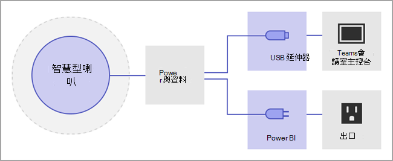
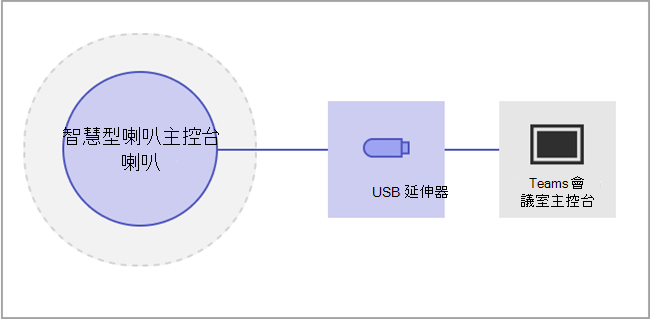

# 管理智慧喇叭的語音辨識技術控制項

智慧型喇叭會使用語音設定檔資訊來辨識即時轉譯內容的人員。 當Windows會議室的Microsoft Teams 會議室配備智慧喇叭時，可在會議期間使用即時轉譯。 本文說明租使用者系統管理員您如何控制用於語音辨識的語音分析，以產生即時轉譯。 您可以控制組織使用語音辨識的程度，以及下列功能：

- 在文字記錄中編輯演講者的名稱。
- 變更文字記錄中單一口說的喇叭，或變更文字記錄 (中所有說出的演講者，但日後文字記錄) 。
- 變更會議中所列人員的演講者身分識別。
- 移除識別身為該演講者之一或多個語句的識別，在每一個文字記錄上。

## 檢閱智慧型喇叭需求

智慧喇叭包含特殊的七個麥克風陣列。 系統會使用語音設定檔資訊來識別會議室中最多 10 個人的聲音。

下列專案是智慧型喇叭需求：

- 會議室最多應有 10 人親自出席。
- 會議室的上傳連結至少為 7 Mbps。

支援 Epos、Sennheiser 和 Yealink 智慧型喇叭。

> [!NOTE]
> 智慧喇叭可在所有國家/地區使用。 如需生物特徵辨識註冊和會議內轉譯目前支援之地區設定的清單，請參閱 [支援地區](#supported-locales) 設定。

## 設定智慧型喇叭

智慧喇叭會直接使用 USB 連線到Teams 會議室主機。

> [!NOTE]
> Yealink 智慧喇叭 **必須** 與 Yealink 主機搭配使用。

> [!NOTE]
> 我們不支援連線到 Logitech Surface Pro Microsoft Teams 會議室的智慧型喇叭。 已知問題Teams 會議室無法透過擴充座辨識智慧型喇叭。

智慧型喇叭應放置至少 8 英吋 (20 公分) 遠離牆壁和大型物件，例如膝上型電腦。 如果智慧型喇叭 USB 纜線的安裝時間不夠長，請使用纜線延伸器。

1. 以系統管理員身分登入主機。
2. 設定Teams裝置設定，以符合智慧型喇叭麥克風和喇叭。
   您也可以透過 TAC 入口網站執行此動作，而非透過會議室主機進行。

   圖表顯示如果裝置包含資料方塊，智慧型喇叭如何連線到裝置。

   

   圖表顯示如果裝置不包含資料方塊，智慧型喇叭如何連線到裝置。

   

> [!Note]
> EPOS 和 Yealink 裝置的前置詞應該是「EPOS」或「Yealink」，並在喇叭名稱中包含「UAC2_RENDER」，麥克風名稱則為「UAC2_TEAMS」。 如果您在下拉式功能表中找不到這些麥克風和喇叭名稱，請重新開機智慧型喇叭裝置。

## 啟用智慧喇叭使用者辨識

您可以在任何使用智慧喇叭的會議中使用語音設定檔資料。 如需會議設定的相關資訊，請參閱[Teams會議](../meetings-policies-recording-and-transcription.md#allow-transcription)原則和[PowerShell 會議 Cmdlet](/powershell/module/skype/set-csteamsmeetingpolicy)。

當原則設為區分或非會議受邀者會在會議期間參與時，會建立使用者的語音設定檔資料。 會議結束時會拒絕語音設定檔資料。

以下是設定智慧喇叭和使用者辨識的必要原則。

|政策|描述|值與行為|
|-|-|-|
|enrollUserOverride|用來在租使用者的Teams設定中設定語音設定檔擷取或註冊。 |**已停用** <ul><li> 從未註冊的使用者無法檢視、註冊或重新註冊。<li>系統會隱藏註冊流程的進入點。<li>如果使用者選取註冊頁面的連結，就會看到一則訊息，指出其組織並未啟用此功能。  <li>已註冊的使用者可以在Teams設定中檢視及移除他們的語音設定檔。 一旦移除他們的語音設定檔，他們將無法檢視、存取或完成註冊流程。</li></ul> **Enabled** <ul><li> 使用者可以檢視、存取及完成註冊流程。<li>進入點會顯示在 [Teams] 設定頁面的 [**辨識] 索** 引標籤底下。</li></ul>|
|roomAttributeUserOverride|控制會議室中的語音使用者身分識別。 Teams 會議室帳戶需要此設定。| **關閉** <ul><li>Teams 會議室裝置不會從會議室傳送音訊串流省電頻寬。 <li>會議室使用者不會被歸屬或分辨，而且完全不會擷取或使用其語音簽名。<li>會議室使用者為未知。</li></ul>  **屬性** <ul><li>會議室使用者會根據他們的註冊狀態來建立屬性。<li>已註冊的使用者會在轉錄中顯示其名稱。  <li>未註冊的使用者會顯示為喇叭 \<n> 。<li>Teams 會議室裝置會從會議室傳送七個音訊串流。</ul>  **區分**  <ul><li>會議室使用者將以演講者 1、喇叭 2、...轉譯中的喇叭 \<n> 。</li><li>不管使用者的註冊狀態為何，其名稱不會顯示在轉譯中。</li><li>Teams 會議室裝置會從會議室傳送七個音訊串流。</li></ul>
|AllowTranscription|使用者和會議室帳戶Teams必要。|**True** 和 **False**|
||||

在Teams系統管理中心中，設定 **[抄寫] 原則**。 設定預設為 **[關閉]**。

![醒目提示會議原則的系統管理中心，並已選取 [允許轉譯]。](../media/allow-transcription1.png)
  
> [!NOTE]
> 指派原則之後，最多可能需要 48 小時才會生效。 若要讓原則更快生效，帳戶必須登出並重新登入。

## 常見問題集 (FAQ)

**語音設定檔資料儲存在哪裡？**

語音設定檔資料會儲存在Office 365包含使用者內容的雲端中。

**保留時間表和原則為何？**

[資料保留概觀](/compliance/assurance/assurance-data-retention-deletion-and-destruction-overview)中會說明一般保留原則。 此外，如果使用者在 1 年內沒有受邀參加任何智慧型喇叭會議，使用者的語音設定檔資料也會在 1 年後刪除。 現有員工的任何會議中不會使用資料。 如果員工已離開公司，語音設定檔資料會被視為使用者內容，並會根據資料保留概觀中所描述的Office 365[資料保留原則](/compliance/assurance/assurance-data-retention-deletion-and-destruction-overview)來處理。

**語音設定檔資料是否用於Microsoft 服務？**

否，語音設定檔資料僅用於使用者提供同意的目的。 除了Teams語音辨識案例之外，Microsoft 不會使用語音設定檔資料。

例如，Microsoft 不會在下列情況中使用資料：

**當我在其他組織加入會議時，是否使用我的語音設定檔資料？**

不只適用于組織中使用者召集的會議。

**如何匯出我的語音設定檔？**

您的 IT 系統管理員可以隨時匯出您的音訊資料。

## 支援的地區設定

下列註冊和會議內轉譯地區在所有國家/地區都受到支援。

### 註冊地區設定

使用者可以在下列地區設定中註冊語音以進行辨識：

|**語言**|**國家/地區**|**文化識別碼**|
|:-----|:-----|:-----|
|英語    |澳洲   |en-AU    |
|英語    |加拿大    |en-CA   |
|英語    |印度    |en-IN    |
|英語    |紐西蘭    |en-NZ    |
|英語    |英國    |en-GB    |
|英語    |美國    |en-US    |

### 會議中的轉錄地區設定

使用者註冊後，就可以在會議期間辨識其語音，並在會議設定為下列其中一個地區設定時，在轉譯中識別其語音：

|**語言**|**國家/地區**|**文化識別碼**|
|:-----|:-----|:-----|
|簡體中文 ()     |中國    |zh-CN    |
|英語    |澳洲   |en-AU    |
|英語    |加拿大    |en-CA   |
|英語    |印度    |en-IN    |
|英語    |紐西蘭    |en-NZ    |
|英語    |英國    |en-GB    |
|英語    |美國    |en-US    |
|法語    |加拿大    |fr-CA    |
|法語    |法國    |fr-FR    |
|德語    |德國    |de-DE    |
|義大利文    |義大利    | it-IT   |
|日語    |日本    |ja-JP    |
|朝鮮語    |韓國    |ko-KR    |
|葡萄牙文    |巴西    |pt-BR    |
|西班牙文    |墨西哥    |es-MX    |
|西班牙文    |西班牙    |es-ES    |

## 相關主題

[支援文章：使用智慧型喇叭識別會議室內的參與者 ](https://support.microsoft.com/office/use-teams-intelligent-speakers-to-identify-in-room-participants-in-meeting-transcription-a075d6c0-30b3-44b9-b218-556a87fadc00)
