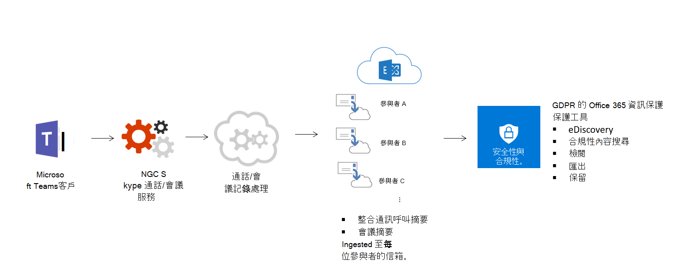
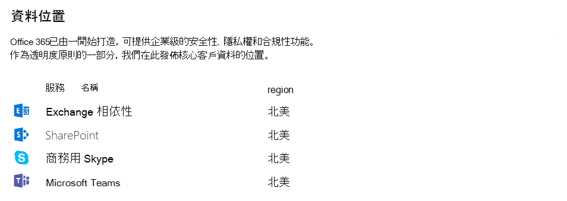

# Microsoft 團隊中的安全性與合規性Security and compliance in Microsoft Teams

> [!IMPORTANT]
> 就像 Office 365 的客戶一樣，您擁有及控制您的資料。As a customer of Office 365, you own and control your data. 除了向您提供已訂閱的服務之外，Microsoft 不會將您的資料用於任何其他專案。Microsoft does not use your data for anything other than providing you with the service that you have subscribed to. 身為服務提供者，我們不會掃描您的電子郵件、檔或團隊，以進行廣告或與服務相關的目的。As a service provider, we do not scan your email, documents, or teams for advertising or for purposes that are not service-related. Microsoft 沒有已上傳內容的存取權。Microsoft doesn’t have access to uploaded content. 就像商務用 OneDrive 和 SharePoint Online 一樣，客戶資料仍會留在租使用者中。Like OneDrive for Business and SharePoint Online, customer data stays within the tenant. 您可以在[Microsoft 信任中心](https://microsoft.com/trustcenter)深入瞭解我們與安全性相關的資訊。You can check out more about our trust and security related information at the [Microsoft Trust Center](https://microsoft.com/trustcenter). 小組與 Microsoft 信任中心遵循相同的指導方針與原則。Teams follows the same guidance and principles as the Microsoft Trust Center.

Microsoft 團隊是以 Office 365 超規模、企業級的雲端為基礎，提供客戶預期的高級安全性與合規性功能。Microsoft Teams is built on the Office 365 hyper-scale, enterprise-grade cloud, delivering the advanced security and compliance capabilities our customers expect. 如需在 O365 中規劃安全性的詳細資訊，請參閱我們的 O365 內容。For more information on planning for security in O365, please review our O365 content. [O365 安全性藍圖](https://docs.microsoft.com/microsoft-365/security/office-365-security/security-roadmap)是一個不錯的開始位置。[The O365 security roadmap](https://docs.microsoft.com/microsoft-365/security/office-365-security/security-roadmap) is a good place to start. 如需在 O365 中規劃合規性的詳細資訊，您可以從[安全性與合規性](https://docs.microsoft.com/microsoft-365/compliance/plan-for-security-and-compliance)文章的規劃開始。For more information on planning for compliance in O365, you can start with [the plan for security and compliance](https://docs.microsoft.com/microsoft-365/compliance/plan-for-security-and-compliance) article.

本文將提供更多關於小組特定安全性與合規性的資訊。This article will provide further information about Teams-specific security and compliance. 您應該查看這些關於安全性與合規性的 Microsoft 機械結構：You should review these Microsoft Mechanics videos about security and compliance:

- [適用于 IT 的 Microsoft 團隊基本版：安全性與合規性](https://youtu.be/91lHNKVVvQ4)（12:42 分鐘）[Microsoft Teams Essentials for IT: Security and Compliance](https://youtu.be/91lHNKVVvQ4) (12:42 min)
- [Microsoft 團隊控制安全性與合規性](https://www.youtube.com/watch?v=Km4T4hMM__k)（10:54 分鐘）[Microsoft Teams Controls for Security and Compliance](https://www.youtube.com/watch?v=Km4T4hMM__k) (10:54 min)

## 安全性Security

團隊會強制進行整個小組和組織範圍的雙因素驗證、透過 Active Directory 進行單一登入，以及在中轉時加密資料。Teams enforces team-wide and organization-wide two-factor authentication, single sign-on through Active Directory, and encryption of data in transit and at rest. 檔案是儲存在 SharePoint 中，且由 SharePoint 加密來支援。Files are stored in SharePoint and are backed by SharePoint encryption. 筆記是儲存在 OneNote 中，且由 OneNote 加密所支援。Notes are stored in OneNote and are backed by OneNote encryption. OneNote 資料會儲存在小組 SharePoint 網站。The OneNote data is stored in the team SharePoint site. [Wiki] 索引標籤也可用於記事記錄，而其內容也會儲存在小組 SharePoint 網站中。The Wiki tab can also be used for note taking and its content is also stored within the team SharePoint site.

閱讀身分[識別模型與驗證](identify-models-authentication.md)，以深入瞭解驗證與團隊，以及[新式驗證運作方式將如何](sign-in-teams.md)協助新式驗證。Read [Identity models and authentication](identify-models-authentication.md) for more insight into authentication and Teams, and [How modern authentication works](sign-in-teams.md) will help with modern authentication in particular.

由於團隊在與 SharePoint、OneNote、Exchange 等合作夥伴合作，因此您應該輕鬆管理 O365 中的安全性。Because Teams works in partnership with SharePoint, OneNote, Exchange, and more, you should be comfortable managing security in O365 all-up. 若要深入瞭解 Office 365 的安全性，請閱讀[設定您的 Office 365 租使用者，以提高安全性](https://docs.microsoft.com/office365/securitycompliance/tenant-wide-setup-for-increased-security)。To learn more about Office 365 security, read [Configure your Office 365 tenant for increased security](https://docs.microsoft.com/office365/securitycompliance/tenant-wide-setup-for-increased-security).

> [!NOTE]
> 目前，[私有通道](private-channels.md)支援有限的安全性與合規性功能。Currently, [private channels](private-channels.md) supports limited security and compliance features. 我們即將推出私人通道中完整的安全性與合規性功能的支援。Support for the full set of security and compliance features in private channels is coming soon.

### 高級威脅防護（ATP）Advance Threat Protection (ATP)

Microsoft 團隊提供高級威脅防護（ATP），以及 SharePoint 和商務用 OneDrive、與團隊進行內容管理的應用程式。Advance Threat protection (ATP) is available for Microsoft Teams, along with SharePoint and OneDrive for Business, applications that integrate with Teams for content management. ATP 可讓您判斷這些應用程式中的內容是否具有惡意性質，並封鎖來自使用者存取的內容。ATP allows you to determine if content in these applications is malicious in nature, and block this content from user access.

在您在 O365 中選取的設定之後，受影響內容的管理方式。How the affected content is managed after detection is up to the settings you've selected in O365. 我們強烈建議您在設定 ATP 時考慮所有應用程式，並進一步閱讀 [ [SharePoint 版 Office 365 ATP]、[OneDrive] 和 [Microsoft 團隊](https://docs.microsoft.com/microsoft-365/security/office-365-security/atp-for-spo-odb-and-teams)] 文章，將提供如何開始使用的詳細資訊。We strongly recommend you consider all applications when it comes to configuring ATP, and for further reading, the [Office 365 ATP for SharePoint, OneDrive, and Microsoft Teams](https://docs.microsoft.com/microsoft-365/security/office-365-security/atp-for-spo-odb-and-teams) article will have detailed information on how to get started.

### 安全連結Safe Links

但此時，在 Microsoft 團隊中並不提供 ATP 安全連結，這些專案會在日後推出，且在這種情況下，我們會更新此內容，讓您知道。While, at this time, ATP safe links are not available in Microsoft Teams, they should become available at a later date, and when that happens, we'll update this content to let you know. 在此同時，如需 O365 安全連結的相關資訊，請參閱[Office 365 ATP 安全連結](https://docs.microsoft.com/office365/securitycompliance/atp-safe-links#how-to-get-atp-safe-links-protection)。In the meantime, for information on O365 Safe Links, please review [Office 365 ATP Safe Links](https://docs.microsoft.com/office365/securitycompliance/atp-safe-links#how-to-get-atp-safe-links-protection).

### 條件式存取原則對於團隊的運作方式How Conditional Access policies work for Teams

Microsoft 團隊大量依賴 Exchange Online、SharePoint Online 和商務用 Skype Online 來取得核心生產力案例，例如會議、行事曆、交互操作聊天和檔案共用。Microsoft Teams relies heavily on Exchange Online, SharePoint Online, and Skype for Business Online for core productivity scenarios, like meetings, calendars, interop chats, and file sharing. 針對這些雲端應用程式設定的條件式存取原則，在使用者直接登入 Microsoft 團隊時（任何用戶端），都適用于 Microsoft 團隊。Conditional access policies that are set for these cloud apps apply to Microsoft Teams when a user directly signs in to Microsoft Teams - on any client.

Microsoft 團隊獨立支援在 Azure Active Directory 條件式存取原則中作為雲端 app。Microsoft Teams is supported separately as a cloud app in Azure Active Directory conditional access policies. 在使用者登入時，針對 Microsoft 團隊雲端 app 設定的條件式存取原則適用于 Microsoft 團隊。Conditional access policies that are set for the Microsoft Teams cloud app apply to Microsoft Teams when a user signs in. 不過，在其他 app （例如 Exchange Online 和 SharePoint Online）上沒有正確的原則，使用者仍然可以直接存取這些資源。However, without the correct policies on other apps like Exchange Online and SharePoint Online, users may still be able to access those resources directly. 如需在 azure 入口網站中設定條件式存取原則的詳細資訊，請移至： [Azure Active Directory 快速入門](https://docs.microsoft.com/azure/active-directory/active-directory-conditional-access-azure-portal-get-started)。For more information about setting up a conditional access policy in the azure portal, go to: [Azure Active Directory Quickstart](https://docs.microsoft.com/azure/active-directory/active-directory-conditional-access-azure-portal-get-started).

適用于 Windows 和 Mac 的 Microsoft 團隊桌面用戶端支援新式驗證。Microsoft Teams desktop clients for Windows and Mac support modern authentication. 新式驗證會根據 Azure Active Directory 驗證程式庫（ADAL），在跨平臺的 Microsoft Office 用戶端應用程式中提供登入。Modern authentication brings sign-in based on the Azure Active Directory Authentication Library (ADAL) to Microsoft Office client applications across platforms.

Microsoft 團隊桌面應用程式支援 AppLocker。Microsoft Teams desktop application supports AppLocker.  如需有關 AppLocker 必備元件的詳細資訊，請參閱：使用[applocker](https://docs.microsoft.com/windows/security/threat-protection/windows-defender-application-control/applocker/requirements-to-use-applocker)的需求。For more information about AppLocker prerequisites, please see: Requirements to use [AppLocker](https://docs.microsoft.com/windows/security/threat-protection/windows-defender-application-control/applocker/requirements-to-use-applocker).

## 從屬Compliance

團隊提供大量的資訊，可協助您處理合規性區域，包括保留原則、資料遺失保護（DLP）、eDiscovery 和法律封存（適用于頻道、聊天和檔案、審核記錄搜尋，以及與 Microsoft 的行動應用程式管理）Intune.Teams has a wide range of information to help you with compliance areas, including retention policies, Data Loss Protection (DLP), eDiscovery and legal hold for channels, chats and files, audit log search, as well as mobile application management with Microsoft Intune. 我們已提供下列所有主題的相關資訊，您可以前往 Office 365 安全 & 合規性中心來管理這些設定。We've provided some information on all these topics below, and you can go to the Office 365 Security & Compliance Center to manage these settings.

### 保留原則Retention Policies

Microsoft 團隊中的保留原則可讓您保留貴組織所重要的資料，以符合法規、法律、商業或其他原因，以及移除與保留不相關的內容與通訊。Retention policies in Microsoft Teams allows you to both retain data that's important for your organization to keep, for regulatory, legal, business, or other reasons, and also to remove content and communications that are not relevant to be retained. 您也可以使用保留原則，將資料保留一段時間，然後將其刪除。You can also use retention policies to keep data for a period of time and then delete it. 如需進一步資訊，請參閱[Microsoft 團隊文章中的保留原則](retention-policies.md)。For further information, review the [Retention policies in Microsoft Teams](retention-policies.md) article.

### 資料遺失防護（DLP）Data Loss Prevention (DLP)

Microsoft 團隊中的資料遺失防護（DLP），以及 O365 較大的 DLP 故事，在在 O365 中保護機密檔和資料時，就會涉及到業務準備。Data Loss Prevention (DLP) in Microsoft Teams, as well as the larger DLP story for O365, revolves around business readiness when it comes to protecting sensitive documents and data in O365. 無論您是否擔心郵件或檔中的機密資訊，DLP 原則都可以協助確保您的使用者不會與錯誤的人員共用此機密資料。Whether you have concerns around sensitive information in messages or documents, DLP policies will be able to help ensure your users don't share this sensitive data with the wrong people.

如需有關團隊資料遺失防範功能的詳細資訊，請參閱[Microsoft 團隊的 DLP](https://docs.microsoft.com/microsoft-365/compliance/dlp-microsoft-teams)。For information on Data Loss Prevention in Teams, please review [DLP for Microsoft Teams](https://docs.microsoft.com/microsoft-365/compliance/dlp-microsoft-teams). O36 DLP 問題的好文章就是[https://docs.microsoft.com/microsoft-365/compliance/data-loss-prevention-policies](https://docs.microsoft.com/microsoft-365/compliance/data-loss-prevention-policies)。A good article for O36 DLP concerns is [https://docs.microsoft.com/microsoft-365/compliance/data-loss-prevention-policies](https://docs.microsoft.com/microsoft-365/compliance/data-loss-prevention-policies).

### eDiscoveryeDiscovery

電子查詢（或 eDiscovery）是識別、收集及出具電子儲存資訊（ESI），以回應法律或調查中的生產要求的電子產品。Electronic discovery, or eDiscovery, is the electronic aspect of identifying, collecting and producing electronically stored information (ESI) in response to a request for production in a law suit or investigation. 功能包括案例管理、保留、搜尋、分析，以及匯出團隊資料。Capabilities include case management, preservation, search, analysis, and export of Teams data. 這包括聊天、訊息與檔案、會議和通話摘要。This includes chat, messaging and files, meeting and call summaries. 針對團隊會議和通話，在會議和通話中所發生事件的摘要會在 eDiscovery 中建立並提供。For Teams meetings and Calls, a summary of the events that happened in the meeting and call are created and made available in eDiscovery.

如需更多關於如何在安全性 & 合規性中心中執行 O365 eDiscovery，以及執行小組內容的規範內容搜尋的詳細資訊，請參閱下列連結：For more details about how to do O365 eDiscovery in Security & Compliance Center and run compliance content search for Teams content, please go to the links below:

[eDiscoveryeDiscovery](https://docs.microsoft.com/microsoft-365/compliance/manage-legal-investigations)

[內容搜尋Content Search](https://docs.microsoft.com/microsoft-365/compliance/search-for-content)

我們有一個小組專用文章，如需詳細資訊，請[EDiscovery 電子檔探索](eDiscovery-investigation.md)。We have a Teams-specific article for more information, [eDiscovery of guest-to-guest chats](eDiscovery-investigation.md).

客戶可以根據自己的[需求](https://docs.microsoft.com/microsoft-365/compliance/office-365-advanced-ediscovery)，利用就地 ediscovery 或 [高級 ediscovery]。Customers can leverage in-place eDiscovery or [Advanced eDiscovery] per their [requirements](https://docs.microsoft.com/microsoft-365/compliance/office-365-advanced-ediscovery). 下表說明兩個專案之間的差異：The following table outlines the differences between the two:

| |就地 eDiscoveryIn-place eDiscovery  |高級 eDiscoveryAdvanced eDiscovery  |
|---------|---------|---------|
|案例管理Case Management     |XX        |XX         |
|存取控制Access Control  |XX         |XX         |
|內容搜尋Content Searches     |XX         | XX        |
|按住（s）Hold(s)   |XX         | XX        |
|匯出Export     |XX         |XX         |
|重複偵測Duplication Detection     |-         |XX         |
|使用電腦學習進行關聯性搜尋Relevance Searches with Machine Learning    |-         |XX         |
|非結構化資料分析Unstructured Data Analysis      |-         |XX         |

### 法律封存Legal Hold

在訴訟期間，您可能需要將與使用者（保管人）或小組所關聯的所有資料保留為不變，以便將它當作案例的證據使用。During litigation, you may need all data associated with a user (custodian) or a Team to be preserved as immutable, so that it can be used as evidence for the case. 您可以在法律封存上放置使用者（使用者信箱）或團隊來執行此動作。You can do this by placing either a user (user mailbox) or a Team on legal hold. 針對小組法律封存，小組的信箱可以放在下列保留中：For a team legal hold, the team's mailbox can be put on the following holds:

- 就地保留（透過目標查詢或篩選內容的信箱或網站集合的子集保留）或In-Place Hold (a subset of the mailbox or site collection through targeted queries or filtered content is put on hold) or
- 訴訟封存（整個信箱或網站集合都會保留）Litigation Hold (the entire mailbox or site collection is placed on hold)

在任何一種情況下，只要設定保留，就能確保即使使用者刪除或編輯群組信箱中的頻道訊息，該內容的不變複本仍能透過 eDiscovery 搜尋進行維護和使用。In either case, once the hold is set it ensures that, even if end users delete or edit channel messages that are in the group mailbox, immutable copies of that content are maintained and available through eDiscovery search. 法律封存一般會套用在 eDiscovery 案例的內容中。Legal holds are generally applied within the context of an eDiscovery case.

請參閱[保留原則](https://docs.microsoft.com/microsoft-365/compliance/retention-policies)文章的概覽，以深入瞭解如何在 Office 365 安全 & 合規性中心中保留和保留。Please see the [Overview of retention policies](https://docs.microsoft.com/microsoft-365/compliance/retention-policies) article to understand more about preservation and holds in the Office 365 Security & Compliance Center. 如需法律封存的相關小組特定資訊，我們也可以讓[Microsoft 團隊使用者或團隊在法律封存](legal-hold.md)中取得詳細資訊。For more Teams-specific information on legal hold, we also have our [Place a Microsoft Teams user or team on legal hold](legal-hold.md) article for you to learn more.

### 合規性內容搜尋Compliance Content Search

您可以使用內容搜尋，透過豐富的篩選功能搜尋所有團隊資料。Content search can be used to search for all Teams data through rich filtering capabilities. 產生的資料可以匯出到特定容器，以進行合規性和訴訟支援。The resulting data can be exported to a specific container for compliance and litigation support. 您可以使用或不使用 eDiscovery 案例來完成此操作。This can be done with or without an eDiscovery case. 這可讓合規性系統管理員收集所有使用者的小組資料、審閱並匯出，以進行進一步的處理。This enables compliance admins to gather Teams data across all users, review and export it for further processing. 請參閱 O365 文章[中的 [內容搜尋](https://docs.microsoft.com/microsoft-365/compliance/content-search)]，深入瞭解如何在 Office 365 安全 & 合規性中心中進行 Microsoft 團隊及其他 O365 內容搜尋。Please refer to this [Content Search in O365](https://docs.microsoft.com/microsoft-365/compliance/content-search) article to learn more about how to conduct a compliance content search for Microsoft Teams and other O365 content in the Office 365 Security & Compliance Center.

> [!TIP]
> 使用內容搜尋，您可以在必要時篩選到 Microsoft 團隊中的 [僅限交談] 和 [頻道訊息]、[會議] 和 [通話] 等內容。Using content search, you can filter down to Microsoft Teams only content, such as Chat and Channel Messages, Meetings, and Calls, if necessary.

如果您想進一步瞭解如何設定內容搜尋的相關資訊，請參閱[Microsoft 團隊文章中的內容搜尋](content-search.md)。If you'd like further Teams-specific information on configuring content search, review the [Content search in Microsoft Teams](content-search.md) article.

### 審核與報告Auditing and Reporting

您可以在 Office 365 安全 & 合規性中心中，將審核記錄搜尋直接插入您，讓您能夠設定警報，以及報告審核事件，方法是允許匯出工作負載的特定或一般事件集，以供管理員使用，並跨無限制的審核時程表進行調查。Audit log search plugs right into the Office 365 Security & Compliance Center and gives you the ability to set alerts, as well as report on audit events, by allowing the export of workload specific or generic event sets for admin use and investigation across an unlimited auditing timeline. 您可以在 Office 365 安全性 & 合規性中心] 中設定所有審計記錄資料的警示，並篩選及匯出此資料以進行進一步分析。You can set up alerts for all audit Log data within the Office 365 Security & Compliance Center, and filter and export this data for further analysis. 請參閱[搜尋審核記錄](https://docs.microsoft.com/microsoft-365/compliance/search-the-audit-log-in-security-and-compliance)文章，進一步瞭解如何進行 O365 的審核記錄。Please refer to the [Search the audit log](https://docs.microsoft.com/microsoft-365/compliance/search-the-audit-log-in-security-and-compliance) article to learn more about how to conduct an Audit log for O365. 若要深入瞭解在 Office 365 安全 & 合規性中心搜尋 Microsoft 團隊活動，我們也會在[團隊文章中開啟 [審核](audit-log-events.md)]，讓您查看。To learn more about searching for Microsoft Teams events in the Office 365 Security & Compliance Center, we also have the [Turn on auditing in Teams](audit-log-events.md) article for you to review.

## 資訊保護架構Information Protection Architecture

下圖顯示小組檔案和郵件的 [從 Exchange 與 SharePoint 接收] 資料的攝取流程。The following figure indicates the ingestion flow of Teams data to both Exchange and SharePoint for Teams Files and Messages.

![[小組] 資料至 Exchange 和 SharePoint 的工作流程圖表](media/Overview_of_security_and_compliance_in_Microsoft_Teams_image1.png)

下圖顯示團隊會議的攝取流程和呼叫資料至 Exchange。The following figure indicates the ingestion flow of Teams Meetings and calling data to Exchange.

> [!IMPORTANT]
> 若要探索小組內容，最多可以有24小時的延遲時間。There can be up to a 24-hour delay to discover Teams content.

## 授權Licensing

當您遇到資訊保護功能時，Office 365 訂閱和相關聯的獨立授權將決定可用的功能集。When it comes to information protection capabilities, Office 365 subscriptions and the associated standalone licenses will determine the available feature set.

如需判斷授權必須實現安全性與合規性功能的相關資訊，請參閱： [Office 365 授權](https://docs.microsoft.com/office365/servicedescriptions/office-365-platform-service-description/office-365-securitycompliance-center)For information on determining the licensing needs to implement features for security and compliance, please review: [Licensing for Office 365](https://docs.microsoft.com/office365/servicedescriptions/office-365-platform-service-description/office-365-securitycompliance-center)

> [!NOTE]
> 在安全性 & 合規性中心中不需要啟用 [內容搜尋] 和 [eDiscovery]，就能正常運作。Content Search and eDiscovery do not need to be enabled in the Security & Compliance Center to work.

## Teams 中的資料位置Location of data in Teams

團隊中的資料位於與您的 Office 365 租使用者相關聯的地理區域中。Data in Teams resides in the geographic region associated with your Office 365 tenant. 若要查看目前支援哪些地區，請參閱[Microsoft 團隊中的資料位置](location-of-data-in-teams.md)To see what regions are supported currently, please review [Location of data in Microsoft Teams](location-of-data-in-teams.md)

如果您需要查看哪個地區駐留您租使用者的資料，請移至[Microsoft 365 系統管理中心](https://portal.office.com/adminportal/home) > **設定** > **組織設定檔**。If you need to see which region houses data for your tenant, go to the [Microsoft 365 admin center](https://portal.office.com/adminportal/home) > **Settings** > **Organization profile**. 向下滾動至 [**資料位置**]。Scroll down to **Data location**.

## 合規性標準Compliance standards

團隊是標準的層級。Teams is Tier D-compliant. 這包括下列標準： ISO 27001、ISO 27018、SSAE16 SOC 1 和 SOC 2、HIPAA 以及歐盟模型子句（EUMC）。This includes the following standards: ISO 27001, ISO 27018, SSAE16 SOC 1 and SOC 2, HIPAA, and EU Model Clauses (EUMC). 在 Microsoft 合規性架構中，Microsoft 將 Office 365 應用程式和服務分類成四種類別。Within the Microsoft compliance framework, Microsoft classifies Office 365 applications and services into four categories. 每個類別都是由要在該類別中列出的 Office 365 服務或相關 Microsoft 服務所需符合的特定合規性承諾所定義。Each category is defined by specific compliance commitments that must be met for an Office 365 service, or a related Microsoft service, to be listed in that category.

符合行業領先規範承諾的合規性類別 C 和 D 中的服務會預設為啟用。Services in compliance categories C and D that have industry-leading compliance commitments are enabled by default. [類別 A] 和 [B] 中的服務隨附控制項，可為整個組織開啟或關閉這些服務。Services in categories A and B come with controls to turn on or turn off these services for an entire organization. 您可以在[規範架構中找到適用于行業標準與規章](https://download.microsoft.com/download/1/4/3/1434ABAB-B8E9-412D-8C3A-187B5FCB7A2F/Compliance%20Framework%20document.pdf)的詳細資料。Details can be found in the [Compliance Framework for Industry Standards and Regulations](https://download.microsoft.com/download/1/4/3/1434ABAB-B8E9-412D-8C3A-187B5FCB7A2F/Compliance%20Framework%20document.pdf). 團隊也支援雲端安全聯盟規範。Teams also supports Cloud Security Alliance compliance.

## 相關主題Related topics

[M365 安全性](https://docs.microsoft.com/microsoft-365/security/)
[M365 合規性](https://docs.microsoft.com/microsoft-365/compliance/)[M365 Security](https://docs.microsoft.com/microsoft-365/security/)
[M365 Compliance](https://docs.microsoft.com/microsoft-365/compliance/)
