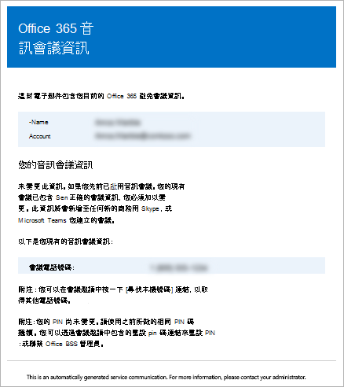

# 在 Microsoft 團隊中傳送電子郵件給使用者的音訊會議資訊

有時候，Microsoft 團隊使用者可能需要您傳送其音訊會議資訊。 您可以按一下使用者屬性底下的 [透過**電子郵件傳送會議資訊**] 來執行此動作。 傳送此電子郵件時，它會包含所有音訊會議資訊，包括：
  
- 使用者的會議電話或撥入電話號碼。
    
- 使用者的會議 ID。
    
   
以下是傳送的電子郵件範例：
  

> [!NOTE]
> [!INCLUDE [updating-admin-interfaces](includes/updating-admin-interfaces.md)]
  
## 使用音訊會議資訊傳送電子郵件給使用者

### ![顯示 Microsoft [小組標誌] 的圖示](media/teams-logo-30x30.png) 使用 Microsoft 團隊系統管理中心

1. 在左側導覽中，按一下 [**使用者**]，然後從可用使用者清單中選取使用者。

2. 按一下頁面頂端的 [**編輯**]。

3. 在 [**音訊會議**] 底下，按一下 [**以電子郵件傳送會議資訊**]。

## 關於此電子郵件，您還需要知道什麼？

- 在啟用音訊會議之後，會有幾封電子郵件會傳送給貴組織中的使用者：
    
  - 將**音訊會議**授權指派給他們時。
    
  - 當您手動重設使用者的音訊會議 PIN 時。
    
  - 手動重設使用者的會議 ID。
    
  - 從他們移除**音訊會議**授權時。
    
  - 當使用者的音訊會議提供者從 Microsoft 變更為另一提供者或 [**無**] 時。
    
  - 當使用者的音訊會議提供者變更為 Microsoft 時。
  
## 想要深入瞭解 Windows PowerShell 嗎？

Windows PowerShell 全部說明如何管理使用者，以及允許或不允許的使用者執行。 在 Windows PowerShell 中，您可以使用單一管理點來管理 Office 365，以便在有多項工作需要執行時簡化日常作業。 若要開始使用 Windows PowerShell，請參閱以下主題：
    
  - [為什麼需要使用 Office 365 PowerShell](https://go.microsoft.com/fwlink/?LinkId=525041)
    
  - [使用 Windows PowerShell 管理 Office 365 的最佳方式](https://go.microsoft.com/fwlink/?LinkId=525142)
    
如需有關 Windows PowerShell 的詳細資訊，請參閱[Microsoft 團隊 PowerShell 參考](https://docs.microsoft.com/powershell/module/teams/?view=teams-ps)，以取得詳細資訊。
    
  
## 相關主題

[試用或購買 Office 365 的音訊會議](/SkypeForBusiness/audio-conferencing-in-office-365/try-or-purchase-audio-conferencing-in-office-365)
