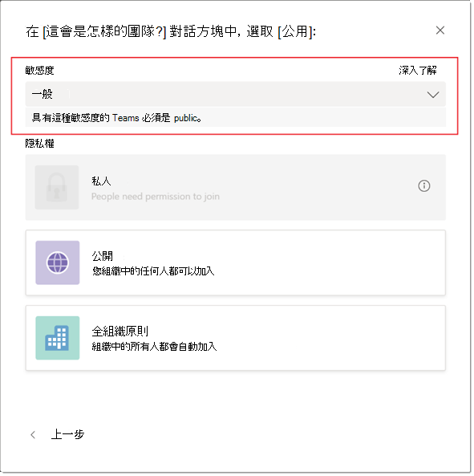
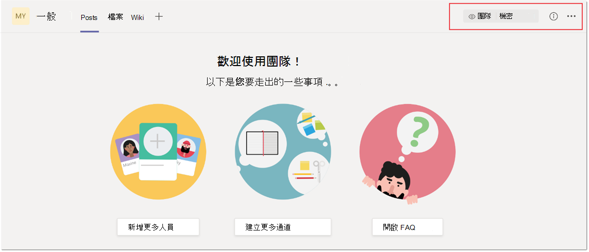
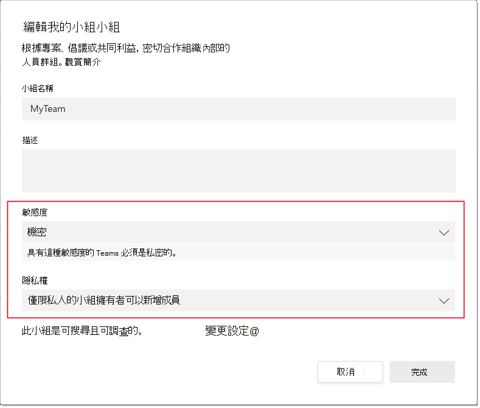

# <a name="sensitivity-labels-for-microsoft-teams"></a><span data-ttu-id="ebd41-103">Microsoft 團隊的敏感度標籤</span><span class="sxs-lookup"><span data-stu-id="ebd41-103">Sensitivity labels for Microsoft Teams</span></span>

<span data-ttu-id="ebd41-104">[敏感度標籤](https://docs.microsoft.com/microsoft-365/compliance/sensitivity-labels) 可讓團隊管理員控制在團隊中共同作業期間建立的機密組織內容的存取權。</span><span class="sxs-lookup"><span data-stu-id="ebd41-104">[Sensitivity labels](https://docs.microsoft.com/microsoft-365/compliance/sensitivity-labels) allow Teams admins to regulate access to sensitive organizational content created during collaboration within teams.</span></span> <span data-ttu-id="ebd41-105">您可以在 [規範中心](https://docs.microsoft.com/microsoft-365/compliance/go-to-the-securitycompliance-center)定義敏感度標籤及其相關聯的原則。</span><span class="sxs-lookup"><span data-stu-id="ebd41-105">You can define sensitivity labels and their associated policies in the [Compliance Center](https://docs.microsoft.com/microsoft-365/compliance/go-to-the-securitycompliance-center).</span></span> <span data-ttu-id="ebd41-106">這些標籤與原則會自動套用至貴組織中的小組。</span><span class="sxs-lookup"><span data-stu-id="ebd41-106">These labels and policies are automatically applied to teams in your organization.</span></span>  

## <a name="whats-the-difference-between-sensitivity-labels-and-teams-classification-labels"></a><span data-ttu-id="ebd41-107">敏感度標籤與團隊保密標籤之間的差異為何？</span><span class="sxs-lookup"><span data-stu-id="ebd41-107">What's the difference between sensitivity labels and Teams classification labels?</span></span>

<span data-ttu-id="ebd41-108">敏感度標籤與分類標籤不同。</span><span class="sxs-lookup"><span data-stu-id="ebd41-108">Sensitivity labels are different from classification labels.</span></span> <span data-ttu-id="ebd41-109">分類標籤是可與 Microsoft 365 群組相關聯但沒有任何相關聯之實際原則的文字字串。</span><span class="sxs-lookup"><span data-stu-id="ebd41-109">Classification labels are text strings that can be associated with a Microsoft 365 Group but don't have any actual policies associated with them.</span></span> <span data-ttu-id="ebd41-110">您可以使用分類標籤做為中繼資料，透過內部工具和腳本手動強制執行原則。</span><span class="sxs-lookup"><span data-stu-id="ebd41-110">You use classification labels as metadata to manually enforce policies through internal tools and scripts.</span></span>

<span data-ttu-id="ebd41-111">另一方面，敏感度標籤及其原則會自動強制執行，以結合群組平臺、安全性 & 合規性中心及團隊服務的組合來進行。</span><span class="sxs-lookup"><span data-stu-id="ebd41-111">On the other hand, sensitivity labels and their policies are automatically enforced end-to-end through a combination of the Groups platform, Security & Compliance Center, and Teams services.</span></span> <span data-ttu-id="ebd41-112">敏感度標籤可提供強大的基礎結構支援，以保護貴組織的機密資料。</span><span class="sxs-lookup"><span data-stu-id="ebd41-112">Sensitivity labels provide powerful infrastructure support for securing your organization's sensitive data.</span></span>  

<span data-ttu-id="ebd41-113">若要將您現有的群組從使用分類標籤移至使用敏感度標籤，請使用 [Microsoft 365 群組的 Azure Active Directory 分類及敏感度標籤](https://docs.microsoft.com/microsoft-365/compliance/migrate-aad-classification-sensitivity-labels)中的指示。</span><span class="sxs-lookup"><span data-stu-id="ebd41-113">To migrate your existing groups from using classification labels to using sensitivity labels, use the instructions in [Azure Active Directory classification and sensitivity labels for Microsoft 365 groups](https://docs.microsoft.com/microsoft-365/compliance/migrate-aad-classification-sensitivity-labels).</span></span>

## <a name="create-manage-and-publish-sensitivity-labels-for-teams"></a><span data-ttu-id="ebd41-114">建立、管理及發佈小組的敏感度標籤</span><span class="sxs-lookup"><span data-stu-id="ebd41-114">Create, manage, and publish sensitivity labels for Teams</span></span>

<span data-ttu-id="ebd41-115">如需如何啟用、建立及發佈小組的敏感度標籤，請參閱 [使用敏感度標籤來保護 Microsoft 團隊、microsoft 365 群組和 SharePoint 網站中的內容](https://docs.microsoft.com/microsoft-365/compliance/sensitivity-labels-teams-groups-sites)。</span><span class="sxs-lookup"><span data-stu-id="ebd41-115">For how to enable, create, and publish sensitivity labels for Teams, see [Use sensitivity labels to protect content in Microsoft Teams, Microsoft 365 groups, and SharePoint sites](https://docs.microsoft.com/microsoft-365/compliance/sensitivity-labels-teams-groups-sites).</span></span>

>[!IMPORTANT]
><span data-ttu-id="ebd41-116">建立、更新及刪除敏感度標籤時，需要小心地將發佈標籤與使用者進行排序。</span><span class="sxs-lookup"><span data-stu-id="ebd41-116">Creating, updating and deleting sensitivity labels require careful sequencing with publishing labels to users.</span></span> <span data-ttu-id="ebd41-117">順序中的任何偏差都可能會導致所有使用者的持續性團隊建立錯誤。</span><span class="sxs-lookup"><span data-stu-id="ebd41-117">Any deviation in the sequence can result in persistent team creation errors for all users.</span></span> <span data-ttu-id="ebd41-118">因此，當您 <a href="#createpublishlabels">建立及發佈標籤</a>、 <a href="#modifydeletelabels">修改及刪除已發佈的標籤</a>，以及 <a href="#manageerrors">管理團隊建立錯誤</a>時，請務必執行下列動作。</span><span class="sxs-lookup"><span data-stu-id="ebd41-118">Therefore, it's critical to do the following when you <a href="#createpublishlabels">create and publish labels</a>, <a href="#modifydeletelabels">modify and delete published labels</a>, and <a href="#manageerrors">manage team creation errors</a>.</span></span>

<span data-ttu-id="ebd41-119">**建立及發佈標籤** <a name="createpublishlabels"></a></span><span class="sxs-lookup"><span data-stu-id="ebd41-119">**Create and publish labels** <a name="createpublishlabels"> </a></span></span>

<span data-ttu-id="ebd41-120">在合規性中心建立及發佈標籤時，最多可能需要10分鐘的時間才能讓標籤在團隊建立介面中變為可見。</span><span class="sxs-lookup"><span data-stu-id="ebd41-120">When a label is created and published in the Compliance Center, it can take up to 10 minutes for the label to become visible in the teams creation interface.</span></span> <span data-ttu-id="ebd41-121">使用下列步驟來發佈租使用者中所有使用者的標籤：</span><span class="sxs-lookup"><span data-stu-id="ebd41-121">Use the following steps to publish the label for all users in the tenant:</span></span>
1. <span data-ttu-id="ebd41-122">建立標籤並將其發佈，以在租使用者中進行幾個選取的使用者帳戶。</span><span class="sxs-lookup"><span data-stu-id="ebd41-122">Create the label and publish it for a few select user accounts in the tenant.</span></span>
2. <span data-ttu-id="ebd41-123">在標籤發佈時，請等候10分鐘。</span><span class="sxs-lookup"><span data-stu-id="ebd41-123">When the label is published, wait 10 minutes.</span></span>
3. <span data-ttu-id="ebd41-124">10分鐘之後，嘗試使用可存取標籤的其中一個使用者帳戶來建立擁有標籤的小組。</span><span class="sxs-lookup"><span data-stu-id="ebd41-124">After 10 minutes, try to create a team with the label using one of the user accounts that have access to the label.</span></span>
4. <span data-ttu-id="ebd41-125">如果團隊在步驟3中成功建立，請繼續進行併發布租使用者中其餘使用者的標籤。</span><span class="sxs-lookup"><span data-stu-id="ebd41-125">If the team successfully created in step 3, then go ahead and publish the label for the remaining users in the tenant.</span></span>

<span data-ttu-id="ebd41-126">**修改及刪除已發佈的標籤** <a name="modifydeletelabels"></a></span><span class="sxs-lookup"><span data-stu-id="ebd41-126">**Modify and delete published labels** <a name="modifydeletelabels"> </a></span></span>

<span data-ttu-id="ebd41-127">刪除或修改與靈敏度原則相關聯的標籤時，可能會導致小組建立跨租使用者失敗。</span><span class="sxs-lookup"><span data-stu-id="ebd41-127">Deleting or modifying the label while it's associated with sensitivity policies can result in team creation failures across the tenant.</span></span> <span data-ttu-id="ebd41-128">因此，在您刪除或修改標籤之前，您必須先解除標籤與其相關聯原則的關聯。</span><span class="sxs-lookup"><span data-stu-id="ebd41-128">Therefore, before you delete or modify a label, you must first disassociate the label from its associated policies.</span></span> <span data-ttu-id="ebd41-129">使用下列步驟</span><span class="sxs-lookup"><span data-stu-id="ebd41-129">Use the following steps</span></span>  
<span data-ttu-id="ebd41-130">若要刪除或修改標籤：</span><span class="sxs-lookup"><span data-stu-id="ebd41-130">to delete or modify a label:</span></span>
1. <span data-ttu-id="ebd41-131">從使用標籤的所有原則中移除標籤。</span><span class="sxs-lookup"><span data-stu-id="ebd41-131">Remove the label from all policies that use the label.</span></span> <span data-ttu-id="ebd41-132">或者，您也可以刪除原則本身。</span><span class="sxs-lookup"><span data-stu-id="ebd41-132">Alternatively, you can also delete the policies themselves.</span></span>
2. <span data-ttu-id="ebd41-133">從原則移除標籤，或原則本身遭到刪除時，請稍等10分鐘，然後再繼續進行。</span><span class="sxs-lookup"><span data-stu-id="ebd41-133">When the label is removed from the policies or the policies themselves are deleted, wait 10 minutes before proceeding further.</span></span>
3. <span data-ttu-id="ebd41-134">10分鐘後，啟動團隊建立介面，並確認租使用者中的任何使用者都看不到該標籤。</span><span class="sxs-lookup"><span data-stu-id="ebd41-134">After 10 minutes, launch the team creation interface and ensure that the label is no longer visible for any user in the tenant.</span></span>
4. <span data-ttu-id="ebd41-135">現在，您可以安全地刪除或修改標籤。</span><span class="sxs-lookup"><span data-stu-id="ebd41-135">Now you can safely delete or modify the label.</span></span>

<span data-ttu-id="ebd41-136">**管理團隊建立錯誤** <a name="manageerrors"></a></span><span class="sxs-lookup"><span data-stu-id="ebd41-136">**Manage team creation errors** <a name="manageerrors"> </a></span></span>

<span data-ttu-id="ebd41-137">如果小組建立在公眾預覽版期間開始失敗，您有兩個選項：</span><span class="sxs-lookup"><span data-stu-id="ebd41-137">If team creation begins to fail at any point during the public preview, you have two options:</span></span>
 - <span data-ttu-id="ebd41-138">在小組建立期間，請確定任何使用者都不強制使用敏感度標籤。</span><span class="sxs-lookup"><span data-stu-id="ebd41-138">Ensure that sensitivity labels are not mandatory for any user during team creation.</span></span>
 - <span data-ttu-id="ebd41-139">使用 [ [啟用此預覽](https://docs.microsoft.com/microsoft-365/compliance/sensitivity-labels-teams-groups-sites#enable-this-preview)] 中的腳本關閉敏感度標籤。</span><span class="sxs-lookup"><span data-stu-id="ebd41-139">Turn off sensitivity labels using the scripts in [Enable this preview](https://docs.microsoft.com/microsoft-365/compliance/sensitivity-labels-teams-groups-sites#enable-this-preview).</span></span>

<span data-ttu-id="ebd41-140">請注意，EnableMIPLabels 設定必須設定為 false，如下所示：</span><span class="sxs-lookup"><span data-stu-id="ebd41-140">Note that the EnableMIPLabels setting must be set to false as follows:</span></span>

```console
$setting["EnableMIPLabels"] = "False"
```

## <a name="using-sensitivity-labels-with-teams"></a><span data-ttu-id="ebd41-141">在團隊中使用敏感度標籤</span><span class="sxs-lookup"><span data-stu-id="ebd41-141">Using sensitivity labels with Teams</span></span>

<span data-ttu-id="ebd41-142">以下是一些範例，說明如何將敏感度標籤與組織中的小組搭配使用。</span><span class="sxs-lookup"><span data-stu-id="ebd41-142">Here are some example scenarios of how you can use sensitivity labels with Teams in your organization.</span></span>

### <a name="privacy-setting-of-teams"></a><span data-ttu-id="ebd41-143">團隊的隱私權設定</span><span class="sxs-lookup"><span data-stu-id="ebd41-143">Privacy setting of teams</span></span>

<span data-ttu-id="ebd41-144">您可以建立可在小組建立期間套用的敏感度標籤，讓使用者能夠在公開或私人) 設定中，建立具有特定隱私權 (小組。</span><span class="sxs-lookup"><span data-stu-id="ebd41-144">You can create a sensitivity label that, when applied during team creation, allows users to create teams with a specific privacy (public or private) setting.</span></span>

<span data-ttu-id="ebd41-145">例如，您會在安全性 & 合規性中心建立名為 "機密" 的標籤，並設定團隊，讓使用此標籤建立的任何小組都必須是私人團隊。</span><span class="sxs-lookup"><span data-stu-id="ebd41-145">For example, you create a label named “Confidential” in the Security & Compliance Center and you configure Teams so that any team that's created with this label must be a private team.</span></span> <span data-ttu-id="ebd41-146">當使用者建立新的小組並選取 [ **機密** ] 標籤時，使用者可以使用的唯一隱私權選項是 [ **私人**]。</span><span class="sxs-lookup"><span data-stu-id="ebd41-146">When a user creates a new team and selects the **Confidential** label, the only privacy option that's available to the user is **Private**.</span></span> <span data-ttu-id="ebd41-147">使用者已停用其他隱私權選項，例如公用與組織範圍。</span><span class="sxs-lookup"><span data-stu-id="ebd41-147">Other privacy options such as Public and Org-wide are disabled for the user.</span></span>

![[機密敏感度] 標籤的螢幕擷取畫面](media/sensitivity-labels-confidential-example.png)

<span data-ttu-id="ebd41-149">同樣地，如果使用者在建立新團隊時選取 **[一般** ]，他們就只能建立公用或組織範圍的團隊。</span><span class="sxs-lookup"><span data-stu-id="ebd41-149">Similarly, if the user selects **General** when they create a new team, they can only create public or org-wide teams.</span></span>



<span data-ttu-id="ebd41-151">建立小組後，[敏感度] 標籤會顯示在小組中頻道的右上角。</span><span class="sxs-lookup"><span data-stu-id="ebd41-151">When the team is created, the sensitivity label is visible in the upper-right corner of channels in the team.</span></span>



<span data-ttu-id="ebd41-153">小組擁有者可以隨時變更團隊的敏感度標籤和隱私權設定，只要前往小組，然後按一下 [ **編輯團隊**] 即可。</span><span class="sxs-lookup"><span data-stu-id="ebd41-153">A team owner can change the sensitivity label and the privacy setting of the team at any time by going to the team, and then clicking **Edit team**.</span></span>



### <a name="guest-access-to-teams"></a><span data-ttu-id="ebd41-155">對團隊的來賓存取權</span><span class="sxs-lookup"><span data-stu-id="ebd41-155">Guest access to teams</span></span>

<span data-ttu-id="ebd41-156">您可以指定使用特定標籤建立的小組是否允許來賓存取。</span><span class="sxs-lookup"><span data-stu-id="ebd41-156">You can specify whether a team created with a specific label allows guest access.</span></span> <span data-ttu-id="ebd41-157">只有貴組織中的使用者可以使用不允許來賓存取權的標籤建立的團隊。</span><span class="sxs-lookup"><span data-stu-id="ebd41-157">Teams created with a label that doesn't allow guest access are only available to users in your organization.</span></span> <span data-ttu-id="ebd41-158">您組織外部的人員無法新增至小組。</span><span class="sxs-lookup"><span data-stu-id="ebd41-158">People outside your organization can't be added to the team.</span></span>

### <a name="sensitivity-labels-in-the-microsoft-teams-admin-center"></a><span data-ttu-id="ebd41-159">Microsoft 團隊系統管理中心的敏感度標籤</span><span class="sxs-lookup"><span data-stu-id="ebd41-159">Sensitivity labels in the Microsoft Teams admin center</span></span>

<span data-ttu-id="ebd41-160">您可以在 Microsoft 團隊系統管理中心建立或編輯小組時，設定敏感度標籤。</span><span class="sxs-lookup"><span data-stu-id="ebd41-160">You can set sensitivity labels when you create or edit a team in the Microsoft Teams admin center.</span></span> <span data-ttu-id="ebd41-161">在團隊屬性以及 Microsoft 團隊系統管理中心 [管理團隊] 頁面上的 [ **分類** ] 欄中，也會顯示敏感度標籤。</span><span class="sxs-lookup"><span data-stu-id="ebd41-161">Sensitivity labels are also visible in team properties and in the **Classification** column on the Manage teams page of the Microsoft Teams admin center.</span></span>

## <a name="known-issues"></a><span data-ttu-id="ebd41-162">已知問題</span><span class="sxs-lookup"><span data-stu-id="ebd41-162">Known issues</span></span>

<span data-ttu-id="ebd41-163">**支援小組圖形 Api、PowerShell Cmdlet 及範本中的敏感度標籤**</span><span class="sxs-lookup"><span data-stu-id="ebd41-163">**Support for sensitivity labels in Teams Graph APIs, PowerShell cmdlets and templates**</span></span>

<span data-ttu-id="ebd41-164">目前，使用者將無法在直接透過圖形 Api、PowerShell Cmdlet 及範本建立的小組上套用敏感度標籤。</span><span class="sxs-lookup"><span data-stu-id="ebd41-164">Currently, users won't be able to apply sensitivity labels on teams that are created directly through Graph APIs, PowerShell cmdlets, and templates.</span></span>

<span data-ttu-id="ebd41-165">**在團隊 EDU Sku 中支援敏感度標籤**</span><span class="sxs-lookup"><span data-stu-id="ebd41-165">**Support for sensitivity labels in Teams EDU SKUs**</span></span>

<span data-ttu-id="ebd41-166">目前不支援使用團隊教育版 Sku 的客戶使用敏感度標籤。</span><span class="sxs-lookup"><span data-stu-id="ebd41-166">Sensitivity labels are currently unsupported for customers using Teams Education SKUs.</span></span>

<span data-ttu-id="ebd41-167">**在私人頻道的 SharePoint 網站集合上直接編輯敏感度標籤**</span><span class="sxs-lookup"><span data-stu-id="ebd41-167">**Editing sensitivity labels directly on a SharePoint site collection for private channels**</span></span>

<span data-ttu-id="ebd41-168">在團隊中建立的專用頻道會繼承已套用在小組中的敏感度標籤。</span><span class="sxs-lookup"><span data-stu-id="ebd41-168">Private channels that are created in a team inherit the sensitivity label which was applied on a team.</span></span> <span data-ttu-id="ebd41-169">此外，在 [私人頻道] 的 SharePoint 網站集合上會自動套用相同的標籤。</span><span class="sxs-lookup"><span data-stu-id="ebd41-169">Furthermore, the same label is automatically applied on the SharePoint site collection for the private channel.</span></span>

<span data-ttu-id="ebd41-170">如果使用者直接更新私人頻道之 SharePoint 網站集合上的敏感度標籤，就不會在團隊用戶端中更新該標籤。</span><span class="sxs-lookup"><span data-stu-id="ebd41-170">If a user directly updates the sensitivity label on a SharePoint site collection for a private channel, that label isn't updated in the Teams client.</span></span> <span data-ttu-id="ebd41-171">在這種情況下，使用者會繼續在私人通道標題中查看在團隊上套用的敏感度標籤。</span><span class="sxs-lookup"><span data-stu-id="ebd41-171">In this scenario, users will continue to see the sensitivity label applied on a team in the private channel header.</span></span>

<span data-ttu-id="ebd41-172">**套用至團隊 app 外敏感度標籤變更的傳播時間**</span><span class="sxs-lookup"><span data-stu-id="ebd41-172">**Propagation times for changes applied to sensitivity labels outside the Teams app**</span></span>

<span data-ttu-id="ebd41-173">在團隊 app 外對敏感度標籤所做的變更，可能需要長達24小時才能反映在團隊 app 中。</span><span class="sxs-lookup"><span data-stu-id="ebd41-173">Changes made to sensitivity labels outside the Teams app can take up to 24 hours to reflect in the Teams app.</span></span> <span data-ttu-id="ebd41-174">這適用于針對您啟用或停用租使用者的標籤所做的任何變更、標籤名稱、設定及原則的變更。</span><span class="sxs-lookup"><span data-stu-id="ebd41-174">This applies to any changes made to enable or disable labels for a tenant, changes to label names, settings, and policies.</span></span>

<span data-ttu-id="ebd41-175">此外，直接針對支援小組的群組或 SharePoint 網站集合所做的任何變更，都可能需要長達24小時才能傳播至團隊 app。</span><span class="sxs-lookup"><span data-stu-id="ebd41-175">Additionally, any changes to a label made directly to a group or SharePoint site collection that backs the team can take up to 24 hours to propagate to the Teams app.</span></span>
