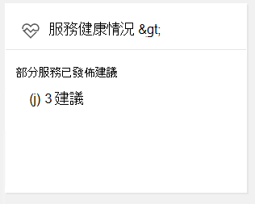
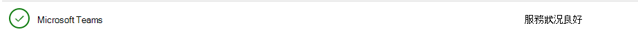

# 驗證服務健康Microsoft Teams

系統會顯示Microsoft Teams服務健康Microsoft 365 系統管理中心。 在疑難排解問題之前，最佳做法是確認服務Teams正常。 請前往服務<a href=" https://admin.microsoft.com/adminportal/home?ref=servicehealth" target="_blank">Teams</a>主控台，以檢查服務健康狀態。

此外，請記住，Microsoft Teams是建在其他 Microsoft 365 或 Office 365 服務上，因此當您查看服務健康情況時，請記得同時檢查 Exchange、SharePoint 和 商務用 OneDrive 的狀態。 這些其他服務的服務健康情況問題不會自動表示 Teams 受到影響 (例如，Exchange 中的通訊錄下載無法使用) ，但您應該查看受影響服務的建議，判斷對 Microsoft Teams 是否有影響。

## 相關主題

[Teams 疑難排解](/MicrosoftTeams/troubleshoot/teams)
