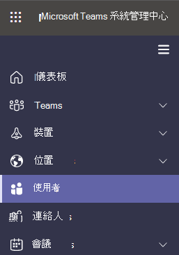

# 在 Microsoft 團隊中設定邀請中所包含的電話號碼Set the phone numbers included on invites in Microsoft Teams

Microsoft 365 和 Office 365 中的音訊會議可讓貴組織中的使用者建立 Microsoft 團隊會議，然後允許使用者使用電話撥入這些會議。Audio Conferencing in Microsoft 365 and Office 365 enables users in your organization to create Microsoft Teams meetings, and then allow users to dial in to those meetings using a phone.
  
「會議橋接」會為您的組織提供一組撥入電話號碼。A conferencing bridge gives you a set of dial-in phone numbers for your organization. 所有這些專案都可以用來加入會議召集人所建立的會議，但您可以選取哪些專案會包含在他們的會議邀請中。All of them can be used to join the meetings that a meeting organizer has created, but you can select which ones will be included on their meeting invites.
  
> [!NOTE]
> 在會議召集人的會議邀請中，最多隻能有一個付費電話號碼，還有一個免付費電話號碼，在每個會議邀請的底部，都會開啟完整的清單，其中包含可用於加入會議的所有電話撥入電話號碼。There can be a maximum of one toll and one toll-free phone number on the meeting invite for a meeting organizer, but there is also a link located at the bottom of each meeting invite that opens the full list of all dial-in phone numbers that can be used to join a meeting.

> [!NOTE]
> [!INCLUDE [updating-admin-interfaces](includes/updating-admin-interfaces.md)]
  
## 新使用者的會議邀請中所包含的電話號碼初始指派Initial assignment of phone numbers that are included in the meeting invites for new users

在啟用音訊會議之使用者的會議邀請中所包含的電話號碼，是由預設的會議付費電話號碼和預設的會議免付費電話號碼使用者設定所定義。The phone numbers that get included in the meeting invites of users enabled for Audio Conferencing are defined by the default conferencing toll phone number and the default conferencing toll-free phone number user's settings. 每個設定都會指定要在指定使用者的會議邀請中包含哪些免付費電話號碼和免付費電話號碼。Each setting specifies which toll and toll-free number will be included in the meeting invite of a given user. 如上所述，每個會議邀請都包含一份收費電話號碼，一個可選的免付費電話號碼和一個連結，可開啟完整清單，供您用來加入特定會議的所有電話撥入電話號碼。As noted above, each meeting invite contains one toll number, one optional toll-free number and a link that opens the full list of all dial-in phone numbers that can be used to join a given meeting.

針對新使用者，系統會根據在使用者啟用音訊會議服務時，在使用者的 Microsoft 365 系統管理中心設定的使用位置來指派預設的會議付費電話號碼。For a new user, the default conferencing toll numbers is assigned based on the Usage Location that is set in the Microsoft 365 administration center of the user when the user is enabled for the Audio Conferencing service. 如果在會議橋中有一個與使用者的國家/地區相符的收費號碼，該號碼會自動指派為使用者的預設付費號碼。If there is a toll number in the conference bridge that matches the country of the user, that number will be automatically assigned as the default toll number of the user. 如果沒有其中一個號碼，則會將定義為會議橋接器預設收費號碼的號碼指派為使用者的預設付費號碼。If there isn't one, the number that is defined as the default toll number of the conference bridge will be assigned as the default toll number of the user.  

在使用者啟用音訊會議服務之後，租使用者可隨時從其初始值變更使用者的預設付費電話號碼和免付費電話號碼。Once the user is enabled for the Audio Conferencing service, the default toll and toll-free phone numbers of the user can be changed by the tenant administrator from their initial values at any moment.

## 設定或變更會議召集人或使用者的預設音訊會議電話號碼Set or change the default audio conferencing phone number for a meeting organizer or user

 **使用 Microsoft Teams 系統管理中心** **Using the Microsoft Teams admin center**

您必須是團隊服務管理員，才能進行這些變更。You must be a Teams service admin to make these changes. 請參閱[使用團隊管理員角色管理團隊](https://docs.microsoft.com/microsoftteams/using-admin-roles)，瞭解如何取得管理員角色和許可權。See [Use Teams administrator roles to manage Teams](https://docs.microsoft.com/microsoftteams/using-admin-roles) to read about getting admin roles and permissions.

1. 登入 Microsoft 團隊系統管理中心。Log in to the Microsoft Teams admin center.

2. 在左側導覽中，按一下 [**使用者**]。In the left navigation, click **Users**.

    

3. 按一下可用使用者清單中的使用者名稱。Click the user name from the list of available users.

4. 按一下 [**音訊會議**] 旁的 [**編輯**]。Next to **Audio Conferencing**, click **Edit**.

    ![按一下 [音訊會議] 旁的 [編輯]](media/teams-set-phone-numbers-on-invites-image3.png)

5. 使用 [**付費電話號碼**] 或 [**免付費電話號碼**] 欄位輸入使用者的號碼。Use the **Toll number** or **Toll-free number** fields to enter the numbers for the user.

> [!IMPORTANT]
> 當您變更使用者的音訊會議設定時，必須更新定期及未來的 Microsoft 團隊會議，並傳送給出席者。When you change a user's audio conferencing settings, recurring and future Microsoft Teams meetings must be updated and sent to attendees.

## 想要使用 Windows PowerShellWant to use Windows PowerShell

Windows PowerShell 全部說明如何管理使用者，以及允許或不允許的使用者執行。Windows PowerShell is all about managing users and what users are allowed or not allowed to do. 在 Windows PowerShell 中，您可以使用單一管理點來管理 Microsoft 365 或 Office 365，以便在您有多個工作執行時簡化日常作業。With Windows PowerShell, you can manage Microsoft 365 or Office 365 by using a single point of administration that can simplify your daily work when you have multiple tasks to do. 若要開始使用 Windows PowerShell，請參閱以下主題：To get started with Windows PowerShell, see these topics:

- [為什麼需要使用 Office 365 PowerShellWhy you need to use Office 365 PowerShell](https://go.microsoft.com/fwlink/?LinkId=525041)

- [使用 Windows PowerShell 管理 Microsoft 365 或 Office 365 的最佳方式Best ways to manage Microsoft 365 or Office 365 with Windows PowerShell](https://go.microsoft.com/fwlink/?LinkId=525142)

如需有關 Windows PowerShell 的詳細資訊，請參閱[Microsoft 團隊 PowerShell 參考](https://docs.microsoft.com/powershell/module/teams/?view=teams-ps)，以取得詳細資訊。For more information about Windows PowerShell, see the [Microsoft Teams PowerShell reference](https://docs.microsoft.com/powershell/module/teams/?view=teams-ps) for more information.
  
## 相關主題Related topics

[在 Microsoft 365 或 Office 365 中試用或購買音訊會議Try or purchase Audio Conferencing in Microsoft 365 or Office 365](/SkypeForBusiness/audio-conferencing-in-office-365/try-or-purchase-audio-conferencing-in-office-365)

[變更音訊會議橋接器的電話號碼Change the phone numbers on your Audio Conferencing bridge](change-the-phone-numbers-on-your-audio-conferencing-bridge.md)
