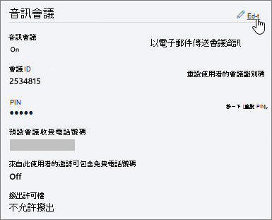

# 設定邀請中包含的電話號碼Microsoft Teams

Microsoft 365 Office 365音訊會議可讓貴組織的使用者Microsoft Teams會議，然後允許使用者使用電話撥入這些會議。
  
會議橋接器會提供您組織的一組撥入電話號碼。 所有會議都可以用來加入會議召集人所建立的會議，但您可以選取哪些會議邀請會包含在會議邀請中。
  
> [!NOTE]
> 會議邀請的會議召集人最多可以有一個付費電話和一個免付費電話號碼，但每個會議邀請底部也有一個連結，可開啟可用來加入會議之所有撥入電話號碼的完整清單。

> [!NOTE]
> [!INCLUDE [updating-admin-interfaces](includes/updating-admin-interfaces.md)]
  
## 新使用者會議邀請中包含的電話號碼初始指派

啟用音訊會議之使用者的會議邀請中包含的電話號碼是由預設的會議付費電話號碼和預設免付費電話號碼使用者的設定所定義。 每個設定會指定指定使用者的會議邀請中會包含哪些付費和免付費號碼。 如上所述，每個會議邀請都包含一個付費號碼、一個選擇性免付費號碼，以及一個連結，可開啟可用來加入給定會議之所有撥入電話號碼的完整清單。

對於新使用者，預設會議付費號碼會根據使用者啟用音訊會議服務時在 Microsoft 365 系統管理中心中設定的使用位置來指派。 如果會議橋接器中的付費號碼符合使用者的國家/地區，該號碼會自動指派為使用者的預設付費號碼。 如果沒有號碼，則定義為會議橋接器預設付費號碼的號碼會指派為使用者的預設付費號碼。  

使用者啟用音訊會議服務後，使用者的預設付費和免付費電話號碼隨時都可以由租使用者系統管理員從初始值變更。

## 設定或變更會議召集人或使用者的預設音訊會議電話號碼

 **使用 Microsoft Teams 系統管理中心**

您必須是 Teams 服務系統管理員才能進行這些變更。 請參閱[使用 Teams 系統管理員角色來管理 Teams](./using-admin-roles.md)，以了解取得系統管理員角色和權限。

1. 登入系統管理Microsoft Teams中心。

2. 在左側流覽中，按一下 [ **使用者>**。

    

3. 從可用使用者清單中按一下使用者名稱。

4. 在 [ **音訊會議」 旁**，按一下 [ **編輯>**。

    

5. 使用 **付費號碼** 或 **免付費號碼欄位** 輸入使用者的數位。

> [!IMPORTANT]
> 當您變更使用者的音訊會議設定時，週期性Microsoft Teams會議必須更新併發送給出席者。

## 想要使用Windows PowerShell

Windows PowerShell管理使用者，以及允許或不允許使用者執行哪些操作。 您可以使用Windows PowerShell管理Microsoft 365或Office 365管理點，當您有多個工作需要執行時，可以簡化您的日常工作。 若要開始使用Windows PowerShell，請參閱以下主題：

- [為什麼您需要使用 PowerShell Office 365 PowerShell](/microsoft-365/enterprise/why-you-need-to-use-microsoft-365-powershell)

- [使用 Microsoft 365 管理Office 365或Windows PowerShell](/previous-versions//dn568025(v=technet.10))

若要使用 [Microsoft Teams PowerShell](/powershell/module/teams/?view=teams-ps)設定或變更會議召集人或使用者的預設音訊會議電話號碼，請設定 **`ServiceNumber`** **`TollFreeServiceNumber`** [Set-CsOnlineDialInConferencingUser](/powershell/module/skype/set-CsOnlineDialInConferencingUser?view=skype-ps) Cmdlet 的或參數至其中一個可用號碼。

## 相關主題

[嘗試或購買音訊會議Microsoft 365或Office 365](/SkypeForBusiness/audio-conferencing-in-office-365/try-or-purchase-audio-conferencing-in-office-365)

[變更音訊會議橋接器的電話號碼](change-the-phone-numbers-on-your-audio-conferencing-bridge.md)
