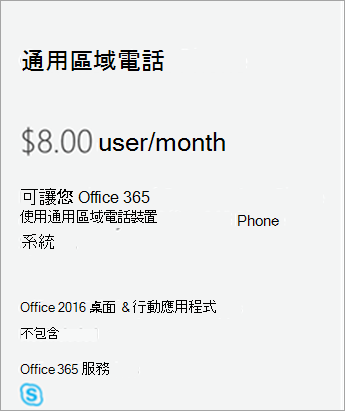
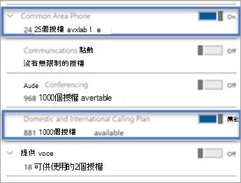
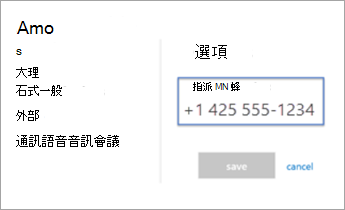

# 設定 Microsoft 團隊的通用區域電話授權
> [!NOTE]
> 常見的區域電話不支援語音信箱。

常見的區域手機通常放在大廳或其他區域（可供許多人撥打通話）的區域中。例如，接收區域、會議廳或會議電話。 常見的局域網已登入與通用區域電話授權相關聯的帳戶。 您也必須適當地設定 TeamsIPPhone 原則，才能讓手機擁有共同的區域使用者體驗。

在下列步驟中，我們將協助您設定電話系統帳戶，以便為您的組織部署常見的區域電話。 如需更完整的會議室體驗（包括音訊會議），請考慮使用會議室裝置購買專用的會議室授權。 

首先，您需要購買通用的區域電話 (CAP) 授權，並確認您有已認證的電話。 若要搜尋並深入瞭解認證的手機，請移至 [Microsoft 團隊裝置](https://products.office.com/microsoft-teams/across-devices?ms.url=officecomteamsdevices&rtc=1)。 

## 步驟 1-購買授權

1. 在 Microsoft 365 系統管理中心中，移至 [**帳單**  >  **購買服務**]，然後展開**其他方案**。

    

2. 選取 [**通用區域電話**  >  **立即購買**]。

3. 在 [結帳] 頁面上，按一下 [ **立即購買**]。

4. 展開 [ **附加元件訂閱** ]，然後按一下以購買通話方案。 選擇 [ **國內通話方案** ] 或 [ **國內與國際通話方案**]。

> [!NOTE]
> 如果您使用的是 Microsoft Phone 系統 Direct 路由，則不需要通話方案授權。

> [!NOTE]
> 您不需要新增電話系統授權。 它包含在通用區域電話授權中。

如需授權的詳細資訊，請參閱 [Microsoft 團隊附加元件授權](https://docs.microsoft.com/microsoftteams/teams-add-on-licensing/microsoft-teams-add-on-licensing)。

常見的區域電話授權支援： 

|   |  常見的區域電話  |
|---------|---------|
|商務用 Skype |   &#x2714; |
|Microsoft Teams |   &#x2714; |
|電話系統 |    &#x2714; |
|音訊會議 |       &#x2718; &sup1;  |
|Microsoft Intune |        &#x2718; &sup2; |
|全球可用性 |    &#x2714; |
|頻道可用性 |    EA、EAS、CSP、GCC、EES、Web Direct  |
|      |         |

&sup1;常見的區域手機可透過會議召集人提供的撥入號碼加入音訊會議

&sup2;在主權雲彩中無法使用  

## 步驟 2-為手機建立新的使用者帳戶並指派授權

1. 在 Microsoft 365 系統管理中心，移至 [**使用者**作用中  >  的**使用者**]  >  **新增使用者**。

2. 針對第一個名稱輸入名為 "Main" 的使用者名稱，輸入 "接收" （第二個名稱）。

3. 如果沒有自動產生 [主要接收] 等命令，請輸入顯示名稱。

4. 輸入使用者名稱，例如 "MainReception" 或 "Mainlobby"。

5. 如果是常見的區域電話，您可能會想要手動設定密碼，或在所有常用的區域手機上使用相同的密碼。 此外，您也可以考慮清除 [ **讓此使用者在第一次登入時變更密碼** ] 核取方塊。

6. 指派授權給使用者。 在同一個頁面上，按一下以展開 [ **產品授權**]。 開啟 [通用區域手機]，然後挑選 **國內通話方案** 或 **國內和國際通話方案**。 

    

> [!NOTE]
> 如果您使用的是 Microsoft Phone 系統 Direct 路由，就不需要指派通話方案授權。

如需詳細資訊，請參閱 [指派授權給使用者](https://docs.microsoft.com/microsoft-365/admin/manage/assign-licenses-to-users)。

## 步驟 3-將電話號碼指派給通用區域電話使用者帳戶

使用 [團隊系統管理中心] 將號碼指派給使用者。

1. 在 [團隊管理中心] 中，選取 [**語音**  >  **電話號碼**]。

3.    從電話號碼清單中選取一個數位，然後按一下 [ **指派**]。

4. 在 [ **指派** ] 頁面上，于 [語音使用者] 方塊中，輸入將使用電話的使用者名稱，然後在 [ **選取語音使用者** ] 下拉式清單中選取使用者。

5. 接下來，您必須新增緊急位址。 選擇 [ **依城市搜尋**]、[ **依描述搜尋**] 或 [ **依位置** 從下拉式清單中搜尋]，然後在文字方塊中輸入 [城市]、[描述] 或 [位置]。 搜尋之後，請在 [ **選取緊急位址** ] 下查看，為您挑選合適的位址。

6. 按一下 [ **儲存** ]，您的使用者看起來會像這樣：

   

> [!NOTE]
> 使用者只有在已套用電話系統授權時，才會顯示。 如果您只這麼做，有時候使用者會在清單中顯示一個位。

如需詳細資訊，請參閱為 [您的使用者取得電話號碼](getting-phone-numbers-for-your-users.md)。

您也可以將您的電話號碼與其他運營商和「埠」取得聯繫，或將其轉接到 Microsoft 365 或 Office 365。 請參閱 [將電話號碼傳送給團隊](phone-number-calling-plans/transfer-phone-numbers-to-teams.md)。
