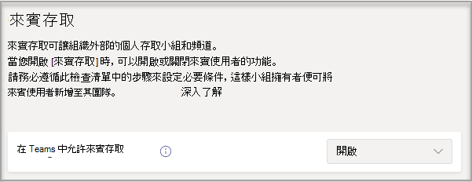

# 開啟或關閉 Microsoft Teams 的來賓存取Turn on or turn off guest access to Microsoft Teams

> [!Note]

> 在 **2021 年 2** 月之前，來賓存取預設為關閉。Until **February 2021**, guest access is turned off by default. 在系統管理員或小組擁有者可以新增來賓之前，必須為 Teams 開啟來賓存取。You must turn on guest access for Teams before admins or team owners can add guests. 開啟來賓存取權後，變更可能需要幾個小時才能生效。After you turn on guest access, it might take a few hours for the changes to take effect. 如果使用者在嘗試將來賓新到小組時看到訊息，請連上您的系統管理員，可能是來賓存取尚未開啟，或是設定尚未生效。If users see the message **Contact your administrator** when they try to add a guest to their team, it's likely that either guest access hasn't been turned on or the settings aren't effective yet.

> **2021** 年 2 月之後，對於尚未設定此設定的現有客戶&，Microsoft Teams 中的來賓存取預設會開啟。After **February 2021**, guest access in Microsoft Teams will be turned on by default for new customers & existing customers who haven't configured this setting. 執行此變更時，如果您尚未在 Microsoft Teams 中配置來賓存取功能，該功能就會在租使用者中啟用。When this change is implemented, if you've not already configured guest access capability in Microsoft Teams, that capability will be enabled in your tenant. 如果您希望貴組織的來賓存取保持停用狀態，您必須確認來賓存取設定已設定為 **關閉，而非\*\*\*\*服務預設值**。If you want guest access to remain disabled for your organization, you'll need to confirm that the guest access setting is set to **Off** instead of **Service default**.

> [!IMPORTANT]
> 開啟來賓存取取決於 Azure Active Directory、Microsoft 365、SharePoint 和 Teams 的設定。Turning on guest access depends on settings in Azure Active Directory, Microsoft 365, SharePoint, and Teams. 如需詳細資訊，請參閱 [在小組中與來賓共同作業](https://docs.microsoft.com/microsoft-365/solutions/collaborate-as-team)。For more information, see [Collaborate with guests in a team](https://docs.microsoft.com/microsoft-365/solutions/collaborate-as-team).

## 在 Teams 系統管理中心設定來賓存取Configure guest access in the Teams admin center

1. 登入 [Microsoft Teams 系統管理中心](https://admin.teams.microsoft.com/)。Sign in to the [Microsoft Teams admin center](https://admin.teams.microsoft.com/).

2. 選取 **[全組織設定]** > **[來賓存取]**。Select **Org-wide settings** > **Guest access**.

3. 將 **[允許 Microsoft Teams 中的來賓存取]** 設定為 **[開啟]**。Set **Allow guest access in Microsoft Teams** to **On**.

    

4. 在 **[通話]**、**[會議]** 和 **[通訊]** 下，根據要允許來賓使用者使用的功能，為每個功能選擇 **[開啟]** 或 **[關閉]**。Under **Calling**, **Meeting**, and **Messaging**, select **On** or **Off** for each capability, depending on what you want to allow for guest users.

      - **進行私人通話** – **[開啟]** 此設定可允許來賓進行對等呼叫。**Make private calls** – Turn this setting **On** to allow guests to make peer-to-peer calls.
      - **允許 IP 視訊** - **[開啟]** 此設定可允許來賓在其通話和會議中使用視訊。**Allow IP video** - Turn this setting **On** to allow guests to use video in their calls and meetings.
      - **螢幕畫面分享模式** – 此設定控制來賓使用者的螢幕畫面分享可用性。**Screen sharing mode** – This setting controls the availability of screen sharing for guest users.
          - 將此設定設定為 **[停用]** 以移除來賓在 Teams 中共用其螢幕的功能。Turn this setting to **Disabled** to remove the ability for guests to share their screens in Teams.
          - 將此設定設定為 **[單一應用程式]** 以允許共用單個應用程式。Turn this setting to **Single application** to allow sharing of individual applications.
          - 將此設定設定為 **[整個螢幕]** 以允許完整的螢幕畫面分享。Turn this setting to **Entire screen** to allow complete screen sharing.
      - **允許立即開會** – **[開啟]** 此設定可允許來賓使用 Microsoft Teams 中的 [立即開會] 功能。**Allow Meet Now** – Turn this setting **On** to allow guests to use the Meet Now feature in Microsoft Teams.
      - **編輯已傳送的訊息** - **[開啟]** 此設定可允許來賓編輯他們以前傳送的郵件。 **Edit sent messages** - Turn this setting **On** to allow guests to edit messages they previously sent.
      - **來賓可刪除已傳送的訊息** - **[開啟]** 此設定可允許來賓刪除他們以前傳送的郵件。 **Guests can delete sent messages** – Turn this setting **On** to allow guests to delete messages they previously sent.
      - **聊天** –**[開啟]** 此設定可使來賓能够在 Teams 中使用聊天。**Chat** – Turn this setting **On** to give guests the ability to use chat in Teams.
      - **在交談中使用 Giphy** – **[開啟]** 此設定可允許來賓在交談中使用 Giphys。**Use Giphys in conversations** – Turn this setting **On** to allow guests to use Giphys in conversations. Giphy 是線上資料庫和搜尋引擎，允許使用者搜尋和共用 GIF 動畫檔案。Giphy is an online database and search engine that allows users to search for and share animated GIF files. 每個 Giphy 都有內容分級。Each Giphy is assigned a content rating.
      - **Giphy 內容分級** –  從下拉式清單中選取分級：**Giphy content rating** –  Select a rating from the drop-down list:
          - **[允許所有內容]** - 來賓可以在聊天中插入所有 Giphy，而無論內容分級為何。**Allow all content** - Guests will be able to insert all Giphys in chats, regardless of the content rating.
          - **[中等]**，來賓可以在聊天中插入 Giphy，但會適當限制成人內容。**Moderate** - Guests will be able to insert Giphys in chats, but will be moderately restricted from adult content.
          - **嚴格** - 來賓可以在聊天中插入 Giphys，但禁止插入成人內容。**Strict** – Guests can insert Giphys in chats, but will be restricted from inserting adult content.
      - **在交談中使用 Meme** – **[開啟]** 此設定可允許來賓在交談中使用 Meme。**Use memes in conversations** - Turn this setting **On** to allow guests to use Memes in conversations.
      - **在交談中使用貼圖** – **[開啟]** 此設定可允許來賓在交談中使用貼圖。**Use Stickers in conversations** – Turn this setting **On** to allow guests to use stickers in conversations.

    

5. 選取 **儲存**。Select **Save**.

## 外部存取 (同盟) 與來賓存取External access (federation) vs. guest access

[!INCLUDE [guest-vs-external-access](includes/guest-vs-external-access.md)]

## 另請參閱See also

[使用 Microsoft 365 設定安全的共同作業Set up secure collaboration with Microsoft 365](https://docs.microsoft.com/microsoft-365/solutions/setup-secure-collaboration-with-teams)

[封鎖特定小組的來賓使用者Block guest users from a specific team](https://docs.microsoft.com/microsoft-365/solutions/per-group-guest-access)

[Set-CsTeamsClientConfigurationSet-CsTeamsClientConfiguration](https://docs.microsoft.com/powershell/module/skype/set-csteamsclientconfiguration)
