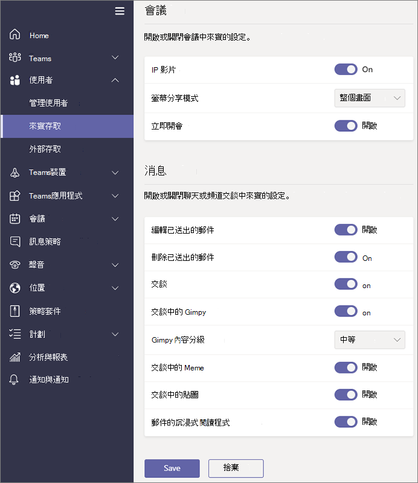

# 開啟或關閉Microsoft Teams中的來賓存取

本文說明如何在Teams中設定來賓存取設定，包括通話、會議和聊天。 Teams中的來賓存取也需要在 Microsoft 365 中設定其他設定，包括 Azure AD、Microsoft 365 群組 和 SharePoint 中的設定。 如果您準備好要開始邀請來賓使用 Teams，請閱讀下列其中一項：

- 若要為 Teams 設定一般使用的來賓存取，請參閱 [在小組中與來賓共同作業](/microsoft-365/solutions/collaborate-as-team)。
- 若要與合作夥伴組織共同作業，使用 Azure Active Directory 並允許來賓自行註冊以取得小組存取，請參閱 [使用受管理來賓建立 B2B 外部網路](/microsoft-365/solutions/b2b-extranet)。

> [!NOTE]
> 如果您只想尋找、通話、聊天及設定與其他組織人員的會議，請使用[外部存取](manage-external-access.md)。

## 在 Teams 系統管理中心設定來賓存取

1. 登入 [Microsoft Teams 系統管理中心](https://admin.teams.microsoft.com/)。

2. 選 **取 [UsersGuest**  >  **存取]**。

3. 將 [**在 Teams 中允許來賓存取**] 設為 **[開啟]**。

    ![[允許來賓存取] 切換設為 [開啟]。](media/guest-access-setting.png)

4. 在 **[通話**、 **會議** 及 **訊息中心**] 底下，根據您要允許來賓使用的功能，選取 [開 **啟] 或** [ **關閉** ]。

      - **進行私人通話** – **[開啟]** 此設定可允許來賓進行對等呼叫。
      - **IP 視訊** - 開啟 **此設定可** 讓來賓在通話和會議中使用視訊。
      - **螢幕共用模式** – 此設定會控制來賓的螢幕共用可用性。
          - 將此設定設定為 **[停用]** 以移除來賓在 Teams 中共用其螢幕的功能。
          - 將此設定設定為 **[單一應用程式]** 以允許共用單個應用程式。
          - 將此設定設定為 **[整個螢幕]** 以允許完整的螢幕畫面分享。
      - **立即開會**– 開啟 **此設定可** 讓來賓在 Microsoft Teams 中使用 [立即開會] 功能。
      - **編輯已傳送的訊息** - **[開啟]** 此設定可允許來賓編輯他們以前傳送的郵件。 
      - **刪除已傳送的郵件** - 開啟 **此設定可** 讓來賓刪除先前傳送的郵件。
      - **刪除聊天** - 開啟 **此設定可** 讓來賓刪除整個聊天交談。
      - **聊天** –**[開啟]** 此設定可使來賓能够在 Teams 中使用聊天。
      - **在交談中 Giphy** – 開啟 **此設定可** 讓來賓在交談中使用 Giphy。 Giphy 是線上資料庫和搜尋引擎，允許使用者搜尋和共用 GIF 動畫檔案。 每個 Giphy 都有內容分級。
      - **Giphy 內容分級** –  從下拉式清單中選取分級：
          - **[允許所有內容]** - 來賓可以在聊天中插入所有 Giphy，而無論內容分級為何。
          - **[中等]**，來賓可以在聊天中插入 Giphy，但會適當限制成人內容。
          - **嚴格** – 來賓可以在聊天中插入 Giphy，但會限制您插入成人內容。
      - **交談中的 Meme** - 開啟 **此設定可** 讓來賓在交談中使用 Meme。
      - **交談中的圖戳** - 開啟 **此設定可** 讓來賓在交談中使用貼圖。
      - **訊息的沈浸式閱讀程式**- 開啟 **此設定可** 讓來賓 [在Teams中使用沈浸式閱讀程式](https://support.microsoft.com/topic/a700c0d0-bc53-4696-a94d-4fbc86ac7a9a)。

    

5. 選取 [儲存 **]**。

## 關閉來賓存取

如果您將 Teams 中的來賓存取關閉，現有的來賓存取即無法存取各自的小組。 不過，他們不會在小組中遭到移除。 團隊中的人員仍可看到他們而且可以 @mentioned。 如果您再次開啟 Teams 來賓存取，他們將會重新取得存取權。

如果您計畫要將來賓存取權保持關閉，您可能想要建議您的小組擁有者手動移除小組中的來賓帳戶。 這些來賓不具有存取權，讓他們的帳戶在團隊中顯示可能會導致團隊中的其他人混淆。

## 另請參閱

[使用 Microsoft 365 設定安全的共同作業](/microsoft-365/solutions/setup-secure-collaboration-with-teams)

[封鎖來自特定團隊的來賓](/microsoft-365/solutions/per-group-guest-access)

[Set-CsTeamsClientConfiguration](/powershell/module/skype/set-csteamsclientconfiguration)
