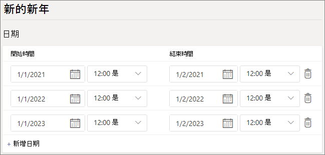

# 在 Microsoft 團隊中設定假日

您可以使用 [小組假日] 功能來提供備用訊息，並將特定日期和時間的呼叫者路由給來電者，以取得特定日期和時間，讓您組織中的通話佇列或人員會在不同的工作時間或無法使用。 例如，您可能會在您的組織關閉時，為新年新的一天建立假日。

您在這裡建立的假日是在您 [設定自動](create-a-phone-system-auto-attendant.md)語音應答時提供，每個都有自己的問候及呼叫路由設定。

## 建立假日

若要建立假日

1. 在 Microsoft [團隊管理中心] 中，移至 [ **全組織的設定**  >  **假日** ]。

2. 選取 [ **新假日** ]。

3. 輸入假日的名稱。

4. 選取 [ **新增日期** ]。

5. 在 [ **開始時間** ] 底下，選取行事曆圖示，然後選擇您想要的假日開始的日期。

6. 使用下拉式清單來選取假日的開始時間。

7. 在 [ **結束時間** ] 底下，選取行事曆圖示，然後選擇您要結束假日的日期。

8. 使用下拉式清單來選取假日的結束時間。 [ **結束時間** ] 必須在 **開始時間** 之後。  

   > [!NOTE]
   > 如果該假日是一個全天 (（即24小時期間) ）， **結束時間** 應該設定為下一天，並將時間設為 12:00 AM。 例如，如果您的組織是在新年年1月1日關閉，請將 [ **開始時間** ] 設定為 [淩晨 1 12:00 年1月 12:00 2]，並將 [ **結束時間** ] 設定為 [年1月 2]。

9. 您也可以選擇新增更多的週期性假日日期。

10. 選取 [ **儲存** ]。

    

## 變更假日

變更假日

1. 在 Microsoft [團隊管理中心] 中，移至 [ **全組織的設定**  >  **假日** ]。

2. 從清單中選取 [假日]。

3. 在 [ **開始時間** ] 底下，選取行事曆圖示，然後選擇您想要的假日開始的日期。

4. 使用下拉式清單來選取假日的開始時間。

5. 在 [ **結束時間** ] 底下，選取行事曆圖示，然後選擇您要結束假日的日期。 

6. 使用下拉式清單來選取假日的結束時間。 [ **結束時間** ] 必須在 **開始時間** 之後。  

7. 選取 [ **儲存** ]。

## 相關主題

[規劃小組自動語音應答及呼叫佇列](plan-auto-attendant-call-queue.md)？
