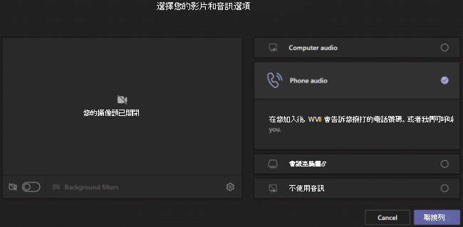
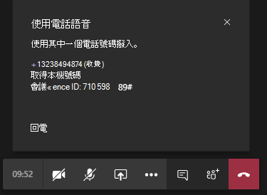
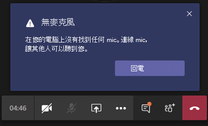

# 為您的使用者設定語音來電功能

在 Microsoft Teams中 **，通話給我** 功能可讓使用者以電話加入會議的音訊部分。 在可能無法將電腦用於音訊的情況下，這項功能非常實用。 使用者透過行動電話或陸上線路取得會議的音訊部分，以及會議的內容部分，例如當另一個會議參與者共用其螢幕或透過電腦播放 &mdash; &mdash; 影片時。

> [!IMPORTANT]
> 
> 在會議密集的時段 (隨著 COVID-19 爆發以來，我們正在經歷的事)，建議使用者按一下 [加入 Teams 會議]<strong></strong> 按鈕，而不要使用 PSTN 會議號碼或使用 [撥號給我]<strong></strong> 來加入會議。 這有助於在會議密集造成 PSTN 網路擁塞時確保音訊品質。

> [!NOTE]
> [!INCLUDE [updating-admin-interfaces](includes/updating-admin-interfaces.md)]

## 使用者體驗

### 使用電話進行音訊加入會議

按一下 **[** 加入以加入會議電話 **選擇** 您的視音訊選項畫面上的音訊，然後按一下 [**立即加入**。 使用者可以在這裡進行會議通話並加入會議，或手動撥入會議。

**讓會議Teams通話**

在使用 **電話進行音訊** 畫面上，使用者輸入其電話號碼，然後按一下 會議會打電話給使用者，並讓他們加入會議。

**手動撥入**

另一個加入的方式是直接撥入會議。 在 **[使用電話進行音訊** 播放的畫面上，按一下 [手動撥入>，以取得要撥入會議的電話號碼清單。

### 會議期間音訊發生問題時，請回電

如果使用者在會議期間使用電腦時遇到音訊問題，使用者可以輕鬆地切換到使用手機進行音訊。 Teams音訊或裝置問題何時發生，並顯示回電選項，重新導向使用者以使用手機。 

以下是郵件的範例，以及當無法偵測到麥克風時顯示的Teams回電話選項。

使用者按一下 **滑鼠回電話**，這可顯示使用 **電話進行音訊** 畫面。 在這裡，他們可以輸入其電話號碼，並Teams會議通話，並加入會議，或手動撥入會議。

## 設定呼叫我功能

若要為貴組織的使用者啟用呼叫我功能，必須配置下列專案：

- 貴組織中排程會議的使用者， (會議) 。 若要深入瞭解，請參閱[在](set-up-audio-conferencing-in-teams.md)Teams 中為使用者設定音訊會議[Teams。](manage-the-audio-conferencing-settings-for-a-user-in-teams.md)

- 會議召集人可以從會議撥出。 若要深入瞭解，請參閱在 Teams 中[管理使用者的音訊會議Teams。](manage-the-audio-conferencing-settings-for-a-user-in-teams.md)

如果會議召集人未啟用會議撥出功能，則任何人都無法使用選擇視像和音訊選項畫面上的 **電話** 音訊選項，而且其他使用者無法收到加入會議的電話。 對於已啟用撥出功能的使用者，一旦他們加入會議，就可以加入其他人，從顯示參與者圖示撥打 **他們的** 號碼。
