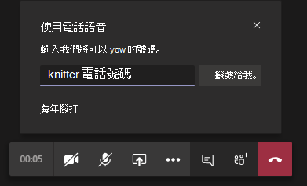

# 為您的使用者設定語音來電功能Set up the Call me feature for your users

在 Microsoft Teams 中，呼叫 **我** 功能可讓使用者以電話加入會議的音訊部分。In Microsoft Teams, the **Call me** feature gives users a way to join the audio portion of a meeting by phone. 在可能無法使用音訊電腦的情況下，這項功能非常實用。This is handy in scenarios when using a computer for audio might not be possible. 使用者透過行動電話或陸上線路取得會議的音訊部分，以及會議的內容部分，例如當另一個會議參與者共用其螢幕或透過電腦播放 &mdash; &mdash; 影片時。Users get the audio portion of the meeting through their cell phone or land line and the content portion of the meeting&mdash;such as when another meeting participant shares their screen or plays a video&mdash;through their computer.

> [!IMPORTANT]
> 
> 在會議密集的時段 (隨著 COVID-19 爆發以來，我們正在經歷的事)，建議使用者按一下 [加入 Teams 會議]<strong></strong> 按鈕，而不要使用 PSTN 會議號碼或使用 [撥號給我]<strong></strong> 來加入會議。During periods of high meeting volume (which we've been experiencing in conjunction with the COVID-19 outbreak), we recommend that users join meetings by clicking the <strong>Join Teams Meeting</strong> button rather than dialing in by using the PSTN conference numbers or by using <strong>Call me at</strong>. 這有助於在會議密集造成 PSTN 網路擁塞時確保音訊品質。This helps ensure quality audio during times when high meeting volume is causing congestion on the PSTN network.

> [!NOTE]
> [!INCLUDE [updating-admin-interfaces](includes/updating-admin-interfaces.md)]

## 使用者體驗The user experience

### 使用電話進行音訊加入會議Join a meeting by using phone for audio

按一下 **[** 加入以加入會議，**然後在**[選擇視音訊和音訊選項畫面上撥打電話音訊，然後按一下 [**立即加入**> 。Click **Join** to join a meeting, then **Phone audio** on the **Choose your video and audio options** screen, and click **Join now**. 使用者可以在這裡進行會議通話並加入會議，或手動撥入會議。From here, users can have the meeting call and join them or dial in manually to the meeting.

**讓 Teams 會議通話****Let the Teams meeting call**

在使用 **電話進行音訊** 畫面上，使用者輸入其電話號碼，然後按一下On the **Use phone for audio** screen, the user enters their phone number, and then clicks **Call me**. 會議會打電話給使用者，並讓他們加入會議。The meeting calls the user and joins them to the meeting.

**手動撥入****Dial in manually**

另一個加入的方式是直接撥入會議。Another way to join is to dial in directly to the meeting. 在 **[使用電話進行音訊** 播放的畫面上，按一下 [手動撥入以取得要撥入會議的電話號碼清單。On the **Use phone for audio** screen, click **Dial in manually** to get a list of phone numbers to use to dial in to the meeting.

### 會議期間音訊發生問題時，請回電Get a call back when something goes wrong with audio during a meeting

如果使用者在會議期間使用電腦時遇到音訊問題，使用者可以輕鬆地切換到使用手機進行音訊。If a user experiences audio issues when using their computer during a meeting, the user can easily switch to using their phone for audio. Teams 會偵測音訊或裝置問題何時發生，並顯示回電選項，重新導向使用者以使用 **他們的電話。**Teams detects when an audio or device issue occurs and redirects the user to use their phone by displaying a **Call me back** option.

以下是當 Teams 未偵測到麥克風時所顯示的訊息和回電選項範例。Here's an example of the message and the **Call me back** option that's displayed when Teams doesn't detect a microphone.

使用者按一下 **呼叫我，** 這可顯示使用 **電話進行音訊** 畫面。The user clicks **Call me back**, which brings up the **Use phone for audio** screen. 在這裡，他們可以輸入其電話號碼，並撥打 Teams 會議電話，然後加入會議，或手動撥入會議。From here, they can enter their phone number and have the Teams meeting call and join them to the meeting or dial in manually to the meeting.

## 設定呼叫我功能Set up the Call me feature

若要為貴組織的使用者啟用呼叫我功能，必須配置下列專案：To enable the Call me feature for users in your organization, the following must be configured:

- 貴組織中排程會議的使用者會啟用音訊會議 (會議) 。Audio Conferencing is enabled for users in your organization who schedule meetings (meeting organizers). 若要深入瞭解，請參閱 [設定 Teams](set-up-audio-conferencing-in-teams.md) 的音訊會議，以及管理 Teams 中的使用者的音訊會議 [設定](manage-the-audio-conferencing-settings-for-a-user-in-teams.md)。To learn more, see [Set up Audio Conferencing for Teams](set-up-audio-conferencing-in-teams.md) and [Manage the Audio Conferencing settings for a user in Teams](manage-the-audio-conferencing-settings-for-a-user-in-teams.md).

- 會議召集人可以從會議撥出。Meeting organizer can dial-out from meetings. 若要深入瞭解，請參閱 [在 Teams](manage-the-audio-conferencing-settings-for-a-user-in-teams.md)中管理使用者的音訊會議設定。To learn more, see [Manage the Audio Conferencing settings for a user in Teams](manage-the-audio-conferencing-settings-for-a-user-in-teams.md).

如果會議召集人未啟用會議撥出功能，則任何人都無法使用選擇視像和音訊選項畫面上的電話音訊選項，而且其他使用者無法接聽電話加入會議。If the meeting organizer doesn't have dial-out from meetings enabled, the **Phone audio** option on the **Choose your video and audio options** screen isn't available to anyone, and other users can't receive a call to join them to the meeting. 對於已啟用撥出功能的使用者，一旦他們加入會議，就可以加入其他人，從顯示參與者圖示撥打 **他們的** 號碼。For users with dial-out enabled, once they have joined the meeting, they can join others dialing their number from the **Show participants** icon.
