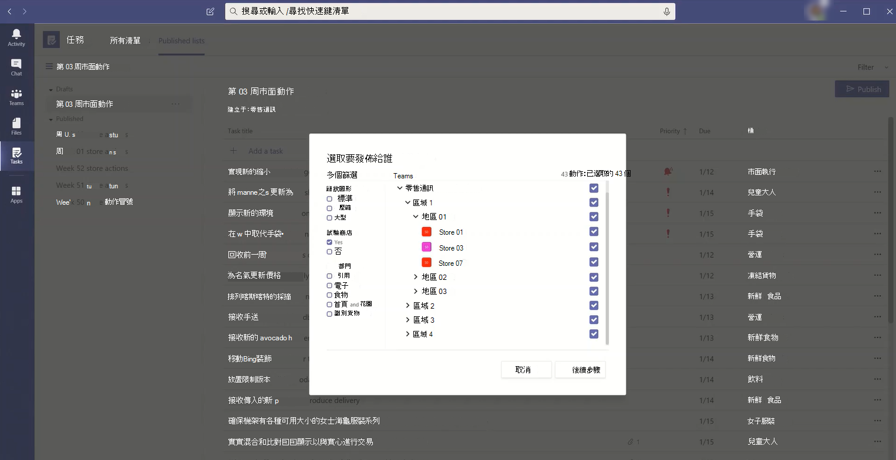

# <a name="set-up-your-team-targeting-hierarchy"></a>設定您的團隊目標階層

設定團隊目標階層可讓貴組織將內容發佈到一大組團隊。 團隊目標階層可定義階層中所有團隊之間的相互關聯性、哪些使用者可以發佈工作，以及哪些團隊使用者有權發佈。 除非為貴組織設定小組目標階層，否則所有使用者都會停用發佈功能。 若要設定團隊目標階層，您必須建立定義階層的檔案，然後上傳至 Teams 以將它套用到您的組織。 上傳架構之後，Teams 內的應用程式就可以使用它。

> [!IMPORTANT]
> 在初始版本中，只有 [工作] 應用程式支援階層式團隊。  將小組目標階層套用至貴組織，即可在 [工作] 應用程式中 [發佈工作](https://support.microsoft.com/office/publish-task-lists-to-create-and-track-work-in-your-organization-095409b3-f5af-40aa-9f9e-339b54e705df) 。 您不會在 Microsoft Teams 的其他區域中看到團隊階層。

以下是 Teams 中 [工作] 應用程式中階層的呈現方式範例。 建立工作清單之後，發佈小組的成員就可以選取收件者小組來傳送 (發佈) 工作清單。 選取團隊時，發佈團隊可以依階層、屬性或兩者的組合來篩選。<br>



## <a name="terminology"></a>術語

當您流覽階層時，下列字詞將非常重要。 Teams 將稱為 **節點**。

* **根節點** 是階層中最上方的節點。 在範例中，零售通訊是根節點。
* **父節點** 和 **子節點** 是代表兩個連接節點之間的關聯的字詞。 在範例中，區 01 是區域 1 的子節點。
* 多層兒童稱為 **元年**。 區 01、市集 01、市集 03、市集 07、區 02 和區 03 都是區域 1 的集合。
* 沒有子女的節點稱為 **葉節點**。 它們位於階層的底部。
* **收件者團隊** 是已選取以接收一組要發佈的特定內容的團隊。 它們必須是葉節點。

## <a name="plan-your-hierarchy"></a>規劃階層

建立定義階層的架構之前，您必須先進行一些規劃，並決定要如何打造組織。  其中一個優先順序是決定哪些組織群組需要將工作發佈到其他群組。 階層中的每個節點都代表一個工作組或一組群組。

### <a name="permissions-to-publish"></a>發佈許可權

發佈許可權取決於使用者是否為階層中任何團隊的成員，以及該團隊或一組團隊與階層中其他團隊的關係。

> [!NOTE]
> 團隊擁有者也會獲得發佈許可權。

* 如果使用者是至少有一個團隊的成員，且該團隊在階層中具有排他式，該使用者就可以發佈到那些臨時團隊，而不成為他們想要發佈到的所有團隊的成員。
* 如果使用者是階層中至少一個團隊的成員，但並非階層中具有記錄的任何團隊的成員，該使用者就可以查看並接收其組織發佈的內容。
* 如果使用者不是階層中任何團隊的成員，該使用者將不會看到任何發佈相關功能。

### <a name="guidelines"></a>指引

* 每個組織只能套用一個階層檔案。 不過，您可以在一個檔案中，將貴組織中的不同部分加入為節點的不同階層。 例如，Contoso Pharmaceuticals 有一個目錄根節點和一個零售根節點。 這兩個根節點都有多列的填滿符號，而且兩者之間沒有重迭。
* 只有葉節點可以是出版物的收件者。 階層中的其他節點對於選取出版物的收件者很有説明。
* 在階層中只能代表一次團隊。
* 階層最多可以包含 15，000 個節點。 我們計畫與客戶合作，為大型組織提高此限制。

### <a name="example-hierarchy"></a>範例階層

例如，在下列階層中，回收、通訊和人力資源可以將工作發佈到階層中的每個底部節點 (小組) ，但[東北方地區] 只能將工作發佈到紐約商店和波士頓市集團隊。 範例階層可讓回收、通訊和人力資源群組發佈適用于整個公司的工作，例如福利資訊或來自 CEO 的訊息。 東北方地區只能將人事排程、天氣資訊等工作發佈到紐約商店和波士頓市集團隊。


## <a name="create-your-hierarchy"></a>建立階層

> [!NOTE]
> 本文其餘部分將討論如何在將工作發佈給收件者團隊的內容中設定小組階層。 請參閱 [在 Teams 中管理貴組織的 [工作] 應用程式](./manage-tasks-app.md) ，以概略瞭解 [工作] 應用程式，其中的任務發佈會在啟用時出現。

定義階層的架構是以 CSV) 檔 (逗號分隔值為基礎。 檔案必須是 UTF-8 格式。 CSV 檔案中的每一列都會對應到團隊階層中的一個節點。 每一列都包含為階層中節點命名的資訊，可選擇性地將節點連結至團隊，並包含可在支援節點的應用程式中篩選團隊的屬性。

您也可以定義貯 **體**，這是發佈小組可以用來組織傳送給收件者團隊之內容的類別，讓他們能更輕鬆地檢視、排序及專注于相關內容。

### <a name="add-required-columns"></a>新增必要欄

CSV 檔案必須包含下列三欄，順序如下，從第一欄開始。 節點必須連結至小組，才能接收工作。

| 欄名稱   | 必要 | 描述   |
----------------|----------|---------------|
| DisplayName    | 是      | 此欄位是節點的名稱。 名稱長度最多可達 100 個字元，且只包含 A-Z、a-z 和 0-9 字元。 節點名稱必須是唯一的。 |
| ParentName    | 是       | 這是父節點的名稱。 您在此處指定的值必須完全符合父節點 **DisplayName** 欄位中的值。 如果您要新增一個以上的父節點，請以分號 (分隔每個父節點名稱;) 。 您最多可以新增 25 個父節點，每個父節點名稱最多可以有 2500 個字元。 只有在父節點是根節點時，節點才能有多個父節點。   <br><br>**重要** 請小心不要建立迴圈，讓階層中較高階層的上層父項參照階層中較低階層的子節點。 不支援此功能。 |
| TeamId        | 是的，如果小組發佈工作或從上層節點接收工作       | 這包含您要連結節點之小組的識別碼。 每個節點都必須參照到唯一的團隊，因此每個 TeamId 值在階層檔案中只會顯示一次。 若要取得您要連結節點之小組的識別碼，請執行下列 PowerShell 命令： `Get-Team | Export-Csv TeamList.csv` 。 此命令會列出您組織中的團隊，並包含每個團隊的名稱和識別碼。 尋找您要連結的團隊名稱，然後將識別碼複製到此欄位。|

> [!NOTE]
> 如果節點不是根節點或葉節點，而且您不需要團隊成員資格來授與對應的發佈和報告許可權，您可以將 TeamId 留白。 這個方法可用來在選擇收件者團隊或檢視完成報告時增加更細分，而不需要對應的團隊。

### <a name="add-attribute-columns"></a>新增屬性欄

新增三個必要欄之後，您可以新增選用屬性欄。 這些屬性可用來篩選節點，讓您可以更輕鬆地選取您要發佈工作的專案。 根據該屬性的值是否互斥而定，定義屬性的方法有兩種。

|新增屬性的方式|描述 |範例  |
|---|---------|---------|
|如果屬性的值互斥，您指定的欄名會變成屬性的名稱。|每個資料列可以包含該屬性的一個值，而且每個屬性欄最多可以有 50 個唯一值。 每個值最多可以是 100 個字元。 當您使用團隊目標階層選取收件者團隊時，您在屬性欄中指定的屬性值集會顯示為該屬性的篩選值。|您希望使用者能夠依版面配置篩選商店。 此屬性的值互斥，因為商店只能有一個版面配置。 <br><br>若要新增屬性以依版面配置篩選市集，請新增名為 [市集版面配置] 的欄。 在此範例中，Microsoft Store 版面配置屬性的值為 [壓縮]、[標準] 和 [大型]。
|如果您需要為某個屬性指出多個值，而這些值不是互斥的，請針對欄名使用 **AttributeName：UniqueValue** 格式。 <br><br>**重要** 請務必使用英文專用冒號 (：) 為不支援為屬性欄分隔符號。 |冒號 (：) 之前的文字字串會變成屬性的名稱。 在冒號 (：) 之前包含相同文字字串的所有欄，都會組成篩選功能表中的區段。 冒號後面的每個字串都會變成該區段的值。<br><br>每個資料列的值可以是 0 (零) 或 1 這個屬性。 0 的值表示屬性不適用於節點，而 1 的值表示該屬性適用于該節點。|您希望使用者能夠依部門篩選商店。 商店可以有多個部門，因此這個屬性的值不是互斥的。<br><br>在此範例中，我們新增部門：服裝、部門：電子產品、部門：食物、部門：家用和花園、部門：運動產品做為屬性欄。 部門會成為屬性名稱，使用者可以依據服裝、電子產品、食物、家用及花園，以及運動產品部門進行篩選。|

當您新增屬性欄時，請記住下列事項：

* 您指定的欄名稱，或是您在冒號 (：) 之前指定的欄名稱，都會變成屬性的名稱。 此值會顯示在使用階層的 Teams 應用程式中。
* 階層中最多可以有 50 個屬性欄。
* 欄名長度最多可達 100 個字元，且只包含 A-Z、a-z 及 0-9 字元及空格。 欄名必須是唯一的。

### <a name="add-bucket-columns"></a>新增貯體欄

您可以新增貯體欄來建立貯體，這些貯體會將哪些工作分組為可整理的工作。 每個貯體都會在 CSV 檔案中取得自己的欄。 您建立的貯體會提供給發佈小組使用。 然後，發佈小組就可以使用這些貯體來分類收件者小組的工作。 如果團隊中還沒有貯體，則當工作發佈時，會根據需求建立貯體。

藉由集中分類工作專案一次，發佈小組就可以針對收到工作清單的數十個、數百個或數千個收件者團隊，預先組織工作清單。 然後，收件者小組可以依貯體排序及篩選工作，以專注于與他們工作最相關的區域。

當您新增貯體欄時，請注意下列事項：

* 欄名會變成貯體的名稱。 您指定的每個貯體都會出現在使用階層的 Teams 應用程式的貯體清單中。
* 建議您不要在貯體名稱中包含機密資訊。 目前，發佈小組無法在建立貯體之後透過發佈移除貯體。
* 欄名稱前面必須有雜湊標記 (#) 。 長度最多可達 100 個字元，且只包含 A-Z、a-z 和 0-9 字元。 例如，#Operations及#Frozen貨物]。
* 階層可能包含最多 25 個貯體欄。 我們計畫與客戶合作，為大型組織增加此限制。

### <a name="example"></a>範例

以下是架構 CSV 檔案的範例，該檔案會建立以支援上一個影像中顯示的階層。 此架構包含下列專案：

* 三個必要欄，名稱為 `TargetName` 、 `ParentName` 和 `TeamId`
* 三個屬性欄，名稱為 `Store layout` 、 `Departments:Clothing` 和 `Departments:Foods`
* 三個貯體欄，名稱為 `Fresh Foods` 、 `Frozen Foods` 和 `Women's Wear`

屬性 `Store layout` 具有包含 `Compact` 、 `Standard` 和 `Large` . 的值。 屬性 `Departments` 欄可以設定為 (零) 或 `1` 的值 `0` 。 上述 `Store` 影像中未顯示版面配置和 `Departments` 屬性。 這些專案會在這裡新增，以協助顯示如何將屬性新增至節點專案。 這三個貯體欄也是如此。

```CSV
TargetName,ParentName,TeamId,Store layout,Departments:Clothing,Departments:Foods,#Fresh Foods,#Frozen Foods,#Women's Wear
Recall,,db23e6ba-04a6-412a-95e8-49e5b01943ba,,,,,,
Communications,,145399ce-a761-4843-a110-3077249037fc,,,,,,
HR,,125399ce-a761-4983-a125-3abc249037fc,,,,,,
East Regional Office,HR;Communications;Recall,,,,,,,
West Regional Office,HR;Communications;Recall,,,,,,,
Northeast Zone,East Regional Office,,,,,,,
Southeast Zone,East Regional Office,,,,,,,
New York Store,Northeast Zone,e2ba65f6-25e7-488b-b8f0-b8562d5de60a,Large,1,1,,,
Boston Store,Northeast Zone,0454f08a-0507-437c-969a-682eb2fae7fc,Standard,1,1,,,
Miami Store,Southeast Zone,619d6e4e-5f68-4b36-8e1f-16c98d7396c1,Compact,0,1,,,
New Orleans Store,Southeast Zone,6be960b8-72af-4561-a343-9ac4711874eb,Compact,0,1,,,
Seattle Store,West Regional Zone,487c0d20-4e55-4dc2-8187-a24c826e0fee,Standard,1,1,,,
Los Angeles Store,West Regional Zone,204a1287-2efb-4a8a-88e0-56fbaf5a2389,Large,1,1,,,
```

## <a name="apply-your-hierarchy"></a>套用階層

> [!NOTE] 
> 若要執行此步驟，您必須從PowerShell 資源庫安裝並使用 Teams PowerShell 公開預覽模組。 如需如何安裝模組的步驟，請參閱安裝 Teams PowerShell。

> [!NOTE]
> 政府社群雲端 (GCC) 客戶必須使用 [Cmdlet 預覽版本 2.4.0-preview](https://www.powershellgallery.com/packages/MicrosoftTeams/2.4.0-preview) 或更新版本，以確保資料已路由至 GCC 環境，而不是公用雲端環境。

在架構 CSV 檔案中定義階層之後，就可以將它上傳到 Teams。 若要這麼做，請執行下列命令。 您必須是全域系統管理員或 Teams 服務系統管理員，才能執行此步驟。

```powershell
Set-TeamTargetingHierarchy -FilePath "C:\ContosoTeamSchema.csv"
```

### <a name="update-your-hierarchy"></a>更新階層

您可以上傳新的階層，以上述相同的 PowerShell 命令取代舊階層。 每次上傳新的階層時，該階層會取代上一個階層。

### <a name="check-the-status-of-your-hierarchy"></a>檢查階層的狀態

您可以執行下列命令來檢查階層上傳的狀態。

```powershell
Get-TeamTargetingHierarchyStatus
```

命令會傳回下欄欄位：

領域|描述
-----|------------
Id | 上傳的唯一識別碼。
地位 | [上傳狀態]。 值包括 **[開始****]、[驗證]**、[**成功**] 和 [**失敗]**
ErrorDetails | 如果發生上傳錯誤，請詳細資料。 如需錯誤詳細資料的詳細資訊，請參閱疑難排解一節。 如果沒有錯誤，此欄位為空白。
LastUpdatedAt | 上次更新檔案的時間戳記和日期。
LastModifiedBy | 最後一個修改檔案之使用者的識別碼。
檔案名 | CSV 的檔案名。

## <a name="remove-your-hierarchy"></a>移除階層

如果您想要立即停用組織中所有使用者的 [ **已發佈清單** ] 索引標籤，您可以移除階層。 使用者無法存取 [ **已發佈的清單** ] 索引標籤或索引標籤上的任何功能。 這包括建立新工作清單以發佈、存取草稿清單、發佈、解除發佈及複製清單，以及檢視報告的功能。 移除階層並不會解除先前發佈的工作。 收件者小組仍可完成這些工作。

若要移除階層，請執行下列命令。 您必須是系統管理員才能執行此步驟。

```powershell
Remove-TeamTargetingHierarchy
```

確認刪除時，狀態訊息仍會顯示先前的架構，但再次嘗試刪除時，會傳回該物件為 Null 的錯誤。

## <a name="create-a-sample-hierarchy"></a>建立範例階層

### <a name="install-the-teams-powershell-module"></a>安裝 Teams PowerShell 模組

> [!IMPORTANT]
> 若要執行此步驟，您必須從PowerShell 資源庫安裝並使用 Teams PowerShell 公開預覽[模組](https://www.powershellgallery.com/packages/MicrosoftTeams/)。 如需如何安裝模組的步驟，請參閱 [安裝 Teams PowerShell](teams-powershell-install.md)。

### <a name="sample-script"></a>範例腳本

下列腳本可用來建立團隊，並將.csv檔案上傳至您的 Microsoft Teams 租使用者。 如果您有現有的階層，此腳本將會取代它。

#### <a name="create-teams-for-a-simple-hierarchy"></a>建立簡單階層的團隊

```powershell
$tm1 = New-Team -DisplayName "HQ"
$tm2 = New-Team -DisplayName "North"
$tm3 = New-Team -DisplayName "Store 1"
$tm4 = New-Team -DisplayName "Store 2"
$tm5 = New-Team -DisplayName "South"
$tm6 = New-Team -DisplayName "Store 3"
$tm7 = New-Team -DisplayName "Store 4"
```

#### <a name="use-team-data-to-create-comma-separated-output-displayname-parentname-teamid"></a>使用小組資料建立逗號分隔輸出 (DisplayName、ParentName、TeamId) 

```powershell
$csvOutput = "DisplayName" + "," + "ParentName" + "," + "TeamId" + "`n"
$csvOutput = $csvOutput + $tm1.DisplayName + "," + "," + $tm1.GroupID + "`n"
$csvOutput = $csvOutput + $tm2.DisplayName + "," + $tm1.DisplayName + "," + $tm2.GroupID + "`n"
$csvOutput = $csvOutput + $tm3.DisplayName + "," + $tm2.DisplayName + "," + $tm3.GroupID + "`n"
$csvOutput = $csvOutput + $tm4.DisplayName + "," + $tm2.DisplayName + "," + $tm4.GroupID + "`n"
$csvOutput = $csvOutput + $tm5.DisplayName + "," + $tm1.DisplayName + "," + $tm5.GroupID + "`n"
$csvOutput = $csvOutput + $tm6.DisplayName + "," + $tm5.DisplayName + "," + $tm6.GroupID + "`n"
$csvOutput = $csvOutput + $tm7.DisplayName + "," + $tm5.DisplayName + "," + $tm7.GroupID 
```

#### <a name="save-output-to-a-csv-file-in-the-downloads-folder"></a>將輸出儲存到 [ **下載** ] 資料夾中的.csv檔案

```powershell
$csvOutputPath = $env:USERPROFILE + "\downloads\testhierarchy-" + (Get-Date -Format "yyyy-MM-dd-hhmmss") + ".csv" 
$csvOutput | Out-File $csvOutputPath
```

#### <a name="upload-the-hierarchy"></a>上傳階層

```powershell
Set-TeamTargetingHierarchy -FilePath $csvOutputPath
Get-TeamTargetingHierarchyStatus
```

## <a name="troubleshooting"></a>疑難排解

### <a name="how-to-view-error-details"></a>如何檢視錯誤詳細資料

您可以執行下列命令以瞭解造成錯誤的原因，並傳回錯誤詳細資料。

```powershell
(Get-TeamTargetingHierarchyStatus).ErrorDetails.ErrorMessage
```

### <a name="you-receive-an-error-message-when-you-upload-your-schema-csv-file"></a>上傳架構 CSV 檔案時收到錯誤訊息

記下錯誤訊息，因為它應包含疑難排解資訊，以指出架構無法上傳的原因。 根據錯誤訊息中的資訊檢閱及編輯架構 CSV 檔案，然後再試一次。

### <a name="you-receive-an-error-invalidteamid-error-message-when-you-upload-your-schema-csv-file"></a>上傳架構 CSV 檔案時收到「錯誤：InvalidTeamId」錯誤訊息

當您嘗試上傳架構 CSV 檔案時，會收到下列錯誤訊息：

```console
Error: InvalidTeamId
Description: TeamID in row # doesn't match a valid Group ID. Please view our documentation to learn how to get the proper GroupID for each team.
```

檢查以確認您在架構 CSV 檔案中為小組使用正確的 TeamId。 TeamId 應與支援小組的 Microsoft 365 群組識別碼相同。 您可以在 Microsoft Teams 系統管理中心查詢團隊的群組識別碼。

1. 在 [Microsoft Teams 系統管理中心的](https://admin.teams.microsoft.com/)左側導覽中，移至 **[Teams**  >  **管理團隊]**。
2. 如果資料表中未顯示 [ **群組標識** 符] 欄，請選取表格右上角的 **[編輯欄** ]，然後開啟 [ **群組識別碼]**。
3. 在清單中尋找小組，然後找出 [群組識別碼]。

確認架構 CSV 檔案中的 TeamId 與 Microsoft Teams 系統管理中心顯示的群組識別碼相符。

## <a name="related-topics"></a>相關主題

* [在 Teams 中管理貴組織的工作應用程式](manage-tasks-app.md)
* [Teams PowerShell 概觀](teams-powershell-overview.md)
