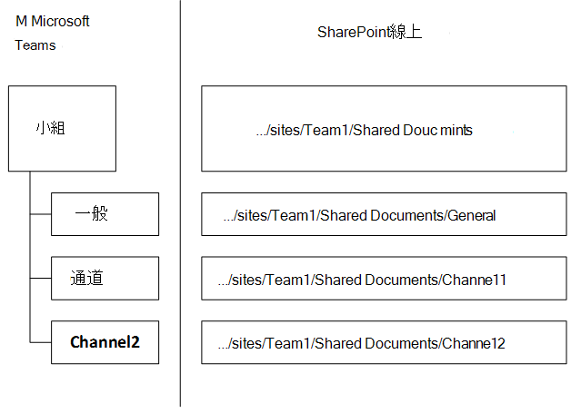

# SharePoint與OneDrive互動Microsoft Teams

> [!Tip]
> 觀看下列會話，瞭解如何Teams AAD Azure Active Directory (、) 、Microsoft 365群組、Exchange、SharePoint OneDrive互動：Microsoft Teams 

團隊中的每個Microsoft Teams都有一個小組網站SharePoint團隊中的每個標準頻道會獲得預設小組網站文件庫中的資料夾。 每個[私人頻道](private-channels.md)都有自己的個別SharePoint網站。 若要深入瞭解這些小組網站和頻道網站，請參閱管理Teams[網站和頻道網站](/sharepoint/teams-connected-sites)。

在交談中共用的檔案會自動新增到文件庫，在 SharePoint 中設定的權限和檔案安全性選項會自動在 Teams 中反映。 若要查看變更網站位址在 SharePoint 中的影響，請參閱[變更網站位址](/sharepoint/change-site-address)。

私人聊天檔案會儲存在寄件者的 OneDrive 資料夾中，並會在檔案共用過程中自動授予所有參與者許可權。

如果使用者未SharePoint授權，他們OneDrive儲存Microsoft 365。 檔案共用在標準頻道中運作，但使用者無法共用聊天中的檔案，OneDrive儲存Microsoft 365。

將檔案儲存于文件庫SharePoint文件庫中OneDrive，所有在組織層級所配置的合規性規則都會遵循。 

> [!NOTE]
> 系統不支援SharePoint伺服器Teams。

以下是小組、標準頻道和文件庫之間關係範例。

針對每個小組，SharePoint網站，**而共用檔** 資料夾是團隊建立的預設資料夾。 每個標準頻道 ，包括一般 (每個團隊的預設頻道) 共用 **檔中的資料夾**。

無法SharePoint網站和文件庫的預設文件庫。

針對每個使用者，OneDrive 資料夾 Microsoft Teams **聊天** 檔案會用來儲存與其他使用者 (1：1 或 1：多) 私人聊天中共用的所有檔案，並自動將許可權配置為僅限制預定使用者的存取權。

請注意，對於公用小組，SharePoint網站已布布「外部使用者以外的所有人」存取權。 公用團隊不會顯示在 Teams中，不會顯示該團隊的成員。 不過，他們可以使用小組SharePoint網站的 URL 存取小組SharePoint內容。 

## 頻道檔案選項卡

檔案 **中的** 檔案Teams與檔SharePoint類似。 在檔案 **選項卡** 上，使用者可以：

- 請參閱新增檔案功能表中 **的其他** 選項。
- 將檔案同步處理至其本地磁碟機。
- 在所有 **檔功能表** 上，從清單視圖切換到 **壓縮清單** 至 **磚** 視圖。
- 識別需要注意或具有惡意攻擊的檔案。
- 立即查看檔案是唯讀還是已簽出。
- 簽出並簽入檔案。
- 釘選、取消釘選及變更檔案的排序次序。
- 識別哪些檔案需要中繼資料
- 選擇更多篩選選項。
- 根據欄標題將檔案分組。
- 修改欄設定 (向左或向右移動、隱藏) 欄寬。

## 預設連結類型設定

系統管理中心會設定使用者共用檔案時預設顯示的共用SharePoint類型。 當使用者 [取得共用資訊的連結時，請參閱變更預設](/sharepoint/change-default-sharing-link) 連結類型。

## 相關主題

[管理Teams網站和頻道網站](/SharePoint/teams-connected-sites)

[SharePoint和Teams：一起變得更好](https://techcommunity.microsoft.com/t5/Microsoft-SharePoint-Blog/SharePoint-and-Teams-Better-Together/ba-p/189593)。

[來賓體驗像什麼](guest-experience.md)
