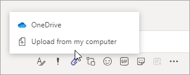
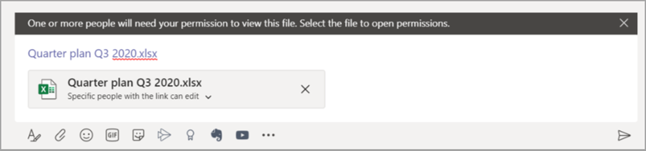

# 在 Microsoft 團隊中共用檔案Sharing files in Microsoft Teams

在 Microsoft 團隊中，使用者可以與組織內部和外部的其他團隊使用者共用內容。In Microsoft Teams, users can share content with other Teams users within and outside their organization. [在小組中共用] 是以 SharePoint 和 OneDrive 中所設定的設定為基礎，因此您針對 SharePoint 和 OneDrive 設定的任何內容，都會同時控制小組中的共用功能。Sharing in Teams is based on the settings configured in SharePoint and OneDrive, so whatever you set up for SharePoint and OneDrive will control sharing in Teams as well.

## 概觀Overview

使用者可以從 OneDrive、他們有權存取的小組和網站，以及從他們的電腦上共用檔案。Users can share files from OneDrive, from teams and sites they have access to, and from their computer. 若要共用檔案，使用者可以執行下列動作：To share a file, users can do the following:

- 在頻道中，按一下 [**附加**] （曲別針圖示）、選取 [**最近** **]、[流覽團隊和頻道]、[** **OneDrive**] 或 [**從我的電腦上傳**]，然後選擇他們要共用的檔案。In a channel, click **Attach** (the paperclip icon), select **Recent**, **Browse Teams and Channels**, **OneDrive**, or **Upload from my computer**, and then choose the file they want to share.   
    
- 在聊天中，按一下 [**附加**] （曲別針圖示），選取或 [ **OneDrive** ] 或 [**從我的電腦上傳**]，然後選擇他們要共用的檔案。In a chat, click **Attach** (the paperclip icon), select  or **OneDrive** or **Upload from my computer**, and then choose the file they want to share.  
    
- 在撰寫方塊中複製並貼上共用連結。Copy and paste the sharing link in the compose box. 
    

### 檔案共用體驗所需注意的事項What you need to know about the file sharing experience

### 共用檔案和共用連結的許可權Permissions of shared files and sharing links

當使用者透過在 OneDrive 或團隊和頻道中流覽來共用檔案時，系統會向所有收件者授與[組織層級所設定的預設許可權](https://docs.microsoft.com/sharepoint/change-default-sharing-link)。When users share a file by browsing to it in OneDrive or teams and channels, all recipients are granted access along with the [default permission that's set at the organization level](https://docs.microsoft.com/sharepoint/change-default-sharing-link).

當使用者複製並貼上共用連結時，該共用連結上所設定的許可權即會生效，SharePoint URL 會縮短為檔案名。When a user copies and pastes a sharing link, the permissions set on that sharing link are honored and the SharePoint URL is shortened to the file name. 換句話說，小組只會使用檔案名來連結至檔案。In other words, Teams uses just the file name to link to a file.

當使用者在團隊中共用檔案時，他們可以設定誰可以存取該檔案，就像在 Microsoft 365 中一樣。When users share a file from within Teams, they can set who can access the file just like they do across Microsoft 365. 他們可以為您組織中的人員、擁有現有存取權的人員或特定人員（可在1:1 聊天、群組聊天或頻道中加入人員）提供存取權。They can give access to anyone, people in your organization, people with existing access, or specific people (which can include the people in a 1:1 chat, group chat, or channel).  共用檔案時，會在郵件中提供檔案預覽，以及**開啟 [線上**]、[**下載**] 和 [**複製連結**] 等所有檔案動作。When a file is shared, the file preview is available in the message, along with all file actions such as **Open online**, **Download**, and **Copy link**. 根據預設，檔案會在 [團隊] 中開啟。By default, the file opens in Teams. 有時候，共用連結可能不會在使用者傳送郵件時轉換成檔案預覽。Sometimes, the sharing link may not have converted to a file preview by the time a user sends the message. 系統會產生檔案預覽，但在這種情況下，不會將共用連結截短至唯一的檔案名。The file preview will be generated by the system, but in this scenario, the sharing link won't be shortened to the only the file name.

當使用者在聊天或頻道中共用檔案時，系統會通知您是否有部分或所有收件者沒有許可權來查看檔案。When users share a file in a chat or channel, they're notified whether some or all recipients don't have permission to view the file. 他們可以在共用檔案前，按一下現在出現在郵件中的檔案預覽旁邊的箭號，即可變更該檔案的許可權。They can change the permissions on the file before they share it by clicking the arrow next to the file preview that now appears in the message.

### 複製小組中的共用連結Copy a sharing link in Teams

使用者可以複製 SharePoint 共用連結，並變更共用許可權，就像在 Microsoft 365 中一樣。Users can copy a SharePoint sharing link and change sharing permissions just like they do across Microsoft 365. 他們可以授與您組織中的人員、擁有現有存取權的人員，或特定人員的存取權。They can give access to anyone, people in your organization, people with existing access, or specific people. 連結的預設許可權會與組織階層的預設許可權集相同，除非 SharePoint 網站層級許可權覆蓋它。The default permission of the link is the same as the default permission set at the organization level unless SharePoint site level permissions override it.

## 在 OneDrive 和 SharePoint 中設定共用Configure sharing in OneDrive and SharePoint

如需在 OneDrive 和 SharePoint 中共用檔案的詳細資訊，包括如何設定共用，以及如何開啟和關閉共用，請參閱：For more information about sharing files in OneDrive and SharePoint, including how to configure sharing and how to turn sharing on and off, see:

- [[外部共用] 概覽](https://docs.microsoft.com/sharepoint/external-sharing-overview)-說明使用者共用時所發生的情況，視其共用和人員的情況而定。[External sharing overview](https://docs.microsoft.com/sharepoint/external-sharing-overview) - describes what happens when users share, depending on what they're sharing and with whom.

- [管理共用設定](https://docs.microsoft.com/sharepoint/turn-external-sharing-on-or-off)-說明全域和 SharePoint 系統管理員可以如何變更其組織層級的 SharePoint 和 OneDrive 共用設定。[Manage sharing settings](https://docs.microsoft.com/sharepoint/turn-external-sharing-on-or-off) - describes how global and SharePoint admins can change their organization-level sharing settings for SharePoint and OneDrive.

- [開啟或關閉網站的外部共用](https://docs.microsoft.com/sharepoint/change-external-sharing-site)–說明全域和 SharePoint 系統管理員可以如何開啟或關閉網站的外部共用。[Turn external sharing on or off for a site](https://docs.microsoft.com/sharepoint/change-external-sharing-site) – describes how global and SharePoint admins can turn external sharing on or off for a site.

- [變更網站的預設連結類型](https://docs.microsoft.com/sharepoint/change-default-sharing-link)-說明如何設定預設連結類型，讓它更具限制性。[Change the default link type for a site](https://docs.microsoft.com/sharepoint/change-default-sharing-link) - describes how to set the default link type so that it's more restrictive.

## 詳細資訊More information

- [SharePoint Online 與商務用 OneDrive 與 Microsoft 團隊互動的方式How SharePoint Online and OneDrive for Business interact with Microsoft Teams](sharepoint-onedrive-interact.md)

- [SharePoint 與團隊：更緊密地合作SharePoint and Teams: better together](https://techcommunity.microsoft.com/t5/Microsoft-SharePoint-Blog/SharePoint-and-Teams-Better-Together/ba-p/189593)

- [共用 OneDrive 檔案和資料夾Share OneDrive files and folders](https://support.office.com/article/Share-OneDrive-files-and-folders-9fcc2f7d-de0c-4cec-93b0-a82024800c07#OS_Type=OneDrive_-_Business)

- [共用 SharePoint 檔案或資料夾Share SharePoint files or folders](https://support.office.com/article/share-sharepoint-files-or-folders-1fe37332-0f9a-4719-970e-d2578da4941c)
