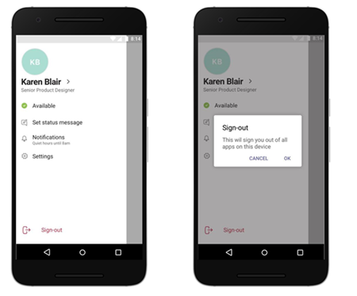

登入 Microsoft TeamsSign in to Microsoft Teams
==========================

## Windows 使用者Windows users

Microsoft 建議組織使用最新版本的 Windows 10，內含有混合式網域加入或 Azure AD 加入設定。使用最近的版本能確保在 Windows 網頁帳戶管理員中已將使用者的帳戶準備好，進而讓您以單一的方式登入 Teams 和其他 Microsoft 應用程式。單一登入可提供更好的使用者體驗 (無訊息式登入) 和加強的安全性狀況。Microsoft recommends that organizations use recent versions of Windows 10 with either Hybrid Domain Join or Azure AD Join configuration. Using recent versions ensures that users’ accounts are primed in Windows’ Web Account Manager, which in turn enables single sign-on to Teams and other Microsoft applications. Single sign-on provides a better user experience (silent sign in) and a better security posture.

Microsoft Teams 使用新式驗證讓登入體驗更加簡單可靠。若要瞭解使用者如何登入 Teams，請閱讀[登入 Teams](https://support.office.com/article/sign-in-to-teams-ea4b1443-d11b-4791-8ae1-9977e7723055)。Microsoft Teams uses modern authentication to keep the sign-in experience simple and secure. To see how users sign in to Teams, read [Sign in to Teams](https://support.office.com/article/sign-in-to-teams-ea4b1443-d11b-4791-8ae1-9977e7723055).

### 新式驗證的運作方式How modern authentication works

新式驗證是一種程序，可讓 Teams 知道使用者已經在別處輸入其認證 (例如，他們的工作電子郵件和密碼)，因此不需要再次輸入就能啟動應用程式。Modern authentication is a process that lets Teams know that users have already entered their credentials, such as their work email and password elsewhere, and they shouldn't be required to enter them again to start the app. 這項體驗會根據幾項因素而有所不同，例如使用者是在 Windows 或在 Mac 上工作。The experience varies depending on a couple factors, like if users are working in Windows or on a Mac. 它也會根據您的組織啟用單要素驗證或多重要素驗證而有所不同。It will also vary depending on whether your organization has enabled single-factor authentication or multi-factor authentication. 多重要素驗證通常涉及透過手機驗證認證、提供唯一的代碼、輸入 PIN，或顯示指紋。Multi-factor authentication usually involves verifying credentials via a phone, providing a unique code, entering a PIN, or presenting a thumbprint. 以下是每個新式驗證案例的摘要。Here's a rundown of each modern authentication scenario.

使用 Teams 的每一個組織都能使用新式驗證。Modern authentication is available for every organization that uses Teams. 如果使用者無法完成此程序，則表示貴組織的 Azure AD 設定可能有基礎問題。If users aren't able to complete the process, there might be an underlying issue with your organization's Azure AD configuration. 如需詳細資訊，請參閱[為何我無法登入 Microsoft Teams？](https://support.office.com/article/why-am-i-having-trouble-signing-in-to-microsoft-teams-a02f683b-61a3-4008-9447-ee60c5593b0f)For more information, see [Why am I having trouble signing in to Microsoft Teams?](https://support.office.com/article/why-am-i-having-trouble-signing-in-to-microsoft-teams-a02f683b-61a3-4008-9447-ee60c5593b0f)

- 如果使用者已透過他們的公司或學校帳戶登入 Windows 或其他 Office 應用程式，當他們啟動 Teams 時，就可以直接進入應用程式。他們不需要輸入認證。If users have already signed in to Windows or to other Office apps with their work or school account, when they start Teams they're taken straight to the app. There's no need for them to enter their credentials.

- Microsoft 建議使用 Windows 10 版本 1903 或更新版本，以獲得最佳的單一登入體驗。Microsoft recommends using Windows 10 version 1903 or later for the best Single Sign-On experience.

- 如果使用者未登入他們的 Microsoft 公司或學校帳戶，當他們啟動 Teams 時，系統會要求他們提供單一要素或多重要素驗證 (SFA 或 MFA)。此程序取決於您的組織已決定他們希望登入程序要求的條件。If users are not signed in to their Microsoft work or school account anywhere else, when they start Teams, they're asked to provide either single-factor or multi-factor authentication (SFA or MFA). This process depends on what your organization has decided they'd like the sign-in procedure to require.

- 如果使用者登入加入網域的電腦，當他們啟動 Teams 時，系統可能會要求他們執行一個進一步的驗證步驟，視您的組織是否選擇要求 MFA 或他們的電腦是否要求 MFA 才能登入而定。如果他們的電腦已經要求 MFA 才能登入，則當他們開啟 Teams 時，應用程式會自動啟動。If users are signed in to a domain-joined computer, when they start Teams, they might be asked to go through one more authentication step, depending on whether your organization opted to require MFA or if their computer already requires MFA to sign in. If their computer already requires MFA to sign in, when they open up Teams, the app automatically starts.

- 在已加入網域的電腦上，如果無法使用 SSO，Teams 可能會使用使用者主體名稱 (UPN) 預先填入其登入畫面。On Domain joined PCs, when SSO isn't possible Teams may pre-fill its login screen with the user principal name (UPN). 您可能不會想要這種情況發生，特別是如果您的組織在內部部署和 Azure Active Directory 中使用不同的 UPN。There are cases where you may not want this, especially if your organization uses different UPNs on-premises and in Azure Active Directory. 如果是這樣，您可以使用下列 Windows 登錄機碼來關閉 UPN 的預先填入：If that's the case, you can use the following Windows registry key to turn off pre-population of the UPN:

  Computer\HKEY_CURRENT_USER\Software\Microsoft\Office\TeamsComputer\HKEY_CURRENT_USER\Software\Microsoft\Office\Teams 
  SkipUpnPrefill(REG_DWORD)SkipUpnPrefill(REG_DWORD) 
  0x00000001 (1)0x00000001 (1)

    > [!NOTE]
    > 針對以「.local」或「.corp」結尾的使用者名稱，略過或忽略使用者名稱預先填入的功能預設為開啟，因此您不需要設定登錄機碼就能關閉預先填入。Skipping or ignoring user name pre-fill for user names that end in ".local" or ".corp" is on by default, so you don't need to set a registry key to turn these off.

### 完成新式驗證後登出 TeamsSigning out of Teams after completing modern authentication

若要登出 Teams，使用者可以選取應用程式頂端的個人檔案圖片，然後選取 **[登出]**，也可以在其工作列中的應用程式圖示上按一下滑鼠右鍵，然後選取 **[登出]**。登出 Teams 之後，必須再次輸入認證，才能啟動應用程式。To sign out of Teams, users can select their profile picture at the top of the app, and then select **Sign out**. They can also right-click the app icon in their taskbar, and then select **Log out**. Once they've sign out of Teams, they need to enter their credentials again to launch the app.

### 在加入網域的電腦上登入另一個帳戶Signing in to another account on a Domain Joined computer

在加入網域的電腦上的使用者可能無法使用在同一 Active Directory 網域中的另一個帳戶登入 Teams。Users on domain-joined computer may not be able to sign in to Teams with another account in the same Active Directory domain.

## macOS 使用者macOS users

在 macOS 上，Teams 會提示使用者輸入其使用者名稱和認證，並根據貴組織的設定，可能會提示多重要素驗證。On macOS, Teams will prompt users to enter their username and credentials and may prompt for multi-factor authentication depending on your organization's settings. 使用者輸入認證後，就不需要再次提供這些認證。Once users enter their credentials, they won't be required to provide them again. 從這時起，只要他們在同一部電腦上工作，Teams 就會自動啟動。From that point on, Teams automatically starts whenever they're working on the same computer.

## iOS 和 Android 版 Teams 使用者Teams on iOS and Android users

登入後，行動使用者將會看到目前登入或先前已在其裝置上登入的所有 Microsoft 365 帳戶清單。Upon sign in, mobile users will see a list of all the Microsoft 365 accounts that are either currently signed-in or were previously signed-in on their device. 使用者可以點選任何帳戶以登入。Users can tap on any of the accounts to sign in. 以行動裝置登入會有下列兩種案例：There are two scenarios for mobile sign in:

1. 如果選取的帳戶目前已登入其他 Office 365 或 Microsoft 365 應用程式，系統會將該使用者直接登入 Teams。使用者不需輸入認證。If the selected account is currently signed in to other Office 365 or Microsoft 365 apps, then the user will be taken straight to Teams. There's no need for the user to enter their credentials.

2. 如果使用者未登入其 Microsoft 365 帳戶的其他位置，系統會要求他們提供單一要素或多重要素驗證 (SFA 或 MFA)，視貴組織針對 [行動裝置登入原則] 設定的內容而定。If user isn't signed in to their Microsoft 365 account anywhere else, they will be asked to provide single-factor or multi-factor authentication (SFA or MFA), depending on what your organization has configured for mobile sign-in policies.

> [!NOTE]
> 若要讓使用者體驗本節所述的 [登入體驗]，他們的裝置必須是能夠執行 iOS 版2.0.13 （組建2020061704）或更新版本，或為 Android 版的 Teams 版本 1416/1.0.0.2020061702 或更新版本。For users to experience the sign on experience as described in this section, their devices must be running Teams for iOS version 2.0.13 (build 2020061704) or later, or Teams for Android version 1416/1.0.0.2020061702 or later.

## 使用多個 Teams 帳戶Using Teams with multiple accounts

iOS 和 Android 版 Teams 支援多個公司、學校和多個個人帳戶並行使用。Teams for iOS and Android supports the use of multiple work or school and multiple personal accounts side by side. Teams 桌面應用程式會在 2020 年 12 月支援並行使用一個公司/學校和一個個人帳戶，稍後即將推出支援多個公司/學校帳戶。Teams desktop applications will support one work/school and one personal account side by side in December 2020, with support for multiple work/school accounts coming at a later date.

下列圖片顯示使用者如何在 Teams 行動裝置應用程式中新增多個帳戶。The following images show how users can add multiple accounts in Teams mobile applications.

:::image type="content" source="media/sign-in-multiple-accounts.png" alt-text="在 Teams 中新增多個帳戶":::

## 限制登入 TeamsRestrict sign in to Teams

組織可能會想要限制在受管理的裝置上使用公司核准應用程式的方式，例如，限制學生或員工從其他組織存取資料，或將公司核准的應用程式用作個人使用的情況。可以透過設定 Teams 應用程式識別的 [裝置原則]，以強制執行這些限制。Organization may want to restrict how corporate-approved apps are used on managed devices, for example to restrict students' or employees’ ability to access data from other organizations or use corporate-approved apps for personal scenarios. These restrictions can be enforced by setting Devices Policies that Teams applications recognize.   

### 如何在行動裝置上限制登入How to restrict sign in on mobile devices

iOS 和 Android 版 Teams 提供 IT 系統管理員將帳戶設定推入 Microsoft 365 帳戶的能力。Teams for iOS and Android offers IT administrators the ability to push account configurations to Microsoft 365 accounts. 這項功能可與任何使用 iOS [受控應用程式設定](https://developer.apple.com/library/archive/samplecode/sc2279/Introduction/Intro.html) 通道或 Android 的 [Android 企業](https://developer.android.com/work/managed-configurations) 通道的行動裝置管理 (MDM) 提供者相配合。This capability works with any Mobile Device Management (MDM) provider that uses the [Managed App Configuration](https://developer.apple.com/library/archive/samplecode/sc2279/Introduction/Intro.html) channel for iOS or the [Android Enterprise](https://developer.android.com/work/managed-configurations) channel for Android.

對於已註冊 Microsoft Intune 的使用者，可以在 Azure 入口網站中使用 Intune 部署帳戶組態設定。For users enrolled in Microsoft Intune, you can deploy the account configuration settings using Intune in the Azure portal.

當 MDM 提供者設定好帳戶組態設定且使用者註冊其裝置之後，iOS 和 Android 版 Teams 在 Teams 登入頁面上將只會顯示允許的帳戶。Once account setup configuration has been configured in the MDM provider, and after the user enrolls their device, on the sign-in page, Teams for iOS and Android will only show the allowed account(s) on the Teams sign-in page. 使用者可以點選此頁面中任何允許的帳戶以登入。The user can tap on any of the allowed accounts on this page to sign in.

在受管理的裝置的 Azure Intune 入口網站中設定下列設定參數。Set the following configuration parameters in the Azure Intune portal for managed devices.

|平台Platform |機碼Key  |值Value  |
|---------|---------|---------|
|iOSiOS     |  **IntuneMAMAllowedAccountsOnly****IntuneMAMAllowedAccountsOnly**       | **已啟用**: 唯一允許的帳戶是由 IntuneMAMUPN 機碼所定義的受管用戶帳戶。**Enabled**: The only account allowed is the managed user account defined by the IntuneMAMUPN key.  **已停用** (或與 **啟用** 不區分大小寫的任何值): 允許任何帳戶。**Disabled** (or any value that is not a case insensitive match to **Enabled**): Any account is allowed.        |
|iOSiOS     |   **IntuneMAMUPN****IntuneMAMUPN**      |   允許登入 Teams 的帳戶 UPN。UPN of the account allowed to sign in to Teams.  如果您是 Intune 註冊的裝置，可以使用 {{userprincipalname}} 符號來代表已註冊的使用者帳戶。For Intune enrolled devices, the {{userprincipalname}} token may be used to represent the enrolled user account.       |
|AndroidAndroid     |**com.microsoft.intune.mam.AllowedAccountUPNs****com.microsoft.intune.mam.AllowedAccountUPNs**         |    唯一允許的帳戶是由此機碼所定義的受管使用者帳戶。Only account(s) allowed are the managed user account(s) defined by this key.  以一或多個分號 ;]- 分隔 UPN。One or more semi-colons;]- delimited UPNs.  如果您是 Intune 註冊的裝置，可以使用 {{userprincipalname}} 符號來代表已註冊的使用者帳戶。For Intune enrolled devices, the {{userprincipalname}} token may be used to represent the enrolled user account.

當帳戶設定完成之後， Teams 會限制登入的能力，因此只有登入的裝置上允許的帳戶才能取得存取權。Once the account setup configuration has been set, Teams will restrict the ability to sign in, so that only allowed accounts on enrolled devices will be granted access.

若要為受管理的 iOS/iPadOS 裝置建立應用程式設定原則，請參閱 [為受控 iOS/iPadOS 裝置新增應用程式設定原則](/mem/intune/apps/app-configuration-policies-use-ios)。To create an app configuration policy for managed iOS/iPadOS devices, see [Add app configuration policies for managed iOS/iPadOS devices](/mem/intune/apps/app-configuration-policies-use-ios).

若要為受管理的 Android 裝置建立應用程式設定原則，請參閱[新增受管理的 Android 裝置應用程式設定原則](/mem/intune/apps/app-configuration-policies-use-android)。To create an app configuration policy for managed Android devices, see [Add app configuration policies for managed Android devices](/mem/intune/apps/app-configuration-policies-use-android).

### 如何限制在桌面裝置上登入How to restrict sign in on desktop devices
Windows 和 macOS 上的 Teams 應用程式可支援限制登入組織的裝置原則。Teams apps on Windows and macOS are gaining support for device policies that restrict sign in to your organization. 這些原則可以透過一般的裝置管理解決方案 (例如 MDM (行動裝置管理) 或 GPO (群組原則物件)) 進行設定。The policies can be set via usual Device Management solutions such as MDM (Mobile Device Management) or GPO (Group Policy Object). 

當您在裝置上設定此原則時，使用者只能使用位於 Azure AD 租用戶 (包含於原則中定義的「租用戶允許清單」) 中的帳戶登入。When this policy is configured on a device, users can only sign in with accounts homed in an Azure AD tenant that is included in the “Tenant Allow List” defined in the policy. 原則會套用至所有的登入，包括第一個和其他的帳戶。The policy applies to all sign-ins, including first and additional accounts. 如果您的組織包括多個 Azure AD 租用戶，您可以在允許清單中包含多個租用戶識別碼。If your organization spans multiple Azure AD tenants, you can include multiple Tenant IDs in the Allow List. 新增另一個帳戶的連結可能會持續顯示在 Teams 應用程式中，但無法操作。Links to add another account may continue to be visible in the Teams app, but they won't be operable.

> [!NOTE]
>1. 原則只會限制登入。它不會限制使用者在其他 Azure AD 租用戶中受邀為來賓，或切換到其他租用戶 (其中使用者已受邀為來賓)。The policy only restricts sign-ins. It does not restrict the ability for users to be invited as a guest in other Azure AD tenants, or switch to those other tenants (where users have been invited as a guest).
>2. 原則需要 Windows 版 Teams 版本 1.3.00.30866 或更新版本，以及 macOS 版 Teams 版本 1.3.00.30882 (於 2020 年 11 月中發行)。The policy requires Teams for Windows version 1.3.00.30866 or higher, and Teams for macOS version 1.3.00.30882 (released mid-November 2020).

**適用於 Windows** 系統管理範本檔案 (ADMX/ADML) 的原則可從 [下載中心](https://www.microsoft.com/download/details.aspx?id=49030) 取得 (系統管理範本檔案中的原則設定描述性名稱為 [將 Teams 的登入限制為特定租用戶中的帳戶]) 提供。**Policies for Windows** Administrative Template files (ADMX/ADML) are available from the [Download center](https://www.microsoft.com/download/details.aspx?id=49030) (the policy setting descriptive name in the administrative template file is "Restrict sign in to Teams to accounts in specific tenants"). 此外，您可以在 Windows 登錄中手動設定金鑰：Additionally, you can manually set keys in Windows Registry:

- 值名稱：RestrictTeamsSignInToAccountsFromTenantListValue Name: RestrictTeamsSignInToAccountsFromTenantList
- 值類型：字串Value Type: String
- 值資料：租用戶識別碼或逗號分隔的租用戶識別碼清單Value Data: Tenant ID, or comma-separated list of Tenant IDs
- 路徑：請使用下列其中之一Path: use one of the following

 Computer\HKEY_CURRENT_USER\SOFTWARE\Policies\Microsoft\Cloud\Office\16.0\Teams Computer\HKEY_CURRENT_USER\SOFTWARE\Policies\Microsoft\Office\16.0\Teams Computer\HKEY_CURRENT_USER\SOFTWARE\Microsoft\Office\16.0\TeamsComputer\HKEY_CURRENT_USER\SOFTWARE\Policies\Microsoft\Cloud\Office\16.0\Teams Computer\HKEY_CURRENT_USER\SOFTWARE\Policies\Microsoft\Office\16.0\Teams Computer\HKEY_CURRENT_USER\SOFTWARE\Microsoft\Office\16.0\Teams

範例： SOFTWARE\Policies\Microsoft\Office\16.0\Teams\RestrictTeamsSignInToAccountsFromTenantList = Tenant ID 或 SOFTWARE\Policies\Microsoft\Office\16.0\Teams\RestrictTeamsSignInToAccountsFromTenantList = Tenant ID 1,Tenant ID 2,Tenant ID 3Example: SOFTWARE\Policies\Microsoft\Office\16.0\Teams\RestrictTeamsSignInToAccountsFromTenantList = Tenant ID or SOFTWARE\Policies\Microsoft\Office\16.0\Teams\RestrictTeamsSignInToAccountsFromTenantList = Tenant ID 1,Tenant ID 2,Tenant ID 3

**適用於 macOS 的原則** 針對 macOS 的受管理裝置，請使用 .plist 來部署登入限制。**Policies for macOS** For macOS managed devices, use .plist to deploy sign-in restrictions. 設定檔是一個 .plist 檔案，由金鑰 (表示喜好設定的名稱) 所識別的項目所組成，後接一個值 (取決於喜好設定的性質)。The configuration profile is a .plist file that consists of entries identified by a key (which denotes the name of the preference), followed by a value, which depends on the nature of the preference. 值可以為簡單 (例如數值) 或複雜 (例如喜好設定的巢狀清單)。Values can either be simple (such as a numerical value) or complex, such as a nested list of preferences.

- 網域：com.microsoft.teamsDomain: com.microsoft.teams
- 金鑰：RestrictTeamsSignInToAccountsFromTenantListKey: RestrictTeamsSignInToAccountsFromTenantList
- 資料類型：字串Data Type: String
- 註解：輸入以逗號分隔的 Azure AD 租用戶識別碼清單Comments: Enter comma separate list of Azure AD tenant ID(s)

## 在行動裝置上登出Sign out on mobile devices

行動使用者可以移至功能表，選取 **[更多]** 功能表，然後選取 **[登出]**，以登出 Teams。一旦登出，使用者則需在下一次啟動該應用程式時，重新輸入認證。Mobile users can sign out of Teams by going to the menu, selecting the **More** menu, and then selecting **Sign out**. Once signed out, users will need to reenter their credentials the next time they launch the app.

> [!NOTE]
> Android 版 Teams 使用單一登入（SSO）來簡化登入體驗。Teams for Android uses single sign-on (SSO) to simplify the sign in experience. 使用者除了 Team 以外，還應務必登出 **所有** 的 Microsoft 應用程式，以便完全登出 Android 平臺。Users should make sure to log out of **all** Microsoft apps, in addition to Teams, in order to completely log out on the Android platform.

### 全域登入和登出Global sign in and sign out

Teams Android 應用程式現在支援全域登入和登出，為第一線員工提供輕鬆便利的登入和登出體驗。The Teams Android app now supports Global sign-in and sign-out, to provide a hassle free sign-in and sign-out experience for Frontline Workers. 員工可以從共用裝置集區中挑選一部裝置，並執行單一登入，以在其班次期間將之作為自己的裝置。Employees can pick a device from the shared device pool and do a single sign in to "make it theirs" for the duration of their shift. 在班次結束時，他們應該能夠執行登出，以便在裝置上全域登出。At the end of their shift, they should be able to perform sign out to globally sign out on the device. 這會自裝置移除其個人與公司資訊，他們便能將裝置歸還回裝置集區。This with remove all of their personal and company information from the device so they can return the device to the device pool. 若要取得這項功能，裝置必須處於共用模式。To get this capability, the device must be in shared mode. 若要瞭解如何設定共用裝置，請參閱 [如何在 Android 上使用共用裝置模式](/azure/active-directory/develop/tutorial-v2-shared-device-mode#set-up-an-android-device-in-shared-mode)。To learn how to set up a shared device, see [How to use a shared device mode in Android](/azure/active-directory/develop/tutorial-v2-shared-device-mode#set-up-an-android-device-in-shared-mode).

登入體驗看起來類似我們的標準 Teams 登入體驗，而登出則看來像以下兩個圖片：The sign-in experience looks similar to our standard Teams sign experience, while sign out will look like the following two images:

  

## URL 和 IP 位址範圍URLs and IP address ranges

Teams 需要連線到網際網路。Teams requires connectivity to the Internet. 若要瞭解客戶在 Office 365 方案、政府和其他雲端中使用 Teams 能夠連線的端點，請參閱 [Office 365 URL 和 IP 位址範圍](/office365/enterprise/urls-and-ip-address-ranges)。To understand endpoints that should be reachable for customers using Teams in Office 365 plans, Government, and other clouds, read [Office 365 URLs and IP address ranges](/office365/enterprise/urls-and-ip-address-ranges).

> [!IMPORTANT]
> Teams 目前要求所有使用者取得Google ssl.gstatic.com 服務的存取權 (TCP 通訊埠 443)，即使您未使用 Gstatic 也是一樣。Teams presently requires access (TCP port 443) to the Google ssl.gstatic.com service for all users; this is true even if you're not using Gstatic. Teams 很快會移除此要求 (2020 年初)，我們到時候也會更新本文。Teams will remove this requirement soon (early 2020), and we'll update this article accordingly at that time.

## 相關主題Related topics

[Teams 疑難排解Teams Troubleshooting](/MicrosoftTeams/troubleshoot/teams)
