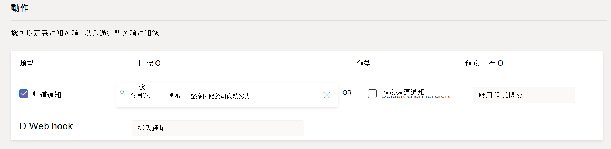
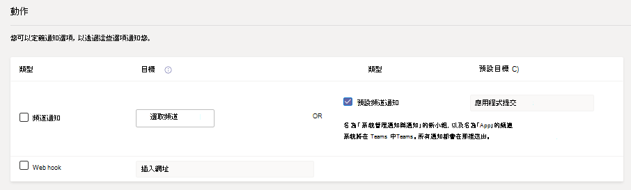
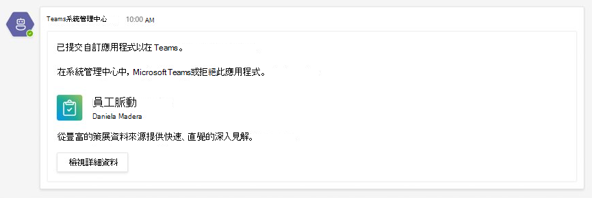
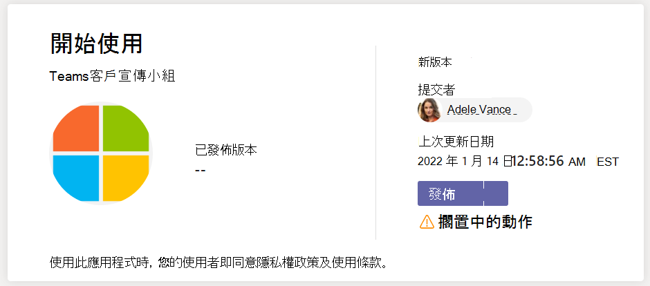
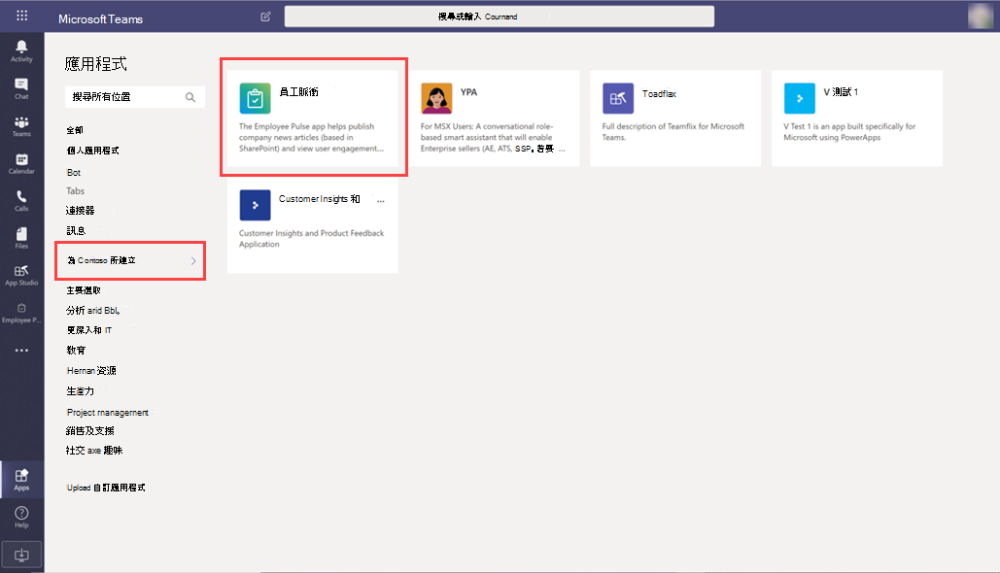
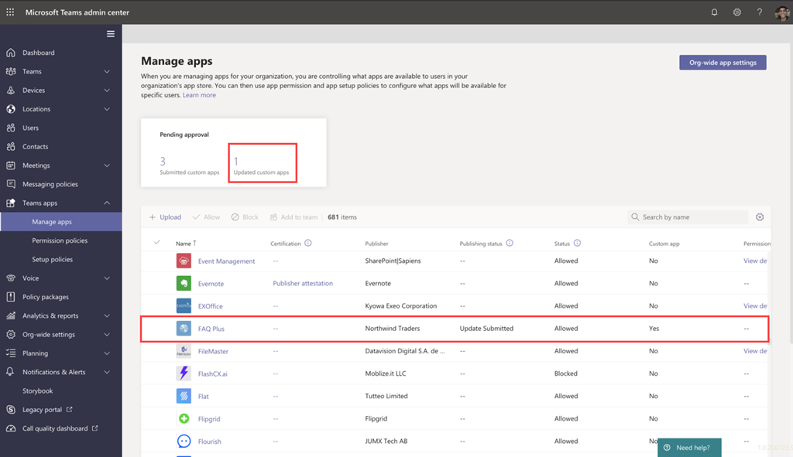
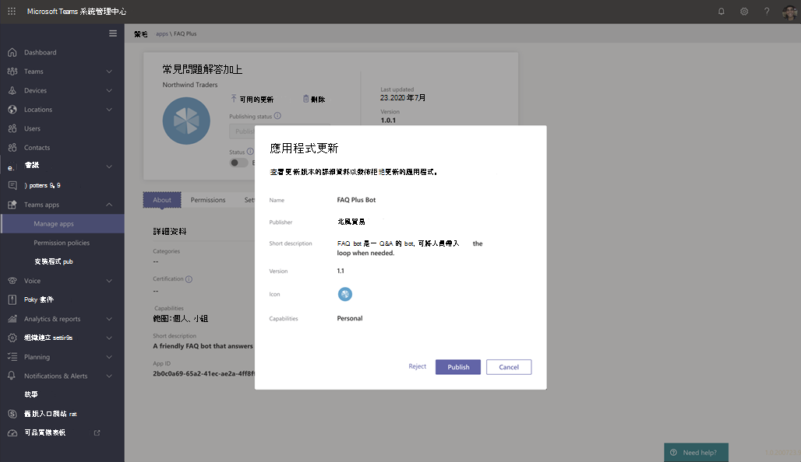

# 發佈透過應用程式提交 API Teams提交的自訂應用程式

## 概觀

> [!NOTE]
> 當您發佈自訂Teams應用程式時，組織 App Store 中的使用者可以使用它。 發佈自訂應用程式的方法有兩種，而使用方式取決於您取得應用程式的方式。 **本文著重于如何核准** 和發佈開發人員透過應用程式提交 API Teams自訂應用程式。 另一種方法 ，即上傳自訂應用程式，是當開發人員以新的格式傳送應用程式套件.zip使用。 若要深入瞭解這個方法，請參閱上傳應用程式套件 [來發佈自訂應用程式](/microsoftteams/upload-custom-apps)。 核准應用程式小工具在租使用者中GCC使用。

> [!IMPORTANT]
> 這個方法目前不適用於GCC環境。 您必須使用上傳 *自訂應用程式的方法* 。

本文提供端對端指南，瞭解如何將應用程式從開發Teams部署到探索。 您將概觀瞭解您在整個應用程式生命週期Teams提供的連接體驗，以簡化如何開發、部署及管理貴組織 App Store 中的自訂應用程式。

我們將涵蓋生命週期的每一個步驟，包括開發人員如何使用 Teams App 提交 API 將自訂應用程式直接提交至 Microsoft Teams 系統管理中心，以便您進行審核和核准、如何設定管理貴組織使用者相關應用程式的政策，以及使用者如何在 Teams 中探索這些應用程式。

本指南著重于應用程式Teams，適用于系統管理員和 IT 專業人員。 有關開發應用程式Teams，請參閱Teams[檔](/microsoftteams/platform)。

## 開發

### 建立應用程式

開發人員Microsoft Teams平臺，讓開發人員能輕鬆整合您自己的應用程式和服務，以提高生產力、更快速地做出決策，並圍繞現有內容和工作流程建立共同作業。 建立在 Teams 平臺上的應用程式是用戶端Teams服務與工作流程之間的橋樑，直接將它們納入您的共同合作平臺中。 若要詳細資訊，請前往開發人員Teams[檔](/microsoftteams/platform)。

### 提交應用程式

當應用程式可供生產使用時，開發人員可以使用 Teams App 提交 API 提交應用程式，此 API 可以從[Graph API](/graph/api/teamsapp-publish?view=graph-rest-beta&tabs=http#example-2-upload-a-new-application-for-review-to-an-organizations-app-catalog)、整合式開發環境 (IDE) 例如 Visual Studio Code 或 Power Apps 和 Power Virtual Agents. 這麼做之後，應用程式就可以在系統管理中心的 Microsoft Teams 管理應用程式頁面使用，您可以在此進行審閱和核准。

Microsoft Teams 內建的[Graph App](/graph/api/teamsapp-publish?tabs=http&view=graph-rest-beta#example-2-upload-a-new-application-for-review-to-an-organizations-app-catalog)提交 API 可讓貴組織在所選擇的平臺上開發，並自動化 Teams 上自訂應用程式的提交至核准程式。

以下範例說明此應用程式提交步驟在應用程式中Visual Studio Code：

請記住，這尚未將應用程式發佈至組織的 App Store。 此步驟將應用程式提交至 Microsoft Teams系統管理中心，您可以在此核准應用程式發佈到組織的 App Store。

若要進一Graph API 提交應用程式，請參閱[這裡](/graph/api/teamsapp-publish?tabs=http&view=graph-rest-beta#example-2-upload-a-new-application-for-review-to-an-organizations-app-catalog)。

## 通知

您可以開啟通知，以便知道開發人員何時提交新應用程式供審查和核准。 當開發人員提交應用程式更新時，您也會收到通知。 若要在系統管理中心Teams應用程式提交通知，請前往通知&[**通知****RulesApp**  >  ****  > ](https://admin.teams.microsoft.com/notifications/rules)提交，然後將狀態變更為使用中來啟用 **規則**。 此設定預設會關閉。 您必須是全域系統管理員或Teams才能開啟此設定。

開啟此設定後，您將在名為 App 提交的新頻道的系統管理通知和通知小組 **中收到通知**。 或者，您可以選擇現有的團隊和頻道，以取得傳送至指定小組和頻道的通知。 若要這樣做，請執行下列步驟：

1. 在應用程式 **提交規則** 中，選取動作下的 **頻道通知****核取方塊**。
1. 選擇選取 **頻道** 按鈕。
1. 搜尋要新增的團隊。
1. 搜尋要新增的頻道。
1. 選取 **Apply**。

    

> [!NOTE]
> 選取預設 **頻道通知** 核取方塊，以在應用程式提交頻道中接收通知給系統管理通知 **和** 通知小組。

您也可以在選取 Web 上核取方塊後，指定公用網頁連結 URL，以設定外部 **網頁連結** 的通知。 JSON 通知有效負載會送到您的網頁連結 URL。

設定應用程式提交規則之後，您可以在指定的頻道中查看通知卡片，以查看應用程式詳細資料，然後選取查看詳細資料，在系統管理中心Teams App。

## 驗證

左側 [流覽](/microsoftteams/manage-apps)的 Microsoft Teams 系統管理中心 (中的管理應用程式頁面，請前往 [ **Teams App**  >  **管理**](https://admin.teams.microsoft.com/manage-apps)應用程式) ，讓您查看貴組織的所有 Teams 應用程式。 頁面 **頂端的** 擱置核准小工具可讓您知道何時提交自訂應用程式供核准。

在表格中，新提交的應用程式會自動顯示已提交和封鎖狀態的 **發佈狀態**。****  您可以 **以遞減** 順序排序發佈狀態列，以快速找到應用程式。

按一下應用程式名稱以前往應用程式詳細資料頁面。 在關於 **的** 選項卡上，您可以查看應用程式的詳細資訊，包括描述、狀態、提交者及應用程式識別碼。

若要進一Graph API 檢查發佈 **狀態**，請參閱 [這裡](/graph/api/appcatalogs-list-teamsapps?tabs=http&view=graph-rest-beta#example-3-find-application-based-on-the-teams-app-manifest-id)。

## 發佈

當您準備好要讓使用者使用 App 時，請發佈應用程式。

1. 在 Microsoft Teams 系統管理中心的左側瀏覽窗格中，移至 **Teams 應用程式** > **管理應用程式**。
2. 按一下應用程式名稱以前往應用程式詳細資料頁面，然後在 [發佈 **狀態** > 方塊中，選取 [ **發佈**。

    

發佈應用程式之後，發佈 **狀態會變更****為已發佈，** 而狀態 **會自動** 變更為 **允許**。

## 設定和管理

### 控制應用程式的存取權

根據預設，貴組織的所有使用者都可以存取貴組織 App Store 中的應用程式。 若要限制及控制誰有權使用應用程式，您可以建立並指派應用程式權限原則。 若要深入了解，請參閱<a href="/microsoftteams/teams-app-permission-policies" target="_blank">管理 Teams 中的應用程式權限原則</a>。

### 釘上並安裝應用程式供使用者探索

根據預設，使用者若要尋找應用程式，必須前往貴組織的 App Store 並流覽或搜尋。 若要讓使用者輕鬆取得應用程式，您可以將應用程式釘到 Teams。 若要這麼做，請建立應用程式設定策略並指派給使用者。 若要深入了解，請參閱<a href="/microsoftteams/teams-app-setup-policies" target="_blank">管理 Teams 中的應用程式設定原則</a>。

### 搜尋稽核記錄Teams應用程式事件

您可以搜尋稽核記錄來Teams組織中應用程式活動。 若要深入瞭解如何搜尋稽核記錄，以及查看記錄在稽核記錄中的 Teams 活動清單，請參閱在 Teams 中搜尋<a href="/microsoftteams/audit-log-events" target="_blank">稽核記錄</a>。

在您可以搜尋稽核記錄檔之前，您必須先在<a href="https://protection.office.com" target="_blank">安全性與合規性中心</a>中開啟稽核。 如需深入了解，請參閱<a href="https://support.office.com/article/Turn-Office-365-audit-log-search-on-or-off-e893b19a-660c-41f2-9074-d3631c95a014" target="_blank">開啟或關閉稽核記錄</a>。 請記住，只有當您開啟稽核時，才能使用稽核資料。

## 探索及採用

擁有應用程式許可權的使用者可以在貴組織的 App Store 中找到它。 前往 **應用程式頁面上 *的*** 專為您的組織名稱建立，以尋找貴組織的自訂應用程式。

如果您建立並指派應用程式設定策略，應用程式會釘到 Teams 中的應用程式欄，以便指派該策略的使用者輕鬆存取。

## 更新

若要更新應用程式，開發人員應該繼續遵循開發區段 [的步驟](#develop) 。

當開發人員將更新提交到已發佈的自訂 App 時，系統就會在管理應用程式頁面的擱置 **核准** 小工具 [中收到通知](/microsoftteams/manage-apps) 。 在表格中， **應用程式的** 發佈狀態會設定為已 **提交更新**。 如果您開啟 App 提交通知，系統也會在 App 提交通道下的系統管理通知和通知小組收到通知。 通知卡片會提供連結，可直接將您帶至 Teams 中心中的應用程式。 若要瞭解如何開啟應用程式提交通知，[請參閱通知。](#notify)

若要審查併發布應用程式更新：

1. 在 Microsoft Teams 系統管理中心的左側瀏覽窗格中，移至 **Teams 應用程式** > **管理應用程式**。
2. 按一下應用程式名稱以前往應用程式詳細資料頁面，然後選取 [可用的更新來查看更新詳細資料。

    
3. 當您準備好時，請選取 **發佈** 以發佈更新。 這麼做會取代現有的應用程式、更新版本號碼，以及將 **發佈狀態變更** 為 **已發佈**。 對於更新的應用程式，所有應用程式權限原則與應用程式設定策略仍然會強制執行。

    如果您拒絕更新，應用程式的較舊版本會維持發佈狀態。

請記住下列事項：

- 應用程式核准後，任何一個人都可以將更新提交至應用程式。 這表示其他開發人員 ，包括原本提交應用程式的開發人員，可以提交更新至應用程式。
- 當開發人員提交 App 且要求擱置中時，只有相同的開發人員可以提交更新至應用程式。 其他開發人員只能在應用程式核准後提交更新。

若要進一Graph API 更新應用程式，請參閱<a href="/graph/api/teamsapp-update">這裡</a>。

## 相關主題

- [上傳應用程式套件來發佈自訂應用程式](upload-custom-apps.md)
- [在系統管理中心管理Microsoft Teams應用程式](manage-apps.md)
- [在 Teams 中管理自訂應用程式原則和設定](teams-custom-app-policies-and-settings.md)
- [在 Teams 中管理應用程式權限原則](teams-app-permission-policies.md)
- [在 Teams 中管理應用程式設定原則](teams-app-setup-policies.md)
- [Teams監控和警示](alerts/teams-admin-alerts.md)
- <a href="/graph/api/resources/teamsapp?view=graph-rest-beta" target="_blank">Microsoft Graph應用程式TEAMS API</a>
