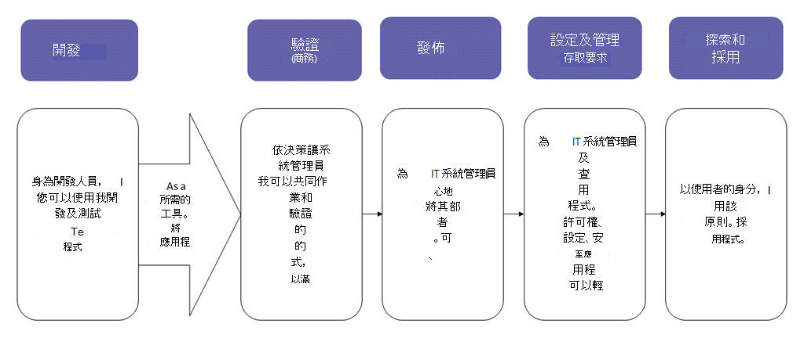
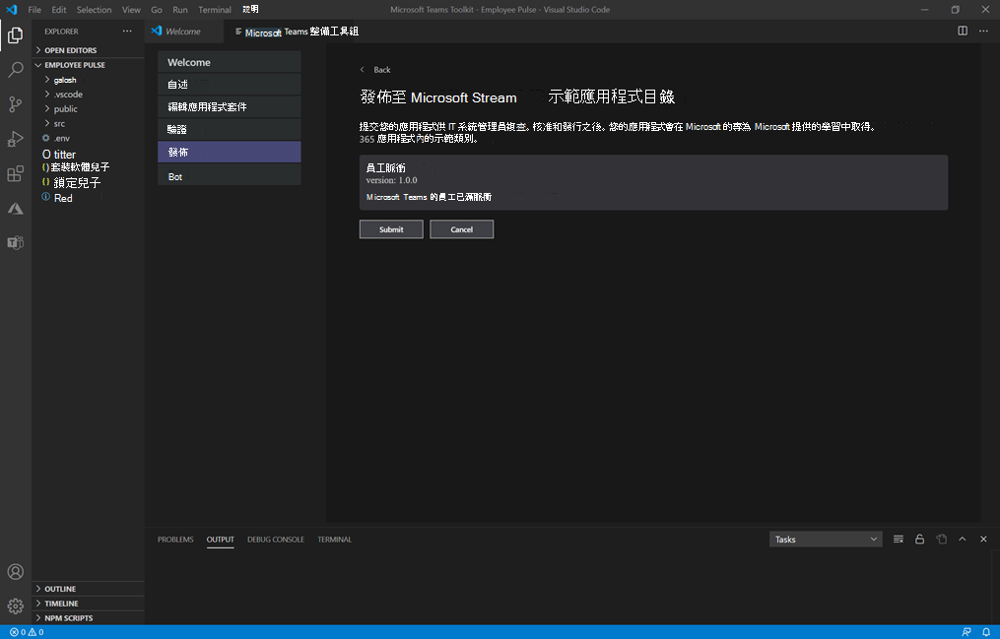
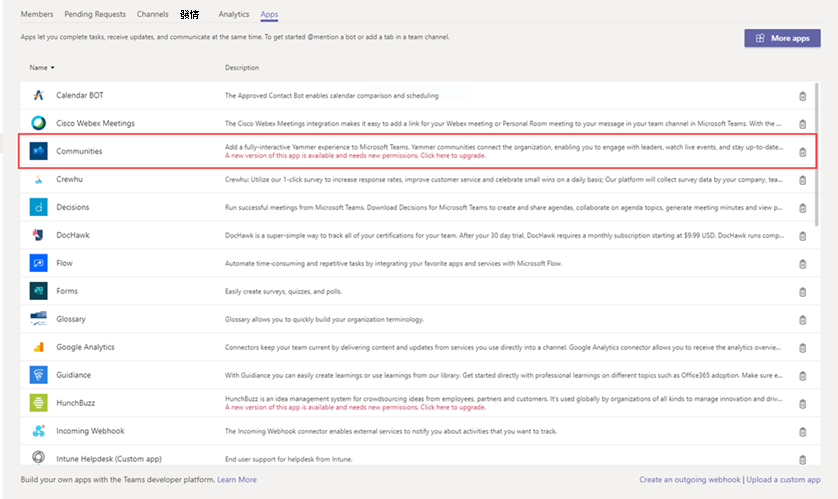

# 發佈透過團隊 App 提交 API 提交的自訂應用程式

## 概觀

> [!NOTE]
> 當您發佈自訂團隊 app 時，您組織的 app store 中的使用者就能使用該應用程式。 發佈自訂應用程式的方式有兩種，您使用的方式取決於您取得 app 的方式。 **本文重點說明如何核准併發布開發人員透過團隊 App 提交 API 提交的自訂應用程式**。 當開發人員以 .zip 格式傳送您的應用程式套件時，會使用另一個方法（上傳自訂的應用程式）。 若要深入瞭解該方法，請參閱 <a href="https://docs.microsoft.com/microsoftteams/upload-custom-apps" target="_blank">上傳應用程式套件以發佈自訂應用程式</a>。
 
本文提供如何將您的小組 app 從開發移至部署到探索的端對端指導方針。 您將掌握團隊在 app 週期中提供的連線體驗的概覽，以簡化在組織的 app store 中開發、部署及管理自訂應用程式的方式。

我們將涵蓋生命週期的每個步驟，包括開發人員如何使用團隊 App 提交 API 直接將自訂應用程式提交至 Microsoft 團隊系統管理中心，以供您查看及核准，以及如何設定策略來管理組織中的使用者應用程式，以及使用者如何在團隊中找到他們。

本指南主要說明 app 的小組各部分，且適用于系統管理員和 IT 專業人員。 如需開發小組 app 的詳細資訊，請參閱 <a href="https://docs.microsoft.com/microsoftteams/platform" target="_blank">團隊開發人員檔</a>。

## 開發

### 建立應用程式

Microsoft 團隊開發人員平臺可讓開發人員輕鬆地整合您自己的 app 與服務，以提高生產力、更快速地作出決策，以及在現有的內容和工作流程中建立共同作業。 在團隊平臺上建立的應用程式是團隊用戶端與您的服務與工作流程之間的橋樑，可直接將它們納入共同作業平臺的內容。 如需詳細資訊，請移至 <a href="https://docs.microsoft.com/microsoftteams/platform" target="_blank">團隊開發人員檔</a>。

### 提交應用程式

當應用程式準備好在生產中使用時，開發人員可以使用小組 App 提交 API 來提交應用程式，這可以從 <a href="https://docs.microsoft.com/graph/api/teamsapp-publish?view=graph-rest-1.0&tabs=http#example-2-upload-a-new-application-for-review-to-an-organizations-app-catalog" target="_blank">圖表 API</a>、整合開發環境 (IDE) （例如 Visual Studio 程式碼），或諸如電源 App 與 Power Virtual agent 之類的平臺。 如此一來，Microsoft 團隊系統管理中心的 [ <a href="https://docs.microsoft.com/microsoftteams/manage-apps" target="_blank">管理</a> app] 頁面上的應用程式可供使用，您可以在此查看及核准。 

<a href="https://docs.microsoft.com/graph/api/teamsapp-publish?view=graph-rest-1.0&tabs=http#example-2-upload-a-new-application-for-review-to-an-organizations-app-catalog" target="_blank">建立于 Microsoft Graph</a>的小組 APP 提交 API 可讓您的組織在您選擇的平臺上進行開發，並自動針對團隊中的自訂應用程式提供核准式提交程式。

以下是這個 app 提交步驟在 Visual Studio 程式碼中的外觀範例：

請記住，這並不會將 app 發佈到貴組織的 app store。 此步驟會將 app 提交至 Microsoft 團隊系統管理中心，您可以在其中核准發佈至組織的 app store。

如需使用圖形 API 來提交應用程式的詳細資訊，請參閱 <a href="https://docs.microsoft.com/graph/api/teamsapp-publish?view=graph-rest-1.0&tabs=http#example-2-upload-a-new-application-for-review-to-an-organizations-app-catalog" target="_blank">這裡</a>。

## 核實

[Microsoft 團隊系統管理中心] 中的 [<a href="https://docs.microsoft.com/microsoftteams/manage-apps" target="_blank">管理應用程式</a>] 頁面 (左側導覽中，移至 [**團隊 app**  >  **管理 app** ]) ，為您的組織提供所有團隊 app 的視圖。 頁面頂端的 **待定核准** 小工具可讓您知道何時提交自訂 app 以供核准。

在表格中，新提交的 app 會自動顯示已**提交**且已封鎖**狀態**的**Blocked****發佈狀態**。 您可以依遞減順序排序 [ **發佈狀態** ] 欄，以快速找到該應用程式。

![[管理 app] 頁面的螢幕擷取畫面，其中顯示擱置的要求和 app 狀態 ](media/custom-app-lifecycle-validate-app.png)

按一下應用程式名稱，移至 [應用程式詳細資料] 頁面。 在 [ **關於** ] 索引標籤上，您可以查看應用程式的詳細資料，包括描述、狀態、提交者和應用程式識別碼。

如需使用圖形 API 檢查 **發佈狀態**的詳細資訊，請參閱 <a href="https://docs.microsoft.com/graph/api/teamsapp-list?view=graph-rest-1.0&tabs=http#example-3-list-applications-with-a-given-id-and-return-the-submission-review-state" target="_blank">這裡</a>。

## 出版

當您準備好讓使用者使用 app 時，請發佈 app。

1. 在 Microsoft 團隊系統管理中心的左導覽中，移至 [**團隊 app**  >  **管理應用程式**]。
2. 按一下應用程式名稱，移至 [應用程式詳細資料] 頁面，然後在 [ **發佈狀態** ] 方塊中，選取 [ **發佈**]。

    發佈應用程式後， **發佈狀態** 會變更為 [ **已發佈** ]，而且 **狀態** 會自動變更為 [ **允許**]。

## 設定和管理

### 控制對應用程式的存取權

根據預設，貴組織中的所有使用者都可以存取貴組織 app store 中的 app。 若要限制及控制誰有權使用該應用程式，您可以建立並指派應用程式許可權原則。 若要深入瞭解，請參閱 <a href="https://docs.microsoft.com/microsoftteams/teams-app-permission-policies" target="_blank">在團隊中管理 app 許可權原則</a>。

### 釘選並安裝應用程式供使用者探索

根據預設，使用者可以找到您組織的 app 商店所需的 app，然後流覽或搜尋該應用程式。 若要讓使用者能夠輕鬆存取應用程式，您可以將應用程式釘選到 [團隊] 中的應用程式行。 若要這樣做，請建立應用程式設定原則，並將它指派給使用者。 若要深入瞭解，請參閱 <a href="https://docs.microsoft.com/microsoftteams/teams-app-setup-policies" target="_blank">管理團隊中的 app 設定原則</a>。

### 搜尋小組 app 事件的審核記錄

您可以搜尋 [審核記錄]，以查看貴組織中的 [小組 app] 活動。 若要進一步瞭解如何搜尋審核記錄，以及查看在審核記錄中記錄的小組活動清單，請參閱 <a href="https://docs.microsoft.com/microsoftteams/audit-log-events" target="_blank">在審核記錄中搜尋小組中的事件</a>。

在您可以搜尋審核記錄之前，您必須先在 <a href="https://protection.office.com" target="_blank">安全性 & 合規性中心</a>開啟審核。 若要深入瞭解，請參閱 <a href="https://support.office.com/article/Turn-Office-365-audit-log-search-on-or-off-e893b19a-660c-41f2-9074-d3631c95a014" target="_blank">開啟或關閉審核記錄搜尋</a>。 請記住，審核資料只能從您開啟審核的位置取得。

## 探索與採納

擁有 app 許可權的使用者可以在您組織的 app store 中找到該應用程式。 移至 [應用程式] 頁面上的 [**針對*您的組織名稱*建立**]，以尋找貴組織的自訂應用程式。

![顯示已發佈 app 之 [應用程式] 頁面的螢幕擷取畫面 ](media/custom-app-lifecycle-discovery.png)

如果您已建立並指派應用程式設定原則，應用程式會釘選在團隊中的應用程式行上，輕鬆存取指派了原則的使用者。

## 時更新

若要更新應用程式，開發人員應該繼續遵循 [ [開發](#develop) ] 區段中的步驟。

當開發人員提交已發佈的自訂應用程式的更新時，您會在 [<a href="https://docs.microsoft.com/microsoftteams/manage-apps" target="_blank">管理應用程式</a>] 頁面上的 [**待定核准**] 小工具中收到通知。 在表格中，應用程式的 **發佈狀態** 會設定為 [已 **提交更新**]。

![[管理 app] 頁面的螢幕擷取畫面，其中顯示擱置的要求和 app 狀態 ](media/custom-app-lifecycle-update-submitted.png)

若要查看併發布應用程式更新：

1. 在 Microsoft 團隊系統管理中心的左導覽中，移至 [**團隊 app**  >  **管理應用程式**]。
2. 按一下應用程式名稱，移至 [應用程式詳細資料] 頁面，然後選取 [ **可用** 以查看更新的詳細資料]。

    ![[管理 app] 頁面的螢幕擷取畫面，其中顯示擱置的要求和 app 狀態 ](media/custom-app-lifecycle-update-app.png)
3. 當您準備好時，請選取 [ **發佈** ] 以發佈更新。 這麼做會取代現有的 app、更新版本號碼，並將 **發佈狀態** 變更為 [ **已發佈**]。 所有 app 許可權原則和 app 設定原則，都會針對更新的 app 保持強制執行。

    如果您拒絕更新，較舊版本的 app 會保持發佈。

請記住下列事項：

- 當應用程式獲核准時，任何人都可以提交應用程式的更新。 這表示其他開發人員，包括最初提交 app 的開發人員，可以提交應用程式的更新。
- 當開發人員提交應用程式且要求擱置時，只有同一位開發人員才能提交應用程式的更新。 其他開發人員只能在應用程式核准後提交更新。

如需使用圖形 API 來更新應用程式的詳細資訊，請參閱 <a href="https://docs.microsoft.com/graph/api/teamsapp-update?view=graph-rest-1.0#example-2-update-a-previously-reviewed-and-published-application-to-the-teams-app-catalog" target="_blank">這裡</a>。

### 使用者的更新體驗

在大多數情況下，發佈應用程式更新之後，系統會自動為使用者顯示新版本。 不過， <a href="https://docs.microsoft.com/microsoftteams/platform/resources/schema/manifest-schema" target="_blank">Microsoft 團隊資訊清單</a> 有一些更新需要使用者驗收才能完成：

* 已新增或移除 bot
* 現有 bot 的 "botId" 屬性已變更
* 現有 bot 的 "isNotificationOnly" 屬性已變更
* Bot 的 "supportsFiles" 屬性已變更
* 已新增或移除訊息延伸
* 已新增新的連接器
* 新增了 [靜態] 索引標籤
* 新增 [可設定] 索引標籤
* "WebApplicationInfo" 中的屬性已變更

## 相關主題

- [透過上傳應用程式套件發佈自訂應用程式](upload-custom-apps.md)
- [在 Microsoft 團隊系統管理中心管理您的應用程式](manage-apps.md)
- [在 Teams 中管理自訂應用程式原則和設定](teams-custom-app-policies-and-settings.md)
- [在 Teams 中管理應用程式權限原則](teams-app-permission-policies.md)
- [在 Teams 中管理應用程式設定原則](teams-app-setup-policies.md)
- <a href="https://docs.microsoft.com/graph/api/resources/teamsapp?view=graph-rest-1.0" target="_blank">適用于團隊 app 的 Microsoft Graph API</a>
