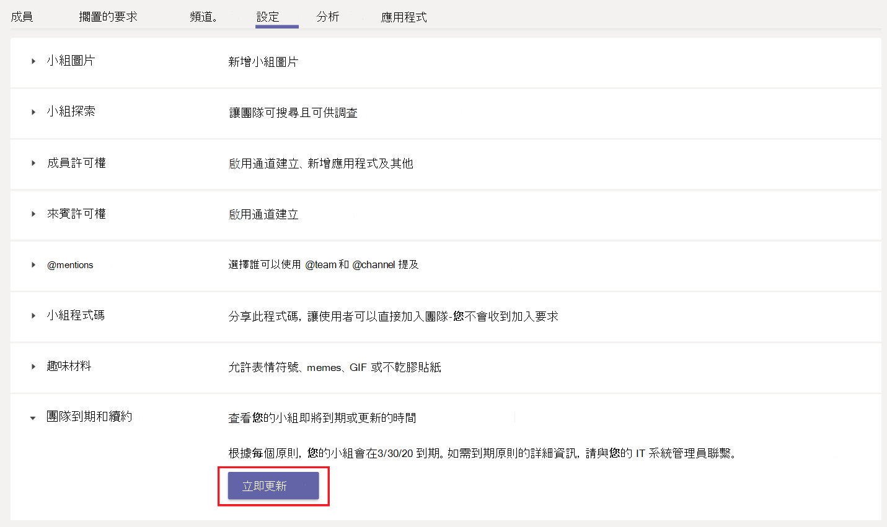

# Microsoft 團隊中的小組到期與更新Team expiration and renewal in Microsoft Teams

擁有大量小組的組織通常會有小組，這些都不是實際使用。Organizations with a large number of teams often have teams that are never actually used. 這可能是因為幾個原因，包括產品實驗、短期團隊共同作業，或團隊擁有者離開組織。This can happen because of several reasons including product experimentation, short-term team collaboration, or team owners leaving the organization. 隨著時間的推移，此類團隊可以在租使用者資源上累計並產生負擔。Over time, such teams can accumulate and create a burden on tenant resources.  

若要將未使用的團隊數作為系統管理員，您可以使用[Office 365 群組過期原則](https://docs.microsoft.com/office365/admin/create-groups/office-365-groups-expiration-policy)自動清理未使用的團隊。To curb the number of unused teams, as an admin, you can use [Office 365 Group expiration policy](https://docs.microsoft.com/office365/admin/create-groups/office-365-groups-expiration-policy) to automatically clean up unused teams. 由於團隊是由群組來支援，因此群組過期原則也會自動套用至小組。Because teams are backed by groups, group expiration policies automatically apply to teams as well.

當您將過期原則套用至小組時，小組擁有者會在團隊的到期日之前，在30天、15天和1天之前收到小組更新通知。When you apply an expiration policy to a team, a team owner receives a notification for team renewal 30 days, 15 days and 1 day before the team's expiration date. 當小組擁有者收到通知時，他們可以按一下 [團隊設定] 中的 [**立即更新**] 來更新小組。When the team owner receives the notification, they can click **Renew now** in team settings to renew the team.

![[立即更新] 按鈕的螢幕擷取畫面，用來更新小組設定中的小組](media/team-expiration.png "[立即更新] 按鈕的螢幕擷取畫面，用來更新小組設定中的小組")

如果小組擁有者沒有更新小組，則會將小組放在「虛刪除」狀態，這表示它可以在未來30天內還原。If the team owner doesn't renew the team, the team is put in a "soft-deleted" state, which means it can be restored within the next 30 days.

## 小組自動續約Team auto-renewal

有時候，小組擁有者可能無法更新小組，可能是因為他們忘記在續約時續約或離開。There can be times when a team owner is unable to renew the team perhaps because they forgot to renew or were away when renewal was due. 在這些案例中，活動中使用的小組可能會因套用至小組的過期原則而被刪除。In these scenarios, a team in active use can get deleted because of expiration policies that apply to the team.  

若要防止意外刪除，自動續約會自動啟用群組過期原則中的小組。To prevent accidental deletion, auto-renewal is automatically enabled for a team in the group expiration policy. 設定了群組過期原則之後，只要任何小組成員的到期日，就會自動更新，而不需要由團隊擁有者手動干預。When the group expiration policy is set up, any team that has at least one channel visit from any team member before its expiration date is automatically renewed without any manual intervention from the team owner.

## 已知問題Known issues

**團隊和基礎群組的到期日不相符****Expiration date of team and underlying group don't match**

在更新小組之前，會先續約支援小組的群組。Before a team is renewed, the group that backs the team is renewed first. 在續約時，會在群組中針對未來日期設定新的到期日。As part of renewal, a new expiry date is set on the group for a future date. 在團隊中可能不會立即看到這個新日期。This new date may not be immediately visible in Teams. 同步處理可能需要長達24小時。如果您在團隊及其基礎群組的到期日之間看到差異，請等候24小時，再尋求進一步的支援。It can take up to 24 hours to sync. If you see a discrepancy between the expiry date for a team and its underlying group, wait 24 hours before seeking further support.
