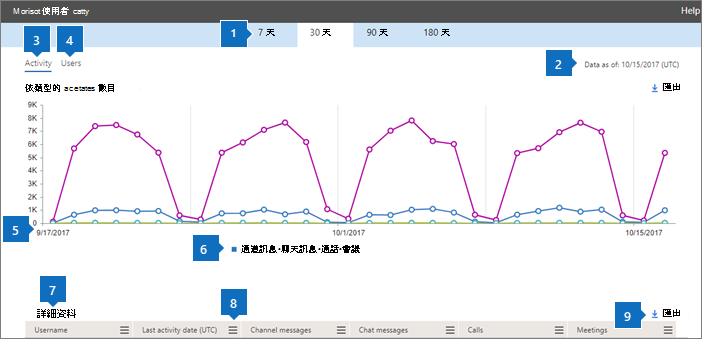
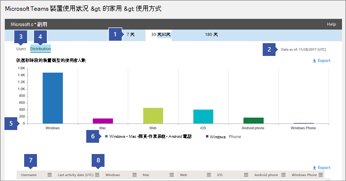

使用 Microsoft 團隊的活動報告 
========================================

您可以在 Microsoft 365 系統管理中心使用活動報告，查看貴組織中的使用者如何使用 Microsoft 團隊。 例如，如果有些人還沒有使用 Microsoft 團隊，他們可能不知道如何開始使用，或瞭解如何使用團隊更具效率與共同作業。 貴組織可以使用活動報告來決定將訓練和溝通努力排定的位置。

## 如何在 [報表] 儀表板中查看團隊報表

1. 在[Microsoft 365 系統管理中心](https://portal.office.com/adminportal/home)中，選取 [**報告** > **使用方式**]。
 
2. 在 [**使用狀況**] 頁面上，選擇 [**選取報告**]，然後在 [ **Microsoft 團隊**] 清單中，選擇您要查看的報告。

## 可使用的團隊活動報告

目前有兩個您可以查看的活動報告：

- [Microsoft 團隊使用者活動報告](#microsoft-teams-user-activity-report) 
- [Microsoft 團隊裝置使用量報告](#microsoft-teams-device-usage-report) 

### Microsoft 團隊使用者活動報告

[團隊使用者活動] 報告可讓您查看使用者在團隊中執行的最常見活動。 這包括有多少人參與頻道中的聊天、透過私人聊天訊息溝通的數量，以及參與通話或會議的次數。 您可以查看整個組織及每個個別使用者的這項資訊。

![系統管理中心的 [使用者活動] 報告螢幕擷取畫面。](media/teams-user-activity-report.png)

#### 解釋 Microsoft 團隊使用者活動報告

您可以透過查看 [**活動**] 和 [**使用者**] 圖表來查看團隊使用者活動。

|圖說文字 |說明  |
|--------|-------------|
|**sr-1**   |您可以在過去7天、30天、90天或180天的趨勢中查看團隊使用者活動報告。 不過，如果您在報表中按一下某個特定的時間範圍，該表（7）會顯示30天內的資料，最多為產生報告的日期（2）。 |
|**pplx-2**   |每個報告都有產生此報告的日期。 報告通常會反映來自啟用時間的24到48小時延遲時間。 |
|**3**   |[**活動**] 視圖會根據活動類型顯示 Microsoft 團隊活動數目。 活動類型包括「小組聊天」訊息、私人聊天訊息、通話及會議等數目。 |
|**4**   |[**使用者**] 視圖會顯示活動類型的使用者數目。 活動類型包括「小組聊天」訊息、私人聊天訊息、通話及會議等數目。 |
|**500**   |圖表上的 X 軸是特定報表的已選取日期範圍。 <ul><li>在 [**活動**] 圖表上，Y 軸是指定活動的計數。</ul></li> <ul><li>在 [**使用者**] 圖表上，Y 軸是參與團隊聊天、私人聊天、通話或會議的使用者數目。</ul></li> |
|**6**   |您可以按一下圖例中的專案，篩選您在圖表上看到的系列。 例如，在 [**活動**] 圖表中，按一下或敲擊 [**頻道訊息**]、[**交談訊息**]、[**通話**] 或 [**會議**]，只查看與每個專案相關的資訊。 變更選取範圍不會變更格線表格中的資訊。 |
|**utf-7**   |最寬（180天）報告時間範圍內的作用中團隊清單。  活動計數會根據選取的日期而有所不同。    若要查看表格中的下列資訊，請確定您已將欄新增至資料表。 <ul><li>[使用者**名稱**] 是使用者的電子郵件地址。 您可以顯示實際的電子郵件地址，或將此欄位設為匿名。</ul></li> <ul><li>[**上次活動日期（UTC）** ] 代表使用者參與 Microsoft 團隊活動的最後一個日期。</ul></li> <ul><li>[**頻道訊息**] 是使用者在特定的時段內，在小組聊天中張貼的唯一訊息數目。</ul></li> <ul><li>[**交談訊息**] 是使用者在特定的時段內，在私人聊天中張貼的唯一訊息數目。</ul></li> <ul><li>[**通話**] 是使用者在特定的時段內參與的呼叫次數。</ul></li> <ul><li>[**會議**] 是使用者在特定的時段內參與的線上會議數目。</ul></li> <ul><li>[**其他活動**] 是使用者的其他團隊活動數目，其中包括（且不限於）：對訊息、應用程式、處理檔案、搜尋、追蹤團隊和頻道，以及 favoriting。</ul></li> <ul><li>[**已刪除**] 表示該小組是否已刪除。 如果小組已刪除，但在報告期間有活動，則會顯示在 [已刪除] 設定為 true 的格線中。</ul></li> <ul><li>[**刪除日期**] 是指使用者刪除的日期。</ul></li> <ul><li>[**已指派的產品**] 是指派給使用者的產品清單。</ul></li>如果您組織的原則禁止您查看使用者資訊可識別的報告，您可以變更所有這些報告的隱私權設定。 請參閱[Microsoft 365 系統管理中心預覽的活動報告](https://support.office.com/article/activity-reports-in-the-office-365-admin-center-0d6dfb17-8582-4172-a9a9-aed798150263)中的 [**如何隱藏使用者層級詳細資料？** ] 區段。</ui> |
|**型**   |按一下或輕觸 [**欄**]，以新增或移除表格中的欄。 |
|**9**   |按一下或輕觸 [**匯出**]，將報表資料匯出至 Excel .csv 檔案。 這會匯出所有使用者的資料，並可讓您進行簡單的排序與篩選，以進行進一步分析。 如果您的使用者少於2000，您可以在報表本身的資料表中排序和篩選。 如果您的使用者超過2000個，您將需要匯出資料來篩選和排序報表。 

### Microsoft 團隊裝置使用量報告

[團隊裝置使用方式] 報告可提供使用者連線至團隊的相關資訊，包括行動應用程式。 此報告可協助您瞭解貴組織中受歡迎的裝置，以及有多少使用者可以使用 [移至]。

### 解釋 Microsoft 團隊裝置使用方式報告

您可以透過查看 [**使用者**] 和 [**配送**] 圖表，來查看團隊裝置使用量。

|圖說文字 |說明  |
|--------|-------------|
|**sr-1**   |您可以針對過去7天、30天、90天或180天的趨勢，查看團隊裝置報告。 不過，如果您在報表中按一下某個特定的時間範圍，該表（7）會顯示30天內的資料，最多為產生報告的日期（2）。 |
|**pplx-2**   |每個報告都有產生此報告的日期。 報告通常會反映來自啟用時間的24到48小時延遲時間。 |
|**3**   |[**使用者**] 視圖會顯示依裝置類型列出的每日使用者數目。 |
|**4**   |[**配送**] 視圖會透過裝置顯示所選時間範圍內的使用者數目。  |
|**500**   | <ul><li>在 [**使用者**] 圖表上，X 軸是報表所選取的日期範圍，而 Y 軸則是依裝置類型的使用者數目。</ul></li> <ul><li>在**配送**圖表上，X 軸會顯示連接至團隊的不同裝置，而 Y 軸則是使用裝置的使用者數目。</ul></li> |
|**6**   |您可以按一下圖例中的專案，篩選您在圖表上看到的系列。 例如，在 [**配送**] 圖表上，按一下或敲擊 [ **Windows**]、[ **Mac**]、[ **Web**]、[ **iOS**] 或 [ **Android** ]，只查看與每個專案相關的資訊。 變更選取範圍不會變更格線表格中的資訊。 |
|**utf-7**   |最寬（180天）報告時間範圍內的作用中團隊清單。  活動計數會根據選取的日期而有所不同。    若要在表格中查看下列資訊，請確定您已將欄新增至資料表。 <ul><li>[使用者**名稱**] 是使用者的電子郵件地址。 您可以顯示實際的電子郵件地址，或將此欄位設為匿名。</ul></li> <ul><li>[**上次活動日期（UTC）** ] 代表使用者參與團隊活動的最後一個日期。</ul></li> <ul><li>[**已刪除**] 表示該小組是否已刪除。 如果小組已刪除，但在報告期間有活動，則會顯示在 [已刪除] 設定為 true 的格線中。</ul></li><ul><li>[**刪除日期**] 是指使用者刪除的日期。</ul></li> <ul><li>如果使用者是在 Windows 電腦上的小組桌面用戶端中使用中，則會選取 [ **Windows** ]。</ul></li> <ul><li>如果使用者在 macOS 電腦上的小組桌面用戶端中處於作用中，則會選取**Mac** 。</ul></li>  <ul><li>如果使用者在團隊網頁用戶端上是作用中的，則會選取 [**網站**]。</ul></li> <ul><li>如果使用者在 iOS 的 [小組行動用戶端] 上是作用中的，就會選取**ios** 。</ul></li> <ul><li>如果使用者在 Android 版團隊行動用戶端上是作用中的，則會選取 [ **android 手機**]。</ul></li></li> <ui>如果您組織的原則禁止您查看使用者資訊可識別的報告，您可以變更所有這些報告的隱私權設定。請參閱[Microsoft 365 系統管理中心預覽的活動報告](https://support.office.com/article/activity-reports-in-the-office-365-admin-center-0d6dfb17-8582-4172-a9a9-aed798150263)中的 [**如何隱藏使用者層級詳細資料？** ] 區段。</ui> |
|**型**   |按一下或輕觸 [**欄**]，以新增或移除表格中的欄。 |
|**9**   |按一下或輕觸 [**匯出**]，將報表資料匯出至 Excel .csv 檔案。 這會匯出所有使用者的資料，並可讓您進行簡單的排序與篩選，以進行進一步分析。 如果您的使用者少於2000，您可以在報表本身的資料表中排序和篩選。 如果您的使用者超過2000個，您將需要匯出資料來篩選和排序報表。 

## 誰可以存取團隊活動報告

已指派的使用者可以存取活動報告：

- Office 365 全域系統管理員角色
- 特定產品的管理員角色（Exchange、商務用 Skype 或 SharePoint）
- 報告閱讀者角色

### 報告閱讀者角色

您可以將*報告閱讀*者角色指派給您想要存取這些報告的非 IT 員工。 您可以將此角色指派給訓練主管或商務專案關係人，以確保他們有權存取可促進團隊採納的深入見解。

## [報表] 儀表板上的其他資訊

### 一覽式活動小工具

[報告] 儀表板包括來自團隊在「一覽式活動」小工具中的使用資料，可讓您使用 Office 365 中的其他各種服務來溝通及共同作業。

![[團隊一覽] 活動小工具的螢幕擷取畫面。](media/at-a-glance-activity-widget.png)

### 團隊活動卡片

[報表] 儀表板上的 [團隊活動卡] 可讓您大致瞭解團隊中的活動，包括作用中的使用者人數，以便您快速瞭解使用該服務的使用者數目。 按一下儀表板上的活動卡片會將您帶到 [小組使用者] 活動報告。 

![[小組] 活動卡片的螢幕擷取畫面。](media/teams-activity-card.png)
