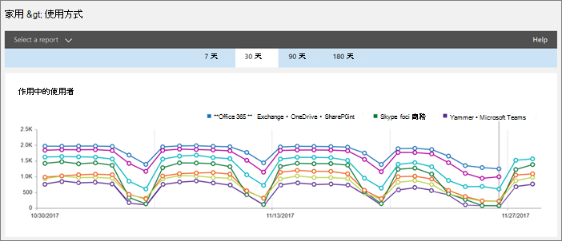
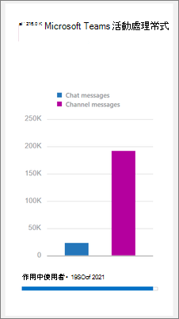

# 使用活動報告Microsoft Teams 

您可以使用活動報告中Microsoft 365 系統管理中心查看貴組織中使用者如何使用Microsoft Teams。 例如，如果有些人尚未使用Microsoft Teams，他們可能無法瞭解如何開始使用，或瞭解如何使用Teams來提高工作效率和共同合作。 組織可以使用活動報告來決定要優先進行訓練和溝通的方面。

## 如何在報表儀表板Teams報表

1. 在 [Microsoft 365 系統管理中心中](https://portal.office.com/adminportal/home)，選取 報告  >  **使用方式**。
 
2. 在使用 **狀況** 頁面上，選擇選取報表，Microsoft Teams **報表清單** 的 Microsoft Teams下，選擇您想要查看的報告。

## Teams活動報告

目前您可以查看兩個活動報告：

- [Microsoft Teams使用者活動報告](#microsoft-teams-user-activity-report) 
- [Microsoft Teams裝置使用方式報告](#microsoft-teams-device-usage-report) 

### Microsoft Teams使用者活動報告

使用者Teams報告提供您使用者于其中執行之最常見活動的Teams。 這包括有多少人參與頻道中的聊天、有多少人透過私人聊天訊息通訊，以及有多少人參與通話或會議。 您可以看見整個組織以及每個使用者的這項資訊。

#### 解譯Microsoft Teams活動報告

您可以查看活動圖Teams使用者活動。  

|標注 |描述  |
|--------|-------------|
|**1**   |您可以Teams使用者活動報告，查看過去 7 天、30 天、90 天或 180 天的趨勢。 不過，如果您按一下報告中的特定時間範圍，表格 (7) 會顯示 30 天內的資料，最多為報表產生日期 (2) 。 |
|**2**   |每個報表都有產生此報表的日期。 報告通常會反映啟用時間起 24 到 48 小時的延遲。 |
|**3**   |活動 **視圖** 會顯示活動Microsoft Teams活動數目。 活動類型為小組聊天訊息、私人聊天訊息、通話和會議數目。 |
|**4**   |使用者 **視圖** 會以活動類型顯示使用者數目。 活動類型為小組聊天訊息、私人聊天訊息、通話和會議數目。 |
|**5**   |圖表上的 X 軸是特定報表的選取日期範圍。 <ul><li>在 **活動圖表** 上，Y 軸是指定活動的計數。</ul></li> <ul><li>在使用者 **圖表** 上，Y 軸是參與團隊聊天、私人聊天、通話或會議的使用者數目。</ul></li> |
|**6**   |您可以按一下圖例中的專案，來篩選圖表上看到的數列。 例如，在 [**活動** 圖上，按一下或點一下頻道訊息、聊天訊息、通話或 **會議**，只查看每個訊息的相關資訊。  變更此選取範圍不會變更格線表格中的資訊。 |
|**7**   |報告時間範圍為 180 天 (最) 團隊的清單。  活動計數會根據日期選取範圍而有所差異。    若要查看下表的下列資訊，請確定您將欄新增到資料表。 <ul><li>**使用者** 名稱是使用者的電子郵件地址。 您可以顯示實際的電子郵件地址，或將此欄位匿名。</ul></li> <ul><li>**[上次活動 (UTC)** 是指使用者最後一次參與活動Microsoft Teams日期。</ul></li> <ul><li>**頻道訊息** 是使用者在指定的時段內，在小組聊天中張貼的唯一訊息數目。</ul></li> <ul><li>**聊天訊息** 是使用者在指定的時段內，在私人聊天中張貼的唯一訊息數目。</ul></li> <ul><li>**通話** 是使用者在指定的時段內參與的通話數。</ul></li> <ul><li>**會議** 是使用者在指定的時段內參與的線上會議數目。</ul></li> <ul><li>其他活動 **是使用者** 進行的其他小組活動數量，其中一些活動包括但不限於：喜歡郵件、應用程式、處理檔案、搜尋、遵循團隊和頻道，以及喜歡它們。</ul></li> <ul><li>**刪除** 代表團隊是否已刪除。 如果團隊已被刪除，但報告期間有活動，該團隊會顯示在格線中，已刪除的設定為 True。</ul></li> <ul><li>**刪除日期** 是使用者被刪除的日期。</ul></li> <ul><li>**已指派** 的產品是指派給使用者的產品清單。</ul></li>如果貴組織的政策禁止您檢視可識別使用者資訊的報告，您可以變更所有這些報表的隱私權設定。 Check out the **How do I hide user level details?** section in the [Activity Reports in the Microsoft 365 Admin Center Preview](https://support.office.com/article/activity-reports-in-the-office-365-admin-center-0d6dfb17-8582-4172-a9a9-aed798150263).</ui> |
|**8**   |按一下或點 **一下 [欄** 來新增或移除表格中的欄。 |
|**9**   |按一下或點 **一下 [匯出** 以匯出報表資料至Excel .csv檔案。 這會匯出所有使用者的資料，並可讓您執行簡單的排序和篩選，以便進一步分析。 如果您的使用者少於 2，000 人，您可以在報表本身的表格內排序和篩選。 如果您有超過 2，000 個使用者，您必須匯出資料，以篩選及排序報表。 

### Microsoft Teams裝置使用方式報告

裝置Teams使用方式報告會提供使用者如何連至 Teams，包括行動裝置 App 的資訊。 報告可協助瞭解貴組織中哪些裝置很熱門，以及有多少使用者正在外工作。

### 解譯Microsoft Teams使用方式報告

您可以查看使用者和通訊Teams，查看裝置使用方式。  

|標注 |描述  |
|--------|-------------|
|**1**   |您可以Teams裝置報告，查看過去 7 天、30 天、90 天或 180 天的趨勢。 不過，如果您按一下報告中的特定時間範圍，表格 (7) 會顯示 30 天內的資料，最多為報表產生日期 (2) 。 |
|**2**   |每個報表都有產生此報表的日期。 報告通常會反映啟用時間起 24 到 48 小時的延遲。 |
|**3**   |使用者 **視圖** 會以裝置類型顯示每日使用者數。 |
|**4**   |通訊 **組** 視圖會顯示所選時段內按裝置顯示的使用者數目。  |
|**5**   | <ul><li>在使用者 **圖表** 上，X 軸是報表的選取日期範圍，而 Y 軸是按裝置類型顯示的使用者數目。</ul></li> <ul><li>在 **通訊圖** 上，X 軸會顯示用來連接到該裝置Teams而 Y 軸是使用裝置的使用者數目。</ul></li> |
|**6**   |您可以按一下圖例中的專案，來篩選圖表上看到的數列。 例如，在 [發佈圖Windows、Mac、Linux、Web、iOS或 **Android** 上，按一下或點一下 ，只查看與每個圖表相關的資訊。   變更此選取範圍不會變更格線表格中的資訊。 |
|**7**   |報告時間範圍為 180 天 (最) 團隊的清單。  活動計數會根據日期選取範圍而有所差異。    若要在表格中查看下列資訊，請確定您將欄新加到資料表中。 <ul><li>**使用者** 名稱是使用者的電子郵件地址。 您可以顯示實際的電子郵件地址，或將此欄位匿名。</ul></li> <ul><li>**[上次活動日期 (UTC**) 是指使用者最後一次參與活動Teams日期。</ul></li> <ul><li>**刪除** 代表團隊是否已刪除。 如果團隊已被刪除，但報告期間有活動，該團隊會顯示在格線中，已刪除的設定為 True。</ul></li><ul><li>**刪除日期** 是使用者被刪除的日期。</ul></li> <ul><li>**Windows，** 如果使用者在以電腦為基礎的電腦上Teams桌面用戶端中Windows，系統即會選取該選項。</ul></li> <ul><li>**如果使用者在 macOS** 電腦上使用 Teams桌面用戶端，會選取 Mac。</ul></li>  <ul><li>**如果使用者** 在 Linux 電腦上使用Teams桌面用戶端，會選取 Linux。</ul></li>   <ul><li>**如果使用者** 在 Web 用戶端上Teams已選取 Web。</ul></li> <ul><li>**如果使用者在 iOS** 行動用戶端上Teams iOS，即會選取 iOS。</ul></li> <ul><li>**如果使用者在 Android** 行動用戶端上Teams已選取 Android 手機。</ul></li></li> 如果貴組織的政策禁止您檢視可識別使用者資訊的報告，您可以變更所有這些報表的隱私權設定。 Check out the **How do I hide user level details?** section in the [Activity Reports in the Microsoft 365 Admin Center Preview](https://support.office.com/article/activity-reports-in-the-office-365-admin-center-0d6dfb17-8582-4172-a9a9-aed798150263).</ui> |
|**8**   |按一下或點 **一下 [欄** 來新增或移除表格中的欄。 |
|**9**   |按一下或點 **一下 [匯出** 以匯出報表資料至Excel .csv檔案。 這會匯出所有使用者的資料，並可讓您執行簡單的排序和篩選，以便進一步分析。 如果您的使用者少於 2，000 人，您可以在報表本身的表格內排序和篩選。 如果您有超過 2，000 個使用者，您必須匯出資料，以篩選及排序報表。 

## 神秘存取Teams活動報告

指派的使用者可以存取活動報告：

- 全域系統管理員角色
- 產品特定的系統管理員角色 (Exchange商務用 Skype或SharePoint) 
- 報表讀取者角色

### 報表讀取者角色

您可以將報表讀取者角色指派給沒有系統管理員許可權，但負責推動採用或追蹤授權使用方式Teams。 若要瞭解如何指派角色，請參閱指派系統管理員和非系統管理員角色給使用者[，Azure Active Directory。](/azure/active-directory/fundamentals/active-directory-users-assign-role-azure-portal)

## 報表儀表板上的其他資訊

### 快速流覽活動小工具

報表儀表板包含 Teams 在快速流覽活動小工具中的使用方式資料，讓您瞭解使用者在 Microsoft 365 或 Office 365 中使用其他各種服務通訊和共同作業的方式。

### Teams活動卡片

Teams儀表板上的活動卡片提供 Teams 活動概觀，包括使用中使用者數目，以便快速瞭解使用服務的使用者數目。 按一下儀表板上的活動卡片，即可Teams活動報表。 

