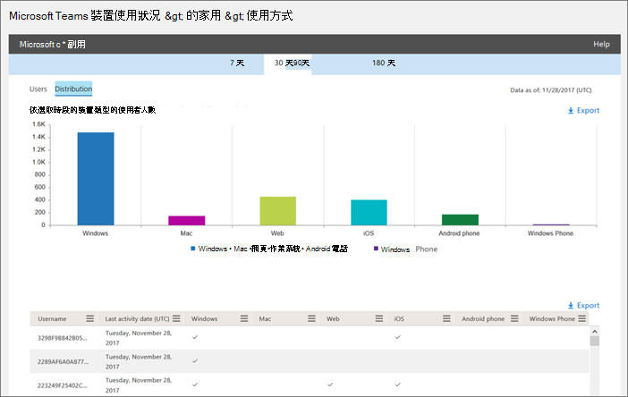

使用活動報告Microsoft TeamsUse activity reports for Microsoft Teams 
========================================

您可以在系統管理中心Microsoft 365活動報告，查看貴組織的使用者如何使用Microsoft Teams。You can use activity reports in the Microsoft 365 admin center to see how users in your organization are using Microsoft Teams. 例如，如果有些人尚未Microsoft Teams，他們可能無法瞭解如何開始使用，或瞭解如何使用Teams來提高工作效率和共同合作。For example, if some don't use Microsoft Teams yet, they might not know how to get started or understand how they can use Teams to be more productive and collaborative. 組織可以使用活動報告來決定要優先進行訓練和溝通的方面。Your organization can use the activity reports to decide where to prioritize training and communication efforts.

## 如何在報表儀表板Teams報表How to view the Teams reports in the Reports dashboard

1. 在系統 [管理Microsoft 365](https://portal.office.com/adminportal/home)中，選取報告  >  **使用方式**。In the [Microsoft 365 admin center](https://portal.office.com/adminportal/home), select **Reports** > **Usage**.
 
2. 在使用 **狀況** 頁面上，選擇選取報表，Microsoft Teams **報表清單中的** 選項下，選擇您想要查看的報告。On the **Usage** page, choose **Select a report**, and then under **Microsoft Teams** in the list of reports, choose the report you want to view.

## Teams活動報告Teams activity reports that are available

目前您可以查看兩個活動報告：There are currently two activity reports you can view:

- [Microsoft Teams使用者活動報告Microsoft Teams user activity report](#microsoft-teams-user-activity-report) 
- [Microsoft Teams裝置使用方式報告Microsoft Teams device usage report](#microsoft-teams-device-usage-report) 

### Microsoft Teams使用者活動報告Microsoft Teams user activity report

使用者Teams報告提供您使用者在 Teams 中執行之最常見活動的Teams。The Teams user activity report gives you a view of the most common activities that your users perform in Teams. 這包括有多少人在頻道中參與聊天、有多少人透過私人聊天訊息通訊，以及有多少人參與通話或會議。This includes how many people engage in a chat in a channel, how many communicate via private chat message, and how many participate in calls or meetings. 您可以看見整個組織以及每個使用者的這項資訊。You can see this information for your whole organization, as well as for each individual user.

#### 解譯Microsoft Teams活動報告Interpret the Microsoft Teams user activity report

您可以查看活動圖Teams使用者活動。  You can get a view into Teams user activity by looking at the **Activity** and **Users** charts.

|標注Callout |描述Description  |
|--------|-------------|
|**1****1**   |您可以Teams使用者活動報告，查看過去 7 天、30 天、90 天或 180 天的趨勢。The Teams user activity report can be viewed for trends over the last 7 days, 30 days, 90 days, or 180 days. 不過，如果您按一下報告中的特定時間範圍，表格 (7) 會顯示 30 天內的資料，最多為產生報表的日期 (2) 。However, if you click into a particular time range in the report, the table (7) will show data for 30 days, up to the date (2) for when the report was generated. |
|**2****2**   |每個報表都有產生此報表的日期。Each report has a date for when this report was generated. 報告通常會反映啟用時間起 24 到 48 小時的延遲。The reports usually reflect a 24 to 48 hour latency from time of activity. |
|**3****3**   |活動 **視圖** 會以活動類型Microsoft Teams活動數目。The **Activity** view shows you the number of Microsoft Teams activities by activity type. 活動類型為小組聊天訊息、私人聊天訊息、通話和會議數目。The activity types are number of team chat messages, private chat messages, calls, and meetings. |
|**4****4**   |使用者 **視圖** 會以活動類型顯示使用者數目。The **Users** view shows you the number of users by activity type. 活動類型為小組聊天訊息、私人聊天訊息、通話和會議數目。The activity types are number of team chat messages, private chat messages, calls, and meetings. |
|**5****5**   |圖表上的 X 軸是特定報表的選取日期範圍。The X axis on the charts is the selected date range for the specific report. <ul><li>在 **活動圖表** 上，Y 軸是指定活動的計數。On the **Activity** chart, the Y axis is the count of the specified activity.</ul></li> <ul><li>在使用者 **圖表** 上，Y 軸是參與團隊聊天、私人聊天、通話或會議的使用者數目。On the **Users** chart, the Y axis is the number of users participating in teams chats, private chats, calls, or meetings.</ul></li> |
|**6****6**   |您可以按一下圖例中的專案，來篩選圖表上看到的數列。You can filter the series you see on the chart by clicking on an item in the legend. 例如，在 [**活動** 圖上，按一下或點一下頻道訊息、**聊天** 訊息、通話或 **會議**，以查看每個訊息的相關資訊。For example, on the **Activity** chart, click or tap **Channel messages**, **Chat messages**, **Calls**, or **Meetings** to see only the info related to each one. 變更此選取範圍不會變更格線表格中的資訊。Changing this selection doesn't change the information in the grid table. |
|**7****7**   |報告時間範圍為 180 天 (最) 團隊的清單。The list of active teams across the widest (180-day) reporting time frame.  活動計數會根據日期選取範圍而有所差異。The activity count will vary according to the date selection.    若要查看下表的下列資訊，請確定您將欄新增到資料表。To see the following information the table, make sure you add the columns to the table. <ul><li>**使用者** 名稱是使用者的電子郵件地址。**Username** is the email address of the user. 您可以顯示實際的電子郵件地址，或將此欄位匿名。You can display the actual email address or make this field anonymous.</ul></li> <ul><li>**[上次活動 (UTC)** 是指使用者最後一次參與活動Microsoft Teams日期。**Last Activity Date (UTC)** refers to the last date that the user participated in a Microsoft Teams activity.</ul></li> <ul><li>**頻道訊息** 是使用者在指定的時段內，在小組聊天中張貼的唯一訊息數目。**Channel messages** is the number of unique messages that the user posted in a team chat during the specified time period.</ul></li> <ul><li>**聊天訊息** 是使用者在指定的時段內，在私人聊天中張貼的唯一訊息數目。**Chat messages** is the number of unique messages that the user posted in a private chat during the specified time period.</ul></li> <ul><li>**通話** 是使用者在指定的時段內參與的通話次數。**Calls** is the number of calls that the user participated in during the specified time period.</ul></li> <ul><li>**會議** 是使用者在指定的時段內參與的線上會議數目。**Meetings** is the number of online meetings that the user participated in during the specified time period.</ul></li> <ul><li>其他活動 **是使用者** 進行的其他小組活動數目，其中一些活動包括但不限於：喜歡郵件、應用程式、處理檔案、搜尋、遵循團隊和頻道，以及喜歡它們。**Other activity** is the number of other team activities by the user some of which include, and not limited to: liking messages, apps, working on files, searching, following teams and channel and favoriting them.</ul></li> <ul><li>**刪除** 代表團隊是否已刪除。**Deleted** indicates if the team is deleted. 如果小組已被刪除，但報告期間有活動，它會顯示在格線中，已刪除的設定為 true。If the team is deleted, but had activity in the reporting period, it will show up in the grid with deleted set to true.</ul></li> <ul><li>**刪除日期** 是使用者被刪除的日期。**Deleted date** is the date that the user was deleted.</ul></li> <ul><li>**已指派的產品** 是指派給使用者的產品清單。**Product assigned** is the list of products that are assigned to the user.</ul></li>如果貴組織的政策禁止您檢視可識別使用者資訊的報告，您可以變更所有這些報表的隱私權設定。If your organization's policies prevents you from viewing reports where user information is identifiable, you can change the privacy setting for all these reports. Check out the **How do I hide user level details?** section in the [Activity Reports in the Microsoft 365 Admin Center Preview](https://support.office.com/article/activity-reports-in-the-office-365-admin-center-0d6dfb17-8582-4172-a9a9-aed798150263).</ui>Check out the **How do I hide user level details?** section in the [Activity Reports in the Microsoft 365 Admin Center Preview](https://support.office.com/article/activity-reports-in-the-office-365-admin-center-0d6dfb17-8582-4172-a9a9-aed798150263).</ui> |
|**8****8**   |按一下或點 **一下 [欄** 以新增或移除表格中的欄。Click or tap **Columns** to add or remove columns in the table. |
|**9****9**   |按一下或點 **一下 [匯出** 以匯出報表資料至Excel .csv檔案。Click or tap **Export** to export report data to an Excel .csv file. 這會匯出所有使用者的資料，並可讓您執行簡單的排序和篩選，以便進一步分析。This exports data of all users and enables you to do simple sorting and filtering for further analysis. 如果您的使用者少於 2，000 人，您可以在報表本身的表格內排序和篩選。If you have less than 2,000 users, you can sort and filter within the table in the report itself. 如果您有超過 2，000 個使用者，您必須匯出資料，以篩選及排序報表。If you have more than 2,000 users, you will have to export the data to filter and sort the report. 

### Microsoft Teams裝置使用方式報告Microsoft Teams device usage report

Teams裝置使用方式報告會提供使用者如何連至您的Teams資訊，包括行動裝置 App。The Teams device usage report provides you with information about how your users connect to Teams, including mobile apps. 報告可協助瞭解貴組織中哪些裝置很熱門，以及有多少使用者正在外工作。The report helps you understand which devices are popular in your organization and how many users work on the go.

### 解譯Microsoft Teams裝置使用方式報告Interpret the Microsoft Teams device usage report

您可以查看使用者和通訊Teams，查看裝置使用方式。  You can get a view into Teams device usage by looking at the **Users** and **Distribution** charts.

|標注Callout |描述Description  |
|--------|-------------|
|**1****1**   |您可以Teams裝置報告，查看過去 7 天、30 天、90 天或 180 天的趨勢。The Teams device report can be viewed for trends over the last 7 days, 30 days, 90 days, or 180 days. 不過，如果您按一下報告中的特定時間範圍，表格 (7) 會顯示 30 天內的資料，最多為產生報表的日期 (2) 。However, if you click into a particular time range in the report, the table (7) will show data for 30 days, up to the date (2) for when the report was generated. |
|**2****2**   |每個報表都有產生此報表的日期。Each report has a date for when this report was generated. 報告通常會反映啟用時間起 24 到 48 小時的延遲。The reports usually reflect a 24 to 48 hour latency from time of activity. |
|**3****3**   |使用者 **視圖** 會以裝置類型顯示每日使用者數。The **Users** view shows you the number of daily users by device type. |
|**4****4**   |通訊 **組** 視圖會顯示所選時段內按裝置顯示的使用者數目。The **Distribution** view shows you the number of users by device over the selected time period.  |
|**5****5**   | <ul><li>在使用者 **圖表** 上，X 軸是報表的選取日期範圍，而 Y 軸是按裝置類型顯示的使用者數目。On the **Users** chart, the X axis is the selected date range for the report and the Y axis is the number of users by device type.</ul></li> <ul><li>在 **通訊圖** 上，X 座標軸會顯示用來連接到該裝置Teams而 Y 軸是使用裝置的使用者數目。On the **Distribution** chart, the X axis shows the different devices used to connect to Teams and the Y axis is the number of users using the device.</ul></li> |
|**6****6**   |您可以按一下圖例中的專案，來篩選圖表上看到的數列。You can filter the series you see on the chart by clicking on an item in the legend. 例如，在 [發佈圖Windows、Mac、Linux、Web、iOS或 **Android** 上，按一下或點一下 ，只查看與每個圖表相關的資訊。   For example, on the **Distribution** chart, click or tap **Windows**, **Mac**, **Linux**, **Web**, **iOS**, or **Android** to see only the info related to each one. 變更此選取範圍不會變更格線表格中的資訊。Changing this selection doesn't change the information in the grid table. |
|**7****7**   |報告時間範圍為 180 天 (最) 團隊的清單。The list of active teams across the widest (180-day) reporting time frame.  活動計數會根據日期選取範圍而有所差異。The activity count will vary according to the date selection.    若要在表格中查看下列資訊，請確定您將欄新加到資料表中。To see the following information in the table, make sure you add the columns to the table. <ul><li>**使用者** 名稱是使用者的電子郵件地址。**Username** is the email address of the user. 您可以顯示實際的電子郵件地址，或將此欄位匿名。You can display the actual email address or make this field anonymous.</ul></li> <ul><li>**[上次活動日期 (UTC**) 是指使用者最後一次參與活動Teams日期。**Last Activity Date (UTC)** refers to the last date that the user participated in a Teams activity.</ul></li> <ul><li>**刪除** 代表團隊是否已刪除。**Deleted** indicates if the team is deleted. 如果小組已被刪除，但報告期間有活動，它會顯示在格線中，已刪除的設定為 true。If the team is deleted, but had activity in the reporting period, it will show up in the grid with deleted set to true.</ul></li><ul><li>**刪除日期** 是使用者被刪除的日期。**Deleted date** is the date that the user was deleted.</ul></li> <ul><li>**Windows，** 如果使用者在電腦電腦桌面Teams中Windows，系統即會選取該選項。**Windows**  is selected if the user was active in the Teams desktop client on a Windows-based computer.</ul></li> <ul><li>**如果使用者在 macOS** 電腦上使用 Teams桌面用戶端，會選取 Mac。**Mac** is selected if the user was active in the Teams desktop client on a macOS computer.</ul></li>  <ul><li>**如果使用者** 在 Linux 電腦上使用Teams桌面用戶端，會選取 Linux。**Linux** is selected if the user was active in the Teams desktop client on a Linux computer.</ul></li>   <ul><li>**如果使用者** 在 Web 用戶端上Teams已選取 Web。**Web** is selected if the user was active on the Teams web client.</ul></li> <ul><li>**如果使用者在 iOS** 行動用戶端上Teams iOS，即會選取 iOS。**iOS** is selected if the user was active on the Teams mobile client for iOS.</ul></li> <ul><li>**如果使用者使用** Android 行動Teams，系統即會選取 Android 手機。**Android phone**  is selected if the user was active on the Teams mobile client for Android.</ul></li></li> <ui>If your organization's policies prevents you from viewing reports where user information is identifiable, you can change the privacy setting for all these reports. Check out the **How do I hide user level details?** section in the [Activity Reports in the Microsoft 365 Admin Center Preview](https://support.office.com/article/activity-reports-in-the-office-365-admin-center-0d6dfb17-8582-4172-a9a9-aed798150263).</ui><ui>If your organization's policies prevents you from viewing reports where user information is identifiable, you can change the privacy setting for all these reports. Check out the **How do I hide user level details?** section in the [Activity Reports in the Microsoft 365 Admin Center Preview](https://support.office.com/article/activity-reports-in-the-office-365-admin-center-0d6dfb17-8582-4172-a9a9-aed798150263).</ui> |
|**8****8**   |按一下或點 **一下 [欄** 以新增或移除表格中的欄。Click or tap **Columns** to add or remove columns in the table. |
|**9****9**   |按一下或點 **一下 [匯出** 以匯出報表資料至Excel .csv檔案。Click or tap **Export** to export report data to an Excel .csv file. 這會匯出所有使用者的資料，並可讓您執行簡單的排序和篩選，以便進一步分析。This exports data of all users and enables you to do simple sorting and filtering for further analysis. 如果您的使用者少於 2，000 人，您可以在報表本身的表格內排序和篩選。If you have less than 2,000 users, you can sort and filter within the table in the report itself. 如果您有超過 2，000 個使用者，您必須匯出資料，以篩選及排序報表。If you have more than 2,000 users, you will have to export the data to filter and sort the report. 

## 神秘存取Teams活動報告Who can access the Teams activity reports

指派的使用者可以存取活動報告：The activity reports can be accessed by users that are assigned:

- 全域系統管理員角色Global admin role
- 產品特定的系統管理員角色 (Exchange商務用 Skype或SharePoint) Product-specific admin role (Exchange, Skype for Business, or SharePoint)
- 報表讀取者角色Reports reader role

### 報表讀取者角色Reports reader role

您可以將報表讀者角色指派給沒有系統管理員許可權，但負責推動採用或追蹤授權使用Teams。You can assign the Reports reader role to people who don’t have administrator rights but are responsible for driving adoption or tracking license usage of Teams. 若要瞭解如何指派角色，請參閱指派系統管理員和非系統管理員角色給使用者[，Azure Active Directory。](/azure/active-directory/fundamentals/active-directory-users-assign-role-azure-portal)To learn how to assign roles, read [Assign administrator and non-administrator roles to users with Azure Active Directory](/azure/active-directory/fundamentals/active-directory-users-assign-role-azure-portal).

## 報表儀表板上的其他資訊Other information on the Reports dashboard

### 快速流覽活動小工具At-a-glance activity widget

報表儀表板在快速流覽活動小工具中包含 Teams 的使用方式資料，讓您瞭解使用者在 Microsoft 365 或 Office 365 中使用其他各種服務進行通訊和共同作業的方式。The Reports dashboard includes the usage data from Teams in the at-a-glance activity widget, which gives you a cross-product view of how users communicate and collaborate using the other various services in Microsoft 365 or Office 365.

### Teams活動卡片Teams activity card

Teams儀表板上的活動卡片提供 Teams 活動概觀，包括使用中使用者數目，以便快速瞭解使用服務的使用者數目。The Teams activity card on the Reports dashboard gives you an overview of the activity in Teams, including the number of active users, so that you can quickly understand how many users are using the service. 按一下儀表板上的活動卡片，即可Teams活動報表。Clicking the activity card on the dashboard takes you to the Teams user activity report. 

