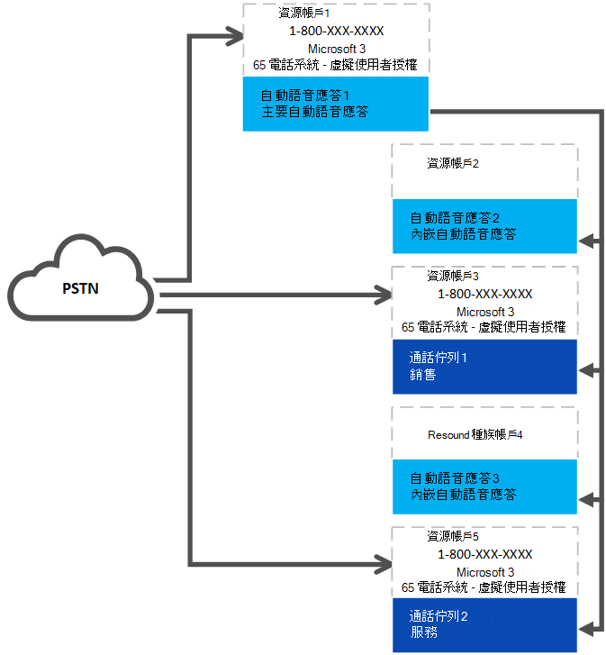

# 電話系統-虛擬使用者授權 

從2019年7月2日起，擁有電話系統授權的組織，現在可以取得免費的電話系統-虛擬使用者授權，或指派付費電話系統使用者授權給資源帳戶。 已不再需要通話方案。 所有自動語音應答或通話佇列都需要相關聯的資源帳戶。 需要電話號碼的資源帳戶必須具備免費的電話系統-虛擬使用者授權或付費電話系統使用者授權，才能將電話號碼套用至資源帳戶。

> [!TIP]
> 如果資源帳戶將用於未指派電話號碼的嵌套自動語音應答或通話佇列，就不需要授權。 如需參考，請參閱下列圖表： 

## 虛擬使用者授權分派

您的組織會根據其總體大小，為您的組織分派電話系統-虛擬使用者授權。 已新增至少有一項授權（包括電話系統或已加入手機系統）的任何組織，都有25個可用的虛擬使用者授權（無成本）。 當您在組織中新增10個電話系統使用者授權時，另一個電話系統會推出 [虛擬使用者授權]。

> [!NOTE]
> [電話系統] 是 Office 365 E1 和 E3 提供的附加元件授權。 電話系統也會包含在 Office 365 E5 授權中。

如果您的組織在建立自動語音應答或通話佇列節點時，使用 [可用的免費電話系統] （虛擬使用者授權），您仍然可以將付費電話系統授權用於資源帳戶。 大多陣列織會根據縮放方案，擁有足夠的虛擬使用者授權。 

### 授權分派範例

Contoso，Inc. 購買包含電話系統的600授權（每位員工一個）。 Contoso 已被分派初始25加60手機系統–虛擬使用者授權（共85個）。 其組織具有電話號碼的90通話佇列和自動語音應答。 他們需要指派所有的電話系統-虛擬使用者授權，並取得五個標準價格的電話系統授權。 

Contoso 應該考慮重新設計自動語音應答及呼叫佇列系統。 如果他們使用較少的電話號碼，以及不需要電話號碼的嵌套節點，他們就能簡化實施並減少成本。 

## 如何取得電話系統-虛擬使用者授權 

> [!NOTE] 
> 遵循這些指示時，請關閉 [預覽] 模式來購買電話系統-虛擬使用者授權。

1. 登入 Microsoft 365 系統管理中心。
2. 移至**帳單** > **購買服務** > **附加元件訂閱**
3. 滾動到結尾，找出「**電話系統-虛擬使用者**」授權。 選取 [**立即購買**]。

> [!WARNING]
> 請記住，即使是成本為零，您仍然必須**購買**授權。 

## 變更現有的資源帳戶以使用電話系統-虛擬使用者授權

如果您決定將資源帳戶上的授權從電話系統授權切換至電話系統，即虛擬使用者授權： 

1. 取得新的電話系統-虛擬使用者授權。 
2. 遵循 Microsoft 365 系統管理中心的連結步驟，[將使用者移至不同的訂閱](https://docs.microsoft.com/office365/admin/subscriptions-and-billing/assign-licenses-to-users?redirectSourcePath=%252farticle%252f997596b5-4173-4627-b915-36abac6786dc&view=o365-worldwide#move-users-to-a-different-subscription)。 

> [!WARNING]
> 在相同的授權活動中，請務必移除完整的電話系統授權，並指派電話系統（虛擬使用者授權）。 如果您移除舊的授權，請儲存帳戶變更、新增授權，然後再次儲存帳戶設定，資源帳戶可能無法如期運作。 如果發生這種情況，我們建議您為手機系統（虛擬使用者授權）建立新的資源帳戶，並移除中斷的資源帳戶。 

## 相關資訊

[自動語音應答和通話佇列服務更新](https://techcommunity.microsoft.com/t5/Microsoft-Teams-Blog/Auto-Attendant-and-Call-Queues-Service-Update/ba-p/564521)

[在 Microsoft Teams 中管理資源帳戶](../manage-resource-accounts.md)
