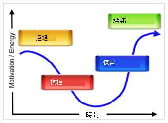

# 貴組織準備好Microsoft Teams？

現在，您的專案小組已經一起合作，而且您開始Teams組織可以做些什麼，因此評估貴組織是否準備好進行Teams很重要。 若要評估您的準備狀態，您必須：

1. 評估您的專案關係人。
2. 識別早期採用者。
3. 評估組織是否做好變更的準備。 

## 評估您的專案關係人

列出貴組織中的核心專案關係人及企業領導者。 針對每個人，請詢問下列問題：
 
1. 這個領導者是否對新技術很親切？
2. 為這位領導者對目前技術的滿意程度評分。
3. 這位領導者是否願意使用未經檢查的技術來加速結果，或為小組成員創造更好的體驗？
4. 這個領導者在提供關鍵業務結果時，是否受到高壓力？ 
5. 這位領導者願意將他/她的經驗傳Teams來協助轉場嗎？
6. 此領導者是否與現有專案小組的重要成員有正面關係？
7. 此領導者是否喜歡在組織中被視為「變更代理人」？  

您可以新增與貴組織相關的其他問題。 在啟動和 (試驗) 的兩個階段中，您會看到一些領導者，他們很善於變更、對目前的技術有些不滿意，而且與它們的關係也很好。 這些領導者應該會以商務顧問的名次加入核心專案小組，而且可能有專案對於您的實驗階段至關重要。 為初始實驗選取影響很大且實際的情況進行實驗，並避免高風險專案非常重要。
   
> [!NOTE]
> 雖然可以將分數指派給這類問卷，以將組織內部關係中人的因素影響降到最低，但推動變革取決於團隊的化學程度，以及團隊的技術技能或商務才能。 當您為後續階段選取專案和教職員時，請與您的小組成員一起審查這份清單，以討論您各個領導者對這個專案的「適合」。 

## 識別早期採用者

無論貴組織的規模或產業大小，早期採用者都具備某些特性。 一般來說，早期採用者會分享這些特性：

- 對技術感興趣
- 願意參與變更
- 尋求改善
- 自然共同合作
- 願意與群組分享他們的觀察和學習
- 是風險承擔者;也就是說，他們願意嘗試一些專案，看看是否有效

在應用程式或Microsoft 365 Office 365，允許這些人員加入宣告您早期採用者計畫Teams。 視貴組織的大小和複雜度，您可以選擇為實驗階段啟用部分或所有這些人員。 在此專案中，他們同意積極參與您的實驗階段，並定期向專案小組提供意見回饋。 避免讓只想測試新技術的個人。 讓他們知道，提供這個主動的意見回饋，有助於打造您的專案成果。 您將在階段 2 - 實驗中使用此 [人員清單](teams-adoption-phase2-experiment.md)。

我們的早期採用者計劃指南是一項實用的資源，可于您的環境中啟動此計畫。  
 
## 評估貴組織是否做好變更的準備

變更是一個與技術無關的人程式。 有行為心理和神經科學教育我們關於自然對變更的抗性。 若要讓變更成為可接受的，請務必預測使用者的需求、表達您對於他們狀況的理解，以及建立能改善這種情況的解決方案。 即使這麼做，您也會遇到自然的變化阻力。  

每個組織的方法都會根據地區、工作風格、專業設定檔及組織的其他元素而改變。 若要評估貴組織的準備狀態，請參閱 [評估組織變更準備狀態](upgrade-org-change-readiness.md)。 使用指導方針來回答下列問題：

1. 每個資料桶的使用者百分比如何？  (*變更抗)*
    - **早期採用者**：在提供解決方案之前先要求解決方案。
    - **通知使用者**：一旦解決方案的價值得到驗證，請使用解決方案。
    - **異見者**：推回任何變更。
    
   > [!TIP]
   > 早期採用者會成為出色的試驗測試人員和同儕。 採用新工具的速度緩慢的使用者需要額外的鼓勵，並需要更多時間來調整。 

2. 使用者對於變更的能力是什麼？  (*訓練)*
    - **自我啟動器** 只需要影片的連結。
    - **小組建立者** 在群組訓練中表現良好。
    - **一對一學習者需要** 個人支援。

    > [!TIP]
    > 根據能力和角色量身訂做訓練的類型和數量。 隨著新功能上線，持續更新訓練。

3. 除了此服務部署之外，還有多少其他變更正在進行中？  (*適)*  變更可能包括Office/Windows、辦公室移動、合併、重新組織等等。
    - 無
    - 1-3 個變更
    - 超過 3 個變更
 
    > [!TIP] 
    > 太多變更可能會阻礙接受和生產力。 如果正在進行超過 3 個變更，請考慮將變更間距縮小或建立主題以將變更組合在一起。  

將這些資料與專案關係人設定檔和想要加入早期採用者計畫的員工合併。 這樣一來，您即可識別準備好要接受的群組，並可以在現有職責旁邊接受變更。 這個方法將允許您在變更中建立合作夥伴。

您可以使用內部支援者來解決變更類型不同的問題。 在這裡，意見回饋是成功的關鍵：鼓勵人員分享其挑戰和需求。 在實驗期間，讓這些人或群組坐在桌旁，以歡迎干擾者和異見者。 這項最佳做法會為更順暢地部署您的共同合作改進專案鋪平道路。  

 下一步[：Microsoft Teams採用階段 2：實驗](teams-adoption-phase2-experiment.md) 
